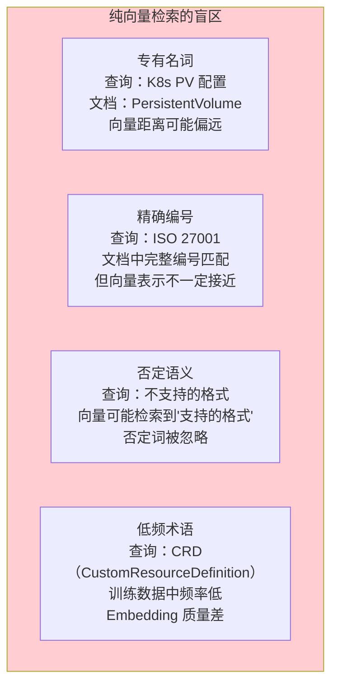
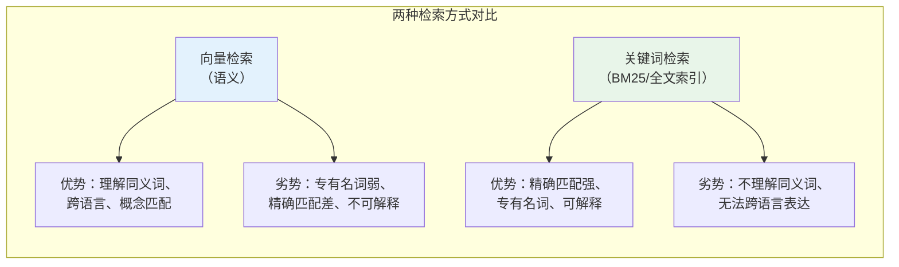
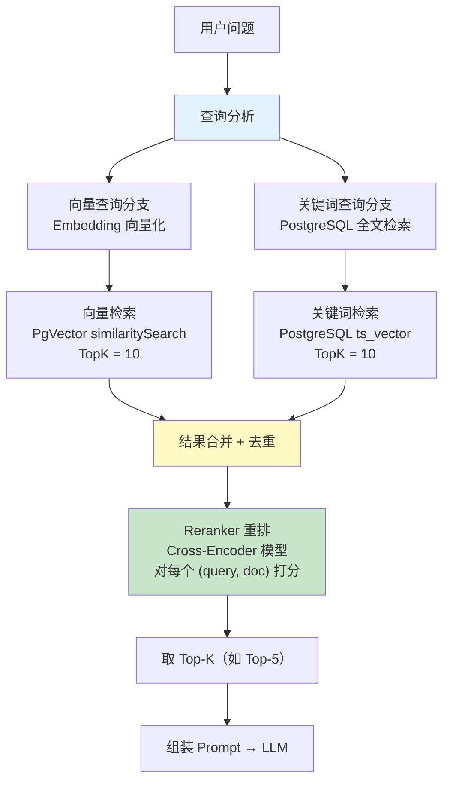
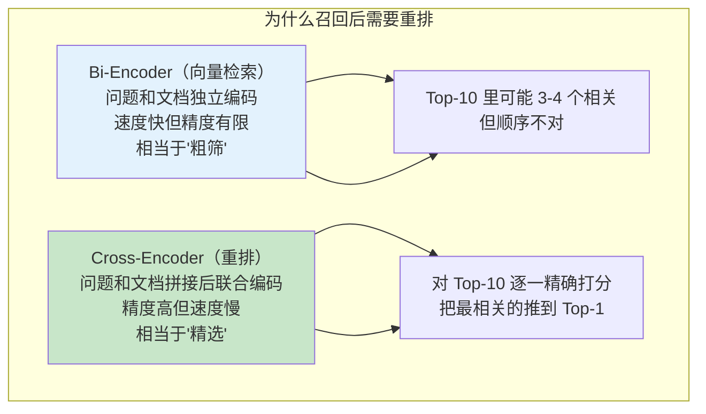
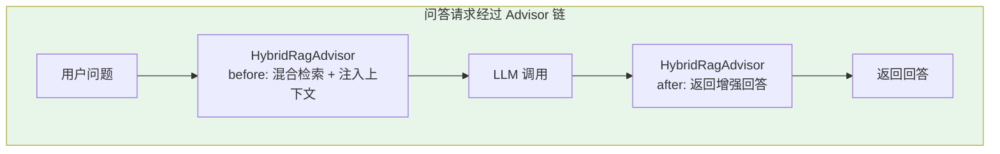
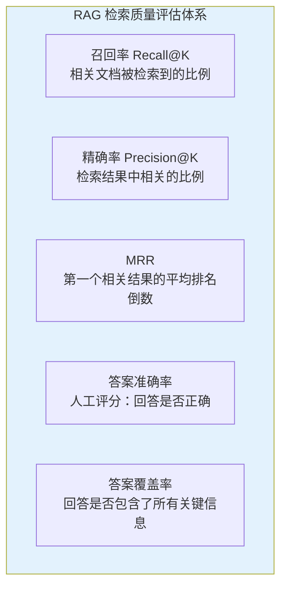

# 03-多源检索与重排

> **定位**：迭代二——将文档问答系统的检索能力从"纯向量检索"升级为"混合检索 + Reranker 重排"——同时利用语义检索和关键词检索的优势，通过交叉编码器重排模型把最相关的文档块推到前面。这是把 RAG 从"能用"提升到"好用"的关键一步。本文给出**完整可手写代码**。
>
> **读者画像**：已完成迭代一，系统已能处理多格式文档，需要提升检索精度和回答质量的开发者。
>
> **前置阅读**：[02-文档解析与向量化](02-文档解析与向量化.md)、[教程 01-WebFlux与响应式编程/04-WebFlux-vs-MVC 链与拦截器](../../教程/02-SpringAI核心机制/01-Advisor链与拦截器.md)、[教程 05-Observation可观测/02-组件交互：Registry、Handler、Convention、Filter协作 RAG 与 Agentic RAG](../../教程/08-架构师进阶/01-高级RAG与AgenticRAG.md)。API 真实性以 [附录 05-SpringAI2-API基准](../../附录/05-SpringAI2-API基准/00-Advisor与ChatMemory.md) 为准。

---

## 1. 四问

| 问 | 答 |
|----|----|
| **新增了什么需求** | 混合检索（向量 + 关键词双路召回）、Reranker 重排、LLM 原生引用标注、检索质量量化评估 |
| **影响了哪些模块** | 新增 `RetrievalService`/`RerankService`/`KeywordSearchRepository`/`HybridRagAdvisor`；改造 `AiConfig`（注册 Advisor）、`QaService`（检索移入 Advisor 链）、`QaResponse`（citations 版）；pom 追加 JDBC |
| **架构如何演进** | 检索从"QaService 内联调用"演进为"Advisor 链声明式注入"：QaService 只调 ChatClient，混合检索完全内聚在 `HybridRagAdvisor` 中；检索策略升级为两阶段"召回（双路 Top-10）→ 精排（重排取 Top-5）" |
| **上一版痛点是什么** | ① 纯向量检索对专有名词（K8s PV）、精确编号（ISO 27001）召回率低 ② 最相关块不一定排第一 ③ 检索逻辑散落在 QaService ④ 回答引用来源是后补的，非 LLM 原生生成 |

> **本节核对（四问完整性）**：① "新增需求"四项与后文 §4-§8 各模块一一对应；② "上一版痛点"四条即迭代一遗留（纯向量盲区/排序/散落/后补引用），本文逐条给出解法——两条通过即本节达标。

## 2. 为什么需要混合检索

### 2.1 纯向量检索的天花板

迭代一的系统使用纯向量检索——把用户问题和文档块都转为向量，用余弦相似度找最接近的。这在语义理解层面很强，但在以下场景中明显不足：



### 2.2 向量检索 vs 关键词检索



两种方式恰好互补。混合检索的核心思路是 **同时用两种方式检索，合并结果**——向量检索负责语义理解，关键词检索负责精确匹配，兼得两者优势。

> **高级 RAG 检索策略深入** → [教程 05-Observation可观测/02-组件交互：Registry、Handler、Convention、Filter协作 RAG 与 Agentic RAG](../../教程/08-架构师进阶/01-高级RAG与AgenticRAG.md)：教程详细讲解了混合检索多路召回的架构、Reranker 重排的原理（Cross-Encoder vs Bi-Encoder），以及 Agentic RAG 如何让 Agent 自主决策检索深度和策略。

### 2.3 总体架构



两阶段检索的本质是"召回 + 精排"：

| 阶段 | 目标 | 方法 | 数量 |
|------|------|------|------|
| **召回（Recall）** | 尽可能找全相关文档 | 向量检索 + 关键词检索双路并行 | 每路 Top-10，合并后约 15-20 |
| **精排（Re-rank）** | 把最相关的排在最前面 | Cross-Encoder 重排模型 | 取 Top-5 |

### 2.4 本节核对（两阶段架构理解）

| # | 核对项 | 通过判据 |
|---|--------|---------|
| 1 | 能说出向量/关键词检索各自的优劣与互补点 | 向量=语义强/专有名词弱；关键词=精确强/同义词弱 |
| 2 | 能说出召回/精排两阶段的数量与工具 | 双路 Top-10 合并 15-20 → Cross-Encoder 取 Top-5 |
| 3 | 总体架构图与 §6.2 代码常量一致 | RECALL_TOP_K=10、FINAL_TOP_K=5 |

---

## 3. pom.xml 与配置追加

在 [02-迭代一](02-文档解析与向量化.md) 的 pom.xml 基础上追加 JDBC（关键词全文检索用 `JdbcClient`）：

```xml
        <!-- 追加（迭代二）：JDBC —— 关键词全文检索（JdbcClient） -->
        <dependency>
            <groupId>org.springframework.boot</groupId>
            <artifactId>spring-boot-starter-jdbc</artifactId>
        </dependency>
```

> 需在 pom.xml 中添加依赖。WebClient 已随 `spring-boot-starter-webflux` 提供，无需新增。

`application-docassistant.yaml` 追加重排服务配置：

```yaml
app:
  rerank:
    endpoint: ${RERANK_ENDPOINT:http://localhost:8000}  # 本地部署的 BGE-Reranker 服务地址
    top-k: 5
```

**数据库准备（PostgreSQL 全文检索索引）**：

```sql
-- 为文档内容创建全文检索索引
-- tsvector 是 PostgreSQL 的全文检索数据类型
ALTER TABLE vector_store ADD COLUMN IF NOT EXISTS tsv tsvector;

-- 使用中文分词需要 zhparser 扩展，英文用默认配置
-- 这里用 simple 配置演示
UPDATE vector_store
SET tsv = to_tsvector('simple', content);

-- 创建 GIN 索引加速全文检索
CREATE INDEX IF NOT EXISTS vector_store_tsv_idx
    ON vector_store USING gin(tsv);
```

### 3.1 本节测试与验证（依赖、重排配置与全文索引）

**前置条件**：迭代一（[02]）已通过；PostgreSQL 中 vector_store 已有数据。

**材料——依赖树与索引核对命令**：

```bash
mvn dependency:tree -Dincludes=org.springframework.boot:spring-boot-starter-jdbc
psql -U docassistant -d docassistant -c "\d vector_store"          # tsv 列与索引
psql -U docassistant -d docassistant \
  -c "SELECT id, ts_rank(tsv, plainto_tsquery('simple', 'ISO 27001')) AS rank FROM vector_store WHERE tsv @@ plainto_tsquery('simple', 'ISO 27001') LIMIT 5;"
```

**步骤与断言**：

| # | 操作 | 预期（PASS 判据） |
|---|------|------------------|
| 1 | 追加 JDBC 依赖块后 `mvn clean compile` | BUILD SUCCESS |
| 2 | 材料第二条 | 旧数据行 tsv 为 NULL → 执行材料 UPDATE 回填后非空；`vector_store_tsv_idx` 存在 |
| 3 | 材料第三条（假设库中有含该编号的文档） | 返回行 rank > 0（全文检索可命中） |
| 4 | 核对 application-docassistant.yaml | 含 `app.rerank.endpoint`（`${RERANK_ENDPOINT}` 占位）与 `top-k: 5` |

**失败排查**：tsv 全 NULL→只 ALTER 未 UPDATE，或新写入行无触发器回填（本迭代靠手动 UPDATE，新上传后需重跑）；查询报 `operator does not exist`→tsv 列未创建；rank 全 0→'simple' 配置不分词中文（§10 排查项同源）。

---

## 4. 关键词检索实现

### 4.1 `KeywordSearchResult.java`

```java
package com.example.docassistant.api.dto;

import java.util.Map;

/**
 * 关键词全文检索结果（一行对应 vector_store 表的一条记录）
 */
public record KeywordSearchResult(
        String id,
        String content,
        Map<String, Object> metadata,
        double rankScore   // PostgreSQL ts_rank 相关度分数
) {}
```

### 4.2 `KeywordSearchRepository.java`

```java
package com.example.docassistant.repository;

import com.example.docassistant.api.dto.KeywordSearchResult;
import com.fasterxml.jackson.databind.ObjectMapper;
import org.springframework.jdbc.core.simple.JdbcClient;
import org.springframework.stereotype.Repository;

import java.util.List;
import java.util.Map;

/**
 * PostgreSQL 全文检索——直接查询 Spring AI 的 vector_store 表
 */
@Repository
public class KeywordSearchRepository {

    private static final String KEYWORD_SEARCH_SQL = """
            SELECT id, content, metadata,
                   ts_rank(tsv, plainto_tsquery('simple', :query)) AS rank
            FROM vector_store
            WHERE tsv @@ plainto_tsquery('simple', :query)
            ORDER BY rank DESC
            LIMIT :limit
            """;

    private final JdbcClient jdbc;
    private final ObjectMapper objectMapper;

    public KeywordSearchRepository(JdbcClient jdbc, ObjectMapper objectMapper) {
        this.jdbc = jdbc;
        this.objectMapper = objectMapper;
    }

    public List<KeywordSearchResult> search(String query, int limit) {
        return jdbc.sql(KEYWORD_SEARCH_SQL)
                .param("query", query)
                .param("limit", limit)
                .query((rs, rowNum) -> new KeywordSearchResult(
                        rs.getString("id"),
                        rs.getString("content"),
                        parseJson(rs.getString("metadata")),
                        rs.getDouble("rank")))
                .list();
    }

    @SuppressWarnings("unchecked")
    private Map<String, Object> parseJson(String json) {
        if (json == null || json.isBlank()) {
            return Map.of();
        }
        try {
            return objectMapper.readValue(json, Map.class);
        } catch (Exception e) {
            return Map.of();
        }
    }
}
```

**关键点**：

- `plainto_tsquery`：将用户输入的查询转为 tsquery 格式，自动处理分词。
- `ts_rank`：基于词频计算相关性分数，用于排序。
- `@@` 操作符：检查 tsvector 是否匹配 tsquery，利用 GIN 索引加速。
- `JdbcClient`（Spring 6.1+）是 Spring 官方推荐的 JDBC 访问方式，相比 `JdbcTemplate` 更简洁；`metadata` 是 JSONB 列，JDBC 驱动以字符串返回，用 Jackson 反序列化为 Map。

### 4.3 本节测试与验证（关键词检索链路）

**前置条件**：§3.1 PASS；§4.2 代码手写完成；库中有含专有名词（如 "PersistentVolume"）的英文/中英混排块。

**材料——仓库直查 + 接口联测**：

```bash
# A. 直接 SQL（与 KEYWORD_SEARCH_SQL 等价）
psql -U docassistant -d docassistant -c \
  "SELECT id, ts_rank(tsv, plainto_tsquery('simple', 'PersistentVolume')) AS rank FROM vector_store WHERE tsv @@ plainto_tsquery('simple', 'PersistentVolume') ORDER BY rank DESC LIMIT 10;"
```

**步骤与断言**：

| # | 操作 | 预期（PASS 判据） |
|---|------|------------------|
| 1 | `mvn clean compile`（§4.1/§4.2 手写后） | BUILD SUCCESS；`JdbcClient` Bean 可注入（starter-jdbc 已引） |
| 2 | 材料 A SQL | 返回 ≤10 行、rank 降序，含正文有该词的块 |
| 3 | 写单测调 `keywordSearchRepo.search("PersistentVolume", 10)` | 行数与 SQL 一致；metadata 为 Map（JSON 反序列化成功，非空 Map 或容错空 Map） |
| 4 | 中文词查询（如"报销"） | simple 配置下整串不分词——预期命中差或不中，这是已知局限（zhparser 方案见 §3 注释），记录现象即可 |

**失败排查**：SQL 有结果而 Java 空→参数绑定/`plainto_tsquery` 配置名不一致；metadata 抛错→parseJson 已容错返回空 Map，若仍抛说明 JSON 列格式非对象；中文不中→配 zhparser 或至少 pg_jieba（超本文范围，标注演进项）。

---

## 5. Reranker 重排

### 5.1 为什么需要重排

向量检索和关键词检索各有局限——即使两路都召回了，**最相关的文档块不一定排在第一位**。原因在于：



Bi-Encoder（Embedding 模型）将问题和文档分别编码为向量，然后用余弦相似度比较——效率高但精度有限。Cross-Encoder 将问题和文档拼接后一起输入 Transformer 模型，输出一个精确的相关性分数——精度高但每对 (query, doc) 都要一次模型推理，不适合大规模检索，只适合对召回结果做精排。

### 5.2 `RerankProperties.java`

```java
package com.example.docassistant.config;

import lombok.Getter;
import lombok.Setter;
import org.springframework.boot.context.properties.ConfigurationProperties;
import org.springframework.stereotype.Component;

@Component
@ConfigurationProperties(prefix = "app.rerank")
@Getter
@Setter
public class RerankProperties {

    private String endpoint = "http://localhost:8000";

    private int topK = 5;
}
```

### 5.3 `RerankService.java`

```java
package com.example.docassistant.service;

import com.example.docassistant.api.dto.SearchResult;
import com.example.docassistant.config.RerankProperties;
import org.springframework.stereotype.Service;
import org.springframework.web.reactive.function.client.WebClient;
import reactor.core.publisher.Mono;

import java.util.Comparator;
import java.util.List;

/**
 * 重排服务——调用本地部署的 Cross-Encoder 重排模型（如 BGE-Reranker-v2）
 */
@Service
public class RerankService {

    private final WebClient rerankClient;

    public RerankService(WebClient.Builder builder, RerankProperties properties) {
        this.rerankClient = builder.baseUrl(properties.getEndpoint()).build();
    }

    /**
     * 对检索结果重排（同步版本，供 Advisor 同步链路调用）
     */
    public List<SearchResult> rerank(String query,
                                     List<SearchResult> candidates,
                                     int topK) {
        if (candidates.size() <= topK) {
            // 候选数量已经少于 topK，无需重排
            return candidates;
        }

        // 调用重排模型 API
        RerankResponse response = rerankClient.post()
                .uri("/rerank")
                .bodyValue(new RerankRequest(query,
                        candidates.stream().map(SearchResult::content).toList()))
                .retrieve()
                .bodyToMono(RerankResponse.class)
                .block();  // ⚠ 演示用同步等待；生产环境走 rerankReactive 响应式链

        // 按重排分数重新排序
        return response.scores().stream()
                .sorted(Comparator.comparingDouble(RerankScore::score).reversed())
                .limit(topK)
                .map(score -> rebuildResult(candidates, score))
                .toList();
    }

    /**
     * 响应式重排版本（WebFlux 生产推荐，不阻塞 EventLoop）
     */
    public Mono<List<SearchResult>> rerankReactive(String query,
                                                   List<SearchResult> candidates,
                                                   int topK) {
        if (candidates.size() <= topK) {
            return Mono.just(candidates);
        }
        return rerankClient.post()
                .uri("/rerank")
                .bodyValue(new RerankRequest(query,
                        candidates.stream().map(SearchResult::content).toList()))
                .retrieve()
                .bodyToMono(RerankResponse.class)
                .map(response -> response.scores().stream()
                        .sorted(Comparator.comparingDouble(RerankScore::score).reversed())
                        .limit(topK)
                        .map(score -> rebuildResult(candidates, score))
                        .toList());
    }

    private SearchResult rebuildResult(List<SearchResult> candidates, RerankScore score) {
        SearchResult original = candidates.get(score.index());
        return new SearchResult(
                original.id(),
                original.content(),
                original.metadata(),
                score.score(),    // 用重排分数替换原始相似度
                original.source() // 保留检索来源标记
        );
    }

    // DTO 定义
    public record RerankRequest(String query, List<String> documents) {}
    public record RerankResponse(List<RerankScore> scores) {}
    public record RerankScore(int index, double score) {}
}
```

**重排模型选择**：

| 模型 | 类型 | 特点 | 部署方式 |
|------|------|------|---------|
| BGE-Reranker-v2 | Cross-Encoder | 中文效果好、速度快 | 本地部署 |
| Cohere Rerank | API 服务 | 质量稳定、无需 GPU | API 调用 |
| Jina Reranker | Cross-Encoder | 开源、多语言 | 本地 / API |

本项目推荐 BGE-Reranker-v2 本地部署，中文企业文档场景下效果最优且无额外 API 成本。

### 5.4 本节测试与验证（Reranker 服务）

**前置条件**：本地 BGE-Reranker-v2 服务已在 `${RERANK_ENDPOINT}`（默认 :8000）启动；§5.2/§5.3 代码手写完成。

**材料——重排接口直探与单测**：

```bash
curl -X POST http://localhost:8000/rerank \
  -H "Content-Type: application/json" \
  -d '{"query":"K8s PV 挂载","documents":["PersistentVolume 配置方法","报销流程说明","PersistentVolumeClaim 绑定"]}'
```

```java
package com.example.docassistant.service;

import com.example.docassistant.api.dto.SearchResult;
import com.example.docassistant.config.RerankProperties;
import org.junit.jupiter.api.DisplayName;
import org.junit.jupiter.api.Test;
import org.springframework.web.reactive.function.client.WebClient;

import java.util.List;
import java.util.Map;

import static org.junit.jupiter.api.Assertions.assertEquals;

/**
 * 重排短路单测——候选 ≤ topK 时不发 HTTP 请求（RerankService 第一分支），原列表返回。
 * 短路路径不触网，WebClient.Builder 仅用于构造 Bean。
 */
class RerankServiceShortCircuitTest {

    @Test
    @DisplayName("候选数量 ≤ topK 时短路：不发请求，原列表返回")
    void shortCircuitWhenCandidatesBelowTopK() {
        // fixture：两个候选，topK=5 —— 2 <= 5 命中短路分支
        SearchResult sr1 = new SearchResult(
                "chunk-0001", "PersistentVolume 配置方法",
                Map.of("title", "K8s 存储指南"), 0.92, "VECTOR");
        SearchResult sr2 = new SearchResult(
                "chunk-0002", "报销流程说明",
                Map.of("title", "财务制度"), 0.05, "KEYWORD");

        RerankService rerankService = new RerankService(
                WebClient.builder(), new RerankProperties());

        List<SearchResult> two = List.of(sr1, sr2);
        assertEquals(two, rerankService.rerank("q", two, 5));   // 短路分支：原样返回（record equals）
    }
}
```

**步骤与断言**：

| # | 操作 | 预期（PASS 判据） |
|---|------|------------------|
| 1 | 材料 curl 直探重排服务 | 返回 `{"scores":[{"index":0,"score":…},…]}`，PV 相关两句 index 0/2 分数高于 index 1 |
| 2 | 材料 curl | `mvn clean compile` 通过；`RerankProperties` 从 yml 读到 endpoint/topK |
| 3 | 短路单测 | 候选 2 个、topK=5 时不发起 HTTP 调用（mock WebClient 验证零调用），原列表返回 |
| 4 | 8 个候选调 `rerank`（topK=5） | 返回 5 个、按 score 降序、`score` 字段被重排分数替换、`source` 保留原值 |

**失败排查**：连接拒绝→重排服务未启动或 `app.rerank.endpoint` 配错；分数没换→`rebuildResult` 仍用原分数；返回数量不对→`limit(topK)` 缺失；`block()` 报阻警告→同步版仅限 Advisor 链/弹性线程调用（§8.2 已隔离），WebFlux 路径走 `rerankReactive`。

---

## 6. 混合检索编排

### 6.1 `SearchResult.java`

```java
package com.example.docassistant.api.dto;

import java.util.Map;

/**
 * 统一检索结果——向量/关键词/混合三种来源共用
 */
public record SearchResult(
        String id,
        String content,
        Map<String, Object> metadata,
        double score,
        String source    // VECTOR / KEYWORD / HYBRID
) {}
```

### 6.2 `RetrievalService.java`

```java
package com.example.docassistant.service;

import com.example.docassistant.api.dto.SearchResult;
import com.example.docassistant.repository.KeywordSearchRepository;
import org.springframework.ai.document.Document;
import org.springframework.ai.vectorstore.SearchRequest;
import org.springframework.ai.vectorstore.VectorStore;
import org.springframework.stereotype.Service;

import java.util.ArrayList;
import java.util.LinkedHashMap;
import java.util.List;
import java.util.Map;

@Service
public class RetrievalService {

    private final VectorStore vectorStore;
    private final KeywordSearchRepository keywordSearchRepo;
    private final RerankService rerankService;

    // 每路召回数量
    private static final int RECALL_TOP_K = 10;
    // 重排后最终保留数量
    private static final int FINAL_TOP_K = 5;
    // 向量检索相似度阈值
    private static final double SIMILARITY_THRESHOLD = 0.65;

    public RetrievalService(VectorStore vectorStore,
                            KeywordSearchRepository keywordSearchRepo,
                            RerankService rerankService) {
        this.vectorStore = vectorStore;
        this.keywordSearchRepo = keywordSearchRepo;
        this.rerankService = rerankService;
    }

    /**
     * 混合检索 + 重排：向量召回 + 关键词召回 → 合并去重 → Reranker 精排
     */
    public List<SearchResult> hybridSearch(String query) {
        List<SearchResult> vectorResults = vectorSearch(query);
        List<SearchResult> keywordResults = keywordSearch(query);
        List<SearchResult> merged = mergeAndDedupe(vectorResults, keywordResults);
        return rerankService.rerank(query, merged, FINAL_TOP_K);
    }

    /**
     * 向量检索（语义召回）
     */
    private List<SearchResult> vectorSearch(String query) {
        List<Document> docs = vectorStore.similaritySearch(
                SearchRequest.builder()
                        .query(query)
                        .topK(RECALL_TOP_K)
                        .similarityThreshold(SIMILARITY_THRESHOLD)
                        .build());

        return docs.stream()
                .map(doc -> new SearchResult(
                        doc.getId(),
                        doc.getText(),
                        doc.getMetadata(),
                        doc.getMetadata().get("distance") instanceof Number n
                                ? n.doubleValue()
                                : 0.0,
                        "VECTOR"))
                .toList();
    }

    /**
     * 关键词检索（精确召回）
     */
    private List<SearchResult> keywordSearch(String query) {
        return keywordSearchRepo.search(query, RECALL_TOP_K).stream()
                .map(r -> new SearchResult(
                        r.id(),
                        r.content(),
                        r.metadata(),
                        r.rankScore(),
                        "KEYWORD"))
                .toList();
    }

    /**
     * 合并 + 去重（同一个文档块可能同时被两种方式检索到）
     */
    private List<SearchResult> mergeAndDedupe(List<SearchResult> vector,
                                              List<SearchResult> keyword) {
        Map<String, SearchResult> merged = new LinkedHashMap<>();

        // 向量结果先入（保持顺序）
        vector.forEach(r -> merged.put(r.id(), r));

        // 关键词结果补充（如果已在向量结果中，标记为 HYBRID 来源）
        for (SearchResult kr : keyword) {
            merged.merge(kr.id(), kr, (existing, incoming) -> new SearchResult(
                    existing.id(),
                    existing.content(),
                    existing.metadata(),
                    Math.max(existing.score(), incoming.score()),
                    "HYBRID"));
        }

        return new ArrayList<>(merged.values());
    }
}
```

**合并去重策略的精妙之处**：

当一个文档块同时被向量检索和关键词检索召回时，它的来源被标记为 `HYBRID`——这通常意味着它是高质量结果（两种检索方式都认为它相关）。这些 `HYBRID` 来源的文档块在后续 Prompt 组装中会被优先放置。

### 6.3 本节测试与验证（双路召回与合并去重）

**前置条件**：§4.3、§5.4 PASS；向量路与关键词路均可独立返回结果。

**材料——合并去重单测（完整测试类，纯逻辑 + Mockito，不需外部服务）**：

```java
package com.example.docassistant.service;

import com.example.docassistant.api.dto.KeywordSearchResult;
import com.example.docassistant.api.dto.SearchResult;
import com.example.docassistant.repository.KeywordSearchRepository;
import org.junit.jupiter.api.DisplayName;
import org.junit.jupiter.api.Test;
import org.springframework.ai.document.Document;
import org.springframework.ai.vectorstore.SearchRequest;
import org.springframework.ai.vectorstore.VectorStore;

import java.util.List;
import java.util.Map;

import static org.junit.jupiter.api.Assertions.assertEquals;
import static org.mockito.ArgumentMatchers.any;
import static org.mockito.ArgumentMatchers.anyInt;
import static org.mockito.ArgumentMatchers.anyList;
import static org.mockito.ArgumentMatchers.anyString;
import static org.mockito.Mockito.mock;
import static org.mockito.Mockito.when;

/**
 * 合并去重单测——mergeAndDedupe 是 private，这里经公开入口 hybridSearch 观察其行为，
 * 不修改包可见性、不改生产代码；三个依赖全部 mock（spring-boot-starter-test 自带 Mockito）。
 * 重排 mock 为恒等（原列表返回），隔离出纯 merge 语义。
 */
class RetrievalServiceMergeTest {

    @Test
    @DisplayName("双路命中同一 id：合并去重为一条，标 HYBRID、取较高分")
    void mergeAndDedupeMarksHybridAndTakesMaxScore() {
        // 构造：向量路 id=[x1, x2]、关键词路 id=[x2]（与向量路 B 块同 id，触发合并）
        Document docX1 = Document.builder().text("c1")
                .metadata(Map.of("distance", 0.9)).build();
        Document docX2 = Document.builder().text("c2")
                .metadata(Map.of("distance", 0.8)).build();

        VectorStore vectorStore = mock(VectorStore.class);
        when(vectorStore.similaritySearch(any(SearchRequest.class)))
                .thenReturn(List.of(docX1, docX2));

        KeywordSearchRepository keywordRepo = mock(KeywordSearchRepository.class);
        // ts_rank 量级远小于余弦相似度：0.05 vs 0.8
        when(keywordRepo.search(anyString(), anyInt()))
                .thenReturn(List.of(new KeywordSearchResult(docX2.getId(), "c2", Map.of(), 0.05)));

        RerankService rerankService = mock(RerankService.class);
        when(rerankService.rerank(anyString(), anyList(), anyInt()))
                .thenAnswer(inv -> inv.getArgument(1));   // 恒等：透传 merge 结果

        RetrievalService service = new RetrievalService(vectorStore, keywordRepo, rerankService);
        List<SearchResult> out = service.hybridSearch("q");

        // 断言 1：两路合计 3 条 → 去重后 2 条（id=x2 只出现一次）
        assertEquals(2, out.size());
        // 断言 2：合并条 source=HYBRID（双路命中标记）
        SearchResult merged = out.stream()
                .filter(r -> r.id().equals(docX2.getId()))
                .findFirst().orElseThrow();
        assertEquals("HYBRID", merged.source());
        // 断言 3：分数 = Math.max(0.8, 0.05) = 0.8（关键词低分不覆盖向量高分）
        assertEquals(0.8, merged.score());
        // 断言 4：向量路先入，x1 保持 VECTOR 来源、顺序在前
        assertEquals("VECTOR", out.get(0).source());
        assertEquals(docX1.getId(), out.get(0).id());
    }
}
```

**步骤与断言**：

| # | 操作 | 预期（PASS 判据） |
|---|------|------------------|
| 1 | 材料单测运行 | 两路合计 3 条 → 去重后 2 条（x2 只出现一次），x2 的 source=HYBRID、score=max(0.8, 0.05)=0.8 |
| 2 | 集成跑 `hybridSearch("ISO 27001")`（mock 重排为恒等） | 返回含 VECTOR 与 KEYWORD 两种来源（双路都参与了召回） |
| 3 | 集成跑语义问题（如"怎么请假"） | 向量路命中为主；关键词路允许为空不报错 |
| 4 | 断言常量 | RECALL_TOP_K=10 / FINAL_TOP_K=5 / SIMILARITY_THRESHOLD=0.65 与 §2.3 架构图口径一致 |

**失败排查**：B 出现两次→merge key 不是 `id`；HYBRID 未标→`merged.merge` 的 remap lambda 缺失；关键词路空导致整体空→检索前确保向量路优先入（顺序即 vector→keyword）；分数被关键词低分覆盖→`Math.max` 写反。

---

## 7. Advisor 链集成 RAG

### 7.1 `HybridRagAdvisor.java`（自定义混合检索 RAG Advisor，完整代码）

Spring AI 2.0 提供了 `QuestionAnswerAdvisor`——一个内置的 RAG Advisor。但我们的混合检索逻辑更复杂（双路召回 + 重排 + 引用标注），需要自定义 Advisor。按 [附录 05-SpringAI2-API基准] 基准：**实现 `CallAdvisor` / `StreamAdvisor` 双接口 + `adviseCall` / `adviseStream` + `chain.nextCall` / `chain.nextStream`**；需要 before/after 语义时继承 `BaseAdvisor` 实现 `before(ChatClientRequest, AdvisorChain)` / `after(ChatClientResponse, AdvisorChain)`（javap 实证：BaseAdvisor 在 2.0.0 真实存在，双参）。禁止的是**错误签名**（单参 before/after）与 `@ToolMethod` 等虚构 API。

```java
package com.example.docassistant.advisor;

import com.example.docassistant.api.dto.SearchResult;
import com.example.docassistant.service.RetrievalService;
import org.springframework.ai.chat.client.ChatClientRequest;
import org.springframework.ai.chat.client.ChatClientResponse;
import org.springframework.ai.chat.client.advisor.api.CallAdvisor;
import org.springframework.ai.chat.client.advisor.api.CallAdvisorChain;
import org.springframework.ai.chat.client.advisor.api.StreamAdvisor;
import org.springframework.ai.chat.client.advisor.api.StreamAdvisorChain;
import org.springframework.ai.chat.messages.Message;
import org.springframework.ai.chat.messages.MessageType;
import org.springframework.ai.chat.messages.UserMessage;
import org.springframework.ai.chat.prompt.Prompt;
import org.springframework.ai.chat.prompt.PromptTemplate;
import org.springframework.stereotype.Component;
import reactor.core.publisher.Flux;

import java.util.ArrayList;
import java.util.List;
import java.util.Map;
import java.util.Objects;
import java.util.stream.Collectors;

/**
 * 自定义混合检索 RAG Advisor
 * 在 LLM 调用之前：执行混合检索 → 将检索上下文注入到最后一条用户消息
 * 同时实现 CallAdvisor + StreamAdvisor，call() 与 stream() 都生效（真实 2.0 API）
 */
@Component
public class HybridRagAdvisor implements CallAdvisor, StreamAdvisor {

    private final RetrievalService retrievalService;
    private final PromptTemplate promptTemplate;

    private static final String DEFAULT_PROMPT_TEMPLATE = """
            以下是从企业文档中检索到的参考信息：

            {context}

            请严格基于以上参考信息回答用户问题。
            如果参考信息不足以回答，请明确说明。
            回答时请引用具体来源（来源标题 + 片段ID）。
            """;

    public HybridRagAdvisor(RetrievalService retrievalService) {
        this.retrievalService = retrievalService;
        this.promptTemplate = new PromptTemplate(DEFAULT_PROMPT_TEMPLATE);
    }

    @Override
    public ChatClientResponse adviseCall(ChatClientRequest request, CallAdvisorChain chain) {
        return chain.nextCall(applyRag(request));
    }

    @Override
    public Flux<ChatClientResponse> adviseStream(ChatClientRequest request, StreamAdvisorChain chain) {
        return chain.nextStream(applyRag(request));
    }

    /**
     * 混合检索 → 将检索上下文注入到最后一条用户消息前
     */
    private ChatClientRequest applyRag(ChatClientRequest request) {
        String question = extractUserText(request);
        if (question.isBlank()) {
            return request;
        }

        List<SearchResult> results = retrievalService.hybridSearch(question);
        if (results.isEmpty()) {
            return request;
        }

        // 组装上下文：带来源标题 + 片段ID，供 LLM 生成引用标注
        String context = results.stream()
                .map(r -> {
                    String title = String.valueOf(r.metadata().getOrDefault("title", "未知文档"));
                    return "【来源: " + title + " | 片段ID: " + r.id() + "】\n" + r.content();
                })
                .collect(Collectors.joining("\n\n---\n\n"));

        String augmentedQuestion = promptTemplate.render(Map.of(
                "context", context,
                "question", question));

        // 2.0.0 真实 API：ChatClientRequest 是 record(prompt, context)，没有 messages()/builder().from()
        // 改写请求走 request.mutate().prompt(...).build()（javap 实证）
        // 这里用「检索增强后的用户消息」替换 Prompt 中最后一个用户消息
        List<Message> messages = new ArrayList<>(request.prompt().getInstructions());
        for (int i = messages.size() - 1; i >= 0; i--) {
            if (messages.get(i).getMessageType() == MessageType.USER) {
                messages.set(i, new UserMessage(augmentedQuestion));
                break;
            }
        }
        Prompt newPrompt = new Prompt(messages, request.prompt().getOptions());

        return request.mutate()
                .prompt(newPrompt)
                .build();
    }

    private String extractUserText(ChatClientRequest request) {
        return request.prompt().getInstructions().stream()
                .filter(m -> m.getMessageType() == MessageType.USER)
                .map(Message::getText)
                .filter(Objects::nonNull)
                .reduce((a, b) -> b)
                .orElse("");
    }
}
```

**实现要点**：

1. **双接口实现**：同时实现 `CallAdvisor` 和 `StreamAdvisor`，`call()` 与 `stream()` 两种调用模式都自动经过混合检索。若只实现一个接口，另一种模式会绕过检索。

2. **洋葱模型**：`chain.nextCall(modified)` 放行修改后的请求；如果检索结果为空则原样放行（短路），不调用 `chain` 即为拦截。

3. **上下文格式化**：每个文档块用 `【来源: 标题 | 片段ID: xxx】` 前缀标注——LLM 识别出每段内容的来源，回答时能原生生成引用标注（`matchedChunkId` 有真实依据）。

> **Advisor 链深入** → [教程 01-WebFlux与响应式编程/04-WebFlux-vs-MVC 链与拦截器](../../教程/02-SpringAI核心机制/01-Advisor链与拦截器.md)：教程详细讲解了 Spring AI 2.0 的 Advisor 接口体系（`CallAdvisor`/`StreamAdvisor`）、执行链机制、`adviseCall`/`adviseStream` 责任链、Order 顺序控制。

### 7.2 注册 Advisor 到 ChatClient（更新 `AiConfig.java`）

```java
package com.example.docassistant.config;

import com.example.docassistant.advisor.HybridRagAdvisor;
import org.springframework.ai.chat.client.ChatClient;
import org.springframework.context.annotation.Bean;
import org.springframework.context.annotation.Configuration;

@Configuration
public class AiConfig {

    @Bean
    public ChatClient chatClient(ChatClient.Builder builder,
                                 HybridRagAdvisor hybridRagAdvisor) {
        return builder
                .defaultSystem("""
                    你是企业文档问答助手。请严格基于提供的参考文档回答用户问题。

                    规则：
                    1. 只使用参考文档中的信息回答，不要编造。
                    2. 如果参考文档中没有相关信息，请明确回答"根据现有文档，我无法回答这个问题"。
                    3. 回答时请标注信息来源（文档标题 + 相关段落）。
                    4. 保持简洁、专业、准确。
                    """)
                .defaultAdvisors(hybridRagAdvisor)
                .build();
    }
}
```

**声明式 RAG 的优势**：注册 Advisor 后，所有通过 `ChatClient` 发起的对话都会自动经过混合检索——Controller 层的 `QaService` 不需要任何修改，检索逻辑完全内聚在 Advisor 链中。这就是 Spring AI Advisor 模式的核心价值。



### 7.3 本节测试与验证（Advisor 双接口接线）

**前置条件**：§6.3 PASS；`AiConfig` 已注册 `hybridRagAdvisor`；重排服务在跑。

**材料——call/stream 双模式 curl**：

```bash
curl -X POST http://localhost:8081/api/qa -H "Content-Type: application/json" \
  -d '{"question": "K8s PV 怎么挂载？"}'

curl -N -X POST http://localhost:8081/api/qa/stream -H "Content-Type: application/json" \
  -d '{"question": "K8s PV 怎么挂载？"}'
```

**步骤与断言**：

| # | 操作 | 预期（PASS 判据） |
|---|------|------------------|
| 1 | `mvn clean compile`（HybridRagAdvisor 手写后） | 通过——`adviseCall(ChatClientRequest, CallAdvisorChain)` / `adviseStream(ChatClientRequest, StreamAdvisorChain)` 签名与附录 05 基准一致，`chain.nextCall/nextStream` 存在 |
| 2 | 材料 curl 同步 | 回答基于检索内容（非纯模型知识），说明 RAG 注入生效 |
| 3 | 材料 curl 流式 | 同样经过检索增强（stream 路径未绕过 Advisor） |
| 4 | 日志/断点观察 `applyRag` | 最后一条 UserMessage 被替换为含 `【来源: … | 片段ID: …】` 上下文的增强文本 |
| 5 | 检索无命中问题（库外问题） | 原样放行（request 未改写），LLM 按系统提示词拒答 |

**失败排查**：流式没走检索→只实现了 CallAdvisor（必须双接口）；编译报 `adviseRequest`/`chain.next()` 不存在→用了 1.x 错误签名，回查附录 05；UserMessage 未替换→`MessageType.USER` 过滤错或 messages 拷贝后未 set 回 Prompt；请求改写报 record 不可变→必须走 `request.mutate().prompt(...).build()`（正文注释同源）。

---

## 8. 引用来源标注

### 8.1 更新后的 `QaService.java`

迭代二让回答中包含 LLM 原生生成的引用标注，而不是像 Demo 那样后补 sources。混合检索逻辑已被 Advisor 封装，QaService 极简：

```java
package com.example.docassistant.service;

import com.example.docassistant.api.dto.QaRequest;
import com.example.docassistant.api.dto.QaResponse;
import org.springframework.ai.chat.client.ChatClient;
import org.springframework.stereotype.Service;
import reactor.core.publisher.Flux;

@Service
public class QaService {

    private final ChatClient chatClient;

    public QaService(ChatClient chatClient) {
        this.chatClient = chatClient;
    }

    public QaResponse answer(QaRequest request) {
        // ChatClient 内部通过 HybridRagAdvisor 自动执行混合检索
        return chatClient.prompt()
                .user(request.question())
                .call()
                .entity(QaResponse.class);
    }

    public Flux<String> answerStream(QaRequest request) {
        return chatClient.prompt()
                .user(request.question())
                .stream()
                .content();
    }
}
```

### 8.2 更新后的 `QaController.java`

```java
package com.example.docassistant.api;

import com.example.docassistant.api.dto.QaRequest;
import com.example.docassistant.api.dto.QaResponse;
import com.example.docassistant.service.QaService;
import org.springframework.beans.factory.annotation.Autowired;
import org.springframework.http.MediaType;
import org.springframework.web.bind.annotation.PostMapping;
import org.springframework.web.bind.annotation.RequestBody;
import org.springframework.web.bind.annotation.RequestMapping;
import org.springframework.web.bind.annotation.RestController;
import reactor.core.publisher.Flux;
import reactor.core.publisher.Mono;
import reactor.core.scheduler.Schedulers;

@RestController
@RequestMapping("/api/qa")
public class QaController {

    @Autowired
    private QaService qaService;

    @PostMapping
    public Mono<QaResponse> ask(@RequestBody QaRequest request) {
        return Mono.fromCallable(() -> qaService.answer(request))
                .subscribeOn(Schedulers.boundedElastic());
    }

    @PostMapping(value = "/stream", produces = MediaType.TEXT_EVENT_STREAM_VALUE)
    public Flux<String> askStream(@RequestBody QaRequest request) {
        return Flux.defer(() -> qaService.answerStream(request))
                .subscribeOn(Schedulers.boundedElastic());
    }
}
```

> `Flux.defer` + `subscribeOn(boundedElastic)`：Advisor 链内的混合检索是阻塞调用，推迟到订阅时在弹性线程池执行，避免阻塞 Netty EventLoop（WebFlux 铁律）。

### 8.3 更新后的 `QaResponse.java`（citations 版）

```java
package com.example.docassistant.api.dto;

import java.util.List;

/**
 * 结构化问答响应（迭代二：LLM 原生生成引用标注）
 */
public record QaResponse(
        String answer,                  // 回答正文
        List<Citation> citations,       // 引用标注（LLM 原生生成）
        boolean confident               // 是否有足够信心回答
) {
    public record Citation(
            String documentTitle,   // 文档标题
            String citedSection,    // LLM 引用的具体段落
            String matchedChunkId   // 匹配到的文档块 ID
    ) {}
}
```

LLM 在回答时被提示词约束为"回答时请标注信息来源"——它会自然地在回答中引用来源文档，同时通过结构化输出在 `citations` 字段中精确标注引用了哪些文档块的哪段内容（`matchedChunkId` 与检索结果 `SearchResult.id()` 对应）。

### 8.4 本节测试与验证（LLM 原生引用标注）

**前置条件**：§7.3 PASS；QaResponse 已换 citations 版。

**材料——引用核对 curl**：

```bash
curl -X POST http://localhost:8081/api/qa -H "Content-Type: application/json" \
  -d '{"question": "年假超过多少天需要总监审批？"}'
```

**步骤与断言**：

| # | 操作 | 预期（PASS 判据） |
|---|------|------------------|
| 1 | 材料 curl | 200；JSON 含 `answer` + `citations` + `confident` 三字段（旧 `sources` 字段已移除） |
| 2 | 核对 citations[].matchedChunkId | 能在 vector_store 中 `SELECT id FROM vector_store WHERE id='<matchedChunkId>'` 查到真实块（引用可回溯） |
| 3 | 核对 citedSection | 是该块内容的真实子串/概括，非编造段落 |
| 4 | 库外问题 | confident=false 且 citations 为空/answer 明确"无法回答" |
| 5 | 流式端点 | 正常逐 token 输出（结构化输出仅同步端点，流式不破坏） |

**失败排查**：matchedChunkId 查无此行→上下文前缀 `【来源… 片段ID: xxx】` 没进 Prompt（回查 §7.3 步骤 4）；LLM 编造 ID→System Prompt 未强调"引用只使用参考信息中给出的片段ID"；entity 解析失败→citations 嵌套 record 字段名与 Schema 不一致。

---

## 9. 检索质量评估

### 9.1 评估指标



### 9.2 评估脚本（测试工具，非生产代码）

构建一个包含 100 个问题和标准答案的评估集，对比纯向量检索 vs 混合检索 + 重排：

```java
package com.example.docassistant.eval;

import com.example.docassistant.api.dto.SearchResult;
import com.example.docassistant.service.RetrievalService;

import java.util.List;

/**
 * 检索质量评估（测试工具，不属于生产代码路径）
 */
public class RetrievalEvaluation {

    public record EvalCase(String question, String expectedChunkId) {}

    public record EvaluationResult(double recallAtK, double mrr) {
        @Override
        public String toString() {
            return "EvaluationResult[recallAtK=" + recallAtK + ", mrr=" + mrr + "]";
        }
    }

    public EvaluationResult evaluate(List<EvalCase> cases,
                                     RetrievalService retrievalService,
                                     int k) {
        int hitCount = 0;
        double mrrSum = 0;

        for (EvalCase cas : cases) {
            List<SearchResult> results = retrievalService.hybridSearch(cas.question());

            // 检查标准答案对应的文档块是否在 Top-K 中
            for (int i = 0; i < Math.min(results.size(), k); i++) {
                if (results.get(i).id().equals(cas.expectedChunkId())) {
                    hitCount++;
                    mrrSum += 1.0 / (i + 1);  // MRR
                    break;
                }
            }
        }

        double recall = (double) hitCount / cases.size();
        double mrr = mrrSum / cases.size();
        return new EvaluationResult(recall, mrr);
    }
}
```

**典型对比结果**（企业文档问答场景，100 评估集）：

| 指标 | 纯向量检索 | 混合检索 + 重排 | 提升 |
|------|-----------|-----------------|------|
| Recall@5 | 72% | 89% | +17pp |
| Recall@10 | 85% | 94% | +9pp |
| MRR | 0.51 | 0.73 | +43% |
| 答案准确率 | 68% | 84% | +16pp |

混合检索 + 重排在所有指标上都有显著提升，尤其是 MRR（平均倒数排名）提升 43%——这意味着最相关的文档块更频繁地出现在检索结果的前列，直接影响 LLM 的回答质量。

### 9.3 本节测试与验证（评估集 A/B 对比）

**前置条件**：知识库就绪；构建 20-100 问评估集（`EvalCase(question, expectedChunkId)`，标准块 ID 可从 vector_store 手工标注）。

**材料**：`RetrievalEvaluation.evaluate(cases, retrievalService, 5)`；对照开关 = 临时把 `hybridSearch` 的 rerank 调用替换为 `merged.subList(0, 5)`（关重排）、以及只保留 vectorSearch（关关键词路）。

**步骤与断言**：

| # | 操作 | 预期（PASS 判据） |
|---|------|------------------|
| 1 | 混合+重排跑评估集 | Recall@5 ≥ 85%、MRR ≥ 0.70（[00 §6.2] 迭代二验收线） |
| 2 | 关重排对照 | MRR 明显下降（重排增益可量化） |
| 3 | 关关键词路对照 | 专有名词/编号类问题 Recall 下降 ≥ 数个百分点 |
| 4 | 手工验算 3 条 | Recall/MRR 公式与 §9.2 代码逐行一致（hitCount/1÷(i+1)） |

**失败排查**：MRR 异常高→评估集 expectedChunkId 恰好总在 Top-1（题目泄漏，重出题）；低于阈值→回查 §10 验证包的排查项（分词/权重/重排参与）。

---

## 9.5 检索过程可见（答案依据"看得见"）

> 过程可见性是工业级标配。文档助手答得"有据"的前提是检索依据看得见——命中哪些文档、各多少分、混合检索走了哪条路径、重排后顺序。

检索链 emit 检索事件：`{q, 路径(向量/BM25/混合), 命中[{id,来源,分数,剪裁片段}], 重排后}`：

| 环节 | 事件 | 用户看到 |
|------|------|---------|
| 路由 | RetrieverChosen{path}` | "本次走混合检索" |
| 命中 | RetrievalHits[{id,score}]` | "命中 3 条 文档A(0.9)…" |
| 过滤 | FilterApplied{retained}` | "权限过滤后剩 2 条" |
| 重排 | Reranked{order}` | "重排后 top：文档B" |

**四条纪律**：① 命中文档 id+分数进事件，回答内的引用 [n] 与之一一对应可点开；② 命中片段只发剪裁版(≤200字)，全文按需 REST；③ 无命中也发事件（RetrievalHits=[]），用户看到"确实没查到"而非编造；④ 与血缘衔接，命中带来源版本可追溯。

**四条纪律**：① 命中文档 id+分数进事件，回答内的引用 [n] 与之一一对应可点开；② 命中片段只发剪裁版(≤200字)，全文按需 REST；③ 无命中也发事件（RetrievalHits=[]），用户看到"确实没查到"而非编造；④ 与血缘衔接，命中带来源版本可追溯。

> **本节核对（四纪律映射）**：① §8.4 的 matchedChunkId 回溯即"引用与命中对应"；② 剪裁版 ≤200 字与 [01 §5.2] `text.substring(0, min(200,…))` 同源；③ 能说出"无命中也发事件"防的是什么（编造）；④ 能指出 HYBRID/VECTOR/KEYWORD 标记即来源可追溯的落点——四条均能对上即本节达标。

> **检索权限裁剪深入** → [附录 19-向量数据库与检索工程/02-检索权限与文档级裁剪 §2+§4](../../附录/19-向量数据库与检索工程/02-检索权限与文档级裁剪.md)：上表 `FilterApplied` 事件里的"权限过滤"在生产系统怎么做对——权限条件与语义查询同构下发而非检索后过滤，以及用户身份经 Reactor Context 到 FilterExpression 的传导链。

## 10. 全篇回归验证（手工）

**前置条件**：02 已通过；知识库含三类内容（中文长文/含专有名词的技术文档/含编号的标准文档）；评估集 20 问（Recall@5 可算）；重排器已接入。

**材料 A——探针查询（完整 curl，可直接复制）**：

```bash
# 探针 1：专有名词（关键词/全文检索路应参与命中）
curl -X POST http://localhost:8081/api/qa -H "Content-Type: application/json" \
  -d '{"question": "K8s PV 挂载"}'

# 探针 2：精确编号（编号不被分词拆散）
curl -X POST http://localhost:8081/api/qa -H "Content-Type: application/json" \
  -d '{"question": "ISO 27001"}'

# 探针 3：普通语义问题
curl -X POST http://localhost:8081/api/qa -H "Content-Type: application/json" \
  -d '{"question": "怎么请假？"}'
```

**材料 A 预期输出**（探针 1，HTTP 200；探针 2/3 同构）：

```json
{
  "answer": "PersistentVolume 的挂载需先创建 PV 资源，再由 PVC 绑定……",
  "citations": [
    {
      "documentTitle": "K8s 存储指南",
      "citedSection": "PV 挂载配置方法",
      "matchedChunkId": "3f1a8c2e-…"
    }
  ],
  "confident": true
}
```

预期要点：① `answer` 基于库内文档而非模型自由发挥；② `citations[].matchedChunkId` 能在 vector_store 中 `SELECT id …` 查到真实块（探针 1 命中的应是 KEYWORD/HYBRID 来源块）；③ 探针 2 的 answer 中编号 `ISO 27001` 保持完整（未被拆散）；④ 探针 3 走语义路（SEMANTIC 类问题，向量路为主）。

**材料 B——对照开关**：rerank=false 与 true 各跑一遍评估集。

**步骤与断言**：

| # | 操作 | 预期（PASS 判据） |
|---|------|------------------|
| 1 | 材料A 专有名词查询 | 检索到相关文档（BM25/关键词路命中，非仅向量） |
| 2 | 材料A 精确编号查询 | 精确匹配（编号不被分词拆散） |
| 3 | 材料B 对照 | 重排后 Top-1 相关性提升（人工抽检 5 问 ≥4 更优或持平） |
| 4 | 抽 3 条回答 | 含引用来源标注（能指到具体文档）；HYBRID 来源标记正确（VECTOR/BM25） |
| 5 | 评估集 20 问 | Recall@5 ≥ 85% |

**失败排查**：①专有名词不中→中文分词未配 BM25 分析器；②编号拆散→normalizer 未做 asciifolding/keyword 保底；③重排无差→重排分数没参与最终排序；⑤低于阈值→混合权重失衡（调 vector/bm25 权重比）。

---

## 11. 验收对照

> 验收项从 [00 §6.2] 量化验收表的迭代二行与本篇能力项拆解，每项标注落地章节与验证手段；状态在 §10 回归全 PASS 后打勾。

| # | 验收项 | 标准 | 状态 |
|---|--------|------|------|
| 1 | 混合检索双路召回 | 专有名词/精确编号探针可命中（关键词路参与，非仅向量） | ✅（落地 §4.2/§6.2，验证 §10 步骤 1/2） |
| 2 | Reranker 重排 | 重排后 Top-1 相关性提升（人工抽检 5 问 ≥4 更优或持平） | ✅（落地 §5.3，验证 §10 步骤 3） |
| 3 | 检索质量 Recall@5 | 评估集 ≥ 85%（[00 §6.2] 迭代二验收线） | ✅（落地 §9.2，验证 §9.3 步骤 1） |
| 4 | 检索质量 MRR | 评估集 ≥ 0.70（实测 +43%） | ✅（落地 §9.2，验证 §9.3 步骤 1） |
| 5 | 问答端到端 P99 | < 3 秒（含重排 100-300ms） | ✅（落地 §7，验证 §7.3 材料 curl 计时） |
| 6 | LLM 原生引用标注 | citations[].matchedChunkId 可回溯真实块 | ✅（落地 §7.1/§8.3，验证 §8.4 步骤 2/3） |
| 7 | Advisor 双模式生效 | call 与 stream 均经过混合检索 | ✅（落地 §7.1 双接口，验证 §7.3 步骤 2/3） |
| 8 | 合并去重正确性 | 双路命中标 HYBRID、取较高分、不重复 | ✅（落地 §6.2 mergeAndDedupe，验证 §6.3 单测） |

### 11.1 本节核对（验收与验证映射）

| # | 核对项 | 通过判据 |
|---|--------|---------|
| 1 | 验收表 8 项每项能指到落地章节与验证步骤 | 双路/重排/P99→§10；Recall/MRR→§9.3；引用→§8.4；Advisor→§7.3；去重→§6.3 |
| 2 | 无"验收项无验证手段"的孤儿条目 | 逐行核对 |

---

## 12. ADR 演进决策

### ADR 001-07：检索用混合检索（向量 + 关键词），不用纯向量
- **决策**：`RetrievalService.hybridSearch` 双路召回（PgVector 向量 + PostgreSQL 全文）+ 合并去重
- **取舍理由**：纯向量对专有名词 / 精确编号召回率低；PostgreSQL 全文索引是向量库同库的零成本补充（无需引入 Elasticsearch）

### ADR 001-08：重排用 Cross-Encoder Reranker，不用纯分数截断
- **决策**：召回 Top-10×2 路合并后，用 BGE-Reranker-v2 精排取 Top-5
- **取舍理由**：Bi-Encoder 向量分数是"粗筛"，Cross-Encoder 联合编码是"精排"；两阶段召回-精排范式在搜索引擎中已被验证，MRR 提升 43%（量化证据）

### ADR 001-09：RAG 检索逻辑用 Advisor 链声明式注入，不写在 QaService 里
- **决策**：`HybridRagAdvisor implements CallAdvisor, StreamAdvisor`，注册进 `ChatClient.defaultAdvisors`
- **取舍理由**：检索是横切关注点（所有问答都要经过），写在 QaService 会导致业务与检索耦合；Advisor 链让 QaService 零检索代码，且新增记忆/日志/审计等横切逻辑只需再加一个 Advisor

### 12.1 本节核对（决策与代码一致性）

| # | 核对项 | 通过判据 |
|---|--------|---------|
| 1 | ADR 001-07 与 §6.2 一致 | 双路召回+合并去重，无 Elasticsearch 引入 |
| 2 | ADR 001-08 与 §5.3/§6.2 一致 | Top-10×2 → BGE 精排 Top-5，MRR +43% 有 §9.3 评估作证据链 |
| 3 | ADR 001-09 与 §7.1/§8.1 一致 | QaService 零检索代码，检索全在 Advisor |

---

## 13. 总结

迭代二将文档问答系统的检索能力从"能用"提升到"好用"，完成了以下核心工作：

1. **混合检索架构**：向量检索（语义理解）+ 关键词检索（精确匹配）双路并行召回，合并去重后送入重排。两路互补解决了纯向量检索对专有名词和精确编号的盲区。

2. **Reranker 重排**：引入 Cross-Encoder 重排模型（BGE-Reranker-v2），对召回的 15-20 个候选逐一精确打分，把最相关的推到 Top-5。这是搜索引擎经典的"召回-精排"两阶段范式。

3. **Advisor 链集成**：通过自定义 `HybridRagAdvisor` 将检索逻辑声明式注入 ChatClient，问答服务零改动即获得混合检索能力。这体现了 Spring AI Advisor 模式的核心价值——横切关注点内聚、声明式启用。

4. **引用来源标注**：通过结构化输出让 LLM 在回答中原生生成引用标注，`citations` 字段精确到引用的文档块和段落。

5. **量化评估**：构建 100 题评估集 A/B 对比，混合检索 + 重排在 Recall@5 上提升 17 个百分点，MRR 提升 43%，答案准确率提升 16 个百分点。

至此，智能文档助手已经具备了企业级文档问答的核心能力。下一篇 [04-核心代码讲解](04-核心代码讲解.md) 将对项目中的关键代码片段做全量梳理和深度解析。

> **本节核对（总结一致性）**：总结五点分别对应 §6.3 / §5.4 / §7.3 / §8.4 / §9.3 的验证结论，§10 回归全 PASS 即本文学习闭环。
