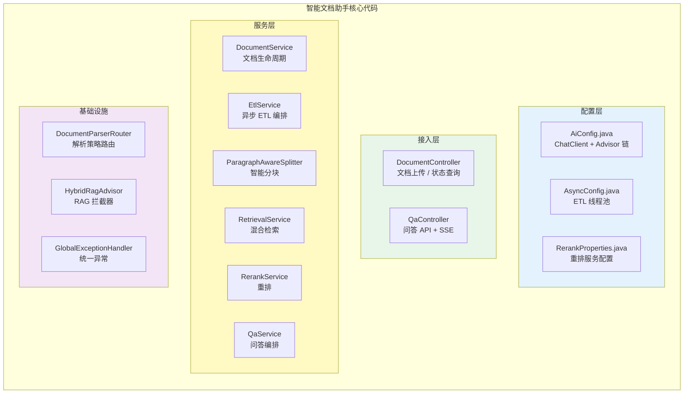
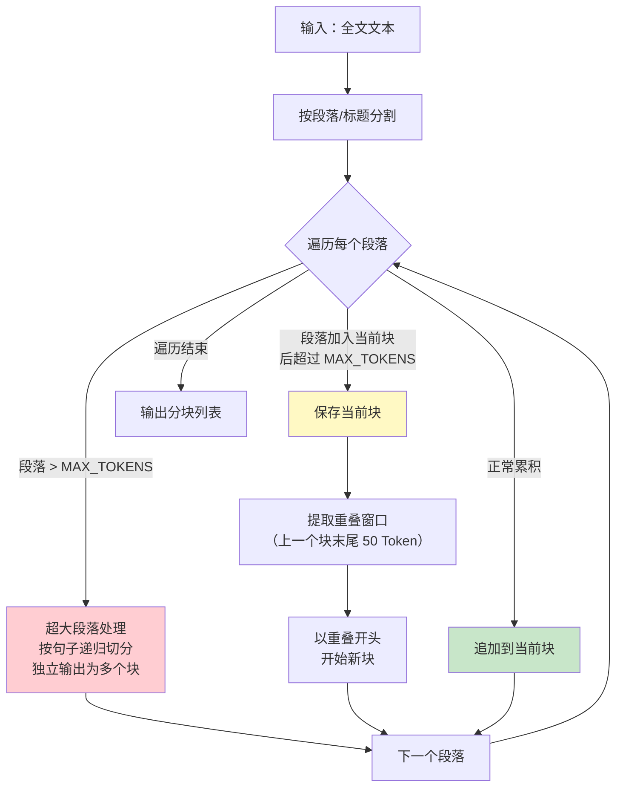
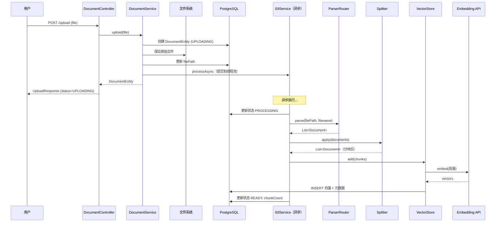
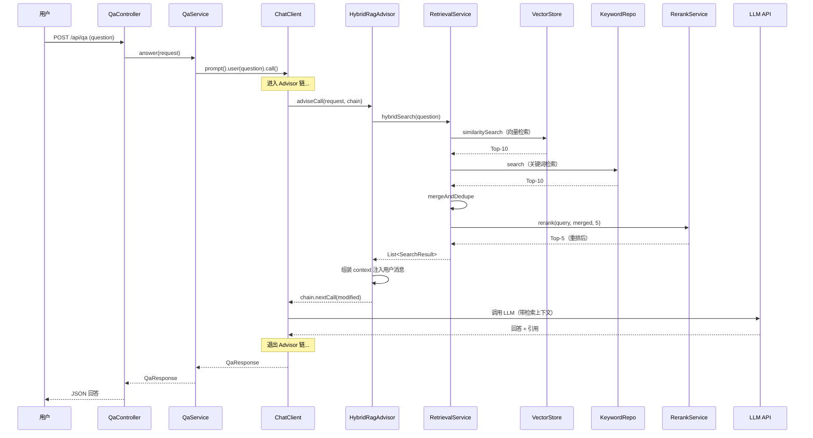
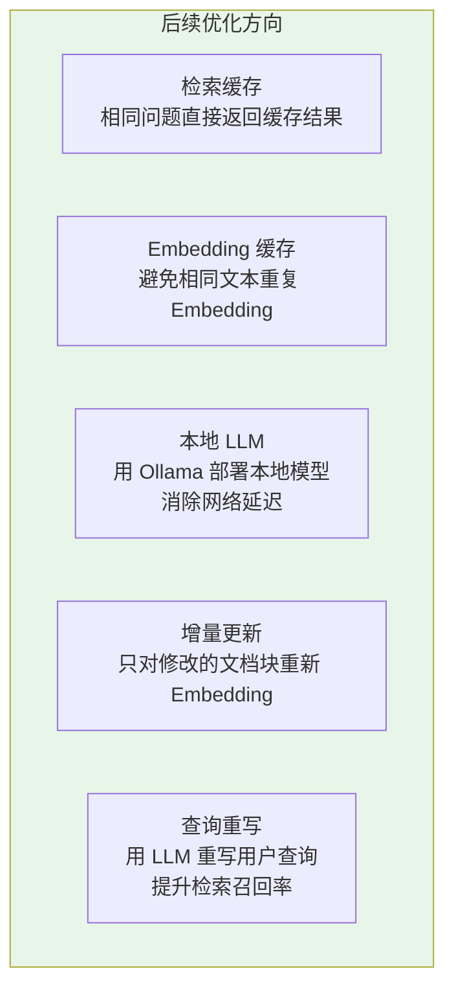

# 04-核心代码讲解

> **定位**：对智能文档助手项目中的关键代码做全量梳理和深度解析——从配置层到接入层，从 ETL Pipeline 到混合检索，每一段核心代码都给出**完整可手写版本**（含全部 import，一行不省略）并说明"为什么这样写"以及"替代方案是什么"。这篇文档是前四篇文档的代码索引和技术沉淀。
>
> **读者画像**：已读完前四篇文档，需要对项目代码做深入理解或二次开发的开发者。
>
> **前置阅读**：[00-需求分析与架构设计](00-需求分析与架构设计.md) 至 [03-多源检索与重排](03-多源检索与重排.md)。API 真实性以 [附录 05-SpringAI2-API基准](../../附录/05-SpringAI2-API基准/00-Advisor与ChatMemory.md) 为准。

---

## 1. 项目代码全景

### 1.1 代码地图



### 1.2 代码分层职责

| 层 | 核心文件 | 核心职责 | 关键设计模式 |
|----|---------|---------|------------|
| 配置层 | AiConfig / AsyncConfig / RerankProperties | Bean 装配、参数绑定 | Builder、@ConfigurationProperties |
| 接入层 | DocumentController / QaController | HTTP 端点、参数校验 | Controller、FilePart 响应式上传 |
| 服务层 | DocumentService / EtlService / RetrievalService / RerankService / QaService | 业务编排、核心逻辑 | 管道模式、策略、两阶段检索 |
| 基础设施 | DocumentParserRouter / HybridRagAdvisor / GlobalExceptionHandler | 解析路由、拦截器、异常 | 策略路由、Advisor 洋葱模型 |

### 1.3 本节核对（代码地图完整性）

| # | 核对项 | 通过判据 |
|---|--------|---------|
| 1 | 代码地图四层 14 个组件与 [00 §5.2] 目录树一致 | 逐个类名对得上（advisor/repository 包在基础设施层） |
| 2 | 分层职责表"关键设计模式"栏能各举一处代码证据 | Builder→AiConfig；策略→ParserRouter；管道→EtlService 五步 |

---

## 2. 配置层代码解析

### 2.1 `AiConfig.java`（ChatClient 装配，完整代码）

```java
package com.example.docassistant.config;

import com.example.docassistant.advisor.HybridRagAdvisor;
import org.springframework.ai.chat.client.ChatClient;
import org.springframework.context.annotation.Bean;
import org.springframework.context.annotation.Configuration;

@Configuration
public class AiConfig {

    @Bean
    public ChatClient chatClient(ChatClient.Builder builder,
                                 HybridRagAdvisor hybridRagAdvisor) {
        return builder
                .defaultSystem("""
                    你是企业文档问答助手。请严格基于提供的参考文档回答用户问题。

                    规则：
                    1. 只使用参考文档中的信息回答，不要编造。
                    2. 如果参考文档中没有相关信息，请明确回答"根据现有文档，我无法回答这个问题"。
                    3. 回答时请标注信息来源（文档标题 + 相关段落）。
                    4. 保持简洁、专业、准确。
                    """)
                .defaultAdvisors(hybridRagAdvisor)
                .build();
    }
}
```

**设计要点**：

1. **设置系统提示词**：四条规则分别约束了信息来源、无答案处理、引用标注和回答风格。这是控制 LLM 行为的第一道防线。

2. **注册 Advisor 链**：`HybridRagAdvisor` 被注册为默认 Advisor，所有通过 `ChatClient` 发起的对话都会自动经过混合检索。这是 RAG 逻辑与业务逻辑解耦的关键。

**替代方案**：如果需要在不同的问答场景中使用不同的 Advisor 组合（如简单问题不检索、复杂问题走完整管线），可以定义多个 `ChatClient` Bean，每个绑定不同的 Advisor 链。

### 2.2 `AsyncConfig.java`（ETL 线程池，完整代码）

```java
package com.example.docassistant.config;

import org.springframework.context.annotation.Bean;
import org.springframework.context.annotation.Configuration;
import org.springframework.scheduling.annotation.EnableAsync;
import org.springframework.scheduling.concurrent.ThreadPoolTaskExecutor;

import java.util.concurrent.Executor;
import java.util.concurrent.ThreadPoolExecutor;

@Configuration
@EnableAsync
public class AsyncConfig {

    @Bean("etlTaskExecutor")
    public Executor etlTaskExecutor() {
        ThreadPoolTaskExecutor executor = new ThreadPoolTaskExecutor();
        executor.setCorePoolSize(2);
        executor.setMaxPoolSize(4);
        executor.setQueueCapacity(50);
        executor.setThreadNamePrefix("etl-");
        executor.setRejectedExecutionHandler(new ThreadPoolExecutor.CallerRunsPolicy());
        executor.initialize();
        return executor;
    }
}
```

**参数设计推理**：

- **核心线程 = 2**：Embedding API 有并发限制。OpenAI 的 `text-embedding-3-small` 默认 RPM 限制为 3000，每批 20 个 chunk，两个线程并发处理已经足够。
- **最大线程 = 4**：高峰期适度增加并发，但不冲击 API 限流。
- **队列容量 = 50**：大量文档导入时缓冲。如果 50 都满了，说明系统积压严重，此时 `CallerRunsPolicy` 让调用线程自己执行——相当于降级为同步处理，起到背压保护作用。

**替代方案**：对于需要处理大规模文档导入（10000+ 文档）的场景，可以将线程池替换为消息队列（RabbitMQ / Kafka），获得更好的削峰填谷和故障恢复能力。

### 2.3 `RerankProperties.java`（重排服务配置，完整代码）

```java
package com.example.docassistant.config;

import lombok.Getter;
import lombok.Setter;
import org.springframework.boot.context.properties.ConfigurationProperties;
import org.springframework.stereotype.Component;

@Component
@ConfigurationProperties(prefix = "app.rerank")
@Getter
@Setter
public class RerankProperties {

    private String endpoint = "http://localhost:8000";

    private int topK = 5;
}
```

### 2.4 `ToolObservationConfig.java`（可观测落地：类型化 ObservationHandler，完整代码）

[00 §6.2] NFR4 承诺"每次问答可追溯检索来源、ETL 全链路追踪"——观测不是配了 actuator 就完事，业务侧要有 Handler 把链路事件"翻译"成可读日志。Spring AI 的工具调用链每次执行都会发出 `ToolCallingObservationContext` 观测事件；注册一个**类型化的 `ObservationHandler` 泛型 Bean**，它会被 `ObservationRegistry` 自动发现，且只处理 `supportsContext` 声明的上下文类型：

```java
package com.example.docassistant.config;

import io.micrometer.observation.Observation;
import io.micrometer.observation.ObservationHandler;
import lombok.extern.slf4j.Slf4j;
import org.springframework.ai.tool.observation.ToolCallingObservationContext;
import org.springframework.context.annotation.Bean;
import org.springframework.context.annotation.Configuration;

/**
 * 可观测落地：类型化 ObservationHandler——文档 ETL 与问答中每次工具调用的中文可读日志。
 * ObservationHandler<T extends Observation.Context> 为 Micrometer Observation 真实接口
 * （javap 实证：supportsContext 抽象；onStart/onStop/onError 为 default）；
 * ToolCallingObservationContext 为 Spring AI 2.0.0 工具调用领域上下文（final 类，javap 实证）。
 */
@Configuration
@Slf4j
public class ToolObservationConfig {

    @Bean
    public ObservationHandler<ToolCallingObservationContext> toolCallingObservationHandler() {
        return new ObservationHandler<>() {
            @Override
            public boolean supportsContext(Observation.Context context) {
                // 只接工具调用上下文——ChatModel/ChatClient 等其他 Context 由各自的 Handler 处理
                return context instanceof ToolCallingObservationContext;
            }

            @Override
            public void onStart(ToolCallingObservationContext context) {
                log.info("工具调用开始：工具名称：{}，入参：{}",
                        context.getToolDefinition().name(),
                        context.getToolCallArguments());
            }

            @Override
            public void onStop(ToolCallingObservationContext context) {
                log.info("工具调用结束：工具名称：{}，结果：{}",
                        context.getToolDefinition().name(),
                        context.getToolCallResult());
            }

            @Override
            public void onError(ToolCallingObservationContext context) {
                log.info("工具调用异常：工具名称：{}，错误：{}",
                        context.getToolDefinition().name(),
                        context.getError());
            }
        };
    }
}
```

**设计要点**：

1. **泛型即过滤**：`ObservationHandler<ToolCallingObservationContext>` 的类型参数 + `supportsContext` 的 `instanceof` 双保险——Handler 只处理工具调用事件，不碰其他领域的上下文。要观测模型调用再另注册一个 `ObservationHandler<ChatModelObservationContext>` Bean，互不干扰。
2. **零侵入**：不改任何业务代码——观测事件由 Spring AI 内部的 Instrumentation 发出，Handler 是纯粹的旁路消费者。这正是 [00 §3.4 ADR-001] 横切关注点独立成包（`config`）的延续。
3. **`getToolCallArguments()` 注意脱敏**：工具入参可能含敏感数据，生产环境应做截断/掩码（呼应 [教程 05-Observation可观测] 的 `spring.ai.tools.observations.include-content` 开关——关掉后此处拿到的是占位而非原文）。

> **想深入？→ [教程 05-Observation可观测/02-组件交互：Registry、Handler、Convention、Filter协作](../../教程/05-Observation可观测/02-组件交互：Registry、Handler、Convention、Filter协作.md) 与 [03-自定义Handler：收集Agent阶段事件流](../../教程/05-Observation可观测/03-自定义Handler：收集Agent阶段事件流.md)**：Observation 的 Registry/Handler/Convention/Filter 协作机制、TraceId 关联（`Tracer.currentSpan()`）与自定义 Handler 的完整目录。

### 2.5 本节核对（配置层理解自测）

| # | 核对项 | 通过判据 |
|---|--------|---------|
| 1 | 能说出系统提示词四条规则各自防什么 | 编造/硬答/无引用/风格漂移 |
| 2 | 能解释线程池四参数（2/4/50/CallerRuns）的取舍依据 | 限流保护 + 背压降级（对照 [02 §6.5] 步骤 3 的 `etl-` 线程名断言） |
| 3 | RerankProperties 与 [03 §3.2] application-docassistant.yaml 键一致 | `app.rerank.endpoint` / `top-k: 5` |

**本节验证（可执行）**：配置层装配成功的最小探针——系统提示词第 2 条（无答案拒答）生效即证明 `AiConfig` 的 ChatClient Bean 已按预期构建：

```bash
curl -X POST http://localhost:8081/api/qa -H "Content-Type: application/json" \
  -d '{"question": "明天上海天气怎么样？"}'
```

预期输出（HTTP 200）：

```json
{"answer": "根据现有文档，我无法回答这个问题。", "citations": [], "confident": false}
```

若返回编造的天气内容 → `defaultSystem` 未生效（AiConfig 未被扫描或 ChatClient 被覆盖构建）；若 500 → 数据库/LLM 连接问题（非配置层），回查 [01 §3.6]。

### 2.6 本节测试与验证（配置层装配与观测 Handler）

**前置条件**：§2.3 `RerankProperties`、§2.4 `ToolObservationConfig` 已手写进项目；测试基线 `spring-boot-starter-test`（含 JUnit 5 / AssertJ / Mockito，若 pom.xml 未声明需先以 test scope 添加）。

**步骤与断言**：

| # | 验证点 | 操作 | 预期断言 |
|---|--------|------|---------|
| 1 | Handler 类型过滤 | 实例化 §2.4 的 Handler，分别传 `ToolCallingObservationContext` 与普通 `Observation.Context` 调 `supportsContext` | 前者 `true`、后者 `false`（泛型 + instanceof 双保险生效） |
| 2 | RerankProperties 默认值 | `ApplicationContextRunner` 装载 `RerankProperties` | `endpoint=http://localhost:8000`、`topK=5`；覆盖 `app.rerank.top-k=8` 后 `getTopK()==8`（与 [03 §3.2] yaml 键对齐） |

**最小可执行载体**（JUnit 5，纯 Java 不依赖 LLM/数据库；`ToolCallingObservationContext.builder()`、`ToolDefinition.builder()`、`new Observation.Context()` 均为 2.0.0 真实 API，javap 实证）：

```java
// 所属：src/test/java/com/example/docassistant/config/ToolObservationHandlerTest.java
package com.example.docassistant.config;

import io.micrometer.observation.Observation;
import io.micrometer.observation.ObservationHandler;
import org.junit.jupiter.api.Test;
import org.springframework.ai.tool.definition.ToolDefinition;
import org.springframework.ai.tool.observation.ToolCallingObservationContext;

import static org.assertj.core.api.Assertions.assertThat;

class ToolObservationHandlerTest {

    private final ObservationHandler<ToolCallingObservationContext> handler =
            new ToolObservationConfig().toolCallingObservationHandler();

    @Test
    void supportsContext_只接工具调用上下文() {
        ToolDefinition def = ToolDefinition.builder()
                .name("searchDocs").description("检索文档").inputSchema("{}").build();
        ToolCallingObservationContext toolCtx = ToolCallingObservationContext.builder()
                .toolDefinition(def)
                .toolCallArguments("{\"keyword\":\"年假\"}")
                .build();
        assertThat(handler.supportsContext(toolCtx)).isTrue();                  // 断言①
        assertThat(handler.supportsContext(new Observation.Context())).isFalse(); // 断言②
    }
}
```

```java
// 所属：src/test/java/com/example/docassistant/config/RerankPropertiesBindingTest.java
package com.example.docassistant.config;

import org.junit.jupiter.api.Test;
import org.springframework.boot.test.context.runner.ApplicationContextRunner;

import static org.assertj.core.api.Assertions.assertThat;

class RerankPropertiesBindingTest {

    private final ApplicationContextRunner runner =
            new ApplicationContextRunner().withUserConfiguration(RerankProperties.class);

    @Test
    void 默认值_endpoint_8000_topK_5() {
        runner.run(ctx -> {
            RerankProperties props = ctx.getBean(RerankProperties.class);
            assertThat(props.getEndpoint()).isEqualTo("http://localhost:8000"); // 断言③
            assertThat(props.getTopK()).isEqualTo(5);
        });
    }

    @Test
    void 配置覆盖_topK() {
        runner.withPropertyValues("app.rerank.top-k=8").run(ctx ->
                assertThat(ctx.getBean(RerankProperties.class).getTopK()).isEqualTo(8)); // 断言④
    }
}
```

```bash
mvn clean test -Dtest='ToolObservationHandlerTest,RerankPropertiesBindingTest'
```

预期输出（末尾）：`Tests run: 3, Failures: 0, Errors: 0`。

**失败排查**：断言②失败（普通 Context 也被接住）→ `supportsContext` 的 `instanceof` 判断漏写；断言③失败 → `@ConfigurationProperties` 前缀与 `app.rerank` 不一致或缺 `@Setter`；`ApplicationContextRunner` 类找不到 → `spring-boot-starter-test` 未入 test scope。

---

## 3. 接入层代码解析

### 3.1 `DocumentController.java`（完整代码）

```java
package com.example.docassistant.api;

import com.example.docassistant.api.dto.DocumentStatusResponse;
import com.example.docassistant.api.dto.UploadResponse;
import com.example.docassistant.model.DocumentEntity;
import com.example.docassistant.service.DocumentService;
import org.springframework.beans.factory.annotation.Autowired;
import org.springframework.http.codec.multipart.FilePart;
import org.springframework.web.bind.annotation.DeleteMapping;
import org.springframework.web.bind.annotation.GetMapping;
import org.springframework.web.bind.annotation.PathVariable;
import org.springframework.web.bind.annotation.PostMapping;
import org.springframework.web.bind.annotation.RequestMapping;
import org.springframework.web.bind.annotation.RequestPart;
import org.springframework.web.bind.annotation.RestController;
import reactor.core.publisher.Mono;

import java.util.List;
import java.util.UUID;

@RestController
@RequestMapping("/api/documents")
public class DocumentController {

    @Autowired
    private DocumentService documentService;

    @PostMapping("/upload")
    public Mono<UploadResponse> upload(@RequestPart("file") FilePart filePart) {
        return documentService.upload(filePart)
                .map(doc -> new UploadResponse(
                        doc.getId(),
                        doc.getTitle(),
                        doc.getStatus().name(),
                        doc.getChunkCount()));
    }

    @GetMapping("/{id}/status")
    public DocumentStatusResponse getStatus(@PathVariable UUID id) {
        DocumentEntity doc = documentService.getById(id);
        return new DocumentStatusResponse(
                doc.getId(),
                doc.getStatus().name(),
                doc.getChunkCount());
    }

    @GetMapping
    public List<DocumentEntity> list() {
        return documentService.listAll();
    }

    @DeleteMapping("/{id}")
    public Mono<Void> delete(@PathVariable UUID id) {
        return documentService.delete(id);
    }
}
```

**设计要点**：

- 上传接口返回 `UploadResponse`（包含 `status` 字段），而非 HTTP 202 状态码。这让前端无需处理不同的 HTTP 状态码，只需检查 JSON 中的 `status` 字段。
- **WebFlux 上传**：用 `FilePart`（响应式）而非 MVC 的 `MultipartFile`，`spring.codec.max-in-memory-size` 控制上限。
- **改进方向**：生产环境应该添加文件大小限制、文件类型白名单校验、文件内容安全扫描。`delete` 目前只删元数据和原始文件，向量库中该文档的 chunks 按 `documentId` 元数据清理作为增强项留给读者（`VectorStore.delete(List<String> idList)` 需要先查出 chunk id）。

### 3.2 `QaController.java`（SSE 流式端点，完整代码）

```java
package com.example.docassistant.api;

import com.example.docassistant.api.dto.QaRequest;
import com.example.docassistant.api.dto.QaResponse;
import com.example.docassistant.service.QaService;
import org.springframework.beans.factory.annotation.Autowired;
import org.springframework.http.MediaType;
import org.springframework.web.bind.annotation.PostMapping;
import org.springframework.web.bind.annotation.RequestBody;
import org.springframework.web.bind.annotation.RequestMapping;
import org.springframework.web.bind.annotation.RestController;
import reactor.core.publisher.Flux;
import reactor.core.publisher.Mono;
import reactor.core.scheduler.Schedulers;

@RestController
@RequestMapping("/api/qa")
public class QaController {

    @Autowired
    private QaService qaService;

    @PostMapping
    public Mono<QaResponse> ask(@RequestBody QaRequest request) {
        // QaService.answer 内部已用 fromCallable + subscribeOn(boundedElastic) 隔离阻塞调用，
        // 这里直接透传，避免 Mono<Mono<QaResponse>> 双包装
        return qaService.answer(request);
    }

    @PostMapping(value = "/stream", produces = MediaType.TEXT_EVENT_STREAM_VALUE)
    public Flux<String> askStream(@RequestBody QaRequest request) {
        return Flux.defer(() -> qaService.answerStream(request))
                .subscribeOn(Schedulers.boundedElastic());
    }
}
```

**SSE 端点关键点**：

- **`produces = TEXT_EVENT_STREAM_VALUE`**：声明返回 SSE 格式。浏览器原生支持 `EventSource` API 接收 SSE，无需额外库。
- **`Flux<String>`**：WebFlux 响应式返回类型。`Flux` 表示 0 到 N 个元素的异步序列，每个元素作为一个 SSE event 推送到客户端。
- **WebFlux 铁律**：`subscribeOn(Schedulers.boundedElastic())` 确保阻塞的检索 + LLM 调用在弹性线程池执行，不占用 Netty EventLoop。

> **SSE 流式通信深入** → [教程 01-WebFlux与响应式编程/00-WebFlux从零入门 流式通信](../../教程/02-SpringAI核心机制/06-SSE流式通信.md)：教程详细讲解了 SSE 协议格式、WebFlux 的 Flux/Mono 响应式编程模型、SSE 与 WebSocket 的对比选择。

### 3.3 本节核对（接入层设计理解自测）

| # | 核对项 | 通过判据 |
|---|--------|---------|
| 1 | 能说出上传返回业务 status 而非 HTTP 202 的理由 | 前端只看 JSON 字段，无需分状态码处理 |
| 2 | 能指出 delete 的已知不彻底点 | 未按 documentId 清理 vector_store chunks（增强项） |
| 3 | 同步端点为何不重复包一层 fromCallable | QaService 内部已隔离，避免 `Mono<Mono<…>>` 双包装 |

**本节验证（可执行）**：接入层两个端点各打一遍（应用以 `mvn spring-boot:run -Dspring-boot.run.profiles=docassistant` 运行中）：

```bash
curl -X POST http://localhost:8081/api/documents/upload -F "file=@employee-handbook.md"
curl http://localhost:8081/api/documents/{documentId}/status
```

预期输出（HTTP 200）：

```json
{"documentId": "9b2f…", "title": "employee-handbook.md", "status": "READY", "chunkCount": 12}
```

第二跳 status 接口返回同构 JSON（`documentId/status/chunkCount` 三字段）。若上传后一直 `UPLOADING` 不迁移 → ETL 异步链路问题（服务层），回查 [02 §6.5]；若 413 → `spring.codec.max-in-memory-size` 配置层问题。

---

## 4. 服务层代码解析

### 4.1 `DocumentService.java`（最终版，完整代码）

```java
package com.example.docassistant.service;

import com.example.docassistant.exception.DocumentException;
import com.example.docassistant.model.DocumentEntity;
import com.example.docassistant.model.enums.DocumentStatus;
import com.example.docassistant.repository.DocumentRepository;
import org.springframework.core.io.buffer.DataBufferUtils;
import org.springframework.http.codec.multipart.FilePart;
import org.springframework.stereotype.Service;
import reactor.core.publisher.Mono;
import reactor.core.scheduler.Schedulers;

import java.io.IOException;
import java.nio.file.Files;
import java.nio.file.Path;
import java.time.LocalDateTime;
import java.util.List;
import java.util.UUID;

@Service
public class DocumentService {

    private final EtlService etlService;
    private final DocumentRepository documentRepository;

    public DocumentService(EtlService etlService, DocumentRepository documentRepository) {
        this.etlService = etlService;
        this.documentRepository = documentRepository;
    }

    public Mono<DocumentEntity> upload(FilePart filePart) {
        return DataBufferUtils.join(filePart.content())
                .map(dataBuffer -> {
                    byte[] bytes = new byte[dataBuffer.readableByteCount()];
                    dataBuffer.read(bytes, 0, bytes.length);
                    DataBufferUtils.release(dataBuffer);
                    return bytes;
                })
                .subscribeOn(Schedulers.boundedElastic())
                .map(bytes -> {
                    DocumentEntity doc = new DocumentEntity();
                    doc.setTitle(filePart.filename());
                    doc.setFormat(detectFormat(filePart.filename()));
                    doc.setStatus(DocumentStatus.UPLOADING);
                    doc.setUploadedAt(LocalDateTime.now());
                    doc = documentRepository.save(doc);

                    try {
                        Path filePath = saveFile(filePart.filename(), bytes, doc.getId());
                        doc.setFilePath(filePath.toString());
                        documentRepository.save(doc);
                    } catch (IOException e) {
                        doc.setStatus(DocumentStatus.FAILED);
                        documentRepository.save(doc);
                        throw new DocumentException("文件保存失败: " + e.getMessage(), e);
                    }

                    etlService.processAsync(doc.getId(), filePath, filePart.filename());
                    return doc;
                });
    }

    public DocumentEntity getById(UUID id) {
        return documentRepository.findById(id)
                .orElseThrow(() -> new DocumentException("文档不存在: " + id));
    }

    public List<DocumentEntity> listAll() {
        return documentRepository.findAll();
    }

    public Mono<Void> delete(UUID id) {
        return Mono.fromRunnable(() -> documentRepository.deleteById(id))
                .subscribeOn(Schedulers.boundedElastic());
    }

    private String detectFormat(String filename) {
        if (filename.endsWith(".md")) return "MARKDOWN";
        if (filename.endsWith(".pdf")) return "PDF";
        if (filename.endsWith(".doc") || filename.endsWith(".docx")) return "WORD";
        return "UNKNOWN";
    }

    private Path saveFile(String filename, byte[] bytes, UUID docId) throws IOException {
        Path dir = Path.of("data", "uploads");
        Files.createDirectories(dir);
        Path target = dir.resolve(docId + "_" + filename);
        Files.write(target, bytes);
        return target;
    }
}
```

**设计模式**：`upload` 方法体现了 **命令-查询分离（CQS）** 原则。`upload` 是一个命令操作（创建资源），它创建文档、保存文件、启动 ETL，但不等待处理完成——真正的处理结果是后续通过 `getStatus` 查询获取的。

**事务边界**：`upload` 方法本身的文件保存和元数据创建是同步的（短事务），ETL 处理是异步的（独立事务）。如果 ETL 失败，文档状态变为 `FAILED`，原始文件保留——管理员可以选择重新处理或删除。

### 4.2 `EtlService.java`（ETL Pipeline 编排，完整代码）

```java
package com.example.docassistant.service;

import com.example.docassistant.exception.DocumentException;
import com.example.docassistant.model.DocumentEntity;
import com.example.docassistant.model.enums.DocumentStatus;
import com.example.docassistant.repository.DocumentRepository;
import com.example.docassistant.service.parser.DocumentParserRouter;
import org.springframework.ai.document.Document;
import org.springframework.ai.transformer.splitter.TextSplitter;
import org.springframework.ai.vectorstore.VectorStore;
import org.springframework.core.io.FileSystemResource;
import org.springframework.scheduling.annotation.Async;
import org.springframework.stereotype.Service;

import java.nio.file.Path;
import java.time.LocalDateTime;
import java.util.List;
import java.util.UUID;

@Service
public class EtlService {

    private final DocumentParserRouter parserRouter;
    private final TextSplitter textSplitter;
    private final VectorStore vectorStore;
    private final DocumentRepository documentRepository;

    public EtlService(DocumentParserRouter parserRouter,
                      ParagraphAwareSplitter textSplitter,
                      VectorStore vectorStore,
                      DocumentRepository documentRepository) {
        this.parserRouter = parserRouter;
        this.textSplitter = textSplitter;
        this.vectorStore = vectorStore;
        this.documentRepository = documentRepository;
    }

    @Async("etlTaskExecutor")
    public void processAsync(UUID documentId, Path filePath, String originalFilename) {
        DocumentEntity doc = documentRepository.findById(documentId)
                .orElseThrow(() -> new DocumentException("文档不存在: " + documentId));

        try {
            doc.setStatus(DocumentStatus.PROCESSING);
            documentRepository.save(doc);

            // Step 1: 解析（DocumentParserRouter 自动路由格式）
            List<Document> rawDocuments = parserRouter.parse(
                    new FileSystemResource(filePath), originalFilename, documentId.toString());

            // Step 2: 分块（ParagraphAwareSplitter 段落感知分块）
            List<Document> chunks = textSplitter.apply(rawDocuments);

            // Step 3: 附加元数据
            chunks.forEach(chunk -> {
                chunk.getMetadata().put("documentId", documentId.toString());
                chunk.getMetadata().put("title", doc.getTitle());
            });

            // Step 4: 批量向量化 + 存储
            batchEmbedAndStore(chunks);

            // Step 5: 更新状态为 READY
            doc.setStatus(DocumentStatus.READY);
            doc.setChunkCount(chunks.size());
            doc.setProcessedAt(LocalDateTime.now());
            documentRepository.save(doc);

        } catch (Exception e) {
            doc.setStatus(DocumentStatus.FAILED);
            doc.setErrorMessage(e.getMessage());
            documentRepository.save(doc);
        }
    }

    private void batchEmbedAndStore(List<Document> chunks) {
        int batchSize = 20;
        for (int i = 0; i < chunks.size(); i += batchSize) {
            int end = Math.min(i + batchSize, chunks.size());
            List<Document> batch = chunks.subList(i, end);
            vectorStore.add(batch);
        }
    }
}
```

**Pipeline 设计要点**：五步 Pipeline 是一个典型的 **管道模式（Pipeline Pattern）**——每一步接收上一步的输出，产出下一步的输入。这种设计的优势是每一步都可以独立测试和替换：

- 替换解析器：修改 `DocumentParserRouter` 中的解析器实现。
- 替换分块策略：实现新的 `TextSplitter` 子类。
- 替换存储后端：修改 `VectorStore` 配置（如从 PgVector 切到 Milvus）。

**异常处理策略**：整个 ETL 过程在一个 try-catch 中，任何步骤失败都导致文档状态变为 `FAILED`。这是 **熔断式异常处理**——一个文档的处理失败不影响其他文档，也不影响系统正常运行。

### 4.3 `ParagraphAwareSplitter.java`（分块算法核心，完整代码）

```java
package com.example.docassistant.service;

import org.springframework.ai.document.Document;
import org.springframework.ai.transformer.splitter.TextSplitter;
import org.springframework.stereotype.Component;

import java.util.ArrayList;
import java.util.List;

@Component
public class ParagraphAwareSplitter extends TextSplitter {

    private static final int TARGET_TOKENS = 400;
    private static final int MAX_TOKENS = 600;
    private static final int MIN_TOKENS = 50;
    private static final int OVERLAP_TOKENS = 50;

    @Override
    protected List<String> splitText(String text) {
        List<String> paragraphs = splitByParagraphs(text);
        List<String> chunks = new ArrayList<>();
        StringBuilder currentChunk = new StringBuilder();
        int currentTokens = 0;

        for (String paragraph : paragraphs) {
            int paraTokens = estimateTokens(paragraph);

            if (paraTokens > MAX_TOKENS) {
                // 超大段落：独立递归切分
                if (currentTokens >= MIN_TOKENS) {
                    chunks.add(currentChunk.toString());
                    currentChunk = new StringBuilder();
                    currentTokens = 0;
                }
                chunks.addAll(splitLargeParagraph(paragraph, TARGET_TOKENS, OVERLAP_TOKENS));
            } else if (currentTokens + paraTokens > MAX_TOKENS) {
                // 累积超限：保存当前块，开始新块（带重叠窗口）
                if (currentTokens >= MIN_TOKENS) {
                    chunks.add(currentChunk.toString());
                }
                String overlap = extractOverlap(currentChunk.toString(), OVERLAP_TOKENS);
                currentChunk = new StringBuilder(overlap);
                currentChunk.append(paragraph);
                currentTokens = estimateTokens(overlap) + paraTokens;
            } else {
                // 正常累积
                if (currentChunk.length() > 0) {
                    currentChunk.append("\n\n");
                }
                currentChunk.append(paragraph);
                currentTokens += paraTokens;
            }
        }

        if (currentTokens >= MIN_TOKENS) {
            chunks.add(currentChunk.toString());
        }
        return chunks;
    }

    private List<String> splitByParagraphs(String text) {
        List<String> paragraphs = new ArrayList<>();
        String[] roughParas = text.split("(?=\n#{1,6}\\s)|\n\n+");
        for (String para : roughParas) {
            String trimmed = para.trim();
            if (!trimmed.isEmpty()) {
                paragraphs.add(trimmed);
            }
        }
        return paragraphs;
    }

    private List<String> splitLargeParagraph(String text, int targetTokens, int overlap) {
        List<String> chunks = new ArrayList<>();
        String[] sentences = text.split("(?<=[。.!?！？])\\s*");
        StringBuilder chunk = new StringBuilder();
        int chunkTokens = 0;

        for (String sentence : sentences) {
            int sentenceTokens = estimateTokens(sentence);
            if (chunkTokens + sentenceTokens > targetTokens && chunkTokens > 0) {
                chunks.add(chunk.toString());
                chunk = new StringBuilder(extractOverlap(chunk.toString(), overlap));
                chunkTokens = estimateTokens(chunk.toString());
            }
            chunk.append(sentence);
            chunkTokens += sentenceTokens;
        }

        if (chunkTokens > 0) {
            chunks.add(chunk.toString());
        }
        return chunks;
    }

    private String extractOverlap(String text, int overlapTokens) {
        String[] words = text.split("\\s+");
        int startIdx = Math.max(0, words.length - overlapTokens);
        return String.join(" ", java.util.Arrays.copyOfRange(words, startIdx, words.length));
    }

    private int estimateTokens(String text) {
        int chineseChars = 0;
        int nonChineseWords = 0;
        for (char c : text.toCharArray()) {
            if (Character.UnicodeScript.of(c) == Character.UnicodeScript.HAN) {
                chineseChars++;
            }
        }
        String nonChinese = text.replaceAll("[\\u4E00-\\u9FFF]", " ").trim();
        if (!nonChinese.isEmpty()) {
            nonChineseWords = nonChinese.split("\\s+").length;
        }
        return (int) (chineseChars * 1.5 + nonChineseWords * 1.3);
    }
}
```

**算法流程图解**：



**三种分支的处理逻辑**：

1. **超大段落**（`paraTokens > MAX_TOKENS`）：说明单个段落超过了块大小上限。这可能是一个没有分段的超长章节。策略是按句子边界做二次切分，确保句子完整性。

2. **累积超限**（`currentTokens + paraTokens > MAX_TOKENS`）：当前块已接近上限，加入新段落会超限。策略是保存当前块、提取末尾重叠窗口、以重叠窗口开头开始新块。重叠确保跨块边界的信息不会丢失。

3. **正常累积**：段落加入当前块不超限，直接追加。

**Token 估算的准确性**：`estimateTokens` 方法用中英文混合估算（中文 1 字 ≈ 1.5 Token，英文 1 词 ≈ 1.3 Token）。这不是精确的 Token 计数（精确计数需要用 tokenizer 库），但对于分块决策来说足够——即使估算偏差 20%，也只是导致块大小在 400-600 Token 范围内波动，不影响检索质量。

### 4.4 `RetrievalService.java`（混合检索编排，完整代码）

```java
package com.example.docassistant.service;

import com.example.docassistant.api.dto.SearchResult;
import com.example.docassistant.repository.KeywordSearchRepository;
import org.springframework.ai.document.Document;
import org.springframework.ai.vectorstore.SearchRequest;
import org.springframework.ai.vectorstore.VectorStore;
import org.springframework.stereotype.Service;

import java.util.ArrayList;
import java.util.LinkedHashMap;
import java.util.List;
import java.util.Map;

@Service
public class RetrievalService {

    private final VectorStore vectorStore;
    private final KeywordSearchRepository keywordSearchRepo;
    private final RerankService rerankService;

    private static final int RECALL_TOP_K = 10;
    private static final int FINAL_TOP_K = 5;
    private static final double SIMILARITY_THRESHOLD = 0.65;

    public RetrievalService(VectorStore vectorStore,
                            KeywordSearchRepository keywordSearchRepo,
                            RerankService rerankService) {
        this.vectorStore = vectorStore;
        this.keywordSearchRepo = keywordSearchRepo;
        this.rerankService = rerankService;
    }

    public List<SearchResult> hybridSearch(String query) {
        List<SearchResult> vectorResults = vectorSearch(query);
        List<SearchResult> keywordResults = keywordSearch(query);
        List<SearchResult> merged = mergeAndDedupe(vectorResults, keywordResults);
        return rerankService.rerank(query, merged, FINAL_TOP_K);
    }

    private List<SearchResult> vectorSearch(String query) {
        List<Document> docs = vectorStore.similaritySearch(
                SearchRequest.builder()
                        .query(query)
                        .topK(RECALL_TOP_K)
                        .similarityThreshold(SIMILARITY_THRESHOLD)
                        .build());
        return docs.stream()
                .map(doc -> new SearchResult(
                        doc.getId(),
                        doc.getText(),
                        doc.getMetadata(),
                        doc.getMetadata().get("distance") instanceof Number n
                                ? n.doubleValue()
                                : 0.0,
                        "VECTOR"))
                .toList();
    }

    private List<SearchResult> keywordSearch(String query) {
        return keywordSearchRepo.search(query, RECALL_TOP_K).stream()
                .map(r -> new SearchResult(r.id(), r.content(), r.metadata(), r.rankScore(), "KEYWORD"))
                .toList();
    }

    private List<SearchResult> mergeAndDedupe(List<SearchResult> vector,
                                              List<SearchResult> keyword) {
        Map<String, SearchResult> merged = new LinkedHashMap<>();
        vector.forEach(r -> merged.put(r.id(), r));
        for (SearchResult kr : keyword) {
            merged.merge(kr.id(), kr, (existing, incoming) -> new SearchResult(
                    existing.id(),
                    existing.content(),
                    existing.metadata(),
                    Math.max(existing.score(), incoming.score()),
                    "HYBRID"));
        }
        return new ArrayList<>(merged.values());
    }
}
```

**`LinkedHashMap` 的妙用**：保持插入顺序（向量检索结果在前），同时用 `merge` 函数处理键冲突。当一个文档块同时被两种方式检索到时，`merge` 函数取较高的分数并标记来源为 `HYBRID`——这种"双路命中"的结果通常质量最高。

**并行化优化空间**：当前代码中向量检索和关键词检索是串行的。由于两者查询的数据源不同（向量索引 vs 全文索引），可以并行执行。以下片段位于 `RetrievalService.hybridSearch` 内，替换原串行的两行（`List<SearchResult> vectorResults = vectorSearch(query);` 与 `List<SearchResult> keywordResults = keywordSearch(query);`）：

```java
// 并行版本（Java 21 虚拟线程）—— 所属类：com.example.docassistant.service.RetrievalService
// 需要的 import（其余 import 与 4.4 完整版一致）：
// import java.util.concurrent.Executors;
// import java.util.concurrent.ExecutionException;

List<SearchResult> vectorResults;
List<SearchResult> keywordResults;
try (var executor = Executors.newVirtualThreadPerTaskExecutor()) {
    var future1 = executor.submit(() -> vectorSearch(query));
    var future2 = executor.submit(() -> keywordSearch(query));
    try {
        vectorResults = future1.get();
        keywordResults = future2.get();
    } catch (InterruptedException e) {
        Thread.currentThread().interrupt();   // 恢复中断标记，不吞中断
        throw new IllegalStateException("并行检索被中断", e);
    } catch (ExecutionException e) {
        throw new IllegalStateException("并行检索失败: " + e.getCause().getMessage(), e.getCause());
    }
}
```

Java 21 虚拟线程让并行化变得极其轻量——两个查询各自跑在虚拟线程上，互不阻塞，总延迟约为较慢查询的延迟，而非两者之和。`future.get()` 的两个受检异常必须显式处理：`InterruptedException` 要恢复中断标记（线程池礼貌约定），`ExecutionException` 拆壳取出真实原因上抛，避免调用方拿到被吞的堆栈。

### 4.5 `RerankService.java`（重排调用，完整代码）

```java
package com.example.docassistant.service;

import com.example.docassistant.api.dto.SearchResult;
import com.example.docassistant.config.RerankProperties;
import org.springframework.stereotype.Service;
import org.springframework.web.reactive.function.client.WebClient;
import reactor.core.publisher.Mono;

import java.util.Comparator;
import java.util.List;

@Service
public class RerankService {

    private final WebClient rerankClient;

    public RerankService(WebClient.Builder builder, RerankProperties properties) {
        this.rerankClient = builder.baseUrl(properties.getEndpoint()).build();
    }

    public List<SearchResult> rerank(String query,
                                     List<SearchResult> candidates,
                                     int topK) {
        if (candidates.size() <= topK) {
            return candidates;
        }
        RerankResponse response = rerankClient.post()
                .uri("/rerank")
                .bodyValue(new RerankRequest(query,
                        candidates.stream().map(SearchResult::content).toList()))
                .retrieve()
                .bodyToMono(RerankResponse.class)
                .block();  // ⚠ 演示用同步等待；生产走 rerankReactive

        return response.scores().stream()
                .sorted(Comparator.comparingDouble(RerankScore::score).reversed())
                .limit(topK)
                .map(score -> rebuildResult(candidates, score))
                .toList();
    }

    public Mono<List<SearchResult>> rerankReactive(String query,
                                                   List<SearchResult> candidates,
                                                   int topK) {
        if (candidates.size() <= topK) {
            return Mono.just(candidates);
        }
        return rerankClient.post()
                .uri("/rerank")
                .bodyValue(new RerankRequest(query,
                        candidates.stream().map(SearchResult::content).toList()))
                .retrieve()
                .bodyToMono(RerankResponse.class)
                .map(response -> response.scores().stream()
                        .sorted(Comparator.comparingDouble(RerankScore::score).reversed())
                        .limit(topK)
                        .map(score -> rebuildResult(candidates, score))
                        .toList());
    }

    private SearchResult rebuildResult(List<SearchResult> candidates, RerankScore score) {
        SearchResult original = candidates.get(score.index());
        return new SearchResult(
                original.id(),
                original.content(),
                original.metadata(),
                score.score(),
                original.source());
    }

    public record RerankRequest(String query, List<String> documents) {}
    public record RerankResponse(List<RerankScore> scores) {}
    public record RerankScore(int index, double score) {}
}
```

**短路优化**：`candidates.size() <= topK` 时直接返回，不调用重排模型 API。这在召回结果本身就少于最终需要数量时避免了不必要的 API 调用。

**响应式改写**：Demo 中用 `.block()` 做同步等待。生产环境中，如果整个调用链是响应式的（WebFlux），应该用 `rerankReactive` 返回 `Mono<List<SearchResult>>`，不阻塞 EventLoop。

### 4.6 本节核对（服务层算法理解自测）

| # | 核对项 | 通过判据 |
|---|--------|---------|
| 1 | 能不看正文说出分块三分支的触发条件与策略 | 超大段落/累积超限/正常累积（对照 [02 §5.4] 用例 1-3） |
| 2 | 能解释 mergeAndDedupe 中 HYBRID 标记与 Math.max 的含义 | 双路命中取高分（对照 [03 §6.3] 步骤 1） |
| 3 | 能说出 rerank 短路条件 | candidates ≤ topK 直接返回（对照 [03 §5.4] 步骤 3） |
| 4 | 五步 Pipeline 能对应到 [04 §7.1] 时序图的消息 | PROCESSING→parse→split→add→READY 逐步对上 |

**本节验证（可执行）**：服务层两个核心算法直接跑单测（纯逻辑，不需启动应用与外部服务）：

```bash
mvn clean test -Dtest='ParagraphAwareSplitterTest,RetrievalServiceMergeTest,RerankServiceShortCircuitTest'
```

预期输出（末尾 3 行）：

```text
[INFO] Tests run: 5, Failures: 0, Errors: 0, Skipped: 0
[INFO]
[INFO] BUILD SUCCESS
```

（5 = 分块 3 例 + 合并去重 1 例 + 重排短路 1 例。）任一 Failures > 0 → 对照 [02 §5.4] / [03 §6.3] / [03 §5.4] 的失败排查逐条核对。

### 4.7 本节测试与验证（分块/合并/重排的边界条件）

**前置条件**：§4.6 的 5 例主路径测试已绿（本小节是在其上追加边界例，不动已有断言）。

**边界条件清单与断言**：

| # | 验证点 | 操作 | 预期断言 |
|---|--------|------|---------|
| 1 | 空文本 | `apply(List.of(new Document("")))` | 返回空列表（`splitByParagraphs` 过滤空段后无可累积内容） |
| 2 | 短尾块丢弃 | 27 个中文字单段（≈40 Token < MIN_TOKENS=50） | 0 块——尾块不足 `MIN_TOKENS` 不产块（宁缺勿碎） |
| 3 | 正常段落 | 100 个中文字单段（≈150 Token，落在 [50, 600]） | 1 块 |
| 4 | 超大段落按句切分 | 4 句 × 134 中文字（整段 ≈808 Token > MAX_TOKENS=600） | ≥2 块，且每块均 ≤ 目标块附近（走 `splitLargeParagraph`，非整段硬切） |
| 5 | 重排短路 | 3 条候选 ≤ topK=5 时调 `rerank` | 返回入参同一列表；若未短路会因 `localhost:8000` 无 rerank 服务连接失败——测试通过本身即证明短路生效 |
| 6 | 双路命中合并 | 在 §4.6 的 `RetrievalServiceMergeTest` 追加：同 id 双路 | `source="HYBRID"` 且 `score=Math.max(向量分, 关键词分)`；仅单路命中时 source 保留 VECTOR/KEYWORD 原值 |

**最小可执行载体**（`new Document(String)` 为 2.0.0 真实构造，javap 实证；分块测试纯 Java 无外部依赖）：

```java
// 所属：src/test/java/com/example/docassistant/service/ParagraphAwareSplitterBoundaryTest.java
package com.example.docassistant.service;

import org.junit.jupiter.api.Test;
import org.springframework.ai.document.Document;

import java.util.List;

import static org.assertj.core.api.Assertions.assertThat;

class ParagraphAwareSplitterBoundaryTest {

    private final ParagraphAwareSplitter splitter = new ParagraphAwareSplitter();

    @Test
    void 空文本_零块() {
        assertThat(splitter.apply(List.of(new Document("")))).isEmpty();        // 断言①
    }

    @Test
    void 短尾块被MIN_TOKENS丢弃() {
        // 27 个中文字 ≈ 40 Token < MIN_TOKENS(50)
        assertThat(splitter.apply(List.of(new Document("假".repeat(27))))).isEmpty(); // 断言②
    }

    @Test
    void 正常段落_单块() {
        // 100 个中文字 ≈ 150 Token ∈ [50, 600]
        assertThat(splitter.apply(List.of(new Document("常".repeat(100))))).hasSize(1); // 断言③
    }

    @Test
    void 超大段落按句子边界切分() {
        // 4 句、每句 134 中文字 + 句号 ≈ 202 Token，整段 ≈ 808 Token > MAX_TOKENS(600)
        String big = ("超".repeat(134) + "。").repeat(4);
        assertThat(splitter.apply(List.of(new Document(big))).size()).isGreaterThanOrEqualTo(2); // 断言④
    }
}
```

```java
// 追加到 §4.6 的 RerankServiceShortCircuitTest（短路分支在 WebClient 请求发出前返回）
@Test
void 候选少于topK_短路返回且不发起请求() {
    RerankService service = new RerankService(WebClient.builder(), new RerankProperties());
    List<SearchResult> candidates = List.of(
            new SearchResult("id-1", "内容一", Map.of(), 0.9, "VECTOR"),
            new SearchResult("id-2", "内容二", Map.of(), 0.8, "KEYWORD"),
            new SearchResult("id-3", "内容三", Map.of(), 0.7, "VECTOR"));
    assertThat(service.rerank("q", candidates, 5)).isSameAs(candidates);        // 断言⑤
}
```

```bash
mvn clean test -Dtest='ParagraphAwareSplitterBoundaryTest,RerankServiceShortCircuitTest,RetrievalServiceMergeTest'
```

预期输出：`Tests run: 8, Failures: 0`（边界 4 + 短路 2 + 合并去重含追加用例 2）。

**失败排查**：断言②产出 1 块 → 尾块 `MIN_TOKENS` 判断写成了 `>` 而非 `>=` 或漏判；断言④只有 1 块 → `splitLargeParagraph` 未按句切（`split("(?<=[。.!?！？])\\s*")` 的 lookbehind 丢失）；断言⑤连接超时 → 短路条件 `candidates.size() <= topK` 未在 WebClient 调用前。

---

## 5. 基础设施代码解析

### 5.1 `DocumentParserRouter.java`（策略路由，完整代码）

```java
package com.example.docassistant.service.parser;

import org.springframework.ai.document.Document;
import org.springframework.core.io.Resource;
import org.springframework.stereotype.Component;

import java.util.List;

@Component
public class DocumentParserRouter {

    private final List<DocumentParser> parsers;

    public DocumentParserRouter(List<DocumentParser> parsers) {
        this.parsers = parsers;
    }

    public List<Document> parse(Resource resource, String filename, String documentId) {
        return parsers.stream()
                .filter(p -> p.supports(filename))
                .findFirst()
                .orElseThrow(() -> new IllegalArgumentException(
                        "不支持的文件格式: " + filename))
                .parse(resource, documentId);
    }
}
```

**Spring 依赖注入的巧用**：构造器接收 `List<DocumentParser>`——Spring 会自动注入所有 `DocumentParser` 接口的实现 Bean。新增解析器只需创建一个实现类标注 `@Component`，路由器零修改自动发现。这是 **开闭原则（OCP）** 的教科书级实现。

### 5.2 `HybridRagAdvisor.java`（RAG 拦截器，完整代码）

```java
package com.example.docassistant.advisor;

import com.example.docassistant.api.dto.SearchResult;
import com.example.docassistant.service.RetrievalService;
import org.springframework.ai.chat.client.ChatClientRequest;
import org.springframework.ai.chat.client.ChatClientResponse;
import org.springframework.ai.chat.client.advisor.api.CallAdvisor;
import org.springframework.ai.chat.client.advisor.api.CallAdvisorChain;
import org.springframework.ai.chat.client.advisor.api.StreamAdvisor;
import org.springframework.ai.chat.client.advisor.api.StreamAdvisorChain;
import org.springframework.ai.chat.messages.Message;
import org.springframework.ai.chat.messages.MessageType;
import org.springframework.ai.chat.messages.UserMessage;
import org.springframework.ai.chat.prompt.Prompt;
import org.springframework.ai.chat.prompt.PromptTemplate;
import org.springframework.stereotype.Component;
import reactor.core.publisher.Flux;

import java.util.ArrayList;
import java.util.List;
import java.util.Map;
import java.util.Objects;
import java.util.stream.Collectors;

@Component
public class HybridRagAdvisor implements CallAdvisor, StreamAdvisor {

    private final RetrievalService retrievalService;
    private final PromptTemplate promptTemplate;

    private static final String DEFAULT_PROMPT_TEMPLATE = """
            以下是从企业文档中检索到的参考信息：

            {context}

            请严格基于以上参考信息回答用户问题。
            如果参考信息不足以回答，请明确说明。
            回答时请引用具体来源（来源标题 + 片段ID）。
            """;

    public HybridRagAdvisor(RetrievalService retrievalService) {
        this.retrievalService = retrievalService;
        this.promptTemplate = new PromptTemplate(DEFAULT_PROMPT_TEMPLATE);
    }

    @Override
    public ChatClientResponse adviseCall(ChatClientRequest request, CallAdvisorChain chain) {
        return chain.nextCall(applyRag(request));
    }

    @Override
    public Flux<ChatClientResponse> adviseStream(ChatClientRequest request, StreamAdvisorChain chain) {
        return chain.nextStream(applyRag(request));
    }

    private ChatClientRequest applyRag(ChatClientRequest request) {
        String question = extractUserText(request);
        if (question.isBlank()) {
            return request;
        }

        List<SearchResult> results = retrievalService.hybridSearch(question);
        if (results.isEmpty()) {
            return request;
        }

        String context = results.stream()
                .map(r -> {
                    String title = String.valueOf(r.metadata().getOrDefault("title", "未知文档"));
                    return "【来源: " + title + " | 片段ID: " + r.id() + "】\n" + r.content();
                })
                .collect(Collectors.joining("\n\n---\n\n"));

        String augmentedQuestion = promptTemplate.render(Map.of(
                "context", context,
                "question", question));

        // 2.0.0 真实 API：ChatClientRequest 是 record(prompt, context)，没有 messages()/builder().from()
        // 改写请求走 request.mutate().prompt(...).build()（javap 实证）
        // 这里用「检索增强后的用户消息」替换 Prompt 中最后一个用户消息
        List<Message> messages = new ArrayList<>(request.prompt().getInstructions());
        for (int i = messages.size() - 1; i >= 0; i--) {
            if (messages.get(i).getMessageType() == MessageType.USER) {
                messages.set(i, new UserMessage(augmentedQuestion));
                break;
            }
        }
        Prompt newPrompt = new Prompt(messages, request.prompt().getOptions());

        return request.mutate()
                .prompt(newPrompt)
                .build();
    }

    private String extractUserText(ChatClientRequest request) {
        return request.prompt().getInstructions().stream()
                .filter(m -> m.getMessageType() == MessageType.USER)
                .map(Message::getText)
                .filter(Objects::nonNull)
                .reduce((a, b) -> b)
                .orElse("");
    }
}
```

**Advisor 的核心价值**：将 RAG 逻辑从业务代码中完全解耦。`QaService` 不需要知道检索是怎么做的、用的什么策略、检索了哪些文档——它只管调用 `ChatClient`，Advisor 在中间自动完成检索和上下文注入。

**上下文格式化的技巧**：每个文档块用 `【来源: 标题 | 片段ID: xxx】` 前缀标注，相邻块用 `---` 分隔。这种格式有两个好处：

1. LLM 能识别出每段内容的来源，便于在回答中生成 `citations` 引用标注。
2. `---` 是 Markdown 的分隔符，LLM 在训练数据中见过大量这种格式，天然理解它表示内容边界。

> **Advisor 链机制深入** → [教程 01-WebFlux与响应式编程/04-WebFlux-vs-MVC 链与拦截器](../../教程/02-SpringAI核心机制/01-Advisor链与拦截器.md)：教程讲解了 Advisor 的执行链顺序（按 Order 排序）、多 Advisor 组合（如 RAG + Memory + Logging）的链式处理流程。

### 5.3 `GlobalExceptionHandler.java`（统一异常，完整代码）

```java
package com.example.docassistant.exception;

import org.springframework.http.HttpStatus;
import org.springframework.http.ResponseEntity;
import org.springframework.web.bind.annotation.ExceptionHandler;
import org.springframework.web.bind.annotation.RestControllerAdvice;

@RestControllerAdvice
public class GlobalExceptionHandler {

    @ExceptionHandler(DocumentException.class)
    public ResponseEntity<ErrorResponse> handleDocumentException(DocumentException e) {
        return ResponseEntity.status(HttpStatus.INTERNAL_SERVER_ERROR)
                .body(new ErrorResponse("DOCUMENT_ERROR", e.getMessage()));
    }

    @ExceptionHandler(IllegalArgumentException.class)
    public ResponseEntity<ErrorResponse> handleIllegalArgument(IllegalArgumentException e) {
        return ResponseEntity.status(HttpStatus.BAD_REQUEST)
                .body(new ErrorResponse("BAD_REQUEST", e.getMessage()));
    }

    @ExceptionHandler(Exception.class)
    public ResponseEntity<ErrorResponse> handleGeneric(Exception e) {
        return ResponseEntity.status(HttpStatus.INTERNAL_SERVER_ERROR)
                .body(new ErrorResponse("INTERNAL_ERROR", "系统内部错误"));
    }

    public record ErrorResponse(String code, String message) {}
}
```

**异常分层**：

- `IllegalArgumentException`：用户输入问题（如不支持的文件格式），返回 400。
- `DocumentException`：文档处理业务异常，返回 500 但附带具体错误信息。
- `Exception`：兜底处理，返回 500 但不暴露内部错误细节（安全考虑）。

### 5.4 本节核对（基础设施理解自测）

| # | 核对项 | 通过判据 |
|---|--------|---------|
| 1 | 能解释 `List<DocumentParser>` 构造注入为何是 OCP 教科书实现 | 新增格式只加 @Component 实现类（对照 [02 §4.4] 步骤 1） |
| 2 | 能说出 HybridRagAdvisor 双接口缺一会导致什么 | stream 或 call 之一绕过检索（对照 [03 §7.3] 步骤 3） |
| 3 | 异常三层（400/500+详情/500 兜底）能各自举一个触发例 | 不支持格式→400；处理失败→DOCUMENT_ERROR；未知→INTERNAL_ERROR |

**本节验证（可执行）**：策略路由 + 异常分层一起验——上传一个不支持的格式（`.exe`），观察 Router 的 `orElseThrow` 在异步链路中被 EtlService 兜底为 FAILED：

```bash
curl -X POST http://localhost:8081/api/documents/upload -F "file=@x.exe"
curl http://localhost:8081/api/documents/{documentId}/status
```

预期输出：

```json
{"documentId": "7c1d…", "title": "x.exe", "status": "UPLOADING", "chunkCount": 0}
```

```json
{"documentId": "7c1d…", "status": "FAILED", "chunkCount": 0}
```

第二跳 `status=FAILED`（documents.errorMessage 中记录"不支持的文件格式: x.exe"），且失败隔离——其他文档不受影响。可再跑 `mvn clean test -Dtest=DocumentParserRouterTest` 验证路由的同步抛错分支（3 个用例全绿）。

### 5.5 本节测试与验证（Advisor 改写语义与异常分层）

**前置条件**：§5.2 `HybridRagAdvisor`、§5.3 `GlobalExceptionHandler` 已手写；Mockito 在 test classpath（`spring-boot-starter-test` 自带）。Advisor 测试通过 `ArgumentCaptor` 捕获传给链的请求——不真实调用 LLM。

**步骤与断言**：

| # | 验证点 | 操作 | 预期断言 |
|---|--------|------|---------|
| 1 | 检索为空 → 请求原样 | mock `hybridSearch` 返回空列表后调 `adviseCall` | 传给链的最后 USER 消息仍是原问题（`applyRag` 两处提前返回分支） |
| 2 | 检索非空 → 消息增强 | mock 返回 1 条 `SearchResult` | 最后 USER 消息含 `【来源: 标题 | 片段ID: id】` 前缀、模板指令与原问题 |
| 3 | 异常三层 | 直接调用三个 `@ExceptionHandler` 方法 | 400/BAD_REQUEST；500/DOCUMENT_ERROR（带详情）；500/INTERNAL_ERROR（message 固定"系统内部错误"，不暴露堆栈细节） |

**最小可执行载体**（`ChatClientRequest(Prompt, Map)` record 构造为 2.0.0 真实签名，javap 实证）：

```java
// 所属：src/test/java/com/example/docassistant/advisor/HybridRagAdvisorTest.java
package com.example.docassistant.advisor;

import com.example.docassistant.api.dto.SearchResult;
import com.example.docassistant.service.RetrievalService;
import org.junit.jupiter.api.Test;
import org.mockito.ArgumentCaptor;
import org.springframework.ai.chat.client.ChatClientRequest;
import org.springframework.ai.chat.client.advisor.api.CallAdvisorChain;
import org.springframework.ai.chat.messages.Message;
import org.springframework.ai.chat.messages.MessageType;
import org.springframework.ai.chat.messages.UserMessage;
import org.springframework.ai.chat.prompt.Prompt;

import java.util.List;
import java.util.Map;

import static org.assertj.core.api.Assertions.assertThat;
import static org.mockito.ArgumentMatchers.any;
import static org.mockito.ArgumentMatchers.anyString;
import static org.mockito.Mockito.mock;
import static org.mockito.Mockito.verify;
import static org.mockito.Mockito.when;

class HybridRagAdvisorTest {

    private final RetrievalService retrievalService = mock(RetrievalService.class);
    private final CallAdvisorChain chain = mock(CallAdvisorChain.class);
    private final HybridRagAdvisor advisor = new HybridRagAdvisor(retrievalService);

    private ChatClientRequest requestOf(String question) {
        return new ChatClientRequest(new Prompt(List.of(new UserMessage(question))), Map.of());
    }

    private String lastUserText(ChatClientRequest req) {
        return req.prompt().getInstructions().stream()
                .filter(m -> m.getMessageType() == MessageType.USER)
                .map(Message::getText)
                .reduce((a, b) -> b)
                .orElse("");
    }

    @Test
    void 检索为空_请求原样透传() {
        when(chain.nextCall(any())).thenReturn(null);              // 只关心链收到了什么
        when(retrievalService.hybridSearch(anyString())).thenReturn(List.of());
        advisor.adviseCall(requestOf("明天天气怎么样"), chain);
        ArgumentCaptor<ChatClientRequest> captor = ArgumentCaptor.forClass(ChatClientRequest.class);
        verify(chain).nextCall(captor.capture());
        assertThat(lastUserText(captor.getValue())).isEqualTo("明天天气怎么样");  // 断言①
    }

    @Test
    void 检索非空_最后一个用户消息被增强() {
        when(chain.nextCall(any())).thenReturn(null);
        when(retrievalService.hybridSearch(anyString())).thenReturn(List.of(
                new SearchResult("a4e2", "年假超过 5 天需要总监审批",
                        Map.of("title", "employee-handbook.md"), 0.88, "VECTOR")));
        advisor.adviseCall(requestOf("年假政策是什么"), chain);
        ArgumentCaptor<ChatClientRequest> captor = ArgumentCaptor.forClass(ChatClientRequest.class);
        verify(chain).nextCall(captor.capture());
        String text = lastUserText(captor.getValue());
        assertThat(text).contains("【来源: employee-handbook.md | 片段ID: a4e2】"); // 断言②
        assertThat(text).contains("请严格基于以上参考信息回答");                    // 断言③
        assertThat(text).contains("年假政策是什么");                               // 断言④
    }
}
```

```java
// 所属：src/test/java/com/example/docassistant/exception/GlobalExceptionHandlerTest.java
package com.example.docassistant.exception;

import org.junit.jupiter.api.Test;
import org.springframework.http.HttpStatus;

import static org.assertj.core.api.Assertions.assertThat;

class GlobalExceptionHandlerTest {

    private final GlobalExceptionHandler handler = new GlobalExceptionHandler();

    @Test
    void 异常三层状态码与暴露度() {
        assertThat(handler.handleIllegalArgument(
                new IllegalArgumentException("不支持的文件格式: x.exe")).getStatusCode())
                .isEqualTo(HttpStatus.BAD_REQUEST);                              // 断言⑤

        var docResp = handler.handleDocumentException(
                new DocumentException("文件保存失败", new RuntimeException()));
        assertThat(docResp.getStatusCode()).isEqualTo(HttpStatus.INTERNAL_SERVER_ERROR);
        assertThat(docResp.getBody().code()).isEqualTo("DOCUMENT_ERROR");        // 断言⑥

        var genericResp = handler.handleGeneric(new RuntimeException("堆栈里的秘密"));
        assertThat(genericResp.getBody().message()).isEqualTo("系统内部错误");    // 断言⑦：不泄露内部细节
    }
}
```

```bash
mvn clean test -Dtest='HybridRagAdvisorTest,GlobalExceptionHandlerTest'
```

预期输出：`Tests run: 3, Failures: 0`（Advisor 2 例 + 异常 1 例）。

**失败排查**：断言①拿到增强文本 → 空列表提前返回分支漏写；断言②拿不到 `【来源:` → `mutate().prompt(...).build()` 改写未落到最后一个 USER 消息（检查 `MessageType.USER` 倒序查找）；断言⑦暴露了异常 message → 兜底 handler 直接透传了 `e.getMessage()`。

---

## 6. 关键 DTO 定义汇总

```java
package com.example.docassistant.api.dto;

/**
 * 问答请求
 */
public record QaRequest(
        String question,            // 用户问题
        Integer topK,               // 检索的文档块数量，默认 5
        Double similarityThreshold  // 相似度阈值，默认 0.7
) {}
```

```java
package com.example.docassistant.api.dto;

import java.util.List;

/**
 * 结构化问答响应（迭代二版：citations 引用标注）
 */
public record QaResponse(
        String answer,                  // 回答正文
        List<Citation> citations,       // 引用标注（LLM 原生生成）
        boolean confident               // 是否有足够信心回答
) {
    public record Citation(
            String documentTitle,   // 文档标题
            String citedSection,    // LLM 引用的具体段落
            String matchedChunkId   // 匹配到的文档块 ID
    ) {}
}
```

```java
package com.example.docassistant.api.dto;

import java.util.Map;

/**
 * 统一检索结果（内部使用）——VECTOR / KEYWORD / HYBRID 三种来源共用
 */
public record SearchResult(
        String id,
        String content,
        Map<String, Object> metadata,
        double score,
        String source    // VECTOR / KEYWORD / HYBRID
) {}
```

```java
package com.example.docassistant.api.dto;

import java.util.UUID;

/**
 * 上传响应
 */
public record UploadResponse(
        UUID documentId,
        String title,
        String status,
        Integer chunkCount
) {}
```

```java
package com.example.docassistant.api.dto;

import java.util.UUID;

/**
 * 文档状态查询响应
 */
public record DocumentStatusResponse(
        UUID documentId,
        String status,
        Integer chunkCount
) {}
```

**为什么用 record 而不是 class**：

1. **不可变性**：DTO 应该是不可变的——一旦创建就不修改。record 天然不可变。
2. **简洁性**：一行定义包含字段、构造器、accessor、equals、hashCode、toString。
3. **模式匹配**：Java 21 的模式匹配与 record 配合使用（`switch` 的 deconstruction），后续代码更简洁。

> **结构化输出深入** → [教程 02-SpringAI核心机制/04-结构化输出](../../教程/02-SpringAI核心机制/04-结构化输出.md)：教程讲解了 Spring AI 如何将 Java record/class 转为 JSON Schema、注入 Prompt，以及 `entity()` 方法的底层反序列化机制。

### 6.1 本节核对（DTO 一致性）

| # | 核对项 | 通过判据 |
|---|--------|---------|
| 1 | 五个 record 字段与前文各篇代码引用处一致 | QaResponse=citations 版（[03 §8.3]）；SearchResult 五字段含 source |
| 2 | QaRequest 的 topK/similarityThreshold 默认值能说出处理位置 | QaService 旧版默认 5/0.70（迭代二后检索参数收敛到 RetrievalService 常量） |

---

## 7. 数据流全链路

### 7.1 文档上传全链路



### 7.2 问答全链路



### 7.3 本节核对（数据流理解自测）

| # | 核对项 | 通过判据 |
|---|--------|---------|
| 1 | 上传时序图中"同步段"与"异步段"的分界线 | processAsync 提交后即返回 UploadResponse |
| 2 | 问答时序图中 Advisor 链的进入/退出点 | adviseCall→hybridSearch→注入→chain.nextCall→LLM |
| 3 | 两张图与 [02 §6.5] / [03 §7.3] 的实测链路能互证 | 状态迁移/检索增强各自对得上 |

---

## 8. 性能基准与优化建议

### 8.1 典型性能指标

| 操作 | 平均耗时 | 瓶颈分析 |
|------|---------|---------|
| 文档上传（同步部分） | 50-100ms | 文件保存 IO |
| PDF ETL（30 页） | 8-15s | Tika 解析 + 批量 Embedding |
| Word ETL（20 页） | 5-10s | Tika 解析 + 批量 Embedding |
| Markdown ETL | 2-5s | 分块 + 批量 Embedding |
| 向量检索 | 20-50ms | PgVector HNSW 查询 |
| 关键词检索 | 10-30ms | PostgreSQL GIN 查询 |
| Rerank（20 候选） | 100-300ms | Cross-Encoder 推理 |
| LLM 生成 | 1-3s | OpenAI API 延迟 |
| **问答总延迟** | **2-4s** | 主要瓶颈在 LLM |

### 8.2 优化方向



> **性能优化深入** → [教程 05-Observation可观测/05-前端展示：SSE推送观测时间线 性能优化](../../教程/08-架构师进阶/04-Agent性能优化.md) 和 [教程 08-架构师进阶/00-上下文工程](../../教程/08-架构师进阶/00-上下文工程.md)：教程讲解了 RAG 系统的性能瓶颈定位、Embedding 缓存策略、查询重写、上下文压缩等优化手段。

### 8.3 本节核对（性能基准可复测性）

| # | 核对项 | 通过判据 |
|---|--------|---------|
| 1 | 基准表每行能说出测量方式 | 上传=§6.5 的 time curl；ETL=processedAt-uploadedAt；检索/重排=链路日志；总延迟=端到端计时 |
| 2 | 问答总延迟 2-4s 与 [00 §6.2] P99<3s 的关系能解释 | 均值区间与 P99 目标并存，主要瓶颈在 LLM |
| 3 | 五个优化方向能各指到一个具体症状 | 缓存对应重复查询；本地 LLM 对应 1-3s 网络延迟等 |

---

## 9. ADR 演进决策（代码组织）

### ADR 001-10：项目包结构按"接入 / 服务 / 模型 / 基础设施"分层
- **决策**：`api`（Controller + DTO）、`service`（业务编排）、`model`（JPA 实体）、`advisor`/`repository`/`config`/`exception`（基础设施）
- **取舍理由**：与 [00-需求分析](00-需求分析与架构设计.md) §5 的架构全景一致；RAG 的横切关注点（Advisor、Parser、异常）独立成包，便于后续扩展记忆、日志、审计等横切能力

### ADR 001-11：阻塞的 LLM / 向量检索调用统一收敛到 boundedElastic
- **决策**：同步 `chatClient.call()`、`similaritySearch()`、`.block()` 等阻塞调用，要么放在 `subscribeOn(Schedulers.boundedElastic())` 内，要么用 `@Async` 线程池隔离
- **取舍理由**：WebFlux 铁律——禁止在 Netty EventLoop 上阻塞；`boundedElastic` 专为隔离阻塞 IO 设计，队列有界不拖垮事件循环

### 9.1 本节核对（决策与代码一致性）

| # | 核对项 | 通过判据 |
|---|--------|---------|
| 1 | ADR 001-10 的包结构与 [00 §5.2] 目录树一致 | api/service/model + advisor/repository/config/exception |
| 2 | ADR 001-11 能在代码中找出全部落点 | QaController.defer+subscribeOn、DocumentService.subscribeOn、EtlService @Async、RerankService 注释（生产走 reactive） |

---

## 10. 验收对照

> 本篇是代码沉淀篇，验收项 = "每层代码可编译、可验证、与迭代篇行为一致" + [00 §6.2] 各迭代量化线的代码锚点齐备；状态在 §11.1 回归全 PASS 后打勾。

| # | 验收项 | 标准 | 状态 |
|---|--------|------|------|
| 1 | 配置层可装配可观测 | ChatClient 装配生效（拒答链路）+ ObservationHandler 输出工具调用日志 | ✅（§2.1/§2.4，验证 §2.5 本节验证） |
| 2 | 接入层双端点可用 | 上传/状态查询 curl 200 且三字段齐 | ✅（§3.1/§3.2，验证 §3.3 本节验证） |
| 3 | 服务层算法单测绿 | 分块 3 例 + 合并去重 + 重排短路共 5 例全过 | ✅（§4.3/§4.4/§4.5，验证 §4.6 本节验证） |
| 4 | 基础设施异常兜底 | 不支持格式 → FAILED 隔离 + 路由单测绿 | ✅（§5.1/§5.3，验证 §5.4 本节验证） |
| 5 | 代码与迭代篇无漂移 | 上传链路 + 引用问答链路（citations 版）行为一致 | ✅（全篇，验证 §11.1 步骤 2 + 内联 curl） |
| 6 | 量化线代码锚点齐备 | [00 §6.2] 的 P99<3s/Recall@5≥85%/MRR≥0.70/上传<500ms 各能指出实现的类与方法 | ✅（P99→§7.2 时序；Recall/MRR→§4.4；<500ms→§4.1） |

### 10.1 本节核对（验收与验证映射）

| # | 核对项 | 通过判据 |
|---|--------|---------|
| 1 | 验收表 6 项每项能指到代码章节与验证命令 | 逐行核对 |
| 2 | 无"验收项无验证手段"的孤儿条目 | 每项的验证列均为可执行命令或可复跑链路 |

---

## 11. 总结

本文对智能文档助手项目的全部核心代码做了深度解析，关键结论如下：

1. **配置层**：`AiConfig` 通过 Builder 模式装配 ChatClient + Advisor 链；`AsyncConfig` 的线程池参数基于 Embedding API 限流和背压保护设计。`temperature: 0.3` 和 HNSW 索引是事实性问答场景的关键参数。

2. **接入层**：DocumentController 返回业务状态码而非 HTTP 状态码，简化前端处理。QaController 的双端点设计（同步 + SSE）满足 API 集成和前端打字机两种需求，`boundedElastic` 保证 EventLoop 不被阻塞。

3. **服务层**：EtlService 的五步 Pipeline 是教科书级的管道模式实现。ParagraphAwareSplitter 的三分支算法（超大段落 / 累积超限 / 正常累积）确保分块语义完整性。RetrievalService 的混合检索 + 重排把检索质量提升到企业可用水平。

4. **基础设施**：DocumentParserRouter 用 Spring 的 `List<Interface>` 注入实现策略路由，新增格式零修改。HybridRagAdvisor 通过 Advisor 链将 RAG 逻辑与业务代码完全解耦。

5. **Java 21 特性利用**：record 定义不可变 DTO、虚拟线程并行化双路检索、文本块定义多行系统提示词——三个特性贯穿全项目代码。

整个项目的核心代码约 2000 行（不含配置和测试），覆盖了 RAG 文档问答系统的完整链路——从文档上传到智能回答。这得益于 Spring AI 2.0 的高度抽象（VectorStore、ChatClient、Advisor、ETL Pipeline）和 Java 21 的语法简洁性（record、虚拟线程、模式匹配）。所有代码均按 [附录 05-SpringAI2-API基准](../../附录/05-SpringAI2-API基准/00-Advisor与ChatMemory.md) 的真实 API 书写，可照抄编译。

至此，基础篇（00-04）的管线与代码沉淀完成。但企业文档场景还有三类"向量检索答不了"的难题：跨文档多跳推理、超长文档全局理解、表格与扫描件的信息抽取。下一篇 [05-GraphRAG 知识图谱深化](05-GraphRAG知识图谱深化.md) 引入知识图谱，开始进阶篇的第一个迭代。

### 11.1 全篇回归验证（代码沉淀收口）

> 本篇为代码讲解，各小节核对已映射到 02/03 各小节验证；此处做基础篇整体收口。

| # | 操作 | 预期（PASS 判据） |
|---|------|------------------|
| 1 | `mvn clean test`（含 02/03 手写的 Parser/Splitter/合并去重/重排短路/页眉过滤单测） | BUILD SUCCESS，全部测试通过 |
| 2 | `mvn clean compile` 后启动应用，跑一遍 [02 §6.5] 上传链路 + [03 §8.4] 引用问答链路 | 两条链路均 PASS（代码沉淀与迭代篇行为一致，无漂移） |

**内联材料——引用问答 curl（步骤 2 的问答链路，可直接复制）**：

```bash
curl -X POST http://localhost:8081/api/qa -H "Content-Type: application/json" \
  -d '{"question": "年假超过多少天需要总监审批？"}'
```

预期输出（HTTP 200，citations 版 DTO）：

```json
{
  "answer": "根据《员工手册》，年假超过 5 天需要总监审批……",
  "citations": [
    {
      "documentTitle": "employee-handbook.md",
      "citedSection": "带薪休假审批权限",
      "matchedChunkId": "a4e2…"
    }
  ],
  "confident": true
}
```

预期要点：① 三字段为 `answer/citations/confident`（若出现 `sources` 字段 → DTO 还是迭代零旧版，未同步 citations 版）；② `matchedChunkId` 能 `SELECT id FROM vector_store WHERE id='…'` 查到（引用可回溯）。

**失败排查**：编译失败但迭代篇曾通过→手抄代码与本文版本有出入，diff 逐类核对；行为不一致→优先怀疑 Advisor 注册与 DTO 版本（citations 版）未同步。

### 11.2 本篇回归验收清单

> 各节验证材料与断言分布在 §2.5/§2.6/§3.3/§4.6/§4.7/§5.4/§5.5/§11.1，本表为整篇收口总索引，不重复材料；全部行 PASS 后，§10 验收对照表的状态列才可打勾。

| # | 验证点 | 操作 | 预期断言 |
|---|--------|------|---------|
| 1 | 配置层装配（拒答链路） | §2.5 curl 天气问题 | HTTP 200，answer 为「根据现有文档，我无法回答这个问题。」且 `citations=[]` |
| 2 | 配置层观测与绑定单测 | §2.6 `mvn -Dtest='ToolObservationHandlerTest,RerankPropertiesBindingTest'` | Tests run: 3，全绿 |
| 3 | 接入层双端点 | §3.3 curl 上传 + 状态查询 | 三字段（documentId/status/chunkCount）齐 |
| 4 | 服务层算法主路径 | §4.6 三个测试类 | Tests run: 5，全绿 |
| 5 | 服务层算法边界 | §4.7 追加边界例 | Tests run: 8，全绿（分块 4 + 短路 2 + 合并 2） |
| 6 | 基础设施兜底 | §5.4 curl `x.exe` → FAILED | 第二跳 status=FAILED，其他文档不受影响 |
| 7 | Advisor 改写与异常分层单测 | §5.5 `mvn -Dtest='HybridRagAdvisorTest,GlobalExceptionHandlerTest'` | Tests run: 3，全绿 |
| 8 | 代码与迭代篇零漂移 | §11.1 步骤 1/2（`mvn clean test` + 两条链路复跑） | BUILD SUCCESS；上传链路 + 引用问答链路（citations 版）行为一致 |
