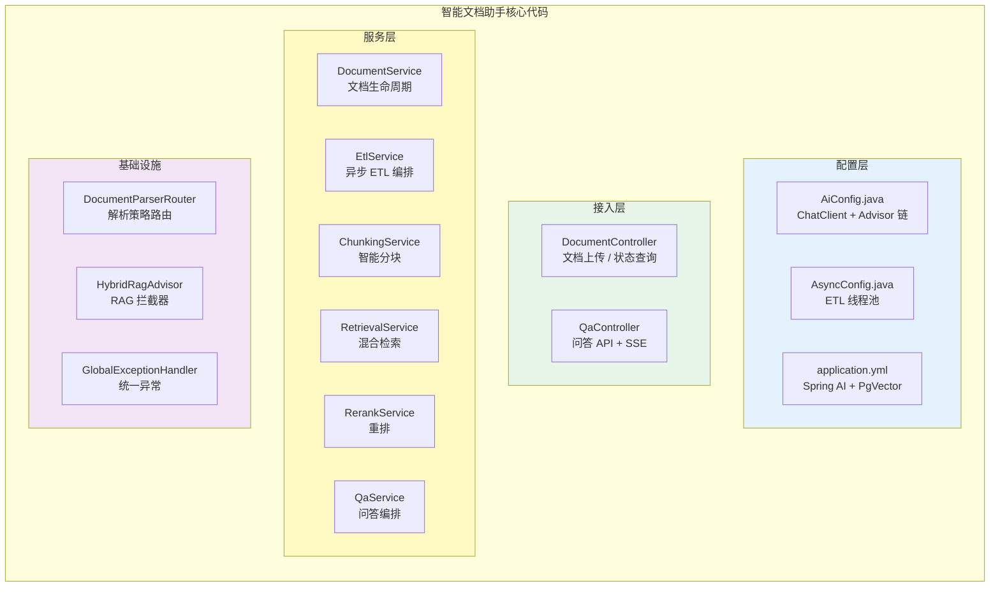
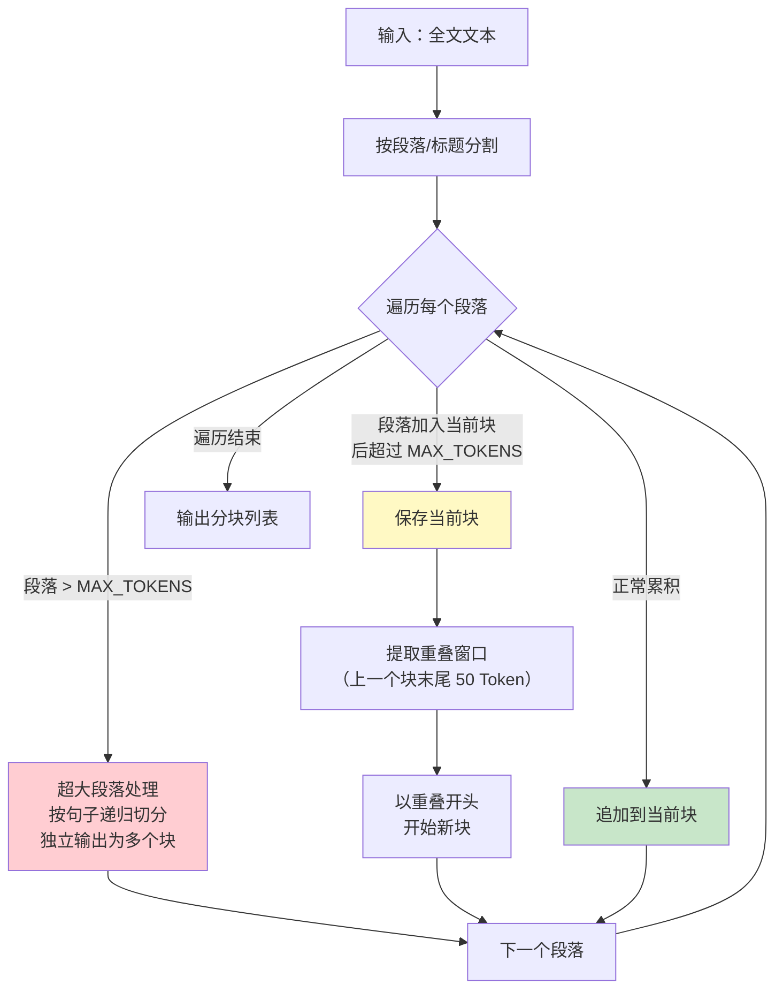
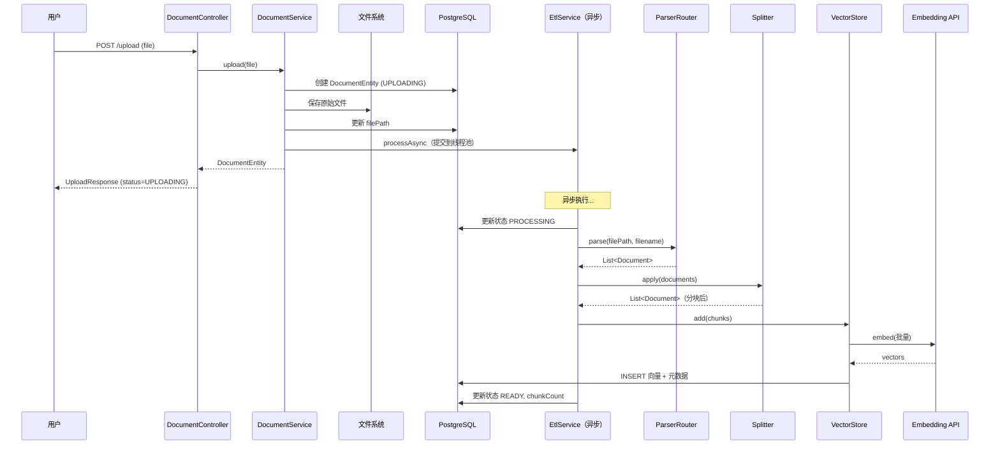
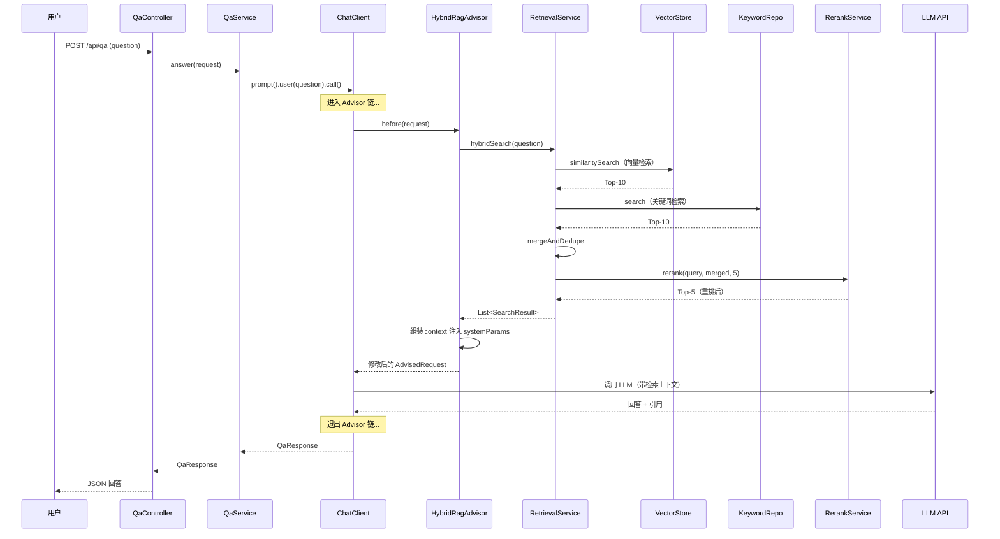
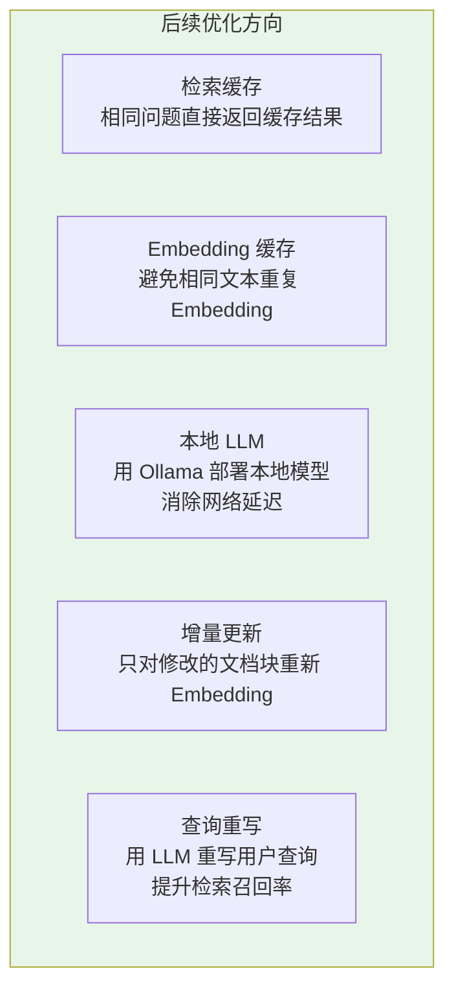

# 04-核心代码讲解

> **定位**：对智能文档助手项目中的关键代码片段做全量梳理和深度解析——从配置层到接入层，从 ETL Pipeline 到混合检索，每一段核心代码都说明"为什么这样写"以及"替代方案是什么"。这篇文档是前四篇文档的代码索引和技术沉淀。
>
> **读者画像**：已读完前四篇文档，需要对项目代码做深入理解或二次开发的开发者。
>
> **前置阅读**：[00-需求分析与架构设计](00-需求分析与架构设计.md) 至 [03-迭代二-多源检索与重排](03-迭代二-多源检索与重排.md)。

---

## 1. 项目代码全景

### 1.1 代码地图



### 1.2 代码分层职责

| 层 | 文件数 | 核心职责 | 关键设计模式 |
|----|-------|---------|------------|
| 配置层 | 3 | Bean 装配、参数绑定 | Builder |
| 接入层 | 2 | HTTP 端点、参数校验 | Controller |
| 服务层 | 6 | 业务编排、核心逻辑 | 策略、模板方法 |
| 基础设施 | 3 | 解析路由、拦截器、异常 | 策略路由、AOP |

---

## 2. 配置层代码解析

### 2.1 application.yml 关键配置

```yaml
spring:
  ai:
    openai:
      chat:
        options:
          model: gpt-4o
          temperature: 0.3
      embedding:
        options:
          model: text-embedding-3-small
    vectorstore:
      pgvector:
        index-type: HNSW
        distance-type: COSINE_DISTANCE
        dimensions: 1536
```

**逐行解析**：

- **`temperature: 0.3`**：低温度是事实性问答的关键参数。温度越高，LLM 输出越"有创意"，但事实性问答不需要创意——我们需要确定性的、基于文档的回答。0.3 在"严格遵循参考信息"和"语言通顺自然"之间取得平衡。如果发现 LLM 仍然有编造倾向，可以降到 0.1。

- **`text-embedding-3-small`**：1536 维 Embedding 模型。维度的选择直接影响检索质量和存储成本——维度越高，语义表示越精细，但存储和检索开销也越大。1536 维在中文企业文档场景下是甜区。

- **`index-type: HNSW`**：Hierarchical Navigable Small World 图索引。相比暴力搜索（精确但慢）和 IVF（快但召回率低），HNSW 在召回率和延迟之间取得了最佳平衡。PgVector 0.7+ 版本对 HNSW 有良好支持。

> **Embedding 维度和索引选型深入** → [教程 26-向量数据库选型](../../教程/26-向量数据库选型.md)：教程详细对比了不同维度的 Embedding 模型（768/1024/1536/3072）在召回率、存储成本、查询延迟上的表现，以及 HNSW vs IVF 索引参数调优。

### 2.2 AiConfig——ChatClient 装配

```java
@Configuration
public class AiConfig {

    @Bean
    public ChatClient chatClient(ChatClient.Builder builder,
                                  RetrievalService retrievalService) {
        return builder
            .defaultSystem("""
                你是企业文档问答助手。请严格基于提供的参考文档回答用户问题。

                规则：
                1. 只使用参考文档中的信息回答，不要编造。
                2. 如果参考文档中没有相关信息，请明确回答"根据现有文档，我无法回答这个问题"。
                3. 回答时请标注信息来源（文档标题 + 相关段落）。
                4. 保持简洁、专业、准确。
                """)
            .defaultAdvisors(
                new HybridRagAdvisor(retrievalService)
            )
            .build();
    }
}
```

**设计要点**：

`ChatClient.Builder` 由 Spring AI Starter 自动注入，已经包含了 `OpenAiChatModel` 和 `OpenAiEmbeddingModel` 的配置。我们在 `AiConfig` 中做两件事：

1. **设置系统提示词**：四条规则分别约束了信息来源、无答案处理、引用标注和回答风格。这是控制 LLM 行为的第一道防线。

2. **注册 Advisor 链**：`HybridRagAdvisor` 被注册为默认 Advisor，所有通过 `ChatClient` 发起的对话都会自动经过混合检索。这是 RAG 逻辑与业务逻辑解耦的关键。

**替代方案**：如果需要在不同的问答场景中使用不同的 Advisor 组合（如简单问题不检索、复杂问题走完整管线），可以定义多个 `ChatClient` Bean，每个绑定不同的 Advisor 链。

> **ChatClient 配置深入** → [教程 02-ChatClient 与对话模型](../../教程/02-ChatClient与对话模型.md)：教程讲解了 ChatClient.Builder 的完整 API，包括 `defaultSystem`、`defaultAdvisors`、`defaultTools`、`defaultFunctions` 等配置项。

### 2.3 AsyncConfig——ETL 线程池

```java
@Bean("etlTaskExecutor")
public Executor etlTaskExecutor() {
    ThreadPoolTaskExecutor executor = new ThreadPoolTaskExecutor();
    executor.setCorePoolSize(2);
    executor.setMaxPoolSize(4);
    executor.setQueueCapacity(50);
    executor.setThreadNamePrefix("etl-");
    executor.setRejectedExecutionHandler(new ThreadPoolExecutor.CallerRunsPolicy());
    executor.initialize();
    return executor;
}
```

**参数设计推理**：

- **核心线程 = 2**：Embedding API 有并发限制。OpenAI 的 `text-embedding-3-small` 默认 RPM 限制为 3000，每批 20 个 chunk，两个线程并发处理已经足够。
- **最大线程 = 4**：高峰期适度增加并发，但不冲击 API 限流。
- **队列容量 = 50**：大量文档导入时缓冲。如果 50 都满了，说明系统积压严重，此时 `CallerRunsPolicy` 让调用线程自己执行——相当于降级为同步处理，起到背压保护作用。

**替代方案**：对于需要处理大规模文档导入（10000+ 文档）的场景，可以将线程池替换为消息队列（RabbitMQ / Kafka），获得更好的削峰填谷和故障恢复能力。

---

## 3. 接入层代码解析

### 3.1 DocumentController

```java
@RestController
@RequestMapping("/api/documents")
public class DocumentController {

    private final DocumentService documentService;

    @PostMapping("/upload")
    public UploadResponse upload(@RequestParam("file") MultipartFile file) {
        DocumentEntity doc = documentService.upload(file);
        return new UploadResponse(
            doc.getId(),
            doc.getTitle(),
            doc.getStatus().name(),
            doc.getChunkCount()
        );
    }

    @GetMapping("/{id}/status")
    public DocumentStatusResponse getStatus(@PathVariable UUID id) {
        DocumentEntity doc = documentService.getById(id);
        return new DocumentStatusResponse(
            doc.getId(),
            doc.getStatus().name(),
            doc.getChunkCount()
        );
    }
}
```

**设计要点**：

上传接口返回 `UploadResponse`（包含 `status` 字段），而非 HTTP 202 状态码。这让前端无需处理不同的 HTTP 状态码，只需检查 JSON 中的 `status` 字段。虽然 RESTful 纯粹主义者会建议用 202 + Location header，但在实际前端开发中，统一 200 + 业务状态字段的体验更好。

**改进方向**：生产环境应该添加文件大小限制、文件类型白名单校验、文件内容安全扫描。Spring Boot 的 `spring.servlet.multipart.max-file-size` 可以限制上传大小。

### 3.2 QaController——SSE 流式端点

```java
@RestController
@RequestMapping("/api/qa")
public class QaController {

    @PostMapping
    public QaResponse ask(@RequestBody QaRequest request) {
        return qaService.answer(request);
    }

    @PostMapping(value = "/stream", produces = MediaType.TEXT_EVENT_STREAM_VALUE)
    public Flux<String> askStream(@RequestBody QaRequest request) {
        return qaService.answerStream(request);
    }
}
```

**SSE 端点关键点**：

- **`produces = TEXT_EVENT_STREAM_VALUE`**：声明返回 SSE 格式。浏览器原生支持 `EventSource` API 接收 SSE，无需额外库。
- **`Flux<String>`**：WebFlux 响应式返回类型。`Flux` 表示 0 到 N 个元素的异步序列，每个元素作为一个 SSE event 推送到客户端。
- **两个端点分工**：`POST /api/qa` 返回完整 JSON（便于 API 集成），`POST /api/qa/stream` 返回 SSE 流（便于前端打字机效果）。

> **SSE 流式通信深入** → [教程 09-SSE 流式通信](../../教程/09-SSE流式通信.md)：教程详细讲解了 SSE 协议格式、WebFlux 的 Flux/Mono 响应式编程模型、SSE 与 WebSocket 的对比选择，以及前端 EventSource 的使用方式。

---

## 4. 服务层代码解析

### 4.1 DocumentService——文档生命周期管理

```java
@Service
public class DocumentService {

    public DocumentEntity upload(MultipartFile file) {
        // 1. 创建元数据（状态 = UPLOADING）
        DocumentEntity doc = createDocumentEntity(file);
        documentRepository.save(doc);

        // 2. 保存原始文件
        Path filePath = saveFile(file, doc.getId());
        doc.setFilePath(filePath.toString());
        documentRepository.save(doc);

        // 3. 异步启动 ETL
        etlService.processAsync(doc.getId(), filePath, file.getOriginalFilename());

        return doc;
    }
}
```

**设计模式**：这个方法体现了 **命令-查询分离（CQS）** 原则。`upload` 是一个命令操作（创建资源），它创建文档、保存文件、启动 ETL，但不等待处理完成——真正的处理结果是后续通过 `getStatus` 查询获取的。

**事务边界**：`upload` 方法本身的文件保存和元数据创建是同步的（短事务），ETL 处理是异步的（独立事务）。如果 ETL 失败，文档状态变为 `FAILED`，原始文件保留——管理员可以选择重新处理或删除。

### 4.2 EtlService——ETL Pipeline 编排

```java
@Async("etlTaskExecutor")
public void processAsync(UUID documentId, Path filePath, String originalFilename) {
    DocumentEntity doc = documentRepository.findById(documentId).orElseThrow();

    try {
        doc.setStatus(DocumentStatus.PROCESSING);
        documentRepository.save(doc);

        // Step 1: 解析（DocumentParserRouter 自动路由格式）
        List<Document> rawDocuments = parserRouter.parse(
            new FileSystemResource(filePath), originalFilename, documentId.toString()
        );

        // Step 2: 分块（ParagraphAwareSplitter 段落感知分块）
        List<Document> chunks = textSplitter.apply(rawDocuments);

        // Step 3: 附加元数据
        attachMetadata(chunks, doc);

        // Step 4: 批量向量化 + 存储
        batchEmbedAndStore(chunks);

        // Step 5: 更新状态为 READY
        updateDocumentStatus(doc, DocumentStatus.READY, chunks.size());

    } catch (Exception e) {
        updateDocumentStatus(doc, DocumentStatus.FAILED, 0);
        log.error("ETL 处理失败: documentId={}", documentId, e);
    }
}
```

**Pipeline 设计要点**：

五步 Pipeline 是一个典型的 **管道模式（Pipeline Pattern）**——每一步接收上一步的输出，产出下一步的输入。这种设计的优势是每一步都可以独立测试和替换：

- 替换解析器：修改 `DocumentParserRouter` 中的解析器实现。
- 替换分块策略：实现新的 `TextSplitter` 子类。
- 替换存储后端：修改 `VectorStore` 配置（如从 PgVector 切到 Milvus）。

**异常处理策略**：整个 ETL 过程在一个 try-catch 中，任何步骤失败都导致文档状态变为 `FAILED`。这是 **熔断式异常处理**——一个文档的处理失败不影响其他文档，也不影响系统正常运行。

### 4.3 ParagraphAwareSplitter——分块算法核心

```java
@Override
protected List<String> splitText(String text) {
    List<String> paragraphs = splitByParagraphs(text);
    List<String> chunks = new ArrayList<>();
    StringBuilder currentChunk = new StringBuilder();
    int currentTokens = 0;

    for (String paragraph : paragraphs) {
        int paraTokens = estimateTokens(paragraph);

        if (paraTokens > MAX_TOKENS) {
            // 超大段落：独立递归切分
            flushChunk(chunks, currentChunk, currentTokens);
            chunks.addAll(splitLargeParagraph(paragraph, TARGET_TOKENS, OVERLAP_TOKENS));
            currentChunk = new StringBuilder();
            currentTokens = 0;
        } else if (currentTokens + paraTokens > MAX_TOKENS) {
            // 累积超限：保存当前块，开始新块（带重叠窗口）
            flushChunk(chunks, currentChunk, currentTokens);
            String overlap = extractOverlap(currentChunk.toString(), OVERLAP_TOKENS);
            currentChunk = new StringBuilder(overlap);
            currentChunk.append(paragraph);
            currentTokens = estimateTokens(overlap) + paraTokens;
        } else {
            // 正常累积
            appendParagraph(currentChunk, paragraph);
            currentTokens += paraTokens;
        }
    }
    flushChunk(chunks, currentChunk, currentTokens);
    return chunks;
}
```

**算法流程图解**：



**三种分支的处理逻辑**：

1. **超大段落**（`paraTokens > MAX_TOKENS`）：说明单个段落超过了块大小上限。这可能是一个没有分段的超长章节。策略是按句子边界做二次切分，确保句子完整性。

2. **累积超限**（`currentTokens + paraTokens > MAX_TOKENS`）：当前块已接近上限，加入新段落会超限。策略是保存当前块、提取末尾重叠窗口、以重叠窗口开头开始新块。重叠确保跨块边界的信息不会丢失。

3. **正常累积**：段落加入当前块不超限，直接追加。

**Token 估算的准确性**：`estimateTokens` 方法用中英文混合估算（中文 1 字 ≈ 1.5 Token，英文 1 词 ≈ 1.3 Token）。这不是精确的 Token 计数（精确计数需要用 tokenizer 库），但对于分块决策来说足够——即使估算偏差 20%，也只是导致块大小在 400-600 Token 范围内波动，不影响检索质量。

### 4.4 RetrievalService——混合检索编排

```java
public List<SearchResult> hybridSearch(String query) {
    // 1. 双路并行召回
    List<SearchResult> vectorResults = vectorSearch(query);
    List<SearchResult> keywordResults = keywordSearch(query);

    // 2. 合并去重
    List<SearchResult> merged = mergeAndDedupe(vectorResults, keywordResults);

    // 3. 重排
    return rerankService.rerank(query, merged, FINAL_TOP_K);
}
```

**合并去重的核心逻辑**：

```java
private List<SearchResult> mergeAndDedupe(List<SearchResult> vector,
                                           List<SearchResult> keyword) {
    Map<String, SearchResult> merged = new LinkedHashMap<>();

    vector.forEach(r -> merged.put(r.id(), r));

    for (SearchResult kr : keyword) {
        merged.merge(kr.id(), kr, (existing, incoming) ->
            new SearchResult(
                existing.id(),
                existing.content(),
                existing.metadata(),
                Math.max(existing.score(), incoming.score()),
                "HYBRID"
            )
        );
    }

    return new ArrayList<>(merged.values());
}
```

**`LinkedHashMap` 的妙用**：保持插入顺序（向量检索结果在前），同时用 `merge` 函数处理键冲突。当一个文档块同时被两种方式检索到时，`merge` 函数取较高的分数并标记来源为 `HYBRID`——这种"双路命中"的结果通常质量最高。

**并行化优化空间**：当前代码中向量检索和关键词检索是串行的。由于两者查询的数据源不同（向量索引 vs 全文索引），可以并行执行：

```java
// 并行版本（Java 21 虚拟线程）
List<SearchResult> vectorResults, keywordResults;
try (var executor = Executors.newVirtualThreadPerTaskExecutor()) {
    var future1 = executor.submit(() -> vectorSearch(query));
    var future2 = executor.submit(() -> keywordSearch(query));
    vectorResults = future1.get();
    keywordResults = future2.get();
}
```

Java 21 虚拟线程让并行化变得极其轻量——两个查询各自跑在虚拟线程上，互不阻塞，总延迟约为较慢查询的延迟，而非两者之和。

### 4.5 RerankService——重排调用

```java
public List<SearchResult> rerank(String query,
                                  List<SearchResult> candidates,
                                  int topK) {
    if (candidates.size() <= topK) {
        return candidates;
    }

    RerankResponse response = rerankClient.post()
        .uri("/rerank")
        .bodyValue(new RerankRequest(
            query,
            candidates.stream().map(SearchResult::content).toList()
        ))
        .retrieve()
        .bodyToMono(RerankResponse.class)
        .block();

    return response.scores().stream()
        .sorted(Comparator.comparingDouble(RerankScore::score).reversed())
        .limit(topK)
        .map(score -> {
            SearchResult original = candidates.get(score.index());
            return new SearchResult(
                original.id(),
                original.content(),
                original.metadata(),
                score.score(),
                original.source()
            );
        })
        .toList();
}
```

**短路优化**：`candidates.size() <= topK` 时直接返回，不调用重排模型 API。这在召回结果本身就少于最终需要数量时避免了不必要的 API 调用。

**响应式改写**：Demo 中用 `.block()` 做同步等待。生产环境中，如果整个调用链是响应式的（WebFlux），应该返回 `Mono<List<SearchResult>>` 并用响应式链替代 `.block()`：

```java
public Mono<List<SearchResult>> rerankReactive(String query,
                                                List<SearchResult> candidates,
                                                int topK) {
    if (candidates.size() <= topK) {
        return Mono.just(candidates);
    }

    return rerankClient.post()
        .uri("/rerank")
        .bodyValue(new RerankRequest(query,
            candidates.stream().map(SearchResult::content).toList()))
        .retrieve()
        .bodyToMono(RerankResponse.class)
        .map(response -> response.scores().stream()
            .sorted(Comparator.comparingDouble(RerankScore::score).reversed())
            .limit(topK)
            .map(score -> rebuildResult(candidates, score))
            .toList());
}
```

---

## 5. 基础设施代码解析

### 5.1 DocumentParserRouter——策略路由

```java
@Component
public class DocumentParserRouter {

    private final List<DocumentParser> parsers;

    public DocumentParserRouter(List<DocumentParser> parsers) {
        this.parsers = parsers;
    }

    public List<Document> parse(Resource resource, String filename, String documentId) {
        return parsers.stream()
            .filter(p -> p.supports(filename))
            .findFirst()
            .orElseThrow(() -> new IllegalArgumentException(
                "不支持的文件格式: " + filename
            ))
            .parse(resource, documentId);
    }
}
```

**Spring 依赖注入的巧用**：构造器接收 `List<DocumentParser>`——Spring 会自动注入所有 `DocumentParser` 接口的实现 Bean。新增解析器只需创建一个实现类标注 `@Component`，路由器零修改自动发现。这是 **开闭原则（OCP）** 的教科书级实现。

### 5.2 HybridRagAdvisor——RAG 拦截器

```java
public class HybridRagAdvisor implements BaseAdvisor {

    @Override
    public AdvisedRequest before(AdvisedRequest request) {
        String query = request.userText();

        List<SearchResult> results = retrievalService.hybridSearch(query);

        String context = results.stream()
            .map(r -> {
                String title = (String) r.metadata().getOrDefault("title", "未知文档");
                return String.format("【来源: %s】\n%s", title, r.content());
            })
            .collect(Collectors.joining("\n\n---\n\n"));

        String ragInstructions = promptTemplate.render(Map.of("context", context));

        return AdvisedRequest.from(request)
            .withSystemParams(systemParams -> {
                systemParams.put("rag_context", ragInstructions);
                return systemParams;
            })
            .build();
    }
}
```

**Advisor 的核心价值**：将 RAG 逻辑从业务代码中完全解耦。`QaService` 不需要知道检索是怎么做的、用的什么策略、检索了哪些文档——它只管调用 `ChatClient`，Advisor 在中间自动完成检索和上下文注入。

**上下文格式化的技巧**：每个文档块用 `【来源: 文档标题】` 前缀标注，相邻块用 `---` 分隔。这种格式有两个好处：

1. LLM 能识别出每段内容的来源，便于在回答中引用。
2. `---` 是 Markdown 的分隔符，LLM 在训练数据中见过大量这种格式，天然理解它表示内容边界。

> **Advisor 链机制深入** → [教程 13-Advisor 链与拦截器](../../教程/13-Advisor链与拦截器.md)：教程讲解了 Advisor 的执行链顺序（按 Order 排序）、`before()` 和 `after()` 的调用时机、多 Advisor 组合（如 RAG + Memory + Logging）的链式处理流程。

### 5.3 GlobalExceptionHandler——统一异常

```java
@RestControllerAdvice
public class GlobalExceptionHandler {

    @ExceptionHandler(DocumentException.class)
    public ResponseEntity<ErrorResponse> handleDocumentException(DocumentException e) {
        ErrorResponse error = new ErrorResponse("DOCUMENT_ERROR", e.getMessage());
        return ResponseEntity.status(HttpStatus.INTERNAL_SERVER_ERROR).body(error);
    }

    @ExceptionHandler(IllegalArgumentException.class)
    public ResponseEntity<ErrorResponse> handleIllegalArgument(IllegalArgumentException e) {
        ErrorResponse error = new ErrorResponse("BAD_REQUEST", e.getMessage());
        return ResponseEntity.status(HttpStatus.BAD_REQUEST).body(error);
    }

    @ExceptionHandler(Exception.class)
    public ResponseEntity<ErrorResponse> handleGeneric(Exception e) {
        ErrorResponse error = new ErrorResponse("INTERNAL_ERROR", "系统内部错误");
        return ResponseEntity.status(HttpStatus.INTERNAL_SERVER_ERROR).body(error);
    }

    public record ErrorResponse(String code, String message) {}
}
```

**异常分层**：

- `IllegalArgumentException`：用户输入问题（如不支持的文件格式），返回 400。
- `DocumentException`：文档处理业务异常，返回 500 但附带具体错误信息。
- `Exception`：兜底处理，返回 500 但不暴露内部错误细节（安全考虑）。

---

## 6. 关键 DTO 定义汇总

### 6.1 用 Java 21 record 统一 DTO

```java
// 问答请求
public record QaRequest(
    String question,
    Integer topK,
    Double similarityThreshold
) {}

// 结构化问答响应
public record QaResponse(
    String answer,
    List<Citation> citations,
    boolean confident,
    String retrievalStrategy
) {
    public record Citation(
        String documentTitle,
        String citedSection,
        String matchedChunkId
    ) {}
}

// 检索结果（内部使用）
public record SearchResult(
    String id,
    String content,
    Map<String, Object> metadata,
    double score,
    String source    // VECTOR / KEYWORD / HYBRID
) {}

// 上传响应
public record UploadResponse(
    UUID documentId,
    String title,
    String status,
    Integer chunkCount
) {}
```

**为什么用 record 而不是 class**：

1. **不可变性**：DTO 应该是不可变的——一旦创建就不修改。record 天然不可变。
2. **简洁性**：一行定义包含字段、构造器、accessor、equals、hashCode、toString。
3. **模式匹配**：Java 21 的模式匹配与 record 配合使用（`switch` 的 deconstruction），后续代码更简洁。

> **结构化输出深入** → [教程 12-结构化输出](../../教程/12-结构化输出.md)：教程讲解了 Spring AI 如何将 Java record/class 转为 JSON Schema、注入 Prompt，以及 `entity()` 方法的底层反序列化机制。

---

## 7. 数据流全链路

### 7.1 文档上传全链路



### 7.2 问答全链路



---

## 8. 性能基准与优化建议

### 8.1 典型性能指标

| 操作 | 平均耗时 | 瓶颈分析 |
|------|---------|---------|
| 文档上传（同步部分） | 50-100ms | 文件保存 IO |
| PDF ETL（30 页） | 8-15s | Tika 解析 + 批量 Embedding |
| Word ETL（20 页） | 5-10s | Tika 解析 + 批量 Embedding |
| Markdown ETL | 2-5s | 分块 + 批量 Embedding |
| 向量检索 | 20-50ms | PgVector HNSW 查询 |
| 关键词检索 | 10-30ms | PostgreSQL GIN 查询 |
| Rerank（20 候选） | 100-300ms | Cross-Encoder 推理 |
| LLM 生成 | 1-3s | OpenAI API 延迟 |
| **问答总延迟** | **2-4s** | 主要瓶颈在 LLM |

### 8.2 优化方向



> **性能优化深入** → [教程 33-Agent 性能优化](../../教程/33-Agent性能优化.md) 和 [教程 29-上下文工程](../../教程/29-上下文工程.md)：教程讲解了 RAG 系统的性能瓶颈定位、Embedding 缓存策略、查询重写、上下文压缩等优化手段。

---

## 9. 总结

本文对智能文档助手项目的全部核心代码做了深度解析，关键结论如下：

1. **配置层**：`AiConfig` 通过 Builder 模式装配 ChatClient + Advisor 链；`AsyncConfig` 的线程池参数基于 Embedding API 限流和背压保护设计。`temperature: 0.3` 和 HNSW 索引是事实性问答场景的关键参数。

2. **接入层**：DocumentController 返回业务状态码而非 HTTP 状态码，简化前端处理。QaController 的双端点设计（同步 + SSE）满足 API 集成和前端打字机两种需求。

3. **服务层**：EtlService 的五步 Pipeline 是教科书级的管道模式实现。ParagraphAwareSplitter 的三分支算法（超大段落 / 累积超限 / 正常累积）确保分块语义完整性。RetrievalService 的混合检索 + 重排把检索质量提升到企业可用水平。

4. **基础设施**：DocumentParserRouter 用 Spring 的 `List<Interface>` 注入实现策略路由，新增格式零修改。HybridRagAdvisor 通过 Advisor 链将 RAG 逻辑与业务代码完全解耦。

5. **Java 21 特性利用**：record 定义不可变 DTO、虚拟线程并行化双路检索、文本块定义多行系统提示词——三个特性贯穿全项目代码。

整个项目的核心代码不到 2000 行（不含配置和测试），但覆盖了 RAG 文档问答系统的完整链路——从文档上传到智能回答。这得益于 Spring AI 2.0 的高度抽象（VectorStore、ChatClient、Advisor、ETL Pipeline）和 Java 21 的语法简洁性（record、虚拟线程、模式匹配）。
