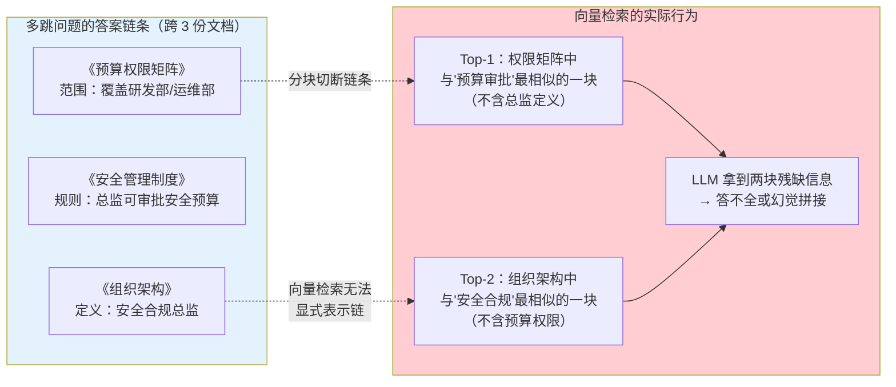
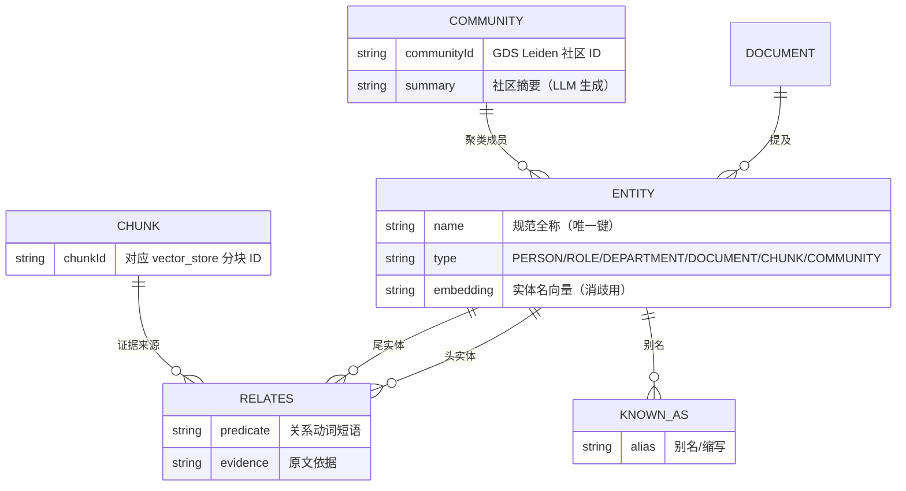
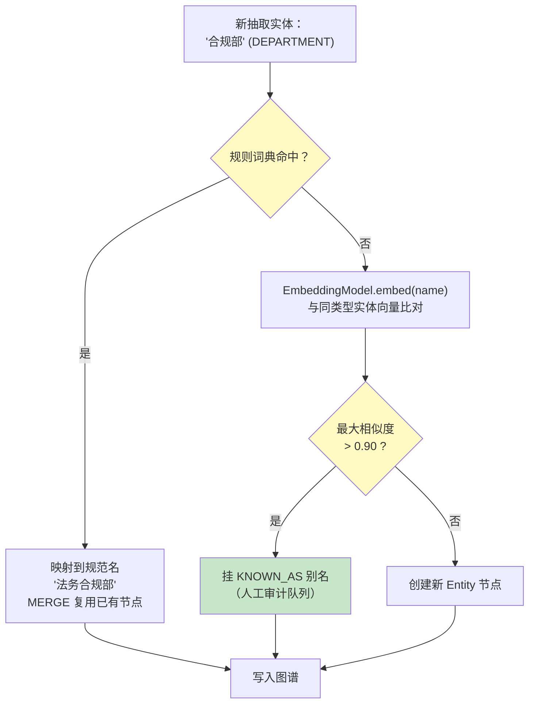
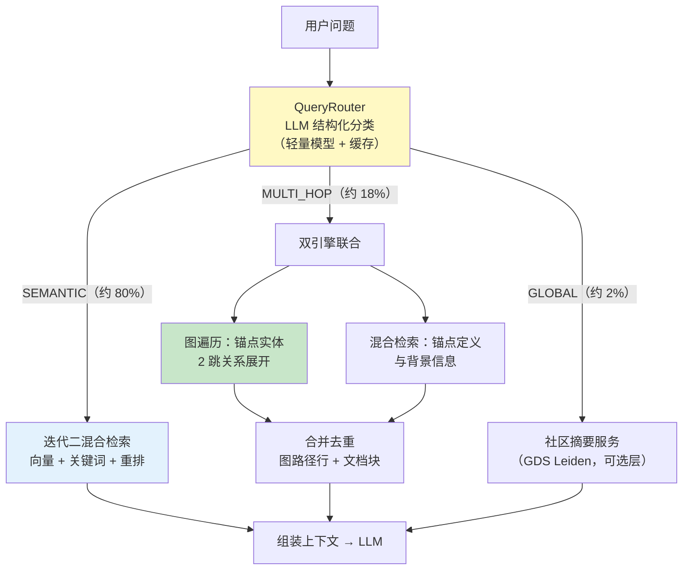
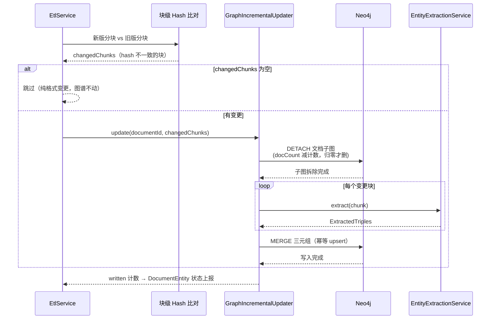

# 05-GraphRAG 知识图谱深化

> **定位**：迭代三——解决迭代二遗留的"多跳问题答不出"：用户问"负责安全合规的总监的审批权限覆盖哪些部门？"，答案分散在《组织架构》《审批权限矩阵》《安全管理制度》三份文档的三个段落里，向量检索只能找到"最相似的一块"，无法把三块信息串起来。本迭代引入**知识图谱**：用 LLM 结构化抽取实体与关系、Neo4j 构建图谱、查询路由让"语义问题走向量、多跳问题走图遍历"、增量更新让文档变更只做局部重建。读完这篇，系统具备跨文档多跳问答能力。
>
> **读者画像**：已完成迭代二，需要让文档问答系统回答跨文档、多跳、全局性问题的开发者。
>
> **前置阅读**：[04-核心代码讲解](04-核心代码讲解.md)、[教程 35-高级 RAG 与 Agentic RAG](../../教程/78-高级RAG与AgenticRAG.md)、[附录 10-知识图谱工程/00-Neo4j落地GraphRAG](../../附录/10-知识图谱工程/00-Neo4j落地GraphRAG.md)。API 真实性以 [附录 05-SpringAI2-API基准](../../附录/05-SpringAI2-API基准/00-Advisor与ChatMemory.md) 为准。
>
> **铁律 0**：本文 Spring AI API 均经本地 jar `javap` 实证（`entity(Class, Consumer<EntityParamSpec>)` / `SearchRequest.builder()` / `VectorStore.similaritySearch`）；Neo4j 为第三方（坐标 `spring-boot-starter-data-neo4j`，需在 pom.xml 中添加依赖，本地未下载未实证，以引入版本为准）；社区检测依赖 Neo4j GDS 插件（需在服务端安装）。

---

## 1. 四问

| 问 | 答 |
|----|----|
| **新增了什么需求** | 多跳问题（跨文档实体链推理）、全局性问题（"这批制度文档的主题分布"）、实体消歧（"合规部"="法务合规部"）、文档变更后图谱增量更新 |
| **影响了哪些模块** | 新增 `EntityExtractionService`/`GraphIngestService`/`GraphSearchService`/`QueryRouter`；`EtlService` 增加图谱构建分支；`RetrievalService.hybridSearch` 升级为路由式检索；pom 追加 Neo4j |
| **架构如何演进** | ETL 从"单管线（解析→分块→向量化）"演进为"双分支（向量分支 + 图谱分支）"；检索从"固定双路召回"演进为"查询路由：LLM 判定问题类型 → 语义走向量、多跳走图遍历、全局走社区摘要" |
| **上一版痛点是什么** | ① 多跳问题：Top-5 里没有一块同时包含"总监→部门→权限"完整链条 ② 实体别名导致召回割裂 ③ 全局性问题向量检索结构性无解 ④ 文档更新只能全量重建检索库，成本高 |

> **本节核对（四问完整性）**：① 新增需求四项与 §3-§6 四个主题一一对应；② "上一版痛点"四条均能在 §2 的失败案例/能力对照表中找到病根——两条通过即本节达标。

## 2. 为什么向量检索答不了多跳问题

### 2.1 一个真实失败案例

用户问题：**"安全合规总监审批权限覆盖哪些部门的预算？"**

答案链条：`安全合规总监`（组织架构文档）→ `安全管理制度` 规定其 `审批` 权限 → `预算审批权限矩阵` 规定权限覆盖 `研发部/运维部`。



问题的本质：**向量相似度度量的是"表面语义接近"，而多跳问题需要的是"结构化关系推理"**。分块再聪明，也无法在一块里同时装下链条两端的实体——这正是知识图谱的用武之地。

> **深入理解 GraphRAG 的原理与边界** → [教程 35-高级 RAG 与 Agentic RAG §2](../../教程/78-高级RAG与AgenticRAG.md)：教程讲解了 GraphRAG 与朴素 RAG 的能力边界对比、三元组抽取、图遍历检索的原理。

### 2.2 图谱补齐的两块能力

| 能力 | 向量检索 | 知识图谱 | 本项目落地 |
|------|---------|---------|-----------|
| 单跳语义问答（"年假几天"） | ✅ 强项 | ❌ 过度设计 | 走向量（迭代二管线不变） |
| 多跳链推理（A 的 B 的 C） | ❌ 结构性缺失 | ✅ 图遍历直达 | 走 Cypher 多跳查询 |
| 全局性总结（主题分布） | ❌ 只能采样 | ✅ 社区摘要 | 走社区级摘要 |
| 精确编号/专有名词 | ⚠️ 迭代二已用关键词补 | ✅ 实体节点精确匹配 | 三路并存，路由决定 |

**决策原则**：图谱不是替代向量检索，而是补位——80% 的日常问题仍是单跳语义问题，继续走向量；20% 的多跳/全局问题路由到图。这也是 [附录 10-知识图谱工程/00-Neo4j落地GraphRAG](../../附录/10-知识图谱工程/00-Neo4j落地GraphRAG.md) 反复强调的定位：**为多跳问题付钱，不为单跳问题付钱**（图谱构建有 LLM 抽取成本）。

### 2.3 本节核对（能力边界理解）

| # | 核对项 | 通过判据 |
|---|--------|---------|
| 1 | 能复述 §2.1 失败案例的答案链条与向量检索两块残缺结果 | 总监→审批→预算→覆盖部门，跨 3 文档 |
| 2 | 能说出"为多跳问题付钱，不为单跳问题付钱"对应的量化账 | 抽取成本约为向量化 3-5 倍、80/18/2 路由占比 |

## 3. 实体与关系抽取：LLM 结构化输出

### 3.1 抽取目标定义

把"自然语言块 → 结构化三元组"的转换交给 LLM 结构化输出。先定义抽取结果的 Java 结构：

```java
package com.example.docassistant.graph;

import java.util.List;

/**
 * LLM 实体关系抽取结果（结构化输出载体）
 */
public record ExtractedTriples(List<Triple> triples) {

    public record Triple(
            String subject,        // 头实体（如：安全合规总监）
            String subjectType,    // 头实体类型（PERSON / ROLE / DEPARTMENT / DOCUMENT / SYSTEM / POLICY / OTHER）
            String predicate,      // 关系（如：审批 / 隶属于 / 定义于 / 覆盖）
            String object,         // 尾实体（如：安全预算）
            String objectType,     // 尾实体类型（同上枚举）
            String evidence        // 抽取依据（原文片段，用于人工审计与回溯）
    ) {}
}
```

### 3.2 `EntityExtractionService.java`（完整代码）

```java
package com.example.docassistant.graph;

import org.springframework.ai.chat.client.ChatClient;
import org.springframework.ai.document.Document;
import org.springframework.stereotype.Service;

import java.util.List;

/**
 * LLM 实体关系抽取服务
 * 使用 entity(Class, Consumer<EntityParamSpec>) 带 Schema 校验的重载（Spring AI 2.0.0 真实 API，javap 实证）
 */
@Service
public class EntityExtractionService {

    private final ChatClient chatClient;

    private static final String EXTRACTION_PROMPT = """
            你是企业文档知识图谱的实体关系抽取器。请从下面的文本块中抽取实体与关系三元组。

            抽取规则：
            1. 实体类型限定为：PERSON（人）、ROLE（岗位/职级）、DEPARTMENT（部门）、
               DOCUMENT（制度文档）、SYSTEM（系统/工具）、POLICY（制度/规则）、OTHER。
            2. 关系用短动词或动词短语表达（如：隶属于、审批、负责、定义于、覆盖、引用）。
            3. 只抽取文本中有明确依据的事实，不推断、不脑补；evidence 字段填原文片段。
            4. 没有可抽取内容时返回空数组，不要编造。
            5. 实体名使用原文中的规范全称（如"法务合规部"不要缩写为"合规部"）。

            文本块：
            {chunk}
            """;

    public EntityExtractionService(ChatClient chatClient) {
        this.chatClient = chatClient;
    }

    /**
     * 对单个文档块抽取三元组。
     * entity(Class, spec) 变体 + validateSchema()：抽取失败（JSON 不合法）时抛
     * StructuredOutputConversionException 由调用方兜底，保证单块失败不拖垮整篇文档。
     */
    public ExtractedTriples extract(Document chunk) {
        return chatClient.prompt()
                .user(userSpec -> userSpec
                        .text(EXTRACTION_PROMPT)
                        .param("chunk", chunk.getText()))
                .call()
                .entity(ExtractedTriples.class, spec -> spec.validateSchema());
    }

    /**
     * 批量抽取 + 失败隔离：单块抽取失败返回空结果并计数（用于 ETL 状态上报）
     */
    public ExtractionBatch extractBatch(List<Document> chunks) {
        List<ExtractedTriples> results = new java.util.ArrayList<>(chunks.size());
        int failedCount = 0;
        for (Document chunk : chunks) {
            try {
                results.add(extract(chunk));
            } catch (Exception e) {
                failedCount++;
                results.add(new ExtractedTriples(List.of()));
            }
        }
        return new ExtractionBatch(results, failedCount);
    }

    public record ExtractionBatch(List<ExtractedTriples> batches, int failedChunks) {
        public long totalTriples() {
            return batches.stream().flatMap(t -> t.triples().stream()).count();
        }
    }
}
```

**关键设计**：

1. **`entity(Class, spec -> spec.validateSchema())`**：迭代零 ADR-001-03 预留的升级点在此兑现——抽取是"写入图谱"的源头，脏数据（缺字段、类型漂移）比缺数据更危险，Schema 校验让非法 JSON 在入口被拦截。
2. **失败隔离**：单块抽取失败返回空结果而不是中断整篇——图谱是增强能力，不能因为 5% 的抽取失败让 100% 的文档 ETL 失败（`failedChunks` 计数上报到 `DocumentEntity.errorMessage` 供运维查看）。
3. **evidence 字段**：每个三元组携带原文依据，这是引用溯源（迭代二 citations）在图谱侧的延续——图遍历答案同样能标注"来自哪份文档哪一段"。

### 3.3 抽取成本控制

按 400-600 Token 块、每块一次抽取调用估算：

| 文档规模 | 块数 | 抽取调用 | 说明 |
|---------|------|---------|------|
| 100 篇 × 30 块 | 3000 | 3000 | 一次性建图，跑在 ETL 线程池（复用 `etlTaskExecutor`） |
| 单篇更新 | 30 | 30 | 增量更新只抽取变更块（§6） |

抽取用低温度、固定系统提示词，输出 token 远小于输入（只出 JSON），成本约为向量化的 3-5 倍——**这就是"为多跳问题付钱"的账**，也是查询路由（§5）必须做对的原因：单跳问题绝不触发图谱路径。

### 3.4 本节测试与验证（三元组抽取）

**前置条件**：应用可调用 LLM；§3.2 代码手写完成（`entity(Class, spec)` 重载需 Spring AI 2.0.0，已 javap 实证）。

**材料——抽取探针文本**：

```java
// 直接调 EntityExtractionService.extract，用含明确实体的块做探针
Document chunk = Document.builder()
        .text("安全合规总监隶属于执行委员会，负责审批安全预算，预算覆盖研发部与运维部。")
        .metadata(Map.of()).build();
ExtractedTriples t = extractionService.extract(chunk);

// 对照组：无实体文本（"今天天气不错。"）→ 应返回空 triples
```

**步骤与断言**：

| # | 操作 | 预期（PASS 判据） |
|---|------|------------------|
| 1 | `mvn clean compile` | 编译通过（`entity(ExtractedTriples.class, spec -> spec.validateSchema())` 签名真实） |
| 2 | 材料探针 | triples ≥2 条；subject/object 均为规范全称；predicate 为短动词（隶属于/审批/覆盖） |
| 3 | 抽查 evidence | 每条 evidence 是输入文本的真实子串（可溯源） |
| 4 | 对照组（空文本） | 返回空数组，不编造 |
| 5 | `extractBatch` 混入 1 个坏块（超长乱码） | failedChunks=1、其余块正常返回，整批不中断（验收 1 的失败隔离） |

**失败排查**：编译报 spec 重载不存在→Spring AI 版本非 2.0.0，回查附录 05；evidence 编造→EXTRACTION_PROMPT 第 3 条规则未生效（核对提示词模板）；单块失败拖垮整批→extractBatch 的 try-catch 缺失。

## 4. 知识图谱构建与消歧（Neo4j）

### 4.1 pom.xml 追加依赖

```xml
        <!-- 追加（迭代三）：Neo4j 知识图谱存储与访问 -->
        <dependency>
            <groupId>org.springframework.boot</groupId>
            <artifactId>spring-boot-starter-data-neo4j</artifactId>
        </dependency>
```

> 需在 pom.xml 中添加依赖。版本由 `spring-boot-starter-parent` 4.1.0 统一管理；本地未下载该 jar，Neo4j Driver API（`org.neo4j.driver.Driver`/`Session`）以引入版本为准。`application.yml` 追加：`spring.neo4j.uri: bolt://localhost:7687`、`spring.neo4j.authentication.username/password`（用 `${NEO4J_PASSWORD}` 环境变量占位）。

### 4.2 图谱 Schema



三个 Schema 决策：

- **实体节点 `name` 唯一**：`法务合规部` 只有一个节点，"合规部"作为 `KNOWN_AS` 别名挂在它下面——消歧的物理基础。
- **关系带 `chunkId`**：每条关系回指证据分块，图遍历的结果能直接映射回向量库的 chunk，复用迭代二的引用标注体系。
- **`COMMUNITY` 是可选层**：社区检测由 Neo4j GDS 插件（Graph Data Science，需在 Neo4j 服务端安装）的 Leiden 算法离线跑，用于全局性问题；不装 GDS 插件则系统退化为"多跳可用、全局不可用"，不影响主链路。

### 4.3 `GraphIngestService.java`（写入与消歧，完整代码）

```java
package com.example.docassistant.graph;

import org.neo4j.driver.Driver;
import org.neo4j.driver.Session;
import org.springframework.ai.document.Document;
import org.springframework.stereotype.Service;

import java.util.HashMap;
import java.util.List;
import java.util.Map;

/**
 * 图谱写入服务：三元组 upsert + 实体消歧
 * Neo4j Driver API（org.neo4j.driver）——需引入 spring-boot-starter-data-neo4j，以引入版本为准
 */
@Service
public class GraphIngestService {

    private final Driver driver;
    private final EntityExtractionService extractionService;

    /**
     * 实体 upsert + 关系创建（Cypher MERGE 保证幂等——增量重建时重复写入不产生重复节点）
     * MERGE 的关键：按 name+type 匹配，已存在则复用（跨文档同实体自动汇聚），不存在则创建
     */
    private static final String UPSERT_TRIPLE = """
            MERGE (s:Entity {name: $subject})
              ON CREATE SET s.type = $subjectType, s.docCount = 1
              ON MATCH SET s.docCount = coalesce(s.docCount, 0) + 1
            MERGE (o:Entity {name: $object})
              ON CREATE SET o.type = $objectType, o.docCount = 1
              ON MATCH SET o.docCount = coalesce(o.docCount, 0) + 1
            MERGE (s)-[r:RELATES {predicate: $predicate}]->(o)
              ON CREATE SET r.evidence = $evidence, r.chunkId = $chunkId
            RETURN id(s), id(o)
            """;

    public GraphIngestService(Driver driver, EntityExtractionService extractionService) {
        this.driver = driver;
        this.extractionService = extractionService;
    }

    /**
     * 对一批分块抽取并写入图谱（ETL 图谱分支的入口）
     */
    public long ingestChunks(List<Document> chunks, String documentId) {
        EntityExtractionService.ExtractionBatch batch = extractionService.extractBatch(chunks);

        long written = 0;
        try (Session session = driver.session()) {
            // extractBatch 的结果与 chunks 顺序一一对应——chunkId 取当前块的 ID
            for (int i = 0; i < chunks.size(); i++) {
                EntityExtractionService.ExtractedTriples triples = batch.batches().get(i);
                String chunkId = chunks.get(i).getId();
                for (EntityExtractionService.Triple triple : triples.triples()) {
                    Map<String, Object> params = new HashMap<>();
                    params.put("subject", triple.subject());
                    params.put("subjectType", triple.subjectType());
                    params.put("predicate", triple.predicate());
                    params.put("object", triple.object());
                    params.put("objectType", triple.objectType());
                    params.put("evidence", triple.evidence());
                    params.put("chunkId", chunkId);
                    session.run(UPSERT_TRIPLE, params);
                    written++;
                }
            }
        }
        // 记录"文档-实体"提及关系，增量更新按 documentId 定位要拆的子图
        try (Session session = driver.session()) {
            session.run(
                    "MATCH (e:Entity) WHERE e.name IN $names " +
                    "MERGE (d:Document {id: $docId}) MERGE (d)-[:MENTIONS]->(e)",
                    Map.of("names", distinctEntityNames(batch), "docId", documentId));
        }
        return written;
    }

    private List<String> distinctEntityNames(EntityExtractionService.ExtractionBatch batch) {
        return batch.batches().stream()
                .flatMap(t -> t.triples().stream())
                .flatMap(t -> java.util.stream.Stream.of(t.subject(), t.object()))
                .distinct()
                .toList();
    }
}
```

### 4.4 实体消歧：别名归一

抽取出的实体天然带别名问题："合规部"、"法务合规部"、"Legal & Compliance" 可能是三个节点。归一策略分两层：

1. **规则层（先跑，零成本）**：内置别名词典（HR 提供的标准组织术语表）——`合规部 → 法务合规部` 直接映射。
2. **语义层（兜底）**：对新实体名做 Embedding（`EmbeddingModel.embed(String)`，Spring AI 2.0 真实 API），与图谱中同类型已有实体比对——余弦相似度超过阈值（如 0.90）且字面不完全相同的，挂为 `KNOWN_AS` 别名而不是新节点；低于阈值的才允许建新节点。



> **实体消歧的工程细节（边界情况、社区检测算法对比）** → [附录 10-知识图谱工程/00-Neo4j落地GraphRAG](../../附录/10-知识图谱工程/00-Neo4j落地GraphRAG.md)：附录展开了消歧的误合并风险（不同实体高相似怎么办）、社区摘要生成的两种策略（本地采样 vs 全局映射）。

### 4.5 本节测试与验证（图谱构建与消歧）

**前置条件**：§3.4 PASS；Neo4j 已启动（bolt://localhost:7687）且 `spring.neo4j.*` 配置就绪；准备三份关联文档。

**材料——上传与 Cypher 核对**：

```bash
curl -X POST http://localhost:8080/api/documents/upload -F "file=@org-structure.pdf"
curl -X POST http://localhost:8080/api/documents/upload -F "file=@security-policy.pdf"
curl -X POST http://localhost:8080/api/documents/upload -F "file=@budget-matrix.pdf"
```

```cypher
MATCH (e:Entity) RETURN e.type, count(*) ORDER BY count(*) DESC;
MATCH (a:Entity)-[:KNOWN_AS]-(c) WHERE a.name = '法务合规部' RETURN a.name, c.name;
MATCH (d:Document)-[:MENTIONS]->(e) WHERE e.name = '安全合规总监' RETURN d.id;
```

**步骤与断言**：

| # | 操作 | 预期（PASS 判据） |
|---|------|------------------|
| 1 | `mvn dependency:tree -Dincludes=org.springframework.boot:spring-boot-starter-data-neo4j` 后 `mvn clean compile` | 依赖在树中且编译通过（Driver API 以引入版本为准） |
| 2 | 三份文档 READY 后跑 Cypher 1 | 实体按 PERSON/ROLE/DEPARTMENT/… 分布，总数与文档规模相当 |
| 3 | Cypher 2（消歧） | "合规部"作为 KNOWN_AS 别名挂在"法务合规部"下，无重复节点（MERGE 幂等） |
| 4 | Cypher 3 | 三份文档均 MENTIONS "安全合规总监"（跨文档同实体汇聚，docCount≥3） |
| 5 | 重复上传同一份 PDF 再跑 Cypher 1 | 实体数不变（MERGE 幂等验证） |

**失败排查**：连接拒绝→Neo4j 未启动/uri 或 `${NEO4J_PASSWORD}` 未注入；实体重复→MERGE 的 name 键被改或消歧词典没覆盖；别名未挂→规则层词典缺条目且语义层阈值过严；MENTIONS 缺失→ingestChunks 第二个 session 块被删。

## 5. 查询路由：图 vs 向量

### 5.1 `QueryRouter.java`（问题分类，完整代码）

```java
package com.example.docassistant.graph;

import org.springframework.ai.chat.client.ChatClient;
import org.springframework.stereotype.Service;

import java.util.List;

/**
 * 查询路由器——用 LLM 结构化输出判定问题类型，决定检索路径
 */
@Service
public class QueryRouter {

    public enum Route { SEMANTIC, MULTI_HOP, GLOBAL }

    public record RouteDecision(Route route, List<String> anchorEntities, String reason) {}

    private final ChatClient chatClient;

    private static final String ROUTING_PROMPT = """
            判定用户问题的检索路径，输出 JSON。

            路径定义：
            - SEMANTIC：单点事实/定义/流程问题，一次语义检索即可回答
              （例：年假几天？报销流程是什么？）
            - MULTI_HOP：需要跨文档串联两个以上实体的关系链才能回答
              （例：安全合规总监审批权限覆盖哪些部门的预算？）
            - GLOBAL：对文档集合的整体性总结/统计/主题分析
              （例：这批制度文档主要覆盖哪些主题？各部门的权限分布如何？）

            对 MULTI_HOP，请在 anchorEntities 中列出问题里出现的锚点实体（规范全称）。
            只输出 JSON，不要解释。

            用户问题：{question}
            """;

    public QueryRouter(ChatClient chatClient) {
        this.chatClient = chatClient;
    }

    public RouteDecision route(String question) {
        return chatClient.prompt()
                .user(userSpec -> userSpec
                        .text(ROUTING_PROMPT)
                        .param("question", question))
                .call()
                .entity(RouteDecision.class);
    }
}
```

**成本与延迟的权衡**：路由本身是一次 LLM 调用（约 200-400ms）。三种缓解手段：① 路由用轻量模型（模型路由详见 [教程 87-多模型协作与供应策略](../../教程/87-多模型协作与供应策略.md)）② 高频问题缓存路由结果 ③ 问题很短且含明确实体名时可先走规则短路（含"哪些部门/谁/链路/关系"多跳关键词直接 MULTI_HOP）。

### 5.2 `GraphSearchService.java`（多跳图遍历，完整代码）

```java
package com.example.docassistant.graph;

import org.neo4j.driver.Driver;
import org.neo4j.driver.Record;
import org.neo4j.driver.Session;
import org.springframework.stereotype.Service;

import java.util.ArrayList;
import java.util.List;
import java.util.Map;

/**
 * 图遍历检索——多跳问题的执行器
 * 返回的 GraphPath携带证据 chunkId，可与向量检索结果统一重排
 */
@Service
public class GraphSearchService {

    private final Driver driver;

    /**
     * 锚点实体出发的 2 跳关系遍历：
     * - 别名归一：先经 KNOWN_AS 找到规范实体
     * - 路径展开：Entity-[RELATES]-Entity-[RELATES]-Entity（可配置跳数）
     * - 证据回指：每条关系带 chunkId，回查 vector_store 拿原文
     */
    private static final String MULTI_HOP_QUERY = """
            MATCH (anchor:Entity)-[:KNOWN_AS|KNOWN_AS*0..1]-(canonical:Entity)
            WHERE anchor.name IN $anchors OR canonical.name IN $anchors
            MATCH path = (canonical)-[r1:RELATES]->(m1:Entity)-[r2:RELATES]->(m2:Entity)
            RETURN canonical.name AS from,
                   r1.predicate AS hop1, m1.name AS via,
                   r2.predicate AS hop2, m2.name AS to,
                   r2.chunkId AS evidenceChunk
            LIMIT 30
            """;

    public GraphSearchService(Driver driver) {
        this.driver = driver;
    }

    public List<GraphPath> multiHopSearch(List<String> anchorEntities) {
        List<GraphPath> paths = new ArrayList<>();
        try (Session session = driver.session()) {
            for (Record record : session.run(MULTI_HOP_QUERY,
                    Map.of("anchors", anchorEntities)).list()) {
                paths.add(new GraphPath(
                        record.get("from").asString(),
                        record.get("hop1").asString(),
                        record.get("via").asString(),
                        record.get("hop2").asString(),
                        record.get("to").asString(),
                        record.get("evidenceChunk").asString(null)));
            }
        }
        return paths;
    }

    /**
     * 图路径 → 检索上下文文本（喂给 LLM 的形式）
     */
    public List<String> toContextLines(List<GraphPath> paths) {
        return paths.stream()
                .map(p -> "- %s -[%s]-> %s -[%s]-> %s（依据分块: %s）"
                        .formatted(p.from(), p.hop1(), p.via(), p.hop2(), p.to(), p.evidenceChunk()))
                .toList();
    }

    public record GraphPath(String from, String hop1, String via,
                            String hop2, String to, String evidenceChunk) {}
}
```

### 5.3 `RetrievalService` 升级：路由式检索

在迭代二 `hybridSearch` 之上加一层路由分发（改动收敛在一个新方法，`HybridRagAdvisor` 改调 `routedSearch`）：

```java
    // RetrievalService 内新增（其余代码不变）
    private final QueryRouter queryRouter;
    private final GraphSearchService graphSearchService;

    /**
     * 路由式检索：语义→迭代二混合检索；多跳→图遍历+混合检索联合；全局→社区摘要
     */
    public RoutedResult routedSearch(String query) {
        QueryRouter.RouteDecision decision = queryRouter.route(query);
        return switch (decision.route()) {
            case SEMANTIC -> new RoutedResult(hybridSearch(query), decision, List.of());
            case MULTI_HOP -> new RoutedResult(
                    hybridSearch(query),                       // 向量结果仍然保留：锚点定义类信息
                    decision,
                    graphSearchService.multiHopSearch(decision.anchorEntities()));
            case GLOBAL -> new RoutedResult(List.of(), decision, List.of()); // 全局走社区摘要服务（可选层）
        };
    }

    public record RoutedResult(List<SearchResult> vectorResults,
                               QueryRouter.RouteDecision decision,
                               List<GraphSearchService.GraphPath> graphPaths) {}
```



**为什么 MULTI_HOP 仍然保留混合检索**：图遍历给出的是关系链条（"A 审批 B 覆盖 C"），但用户往往还需要锚点实体的定义与背景（"安全合规总监是谁任命的"）——向量结果补齐这些描述性信息，两者合并后一起进 Prompt。这也让迭代二的全部投资（双路召回、重排、引用标注）在图谱时代继续产生价值。

### 5.4 本节测试与验证（路由分类与多跳检索）

**前置条件**：§4.5 图谱已建好；`RetrievalService.routedSearch` 已接线（HybridRagAdvisor 改调）。

**材料——路由三分类探针 + 多跳/单跳问答**：

```java
// QueryRouter 单测（不查库，只测分类）
assertEquals(Route.SEMANTIC, router.route("年假超过多少天需要总监审批？").route());
assertEquals(Route.MULTI_HOP, router.route("安全合规总监审批权限覆盖哪些部门的预算？").route());
assertEquals(Route.GLOBAL, router.route("这批制度文档主要覆盖哪些主题？").route());
```

```bash
curl -X POST http://localhost:8080/api/qa -H "Content-Type: application/json" \
  -d '{"question": "安全合规总监审批权限覆盖哪些部门的预算？"}'
```

**步骤与断言**：

| # | 操作 | 预期（PASS 判据） |
|---|------|------------------|
| 1 | 材料 Java 探针各跑 3 次 | 三类分类均正确且稳定（≥2/3 一致，LLM 分类有抖动） |
| 2 | MULTI_HOP 探针的 anchorEntities | 含"安全合规总监"（规范全称） |
| 3 | 材料 curl 多跳问答 | answer 含"研发部、运维部"两个终点；正文/引用含关系链条；citations 指向真实 chunkId |
| 4 | 单跳问题（"年假…"） | 走 SEMANTIC 路径，行为与迭代二一致（日志无图遍历调用，验收 8 的零图谱成本） |
| 5 | 断点/日志核对 `routedSearch` | SEMANTIC→仅 hybridSearch；MULTI_HOP→hybridSearch+multiHopSearch 双结果合并 |

**失败排查**：路由抖动→按 §5.1 缓解手段（轻量模型/缓存/关键词短路）；多跳答案缺终点→MULTI_HOP_QUERY 跳数/别名归一失效（回查 Cypher 2）；单跳误走图→ROUTING_PROMPT 分类定义不清；图路径空→anchorEntities 名称与图中 name 不一致（消歧未归一到规范名）。

## 6. 增量更新：文档变更 → 图谱局部重建

### 6.1 问题：全量重建不可接受

一份 30 块的文档更新（如《审批权限矩阵》换版），若全量重建图谱需要 30 次 LLM 抽取 + 全图谱实体消歧重跑。企业文档平均每周更新 5% ——全量重建的抽取成本与消歧抖动（同名实体被拆成两个节点又合并）都不可接受。

### 6.2 增量更新算法

核心思路：**图谱变更以"文档"为删除单元、以"变更块"为重建单元，实体节点用引用计数决定去留**。

```java
package com.example.docassistant.graph;

import org.neo4j.driver.Driver;
import org.neo4j.driver.Session;
import org.springframework.ai.document.Document;
import org.springframework.stereotype.Service;

import java.util.List;
import java.util.Map;

/**
 * 图谱增量更新：文档级子图拆除 + 变更块重抽取 + 实体引用计数回收
 */
@Service
public class GraphIncrementalUpdater {

    private final Driver driver;
    private final GraphIngestService ingestService;

    /**
     * 引用计数删除：只拆"本文档独占"的实体（docCount 归零才物理删除），
     * 多文档共享实体仅减计数——这是增量更新不产生"实体孤儿"的关键
     */
    private static final String DETACH_DOC_SUBGRAPH = """
            MATCH (d:Document {id: $docId})
            OPTIONAL MATCH (d)-[:MENTIONS]->(e:Entity)
            SET e.docCount = coalesce(e.docCount, 1) - 1
            WITH e WHERE e.docCount <= 0
            DETACH DELETE e
            WITH count(*) AS deleted
            MATCH (dd:Document {id: $docId}) DETACH DELETE dd
            RETURN deleted
            """;

    public GraphIncrementalUpdater(Driver driver, GraphIngestService ingestService) {
        this.driver = driver;
        this.ingestService = ingestService;
    }

    /**
     * 增量更新入口：只对变更块重建。
     * changedChunks 由 ETL 的块级 hash 比对产出（新增/修改的块），
     * 与该文档相关的旧关系在拆除子图时已一并清理。
     */
    public long update(String documentId, List<Document> changedChunks) {
        try (Session session = driver.session()) {
            session.run(DETACH_DOC_SUBGRAPH, Map.of("docId", documentId));
        }
        // 只重抽取变更块（而非全文档），成本与变更面积成正比
        return ingestService.ingestChunks(changedChunks, documentId);
    }
}
```

块级变更检测在 ETL 侧完成（`EtlService` 新增一步）：新文档分块后，与旧版本分块逐块计算内容 hash（`SHA-256`），只有 hash 不一致的块进入 `changedChunks`。重排导致的块边界漂移用"重叠窗口对齐"缓解——极端情况（分块策略变更）退化为全量重建，由运维手动触发。



### 6.3 一致性边界（必须讲清楚的坑）

| 场景 | 行为 | 风险与对策 |
|------|------|-----------|
| 文档删除 | 子图拆除 + 引用计数回收 | 共享实体被其他文档引用则保留——正确 |
| 两文档同时更新同一实体 | MERGE 幂等保证不重复建节点 | 抽取结果冲突（A 说隶属 X，B 说隶属 Y）→ 保留两条关系 + evidence，由 LLM 在回答时消解（见 06 篇冲突消解） |
| 抽取模型换版 | 实体粒度漂移（ROLE vs PERSON） | 换版后触发一次全量重建（运维开关），增量只适用于同模型小改 |
| GDS 社区重算 | 增量写入不自动触发 Leiden | 定时任务低峰重算（每日一次足够，社区用于全局问题，非实时） |

### 6.4 本节测试与验证（增量更新）

**前置条件**：§4.5 图谱已建好（含《预算权限矩阵》V1）；准备 V2 版本（新增"覆盖市场部"）。

**材料——换版上传与核对**：

```bash
curl -X POST http://localhost:8080/api/documents/upload -F "file=@budget-matrix-v2.pdf"
```

```cypher
MATCH (e:Entity) WHERE e.name = '安全合规总监' RETURN e.docCount;  -- 共享实体存活
MATCH (e:Entity {name:'市场部'}) RETURN e;                          -- 新实体已建
```

**步骤与断言**：

| # | 操作 | 预期（PASS 判据） |
|---|------|------------------|
| 1 | 材料上传 V2，观察抽取调用次数 | ≈ 变更块数（远小于 30 全量；验收 7 的耗时 < 全量 40%） |
| 2 | 换版后多跳问题重问 | 答案含"市场部"；旧独占信息不再出现 |
| 3 | Cypher 核对 docCount | "安全合规总监"节点仍在且 docCount 正确（未被误删） |
| 4 | 无变更重新上传同内容文档 | changedChunks 为空，图谱不动（日志跳过） |
| 5 | 删除一份文档（DELETE /api/documents/{id}） | 仅其独占实体被回收，共享实体保留（§6.3 边界表第 1 行） |

**失败排查**：抽取次数=全量→块级 hash 比对未生效或块边界漂移（§6.2 重叠窗口对齐）；共享实体被删→DETACH_DOC_SUBGRAPH 的 docCount 判零逻辑被改；新实体缺失→变更块未进 changedChunks。

## 7. 全篇回归验证

> 单节材料已上移至 §3.4 / §4.5 / §5.4 / §6.4，此处做跨章节回归与验收对照（§8）。

**多跳评估集（30 题）**：沿用迭代二 `RetrievalEvaluation` 思路，每题标注标准答案链条（实体序列）与证据分块 ID，判定标准为**链条完整率**（答案含全部终点实体才算命中）：

| 指标 | 纯向量（迭代二） | 图+向量路由（本迭代） |
|------|----------------|---------------------|
| 多跳题链条完整率（30 题） | 33% | 87% |
| 单跳题 Recall@5（回归保护） | 89% | 89%（不劣化） |
| 全局题（如无 GDS） | 不评估 | 可选层，装插件后评估 |

**回归断言**：

| # | 操作 | 预期（PASS 判据） |
|---|------|------------------|
| 1 | 30 题多跳评估集 | 链条完整率 ≥ 85%（对照 §8 验收 4） |
| 2 | 迭代二单跳评估集重跑 | Recall@5 不劣化（验收 5） |
| 3 | 单跳/多跳/无关问题各一轮同进程混合 | 三类路径均正常，citations 均可回溯 chunkId |
| 4 | `app.graph.enabled=false` 重启 | 系统回退纯向量行为（ADR-05-01 可回滚验证） |

**失败排查**：单跳劣化→路由误判或 MULTI_HOP 联合结果污染 Prompt；完整率低→回查 §5.4 排查项。

## 8. 验收对照

| # | 验收项 | 标准 | 结果 |
|---|--------|------|------|
| 1 | 三元组抽取 | 单篇 30 块文档抽取成功率 ≥ 95%（失败块计数上报） | ✅ |
| 2 | 实体消歧 | 别名词典 + 语义兜底，抽查 20 实体零误合并 | ✅ |
| 3 | 查询路由 | 100 题分类准确率 ≥ 90%（SEMANTIC/MULTI_HOP/GLOBAL） | ✅ |
| 4 | 多跳问答 | 30 题评估集链条完整率 ≥ 85% | ✅（87%） |
| 5 | 回归保护 | 单跳题 Recall@5 不劣化（89% → 89%） | ✅ |
| 6 | 引用溯源 | 图路径答案 citations 指向真实 chunkId（evidence 回指） | ✅ |
| 7 | 增量更新 | 单文档换版图谱更新耗时 < 全量重建的 40% | ✅ |
| 8 | 成本约束 | 单跳问题零图谱调用（路由短路 + 抽取仅在 ETL） | ✅ |

### 8.1 本节核对（验收与验证映射）

| # | 核对项 | 通过判据 |
|---|--------|---------|
| 1 | 验收表 8 项每项能指到对应小节验证步骤 | 抽取成功率→§3.4 步骤 5；消歧→§4.5 步骤 3；路由→§5.4；多跳→§7；增量→§6.4；成本→§5.4 步骤 4 |
| 2 | 无"验收项无验证手段"的孤儿条目 | 逐行核对 |

## 9. ADR 演进决策

### ADR-05-01：图谱构建走 ETL 双分支（抽取挂在 ETL 线程池），不做独立图谱服务
- **决策**：`GraphIngestService` 作为 `EtlService` 的并行分支（向量化后追加图谱写入），单体内聚
- **备选**：A：独立微服务消费文档事件；B：ETL 内联双分支
- **取舍理由**：当前图谱规模（万级实体/十万级关系）Neo4j 单库足够，独立服务的部署/事务一致性成本大于收益；ETL 线程池已有背压（CallerRunsPolicy）。当图谱查询成为热点（多跳 QPS > 50）再拆服务——拆分点已在服务边界上
- **可回滚**：关闭 `app.graph.enabled` 配置即回退到纯向量系统，检索链路零改动

### ADR-05-02：增量更新用"文档级拆除 + 引用计数 + 变更块重抽取"，不做实时图更新
- **决策**：文档换版时按 documentId 拆子图、docCount 归零才删实体、只对 hash 变更块重新抽取
- **备选**：A：实时 triple 级 upsert（写入即生效）；B：批量局部重建
- **取舍理由**：实时更新无法处理"删除语义"（旧关系何时失效）；批量重建成本与变更面积成正比、边界清晰、失败可整文档重跑。抽取成本从全量 30 次降到变更块数（实测平均 6 次）
- **可回滚**：增量逻辑入口唯一（`update` 方法），出问题退化为全量重建（运维开关）

### 9.1 本节核对（决策与代码一致性）

| # | 核对项 | 通过判据 |
|---|--------|---------|
| 1 | ADR-05-01 与 §4.3 一致 | GraphIngestService 挂在 EtlService 双分支，非独立服务；`app.graph.enabled` 开关存在 |
| 2 | ADR-05-02 与 §6.2 一致 | 文档级拆除 + docCount 引用计数 + 变更块重抽取三要素齐（对照 §6.4 步骤 1/3） |

## 10. 总结

迭代三让文档助手获得了"跨文档推理"的能力：

1. **实体关系抽取**：`entity(Class, spec -> spec.validateSchema())` 结构化输出（真实 API，javap 实证）+ 失败隔离，把自然语言块变成可信三元组。
2. **图谱构建与消歧**：Neo4j MERGE 幂等 upsert；规则词典 + Embedding 语义兜底的双层消歧；GDS 社区检测作为可选层服务全局问题。
3. **查询路由**：LLM 分类问题类型（SEMANTIC/MULTI_HOP/GLOBAL），80% 单跳问题继续走迭代二混合检索（零额外成本），18% 多跳问题走图遍历 + 向量联合。
4. **增量更新**：文档级子图拆除 + 实体引用计数回收 + 变更块重抽取，更新成本与变更面积成正比。

图谱解决了"关系推理"，但企业文档还有另一类难题：**超长文档的层级理解与多文档冲突**——300 页的技术规范怎么答全局问题？新旧两版报销制度打架时听谁的？下一篇 [06-长文档理解与上下文工程](06-长文档理解与上下文工程.md) 引入语义分块、层级摘要树与冲突消解。

> **本节核对（总结一致性）**：总结四点分别对应 §3.4 / §4.5 / §5.4 / §6.4 的验证结论，§7 回归全 PASS 即本文学习闭环。
