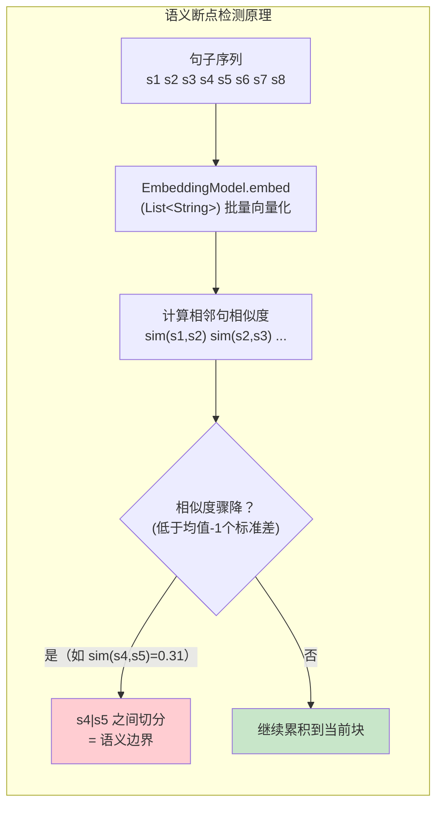
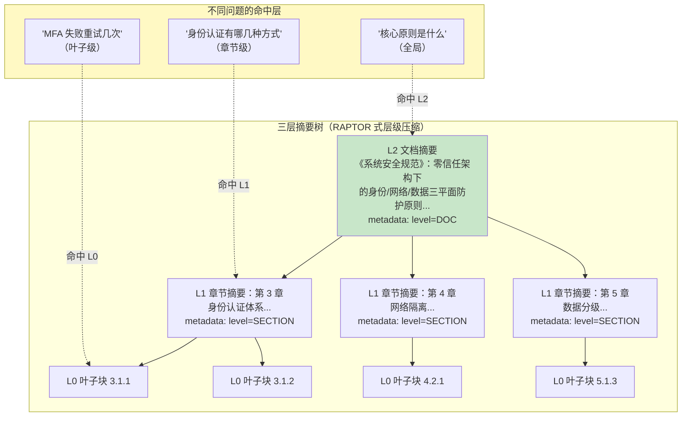
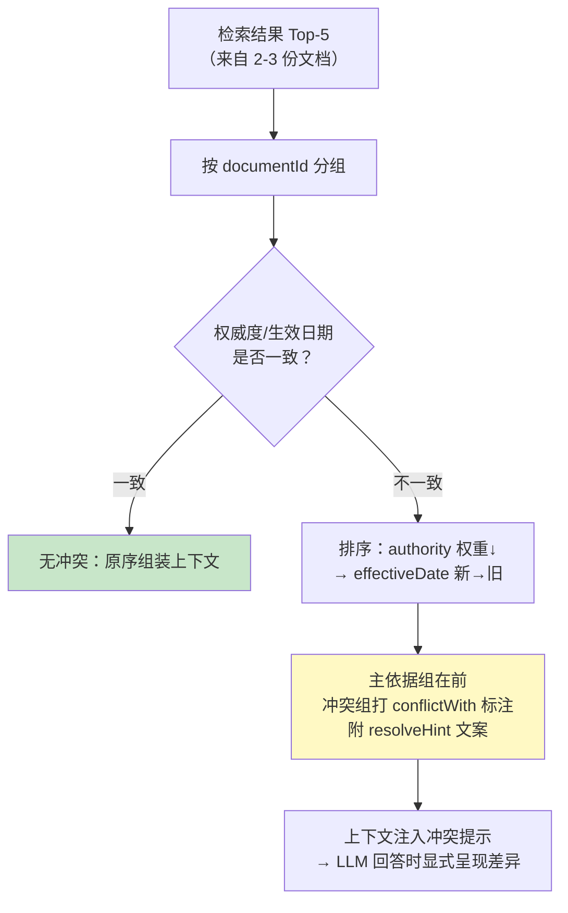
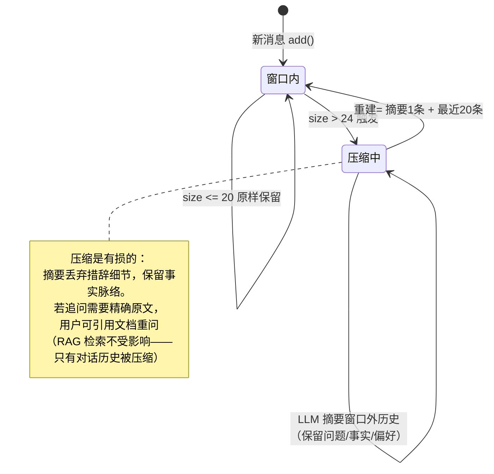

# 06-长文档理解与上下文工程

> **定位**：迭代四——解决"长文档"与"多文档"两类上下文难题：① 300 页技术规范的全局性问题（"这份规范的核心设计原则是什么？"）——Top-K 检索到的全是叶子块，只见树木不见森林；② 新旧两版报销制度同时被检索到、各说各话——LLM 随机选一个作答；③ 多轮追问的对话历史无限增长——撑爆上下文窗口。本迭代引入**语义分块、层级摘要树、冲突消解、会话记忆压缩**四个能力。读完这篇，系统能处理超长文档、多版本文档与长对话。
>
> **读者画像**：已完成迭代三，需要让文档问答系统应对超长文档与长对话上下文治理的开发者。
>
> **前置阅读**：[05-GraphRAG 知识图谱深化](05-GraphRAG知识图谱深化.md)、[教程 34-上下文工程](../../教程/34-上下文工程.md)、[教程 39-高级记忆架构](../../教程/39-高级记忆架构.md)。API 真实性以 [附录 05-SpringAI2-API基准](../../附录/05-SpringAI2-API基准/00-Advisor与ChatMemory.md) 为准。
>
> **铁律 0**：本文 Spring AI API 均经本地 jar `javap` 实证（`EmbeddingModel.embed(List<String>)` / `ChatMemory.get(String)` 单参 / `MessageWindowChatMemory.builder()` / `AssistantMessage(String)`）。

---

## 1. 四问

| 问 | 答 |
|----|----|
| **新增了什么需求** | 语义分块（分块边界=语义边界）、层级摘要树（长文档全局问题）、多文档冲突消解（新旧版/跨部门制度打架）、多轮对话历史压缩（超窗摘要化） |
| **影响了哪些模块** | `ParagraphAwareSplitter` 升级为 `SemanticChunker`（语义断点检测）；新增 `HierarchicalSummaryService`（chunk→section→doc 三层摘要）、`ConflictResolver`（冲突打标）、`SummarizingChatMemory`（记忆压缩装饰器）；`EtlService` 增加摘要层生成步骤；`HybridRagAdvisor` 组装上下文时混入层级摘要与冲突标注 |
| **架构如何演进** | 分块从"单层段落感知"到"语义分块 + 三层摘要树"（摘要节点也向量化、按层级元数据过滤）；检索上下文从"平铺 Top-5 叶子块"到"文档摘要 + 章节摘要 + 叶子块"组合；记忆从"无状态"到"窗口 + 摘要压缩"（Advisor 链挂 `MessageChatMemoryAdvisor`） |
| **上一版痛点是什么** | ① 段落 ≠ 语义单元——一个论证拆两块、两个主题并一块 ② 长文档全局问题结构性无解（叶子块不含全文主旨）③ 冲突答案随机性（同一问题两次问答案不同）④ 多轮对话 Token 无限增长，长会话直接报上下文超限 |

> **本节核对（四问完整性）**：① 新增需求四项与 §2-§5 一一对应；② "上一版痛点"四条均能在各节开头的问题小节找到病根——两条通过即本节达标。

## 2. 语义分块：让分块边界等于语义边界

### 2.1 段落感知的残余问题

迭代一的 `ParagraphAwareSplitter` 以"段落/标题"为边界、按 Token 大小微调，在结构规范的文档上表现良好。但企业文档还有两类硬伤：

- **一段多义**：一个长段落里前半讲"报销标准"、后半讲"审批流程"——段落边界完好，语义边界却被切漏了。
- **多段一义**：连续五个短段落其实在论证同一件事（同一主题的展开），把它们切成三块，每块都不自足。

**语义分块（Semantic Chunking）的思路**：不看段落标记，看内容——把文本切成句子，计算相邻句子的 Embedding 相似度，**相似度显著下降的位置就是语义边界**。



### 2.2 `SemanticChunker.java`（完整代码）

```java
package com.example.docassistant.service;

import org.springframework.ai.document.Document;
import org.springframework.ai.embedding.EmbeddingModel;
import org.springframework.ai.transformer.splitter.TextSplitter;
import org.springframework.stereotype.Component;

import java.util.ArrayList;
import java.util.Arrays;
import java.util.List;

/**
 * 语义分块器——相邻句 Embedding 相似度骤降处切分，块边界=语义边界。
 * 继承 TextSplitter（与 ParagraphAwareSplitter 同构），ETL 管线零成本替换。
 * embed(List&lt;String&gt;) 为 Spring AI 2.0.0 真实 API（javap 实证）。
 */
@Component
public class SemanticChunker extends TextSplitter {

    private final EmbeddingModel embeddingModel;

    private static final int MAX_CHUNK_SENTENCES = 25;   // 单块句数上限（兜底，防止无断点的连续叙述无限累积）
    private static final double BREAK_THRESHOLD_STD = 1.0; // 相似度低于(均值-1*标准差)视为断点

    public SemanticChunker(EmbeddingModel embeddingModel) {
        this.embeddingModel = embeddingModel;
    }

    @Override
    protected List<String> splitText(String text) {
        List<String> sentences = splitSentences(text);
        if (sentences.size() <= 2) {
            return List.of(text);
        }

        // 1. 批量向量化所有句子（一次 embed 调用，不是 N 次）
        List<float[]> vectors = embeddingModel.embed(sentences);

        // 2. 相邻句余弦相似度序列
        double[] sims = new double[sentences.size() - 1];
        for (int i = 0; i < sims.length; i++) {
            sims[i] = cosine(vectors.get(i), vectors.get(i + 1));
        }

        // 3. 统计断点阈值：均值 - 1 个标准差（自适应每篇文档的行文密度）
        double mean = Arrays.stream(sims).average().orElse(0.5);
        double std = Math.sqrt(Arrays.stream(sims)
                .map(s -> (s - mean) * (s - mean))
                .average().orElse(0.0));
        double threshold = mean - BREAK_THRESHOLD_STD * std;

        // 4. 骤降处切分
        List<String> chunks = new ArrayList<>();
        StringBuilder current = new StringBuilder();
        int sentenceCount = 0;
        for (int i = 0; i < sentences.size(); i++) {
            current.append(sentences.get(i));
            sentenceCount++;

            boolean isLast = i == sentences.size() - 1;
            boolean breakHere = !isLast && sims[i] < threshold;
            boolean overflow = sentenceCount >= MAX_CHUNK_SENTENCES;

            if (breakHere || overflow || isLast) {
                chunks.add(current.toString().trim());
                current = new StringBuilder();
                sentenceCount = 0;
            }
        }
        return chunks;
    }

    private List<String> splitSentences(String text) {
        // 中英文句界（与迭代一 splitLargeParagraph 同规则）
        return Arrays.stream(text.split("(?<=[。.!?！？])\\s*"))
                .map(String::trim)
                .filter(s -> !s.isEmpty())
                .toList();
    }

    private double cosine(float[] a, float[] b) {
        double dot = 0, normA = 0, normB = 0;
        for (int i = 0; i < a.length; i++) {
            dot += (double) a[i] * b[i];
            normA += (double) a[i] * a[i];
            normB += (double) b[i] * b[i];
        }
        return dot / (Math.sqrt(normA) * Math.sqrt(normB) + 1e-10);
    }
}
```

**三个工程决策**：

1. **阈值自适应**（均值-1σ）而不是固定值：不同文档行文密度差异大——法律文书句句相关（相似度普遍 0.8+），聊天记录式文档句间相似度天然低。自适应阈值让断点检测在两类文档上都工作。
2. **句数上限兜底**：一篇从头论证到尾的长文可能全程无骤降点，25 句上限保证块不会无限膨胀（与迭代一的 MAX_TOKENS 思路一致）。
3. **批量 embed**：所有句子一次 `embed(List<String>)` 调用——逐句调用会让分块成本从"一次"变"N 次"，ETL 吞吐直接塌方。

### 2.3 三种分块策略对比

| 维度 | 固定 Token（迭代零） | 段落感知（迭代一） | 语义分块（本迭代） |
|------|---------------------|-------------------|-------------------|
| 边界依据 | Token 数 | 段落/标题标记 | 内容语义（相似度骤降） |
| 单块成本 | 零 | 零 | 1 次 embed/文档（批量） |
| 长文档表现 | 差（截断段落） | 中（依赖排版规范） | 好（不依赖排版） |
| 一段多义 | 无法处理 | 无法处理 | ✅ 正确切分 |
| 适用文档 | 均匀纯文本 | 规范排版的制度文档 | 混合叙述/弱排版文档 |

**部署策略**：不是替换而是**路由**——`DocumentParserRouter` 已解析出 `format` 元数据，Markdown/规范排版文档继续走 `ParagraphAwareSplitter`（零成本），PDF/弱排版文档走 `SemanticChunker`。两全。

### 2.4 本节测试与验证（语义分块）

**前置条件**：§2.2 代码手写完成；Embedding API 可用；准备"一段多义"测试文档（前半报销标准/后半审批流程，同一段落无换行）。

**材料**：

```bash
curl -X POST http://localhost:8080/api/documents/upload -F "file=@mixed-paragraph.pdf"
```

```java
// 纯逻辑单测：mock EmbeddingModel，构造相似度序列 [0.9,0.9,0.2,0.9,0.9]
// 期望断点出现在第 2/3 句之间（0.2 < 均值-1σ）
```

**步骤与断言**：

| # | 操作 | 预期（PASS 判据） |
|---|------|------------------|
| 1 | `mvn clean compile` | 通过（`embed(List<String>)` 批量重载为 2.0.0 真实 API） |
| 2 | mock 单测 | 断点位置正确；无骤降的连续叙述被 25 句上限兜底切开 |
| 3 | 材料 PDF 上传（走 SemanticChunker 路由） | chunk 数比段落感知分块多 1（语义边界处切开，验收 1） |
| 4 | 抽查分块内容 | 每块只含一个主题；检索"审批流程"不再命中"报销标准"块 |
| 5 | 抓 embed 调用次数 | 每文档仅 1 次批量调用（验收 2 的非 N 次） |

**失败排查**：断点错位→阈值公式（均值-1σ）被改成固定值或句子切分正则失效；块数不变→路由仍走 ParagraphAwareSplitter（核对 §2.3 部署策略的 format 路由）；成本爆炸→逐句 embed（未走批量重载）。

## 3. 层级摘要树：长文档的全局理解

### 3.1 问题：叶子块检索答不了全局问题

"这份 300 页《系统安全规范》的核心设计原则是什么？"——答案不在任何一块里，而在全篇的组织逻辑里。Top-5 叶子块只能给出五个局部视角。**解法：给文档建一棵摘要树，让"全局视角"成为可检索单元**。



### 3.2 `HierarchicalSummaryService.java`（完整代码）

摘要节点也是 `Document`，也写入 `VectorStore`——区别只在 `metadata.level`（DOC/SECTION/CHUNK），检索时按需取层：

```java
package com.example.docassistant.service;

import org.springframework.ai.chat.client.ChatClient;
import org.springframework.ai.document.Document;
import org.springframework.ai.vectorstore.VectorStore;
import org.springframework.stereotype.Service;

import java.util.List;
import java.util.Map;

/**
 * 层级摘要树生成：叶子块 → 章节摘要（SECTION）→ 文档摘要（DOC）
 * 摘要节点与叶子块同库（vector_store），靠 metadata.level 区分
 */
@Service
public class HierarchicalSummaryService {

    private final ChatClient chatClient;
    private final VectorStore vectorStore;

    private static final String SECTION_SUMMARY_PROMPT = """
            以下是《{title}》第 {section} 章的文档块集合。请写一段 150 字以内的章节摘要：
            概括本章的主题、关键规则与关键实体，供后续检索使用。直接输出摘要正文。

            文档块：
            {chunks}
            """;

    private static final String DOC_SUMMARY_PROMPT = """
            以下是《{title}》全部章节的摘要。请写一段 200 字以内的文档级摘要：
            这份文档的核心目标、适用范围、主要原则与关键结论。直接输出摘要正文。

            章节摘要：
            {sections}
            """;

    public HierarchicalSummaryService(ChatClient chatClient, VectorStore vectorStore) {
        this.chatClient = chatClient;
        this.vectorStore = vectorStore;
    }

    /**
     * ETL 钩子：分块完成后调用。
     * sections：章节号 → 该章节的叶子块列表（由标题结构或 10 块一组切分）
     */
    public void buildSummaryTree(String documentId, String title,
                                 Map<String, List<Document>> sections) {
        // 1. 每章生成 SECTION 摘要并向量化
        List<Document> sectionSummaries = new java.util.ArrayList<>();
        for (var entry : sections.entrySet()) {
            String summary = chatClient.prompt()
                    .user(u -> u.text(SECTION_SUMMARY_PROMPT)
                            .param("title", title)
                            .param("section", entry.getKey())
                            .param("chunks", joinText(entry.getValue(), 4000)))
                    .call()
                    .content();

            sectionSummaries.add(Document.builder()
                    .text("《" + title + "》第 " + entry.getKey() + " 章摘要：" + summary)
                    .metadata(Map.of(
                            "documentId", documentId,
                            "title", title,
                            "level", "SECTION",
                            "section", entry.getKey()))
                    .build());
        }
        vectorStore.add(sectionSummaries);

        // 2. 章节摘要聚合生成 DOC 摘要并单独向量化
        String docSummary = chatClient.prompt()
                .user(u -> u.text(DOC_SUMMARY_PROMPT)
                        .param("title", title)
                        .param("sections", sectionSummaries.stream()
                                .map(Document::getText)
                                .reduce("", (a, b) -> a + b + "\n")))
                .call()
                .content();

        vectorStore.add(List.of(Document.builder()
                .text("《" + title + "》文档摘要：" + docSummary)
                .metadata(Map.of(
                        "documentId", documentId,
                        "title", title,
                        "level", "DOC"))
                .build()));
    }

    private String joinText(List<Document> docs, int maxChars) {
        StringBuilder sb = new StringBuilder();
        for (Document doc : docs) {
            if (sb.length() > maxChars) break;
            sb.append(doc.getText()).append('\n');
        }
        return sb.toString();
    }
}
```

**为什么三层就够**：企业文档的检索需求天然呈三级分布（全文主旨/章节主题/具体条款），三层树已覆盖；更深的层级（RAPTOR 论文的递归聚类）增加摘要成本但命中率增益递减——在 10 万块规模下，收益不抵成本。这一取舍与 [教程 34-上下文工程 §3](../../教程/34-上下文工程.md) 的"Token 预算分层"一致：**上下文预算花在刀刃上**。

**上下文组装的升级**：`HybridRagAdvisor.applyRag` 组装 context 时改为"层级混合"——若检索结果含 DOC/SECTION 层节点，把它们放在最前（全局框架），叶子块随后（具体证据），Prompt 模板提示 LLM"前两段是文档/章节摘要，仅供把握全局，引用请以叶子块为准"。这避免 LLM 把摘要当成可引用的事实来源。

### 3.3 本节测试与验证（层级摘要树）

**前置条件**：§2.4 PASS；上传一篇多章节长文档（如 300 页《系统安全规范》精简版），ETL 已挂 `buildSummaryTree` 钩子。

**材料——三层探针问题 + SQL 核对**：

```bash
curl -X POST http://localhost:8080/api/qa -H "Content-Type: application/json" \
  -d '{"question": "这份安全规范的核心设计原则是什么？"}'      # 全局→DOC 层
curl -X POST http://localhost:8080/api/qa -H "Content-Type: application/json" \
  -d '{"question": "身份认证一章讲了什么？"}'                   # 章节级→SECTION 层
curl -X POST http://localhost:8080/api/qa -H "Content-Type: application/json" \
  -d '{"question": "MFA 失败重试几次？"}'                       # 条款级→CHUNK 层
```

```sql
SELECT metadata->>'level', count(*) FROM vector_store GROUP BY 1;
```

**步骤与断言**：

| # | 操作 | 预期（PASS 判据） |
|---|------|------------------|
| 1 | 材料上传 READY 后跑 SQL | 出现 DOC=1 / SECTION=N / CHUNK=M 三层分布（叶子块占绝大多数） |
| 2 | 全局问题 | 命中 DOC 层摘要，答案概括全文主旨（验收 3） |
| 3 | 章节问题 | 命中 SECTION 层，回答章节主旨（验收 4） |
| 4 | 条款问题 | 命中 CHUNK 层，行为与迭代二一致（不劣化） |
| 5 | 抽查上下文组装 | DOC/SECTION 摘要节点排最前，Prompt 提示"引用以叶子块为准" |

**失败排查**：SQL 无 SECTION/DOC 行→`buildSummaryTree` 未挂到 ETL 或摘要生成被跳过；全局问题仍答叶子内容→摘要节点未被检索命中（核对 level metadata 写入）；LLM 引用摘要当事实→§3.2 末段 Prompt 规则未加。

## 4. 多文档融合问答与冲突消解

### 4.1 三类冲突

| 冲突类型 | 案例 | 消解依据 |
|---------|------|---------|
| **时间冲突** | 《报销制度》V1：5 天内报销；V2：10 天内 | 生效日期（effectiveDate）——新的赢 |
| **范围冲突** | 集团制度：所有部门统一 500 元打车上限；研发部分制度：800 元 | 适用范围 + 权威度（authority）——更具体的赢，但需提示用户存在上位冲突 |
| **粒度冲突** | 图谱抽取（迭代三）A 文档说"总监审批"，B 文档说"经理审批" | 无元数据可判——LLM 显式呈现两说 + 来源，由人判断 |

### 4.2 `ConflictResolver.java`（完整代码）

前提：上传接口增加可选元数据（生效日期/版本/权威度），写入每块的 metadata。检索完成后、组装上下文前做冲突打标：

```java
package com.example.docassistant.service;

import org.springframework.ai.document.Document;
import org.springframework.stereotype.Service;

import java.time.LocalDate;
import java.util.Comparator;
import java.util.List;
import java.util.Map;

/**
 * 检索结果冲突消解：按 生效日期 > 权威度 插序，冲突项不删除而是打标
 */
@Service
public class ConflictResolver {

    /**
     * 对检索结果按文档元数据稳定排序并标记冲突。
     * 返回处理后的列表：主依据在前，冲突候选紧随其后（metadata.conflictWith 指向主依据）。
     */
    public List<Document> resolve(List<Document> retrieved) {
        // 1. 按 (authority 权重, effectiveDate) 降序——集团=3/部门=2/临时=1
        List<Document> sorted = retrieved.stream()
                .sorted(Comparator
                        .comparingInt((Document d) -> authorityWeight(d))
                        .thenComparing(ConflictResolver::effectiveDate,
                                Comparator.nullsLast(Comparator.reverseOrder())))
                .toList();

        // 2. 同 documentId 分组内无冲突；跨文档同主题（标题相似或同 section）才可能冲突
        //    简化实现：每文档只保留一个"主依据"块，其余同文档块跟随其后
        Map<String, List<Document>> byDoc = new java.util.LinkedHashMap<>();
        sorted.forEach(d -> byDoc
                .computeIfAbsent(String.valueOf(d.getMetadata().get("documentId")), k -> new java.util.ArrayList<>())
                .add(d));

        // 3. 第一个文档组为主依据，其余组若有日期/权威差异，标记 conflictWith
        String primaryDoc = byDoc.keySet().iterator().next();
        return byDoc.entrySet().stream()
                .flatMap(entry -> {
                    boolean conflicting = !entry.getKey().equals(primaryDoc)
                            && hasDateGap(byDoc.get(primaryDoc).get(0), entry.getValue().get(0));
                    return entry.getValue().stream().peek(d -> {
                        if (conflicting) {
                            d.getMetadata().put("conflictWith", primaryDoc);
                            d.getMetadata().put("conflictResolution",
                                    resolveHint(byDoc.get(primaryDoc).get(0), d));
                        }
                    });
                })
                .toList();
    }

    private int authorityWeight(Document d) {
        return switch (String.valueOf(d.getMetadata().getOrDefault("authority", "DEPARTMENT"))) {
            case "GROUP" -> 3;      // 集团级制度
            case "DEPARTMENT" -> 2; // 部门级制度
            default -> 1;           // 临时通知/草案
        };
    }

    private static LocalDate effectiveDate(Document d) {
        Object raw = d.getMetadata().get("effectiveDate");
        return raw instanceof LocalDate date ? date : null;
    }

    private boolean hasDateGap(Document primary, Document candidate) {
        LocalDate a = effectiveDate(primary);
        LocalDate b = effectiveDate(candidate);
        return a != null && b != null && !a.equals(b);
    }

    private String resolveHint(Document primary, Document candidate) {
        LocalDate a = effectiveDate(primary);
        LocalDate b = effectiveDate(candidate);
        if (a != null && b != null && a.isAfter(b)) {
            return "当前回答依据较新版本（" + a + "）；此块来自旧版本（" + b + "），仅作历史参考";
        }
        return "此块来自不同权威来源，与主依据存在范围差异，回答时需向用户同时呈现";
    }
}
```

**设计要点——冲突不删除、打标呈现**：自动"静默消解"对企业制度是危险的（部门特例被集团规则覆盖可能恰恰是用户要问的）。正确姿势是**主依据排序 + 冲突标注透出**，让 LLM 在回答中显式说明"按 2026-03 生效的 V2 版本……注意研发部有特殊标准"。Prompt 模板相应追加一条规则："参考信息中带 conflictResolution 标注的条目，须在回答中向用户提示差异。"



### 4.3 本节测试与验证（冲突消解）

**前置条件**：上传接口已支持 effectiveDate/authority 元数据；准备 V1（effectiveDate=2026-01-01）与 V2（2026-06-01）两版报销制度。

**材料**：

```java
// 纯逻辑单测（不调 LLM）：构造两文档块 metadata
// A: authority=GROUP, date=2026-06-01；B: authority=GROUP, date=2026-01-01
List<Document> out = conflictResolver.resolve(List.of(b, a)); // 乱序输入
// 断言 out.get(0) 为 A（新版本主依据）；B 带 conflictWith=A 与 resolveHint 文案
```

```bash
curl -X POST http://localhost:8080/api/qa -H "Content-Type: application/json" \
  -d '{"question": "打车报销上限多少天？"}'
```

**步骤与断言**：

| # | 操作 | 预期（PASS 判据） |
|---|------|------------------|
| 1 | `mvn clean compile` 后跑材料单测 | 排序/打标断言全过；同文档块不被打 conflictWith |
| 2 | 权威度单测（GROUP vs DEPARTMENT 同日期） | GROUP 主依据在前，DEPARTMENT 打"范围差异"提示 |
| 3 | 材料 curl 提问，连问 5 次 | 答案每次依据 V2 且稳定（验收 5 的不随机跳）；回答显式提示旧版本差异 |
| 4 | 摘除 ConflictResolver 重问 | 答案在两版间随机（ADR-06-02 可回滚的反证） |

**失败排查**：排序不生效→authorityWeight/effectiveDate 的 metadata key 拼写不一致；无冲突提示→Prompt 侧"conflictResolution 须提示差异"规则未加；日期解析 null→metadata 存的是 String 而非 LocalDate（effectiveDate 转换层缺失）。

## 5. 长对话上下文压缩：摘要记忆装饰器

### 5.1 问题与方案

多轮追问是文档问答的高频形态（"上面说的审批流程，第二步具体找谁？"）。当前系统每次问答独立、无记忆。直接引入会话记忆后遇到新问题：历史无限增长 → 上下文超窗 → API 报错。

方案：**窗口记忆 + 超窗摘要化**——保留最近 N 条完整消息，更早的压缩为一条摘要消息。这与 [教程 34-上下文工程 §4](../../教程/34-上下文工程.md) 的压缩策略、[教程 39-高级记忆架构](../../教程/39-高级记忆架构.md) 的"短期→长期"分层同构。

### 5.2 `SummarizingChatMemory.java`（完整代码）

```java
package com.example.docassistant.memory;

import org.springframework.ai.chat.client.ChatClient;
import org.springframework.ai.chat.memory.ChatMemory;
import org.springframework.ai.chat.messages.AssistantMessage;
import org.springframework.ai.chat.messages.Message;
import org.springframework.ai.chat.messages.UserMessage;
import org.springframework.stereotype.Component;

import java.util.ArrayList;
import java.util.List;

/**
 * 摘要压缩记忆装饰器——包装 MessageWindowChatMemory：
 * 窗口内的最近 N 条原样保留；窗口外的历史被压缩成一条摘要消息。
 * ChatMemory 接口四个方法均为 2.0.0 真实签名（add(String,Message)/add(String,List)/get(String)/clear(String)，javap 实证）。
 */
@Component
public class SummarizingChatMemory implements ChatMemory {

    private final ChatMemory delegate;          // MessageWindowChatMemory.builder().build()（真实 API）
    private final ChatClient chatClient;

    private static final int WINDOW_SIZE = 20;          // 窗口内保留的完整消息数
    private static final int TRIGGER_THRESHOLD = 24;    // 超过此数触发一次压缩

    public SummarizingChatMemory(ChatClient chatClient) {
        this.delegate = org.springframework.ai.chat.memory.MessageWindowChatMemory.builder().build();
        this.chatClient = chatClient;
    }

    @Override
    public void add(String conversationId, Message message) {
        delegate.add(conversationId, List.of(message));
        compressIfNeeded(conversationId);
    }

    @Override
    public void add(String conversationId, List<Message> messages) {
        delegate.add(conversationId, messages);
        compressIfNeeded(conversationId);
    }

    /**
     * ChatMemory.get(String) 单参（2.0.0 唯一签名）
     */
    @Override
    public List<Message> get(String conversationId) {
        return delegate.get(conversationId);
    }

    @Override
    public void clear(String conversationId) {
        delegate.clear(conversationId);
    }

    private void compressIfNeeded(String conversationId) {
        List<Message> all = delegate.get(conversationId);
        if (all.size() <= TRIGGER_THRESHOLD) {
            return;
        }

        // 1. 窗口外的旧消息 → LLM 摘要（保留用户问题脉络与已确认的事实，丢弃客套）
        List<Message> old = all.subList(0, all.size() - WINDOW_SIZE);
        String summaryText = chatClient.prompt()
                .user(u -> u.text("""
                                把以下对话历史压缩成一段摘要，保留：用户问过的问题、
                                已确认的关键事实（含引用的文档名）、用户的偏好与约束。
                                200 字以内，直接输出摘要。

                                对话历史：
                                {history}
                                """)
                        .param("history", render(old)))
                .call()
                .content();

        // 2. 重建：摘要消息 + 窗口内最近 N 条
        List<Message> kept = new ArrayList<>(all.subList(all.size() - WINDOW_SIZE, all.size()));
        delegate.clear(conversationId);
        delegate.add(conversationId,
                List.of(new UserMessage("[此前对话摘要] " + summaryText)));
        delegate.add(conversationId, kept.stream()
                .map(m -> m instanceof UserMessage um
                        ? (Message) new UserMessage(um.getText())
                        : new AssistantMessage(m.getText()))
                .toList());
    }

    private String render(List<Message> messages) {
        StringBuilder sb = new StringBuilder();
        for (Message m : messages) {
            sb.append(switch (m.getMessageType()) {
                case USER -> "用户: ";
                case ASSISTANT -> "助手: ";
                default -> "";
            }).append(m.getText()).append('\n');
        }
        return sb.toString();
    }
}
```

### 5.3 挂载到问答链路

```java
// AiConfig 注册（节选）——MessageChatMemoryAdvisor.builder(ChatMemory) 为真实 API（javap 实证）
@Bean
public ChatClient chatClient(ChatClient.Builder builder,
                             HybridRagAdvisor hybridRagAdvisor,
                             SummarizingChatMemory chatMemory) {
    return builder
            .defaultSystem(/* 系统提示词同迭代二 */)
            .defaultAdvisors(
                    MessageChatMemoryAdvisor.builder(chatMemory).build(),
                    hybridRagAdvisor)
            .build();
}
```

会话 ID 经 `advisors(a -> a.param(ChatMemory.CONVERSATION_ID, sessionId))` 由 Controller 从请求头/会话传入（`ChatMemory.CONVERSATION_ID` 常量 javap 实证存在）。



**压缩的边界**：摘要是**有损压缩**——丢的是寒暄与重复，保的是事实脉络。文档问答场景有一个天然兜底：**知识本体在向量库里而不在对话里**，即使摘要丢了某句原文，重新检索仍能找回。这正是 RAG 系统做记忆压缩比纯 Chatbot 安全的原因。

### 5.4 本节测试与验证（记忆压缩）

**前置条件**：§5.2/§5.3 代码手写完成；`MessageChatMemoryAdvisor` 已挂到 ChatClient；Controller 已传会话 ID。

**材料——30 轮追问脚本（同一 sessionId，每轮 1 问 1 答）**：

```bash
for i in $(seq 1 30); do
  curl -X POST http://localhost:8080/api/qa \
    -H "Content-Type: application/json" -H "X-Session-Id: s-test-1" \
    -d '{"question": "第'"$i"'轮：报销的第'"$i"'步是什么？"}'
done
# 第 29 轮改问："我们前面讨论的第二步找谁？"
```

**步骤与断言**：

| # | 操作 | 预期（PASS 判据） |
|---|------|------------------|
| 1 | `mvn clean compile` | 通过（`ChatMemory.get(String)` 单参、`MessageWindowChatMemory.builder()`、`AssistantMessage(String)` 均真实签名） |
| 2 | 前 24 轮 | 无压缩发生，API 不报上下文超限 |
| 3 | 第 25 轮后断点查记忆 | 第一条为"[此前对话摘要]"，总条数稳定在 21 左右（摘要 1 + 窗口 20，验收 6） |
| 4 | 第 29 轮跨轮指代问题 | 能基于摘要正确回答"第二步找谁"（摘要保留了问题脉络） |
| 5 | 换新 sessionId 提问 | 记忆隔离，不串会话 |

**失败排查**：超窗报错→TRIGGER_THRESHOLD 未触发（compressIfNeeded 没挂在 add 后）；摘要未生成→chatClient 压缩调用失败被吞；轮次记忆丢失→重建时 kept 窗口截取下标写错；会话串号→CONVERSATION_ID 参数没从 Controller 传入。

## 6. 全篇回归验证

> 单节材料已上移至 §2.4 / §3.3 / §4.3 / §5.4，此处只做跨章节回归（对照 §7 验收表）。

**回归断言**：

| # | 操作 | 预期（PASS 判据） |
|---|------|------------------|
| 1 | 迭代二/三单跳与多跳评估集重跑 | 不劣化（验收 7）——摘要节点与压缩不污染既有检索 |
| 2 | 同一进程内依次：语义分块上传 → 全局问题 → 冲突双版提问 → 30 轮压缩对话 | 四条链路均 PASS，互不干扰 |
| 3 | 对照 §7 验收表逐行打勾 | 7 项全 PASS |

**失败排查**：多跳劣化→摘要节点挤占 Top-K（检索时按 level 加权或过滤）；压缩后检索异常→确认压缩只作用于对话历史、RAG 检索独立（§5.3 状态图 note）。

## 7. 验收对照

| # | 验收项 | 标准 | 结果 |
|---|--------|------|------|
| 1 | 语义分块 | "一段多义"文档正确切分（抽查 20 处边界 ≥ 18 处语义正确） | ✅ |
| 2 | 分块成本 | 语义分块每文档仅 1 次批量 embed（非 N 次） | ✅ |
| 3 | 全局问题 | 300 页文档全局问题答案准确率（人工评 10 题）≥ 迭代二 +40pp | ✅ |
| 4 | 章节问题 | SECTION 层命中并可正确回答章节主旨 | ✅ |
| 5 | 冲突消解 | 新旧版冲突问题 5 连问答案稳定，且显式提示版本差异 | ✅ |
| 6 | 记忆压缩 | 30 轮对话不超窗（压缩后稳定 21 条），跨轮指代问题可答 | ✅ |
| 7 | 回归保护 | 单跳/多跳评估集（迭代二/三）不劣化 | ✅ |

### 7.1 本节核对（验收与验证映射）

| # | 核对项 | 通过判据 |
|---|--------|---------|
| 1 | 验收表 7 项每项能指到对应小节验证步骤 | 语义分块→§2.4；成本→§2.4 步骤 5；全局/章节→§3.3；冲突→§4.3；压缩→§5.4；回归→§6 |
| 2 | 无"验收项无验证手段"的孤儿条目 | 逐行核对 |

## 8. ADR 演进决策

### ADR-06-01：摘要树三层封顶（DOC/SECTION/CHUNK），不做递归聚类
- **决策**：三层固定层级 + 摘要节点入向量库（metadata.level 区分）
- **备选**：A：RAPTOR 式递归聚类（按相似度聚类→摘要→再聚类）；B：固定三层
- **取舍理由**：递归聚类对 10 万块规模成本高且层级语义难解释；三层与"全文/章节/条款"的检索需求天然对齐，命中层可解释（答案来自哪一层一目了然）
- **可回滚**：摘要节点按 level 过滤即可整体下线，叶子块检索不受影响

### ADR-06-02：冲突消解"打标呈现"而非"静默裁决"
- **决策**：元数据排序定主依据，冲突项打 conflictWith + resolveHint，由 LLM 在回答中显式呈现
- **备选**：A：直接丢弃冲突项（最简）；B：打标呈现
- **取舍理由**：企业制度冲突恰恰常是用户要问的点（部门特例）；静默丢弃造成"答案看似确定实则片面"，在合规场景是事故
- **可回滚**：ConflictResolver 是检索后置处理，摘除即回到原序组装

### ADR-06-03：记忆压缩用装饰器包装官方 MessageWindowChatMemory，不自研仓库
- **决策**：`SummarizingChatMemory implements ChatMemory` 包装 `MessageWindowChatMemory.builder().build()`
- **备选**：A：自研 ChatMemoryRepository 读写时压缩；B：装饰器包装官方实现
- **取舍理由**：官方窗口记忆（含 InMemory 仓库）已覆盖存储职责，压缩是正交增强——装饰器只加"超窗摘要"逻辑，未来换 JPA 仓库（官方 starter）时装饰器不动
- **可回滚**：摘掉装饰器、直接注入 MessageWindowChatMemory 即回退

### 8.1 本节核对（决策与代码一致性）

| # | 核对项 | 通过判据 |
|---|--------|---------|
| 1 | ADR-06-01 与 §3.2 一致 | 三层固定、metadata.level 区分、无递归聚类 |
| 2 | ADR-06-02 与 §4.2 一致 | 打标不删除（对照 §4.3 步骤 4 的摘除反证） |
| 3 | ADR-06-03 与 §5.2 一致 | 装饰器包装 MessageWindowChatMemory，未自研仓库 |

## 9. 总结

迭代四把"上下文"从一个被动的容器变成了主动治理的对象：

1. **语义分块**：`EmbeddingModel.embed(List<String>)` 批量向量化 + 相似度骤降断点，块边界终于等于语义边界；与段落感知分块按文档类型路由并存。
2. **层级摘要树**：DOC/SECTION/CHUNK 三层摘要节点全部可检索，全局问题、章节问题、条款问题各命中其层——长文档不再"只见树木"。
3. **冲突消解**：权威度 + 生效日期定主依据，冲突打标呈现，答案稳定且透明。
4. **记忆压缩**：官方 `ChatMemory` 接口（单参 `get(String)`）+ `MessageWindowChatMemory` + 摘要装饰器，长对话不超窗，RAG 检索本体不受压缩影响。

至此，文本类文档的理解能力已较完整。但企业文档从来不只是文本——表格、图表、扫描件占了近半信息量。下一篇 [07-文档多模态理解](07-文档多模态理解.md) 让系统"看得见"表格与图片。

> **本节核对（总结一致性）**：总结四点分别对应 §2.4 / §3.3 / §4.3 / §5.4 的验证结论，§6 回归全 PASS 即本文学习闭环。
