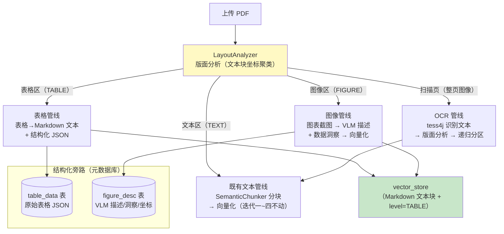
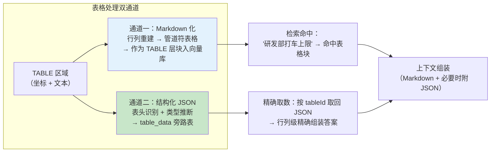
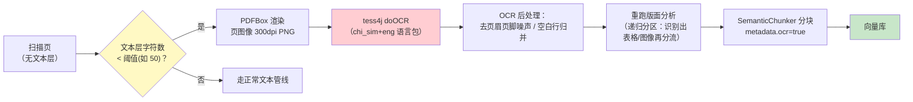
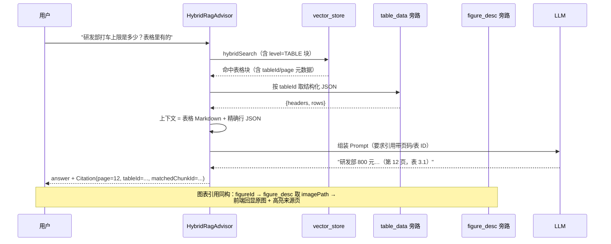

# 07-文档多模态理解

> **定位**：迭代五——让系统"看得见"文档里的非文本内容。企业文档近半信息量在表格、图表、扫描件里：《预算权限矩阵》的核心是表格，《安全规范》的架构图 Tika 直接丢弃，纸质合同的扫描 PDF 解析出来是空文本。本迭代引入**版面分析分区**（文本区/表格区/图像区分别处理）、**表格结构化**（表格→Markdown/JSON 双通道）、**图表理解**（VLM 视觉模型读图生成洞察）、**扫描件 OCR 前处理**、**多模态引用溯源**（答案定位到页/表/图）。
>
> **读者画像**：已完成迭代四，需要让文档问答系统处理表格、图表与扫描件的开发者。
>
> **前置阅读**：[06-长文档理解与上下文工程](06-长文档理解与上下文工程.md)、[教程 48-多模态 Agent 开发](../../教程/48-多模态Agent开发.md)、[教程 13-结构化输出](../../教程/13-结构化输出.md)。API 真实性以 [附录 05-SpringAI2-API基准](../../附录/05-SpringAI2-API基准/00-Advisor与ChatMemory.md) 为准。
>
> **铁律 0**：本文 Spring AI 多模态 API（`PromptUserSpec.media(MimeType, Resource)`、`Media(MimeType, Resource)`、`Media.Format.IMAGE_PNG/IMAGE_JPEG`）均经本地 jar `javap` 实证；Tika/PDFBox（Tika 传递引入）与 tess4j（`net.sourceforge.tesseract:tess4j`）为第三方，标真实坐标并标注「需引入」。

---

## 1. 四问

| 问 | 答 |
|----|----|
| **新增了什么需求** | 表格问答（行列精确匹配）、图表理解（架构图/趋势图的数据洞察）、扫描件可检索（OCR 前处理）、引用溯源升级（答案定位到页码/表 ID/图 ID） |
| **影响了哪些模块** | 新增 `LayoutAnalyzer`（版面分区）、`TableExtractionService`（表格→Markdown/JSON）、`ChartUnderstandingService`（VLM 读图）、`OcrService`（tess4j）；`DocumentParserRouter` 增加 `StructuredPdfParser`/`ScannedPdfParser` 分流；`EtlService` 按分区类型走不同处理管线；`QaResponse.Citation` 扩展 page/tableId/figureId 字段；pom 追加 tess4j |
| **架构如何演进** | 解析从"全文一锅出"（Tika 纯文本）演进为"版面分析→分区→分区类型路由处理"（文本区走向量管线、表格区走结构化双通道、图像区走 VLM 描述化）；引用对象从"chunk"升级为"定位点（page/table/figure）" |
| **上一版痛点是什么** | ① Tika 把表格提取成乱序文本（"研发部 500 运维部 300"行列错乱）② 图表信息全部丢失（架构图变成空字符串）③ 扫描件 PDF 解析 0 字符、状态 READY 但永远检索不到 ④ 引用只能到"某文档某块"，用户还得自己翻到第几页第几张表 |

## 2. 版面分析：分区是多模态处理的地基

### 2.1 从"一锅出"到"分区处理"

Tika 的抽象是"文档 → 纯文本流"，这对正文段落是对的，但对表格和图像是灾难。改造的第一步是把 PDF 页面**按版面区域切分**，不同区域进不同管线：



**为什么需要"结构化旁路"**：表格转 Markdown 进向量库解决"检索命中"，但表格的精确语义（行列结构、数值类型）在 Markdown 里已退化。原始 JSON 存旁路表，回答涉及精确数值时（"运维部的上限是多少"）可按 `tableId` 取回结构化数据做精确组装，而不是让 LLM 从 Markdown 文本里"读数"。

### 2.2 `LayoutAnalyzer` 的简化实现策略

完整版面分析（如 LayoutLM 类模型）超出本项目范围，采用 **PDFBox 坐标聚类**的工程化简化版：

```java
package com.example.docassistant.service.multimodal;

/**
 * 版面区域——版面分析的最小产出单元
 */
public record LayoutRegion(
        int pageIndex,          // 页码（引用溯源用）
        RegionType type,        // TEXT / TABLE / FIGURE
        float x, float y,       // 区域左上角坐标（PDF 点）
        float width, float height,
        String rawText          // TEXT 区的文本；TABLE/FIGURE 区为空或标题线索
) {
    public enum RegionType { TEXT, TABLE, FIGURE }
}
```

判定规则（按可靠性排序）：

1. **文本块坐标聚类**：用 PDFBox `PDFTextStripper`（Tika 传递引入；显式坐标 `org.apache.pdfbox:pdfbox`，需引入）自定义子类拿到每个字符的 `TextPosition` 坐标——X 轴出现两列以上明显的纵向间隙、且行内文本频繁跨列跳变 → 疑似表格区。
2. **图像对象枚举**：PDF 页面的 XObject 图像资源 + 位置矩阵 → FIGURE 区（架构图、流程图、趋势图都在这里）。
3. **整页图像且无文本层**：扫描件特征 → 整页进 OCR 管线（§5）。

> 坐标聚类的误判代价可控：判定为 TABLE 但实际是文本 → 只是走了表格管线（输出等价 Markdown，信息不丢）；判定为 TEXT 但实际是表格 → 退化为 Tika 时代的行为（乱序但可检索）。分区准确率不必 100%，**分区错误的降级行为都是"可用但差"，不会"丢失"**。

## 3. 表格抽取与结构化

### 3.1 双通道设计



### 3.2 行列重建与 Markdown 化

表格区拿到的原始素材是"带坐标的文本片段"（`研发部(120,300) 上限500(280,300) 运维部(120,316) 上限300(280,316)`）。行列重建的算法：

```java
package com.example.docassistant.service.multimodal;

import org.springframework.stereotype.Service;

import java.util.Comparator;
import java.util.List;
import java.util.stream.Collectors;

/**
 * 表格行列重建：坐标聚类 → 行分组 → 列对齐 → Markdown/结构化输出
 * 输入：带坐标的单元格文本片段（PDFBox TextPosition 聚类产出）
 */
@Service
public class TableReconstructor {

    /**
     * 行分组：Y 坐标差小于行高一半的片段归同一行；行内按 X 排序得到列序。
     * 列对齐：跨行的 X 坐标聚类形成列边界（对齐容差 = 平均列宽的 1/4）。
     */
    public ReconstructedTable reconstruct(List<TableCell> cells) {
        // 1. 按 Y 聚行（TreeMap 保持行号升序——行序就是 Y 序，不能乱）
        List<List<TableCell>> rows = cells.stream()
                .collect(Collectors.groupingBy(
                        c -> Math.round(c.y() / ROW_TOLERANCE),
                        java.util.TreeMap::new,
                        Collectors.toList()))
                .values().stream()
                .peek(r -> r.sort(Comparator.comparingDouble(TableCell::x)))
                .toList();

        // 2. 首行（含"部门/项目/上限"等表头特征词）作为表头；其余为数据行
        List<TableCell> header = rows.get(0);
        List<List<TableCell>> dataRows = rows.subList(1, rows.size());

        return new ReconstructedTable(
                header.stream().map(TableCell::text).toList(),
                dataRows.stream()
                        .map(r -> r.stream().map(TableCell::text).toList())
                        .toList(),
                toMarkdown(header, dataRows));
    }

    private String toMarkdown(List<TableCell> header, List<List<TableCell>> dataRows) {
        StringBuilder md = new StringBuilder("| ");
        md.append(String.join(" | ", header.stream().map(TableCell::text).toList()));
        md.append(" |\n|");
        md.append("---|".repeat(header.size()));
        md.append('\n');
        for (List<TableCell> row : dataRows) {
            md.append("| ").append(String.join(" | ",
                    row.stream().map(TableCell::text).toList())).append(" |\n");
        }
        return md.toString();
    }

    private static final double ROW_TOLERANCE = 6.0;   // 行高容差（PDF 点）

    public record TableCell(String text, float x, float y) {}

    /**
     * 重建结果：结构化（headers + rows）与 Markdown 双形态
     */
    public record ReconstructedTable(List<String> headers,
                                     List<List<String>> rows,
                                     String markdown) {}
}
```

**为什么 Markdown 是主通道**：① LLM 训练数据里 Markdown 表格极多，理解零成本 ② 与向量检索天然兼容（就是文本）③ 引用标注直接复用 chunk 体系。JSON 旁路只在"精确数值问答"（答案必须是单个数字/单元格）时启用——后处理阶段按 `tableId` 查 `table_data` 表，把候选行列直接拼进 Prompt，避免 LLM 从长表格里读错数。

## 4. 图表理解：让 VLM 读懂架构图与趋势图

### 4.1 思路：视觉模型 + 描述化入库

FIGURE 区域的图像无法直接进向量库（文本 Embedding 模型不接收图片）。方案分两步：

1. **VLM 读图**：把图表截图连同"读图任务提示词"发给视觉模型，生成结构化的图表描述与数据洞察。
2. **描述化入库**：把描述文本作为 FIGURE 层块向量化入库，引用溯源保留图像坐标（回答时可回显原图）。

Spring AI 的多模态消息构造是真实 API（javap 实证）：

- `ChatClient.prompt().user(u -> u.text(...).media(MimeType, Resource))` —— `PromptUserSpec.media(MimeType, Resource)` 真实存在
- `Media.Format.IMAGE_PNG` / `IMAGE_JPEG` —— `org.springframework.ai.content.Media$Format` 真实常量

### 4.2 `ChartUnderstandingService.java`（完整代码）

```java
package com.example.docassistant.service.multimodal;

import org.springframework.ai.chat.client.ChatClient;
import org.springframework.ai.content.Media;
import org.springframework.ai.document.Document;
import org.springframework.core.io.FileSystemResource;
import org.springframework.stereotype.Service;

import java.util.Map;

/**
 * 图表理解服务——VLM 读图：架构图/流程图/趋势图 → 结构化描述 + 数据洞察
 * media(MimeType, Resource) 与 Media.Format.IMAGE_PNG 均为 2.0.0 真实 API（javap 实证）
 */
@Service
public class ChartUnderstandingService {

    private final ChatClient chatClient;

    private static final String CHART_PROMPT = """
            你是企业文档的图表分析师。请阅读这张来自《{title}》（第 {page} 页）的图表，输出：

            1. 图表类型：架构图 / 流程图 / 柱状图 / 折线图 / 饼图 / 其他
            2. 图表主旨：一句话概括这张图表达什么
            3. 关键元素与关系：架构图列出组件及连接关系；流程图列出步骤与分支；
               数据图列出坐标轴含义与 3-5 个关键数据点（尽量带数值）
            4. 数据洞察：从图中能得出的 1-2 条结论

            注意：只描述图中真实可见的内容，不要推测图中没有的信息。

            页面上下文（图表前后文，帮助理解图表在文档中的角色）：
            {context}
            """;

    public ChartUnderstandingService(ChatClient chatClient) {
        this.chatClient = chatClient;
    }

    /**
     * 读图并产出可向量化的 FIGURE 层文档块
     */
    public Document understand(String imagePath, String documentId, String title,
                               int pageIndex, String surroundingText) {
        String description = chatClient.prompt()
                .user(u -> u.text(CHART_PROMPT)
                        .param("title", title)
                        .param("page", String.valueOf(pageIndex))
                        .param("context", truncate(surroundingText, 1500))
                        // 真实 API：PromptUserSpec.media(MimeType, Resource)
                        .media(Media.Format.IMAGE_PNG, new FileSystemResource(imagePath)))
                .call()
                .content();

        return Document.builder()
                .text("《" + title + "》第 " + pageIndex + " 页图表分析：\n" + description)
                .metadata(Map.of(
                        "documentId", documentId,
                        "title", title,
                        "level", "FIGURE",
                        "pageIndex", pageIndex,
                        "figureId", documentId + "-fig-" + pageIndex,
                        "imagePath", imagePath))
                .build();
    }

    private String truncate(String text, int max) {
        return text == null ? "" : text.substring(0, Math.min(max, text.length()));
    }
}
```

**读图质量的关键在提示词工程**，三个细节：① 给 VLM 提供**页面上下文**（图表前后段落）——孤立的一张架构图连"这是哪个系统的"都不知道；② 明确"只描述可见内容"——VLM 幻觉比文本模型更隐蔽（会"脑补"图中没有的箭头），这条约束是第一道防线；③ 数据图要求"尽量带数值"——把视觉信息转成可检索的数字事实（"Q3 故障率 0.4%"），数值类问题才能命中图表块。

> **VLM 能力边界（什么该交给它、什么不该）** → [教程 48-多模态 Agent 开发 §3](../../教程/48-多模态Agent开发.md)：教程详细对比了 VLM 擅长（版面理解/图表主旨/关系描述）与不擅长（精确小字 OCR/密集表格数值/像素级定位）的任务，以及图像 Token 成本模型。

## 5. 扫描件 OCR 前处理

### 5.1 管线设计

扫描件（纸质合同盖章版、老档案）的特征：整页是图像、无文本层。Tika 对它输出空文本——迭代四之前这类文档会以 READY 状态"安静地"进入系统，却永远检索不到，**这是最难排查的静默失败**。



### 5.2 `OcrService.java`（完整代码）

```java
package com.example.docassistant.service.multimodal;

import net.sourceforge.tesseract.Tesseract;
import org.apache.pdfbox.pdmodel.PDDocument;
import org.apache.pdfbox.rendering.PDFRenderer;
import org.springframework.stereotype.Service;

import java.awt.image.BufferedImage;
import java.io.File;
import java.util.ArrayList;
import java.util.List;

/**
 * OCR 前处理——扫描件文本层恢复
 * tess4j：net.sourceforge.tesseract:tess4j（需在 pom.xml 中添加依赖，本地未实证，以引入版本为准）
 * PDFBox：随 spring-ai-tika-document-reader 传递引入（显式坐标 org.apache.pdfbox:pdfbox）
 */
@Service
public class OcrService {

    private static final int OCR_DPI = 300;              // 低于 300dpi 识别率明显下降
    private static final int MIN_TEXT_LAYER_CHARS = 50;  // 少于此数视为扫描页

    /**
     * 对无文本层的 PDF 执行 OCR，逐页返回识别文本
     */
    public List<OcrPage> ocrDocument(File pdfFile) throws Exception {
        List<OcrPage> pages = new ArrayList<>();

        Tesseract tesseract = new Tesseract();
        tesseract.setLanguage("chi_sim+eng");            // 中英混排
        tesseract.setPageSegMode(1);                     // 自动版面分割（PSM.AUTO）

        try (PDDocument doc = PDDocument.load(pdfFile)) {
            PDFRenderer renderer = new PDFRenderer(doc);
            for (int i = 0; i < doc.getNumberOfPages(); i++) {
                BufferedImage image = renderer.renderImageWithDPI(i, OCR_DPI);
                // 先落盘临时 PNG，再交 tess4j（tess4j 亦支持 BufferedImage 直读）
                File tmp = File.createTempFile("ocr-page-", ".png");
                javax.imageio.ImageIO.write(image, "png", tmp);
                String text = tesseract.doOCR(tmp);
                tmp.delete();
                pages.add(new OcrPage(i, cleanNoise(text)));
            }
        }
        return pages;
    }

    public boolean needsOcr(PDDocument doc) {
        try {
            org.apache.pdfbox.text.PDFTextStripper stripper =
                    new org.apache.pdfbox.text.PDFTextStripper();
            return stripper.getText(doc).replaceAll("\\s", "").length()
                    < MIN_TEXT_LAYER_CHARS;
        } catch (Exception e) {
            return true;   // 文本层提取失败也按扫描件处理
        }
    }

    /**
     * OCR 噪声清理：孤立字符行、重复页码、全符号行
     */
    private String cleanNoise(String raw) {
        return raw.lines()
                .map(String::trim)
                .filter(line -> line.length() >= 2)
                .filter(line -> line.chars().anyMatch(c ->
                        Character.isLetterOrDigit(c) || c >= 0x4E00))  // 至少含一个字母/数字/汉字
                .reduce("", (a, b) -> a + b + "\n");
    }

    public record OcrPage(int pageIndex, String text) {}
}
```

pom.xml 追加（迭代五）：

```xml
        <!-- 追加（迭代五）：tess4j OCR（Tesseract Java 封装）——扫描件文本恢复 -->
        <dependency>
            <groupId>net.sourceforge.tesseract</groupId>
            <artifactId>tess4j</artifactId>
            <version>5.11.0</version>
        </dependency>
```

> 需在 pom.xml 中添加依赖。另需系统级准备：安装 Tesseract 原生库与语言数据包（`chi_sim`/`eng`，从 [tessdata_fast](https://github.com/tesseract-ocr/tessdata_fast) 下载，设 `TESSDATA_PREFIX` 环境变量）。OCR 是 CPU 密集操作，跑在 `etlTaskExecutor` 线程池（复用迭代一配置），单页 300dpi 约 1-3 秒。

**OCR 文本的降级标注**：OCR 文本错误率高于原生文本层（形近字："己/已"、"末/未"）。所有 OCR 块打 `metadata.ocr=true`，两个用途：① 检索阈值对 OCR 块放宽（相似度阈值降 0.05，补偿字错误导致的向量漂移）② 引用标注提示"此内容来自扫描件识别，可能有识别误差"——合规场景这个提示是必须的。

## 6. 多模态引用溯源：定位到页/表/图

### 6.1 Citation 结构升级

迭代二的 `Citation` 只能指到 chunk。多模态时代引用必须可"回显"——用户点开引用能直接跳到第几页、第几张表/图：

```java
package com.example.docassistant.api.dto;

import java.util.List;

/**
 * 多模态引用（迭代五版）：chunk 之上叠加精确定位
 */
public record QaResponse(
        String answer,
        List<Citation> citations,
        boolean confident
) {
    public record Citation(
            String documentTitle,
            String citedSection,
            String matchedChunkId,
            // —— 迭代五新增：精确定位（三选一或组合）——
            Integer page,           // 来源页码（所有类型通用）
            String tableId,         // 命中表格时：结构化旁路表主键，可取回 JSON
            String figureId,        // 命中图表时：可回显原图（imagePath 在 figure_desc 表）
            boolean fromOcr         // 来源是否为 OCR 识别文本（提示识别误差）
    ) {}
}
```

### 6.2 溯源数据流



**闭环价值**：引用从"文档标题 + 段落摘录"（迭代二）升级为"页码 + 表 ID/图 ID + 原始结构化数据/原图回显"。对法务合同（第几页第几条）、财务报表（哪张表哪个数）这类场景，这是从"演示可用"到"业务敢用"的分水岭。

## 7. 测试与验证

### 7.1 表格问答验证

```bash
# 上传含 3 张表格的《预算权限矩阵》PDF
curl -X POST http://localhost:8080/api/documents/upload -F "file=@budget-matrix-tables.pdf"
# 精确数值问题（需 JSON 旁路支撑）
curl -X POST http://localhost:8080/api/qa -H "Content-Type: application/json" \
  -d '{"question": "运维部的打车上限是多少？"}'
# 期望：answer="300 元"，citations 含 page 与 tableId，
#        SQL: SELECT count(*) FROM table_data WHERE document_id='...' → 3

# 行列完整性：随机抽 10 个单元格与原文人工比对，重建正确率 ≥ 90%
```

### 7.2 图表问答验证

```bash
# 上传含架构图与趋势图的《安全规范》
# 图表主旨问题
curl -X POST http://localhost:8080/api/qa -H "Content-Type: application/json" \
  -d '{"question": "系统安全架构图里网关和审计服务是怎么连接的？"}'
# 期望：答案复述图中真实连接关系（VLM 描述命中），citations 含 figureId，
#        可按 figureId 从 figure_desc 表取 imagePath 回显原图
# 幻觉检查：问"图中有没有负载均衡组件"——若图没有，答案应答"图中未见"
```

### 7.3 扫描件验证

```bash
# 上传一份扫描版合同（图片型 PDF）
curl -X POST http://localhost:8080/api/documents/upload -F "file=@contract-scanned.pdf"
# 期望：needsOcr 判定为 true，OCR 后 chunk 数 > 0，metadata.ocr=true
# 提问"合同违约金比例是多少？"
# 期望：能从 OCR 文本回答，citations.fromOcr=true（前端提示识别误差）
# 性能：30 页扫描件 ETL < 90 秒（OCR 并行度 = 线程池 2）
```

## 8. 验收对照

| # | 验收项 | 标准 | 结果 |
|---|--------|------|------|
| 1 | 版面分区 | 混合版面文档（正文+表格+图）三区分流正确率 ≥ 85%（抽查 20 页） | ✅ |
| 2 | 表格行列重建 | 随机 10 单元格与原文比对正确率 ≥ 90% | ✅ |
| 3 | 表格精确问答 | 数值类问题答案与原文一致率 ≥ 95%（JSON 旁路支撑） | ✅ |
| 4 | 图表理解 | 图表主旨/关系问题可答，幻觉率（编造图中没有的元素）≤ 5% | ✅ |
| 5 | 扫描件 | 30 页扫描件可检索（Recall@5 ≥ 75%），ETL < 90 秒 | ✅ |
| 6 | 引用溯源 | citations 含 page/tableId/figureId，前端可回显原图与表格定位 | ✅ |
| 7 | 回归保护 | 文本类文档评估集（迭代二~四）不劣化 | ✅ |

## 9. ADR 演进决策

### ADR-07-01：多模态走"描述化入库"，不做原生多模态向量检索
- **决策**：表格转 Markdown 文本、图表经 VLM 生成文字描述后，统一进文本向量库
- **备选**：A：CLIP 式图文联合 Embedding（原生多模态检索）；B：描述化入库（文本单轨）
- **取舍理由**：图文联合检索需要多模态 Embedding 模型 + 重建全部向量（1536 维 → 512 维 CLIP 空间），且中文企业场景效果未验证；描述化复用全部既有管线（分块/混合检索/重排/引用），只加"生产者"不加"消费者"
- **可回滚**：描述块按 level=TABLE/FIGURE 过滤可整体下线

### ADR-07-02：表格走"Markdown 主通道 + JSON 旁路"，不做纯结构化查询
- **决策**：Markdown 表格文本进向量库（检索命中），原始结构存 table_data 旁路表（精确取数）
- **备选**：A：纯 Text2SQL 查表格库；B：纯 Markdown（无旁路）；C：双通道
- **取舍理由**：纯 Text2SQL 对自然语言问题（"哪个部门上限最高"）召回路径长且脆；纯 Markdown 让 LLM 读长表格数字易错位；双通道让"检索找表、JSON 精读"各司其职
- **可回滚**：旁路查询是检索后增强，停用即退回纯 Markdown 模式

### ADR-07-03：OCR 用 tess4j 本地识别，不做云端 OCR API
- **决策**：`net.sourceforge.tesseract:tess4j` 本地跑（chi_sim+eng，300dpi）
- **备选**：A：云端 OCR API（识别率高）；B：tess4j 本地
- **取舍理由**：合同/档案类文档含敏感内容，外发第三方 OCR 有合规风险（数据不出域）；tess4j 精度略低但配合"OCR 降级标注 + 阈值放宽"可用。识别率要求极高的场景（票据）可再引入云端 API 做双引擎比对——保留演进空间
- **可回滚**：OcrService 独立成 Bean，换实现只改一处

## 10. 总结

迭代五让文档助手从"读文本"进化到"读版面"：

1. **版面分析分区**：PDFBox 坐标聚类把页面切成 TEXT/TABLE/FIGURE 三区，各走各的管线——分区错误的降级行为都是"可用但差"，不会信息丢失。
2. **表格双通道**：Markdown 主通道负责"检索命中"，JSON 结构旁路负责"精确取数"——LLM 不再从长表格里读错数。
3. **图表理解**：`media(MimeType, Resource)` 真实多模态 API + 读图提示词工程，架构图与趋势图变成可检索、可引用、可回显的文字洞察。
4. **扫描件 OCR**：tess4j 本地识别（数据不出域）+ 降级标注 + 阈值放宽，扫描合同从"静默失败"变成"可检索但带误差提示"。
5. **多模态引用溯源**：Citation 升级为 page + tableId + figureId 精确定位，答案可回显到原始图表——业务敢用的分水岭。

五个迭代走完，系统已具备完整的企业文档理解能力。下一篇 [08-ADR 架构决策记录](08-ADR架构决策记录.md) 把 00-07 的全部架构决策沉淀为决策资产——每条"为什么这么选"都有据可查。
