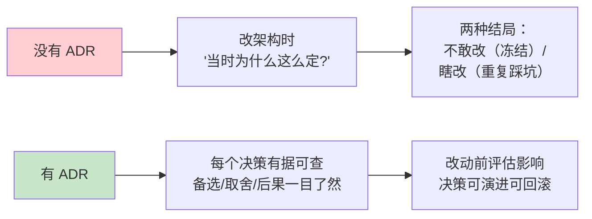
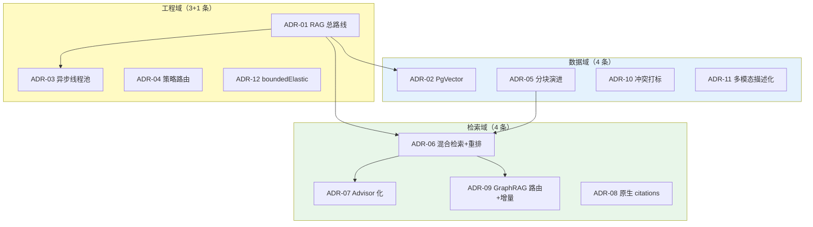
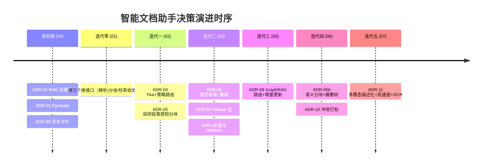
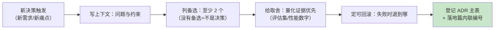

# 08-ADR 架构决策记录：全项目决策资产

> **定位**：把智能文档助手从 00 到 07 的所有**架构决策**汇集成统一 ADR（Architecture Decision Record）登记簿——每条记录**决策上下文 / 备选方案 / 取舍理由 / 后果 / 可回滚性**。这是本项目的"决策资产"：几个月后改架构时，能知道"当时为什么这么定"，而不是推倒重来。各迭代篇里的内联 ADR（ADR-001-004、ADR 001-01~11、ADR-05/06/07-xx）在本文统一收敛为 ADR-01~ADR-12 主登记簿。
>
> **读者画像**：想理解本项目每个关键决策"为什么"的读者，以及把它当架构决策范式参考的读者。
>
> **前置阅读**：[00-需求分析与架构设计](00-需求分析与架构设计.md) 至 [07-文档多模态理解](07-文档多模态理解.md)。方法论依据 [附录 07-架构决策方法论/00-ADR架构决策记录](../../附录/07-架构决策方法论/00-ADR架构决策记录.md)。
>
> **铁律 0**：涉及 Spring AI 2.0 API 的决策均与 [附录 05-SpringAI2-API基准](../../附录/05-SpringAI2-API基准/00-Advisor与ChatMemory.md) 对齐（本地 jar javap 实证）。

---

## 0. 四问

| 问 | 答 |
|----|----|
| **新增了什么需求** | 决策资产化：五个迭代（00-07）积累了 20+ 条内联 ADR，散落各篇且编号体系不一——需要一份统一登记簿，供后续演进时"改前查据" |
| **影响了哪些模块** | 零代码影响（本文是文档层资产）；后续所有架构改动以本文 ADR 编号为引用锚点 |
| **架构如何演进** | 决策记录从"迭代篇内联片段"收敛为"主登记簿（ADR-01~12）+ 内联编号映射"双层结构 |
| **上一版痛点是什么** | ① 内联 ADR 编号混乱（ADR-001 / ADR 001-01 / ADR-05-01 三套体系并存）② 部分决策缺"备选方案"与"可回滚性"字段 ③ 决策之间的依赖关系（分块→检索→图谱）不可见 |

> **本节核对（四问完整性）**：① 能说出本文要解决的三号并存/字段缺失/依赖不可见三个痛点；② 理解"零代码影响、纯文档资产"的定位——两条通过即本节达标。

## 1. 为什么需要 ADR 登记簿

没有 ADR 的项目，三个月后面对的问题是："当时为什么用 PgVector 不用 Milvus？""检索为什么写在 Advisor 里不写在 QaService？"——答不上来，就只能推倒重来或重复踩坑。

**ADR 四要素**（[附录 07-架构决策方法论/00-ADR架构决策记录](../../附录/07-架构决策方法论/00-ADR架构决策记录.md)）：上下文（当时的问题与约束）、决策（选了哪个）、后果（代价是什么）、可回滚性（怎么退）。本文统一再加一列**备选方案**——没有备选的决策不是决策，是默认。

**ADR 四要素**（[附录 07-架构决策方法论/00-ADR架构决策记录](../../附录/07-架构决策方法论/00-ADR架构决策记录.md)）：上下文（当时的问题与约束）、决策（选了哪个）、后果（代价是什么）、可回滚性（怎么退）。本文统一再加一列**备选方案**——没有备选的决策不是决策，是默认。

> **本节核对（ADR 价值理解）**：① 能说出"没有 ADR 的两种结局"（不敢改/瞎改）；② 能复述五要素中"备选方案"为何被本文升为必填（没有备选=不是决策，是默认）——两条通过即本节达标。

## 2. ADR 总览（12 条主决策）

| # | 决策 | 决策域 | 落地篇 | 原内联编号 | 状态 |
|---|------|--------|--------|-----------|------|
| ADR-01 | 技术路线选 RAG，弃 FAQ 库 / Fine-tuning / 搜索引擎 | 总体 | 00 | ADR-001 | ✅ 采纳 |
| ADR-02 | 向量库选 PgVector，弃 Milvus / Chroma | 数据 | 00 | ADR-002 | ✅ 采纳 |
| ADR-03 | 异步 ETL 用 @Async 线程池，弃同步 / MQ | 工程 | 00/02 | ADR-003、001-06 | ✅ 采纳 |
| ADR-04 | 解析器用 Tika + 策略模式路由，弃 if-else / 自研全栈 | 工程 | 02 | ADR-001-04 | ✅ 采纳 |
| ADR-05 | 分块演进：段落感知 → 语义分块 + 三层摘要树 | 数据 | 02/06 | ADR-001-05、06-01 | ✅ 采纳 |
| ADR-06 | 检索用混合双路召回 + Cross-Encoder 重排 | 检索 | 03 | ADR-001-07、001-08 | ✅ 采纳 |
| ADR-07 | RAG 检索 Advisor 化（HybridRagAdvisor 双接口） | 检索 | 03 | ADR-001-09 | ✅ 采纳 |
| ADR-08 | 引用标注走 LLM 原生 citations + 结构化输出 | 检索 | 03/07 | — | ✅ 采纳 |
| ADR-09 | GraphRAG 走查询路由 + 增量更新，弃全量/全图 | 检索 | 05 | ADR-05-01、05-02 | ✅ 采纳 |
| ADR-10 | 冲突消解打标呈现，弃静默裁决 | 数据 | 06 | ADR-06-02 | ✅ 采纳 |
| ADR-11 | 多模态走描述化入库 + 表格双通道 + 本地 OCR | 数据 | 07 | ADR-07-01~03 | ✅ 采纳 |
| ADR-12 | 阻塞调用统一收敛 boundedElastic（WebFlux 铁律） | 工程 | 01~04 | ADR-001-11 | ✅ 采纳 |

**决策域分布**：检索域 4 条（ADR-06~09）、数据域 4 条（ADR-02/05/10/11）、工程域 3 条（ADR-03/04/12）、总体 1 条（ADR-01）——检索质量是 RAG 项目的核心矛盾，决策密度与之相称。

决策的时序演进（每个迭代解决上一版的核心痛点，决策随之叠加）：

### 2.1 本节核对（总览完整性）

| # | 核对项 | 通过判据 |
|---|--------|---------|
| 1 | 12 条 ADR 的"落地篇/原内联编号"列与各迭代篇内联 ADR 一一对应 | 抽查 ADR-06↔[03] ADR-001-07/08、ADR-09↔[05] ADR-05-01/02、ADR-11↔[07] ADR-07-01~03 均能对上 |
| 2 | 决策域分布计数正确 | 检索 4 / 数据 4 / 工程 3 / 总体 1 = 12 |
| 3 | 决策依赖图的边能在详解篇找到依据 | 分块(ADR-05)→检索(ADR-06) 的依赖即 06 篇"语义分块提升检索质量" |

## 3. 关键 ADR 详解

以下每条按统一格式展开：上下文 → 备选 → 决策 → 取舍 → 后果与可回滚性。选取对架构影响最大的条目详述（其余见对应迭代篇内联 ADR）。

### ADR-01：技术路线选 RAG，弃 FAQ 知识库 / Fine-tuning / 关键词搜索引擎

- **上下文**（00 §1-2）：8000+ Confluence 页、3000+ PDF、日均 12000 次搜索、平均 15 分钟找一篇文档；答案必须可追溯（法务/合规/财务场景刚需）。
- **备选**：A：Elasticsearch 关键词搜索；B：人工维护 FAQ 问答对；C：微调大模型；D：RAG。
- **决策**：D。三条决定性理由——语义理解强（"年假"能命中"带薪休假审批权限"）、知识实时更新（新文档上传即可检索，无需训练）、答案可追溯（每次回答标注来源）。
- **取舍**：接受"检索质量决定回答质量"的工程负担——这正是后续五个迭代（分块、混合检索、图谱、摘要树、多模态）存在的原因。A 无法理解语义、B 维护成本指数增长、C 知识更新困难且幻觉不可控。
- **后果与可回滚**：RAG 路线不可逆（整个架构围绕检索构建），但技术栈内部每个组件都可替换——这要求后续每个决策都留"换接口"（见 ADR-04/05/06 的可回滚设计）。

### ADR-02：向量库选 PgVector，弃 Milvus / Chroma

- **上下文**（00 §3.3）：文档量预计 10-50 万块；团队已有 PostgreSQL 运维经验；文档元数据（标题/版本/权限）需要与向量联合查询。
- **备选**：A：Milvus（亿级高性能专用库）；B：Chroma（轻量开发友好）；C：PgVector（PostgreSQL 扩展）。
- **决策**：C。HNSW 索引在 50 万块规模完全够用；`WHERE department='研发' ORDER BY embedding <=> q` 联合过滤是同库免费的（A 需要外部元数据库拼接）；零新增中间件。
- **取舍**：放弃 Milvus 的亿级扩展性——但 `VectorStore` 接口（`similaritySearch(SearchRequest)`）屏蔽了底层，真到亿级只需换实现 + 重导数据，代码零改动（Spring AI 抽象的直接红利）。Chroma 不考虑生产。
- **后果与可回滚**：迭代二的关键词检索（tsvector 全文索引）正是"同库红利"的兑现——Milvus 方案下这条路不存在，得引入 Elasticsearch。回滚成本 = 数据迁移。

### ADR-03：异步 ETL 用 @Async 专用线程池，弃同步处理 / 消息队列

- **上下文**（00 §3.3 / 02 §6）：30 页 PDF 的解析+分块+批量 Embedding 需 8-15 秒，同步处理会把上传接口拖到超时。
- **备选**：A：同步（Demo 阶段）；B：`@Async` + `ThreadPoolTaskExecutor`（核心 2/最大 4/队列 50/CallerRunsPolicy）；C：RabbitMQ/Kafka 消息队列。
- **决策**：B。万级文档量线程池足够；CallerRunsPolicy 提供天然背压（队列满时降级为同步而不是拒绝）。
- **取舍**：放弃 MQ 的削峰填谷与跨进程消费——单体内属于过度设计。明确触发条件：需要故障恢复（应用重启不丢任务）、多消费者横向扩容时升级 MQ。
- **后果与可回滚**：任务在内存队列，应用重启会丢（状态停在 PROCESSING，靠人工重跑）；这是当前规模下接受的代价。回滚到同步只需改注解。

### ADR-04：解析器用 Tika + 策略模式路由，弃 if-else / 自研全栈

- **上下文**（02 §4）：企业文档格式只会越来越多（PDF/Word/Markdown/HTML/RTF/扫描件）；Tika 覆盖 1000+ 格式但对表格/图表/扫描件无能为力（迭代五证实）。
- **备选**：A：单一 Tika 全包（if-else 分格式后处理）；B：`DocumentParser` 接口 + `DocumentParserRouter`（Spring 注入 `List<DocumentParser>` 自动发现）；C：全部自研解析器。
- **决策**：B。Tika 做通用兜底（`TikaDocumentParser`），特殊格式专用解析器（`MarkdownDocumentParser` 保留标题层级；迭代五的 `StructuredPdfParser`/`ScannedPdfParser` 分流版面）。
- **取舍**：策略模式的成本是多一层接口抽象；收益是迭代五新增扫描件支持时零修改路由代码——直接兑现。C 重复造 Tika 的轮子无意义。
- **后果与可回滚**：解析器是纯函数式组件（输入 Resource 输出 `List<Document>`），替换/摘除零副作用。

### ADR-05：分块演进——段落感知起步，语义分块 + 三层摘要树深化，弃递归聚类

- **上下文**（02 §5 / 06 §2-3）：固定 Token 分块截断语义（Demo 期痛点）；段落感知仍处理不了"一段多义/多段一义"；长文档全局问题叶子块结构性答不了。
- **备选**：A：`TokenTextSplitter` 固定分块；B：自研 `ParagraphAwareSplitter`（段落边界 + 滑动窗口重叠）；C：`SemanticChunker`（Embedding 相似度骤降断点）+ 三层摘要树（DOC/SECTION/CHUNK）；D：RAPTOR 式递归聚类。
- **决策**：B → C 渐进（两种分块器并存，按文档 format 路由），封顶三层、不做 D。
- **取舍**：C 每文档多一次批量 `embed(List<String>)`（成本可控）；D 的递归聚类在 10 万块规模成本高且层级语义难解释。三层与"全文/章节/条款"检索需求天然对齐。
- **后果与可回滚**：摘要节点按 `metadata.level` 过滤即可整体下线，叶子块检索不受影响。重叠窗口自研（`TokenTextSplitter` 的 overlap 版本间不稳定）这一子决策保留。

### ADR-06：检索用混合双路召回 + Cross-Encoder 重排，弃纯向量 / 纯关键词 / 纯分数融合

- **上下文**（03 §2）：纯向量检索对专有名词（K8s PV）、精确编号（ISO 27001）、否定语义召回率低；Top-K 中最相关块不一定排第一。
- **备选**：A：纯向量；B：纯关键词；C：双路召回 + RRF 分数融合；D：双路召回 + Cross-Encoder 重排（召回-精排两阶段）。
- **决策**：D。向量 Top-10 + 关键词 Top-10（PostgreSQL tsvector，同库免费）→ 合并去重（双路命中标 HYBRID）→ BGE-Reranker-v2 精排取 Top-5。
- **取舍**：D 每次问答多一次重排推理（100-300ms）；换来 MRR +43%（0.51→0.73，100 题评估集实测）。C 的 RRF 融合无法理解语义相关性，只做加权。两阶段范式是搜索引擎验证过的正解。
- **后果与可回滚**：重排是独立服务（`RerankService`），`app.rerank.endpoint` 不可达时可配置跳过重排退化为 C 模式（合并后按双路最大分排序）。

### ADR-07：RAG 检索 Advisor 化，弃 QaService 内联

- **上下文**（03 §7）：检索是横切关注点（所有问答都要过）；写在 QaService 里业务与检索耦合，新增记忆/日志/审计 Advisor 时互相纠缠。
- **备选**：A：QaService 内联调用 `RetrievalService`；B：内置 `QuestionAnswerAdvisor`；C：自研 `HybridRagAdvisor implements CallAdvisor, StreamAdvisor`。
- **决策**：C。同时实现双接口（`adviseCall`/`adviseStream` + `chain.nextCall`/`chain.nextStream`），call 与 stream 两种模式都经过检索；内置 B 无法承载双路召回+重排+引用标注+查询路由（迭代三/四/五的检索增强全部内聚在这一个 Advisor 里持续演进）。
- **取舍**：Advisor 里改写请求须用 2.0 真实 API（`request.prompt().getInstructions()` 读消息、`request.mutate().prompt(newPrompt).build()` 改写——`ChatClientRequest` 是 record，无 1.x 的 `userText()/messages()`）；这是学习成本，也是 API 正确性的强制约束。
- **后果与可回滚**：迭代四挂 `MessageChatMemoryAdvisor` 时零冲突（Advisor 链天然组合）；摘除 Advisor 即回到无检索问答。**教训**：若只实现单接口，另一种调用模式会静默绕过检索——双接口必须成对实现。

### ADR-08：引用标注走 LLM 原生 citations + 结构化输出，弃后补 sources

- **上下文**（01 §5.2 / 03 §8）：Demo 的 sources 是检索后机械拼接（"检索到什么列什么"），与答案正文脱节——LLM 实际引用的可能只有 2 块，sources 却列了 5 块。
- **备选**：A：后补 sources（机械列出全部检索块）；B：上下文给每块标 `【来源: 标题 | 片段ID】` 前缀 + 结构化输出 `Citation(documentTitle, citedSection, matchedChunkId)` 让 LLM 原生标注；C：答案后处理正则匹配引用。
- **决策**：B。`entity(QaResponse.class)` 结构化输出（Spring AI 2.0 真实 API）；迭代五升级 Citation 增加 page/tableId/figureId/fromOcr 精确定位。
- **取舍**：B 依赖 LLM 忠实标注（幻觉风险：标注未使用的 chunkId）；对策是 `matchedChunkId` 与检索结果集合做后校验（不在集合内的 citation 剔除）。C 的正则脆弱不可维护。
- **后果与可回滚**：citations 是 API 契约的一部分（前端渲染引用角标），回退到后补 sources 需前端同步改——决策随前端落地而固化。

### ADR-09：GraphRAG 走查询路由 + 增量更新，弃全量重建 / 全走图谱

- **上下文**（05）：多跳问题（跨文档实体链）向量检索结构性答不了；但 80% 日常问题仍是单跳语义问题——全走图谱是为 20% 需求付 100% 成本。
- **备选**：A：全部问题都过图谱；B：查询路由（LLM 分类 SEMANTIC/MULTI_HOP/GLOBAL）+ 图谱仅 ETL 建立与多跳路径使用；C：不做图谱。
- **决策**：B + 增量更新（文档级子图拆除 + 实体引用计数 + 变更块重抽取）。单跳问题零图谱调用；文档换版抽取成本与变更面积成正比（30 块 → 平均 6 次调用）。
- **取舍**：路由本身是一次 LLM 调用（200-400ms）——用轻量模型 + 缓存 + 规则短路缓解；Neo4j 是新增中间件（部署/运维成本），换取多跳题链条完整率 33%→87%。
- **后果与可回滚**：`app.graph.enabled` 开关关闭即回退纯向量系统，检索链路零改动；社区检测（GDS 插件）是可选层，不装则全局问题不可用但主链路不受影响。

### ADR-10：冲突消解打标呈现，弃静默裁决

- **上下文**（06 §4）：新旧版制度、集团与部门制度并存；静默裁决（自动选一个）在合规场景是事故——部门特例被集团规则覆盖可能恰是用户要问的。
- **备选**：A：丢弃冲突项（最简）；B：权威度+生效日期排序定主依据，冲突项打 `conflictWith` + `resolveHint` 标注，LLM 在回答中显式呈现差异。
- **决策**：B。答案稳定（不再两次问出两个版本）且透明（用户知道存在新旧差异）。
- **取舍**：B 的回答更长（要解释差异）、依赖上传时提供 effectiveDate/authority 元数据（没元数据退化为"两说并列"）。
- **后果与可回滚**：`ConflictResolver` 是检索后置处理，摘除即回原序组装。

### ADR-11：多模态走描述化入库 + 表格双通道 + 本地 OCR，弃原生多模态检索 / 纯 Text2SQL / 云 OCR

- **上下文**（07）：表格、图表、扫描件占企业文档近半信息量；Tika 对表格乱序、对图表丢弃、对扫描件输出空文本。
- **备选**：① 图文检索：A：CLIP 式联合 Embedding vs B：VLM 描述化入库（文本单轨）；② 表格：A：纯 Text2SQL vs B：Markdown 主通道 + JSON 旁路；③ OCR：A：云端 API vs B：tess4j 本地。
- **决策**：①B ②B ③B。描述化复用全部既有管线（分块/混合检索/重排/引用），只加"生产者"不加"消费者"；表格"检索找表（Markdown）、精读取数（JSON 旁路）"各司其职；OCR 本地跑保证合同/档案数据不出域（合规红线）。
- **取舍**：描述化丢失图像细节（VLM 没描述到的不可检索）；tess4j 识别率低于云 API（用 OCR 降级标注 + 阈值放宽补偿）；JSON 旁路多一张表与一次查询。
- **后果与可回滚**：三个子决策各自独立可回退（level=TABLE/FIGURE 过滤下线旁路、OcrService 换实现只改一处）。

### ADR-12：阻塞调用统一收敛 boundedElastic，弃 EventLoop 直接执行 / 全响应式重写

- **上下文**（01~04）：WebFlux 铁律——Netty EventLoop 上禁止阻塞；但 Spring AI 的 `similaritySearch`/`chatClient.call()`/JPA/JDBC 都是阻塞 API。
- **备选**：A：EventLoop 上直接调（灾难）；B：阻塞调用包 `Mono.fromCallable(...).subscribeOn(Schedulers.boundedElastic())` 或收敛到 `@Async` 线程池；C：全部用响应式实现（需要 R2DBC + 全响应式 Spring AI 生态，向量库/JPA 均需替换）。
- **决策**：B。上传（FilePart + DataBufferUtils.join）、问答（QaService fromCallable）、流式（Flux.defer）三条链路统一模式。
- **取舍**：B 是"隔离"而不是"消除"阻塞——线程切换有微秒级开销；C 是彻底方案但生态不成熟（PgVector 无 R2DBC 驱动），工程上不可行。
- **后果与可回滚**：`boundedElastic` 队列有界（默认 10 万任务），极端积压时拒绝执行——比拖垮 EventLoop（全站不可用）好。此决策是全项目代码纪律（每个迭代篇的代码都遵循），无回滚概念（除非整体离开 WebFlux）。

### 3.1 本节核对（详解五要素完整性）

| # | 核对项 | 通过判据 |
|---|--------|---------|
| 1 | 抽查任意 3 条详解（如 ADR-02/07/11），五要素（上下文/备选/决策/取舍/后果与可回滚）齐备 | 逐条打勾，无缺列 |
| 2 | 详解与落地篇正文一致 | ADR-06 的 MRR +43% 与 [03 §9.3] 评估一致；ADR-07 的双接口教训与 [03 §7.3] 步骤 3 呼应 |
| 3 | API 相关表述与附录 05 基准一致 | ADR-07 的 `request.mutate().prompt(...).build()` 等（铁律 0 落实） |

## 4. 决策的共同模式（元规律）

12 条决策背后有三条反复出现的取舍模式，值得作为后续演进的判断框架：

1. **先验证再加深**（ADR-01/05/06）：Demo 先用最简实现验证管线，每步用评估集量化增益后才升级——"先纯向量后混合检索"（Recall@5 +17pp 实测）而不是一步到位。
2. **换接口先行**（ADR-03/04/05/06）：Demo 阶段就把"解析/分块/检索"收敛到具名接口（`DocumentParser`/`TextSplitter`/`RetrievalService`），后续五次升级全部零破坏替换。**接口名先立、实现后换**是演进式项目的第一纪律。
3. **降级可用，绝不丢失**（ADR-04/09/11）：每个新能力的失败路径都是"退回上一版行为"——图谱关闭回纯向量、重排不可达回 RRF、OCR 失败回空文本标注。分区错误的代价是"可用但差"而非"信息丢失"。

### 4.1 本节核对（元规律映射）

| # | 核对项 | 通过判据 |
|---|--------|---------|
| 1 | 三条元规律各自的 ADR 归属能不看正文说出 | 先验证再加深=01/05/06；换接口先行=03/04/05/06；降级可用=04/09/11 |
| 2 | 每条元规律能举一个量化或行为证据 | Recall@5 +17pp / 五次零破坏替换 / app.graph.enabled 回退（[05 §7] 步骤 4） |
| 3 | 决策流程图与 §5 使用规范表一致 | 备选≥2、量化证据、可回滚三要求在两处均出现 |

## 5. ADR 使用规范（本项目决策纪律）

| 规范 | 说明 |
|------|------|
| 触发条件 | 架构 / API 选型 / 新依赖 / 安全 / 运维 任一重大决策 |
| 必填四要素 | 上下文 + ≥2 备选 + 取舍理由（有量化证据优先）+ 可回滚路径 |
| 编号 | 主登记簿 ADR-NN（追加不改旧）；迭代篇内联编号映射到主表 |
| 推翻旧决策 | 新增 ADR 记录"为什么推翻"，不覆盖旧 ADR（决策历史也是资产） |
| 引用 | 代码/文档改动处标 ADR 编号；ADR 里标落地迭代篇 |

### 5.1 本节核对（使用规范执行检查）

| # | 核对项 | 通过判据 |
|---|--------|---------|
| 1 | 五条规范无歧义可执行 | 触发条件/四要素/编号/推翻/引用各自可操作 |
| 2 | "推翻旧决策不覆盖"的理由能说出 | 决策历史也是资产（可追溯当时条件） |

## 6. 总结

智能文档助手的 12 条 ADR 是它的"决策 DNA"：从"为什么选 RAG"（ADR-01）到"为什么阻塞要收敛 boundedElastic"（ADR-12），每条都有上下文、备选、取舍、可回滚性。三条元规律（先验证再加深 / 换接口先行 / 降级可用绝不丢失）贯穿始终——它们比任何单条决策更值得带走。

下一篇 [09-工业前沿与演进方向](09-工业前沿与演进方向.md) 站在 2026 年行业前沿对照本项目的缺口，给出下一阶段的演进方向，并为整个项目收官。

> **本节核对（总结一致性）**：能不看正文说出三条元规律与任一 ADR 的对应关系，且 §2.1/§3.1 核对全部通过，即本文学习闭环。
