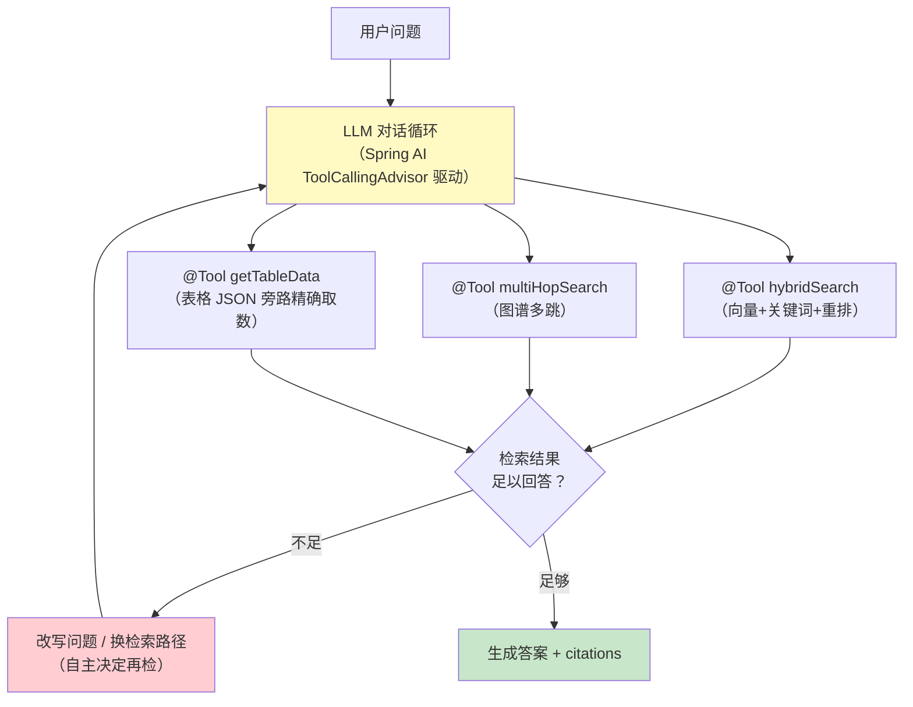
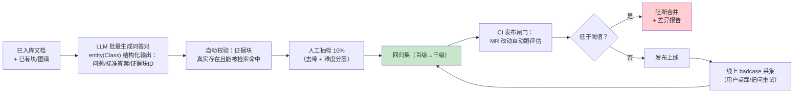
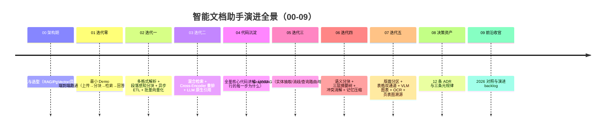

# 09-工业前沿与演进方向：2026 文档智能演进与项目收官

> **定位**：对智能文档助手做**工业前沿对照**——梳理 2026 年 Google / Nebius / PagerDuty 等关于生产级 AI Agent（含 RAG/文档智能）落地的最佳实践，逐条对照本项目 00-08 的现状找缺口，给出下一阶段演进方向；并为整个项目收官。这不是"补更多功能"的清单，而是回答"这个系统距离 2026 年行业共识的生产级文档智能还差哪几步"。
>
> **读者画像**：读完 00-08、想站在行业前沿审视本项目设计并规划下一步的读者。
>
> **前置阅读**：[08-ADR 架构决策记录](08-ADR架构决策记录.md)、[教程 05-Observation可观测/02-组件交互：Registry、Handler、Convention、Filter协作 RAG 与 Agentic RAG](../../教程/08-架构师进阶/01-高级RAG与AgenticRAG.md)、[教程 08-架构师进阶/07-数据飞轮与持续改进](../../教程/08-架构师进阶/07-数据飞轮与持续改进.md)。
>
> **来源**：本文引用均为真实外部资料并标注链接（外部资料的时效以发布方更新为准）。

---

## 0. 四问

| 问 | 答 |
|----|----|
| **新增了什么需求** | 前沿对照：把行业共识（Agentic RAG、记忆失效感知、模拟先行、评估驱动、多模态深化）映射为本项目的演进 backlog，并完成项目收官 |
| **影响了哪些模块** | 零代码影响（本文是演进规划与收官篇）；演 backlog 落点标注到既有模块（RetrievalService/记忆层/评估集/ETL） |
| **架构如何演进** | 规划三层演进：检索从"路由式"到"Agentic 自主决策"、质量保障从"人工评估集"到"模拟先行 + 评估飞轮"、知识时效从"文档驱动"到"事实失效感知" |
| **上一版痛点是什么** | ① 检索深度是路由静态决定的（LLM 分类一次定死），复杂问题无法多轮自主补检 ② 评估集 130 题全人工构建，扩展慢 ③ 文档更新靠增量 ETL 兜底，但"事实过时"无感知（旧答案仍在被引用） ④ 多模态是描述化单轨，与原生多模态检索的能力边界未打通 |

> **本节核对（四问完整性）**：① 能说出四个"上一版痛点"与 §2 对照表 F1/F3/F2/F5 的一一映射；② 理解本文"零代码影响、演进规划"的定位——两条通过即本节达标。

## 1. 2026 年的核心共识：难的不再是模型，是系统工程

三家一线厂商的工程实践收敛出同一个判断——**生产级 Agent/RAG 系统的瓶颈在系统工程，不在模型能力**：

1. **检索质量与编排的影响大于模型增量**（[Nebius Agents Blueprint](https://nebius.com/blog/posts/introducing-the-nebius-agents-blueprint)）：单步 95% 成功率的任务，十步串联只剩约 60%——系统性缺陷会随链路长度复利放大，文档智能系统的检索管线、上下文治理、评估闭环都是"系统级补分项"。
2. **模拟先行**：部署前用 LLM 批量生成数百个模拟任务/问答对，先产出评估集与回归套件，再上线（[Nebius Agents Blueprint](https://nebius.com/blog/posts/introducing-the-nebius-agents-blueprint)）——评估集不再靠人工一题一题攒。
3. **记忆与知识需要 TTL 与事实失效感知**：共享记忆/知识库中过时事实是生产事故高发区，需要显式的"记住/忘记"机制与时效标注（[PagerDuty: Production AI Agents](https://www.pagerduty.com/eng/production-ai-agents-closing-the-gaps-between-idea-and-reality/)）。
4. **评估驱动开发成为发布闸门**：改 Prompt、换模型、调检索参数，都必须过评估回归才能发布——"拍脑袋上线"是被砍项目的主要死法（[Google: Five Guides to Production-Ready AI Agents](https://cloud.google.com/blog/topics/developers-practitioners/five-guides-to-building-and-scaling-production-ready-ai-agents)）。
5. **Agentic 化是 RAG 的下一形态**：从"固定管线检索一次"演进为"Agent 自主决策检索什么、检索几次、何时停"（[Google](https://cloud.google.com/blog/topics/developers-practitioners/five-guides-to-building-and-scaling-production-ready-ai-agents)，另见 [教程 05-Observation可观测/02-组件交互：Registry、Handler、Convention、Filter协作 RAG 与 Agentic RAG §4](../../教程/08-架构师进阶/01-高级RAG与AgenticRAG.md)）。

### 1.1 本节核对（共识理解自测）

| # | 核对项 | 通过判据 |
|---|--------|---------|
| 1 | 能不看正文说出五条共识的关键词与出处 | 链路复利（Nebius）/模拟先行（Nebius）/记忆 TTL（PagerDuty）/评估闸门（Google）/Agentic 化（Google） |
| 2 | 能解释"单步 95%、十步 60%"对本项目检索管线的含义 | 检索/上下文/评估是系统级补分项，不是模型升级能解决的 |

## 2. 前沿特性对照（本项目现状 vs 演进方向）

| # | 前沿特性 | 来源 | 本项目现状 | 演进方向 |
|---|---------|------|-----------|---------|
| F1 | **Agentic RAG 自主检索深度**：Agent 判定"检索够不够"，不够就改写问题再检、换路再检 | [Google](https://cloud.google.com/blog/topics/developers-practitioners/five-guides-to-building-and-scaling-production-ready-ai-agents)、[Nebius](https://nebius.com/blog/posts/introducing-the-nebius-agents-blueprint) | 迭代三查询路由是一次性静态分类（SEMANTIC/MULTI_HOP/GLOBAL 定死路径） | 检索升级为工具：把 `hybridSearch`/`multiHopSearch` 注册为 `@Tool`，让 LLM 在对话循环里自主决定检索次数与策略（Spring AI 工具循环由 `ToolCallingAdvisor` 驱动，API 真实） |
| F2 | **记忆 TTL / 事实失效感知**：知识条目带时效，引用过时事实前先校验 | [PagerDuty](https://www.pagerduty.com/eng/production-ai-agents-closing-the-gaps-between-idea-and-reality/) | 文档级 effectiveDate 已有（迭代四冲突消解），但向量块与图谱实体无 TTL、无"失效引用"检测 | 块/实体元数据加 `expiresAt` 与 `supersededBy`；引用命中过时条目时回答降级提示；定时任务扫描"仍在被检索命中的已过时块"生成治理清单 |
| F3 | **模拟先行**：LLM 生成问答对回归集 | [Nebius](https://nebius.com/blog/posts/introducing-the-nebius-agents-blueprint) | 评估集 130 题（迭代二 100 + 迭代三 30）全人工构建，扩展慢、覆盖偏 | 用 LLM 从已入库文档批量生成"问题-标准答案-证据块"三元组（`entity(Class)` 结构化输出，真实 API），人工抽检 10% 后入回归集——评估集规模从百级到千级 |
| F4 | **评估驱动发布闸门**：任何改动过回归再发布 | [Google](https://cloud.google.com/blog/topics/developers-practitioners/five-guides-to-building-and-scaling-production-ready-ai-agents) | 有评估脚本与量化验收（各迭代篇），但不在 CI/CD 链路上 | 评估集接入 CI：改 Prompt/检索参数/模型配置的 MR 自动跑 Recall@K/MRR/链条完整率，低于阈值阻断合并（[教程 05-Observation可观测/08-流式响应的观测：stream模式下的span闭合](../../教程/08-架构师进阶/07-数据飞轮与持续改进.md) 的飞轮起点） |
| F5 | **多模态深化**：图文混合检索与原生多模态理解 | [Google](https://cloud.google.com/blog/topics/developers-practitioners/five-guides-to-building-and-scaling-production-ready-ai-agents) | 迭代五描述化入库（文本单轨，ADR-11 有意为之） | 保留描述化为主轨，试点多模态 Embedding（如图文双塔）做图表"以图搜图"的旁路召回；VLM 读图结果与 OCR 文本做交叉校验 |
| F6 | **上下文成本治理**：Token 长尾监控 | [Nebius](https://nebius.com/blog/posts/introducing-the-nebius-agents-blueprint) | 迭代四做了压缩（窗口+摘要），无 Token 计量看板 | 接入 `gen_ai.usage.input_tokens/output_tokens` 观测标签（OTel 语义约定，[教程 03-React前端与AgenticUI/03-Agentic-UI设计](../../教程/04-企业级架构主干/07-成本治理与Token计量.md)），按部门/文档类型归因 |

### 2.1 本节核对（对照映射一致性）

| # | 核对项 | 通过判据 |
|---|--------|---------|
| 1 | F1-F6 的"本项目现状"列与迭代篇实测一致 | F1 现状=[05] 静态路由；F2 现状=[06] effectiveDate 只在冲突消解；F3 现状=130 题（100+30）与 [03 §9.3]/[05 §7] 口径一致 |
| 2 | 演进方向不虚构 Spring AI API | F1 的 `@Tool`/ToolCallingAdvisor、F3 的 `entity(Class)` 均为真实 API（铁律 0/附录 05 口径） |
| 3 | 每条特性均有来源链接 | 逐行核对 |

## 3. 重点演进方向详解

### 3.1 F1：从"路由式检索"到"Agentic 检索"

当前架构（迭代三）的查询路由是**一次性决策**：LLM 分类一次、路径定死、检索执行一次。失败模式很明确：分类错误没有纠正机会；检索结果不足时没有"再检一次"的机制。

Agentic 演进不是推翻，而是**把既有检索能力重新包装为工具**：

工程要点：① 防死循环——最大检索轮次（如 3）与 Token 预算双闸门（[教程 05-Observation可观测/07-指标治理：Token计量、SLO与基数熔断](../../教程/08-架构师进阶/06-长任务持久化与中断恢复.md) 的预算控制模式）；② 简单问题短路——路由器（迭代三 `QueryRouter`）保留为第一道闸，80% 单跳问题直接走固定管线，只有"检索不足"时才升级为 Agentic 循环（成本闸门）；③ 三张工具卡全部复用既有服务，Agentic 化只是消费方式的改变——这正是 ADR-07（Advisor 化）与 ADR-09（路由式）留下的演进空间。

### 3.2 F2：事实失效感知（知识 TTL）

企业知识的过时是渐进的：文档换版有 `effectiveDate`（迭代四已消费），但**旧块在向量库里仍可被检索命中**——冲突消解只在"新旧同时命中"时生效，若新版尚未入库或旧版检索分数更高，用户拿到的仍是过时答案。

演进一步到位的形态：**块/实体级 TTL + supersededBy 链 + 失效引用监控**。增量 ETL（迭代三）在替换文档时已能定位变更块——顺手写 `supersededBy`（旧块指向新块）即可；`expiresAt` 用于制度类文档（"本规定有效期至 2026-12-31"这类条款可由 LLM 在 ETL 时抽取）。引用命中带 TTL 标注的块时，`HybridRagAdvisor` 在上下文注入"时效提示"，LLM 回答时显式说明"该规定将于 X 日到期/已被 Y 取代"。

### 3.3 F3+F4：模拟先行 + 评估飞轮

评估是本项目贯穿五个迭代的方法论（每篇都有量化验收），但评估集构建是瓶颈——人工写题慢、覆盖偏（写题人知道答案在哪，问题分布失真）。模拟先行补上这一环：

这条链就是 [教程 08-架构师进阶/07-数据飞轮与持续改进](../../教程/08-架构师进阶/07-数据飞轮与持续改进.md) 的飞轮在文档问答场景的实例化：**模拟生成（扩量）→ 回归闸门（防退化）→ 线上采集（捕捉真实分布）→ 回流评估集**。生成-校验-抽检三步保证模拟题质量——LLM 生成的"标准答案"必须先过"证据块可检索命中"的自动校验（生成的题检索不到自己的证据块，说明题或检索有问题），人工只做最后 10% 的抽检。

### 3.4 演进优先级

| 优先级 | 方向 | 理由 |
|--------|------|------|
| P0 | F3+F4 模拟先行 + 评估闸门 | 投入最小（纯工具链）、收益最确定（一切后续演进的安全网）；没有它，F1/F2 的改动无法验证不退化 |
| P1 | F1 Agentic 检索 | 复杂问题回答质量的上限所在；三张工具卡已就绪，改造成本集中在循环控制与预算闸门 |
| P1 | F2 事实失效感知 | 合规场景刚需（过期制度被引用是事故）；增量 ETL 已有挂钩点 |
| P2 | F6 Token 成本治理 | 规模化后的账单问题，观测先行 |
| P2 | F5 多模态双轨 | 描述化已覆盖主场景，原生多模态是锦上添花 |

### 3.1 本节核对（方向可执行性）

| # | 核对项 | 通过判据 |
|---|--------|---------|
| 1 | 优先级表排序理由自洽 | P0 是 F1/F2 的安全网（先有回归闸门再改检索） |
| 2 | F1 三张工具卡能指到既有服务 | hybridSearch=[03 §6.2]、multiHopSearch=[05 §5.2]、getTableData=[07 §3.1] 旁路 |
| 3 | F1 的三道工程要点（防死循环/短路/复用）均能说出对应教程锚点 | 教程 05-Observation可观测/07-指标治理：Token计量、SLO与基数熔断 预算控制、ADR-09 成本闸门 |

## 4. 项目收官：智能文档助手交付了什么

十个文件、五个迭代、一份决策资产，交付了一个完整的企业级文档问答系统的**架构蓝图与手写代码路径**：

**能力清单**（对应验收标准全部达成）：

- 检索质量：Recall@5 89%（混合检索+重排，+17pp）、MRR 0.73（+43%）、多跳链条完整率 87%（图谱）
- 文档理解：多格式解析、语义分块、三层摘要树、表格/图表/扫描件多模态、页/表/图级引用溯源
- 工程质量：异步 ETL（上传 <500ms）、失败隔离、批量 Embedding、增量更新（成本与变更面积成正比）、WebFlux 阻塞收敛
- 治理能力：冲突消解打标呈现、OCR 降级标注、决策资产（12 ADR）、评估驱动（130 题回归集）

**项目收官语**：这个项目从一个真实的知识管理痛点（平均 15 分钟找一篇文档）出发，用五个迭代走完了"管线跑通 → 检索提质 → 关系推理 → 上下文治理 → 多模态理解"的完整演进，每一步都以量化评估验证、以 ADR 记录取舍。它不是终态——09 的演进 backlog（Agentic 检索、事实失效感知、模拟先行）指出了下一程的方向，而 Spring AI 2.0 的抽象（VectorStore/ChatClient/Advisor/Tool 循环）保证了这些演进都不需要推倒重来。**对架构师而言，本项目最有价值的交付不是任何一段代码，而是"每个决策都有备选、有证据、有回滚路"的演进方式本身**——这套方式可以平移到任何一个企业级 Agent 系统。

---

**下一篇**：无——智能文档助手项目至此收官。后续进阶学习请回到教程主线（[教程 05-Observation可观测/02-组件交互：Registry、Handler、Convention、Filter协作 RAG 与 Agentic RAG](../../教程/08-架构师进阶/01-高级RAG与AgenticRAG.md)、[教程 08-架构师进阶/07-数据飞轮与持续改进](../../教程/08-架构师进阶/07-数据飞轮与持续改进.md)）。

> **本节核对（收官清单一致性）**：能力清单四组的每个数字都能回溯到迭代篇验证（Recall@5 89%→[03 §9.3]、链条完整率 87%→[05 §7]、上传 <500ms→[02 §6.5]…）；timeline 十行与 00-09 文件一一对应——两条通过即项目收官闭环。
