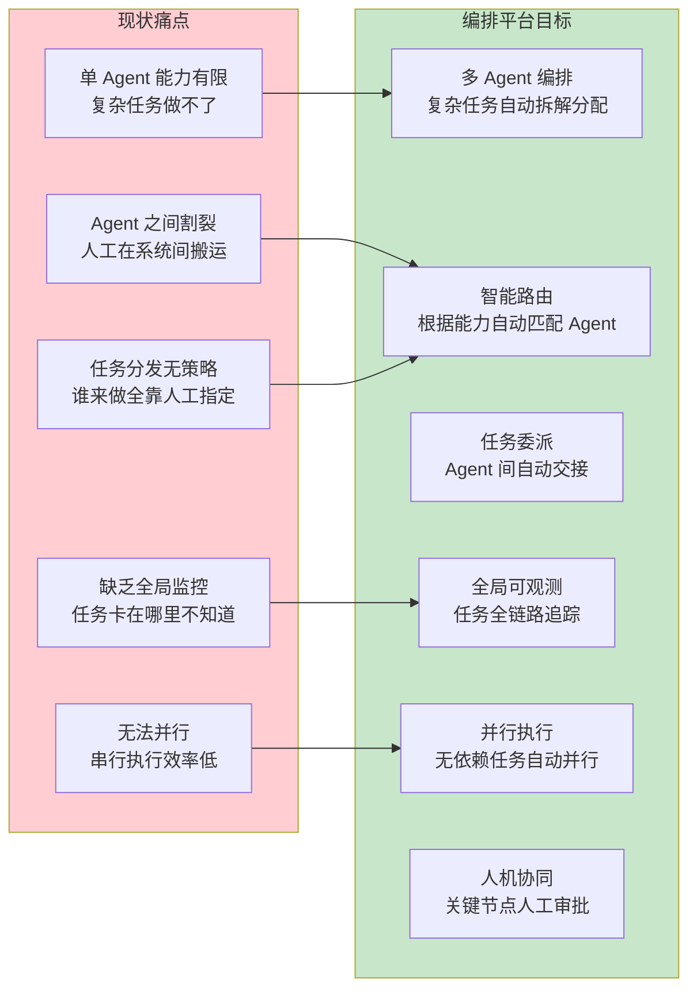
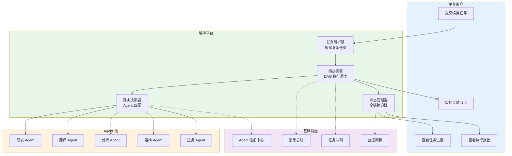
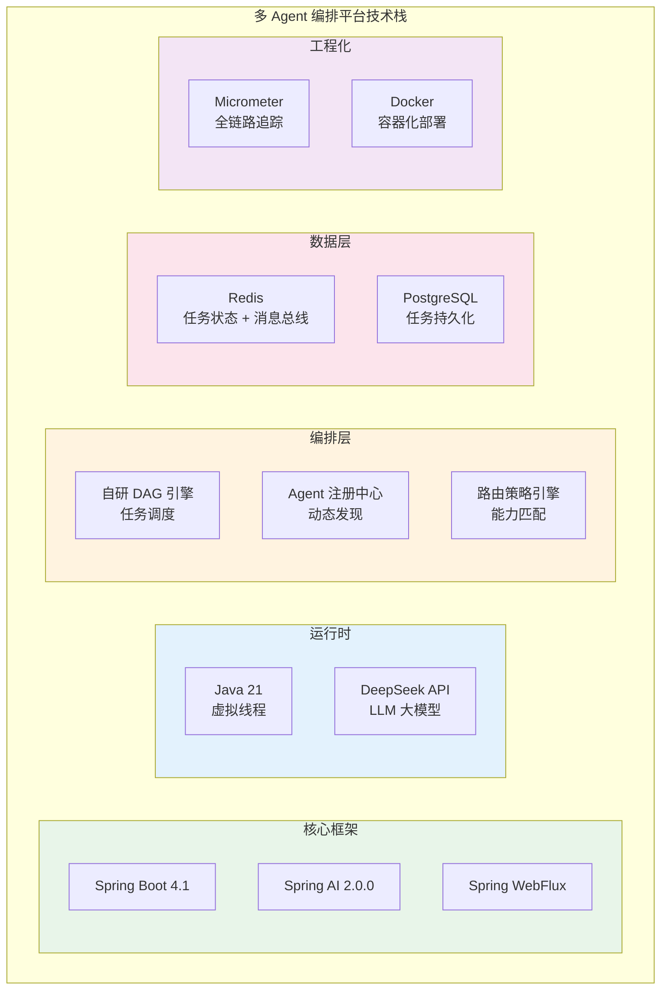
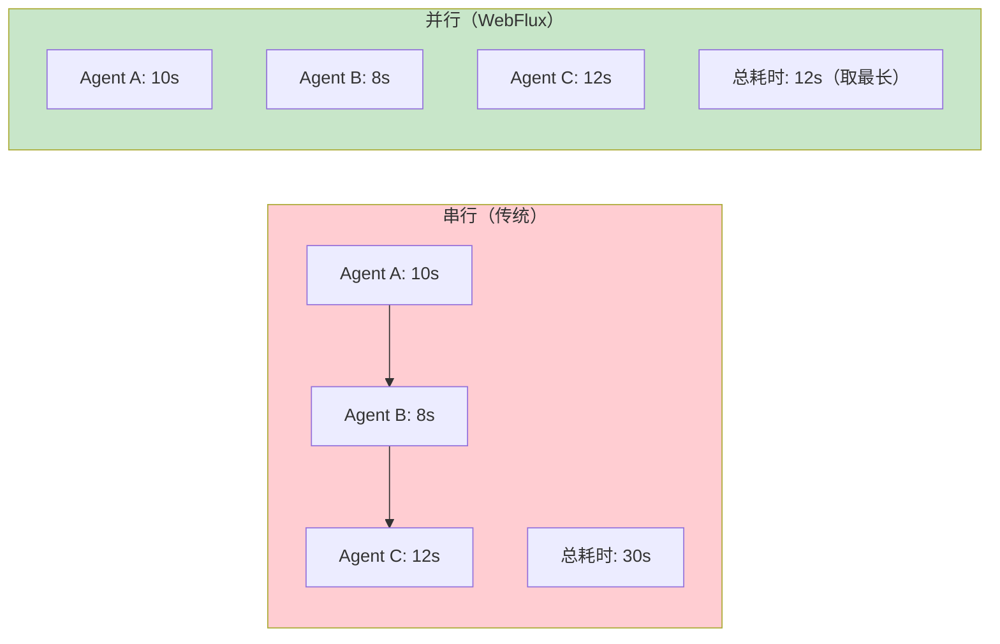
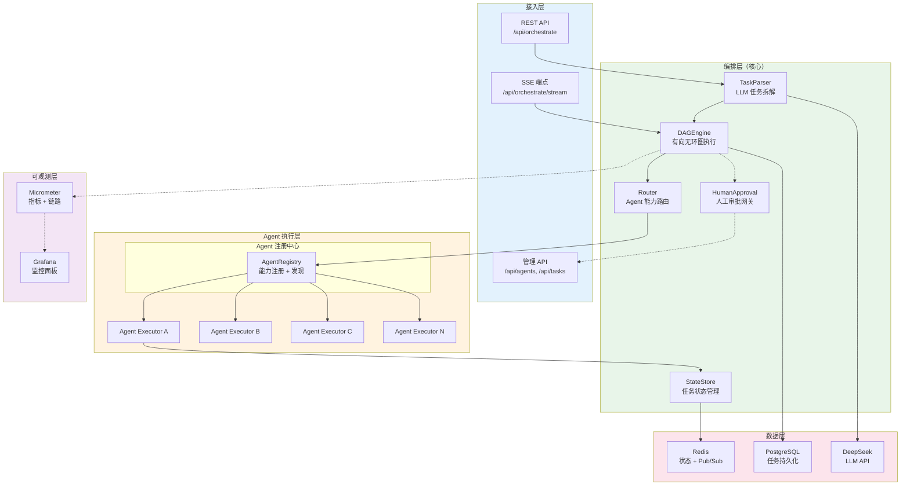
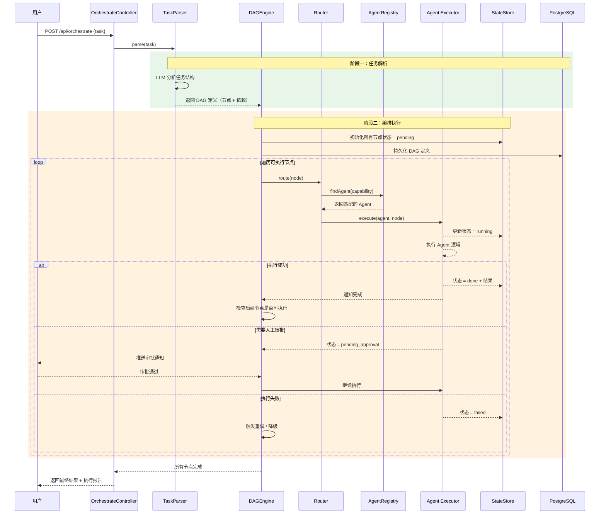
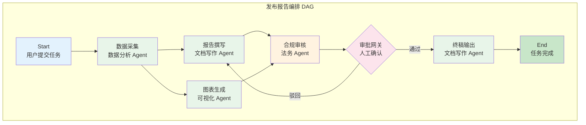
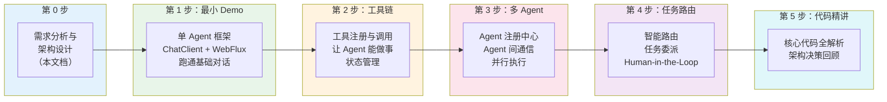

# 00-需求分析与架构设计

> **定位**：从业务需求出发，完整推演一个"多 Agent 编排与任务分发平台"的架构设计——业务场景拆解、编排架构设计、技术选型理由、API 设计、迭代路线。读完这篇，你对这个项目"做什么、怎么做、分几步做"有全貌认知。本文给出设计级代码（含包名与 import，可照抄编译）。

> **读者画像**：有 Spring Boot 经验的 Java 开发者，已掌握单 Agent 基础，希望构建多 Agent 协作的企业级编排平台。

> **前置阅读**：[教程 00-基础与核心/00-Agent核心概念](../../教程/00-基础与核心/00-Agent核心概念.md)、[教程 00-基础与核心/09-多Agent协作](../../教程/00-基础与核心/09-多Agent协作.md)、[教程 04-企业级架构主干/00-管控分离架构](../../教程/04-企业级架构主干/00-管控分离架构.md)。

> **API 真实性**：文中所有 Spring AI API 均按 [附录 05-SpringAI2-API基准] 的真实签名书写。

---

## ★ 阅读顺序总览（文件名编号 = 实际阅读顺序）

> 本子文件夹共 11 个文件，**文件名编号 00-10 即阅读顺序**，按「全貌 → 起步 → 主体迭代 → 进阶迭代 → 决策资产 → 前沿」六个阶段推进：

| 阶段 | 文件 | 读者定位 |
|------|------|---------|
| ① 全貌 | 00-需求分析与架构设计 | **先读再动手**：业务场景、量化指标、架构分层、迭代路线全在这篇 |
| ② 起步 | 01-最小Demo搭建 | **跑通最小闭环**：Agent 抽象 + 注册中心接口 + 单 Agent SSE 对话 |
| ③ 主体迭代 | 02-单Agent工具链、03-多Agent编排、04-任务委派与路由、05-核心代码讲解 | **严格顺序**：工具链 → 多 Agent 编排 → 路由与审批逐层叠加，每篇过验收再前进；05 是主体迭代的代码地图与设计复盘 |
| ④ 进阶迭代 | 06-DAG工作流编排深化、07-A2A协议与Agent互操作、08-多Agent评估与调优 | **进阶顺序**：版本化/分支/循环/Saga/断点续跑 → Agent Card/跨组织委托/信任边界 → 协作指标/群体反思/金标回归/拓扑实验 |
| ⑤ 决策资产 | 09-ADR架构决策记录 | **按需查阅**：21 条决策（上下文/备选/取舍/可回滚）+ 依赖图，读完 08 后复盘最佳 |
| ⑥ 前沿 | 10-工业前沿与演进方向 | **收官扩展**：对照 Bake-Off / Google / Nebius 三份一线实践找缺口 + 下一程路线 + 项目收官 |

> 按此顺序，读者从「知道多 Agent 平台长什么样」一路走到「可运营、可互操作、可度量、决策有据可查的协作平台」。

---

## 1. 业务场景

### 1.1 场景描述

我们要为一家科技企业构建一个**多 Agent 编排与任务分发平台**。随着 AI 能力在组织内部广泛落地，团队同时运行着多个 Agent：研发助手 Agent、文档翻译 Agent、数据分析 Agent、运维巡检 Agent、法务合规 Agent……每个 Agent 各有所长，但它们之间割裂——一个复杂任务往往需要多个 Agent 依次协作才能完成，而当前的做法是人工在多个系统间搬运任务。

用多 Agent 编排平台重建这一流程，核心目标是：



### 1.2 量化指标

这个系统不是玩具 demo，它有明确的工程指标：

| 指标 | 目标值 | 说明 |
|------|--------|------|
| 编排任务量 | 日均 5,000+ | 峰值 100 并发编排 |
| 任务完成率 | ≥ 95% | 不含人工拒绝的审批 |
| Agent 响应延迟 | < 2 秒 TTFT | 首 Agent 首字延迟 |
| 并行加速比 | ≥ 3x | 并行 vs 串行对比 |
| 任务路由准确率 | ≥ 90% | 自动选择正确 Agent |
| 系统可用性 | 99.9% | 高可用编排引擎 |

这些指标直接影响后续的每一个架构决策——为什么需要编排引擎（复杂任务拆解）、为什么需要 Agent 注册中心（动态路由）、为什么用 WebFlux（高并发并行）、为什么需要 Human-in-the-Loop（关键节点审批）。

### 1.3 本节核对（业务场景与量化指标）

| # | 核对项 | PASS 判据 |
|---|--------|----------|
| 1 | §1.2 六项量化指标（任务量/完成率/TTFT/加速比/路由准确率/可用性） | 每项在后续迭代篇验证包中都有对应度量口径，无"提了指标没人测"的孤儿项 |
| 2 | §2.1 三个典型场景 | 分别覆盖串行编排、并行编排、条件路由 + 人工审批三种形态，与 §4.3 DAG 规则表一致 |
| 3 | 痛点 → 目标映射 | Mermaid 图中 P1–P5 每个痛点都有对应目标能力（G1–G6），无悬空目标 |

---

## 2. 用户故事与核心用例

### 2.1 典型编排场景

**场景一：产品发布报告（串行编排）**

```
用户：帮我生成 XX 产品的本月发布报告。
编排引擎：
  Step 1 → 数据分析 Agent：拉取本月发布数据，汇总关键指标
  Step 2 → 文档写作 Agent：基于数据撰写报告初稿
  Step 3 → 法务合规 Agent：审核报告中是否有敏感信息
  Step 4 → 文档写作 Agent：根据审核意见修订最终版
最终输出：完整发布报告 + 合规审核记录
```

这个场景需要串行编排——每一步的输出是下一步的输入，形成有向无环图（DAG）。

**场景二：多语言文档本地化（并行编排）**

```
用户：把这份技术文档翻译成日语、德语、法语。
编排引擎：
  Plan   → 拆解为 3 个独立翻译子任务
  Step 1 → 翻译 Agent A：翻译日语版（并行）
  Step 2 → 翻译 Agent B：翻译德语版（并行）
  Step 3 → 翻译 Agent C：翻译法语版（并行）
  Merge  → 汇总三份译文 + 一致性检查
最终输出：三份本地化文档
```

这个场景需要并行编排——三个翻译任务相互独立，可同时执行，最后合并结果。

**场景三：故障诊断（条件路由 + 人工审批）**

```
用户：生产环境告警，订单服务响应超时。
编排引擎：
  Step 1 → 运维巡检 Agent：检查服务器资源、日志、依赖服务
  Step 2 → 路由决策：
    - if CPU 过载 → 扩容 Agent
    - if DB 慢查询 → DBA Agent
    - if 代码 Bug → 研发 Agent
  Step 3 → [人工审批] 确认修复方案
  Step 4 → 执行修复
```

这个场景需要智能路由 + Human-in-the-Loop——根据巡检结果动态决定下一步，且修复方案需要人工确认。

### 2.2 用例图



### 2.3 本节核对（用户故事与用例覆盖）

| # | 核对项 | PASS 判据 |
|---|--------|----------|
| 1 | 用例图四类用户操作（提交/进度/审批/报告） | 每个操作都能在 §5.1 REST 接口清单中找到落点（无孤儿用例） |
| 2 | Agent 池五角色 | 与 §7 项目结构 `agent/tool` 内置工具集的能力划分一致 |
| 3 | 场景三的 `[人工审批]` 节点 | 对应 §4.3 的 `APPROVAL` 节点类型与 §5.1 的 `POST /api/tasks/{id}/approve` |

---

## 3. 技术选型

### 3.1 选型全景



### 3.2 每个选型的决策理由

#### Spring Boot 4.1 + Spring AI 2.0.0

Spring AI 2.0.0 提供了 ChatClient、Tool Calling、Advisor 链、结构化输出等 Agent 核心能力。多 Agent 平台需要大量 ChatClient 实例——每个 Agent 有自己的系统提示词和工具集，Spring AI 的 Builder 模式让 Agent 定义极其简洁。

> 「遇到阻塞？→ [教程 00-基础与核心/01-Spring-AI框架入门](../../教程/00-基础与核心/01-Spring-AI框架入门.md)」

#### Spring WebFlux（响应式）

多 Agent 平台的核心特征是**并行**——一个编排任务可能同时调度 5 个 Agent 并行执行。WebFlux 基于 Reactor 的 `Flux.merge()` / `Mono.zip()` 天然支持并行编排，且 SSE 流式输出让用户实时看到每个 Agent 的执行进展。



#### Java 21 虚拟线程

编排引擎需要同时管理大量 Agent 的生命周期，传统线程模型几百个线程就是上限。Java 21 的虚拟线程让每个 Agent 独占一个轻量级线程，百万级并发不在话下，且写法与同步代码一致——不需要 `compose` / `flatMap` 链式调用。

#### DeepSeek API（OpenAI 兼容协议）

编排引擎中的"任务解析器"需要强推理能力的 LLM 来拆解复杂任务。DeepSeek 提供高性价比的推理能力，支持 Function Calling 和 JSON 结构化输出，适合做任务规划。接入方式用 `spring-ai-starter-model-openai` + `base-url: https://api.deepseek.com`（统一坐标，见 [教程 00-基础与核心/02-ChatClient与对话模型 §2]）。

#### Redis（状态 + 消息总线）

多 Agent 平台需要两个关键能力：**任务状态管理**（每个子任务处于 pending / running / done / failed 的哪一阶段）和 **Agent 间通信**（Agent A 完成后通知编排引擎触发 Agent B）。Redis 的 Pub/Sub 作为消息总线，延迟在毫秒级。

#### PostgreSQL（任务持久化）

编排任务需要持久化——DAG 定义、执行历史、审计日志都要存。选择 PostgreSQL 而非 MongoDB，因为任务之间有外键关系（编排任务 → 子任务 → 执行步骤），关系型数据库的事务保证更可靠。

> 「遇到阻塞？→ [教程 02-SpringAI核心机制/02-Agent状态管理](../../教程/02-SpringAI核心机制/02-Agent状态管理.md)」

### 3.3 本节核对（选型自洽性）

| # | 核对项 | PASS 判据 |
|---|--------|----------|
| 1 | 每个选型都有"为什么"且与 §9 ADR 002-02 一致 | 无未经论证的选型，无与 ADR 矛盾处 |
| 2 | Spring AI 坐标真实性 | 全部用 `spring-ai-starter-model-openai` + `base-url`，与 [附录 05-SpringAI2-API基准] 一致，无虚构 starter |
| 3 | WebFlux 与虚拟线程分工 | 响应式主链（Mono/Flux）与阻塞调用包裹（`boundedElastic`）的边界在 §11 第 4 条说明，不混用 |

---

## 4. 编排架构设计

### 4.1 整体架构分层



### 4.2 编排引擎核心流程

一个用户提交复杂任务后的完整编排链路：



这个流程图展示了编排引擎的三个核心阶段：任务解析（LLM 拆解）、DAG 执行（拓扑排序 + 并行调度）、状态追踪（全链路可观测）。

> 「遇到阻塞？→ [教程 08-架构师进阶/02-Agent工作流编排](../../教程/08-架构师进阶/02-Agent工作流编排.md)」

### 4.3 DAG 执行模型

编排引擎的核心是 DAG（有向无环图）执行模型。每个编排任务被拆解为一个 DAG，节点是子任务，边是依赖关系：



DAG 执行的关键规则：

| 规则 | 说明 |
|------|------|
| 拓扑排序 | 节点按依赖顺序执行，无依赖的节点并行 |
| 状态驱动 | 每个节点有 pending / running / done / failed / blocked 五种状态 |
| 条件分支 | 支持基于节点输出结果的动态路由 |
| 审批网关 | 特定节点可标记为需人工审批，阻塞等待 |
| 失败重试 | 节点失败后可配置重试次数和降级策略 |

> 「遇到阻塞？→ [教程 00-基础与核心/08-Plan-and-Execute模式](../../教程/00-基础与核心/08-Plan-and-Execute模式.md)」

### 4.4 本节核对（架构分层完整性）

| # | 核对项 | PASS 判据 |
|---|--------|----------|
| 1 | §4.1 编排层五组件（TaskParser/DagEngine/Router/StateStore/HumanApproval） | 与 §7 项目结构 `engine/` + `store/` 包一一对应，无图中画了代码没有的组件 |
| 2 | §4.2 时序图 | 覆盖 done / pending_approval / failed 三条终态路径，每条路径在 §4.3 规则表有对应规则 |
| 3 | §4.3 DAG 示例 | 审批网关有"通过/驳回"两条出边（驳回回到既有节点 N2，不引入图外节点），全图无环 |

---

## 5. API 设计

### 5.1 REST 接口清单

| 接口 | 方法 | 路径 | 说明 |
|------|------|------|------|
| 提交编排任务 | POST | `/api/orchestrate` | 提交复杂任务，返回 taskId |
| 任务流式追踪 | GET | `/api/orchestrate/{id}/stream` | SSE 实时推送执行进度 |
| 查询任务状态 | GET | `/api/tasks/{id}` | 返回 DAG 执行状态 |
| 查询任务列表 | GET | `/api/tasks` | 分页查询历史任务 |
| 审批节点 | POST | `/api/tasks/{id}/approve` | 人工审批结果 |
| 取消任务 | DELETE | `/api/tasks/{id}` | 终止正在执行的任务 |
| 注册 Agent | POST | `/api/agents` | 注册新 Agent 到注册中心 |
| 查询 Agent 列表 | GET | `/api/agents` | 查看所有已注册 Agent |
| 查询 Agent 详情 | GET | `/api/agents/{id}` | Agent 能力、负载详情 |

### 5.2 核心接口数据结构（完整代码，包 `com.example.orchestrator.model`）

**编排任务提交请求**：

```java
// model/OrchestrateRequest.java
package com.example.orchestrator.model;

import java.util.Map;

public record OrchestrateRequest(
        String task,                 // 自然语言任务描述
        Map<String, Object> params,  // 任务参数
        ExecutionPolicy policy,      // 执行策略（超时、重试等）
        boolean requireApproval) {}  // 是否需要人工审批
```

```java
// model/ExecutionPolicy.java
package com.example.orchestrator.model;

import java.time.Duration;

public record ExecutionPolicy(
        Duration timeout,            // 整体超时时间
        int maxRetries,              // 单节点最大重试
        boolean parallelEnabled,     // 是否允许并行
        FailureStrategy onFailure) { // 失败策略：ABORT / SKIP / RETRY

    public enum FailureStrategy { ABORT, SKIP, RETRY }
}
```

**DAG 定义结构（LLM 返回的结构化输出）**：

```java
// model/DagDefinition.java
package com.example.orchestrator.model;

import java.util.List;
import java.util.Map;

public record DagDefinition(
        String dagId,
        String taskId,
        List<DagNode> nodes,         // 所有节点
        List<DagEdge> edges,         // 依赖关系
        Map<String, Object> globalContext) {}
```

```java
// model/DagNode.java
package com.example.orchestrator.model;

import java.time.LocalDateTime;
import java.util.Map;

public record DagNode(
        String nodeId,
        String description,          // 子任务描述
        String requiredCapability,   // 需要的 Agent 能力
        NodeType type,               // TASK / APPROVAL / MERGE
        Map<String, Object> config,  // 节点配置
        NodeStatus status,           // 执行状态
        String result,               // 执行结果
        String assignedAgentId,      // 分配的 Agent
        LocalDateTime startedAt,
        LocalDateTime completedAt,
        int retryCount) {}
```

```java
// model/DagEdge.java
package com.example.orchestrator.model;

public record DagEdge(
        String from,                 // 前驱节点
        String to,                   // 后继节点
        String condition) {}         // 条件表达式（可选）
```

**SSE 事件类型**（实现统一为 `EventType`，见 [03-迭代二 §5.1]）：

```java
// model/EventType.java
package com.example.orchestrator.model;

public enum EventType {
    DAG_CREATED,       // DAG 已生成
    NODE_STARTED,      // 节点开始执行
    NODE_COMPLETED,    // 节点执行完成
    NODE_FAILED,       // 节点执行失败
    TASK_COMPLETED,    // 整个任务完成
    TASK_FAILED        // 整个任务失败
}
```

> 说明：设计阶段的 `SSEEventType`（含 `APPROVAL_REQUIRED` 等）在实现中收敛为 `EventType`；审批事件由 `ApprovalGateway.pendingApprovals()` 独立推送（[04-迭代三 §6.5]）。

### 5.3 SSE 流式接口（完整代码）

```java
// web/OrchestrateSseController.java
package com.example.orchestrator.web;

import com.example.orchestrator.store.TaskStateStore;
import com.fasterxml.jackson.core.JsonProcessingException;
import com.fasterxml.jackson.databind.ObjectMapper;
import org.springframework.http.MediaType;
import org.springframework.http.codec.ServerSentEvent;
import org.springframework.web.bind.annotation.GetMapping;
import org.springframework.web.bind.annotation.PathVariable;
import org.springframework.web.bind.annotation.RestController;
import reactor.core.publisher.Flux;

@RestController
public class OrchestrateSseController {

    private final TaskStateStore stateStore;
    private final ObjectMapper objectMapper;

    public OrchestrateSseController(TaskStateStore stateStore, ObjectMapper objectMapper) {
        this.stateStore = stateStore;
        this.objectMapper = objectMapper;
    }

    @GetMapping(value = "/api/orchestrate/{taskId}/stream",
                produces = MediaType.TEXT_EVENT_STREAM_VALUE)
    public Flux<ServerSentEvent<String>> streamTask(@PathVariable String taskId) {
        return stateStore.subscribeDagEvents(taskId)
                .map(event -> ServerSentEvent.<String>builder()
                        .event(event.type().name().toLowerCase())
                        .data(toJson(event))
                        .build());
    }

    private String toJson(Object obj) {
        try {
            return objectMapper.writeValueAsString(obj);
        } catch (JsonProcessingException e) {
            throw new IllegalStateException("事件序列化失败", e);
        }
    }
}
```

这里的关键设计：SSE 事件携带节点级粒度的进度信息。用户提交一个包含 5 个节点的编排任务后，能在界面上实时看到每个节点的启动、输出、完成状态——就像 CI/CD pipeline 的可视化一样。

> 「遇到阻塞？→ [教程 02-SpringAI核心机制/06-SSE流式通信](../../教程/02-SpringAI核心机制/06-SSE流式通信.md)」

### 5.4 本节测试与验证（API 契约与数据结构）

> 本篇为设计篇，尚无可运行服务——本节验证口径是「**契约自洽 + 可编译**」，运行时验证在各迭代篇。

**前置条件**：已按 §3.1 引入依赖（迭代一篇 pom.xml）；`com.example.orchestrator.model` 包已建立。

**材料**：§5.2 的 `OrchestrateRequest` / `ExecutionPolicy` / `DagDefinition` / `DagNode` / `DagEdge` / `EventType` 六个文件 + §5.3 `OrchestrateSseController`。

**步骤与断言**：

| # | 操作 | 预期（PASS 判据） |
|---|------|------------------|
| 1 | 手写 §5.2 六个文件后 `mvn clean compile` | 编译通过（全部 record/enum 无省略、import 完整） |
| 2 | 对照 §5.1 九个 REST 接口逐个走查 | 每个接口的请求/响应都能由上述模型承载，无孤儿接口、无缺字段 |
| 3 | SSE 事件命名核对 | `event.type().name().toLowerCase()`（§5.3）与 `EventType` 六值一一对应（`dag_created` 等） |
| 4 | 审批事件缺口核对 | `APPROVAL` 不在 `EventType` 中——确认审批走 `ApprovalGateway.pendingApprovals()` 独立通道（§5.2 说明），不得为"补全"而虚构枚举值 |

**失败排查**：编译失败→import 或包名照抄偏差（record 是完整代码，逐行比对）；接口与模型对不上→自行增删字段后须同步 §5.1 表格与后续迭代篇。

---

## 6. 迭代路线

这个项目不追求一步到位，而是从单 Agent 骨架开始，每个迭代增加一层编排能力：



| 迭代 | 产出 | 对应文档 | 新增能力 |
|------|------|---------|---------|
| 最小 Demo | 单 Agent 骨架 | [01-最小Demo搭建](01-最小Demo搭建.md) | Agent 抽象、ChatClient 调用 |
| 迭代一 | 单 Agent 工具链 | [02-单Agent工具链](02-单Agent工具链.md) | 工具注册、调用、状态管理 |
| 迭代二 | 多 Agent 编排 | [03-多Agent编排](03-多Agent编排.md) | 注册中心、Agent 间通信、DAG 引擎 |
| 迭代三 | 任务委派与路由 | [04-任务委派与路由](04-任务委派与路由.md) | 智能路由、审批网关 |
| 核心精讲 | 代码全解析 | [05-核心代码讲解](05-核心代码讲解.md) | 架构决策回顾 |
| 进阶一 | DAG 编排深化 | [06-DAG工作流编排深化](06-DAG工作流编排深化.md) | 模板版本化灰度、条件分支/循环/子图、Saga 补偿、断点续跑 |
| 进阶二 | A2A 互操作 | [07-A2A协议与Agent互操作](07-A2A协议与Agent互操作.md) | Agent Card 发布/发现、跨组织委托、信任边界、MCP/A2A 分工 |
| 进阶三 | 评估与调优 | [08-多Agent评估与调优](08-多Agent评估与调优.md) | 协作指标面、群体反思、金标回归闸门、拓扑实验 |
| 决策资产 | ADR 全量沉淀 | [09-ADR架构决策记录](09-ADR架构决策记录.md) | 21 条决策（上下文/备选/取舍/可回滚）+ 依赖图 |
| 前沿收官 | 行业对照与演进 | [10-工业前沿与演进方向](10-工业前沿与演进方向.md) | Bake-Off/Google/Nebius 对照、下一程路线、项目收官 |

每一迭代都可独立运行，前一步是后一步的基础。按顺序阅读，每一步的新增核心代码控制在合理范围。上图是主线（00→05）骨架；06-10 进阶篇在主线之上继续深化，完整阅读顺序见文首「★ 阅读顺序总览」。

---

## 7. 项目结构

```
multi-agent-platform/
├── src/main/java/com/example/orchestrator/
│   ├── OrchestratorApplication.java       # 启动类
│   ├── config/                            # 配置类
│   │   ├── AgentProperties.java                 # agent.definitions 绑定
│   │   ├── AgentAutoRegistration.java           # 启动自动注册
│   │   ├── ChatClientConfig.java                # TaskParser 专用 ChatClient
│   │   ├── ToolCallingConfig.java               # 工具可观测装饰器
│   │   └── RoutingConfig.java                   # 路由策略切换
│   ├── web/                             # 接口层（包名 com.example.orchestrator.web）
│   │   ├── AgentController.java                 # Agent 对话 + 会话
│   │   ├── OrchestrateController.java           # 编排任务提交
│   │   ├── OrchestrateSseController.java        # SSE 事件流
│   │   ├── ApprovalController.java              # 审批
│   │   └── GlobalExceptionHandler.java          # 统一异常
│   ├── engine/                           # 编排引擎（核心）
│   │   ├── TaskParser.java                      # LLM 任务拆解
│   │   ├── DagEngine.java                       # DAG 执行引擎
│   │   ├── AgentRouter.java                     # 路由门面（评分 + 降级）
│   │   ├── RoutingStrategy.java                 # 路由策略接口
│   │   ├── CompositeRoutingStrategy.java        # 五维度评分
│   │   ├── RoundRobinStrategy.java              # 轮询
│   │   ├── LeastLoadStrategy.java               # 最小负载
│   │   └── ApprovalGateway.java                 # 审批网关
│   ├── agent/                           # Agent 抽象层
│   │   ├── AgentRegistry.java                   # 注册中心接口
│   │   ├── RedisAgentRegistry.java              # Redis 实现
│   │   ├── AgentExecutor.java                   # Agent 执行器
│   │   ├── ToolRegistry.java                    # 工具注册表
│   │   ├── MessageBus.java                      # 消息总线
│   │   ├── AgentLoadMonitor.java                # 负载监控
│   │   ├── AgentPerformanceTracker.java         # 成功率追踪
│   │   └── tool/                               # 内置工具集（包名 agent.tool，单数）
│   │       ├── GeneralAgentTools.java
│   │       ├── ResearchAgentTools.java
│   │       └── DelegationTool.java
│   ├── model/                           # 数据模型（record，包名 com.example.orchestrator.model）
│   │   ├── AgentDefinition.java
│   │   ├── ModelConfig.java
│   │   ├── AgentNotFoundException.java
│   │   ├── OrchestrateRequest.java
│   │   ├── ExecutionPolicy.java
│   │   ├── DagDefinition.java
│   │   ├── DagNode.java
│   │   ├── DagEdge.java
│   │   ├── DagEvent.java
│   │   ├── NodeType.java
│   │   ├── NodeStatus.java
│   │   ├── EventType.java
│   │   ├── OrchestrationTask.java
│   │   ├── AgentSession.java
│   │   ├── SessionMessage.java
│   │   ├── ContextWindow.java
│   │   ├── ScoredAgent.java
│   │   ├── RoutingContext.java
│   │   ├── ApprovalRequest.java
│   │   ├── ApprovalResult.java
│   │   ├── ApprovalDecision.java
│   │   ├── NoAgentAvailableException.java
│   │   ├── WorkflowTemplate.java
│   │   ├── DagBlueprint.java
│   │   └── TemplateMatch.java
│   ├── store/                           # 存储层
│   │   ├── SessionStateStore.java              # Redis 会话
│   │   ├── TaskStateStore.java                 # Redis DAG 状态 + 事件
│   │   ├── TaskRepository.java                 # PostgreSQL 持久化
│   │   └── TaskRecoveryService.java            # 断点恢复
│   └── observability/                   # 可观测
│       └── LoggingToolCallingManager.java      # 工具可观测装饰器
├── src/main/resources/
│   ├── application.yaml                  # 主配置（仅 .env import + profiles.active: multiagent）
│   ├── application-multiagent.yaml       # 业务配置（agent.definitions/ai/datasource/port=8081）
│   └── db/
│       └── schema-v2.sql                 # SQL DDL
└── pom.xml
```

### 7.1 本节核对（结构与分层对应）

| # | 核对项 | PASS 判据 |
|---|--------|----------|
| 1 | `engine/agent/model/store/observability` 五包 | 与 §4.1 架构分层一一对应，无结构树里没有分层的类、无分层里没有的类 |
| 2 | MVC 残留 | `web/` 下全部返回 `Mono/Flux`，无 `spring-boot-starter-web` 依赖 |
| 3 | 结构树中的类名 | 每个都在对应迭代篇有完整代码或明确标注，无只出现在树里的幽灵类 |

---

## 8. 关键约束与设计原则

### 8.1 编排与执行分离

这是整个平台最重要的架构决策——编排引擎不直接执行 Agent 逻辑，它只负责任务拆解、调度和状态管理。Agent 的执行由独立的 Agent Executor 完成。这种**管控分离**架构的好处是：编排引擎可以独立扩缩容，Agent 执行器可以独立部署。

> 「遇到阻塞？→ [教程 04-企业级架构主干/00-管控分离架构](../../教程/04-企业级架构主干/00-管控分离架构.md)」

### 8.2 幂等性保证

编排任务的每个节点必须幂等——重试不会产生副作用。这意味着 Agent 执行器在设计工具时要考虑幂等：查询类工具天然幂等，写入类工具需要通过唯一 ID 去重。

### 8.3 可观测性优先

每个编排任务的执行必须能回溯：哪个节点花了几秒、调用了哪个 Agent、消耗了多少 Token、是否触发了重试。Micrometer + 自定义指标的埋点贯穿整个编排链路。

> 「遇到阻塞？→ [教程 04-企业级架构主干/02-全链路可观测性](../../教程/04-企业级架构主干/02-全链路可观测性.md)」

### 8.4 渐进式复杂度

从单 Agent 到多 Agent 编排是一个陡峭的学习曲线。我们的迭代路线确保每一步都可运行、可验证：

- 迭代一先搞定单个 Agent 的完整能力（工具 + 状态）
- 迭代二加入 Agent 间通信（从 1 到 N）
- 迭代三加入智能路由（从 N 到自动化）

### 8.5 本节核对（设计原则可验证性）

| # | 核对项 | PASS 判据 |
|---|--------|----------|
| 1 | §8.1 编排与执行分离 | 与 §9 ADR 002-00 表述一致；DagEngine 代码（03 篇）不 import 任何具体 Agent 实现 |
| 2 | §8.2 幂等性 | 后续迭代篇验证包中有对应重试断言（重复执行结果一致） |
| 3 | §8.3 可观测性 | 每篇验收标准中至少一项可度量指标（呼应 CLAUDE.md 企业级项目规范） |

---

## 9. ADR 顶层架构决策

### ADR 002-00：多 Agent 平台用「编排与执行分离」的管控分离架构
- **决策**：编排引擎（TaskParser/DagEngine/Router）只负责拆解、调度、状态管理，不直接执行 Agent 逻辑；Agent 执行由独立的 AgentExecutor 完成
- **取舍理由**：编排层与执行层独立扩缩容；编排可观测集中在引擎，Agent 可插拔。代价是多一层间接调用（[教程 04-企业级架构主干/00-管控分离架构]）

### ADR 002-01：任务模型用 DAG（有向无环图），支持并行与审批网关
- **决策**：任务拆解为节点 + 有向边的 DAG；无依赖节点并行；`APPROVAL` 类型节点支持人工审批
- **取舍理由**：比顺序流水线表达力强（并行/条件/合并），比完整状态机实现简单；DAG 无环保证调度可收敛

### ADR 002-02：技术栈统一为 Spring AI 2.0 + WebFlux + Redis + PostgreSQL，LLM 走 OpenAI 兼容协议
- **决策**：`spring-ai-starter-model-openai` + `base-url: https://api.deepseek.com`；Redis 做状态 + 消息总线，PostgreSQL 做持久化审计
- **取舍理由**：DeepSeek 兼容 OpenAI 协议，一套坐标可切换模型；Redis 快读写满足编排热路径，PostgreSQL 可靠满足合规审计（详见 §3）

> 迭代过程中的演进 ADR 见各迭代篇末尾（ADR 002-03 ~ 002-20，含进阶篇与本篇外的补录；全量索引与依赖图见 [09-ADR架构决策记录](09-ADR架构决策记录.md)）。

### 9.1 本节核对（ADR 规范性）

| # | 核对项 | PASS 判据 |
|---|--------|----------|
| 1 | 三条 ADR 均含决策 + 取舍理由 | 无"只给结论不给理由"的条目 |
| 2 | 编号衔接 | 本篇止于 002-02，002-03 起在迭代篇，全量索引在 [09-ADR架构决策记录]，编号无冲突 |
| 3 | 一致性 | ADR 002-01 的 DAG + 审批网关与 §4.3 规则表、§5.2 `NodeType.APPROVAL` 三处口径一致 |

---

## 10. 总结

本文档完成了多 Agent 编排平台的顶层设计：

1. **业务场景**——企业内部多 Agent 割裂，需要一个编排平台实现任务自动拆解、分配、执行
2. **技术选型**——Spring Boot 4.1 + Spring AI 2.0 + WebFlux + Redis + PostgreSQL，每一项服务于编排核心需求
3. **架构分层**——接入层 / 编排引擎 / Agent 执行层 / 数据层，编排与执行分离
4. **DAG 模型**——任务拆解为有向无环图，支持并行、条件分支、审批网关
5. **API 设计**——编排提交 + SSE 实时追踪 + 审批接口，节点级粒度进度可视化
6. **迭代路线**——从单 Agent 骨架到智能路由，四步渐进

下一篇 [01-最小Demo搭建](01-最小Demo搭建.md) 将从零搭建项目骨架，定义 Agent 抽象层，跑通第一个单 Agent + SSE 流式对话。

### 10.1 本节核对（总结）

一句话核对：总结六点与正文 §1–§6 一一对应，无引入正文未出现的新结论。

---

## 11. 代码使用说明（照抄前必读）

本项目的代码遵循「项目文档不生成 .java 文件、代码由用户手写」的规范，因此：

1. **框架 API 全部真实**：Spring AI 2.0.0 的 `ChatClient`/`@Tool`/`CallAdvisor`/`ChatMemory` 等均按 [附录 05-SpringAI2-API基准] 的真实签名书写，可照抄编译；包名统一为 `com.example.orchestrator`。
2. **自定义业务类是完整实现**：如 `AgentRegistry`、`MessageBus`、`DagEngine`、`TaskStateStore` 等项目专属业务类均给出**完整代码（含全部 import、无 `...` 省略）**，可照抄编译。
3. **依赖标注**：凡引入 pom.xml 未声明的新依赖（PostgreSQL、JDBC 等），均在对应迭代篇标注「需在 pom.xml 中添加依赖」并给出完整 `<dependency>` 片段。
4. **WebFlux 一致性**：所有代码遵循响应式铁律（Reacttor Context 传请求上下文、禁 ThreadLocal、EventLoop 上禁 block、Redis 用 ReactiveRedisTemplate）；阻塞式 LLM 调用一律包 `Mono.fromCallable(...).subscribeOn(Schedulers.boundedElastic())`。
5. **演进式阅读**：每个迭代篇都从"上一版痛点"出发，回答"新增需求→影响模块→架构演进"三问，请按 `00 → 01 → 02 → ...` 顺序阅读，不要跳读最终版。
6. **工具拦截纪律**：工具执行拦截/观测用 `ToolCallingManager` 装饰器（附录 05-02 §1.3），**禁止用 AOP 拦 `@Tool`**（反射调用绕过代理，收不到）。

### 11.1 本节核对（代码使用纪律）

| # | 核对项 | PASS 判据 |
|---|--------|----------|
| 1 | 第 2 条"完整代码无省略" | 抽查任一迭代篇代码块，无 `...`/`// 省略`（与零省略审计口径一致） |
| 2 | 第 4 条 WebFlux 一致性 | 全项目代码 grep 无 ThreadLocal 传上下文、无 EventLoop 上 block |
| 3 | 第 6 条工具拦截纪律 | 后续篇的观测实现均基于 `ToolCallingManager` 装饰器，无 AOP 拦 `@Tool` 示例 |
