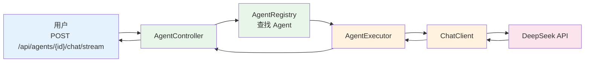
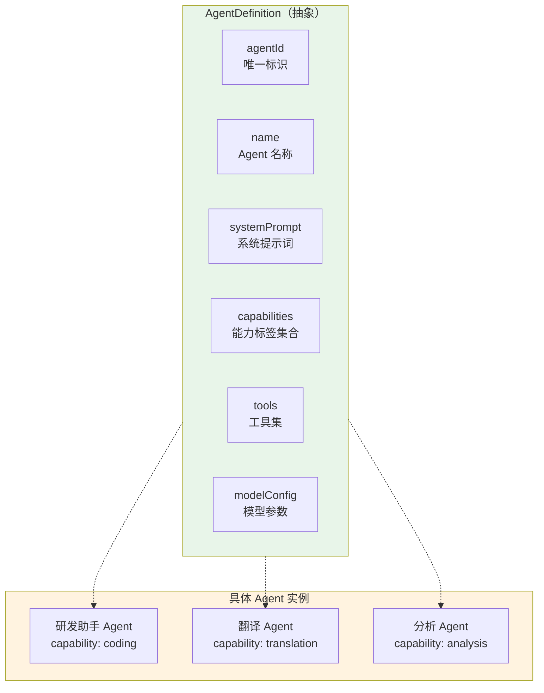
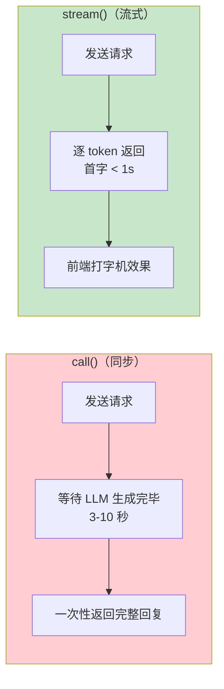
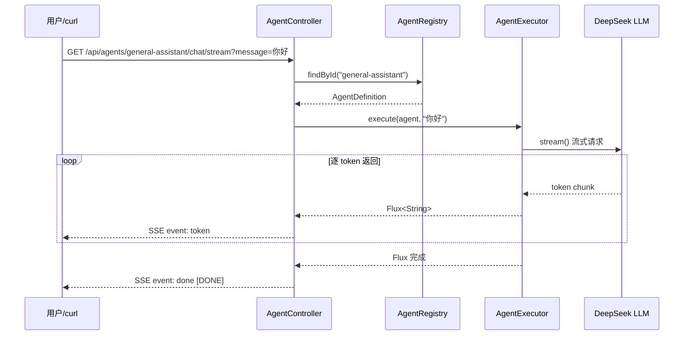
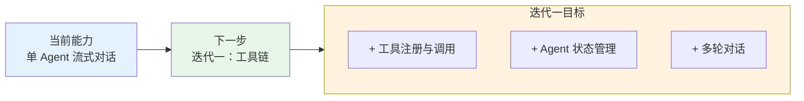

# 01-最小 Demo 搭建

> **定位**：从零创建 Spring Boot 4.1 + Spring AI 2.0 项目骨架，定义 Agent 抽象层，实现最简的单 Agent + WebFlux + SSE 流式对话接口。读完这篇，你能跑通"用户提问 → Agent 推理 → SSE 流式回复"的完整链路，这是后续多 Agent 编排的基座。

> **读者画像**：刚读完需求分析，准备动手写代码的开发者。

> **前置阅读**：[00-需求分析与架构设计](00-需求分析与架构设计.md)。

> **关联教程**：[教程 00-Agent核心概念](../../教程/00-Agent核心概念.md)、[教程 06-ReAct推理模式](../../教程/06-ReAct推理模式.md)、[教程 09-SSE流式通信](../../教程/09-SSE流式通信.md)。

---

## 1. 本篇目标

这一步只做一件事：**搭建 Agent 抽象层，让一个 Agent 能流式对话**。不编排、不路由、不做多 Agent 协作——纯粹的单 Agent 对话 + SSE 流式输出。

但这个 Demo 和普通 ChatClient 调用不同：我们引入了 **AgentDefinition 抽象**。这不是过度设计——后续迭代二要注册多个 Agent，迭代三要让 Agent 间通信，全依赖这个抽象。

> 「遇到阻塞？→ [教程 00-Agent核心概念](../../教程/00-Agent核心概念.md)」



五个核心文件搞定骨架：`pom.xml`、`application.yml`、`AgentDefinition.java`、`AgentRegistry.java`、`AgentController.java`。

---

## 2. 项目初始化

### 2.1 Maven 依赖

`pom.xml` 核心依赖：

```xml
<parent>
    <groupId>org.springframework.boot</groupId>
    <artifactId>spring-boot-starter-parent</artifactId>
    <version>4.1.0</version>
</parent>

<properties>
    <java.version>21</java.version>
    <spring-ai.version>2.0.0</spring-ai.version>
</properties>

<dependencies>
    <!-- WebFlux：响应式 Web 框架，支持 SSE 流式 -->
    <dependency>
        <groupId>org.springframework.boot</groupId>
        <artifactId>spring-boot-starter-webflux</artifactId>
    </dependency>

    <!-- Spring AI DeepSeek Starter：自动配置 ChatClient -->
    <dependency>
        <groupId>org.springframework.ai</groupId>
        <artifactId>spring-ai-starter-model-deepseek</artifactId>
    </dependency>

    <!-- Spring Data Redis：后续用于 Agent 状态管理 -->
    <dependency>
        <groupId>org.springframework.boot</groupId>
        <artifactId>spring-boot-starter-data-redis-reactive</artifactId>
    </dependency>

    <!-- 监控 -->
    <dependency>
        <groupId>org.springframework.boot</groupId>
        <artifactId>spring-boot-starter-actuator</artifactId>
    </dependency>
</dependencies>

<dependencyManagement>
    <dependencies>
        <dependency>
            <groupId>org.springframework.ai</groupId>
            <artifactId>spring-ai-bom</artifactId>
            <version>${spring-ai.version}</version>
            <type>pom</type>
            <scope>import</scope>
        </dependency>
    </dependencies>
</dependencyManagement>
```

依赖说明：

| 依赖 | 作用 | 为什么需要 |
|------|------|-----------|
| webflux | 响应式 Web + SSE | 多 Agent 并行的基石 |
| spring-ai-starter-model-deepseek | ChatClient 自动配置 | Agent 的"大脑" |
| data-redis-reactive | 响应式 Redis | 后续状态管理、Agent 注册 |
| actuator | 健康检查 + 指标 | 可观测性 |

### 2.2 配置文件

`application.yml`：

```yaml
spring:
  ai:
    deepseek:
      api-key: ${DEEPSEEK_API_KEY}
      chat:
        options:
          model: deepseek-chat
          temperature: 0.7
          max-tokens: 2048
  data:
    redis:
      host: localhost
      port: 6379
  application:
    name: multi-agent-platform

server:
  port: 8080

management:
  endpoints:
    web:
      exposure:
        include: health,info,metrics
```

注意 `temperature: 0.7`——Agent 的推理任务需要一定创造力，但不能太发散。后续不同 Agent 可以有不同的 temperature：创意写作 Agent 用 0.9，数据分析 Agent 用 0.2。

---

## 3. Agent 抽象层设计

### 3.1 为什么需要 Agent 抽象

最小 Demo 阶段只有一个 Agent，为什么要提前抽象？因为这个抽象定义了后续所有迭代的核心契约：



### 3.2 AgentDefinition 数据模型

```java
public record AgentDefinition(
    String agentId,              // 唯一标识，如 "coder-agent-01"
    String name,                 // 显示名称，如 "研发助手"
    String description,          // 能力描述（用于路由匹配）
    String systemPrompt,         // 系统提示词
    Set<String> capabilities,    // 能力标签：["coding", "review", "test"]
    List<ToolDefinition> tools,  // 工具集（迭代二填充）
    ModelConfig modelConfig      // 模型参数覆盖
) {}

public record ModelConfig(
    String model,                // 模型名
    Double temperature,          // 温度
    Integer maxTokens            // 最大 Token
) {}

public record ToolDefinition(
    String name,
    String description,
    String schema                // 参数 JSON Schema
) {}
```

用 `record` 而非 class——Agent 定义是不可变的值对象。注册后不允许修改，修改等于注销再注册。

### 3.3 默认 Agent 配置

我们先定义一个"通用助手 Agent"作为最小 Demo 的运行实例。用 Spring 配置文件管理：

```yaml
agent:
  definitions:
    - agent-id: general-assistant
      name: 通用助手
      description: 能处理日常问答、信息整理、文案撰写的通用 Agent
      system-prompt: |
        你是一个通用任务助手。你的职责是理解用户需求并给出高质量回答。
        回答要准确、简洁、有条理。如果信息不足，主动追问。
      capabilities:
        - general
        - qa
        - writing
      model-config:
        model: deepseek-chat
        temperature: 0.7
        max-tokens: 2048
```

```java
@ConfigurationProperties(prefix = "agent")
public record AgentProperties(
    List<AgentDefinition> definitions
) {}
```

---

## 4. Agent 注册中心

### 4.1 注册中心接口设计

注册中心是多 Agent 平台的心脏——迭代二的 Agent 发现、迭代三的路由匹配，全依赖它。

```java
public interface AgentRegistry {

    /**
     * 注册 Agent
     */
    Mono<Void> register(AgentDefinition agent);

    /**
     * 注销 Agent
     */
    Mono<Void> unregister(String agentId);

    /**
     * 按 ID 查找 Agent
     */
    Mono<AgentDefinition> findById(String agentId);

    /**
     * 按能力查找 Agent（迭代三的路由核心）
     */
    Flux<AgentDefinition> findByCapability(String capability);

    /**
     * 列出所有 Agent
     */
    Flux<AgentDefinition> findAll();
}
```

返回类型全用 `Mono` / `Flux`——注册中心底层在迭代二会切换到 Redis，响应式接口让上层无需改动。

### 4.2 基于内存的实现（最小 Demo 阶段）

最小 Demo 阶段先用 `ConcurrentHashMap` 做内存实现，保持极简：

```java
@Repository
public class InMemoryAgentRegistry implements AgentRegistry {

    private final Map<String, AgentDefinition> store = new ConcurrentHashMap<>();

    @Override
    public Mono<Void> register(AgentDefinition agent) {
        return Mono.fromRunnable(() ->
            store.put(agent.agentId(), agent)
        );
    }

    @Override
    public Mono<Void> unregister(String agentId) {
        return Mono.fromRunnable(() ->
            store.remove(agentId)
        );
    }

    @Override
    public Mono<AgentDefinition> findById(String agentId) {
        return Mono.justOrEmpty(store.get(agentId));
    }

    @Override
    public Flux<AgentDefinition> findByCapability(String capability) {
        return Flux.fromIterable(store.values())
            .filter(agent -> agent.capabilities().contains(capability));
    }

    @Override
    public Flux<AgentDefinition> findAll() {
        return Flux.fromIterable(store.values());
    }
}
```

### 4.3 启动时自动注册

```java
@Configuration
@EnableConfigurationProperties(AgentProperties.class)
public class AgentAutoRegistration {

    @Bean
    ApplicationRunner registerAgents(
            AgentRegistry registry,
            AgentProperties properties
    ) {
        return args -> {
            Flux.fromIterable(properties.definitions())
                .flatMap(registry::register)
                .then()
                .block();

            System.out.println("已注册 " + properties.definitions().size() + " 个 Agent");
        };
    }
}
```

启动时把 `application.yml` 中配置的 Agent 注册到注册中心。后续迭代二可以从数据库或远程配置动态加载。

---

## 5. Agent 执行器

### 5.1 AgentExecutor 核心逻辑

AgentExecutor 是 Agent 的"执行引擎"——接收 Agent 定义和用户输入，构造 ChatClient 调用，返回流式响应。

```java
@Service
public class AgentExecutor {

    private final ChatClient.Builder chatClientBuilder;

    public AgentExecutor(ChatClient.Builder chatClientBuilder) {
        this.chatClientBuilder = chatClientBuilder;
    }

    /**
     * 执行 Agent，返回流式响应
     */
    public Flux<String> execute(AgentDefinition agent, String userMessage) {
        ChatClient client = buildClient(agent);

        return client.prompt()
            .system(agent.systemPrompt())
            .user(userMessage)
            .stream()
            .content();
    }

    private ChatClient buildClient(AgentDefinition agent) {
        var builder = chatClientBuilder
            .defaultSystem(agent.systemPrompt());

        // 如果 Agent 有自定义模型配置，覆盖默认值
        if (agent.modelConfig() != null) {
            var config = agent.modelConfig();
            builder = builder.defaultOptions(DeepSeekChatOptions.builder()
                .withModel(config.model())
                .withTemperature(config.temperature())
                .withMaxTokens(config.maxTokens())
                .build());
        }

        return builder.build();
    }
}
```

关键设计决策：

| 决策 | 理由 |
|------|------|
| 每次调用 `buildClient` | 每个 Agent 有不同的 systemPrompt 和模型参数，不能用单例 |
| 返回 `Flux<String>` | 流式输出是刚需，SSE 推送到前端 |
| 不在此层加工具 | 工具在迭代一加入，保持最小 Demo 极简 |

> 「遇到阻塞？→ [教程 06-ReAct推理模式](../../教程/06-ReAct推理模式.md)」

### 5.2 响应式流式调用

`client.prompt().stream().content()` 返回 `Flux<String>`——这是 Spring AI 2.0 的流式 API。它内部对接 DeepSeek 的 SSE 接口，逐 token 返回。

为什么用 `stream()` 而非 `call()`？



对于 Agent 平台来说，流式不只是用户体验——在多 Agent 编排场景中，编排引擎可以基于流式输出做**早期决策**（例如检测到 Agent 输出错误信号时提前中止）。

---

## 6. Agent 对话接口

### 6.1 Controller 设计

```java
@RestController
@RequestMapping("/api/agents")
public class AgentController {

    private final AgentRegistry registry;
    private final AgentExecutor executor;

    public AgentController(AgentRegistry registry, AgentExecutor executor) {
        this.registry = registry;
        this.executor = executor;
    }

    /**
     * 流式对话
     */
    @GetMapping(value = "/{agentId}/chat/stream",
                produces = MediaType.TEXT_EVENT_STREAM_VALUE)
    public Flux<ServerSentEvent<String>> chatStream(
            @PathVariable String agentId,
            @RequestParam String message
    ) {
        return registry.findById(agentId)
            .switchIfEmpty(Mono.error(new AgentNotFoundException(agentId)))
            .flatMapMany(agent -> executor.execute(agent, message))
            .map(token -> ServerSentEvent.<String>builder()
                .event("token")
                .data(token)
                .build())
            .concatWith(Mono.just(ServerSentEvent.<String>builder()
                .event("done")
                .data("[DONE]")
                .build()))
            .onErrorResume(ex -> Flux.just(ServerSentEvent.<String>builder()
                .event("error")
                .data(ex.getMessage())
                .build()));
    }

    /**
     * 列出所有 Agent
     */
    @GetMapping
    public Flux<AgentDefinition> listAgents() {
        return registry.findAll();
    }
}
```

关键设计：

1. **Agent 不存在时返回明确错误**——`switchIfEmpty` 抛出 `AgentNotFoundException`，而非返回空流
2. **错误也走 SSE 事件**——`onErrorResume` 将异常转为 `error` 事件，前端统一处理
3. **`concatWith` 保证 done 事件**——无论成功还是失败，最后一个事件都是 `done`

> 「遇到阻塞？→ [教程 09-SSE流式通信](../../教程/09-SSE流式通信.md)」

### 6.2 异常处理

```java
@RestControllerAdvice
public class GlobalExceptionHandler {

    @ExceptionHandler(AgentNotFoundException.class)
    public ResponseEntity<ErrorResponse> handleAgentNotFound(AgentNotFoundException ex) {
        return ResponseEntity.status(404)
            .body(new ErrorResponse("AGENT_NOT_FOUND", ex.getMessage()));
    }

    public record ErrorResponse(String code, String message) {}
}
```

### 6.3 自定义异常

```java
public class AgentNotFoundException extends RuntimeException {
    public AgentNotFoundException(String agentId) {
        super("Agent not found: " + agentId);
    }
}
```

---

## 7. SSE 流式输出验证

### 7.1 启动项目

```bash
# 设置 API Key
export DEEPSEEK_API_KEY=your-api-key

# 启动
mvn spring-boot:run
```

### 7.2 测试 Agent 对话

```bash
# 查看已注册的 Agent
curl http://localhost:8080/api/agents

# 流式对话（终端查看 SSE 流）
curl -N "http://localhost:8080/api/agents/general-assistant/chat/stream?message=你好，介绍一下你自己"
```

输出示例（SSE 格式）：

```
event:token
data:你好

event:token
data:！我是

event:token
data:通用任务助手

event:token
data:，很高兴为你服务。

event:done
data:[DONE]
```

### 7.3 SSE 事件流转



---

## 8. 最小 Demo 的局限与下一步

跑通这个 Demo 后，你能体验到一个流式对话的 Agent。但它有明显局限：

| 局限 | 说明 | 哪个迭代解决 |
|------|------|-------------|
| Agent 没有工具 | 只能对话，不能执行操作 | 迭代一：工具链 |
| 没有状态管理 | 每次请求都是独立的，无多轮记忆 | 迭代一：状态管理 |
| 只有一个 Agent | 注册中心只有一个 Agent | 迭代二：多 Agent |
| 没有编排能力 | 无法拆解复杂任务 | 迭代二：DAG 引擎 |
| 没有路由 | 调用哪个 Agent 全靠 URL 指定 | 迭代三：智能路由 |



---

## 9. 关键代码回顾

| 文件 | 职责 | 行数 |
|------|------|------|
| `AgentDefinition.java` | Agent 抽象模型（record） | ~20 行 |
| `AgentRegistry.java` | 注册中心接口 | ~15 行 |
| `InMemoryAgentRegistry.java` | 内存实现 | ~35 行 |
| `AgentExecutor.java` | Agent 执行引擎 | ~40 行 |
| `AgentController.java` | REST + SSE 接口 | ~45 行 |

总计约 150 行核心代码。没有冗余，没有框架臃肿——每个文件都有明确的单一职责。

---

## 10. 总结

本篇完成了多 Agent 编排平台的最小骨架：

1. **Agent 抽象层**——`AgentDefinition` record 定义了 Agent 的统一契约（ID、提示词、能力、工具、模型配置），为后续多 Agent 扩展铺好路
2. **Agent 注册中心**——`AgentRegistry` 接口 + 内存实现，注册、查找、按能力检索的能力已具备，后续切换 Redis 零摩擦
3. **Agent 执行器**——`AgentExecutor` 封装 ChatClient 构建 + 流式调用，每个 Agent 有独立的系统提示词和模型参数
4. **SSE 流式接口**——`Flux<ServerSentEvent>` 实现 token 级别的流式推送，错误也走 SSE 事件
5. **自动注册**——启动时从 YAML 加载 Agent 定义，开箱即用

下一篇 [02-迭代一-单Agent工具链](02-迭代一-单Agent工具链.md) 将为 Agent 加入工具注册、调用和状态管理，让它从"只会说"升级为"能做事"。
