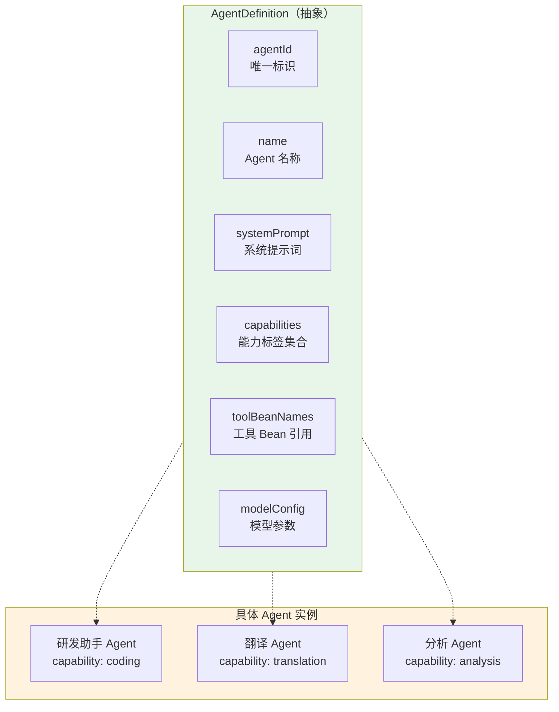
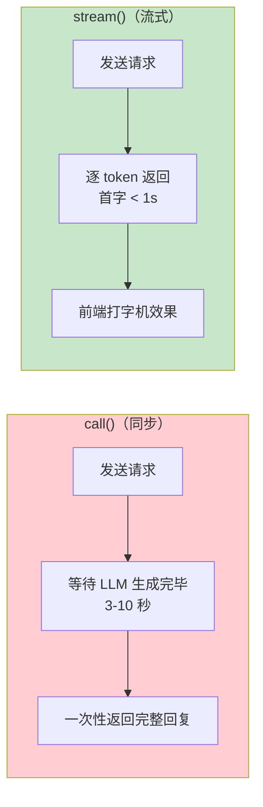
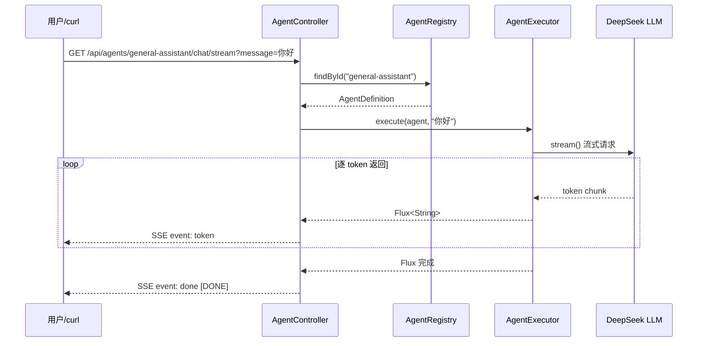
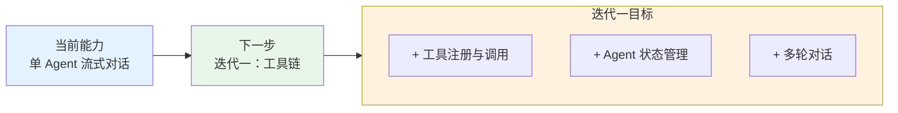

# 01-最小 Demo 搭建

> **定位**：从零创建 Spring Boot 4.1 + Spring AI 2.0 项目骨架，定义 Agent 抽象层，实现最简的单 Agent + WebFlux + SSE 流式对话接口。读完这篇，你能跑通"用户提问 → Agent 推理 → SSE 流式回复"的完整链路，这是后续多 Agent 编排的基座。本文给出**完整可手写代码**（一行不省略，含全部 import）。

> **读者画像**：刚读完需求分析，准备动手写代码的开发者。

> **前置阅读**：[00-需求分析与架构设计](00-需求分析与架构设计.md)。

> **关联教程**：[教程 00-Agent核心概念](../../教程/00-Agent核心概念.md)、[教程 07-ReAct推理模式](../../教程/07-ReAct推理模式.md)、[教程 19-SSE流式通信](../../教程/19-SSE流式通信.md)。

> **API 真实性**：所有 Spring AI 代码按 [附录 05-SpringAI2-API基准] 的真实签名书写，可照抄编译。

---

## 1. 四问

| 问 | 答 |
|----|----|
| **新增了什么需求** | 一个最小可运行的 Agent 骨架：能流式对话，暴露可扩展的 Agent 抽象与注册中心 |
| **影响了哪些模块** | 全部（这是地基，无历史包袱） |
| **架构如何演进** | 单体单模块：Controller → AgentRegistry 发现 → AgentExecutor 构建 ChatClient → DeepSeek 流式 |
| **上一版痛点是什么** | 无（v0 是起点，痛点是**将要暴露的**：无工具、无状态、无编排） |

### 1.1 本节核对（四问）

一句话核对：四问第四行明确"v0 是起点，痛点是将要暴露的"，与 §10 局限表逐条对应，无历史包袱虚构。

## 2. 目标与量化验收

| # | 目标 | 验收 |
|---|------|------|
| 1 | Agent 抽象 | `AgentDefinition` record 定义 ID/名称/能力/模型配置，配置驱动注册 |
| 2 | 注册中心 | 启动时从 YAML 自动注册 Agent，`/api/agents` 可列出 |
| 3 | 流式对话 | `GET /api/agents/{id}/chat/stream?message=你好` 返回 token 级 SSE |
| 4 | 错误语义 | Agent 不存在时返回 `AGENT_NOT_FOUND`（非空流） |

**本迭代明确不做**：工具调用、会话状态、多 Agent、编排、路由、审批。

### 2.1 本节核对（验收标准可测性）

| # | 核对项 | PASS 判据 |
|---|--------|----------|
| 1 | 四条验收 | 每条都可在本篇后续小节验证：#1→§5、#2→§6.4、#3→§9.2、#4→§8.4 |
| 2 | "本迭代明确不做"清单 | 与 §10 局限表一一对应，无偷跑（本篇代码确实无工具/状态/编排） |

---

## 3. 项目初始化

### 3.1 Maven 依赖（完整 `pom.xml`）

```xml
<?xml version="1.0" encoding="UTF-8"?>
<project xmlns="http://maven.apache.org/POM/4.0.0"
         xmlns:xsi="http://www.w3.org/2001/XMLSchema-instance"
         xsi:schemaLocation="http://maven.apache.org/POM/4.0.0 https://maven.apache.org/xsd/maven-4.0.0.xsd">
    <modelVersion>4.0.0</modelVersion>
    <parent>
        <groupId>org.springframework.boot</groupId>
        <artifactId>spring-boot-starter-parent</artifactId>
        <version>4.1.0</version>
        <relativePath/>
    </parent>

    <groupId>com.example</groupId>
    <artifactId>multi-agent-platform</artifactId>
    <version>0.1.0</version>
    <name>multi-agent-platform</name>

    <properties>
        <java.version>21</java.version>
        <spring-ai.version>2.0.0</spring-ai.version>
    </properties>

    <dependencyManagement>
        <dependencies>
            <dependency>
                <groupId>org.springframework.ai</groupId>
                <artifactId>spring-ai-bom</artifactId>
                <version>${spring-ai.version}</version>
                <type>pom</type>
                <scope>import</scope>
            </dependency>
        </dependencies>
    </dependencyManagement>

    <dependencies>
        <!-- WebFlux：响应式 Web + SSE -->
        <dependency>
            <groupId>org.springframework.boot</groupId>
            <artifactId>spring-boot-starter-webflux</artifactId>
        </dependency>

        <!-- Spring AI OpenAI Starter：通过 base-url 兼容 DeepSeek -->
        <dependency>
            <groupId>org.springframework.ai</groupId>
            <artifactId>spring-ai-starter-model-openai</artifactId>
        </dependency>

        <!-- 响应式 Redis：迭代一用于会话状态 -->
        <dependency>
            <groupId>org.springframework.boot</groupId>
            <artifactId>spring-boot-starter-data-redis-reactive</artifactId>
        </dependency>

        <!-- 可观测性 -->
        <dependency>
            <groupId>org.springframework.boot</groupId>
            <artifactId>spring-boot-starter-actuator</artifactId>
        </dependency>

        <dependency>
            <groupId>org.projectlombok</groupId>
            <artifactId>lombok</artifactId>
            <optional>true</optional>
        </dependency>

        <dependency>
            <groupId>org.springframework.boot</groupId>
            <artifactId>spring-boot-starter-test</artifactId>
            <scope>test</scope>
        </dependency>
    </dependencies>
</project>
```

依赖说明：

| 依赖 | 作用 | 为什么需要 |
|------|------|-----------|
| webflux | 响应式 Web + SSE | 多 Agent 并行的基石 |
| spring-ai-starter-model-openai | ChatClient 自动配置 | 通过 `base-url` 指向 DeepSeek（OpenAI 兼容协议） |
| data-redis-reactive | 响应式 Redis | 后续状态管理、Agent 注册 |
| actuator | 健康检查 + 指标 | 可观测性 |

> 说明：本项目不用 `spring-ai-starter-model-deepseek`，而是用 `spring-ai-starter-model-openai` + `base-url: https://api.deepseek.com`（DeepSeek 兼容 OpenAI 协议，也是全体系的统一坐标，见 [教程 02 §2]）。模型参数用 `OpenAiChatOptions`（真实类，非虚构的 `DeepSeekChatOptions`）。

### 3.2 配置文件（完整 `application.yml`）

```yaml
spring:
  application:
    name: multi-agent-platform
  ai:
    openai:
      base-url: https://api.deepseek.com   # DeepSeek 兼容 OpenAI 协议
      api-key: ${DEEPSEEK_API_KEY}          # 环境变量，不落明文
      chat:
        model: deepseek-chat          # Spring AI 2.0.0：无 options 中缀，参数直挂
        temperature: 0.7
        max-tokens: 2048
  data:
    redis:
      host: localhost
      port: 6379

server:
  port: 8080

management:
  endpoints:
    web:
      exposure:
        include: health,info,metrics

agent:
  definitions:
    - agent-id: general-assistant
      name: 通用助手
      description: 能处理日常问答、信息整理、文案撰写的通用 Agent
      system-prompt: |
        你是一个通用任务助手。你的职责是理解用户需求并给出高质量回答。
        回答要准确、简洁、有条理。如果信息不足，主动追问。
      capabilities:
        - general
        - qa
        - writing
      tool-bean-names: []            # 迭代一填充工具 Bean
      model-config:
        model: deepseek-chat
        temperature: 0.7
        max-tokens: 2048
```

注意 `temperature: 0.7`——Agent 的推理任务需要一定创造力，但不能太发散。后续不同 Agent 可以有不同 temperature：创意写作 Agent 用 0.9，数据分析 Agent 用 0.2。

### 3.3 本节测试与验证（依赖与配置）

**前置条件**：JDK 21、Maven、`DEEPSEEK_API_KEY` 环境变量可用。

**材料——构建与配置核对命令**：

```bash
export DEEPSEEK_API_KEY=your-api-key
mvn clean compile
mvn dependency:tree | grep -E "spring-ai-starter-model-openai|spring-boot-starter-webflux|data-redis-reactive"
```

**步骤与断言**：

| # | 操作 | 预期（PASS 判据） |
|---|------|------------------|
| 1 | 材料 compile | BUILD SUCCESS（pom 完整、无缺依赖） |
| 2 | 材料 dependency:tree | 命中三个 starter（openai/webflux/redis-reactive）；**无** `spring-ai-starter-model-deepseek`、**无** `spring-boot-starter-web`（MVC） |
| 3 | 核对 `application.yml` | `api-key: ${DEEPSEEK_API_KEY}` 占位符未落明文；模型参数直挂 `spring.ai.openai.chat.*`（2.0 无 `options` 中缀） |
| 4 | 启动后 `curl http://localhost:8080/actuator/health` | `{"status":"UP"}` |

**失败排查**：依赖树出现 deepseek starter→照抄了错误坐标，回 §3.1 说明改 openai+base-url；配置不生效→`options.` 中缀残留（2.0 已去掉）。

---

## 4. 主类与启动配置

### 4.1 `OrchestratorApplication.java`

```java
package com.example.orchestrator;

import org.springframework.boot.SpringApplication;
import org.springframework.boot.autoconfigure.SpringBootApplication;

@SpringBootApplication
public class OrchestratorApplication {

    public static void main(String[] args) {
        SpringApplication.run(OrchestratorApplication.class, args);
    }
}
```

### 4.2 本节核对（启动类）

一句话核对：仅 `@SpringBootApplication` + `main`，无任何手工 `@Bean`/组件扫描定制——地基保持零魔法。

---

## 5. Agent 抽象层设计

### 5.1 为什么需要 Agent 抽象

最小 Demo 阶段只有一个 Agent，但抽象定义了后续所有迭代的核心契约：



### 5.2 `model/AgentDefinition.java`

```java
package com.example.orchestrator.model;

import java.util.List;
import java.util.Set;

/**
 * Agent 不可变契约。record 保证注册后不可修改——修改等于注销再注册。
 */
public record AgentDefinition(
        String agentId,              // 唯一标识，如 "coder-agent-01"
        String name,                 // 显示名称，如 "研发助手"
        String description,          // 能力描述（迭代三用于路由语义匹配）
        String systemPrompt,         // 系统提示词
        Set<String> capabilities,    // 能力标签：["coding", "review", "test"]
        List<String> toolBeanNames,  // 工具 Bean 名称列表（迭代一填充）
        ModelConfig modelConfig      // 模型参数覆盖（可为 null，走全局默认）
) {}
```

### 5.3 `model/ModelConfig.java`

```java
package com.example.orchestrator.model;

public record ModelConfig(
        String model,                // 模型名，如 deepseek-chat
        Double temperature,          // 温度
        Integer maxTokens            // 最大 Token
) {}
```

### 5.4 `config/AgentProperties.java`（绑定 `agent.definitions`）

```java
package com.example.orchestrator.config;

import com.example.orchestrator.model.AgentDefinition;
import org.springframework.boot.context.properties.ConfigurationProperties;

import java.util.List;

@ConfigurationProperties(prefix = "agent")
public record AgentProperties(
        List<AgentDefinition> definitions
) {}
```

---

## 6. Agent 注册中心

### 6.1 `agent/AgentRegistry.java`（接口）

```java
package com.example.orchestrator.agent;

import com.example.orchestrator.model.AgentDefinition;
import reactor.core.publisher.Flux;
import reactor.core.publisher.Mono;

/**
 * 注册中心是多 Agent 平台的心脏——迭代二的 Agent 发现、迭代三的路由匹配，全依赖它。
 * 返回类型全用 Mono / Flux：底层迭代二切换到 Redis 时，上层无需改动。
 */
public interface AgentRegistry {

    Mono<Void> register(AgentDefinition agent);

    Mono<Void> unregister(String agentId);

    Mono<AgentDefinition> findById(String agentId);

    Flux<AgentDefinition> findByCapability(String capability);

    Flux<AgentDefinition> findAll();
}
```

### 6.2 `agent/InMemoryAgentRegistry.java`（内存实现）

```java
package com.example.orchestrator.agent;

import com.example.orchestrator.model.AgentDefinition;
import org.springframework.stereotype.Repository;
import reactor.core.publisher.Flux;
import reactor.core.publisher.Mono;

import java.util.Map;
import java.util.concurrent.ConcurrentHashMap;

@Repository
public class InMemoryAgentRegistry implements AgentRegistry {

    private final Map<String, AgentDefinition> store = new ConcurrentHashMap<>();

    @Override
    public Mono<Void> register(AgentDefinition agent) {
        return Mono.fromRunnable(() -> store.put(agent.agentId(), agent));
    }

    @Override
    public Mono<Void> unregister(String agentId) {
        return Mono.fromRunnable(() -> store.remove(agentId));
    }

    @Override
    public Mono<AgentDefinition> findById(String agentId) {
        return Mono.justOrEmpty(store.get(agentId));
    }

    @Override
    public Flux<AgentDefinition> findByCapability(String capability) {
        return Flux.fromIterable(store.values())
                .filter(agent -> agent.capabilities().contains(capability));
    }

    @Override
    public Flux<AgentDefinition> findAll() {
        return Flux.fromIterable(store.values());
    }
}
```

### 6.3 `config/AgentAutoRegistration.java`（启动时自动注册）

```java
package com.example.orchestrator.config;

import com.example.orchestrator.agent.AgentRegistry;
import org.springframework.boot.ApplicationRunner;
import org.springframework.boot.context.properties.EnableConfigurationProperties;
import org.springframework.context.annotation.Bean;
import org.springframework.context.annotation.Configuration;
import reactor.core.publisher.Flux;

@Configuration
@EnableConfigurationProperties(AgentProperties.class)
public class AgentAutoRegistration {

    @Bean
    ApplicationRunner registerAgents(AgentRegistry registry, AgentProperties properties) {
        // 启动时把 application.yml 配置的 Agent 注册到注册中心。
        // blockLast() 只发生在启动主线程，非 EventLoop，符合 WebFlux 铁律。
        return args -> Flux.fromIterable(properties.definitions())
                .flatMap(registry::register)
                .blockLast();
    }
}
```

### 6.4 本节测试与验证（注册与发现）

**前置条件**：应用已启动（`AgentAutoRegistration` 已执行）。

**材料——发现核对 curl**：

```bash
curl http://localhost:8080/api/agents
curl http://localhost:8080/api/agents/general-assistant
```

**步骤与断言**：

| # | 操作 | 预期（PASS 判据） |
|---|------|------------------|
| 1 | 材料① | JSON 数组含 1 个 Agent，`agentId=general-assistant`、`capabilities` 含 `general/qa/writing` |
| 2 | 材料② | 单对象返回，`systemPrompt` 与 yml 中文案一致（注册内容未失真） |
| 3 | 重复重启应用 | 列表仍是 1 个（`ConcurrentHashMap.put` 按 agentId 覆盖，重启天然幂等） |

**失败排查**：列表为空→`AgentAutoRegistration` 未生效（检查 `@EnableConfigurationProperties`）；404/字段 null→yml 绑定问题回 §5.5 排查。

### 5.5 本节测试与验证（Agent 抽象与配置绑定）

**前置条件**：§3.3 已通过；`AgentDefinition`/`ModelConfig`/`AgentProperties` 已手写。

**步骤与断言**：

| # | 操作 | 预期（PASS 判据） |
|---|------|------------------|
| 1 | `mvn clean compile` | 三个 record 编译通过（不可变契约无 setter，编译器兜底） |
| 2 | 启动应用后 `curl http://localhost:8080/actuator/env`（定位 `agent.definitions`） | yml 中 `general-assistant` 的 kebab-case 键（`agent-id`/`system-prompt`/`tool-bean-names`）被正确绑定到 record 组件 |
| 3 | 故意把 `model-config.max-tokens` 写成非数字重启 | 绑定失败报错信息指向该属性（证明绑定真实发生，而非静默忽略） |

**失败排查**：绑定不生效→`AgentAutoRegistration` 缺 `@EnableConfigurationProperties(AgentProperties.class)`（§6.3）；字段恒为 null→yml 键名与 record 组件名 kebab 映射不一致。

---

## 7. Agent 执行器

### 7.1 `agent/AgentExecutor.java`

```java
package com.example.orchestrator.agent;

import com.example.orchestrator.model.AgentDefinition;
import org.springframework.ai.chat.client.ChatClient;
import org.springframework.ai.openai.OpenAiChatOptions;
import org.springframework.stereotype.Service;
import reactor.core.publisher.Flux;

@Service
public class AgentExecutor {

    private final ChatClient.Builder chatClientBuilder;

    public AgentExecutor(ChatClient.Builder chatClientBuilder) {
        this.chatClientBuilder = chatClientBuilder;
    }

    /**
     * 执行 Agent，返回流式响应。
     * 每次调用 buildClient() 重建 ChatClient——每个 Agent 有独立的 systemPrompt 与模型参数，不能用单例。
     */
    public Flux<String> execute(AgentDefinition agent, String userMessage) {
        return buildClient(agent)
                .prompt()
                .system(agent.systemPrompt())
                .user(userMessage)
                .stream()
                .content();          // Flux<String>，逐 token 返回
    }

    private ChatClient buildClient(AgentDefinition agent) {
        var builder = chatClientBuilder.defaultSystem(agent.systemPrompt());
        if (agent.modelConfig() != null) {
            var config = agent.modelConfig();
            builder = builder.defaultOptions(OpenAiChatOptions.builder()   // Spring AI 2.0.0：defaultOptions 收 Builder
                    .model(config.model())
                    .temperature(config.temperature())
                    .maxTokens(config.maxTokens()));
        }
        return builder.build();
    }
}
```

关键设计决策：

| 决策 | 理由 |
|------|------|
| 每次调用 `buildClient` | 每个 Agent 有不同的 systemPrompt 和模型参数，不能用单例 |
| 返回 `Flux<String>` | 流式输出是刚需，SSE 推送到前端 |
| 模型参数用 `OpenAiChatOptions` | 真实 API（[教程 02 §2.2]），随 starter 自动配置 |
| 不在此层加工具 | 工具在迭代一加入，保持最小 Demo 极简 |

### 7.2 为什么用 `stream()` 而非 `call()`



对于 Agent 平台来说，流式不只是用户体验——在多 Agent 编排场景中，编排引擎可以基于流式输出做**早期决策**（例如检测到 Agent 输出错误信号时提前中止）。

### 7.3 本节测试与验证（执行器与模型参数）

**前置条件**：§6.4 已通过；DeepSeek API 可达。

**材料**（复用 §9.2 的流式 curl）：

```bash
curl -N "http://localhost:8080/api/agents/general-assistant/chat/stream?message=你好，介绍一下你自己"
```

**步骤与断言**：

| # | 操作 | 预期（PASS 判据） |
|---|------|------------------|
| 1 | 材料 | SSE `event:token` 逐条到达（非一次性整段），末尾 `event:done`——证明走的是 `stream().content()` 而非 `call()` |
| 2 | 回复内容抽检 | 自我描述与 `systemPrompt`（"通用任务助手…准确、简洁"）一致，证明 `defaultSystem` 生效 |
| 3 | 临时把 `model-config.temperature` 改为 0.1 重启再问同一问题 | 两次回复措辞差异明显收敛，证明 `OpenAiChatOptions` 参数真的下发（非全局默认 0.7） |
| 4 | `model-config` 置 null（删除该段）重启 | 仍能对话——走全局默认参数，`null` 分支不抛 NPE |

**失败排查**：参数不生效→`defaultOptions(...)` 接的是 Builder 而非实例（2.0 签名，见代码注释）；整段返回→误用 `call()`；NPE→`modelConfig()` 判空缺失。

---

## 8. Agent 对话接口

### 8.1 `model/AgentNotFoundException.java`

```java
package com.example.orchestrator.model;

public class AgentNotFoundException extends RuntimeException {

    public AgentNotFoundException(String agentId) {
        super("Agent not found: " + agentId);
    }
}
```

### 8.2 `web/AgentController.java`

```java
package com.example.orchestrator.web;

import com.example.orchestrator.agent.AgentExecutor;
import com.example.orchestrator.agent.AgentRegistry;
import com.example.orchestrator.model.AgentDefinition;
import com.example.orchestrator.model.AgentNotFoundException;
import org.springframework.http.MediaType;
import org.springframework.http.codec.ServerSentEvent;
import org.springframework.web.bind.annotation.GetMapping;
import org.springframework.web.bind.annotation.PathVariable;
import org.springframework.web.bind.annotation.RequestMapping;
import org.springframework.web.bind.annotation.RequestParam;
import org.springframework.web.bind.annotation.RestController;
import reactor.core.publisher.Flux;
import reactor.core.publisher.Mono;

@RestController
@RequestMapping("/api/agents")
public class AgentController {

    private final AgentRegistry registry;
    private final AgentExecutor executor;

    public AgentController(AgentRegistry registry, AgentExecutor executor) {
        this.registry = registry;
        this.executor = executor;
    }

    /**
     * 流式对话（SSE）。
     */
    @GetMapping(value = "/{agentId}/chat/stream",
                produces = MediaType.TEXT_EVENT_STREAM_VALUE)
    public Flux<ServerSentEvent<String>> chatStream(
            @PathVariable String agentId,
            @RequestParam String message
    ) {
        return registry.findById(agentId)
                .switchIfEmpty(Mono.error(new AgentNotFoundException(agentId)))
                .flatMapMany(agent -> executor.execute(agent, message))
                .map(token -> ServerSentEvent.<String>builder()
                        .event("token")
                        .data(token)
                        .build())
                .concatWith(Mono.just(ServerSentEvent.<String>builder()
                        .event("done")
                        .data("[DONE]")
                        .build()))
                .onErrorResume(ex -> Flux.just(ServerSentEvent.<String>builder()
                        .event("error")
                        .data(ex.getMessage())
                        .build()));
    }

    /**
     * 列出所有已注册 Agent。
     */
    @GetMapping
    public Flux<AgentDefinition> listAgents() {
        return registry.findAll();
    }
}
```

关键设计：

1. **Agent 不存在时返回明确错误**——`switchIfEmpty` 抛出 `AgentNotFoundException`，而非返回空流
2. **错误也走 SSE 事件**——`onErrorResume` 将异常转为 `error` 事件，前端统一处理
3. **`concatWith` 保证 done 事件**——无论成功还是失败，最后一个事件都是 `done`

> 「遇到阻塞？→ [教程 19-SSE流式通信](../../教程/19-SSE流式通信.md)」

### 8.3 `web/GlobalExceptionHandler.java`

```java
package com.example.orchestrator.web;

import com.example.orchestrator.model.AgentNotFoundException;
import org.springframework.http.ResponseEntity;
import org.springframework.web.bind.annotation.ExceptionHandler;
import org.springframework.web.bind.annotation.RestControllerAdvice;

@RestControllerAdvice
public class GlobalExceptionHandler {

    @ExceptionHandler(AgentNotFoundException.class)
    public ResponseEntity<ErrorResponse> handleAgentNotFound(AgentNotFoundException ex) {
        return ResponseEntity.status(404)
                .body(new ErrorResponse("AGENT_NOT_FOUND", ex.getMessage()));
    }

    public record ErrorResponse(String code, String message) {}
}
```

### 8.4 本节测试与验证（SSE 错误语义）

**前置条件**：正常对话链路（§7.3）已通过。

**材料——错误探针 curl**：

```bash
curl -i -N "http://localhost:8080/api/agents/no-such-agent/chat/stream?message=hi"
```

**步骤与断言**：

| # | 操作 | 预期（PASS 判据） |
|---|------|------------------|
| 1 | 材料① | 收到 SSE 事件流（而非空流挂起）：`event:error`，data 含 `Agent not found: no-such-agent` |
| 2 | 事件顺序 | `error` 之后仍有 `event:done`（`concatWith` 保证 done 恒为最后一个事件） |
| 3 | `curl -i` 响应头 | `Content-Type: text/event-stream`；异常路径未走 `GlobalExceptionHandler`（SSE 已提交响应，404 JSON 只对非流式接口生效——这是 §8.3 的适用边界） |

**失败排查**：连接空挂→`switchIfEmpty(Mono.error(...))` 缺失，空流直接 complete；无 done→`concatWith` 放在了 `onErrorResume` 之前（顺序错）。

---

## 9. SSE 流式输出验证

### 9.1 启动项目

```bash
export DEEPSEEK_API_KEY=your-api-key
mvn spring-boot:run
```

### 9.2 测试 Agent 对话

```bash
# 查看已注册的 Agent
curl http://localhost:8080/api/agents

# 流式对话（终端查看 SSE 流）
curl -N "http://localhost:8080/api/agents/general-assistant/chat/stream?message=你好，介绍一下你自己"
```

输出示例（SSE 格式）：

```
event:token
data:你好

event:token
data:！我是

event:token
data:通用任务助手

event:token
data:，很高兴为你服务。

event:done
data:[DONE]
```

### 9.3 SSE 事件流转



### 9.4 本节核对（既有验证节定位）

说明：本篇 §9 本身就是"流式输出验证"节（含 §9.2 curl 与 §9.3 事件时序图），与 §7.3/§8.4 的断言互补——无需再插入重复小节；跑完 §7.3/§8.4 后本节材料自然全部覆盖。

---

## 10. 最小 Demo 的局限与下一步

跑通这个 Demo 后，你能体验到一个流式对话的 Agent。但它有明显局限：

| 局限 | 说明 | 哪个迭代解决 |
|------|------|-------------|
| Agent 没有工具 | 只能对话，不能执行操作 | 迭代一：工具链 |
| 没有状态管理 | 每次请求都是独立的，无多轮记忆 | 迭代一：状态管理 |
| 只有一个 Agent | 注册中心只有一个 Agent | 迭代二：多 Agent |
| 没有编排能力 | 无法拆解复杂任务 | 迭代二：DAG 引擎 |
| 没有路由 | 调用哪个 Agent 全靠 URL 指定 | 迭代三：智能路由 |



### 10.1 本节核对（局限清单）

| # | 核对项 | PASS 判据 |
|---|--------|----------|
| 1 | 五条局限 | 每条都标注了"哪个迭代解决"，且与 02/03/04 篇的实际新增能力一致 |
| 2 | 本篇代码确实未偷跑 | 全篇无 `@Tool`、无 ChatMemory、无编排类——与"本迭代明确不做"清单一致 |

---

## 11. 关键代码回顾

| 文件 | 职责 |
|------|------|
| `OrchestratorApplication.java` | Spring Boot 启动类 |
| `config/AgentProperties.java` | 绑定 `agent.definitions` 配置 |
| `model/AgentDefinition.java` | Agent 抽象模型（record） |
| `agent/AgentRegistry.java` | 注册中心接口 |
| `agent/InMemoryAgentRegistry.java` | 内存实现 |
| `config/AgentAutoRegistration.java` | 启动时自动注册 |
| `agent/AgentExecutor.java` | Agent 执行引擎 |
| `web/AgentController.java` | REST + SSE 接口 |
| `web/GlobalExceptionHandler.java` | 统一异常处理 |

每个文件都有明确的单一职责——没有冗余，没有框架臃肿。

---

## 12. ADR 演进决策

### ADR 002-03：v0 立 Agent 抽象 + 注册中心接口，底层实现可替换
- **决策**：`AgentDefinition` 用 record（不可变）；`AgentRegistry` 用接口 + 内存实现，返回类型全 `Mono/Flux`
- **取舍理由**：接口名先立、实现后换——迭代二把内存实现换成 Redis 实现时上层零改动；record 不可变保证注册后不被篡改

### ADR 002-04：LLM 统一走 OpenAI 协议 + DeepSeek base-url
- **决策**：不用 `spring-ai-starter-model-deepseek`，用 `spring-ai-starter-model-openai` + `base-url: https://api.deepseek.com`，模型参数用 `OpenAiChatOptions`
- **取舍理由**：DeepSeek 兼容 OpenAI 协议，一套坐标适配多个兼容模型（换模型只改 base-url），也是全体系统一坐标

### 12.1 本节核对（ADR 规范性）

| # | 核对项 | PASS 判据 |
|---|--------|----------|
| 1 | ADR 002-03/002-04 | 均含决策 + 取舍理由，且与 §6（接口先行）/§3.1（OpenAI 坐标）正文一致 |
| 2 | 编号衔接 | 承接 00 篇的 002-02，无跳号冲突 |

### 12.1 本节核对（ADR 规范性）

| # | 核对项 | PASS 判据 |
|---|--------|----------|
| 1 | ADR 002-03/002-04 | 均含决策 + 取舍理由，且与 §6（接口先行）/§3.1（OpenAI 坐标）正文一致 |
| 2 | 编号衔接 | 承接 00 篇的 002-02，无跳号冲突 |

---

## 13. 总结

本篇完成了多 Agent 编排平台的最小骨架：

1. **Agent 抽象层**——`AgentDefinition` record 定义了 Agent 的统一契约（ID、提示词、能力、工具、模型配置），为后续多 Agent 扩展铺好路
2. **Agent 注册中心**——`AgentRegistry` 接口 + 内存实现，注册、查找、按能力检索的能力已具备，后续切换 Redis 零摩擦
3. **Agent 执行器**——`AgentExecutor` 封装 ChatClient 构建 + 流式调用，每个 Agent 有独立的系统提示词和模型参数
4. **SSE 流式接口**——`Flux<ServerSentEvent>` 实现 token 级别的流式推送，错误也走 SSE 事件
5. **自动注册**——启动时从 YAML 加载 Agent 定义，开箱即用

下一篇 [02-单Agent工具链](02-单Agent工具链.md) 将为 Agent 加入工具注册、调用和状态管理，让它从"只会说"升级为"能做事"。

---

## 14. 全篇回归验证

**前置**：§3.3 / §5.5 / §6.4 / §7.3 / §8.4 均已通过。

| # | 操作 | 预期（PASS 判据） |
|---|------|------------------|
| 1 | `mvn clean spring-boot:run` 冷启动后依次执行：`/actuator/health` → `/api/agents` → 流式对话 → 错误 agentId 探针 | 四步全部 PASS（健康、注册、token 流 + done、error 事件），链路无断点 |
| 2 | `Ctrl+C` 后立即重启，重跑第 1 步 | 结果一致（内存注册中心重启即重建，行为可复现） |

**失败排查**：重启后偶发失败→`blockLast()` 启动注册与请求时序竞争，确认启动日志中注册完成早于第一条请求。
