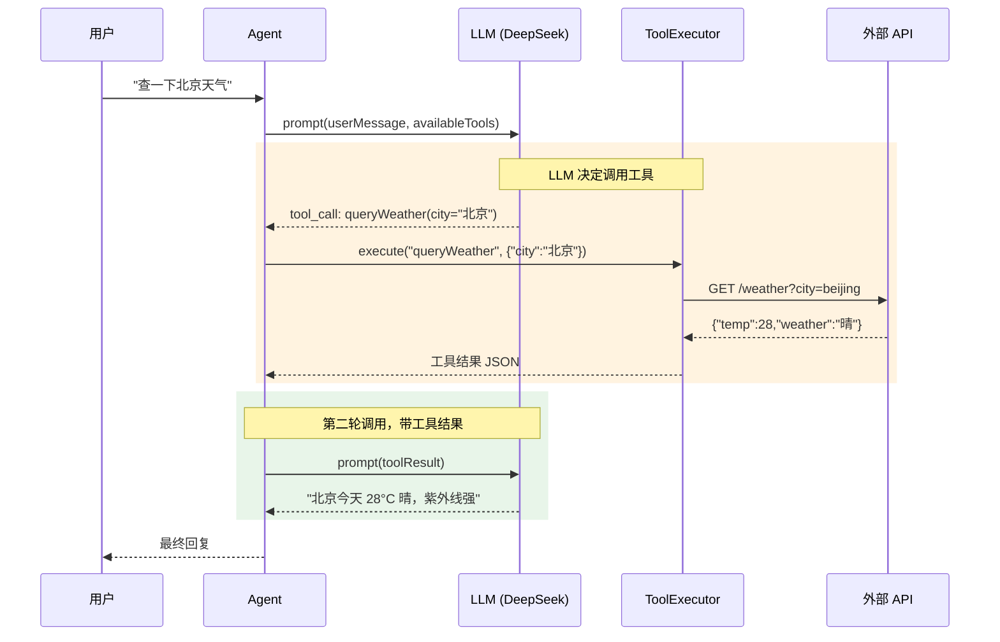
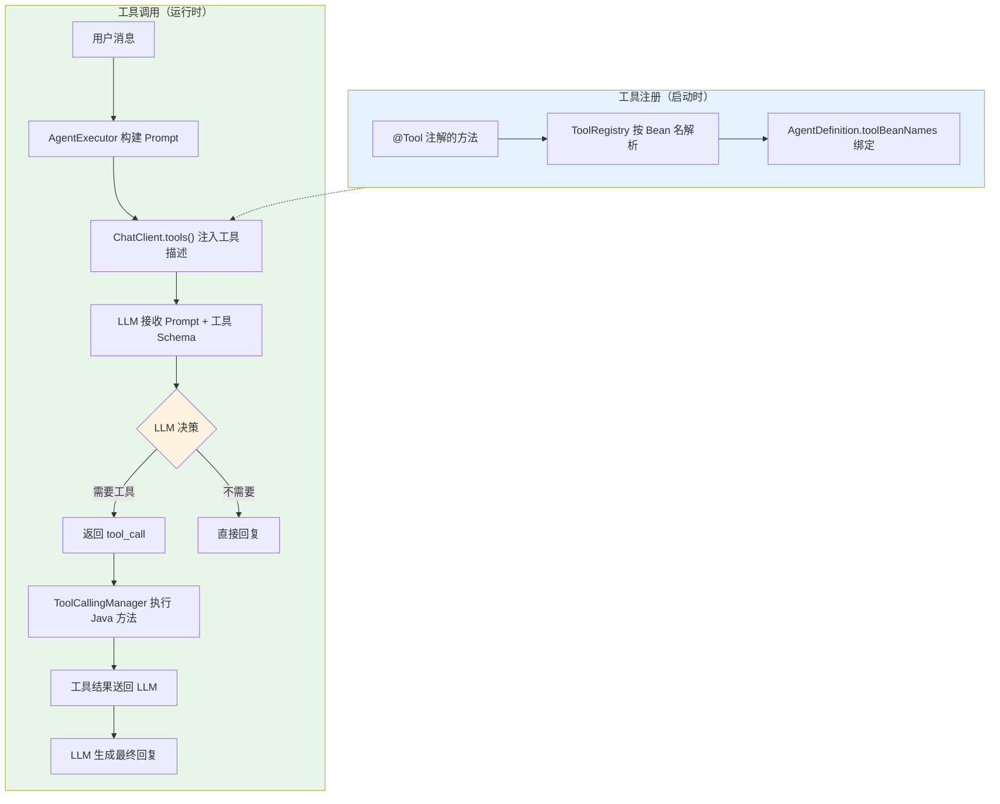
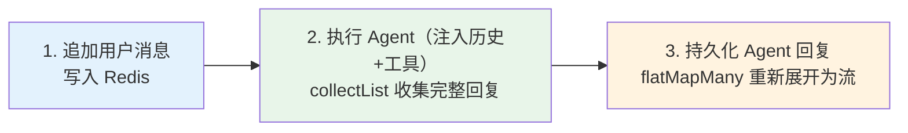
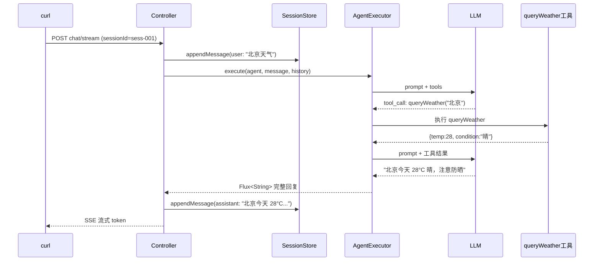
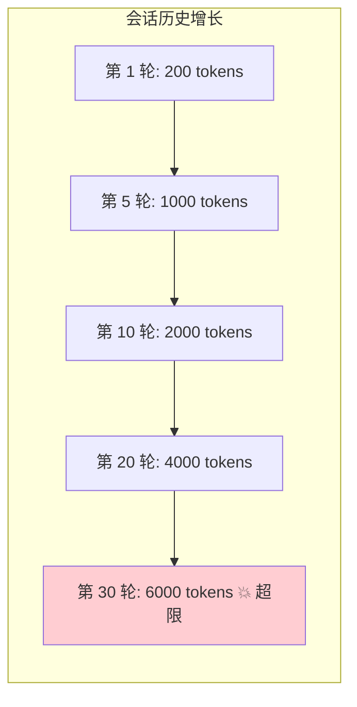
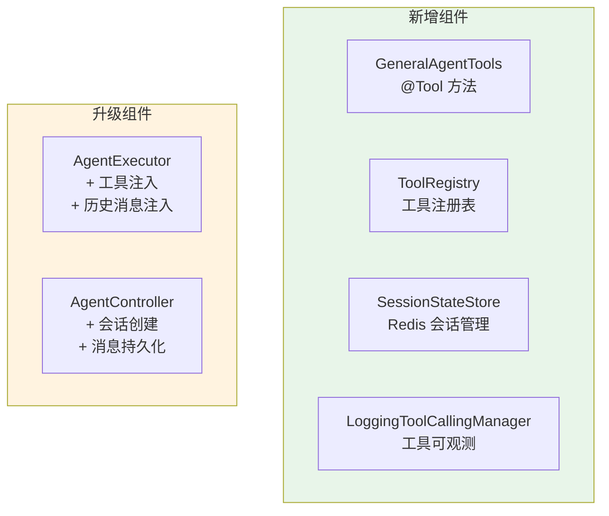

# 02-单 Agent 工具链

> **定位**：为通用 Agent 加入工具注册与调用机制，同时实现 Agent 状态管理——让 Agent 从"只会说"升级为"能做事"，并能在多轮对话中保持上下文。涵盖 `@Tool` 注解定义、工具注册策略、状态持久化、工具调用全流程、工具可观测（正确落点是 `ToolCallingManager` 装饰器，非 AOP）。本文给出**完整可手写代码**（一行不省略）。

> **读者画像**：已跑通最小 Demo，准备让 Agent 具备业务操作能力。

> **前置阅读**：[01-最小Demo搭建](01-最小Demo搭建.md)。

> **关联教程**：[教程 03-工具调用](../../教程/03-工具调用.md)、[教程 12-Agent状态管理](../../教程/12-Agent状态管理.md)。

> **API 真实性**：`@Tool`/`@ToolParam`（无 `@ToolMethod`）；工具拦截用 `ToolCallingManager` 装饰器（附录 05-02 §1.3，AOP 拦 `@Tool` 反射调用无效）。

---

## 1. 四问

| 问 | 答 |
|----|----|
| **新增了什么需求** | Agent 能调工具（查时间/查天气/搜知识库）；多轮对话记住上下文 |
| **影响了哪些模块** | 新增 `GeneralAgentTools`、`ToolRegistry`、`SessionStateStore`；升级 `AgentExecutor`、`AgentController`、`AgentDefinition` |
| **架构如何演进** | 从「纯对话」演进为「工具注入 + Redis 会话」：Controller → 会话读写 → Executor 注入历史+工具 → ChatClient 流式 |
| **上一版痛点是什么** | ① Agent 无工具，只能靠 LLM 内置知识 ② 无状态，多轮对话断片 |

### 1.1 本节核对（四问）

一句话核对：四问"上一版痛点"两条与 01 篇 §10 局限表前两条一一对应，无虚构痛点。

## 2. 目标与量化验收

| # | 目标 | 验收 |
|---|------|------|
| 1 | 工具触发 | 问"北京天气"时模型正确调用 `queryWeather` 并返回数据 |
| 2 | 多轮上下文 | 第二轮问"那上海呢？"能理解是在问天气 |
| 3 | 会话持久化 | 会话存 Redis，TTL 24h，重启不丢（重启后同 sessionId 可续聊） |
| 4 | 工具可观测 | 每次工具调用产生日志 + Micrometer 指标（经 `ToolCallingManager` 装饰器） |
| 5 | WebFlux 一致 | 全链路无 ThreadLocal、无 EventLoop 阻塞；Redis 用 `ReactiveRedisTemplate` |

**本迭代明确不做**：多 Agent 编排、DAG、路由、审批。

### 2.1 本节核对（验收可测性）

| # | 核对项 | PASS 判据 |
|---|--------|----------|
| 1 | 五条验收 | 每条都有本篇落点：#1→§4.4、#2→§6.3、#3→§7.3、#4→§10.5、#5→代码走查（全篇无 ThreadLocal/block） |
| 2 | "明确不做"清单 | 本篇代码无编排/DAG/路由/审批内容，与清单一致 |

---

## 3. 工具调用机制回顾

在写代码前，先理清 Spring AI 2.0 的工具调用完整链路：



整个工具调用是**两轮 LLM 交互**：

1. **第一轮**：LLM 分析用户意图，决定是否需要调用工具，返回 `tool_call`
2. **工具执行**：Spring AI 框架自动拦截 `tool_call`，执行对应的 Java 方法（经 `ToolCallingManager`，这也是唯一稳定的拦截点）
3. **第二轮**：将工具结果喂给 LLM，LLM 基于结果生成自然语言回复

> 「遇到阻塞？→ [教程 03-工具调用](../../教程/03-工具调用.md)」

### 3.1 本节核对（机制理解）

一句话核对：能说清"两轮 LLM 交互 + 一段工具执行"的三段结构，且知道拦截点只有 `ToolCallingManager`——这是 §10 可观测实现的前提。

---

## 4. 工具定义

### 4.1 `agent/tools/GeneralAgentTools.java`（完整代码）

```java
package com.example.orchestrator.agent.tools;

import org.springframework.ai.tool.annotation.Tool;
import org.springframework.ai.tool.annotation.ToolParam;
import org.springframework.stereotype.Component;

import java.time.LocalDateTime;
import java.time.format.DateTimeFormatter;
import java.util.List;

/**
 * 通用助手的内置工具集。
 * 框架自动将 @Tool 方法签名转成 JSON Schema 注入提示词——无需任何注册代码。
 */
@Component
public class GeneralAgentTools {

    /**
     * 查询当前时间。
     */
    @Tool(description = "获取当前日期和时间，格式为 yyyy-MM-dd HH:mm:ss")
    public String getCurrentTime() {
        return LocalDateTime.now()
                .format(DateTimeFormatter.ofPattern("yyyy-MM-dd HH:mm:ss"));
    }

    /**
     * 查询天气。
     */
    @Tool(description = "查询指定城市的当前天气信息，包括温度、天气状况、湿度")
    public WeatherResult queryWeather(
            @ToolParam(description = "城市名称，如：北京、上海") String city) {
        // 模拟天气 API 调用——生产替换为真实 HTTP/WebClient 调用
        return mockWeatherApi(city);
    }

    /**
     * 搜索知识库。
     */
    @Tool(description = "在知识库中搜索相关文档，返回匹配的文档摘要列表")
    public List<KnowledgeItem> searchKnowledge(
            @ToolParam(description = "搜索关键词") String keyword,
            @ToolParam(description = "返回结果数量，默认5") Integer limit) {
        // 模拟向量检索——生产替换为 VectorStore.similaritySearch（SearchRequest.builder() 新式）
        return mockKnowledgeSearch(keyword, limit != null ? limit : 5);
    }

    // ---------- 以下为模拟数据源与返回模型 ----------

    private WeatherResult mockWeatherApi(String city) {
        return new WeatherResult(city, 28.0, "晴", 45, "紫外线强，注意防晒");
    }

    private List<KnowledgeItem> mockKnowledgeSearch(String keyword, int limit) {
        return List.of(new KnowledgeItem(
                keyword + " 相关文档",
                "这是与 " + keyword + " 相关的摘要内容",
                0.92));
    }

    public record WeatherResult(
            String city,
            double temperature,
            String condition,
            int humidity,
            String suggestion) {}

    public record KnowledgeItem(
            String title,
            String summary,
            double relevanceScore) {}
}
```

关键设计原则：

1. **`description` 写清楚**——LLM 靠它决定何时调用这个工具，描述不清会导致误调用
2. **`@ToolParam` 标注每个参数**——让 LLM 理解参数含义，正确传值
3. **返回结构化数据**——用 record 定义返回类型，LLM 更容易理解和转述
4. **工具方法保持简单**——一个工具做一件事，复杂逻辑拆成多个工具

### 4.2 `agent/ToolRegistry.java`（工具 Bean 注册表）

```java
package com.example.orchestrator.agent;

import org.springframework.context.ApplicationContext;
import org.springframework.stereotype.Component;

import java.util.List;
import java.util.Map;
import java.util.concurrent.ConcurrentHashMap;

/**
 * 将 AgentDefinition.toolBeanNames 中的 Bean 名称解析为实际工具实例。
 * 按需懒加载并缓存到本地 Map，避免每次执行都查 ApplicationContext。
 */
@Component
public class ToolRegistry {

    private final Map<String, Object> toolBeans = new ConcurrentHashMap<>();
    private final ApplicationContext applicationContext;

    public ToolRegistry(ApplicationContext applicationContext) {
        this.applicationContext = applicationContext;
    }

    public List<Object> resolveTools(List<String> beanNames) {
        if (beanNames == null || beanNames.isEmpty()) {
            return List.of();
        }
        return beanNames.stream()
                .map(name -> toolBeans.computeIfAbsent(name,
                        k -> applicationContext.getBean(k)))
                .toList();
    }
}
```

### 4.3 Agent 绑定工具（`application.yml`）

在最小 Demo 的 `agent.definitions` 基础上，为 `general-assistant` 加上 `tool-bean-names`：

```yaml
agent:
  definitions:
    - agent-id: general-assistant
      name: 通用助手
      description: 能处理日常问答、信息整理、文案撰写的通用 Agent
      system-prompt: |
        你是一个通用任务助手。你可以查询天气、搜索知识库。
        回答要准确、简洁。需要实时信息时主动使用工具。
      capabilities: [general, qa]
      tool-bean-names: [generalAgentTools]
      model-config:
        model: deepseek-chat
        temperature: 0.7
        max-tokens: 2048
```

### 4.4 本节测试与验证（工具定义与触发）

**前置条件**：§4.3 的 yml 已配置 `tool-bean-names: [generalAgentTools]`；应用可启动。

**材料——工具探针 curl**：

```bash
# 工具一：时间（无参数）
curl -N -X POST http://localhost:8080/api/agents/general-assistant/chat/stream \
  -H "Content-Type: application/json" \
  -d '{"sessionId":"tool-t1","message":"现在几点了？"}'
# 工具二：天气（单参数）
curl -N -X POST http://localhost:8080/api/agents/general-assistant/chat/stream \
  -H "Content-Type: application/json" \
  -d '{"sessionId":"tool-t2","message":"北京今天天气怎么样？"}'
# 工具三：知识库（双参数，含默认值）
curl -N -X POST http://localhost:8080/api/agents/general-assistant/chat/stream \
  -H "Content-Type: application/json" \
  -d '{"sessionId":"tool-t3","message":"帮我搜一下虚拟线程相关的文档"}'
```

**步骤与断言**：

| # | 操作 | 预期（PASS 判据） |
|---|------|------------------|
| 1 | 材料第一条 | 回复含 `yyyy-MM-dd HH:mm:ss` 格式时间（`getCurrentTime` 被调用，非模型编造） |
| 2 | 材料第二条 | 回复含 28 度/晴/防晒（mock 数据特征值，证明 `queryWeather("北京")` 真执行） |
| 3 | 材料第三条 | 回复含"虚拟线程 相关文档"字样（mock 拼接特征）；`limit` 未传时走默认 5（不抛 NPE） |
| 4 | 问一个无关问题（"写一首诗"） | 不触发任何工具（无 `[TOOL_CALL]` 日志，见 §10.2） |
| 5 | `mvn clean compile` | `@Tool`/`@ToolParam` 编译通过；全篇无 `@ToolMethod`、`@ToolParam` 无 `value=` 用法 |

**失败排查**：工具从不触发→`description` 太弱或 yml 未绑 `tool-bean-names`；触发但参数错→`@ToolParam` 描述不清；`NoSuchBeanDefinition`→Bean 名与 yml 不一致（默认 Bean 名为 `generalAgentTools`）。

---

## 5. Agent 状态管理

### 5.1 为什么需要状态管理

最小 Demo 每次请求都是无状态的——Agent 不记得上一次对话。但实际场景中：

```
用户：帮我查北京天气
Agent：北京今天 28°C 晴
用户：那上海呢？              ← "那"指什么？Agent 需要知道上下文是"天气"
Agent：上海今天 30°C 多云
```

多 Agent 平台中，状态管理更关键——Agent 间委派任务时需要传递上下文。

> 「遇到阻塞？→ [教程 12-Agent状态管理](../../教程/12-Agent状态管理.md)」

### 5.2 `model/SessionMessage.java` + `model/AgentSession.java`

```java
package com.example.orchestrator.model;

import java.time.LocalDateTime;

/**
 * 会话中的一条消息（自定义持久化模型，避免与 Spring AI 的 Message 类型耦合）。
 */
public record SessionMessage(
        String role,            // user / assistant
        String content,
        String toolCallId,      // 保留字段，工具消息后续扩展
        LocalDateTime timestamp) {}
```

```java
package com.example.orchestrator.model;

import java.time.LocalDateTime;
import java.util.List;
import java.util.Map;

/**
 * 一个 Agent 会话：会话 ID + 绑定的 Agent + 消息历史 + 自定义上下文。
 */
public record AgentSession(
        String sessionId,
        String agentId,
        List<SessionMessage> messages,
        Map<String, Object> context,
        LocalDateTime createdAt,
        LocalDateTime lastActiveAt) {}
```

### 5.3 `store/SessionStateStore.java`（Redis 状态存储）

```java
package com.example.orchestrator.store;

import com.example.orchestrator.model.AgentSession;
import com.example.orchestrator.model.SessionMessage;
import com.fasterxml.jackson.databind.ObjectMapper;
import org.springframework.data.redis.core.ReactiveRedisTemplate;
import org.springframework.stereotype.Repository;
import reactor.core.publisher.Mono;

import java.time.Duration;
import java.time.LocalDateTime;
import java.util.ArrayList;
import java.util.HashMap;
import java.util.List;

/**
 * Redis 会话状态存储。全响应式——绝不在 EventLoop 上 block。
 * Key: agent:session:{sessionId} → JSON(AgentSession)，TTL 24h。
 */
@Repository
public class SessionStateStore {

    private static final String KEY_PREFIX = "agent:session:";
    private static final Duration SESSION_TTL = Duration.ofHours(24);

    private final ReactiveRedisTemplate<String, String> redisTemplate;
    private final ObjectMapper objectMapper;

    public SessionStateStore(ReactiveRedisTemplate<String, String> redisTemplate,
                             ObjectMapper objectMapper) {
        this.redisTemplate = redisTemplate;
        this.objectMapper = objectMapper;
    }

    /**
     * 创建或恢复会话——调用方不需要关心是新建还是恢复。
     */
    public Mono<AgentSession> getOrCreate(String sessionId, String agentId) {
        String key = KEY_PREFIX + sessionId;
        return redisTemplate.opsForValue().get(key)
                .map(this::deserialize)
                .switchIfEmpty(Mono.defer(() -> Mono.just(
                        new AgentSession(sessionId, agentId,
                                new ArrayList<>(), new HashMap<>(),
                                LocalDateTime.now(), LocalDateTime.now()))));
    }

    /**
     * 保存会话（写回 Redis + 刷新 TTL）。
     */
    public Mono<Void> save(AgentSession session) {
        String key = KEY_PREFIX + session.sessionId();
        return redisTemplate.opsForValue()
                .set(key, serialize(session), SESSION_TTL)
                .then();
    }

    /**
     * 追加一条消息并保存。
     */
    public Mono<AgentSession> appendMessage(String sessionId, SessionMessage message) {
        return getOrCreate(sessionId, "")
                .flatMap(session -> {
                    List<SessionMessage> updated = new ArrayList<>(session.messages());
                    updated.add(message);
                    AgentSession next = new AgentSession(
                            session.sessionId(), session.agentId(), updated,
                            session.context(), session.createdAt(), LocalDateTime.now());
                    return save(next).thenReturn(next);
                });
    }

    private String serialize(AgentSession session) {
        try {
            return objectMapper.writeValueAsString(session);
        } catch (Exception e) {
            throw new IllegalStateException("会话序列化失败: " + session.sessionId(), e);
        }
    }

    private AgentSession deserialize(String json) {
        try {
            return objectMapper.readValue(json, AgentSession.class);
        } catch (Exception e) {
            throw new IllegalStateException("会话反序列化失败", e);
        }
    }
}
```

关键设计：

| 设计 | 理由 |
|------|------|
| TTL 24 小时 | 会话不宜永久保存，24 小时覆盖一个工作日 |
| Redis String 存储 JSON | 简单直接，避免 Hash 的嵌套序列化 |
| `getOrCreate` 模式 | 调用方不需要关心是新建还是恢复 |
| 追加消息用 `flatMap` | 先读后写，保证响应式链路不断 |

### 5.4 本节测试与验证（Redis 会话存取）

**前置条件**：Redis 已运行（6379）；`SessionStateStore` 已手写。

**材料——会话核对命令**：

```bash
redis-cli GET agent:session:sess-001
redis-cli TTL agent:session:sess-001
```

**步骤与断言**：

| # | 操作 | 预期（PASS 判据） |
|---|------|------------------|
| 1 | 发起一次对话（用 sessionId=sess-001）后执行材料 GET | 返回 JSON：`messages` 数组含 user 与 assistant 两条，`agentId`/`context` 字段齐全 |
| 2 | 材料 TTL | 值 ≤ 86400 且 > 0（24h TTL 已设置） |
| 3 | `redis-cli DEL agent:session:sess-001` 后同 sessionId 再问 | 等同新会话（`getOrCreate` 空值分支走通，无反序列化异常） |
| 4 | 写一个含中文/引号的长消息 | JSON 转义正确，读回内容无损（round-trip） |

**失败排查**：GET 为空→`appendMessage` 链路断（检查 Controller 是否真的调用）；反序列化失败→`AgentSession` record 被改后旧数据不兼容（DEL 旧 key 重试）；TTL=-1→`save` 没带 TTL 参数。

---

## 6. 升级 AgentExecutor（工具 + 历史注入）

### 6.1 `agent/AgentExecutor.java`（完整代码）

```java
package com.example.orchestrator.agent;

import com.example.orchestrator.model.AgentDefinition;
import com.example.orchestrator.model.SessionMessage;
import org.springframework.ai.chat.client.ChatClient;
import org.springframework.ai.chat.messages.AssistantMessage;
import org.springframework.ai.chat.messages.Message;
import org.springframework.ai.chat.messages.UserMessage;
import org.springframework.ai.openai.OpenAiChatOptions;
import org.springframework.stereotype.Service;
import reactor.core.publisher.Flux;

import java.util.List;

@Service
public class AgentExecutor {

    private final ChatClient.Builder chatClientBuilder;
    private final ToolRegistry toolRegistry;

    public AgentExecutor(ChatClient.Builder chatClientBuilder,
                         ToolRegistry toolRegistry) {
        this.chatClientBuilder = chatClientBuilder;
        this.toolRegistry = toolRegistry;
    }

    /**
     * 执行 Agent（带工具 + 历史），返回流式响应。
     */
    public Flux<String> execute(AgentDefinition agent, String userMessage,
                                List<SessionMessage> history) {
        ChatClient client = buildClient(agent);

        var promptSpec = client.prompt()
                .system(agent.systemPrompt())
                .user(userMessage);

        // 注入历史消息（多轮上下文）
        if (history != null && !history.isEmpty()) {
            List<Message> springMessages = history.stream()
                    .map(this::toSpringMessage)
                    .toList();
            promptSpec = promptSpec.messages(springMessages);
        }

        // 注册工具：Spring AI 自动扫描 @Tool 注解方法，转成 JSON Schema 注入提示词
        List<Object> tools = toolRegistry.resolveTools(agent.toolBeanNames());
        if (!tools.isEmpty()) {
            promptSpec = promptSpec.tools(tools.toArray());
        }

        return promptSpec.stream().content();
    }

    private Message toSpringMessage(SessionMessage msg) {
        return switch (msg.role()) {
            case "assistant" -> new AssistantMessage(msg.content());
            default -> new UserMessage(msg.content());
        };
    }

    private ChatClient buildClient(AgentDefinition agent) {
        var builder = chatClientBuilder.defaultSystem(agent.systemPrompt());
        if (agent.modelConfig() != null) {
            var config = agent.modelConfig();
            builder = builder.defaultOptions(OpenAiChatOptions.builder()   // Spring AI 2.0.0：defaultOptions 收 Builder
                    .model(config.model())
                    .temperature(config.temperature())
                    .maxTokens(config.maxTokens()));
        }
        return builder.build();
    }
}
```

关键变化只有两处：`promptSpec.messages(history)` 注入历史、`promptSpec.tools(tools.toArray())` 注入工具。

### 6.2 工具调用全流程



### 6.3 本节测试与验证（历史注入与多轮上下文）

**前置条件**：§5.4 已通过；`AgentExecutor` 已升级为三参 `execute`。

**材料——多轮探针 curl**：

```bash
curl -N -X POST http://localhost:8080/api/agents/general-assistant/chat/stream \
  -H "Content-Type: application/json" \
  -d '{"sessionId":"sess-001","message":"北京今天天气怎么样？"}'
curl -N -X POST http://localhost:8080/api/agents/general-assistant/chat/stream \
  -H "Content-Type: application/json" \
  -d '{"sessionId":"sess-001","message":"那上海呢？"}'
```

**步骤与断言**：

| # | 操作 | 预期（PASS 判据） |
|---|------|------------------|
| 1 | 材料第二条（第二轮） | 回复是**上海**的天气（含 mock 值"上海/28.0/晴"），证明历史被注入——"那…呢"的指代被解析为天气 |
| 2 | 换新 sessionId 问"那上海呢？" | 回复追问/不按天气答（无历史对照，阴性样本） |
| 3 | `redis-cli GET agent:session:sess-001` | 第二轮后 `messages` 共 4 条（user/assistant × 2），顺序正确 |

**失败排查**：第二轮仍答北京→`messages(history)` 未注入（检查 §6.1 的 history 非空分支）；历史错序→`appendMessage` 时间戳/顺序问题；assistant 回复缺失→Controller 持久化步骤（§7）未生效。

---

## 7. Controller 集成状态管理

### 7.1 `web/ChatRequest.java`

```java
package com.example.orchestrator.web;

public record ChatRequest(
        String sessionId,
        String message) {}
```

### 7.2 `web/AgentController.java`（升级版）

```java
package com.example.orchestrator.web;

import com.example.orchestrator.agent.AgentExecutor;
import com.example.orchestrator.agent.AgentRegistry;
import com.example.orchestrator.model.AgentDefinition;
import com.example.orchestrator.model.AgentNotFoundException;
import com.example.orchestrator.model.SessionMessage;
import com.example.orchestrator.store.SessionStateStore;
import org.springframework.http.MediaType;
import org.springframework.http.codec.ServerSentEvent;
import org.springframework.web.bind.annotation.GetMapping;
import org.springframework.web.bind.annotation.PathVariable;
import org.springframework.web.bind.annotation.PostMapping;
import org.springframework.web.bind.annotation.RequestBody;
import org.springframework.web.bind.annotation.RequestMapping;
import org.springframework.web.bind.annotation.RestController;
import reactor.core.publisher.Flux;
import reactor.core.publisher.Mono;

import java.time.LocalDateTime;

@RestController
@RequestMapping("/api/agents")
public class AgentController {

    private final AgentRegistry registry;
    private final AgentExecutor executor;
    private final SessionStateStore sessionStore;

    public AgentController(AgentRegistry registry, AgentExecutor executor,
                           SessionStateStore sessionStore) {
        this.registry = registry;
        this.executor = executor;
        this.sessionStore = sessionStore;
    }

    /**
     * 带会话的流式对话。三步：① 追加用户消息 ② 执行 Agent（注入历史+工具）③ 持久化完整回复后流式返回。
     */
    @PostMapping(value = "/{agentId}/chat/stream",
                 produces = MediaType.TEXT_EVENT_STREAM_VALUE)
    public Flux<ServerSentEvent<String>> chatStream(
            @PathVariable String agentId,
            @RequestBody ChatRequest request) {

        return registry.findById(agentId)
                .switchIfEmpty(Mono.error(new AgentNotFoundException(agentId)))
                .flatMap(agent ->
                        sessionStore.appendMessage(request.sessionId(),
                                        new SessionMessage("user", request.message(), null, LocalDateTime.now()))
                                .flatMap(session -> executor.execute(
                                                agent, request.message(), session.messages())
                                        .collectList()
                                        .flatMap(tokens -> {
                                            String fullReply = String.join("", tokens);
                                            return sessionStore.appendMessage(request.sessionId(),
                                                            new SessionMessage("assistant", fullReply, null, LocalDateTime.now()))
                                                    .thenReturn(tokens);
                                        })))
                .flatMapMany(Flux::fromIterable)
                .map(token -> ServerSentEvent.<String>builder()
                        .event("token")
                        .data(token)
                        .build())
                .concatWith(Mono.just(ServerSentEvent.<String>builder()
                        .event("done")
                        .data("[DONE]")
                        .build()));
    }

    @GetMapping
    public Flux<AgentDefinition> listAgents() {
        return registry.findAll();
    }
}
```

这段代码的核心逻辑是三步：



注意：为了保存 Agent 完整回复到会话历史，这里用 `collectList()` 先收集所有 token 再持久化。前端看到的仍然是流式输出（因为最后的 `flatMapMany(Flux::fromIterable)` 重新展开为流）。

### 7.3 本节测试与验证（会话三步链路与持久化）

**前置条件**：§6.3 已通过；升级版 Controller 已部署。

**材料**：复用 §6.3 的两轮 curl；核对命令 `redis-cli GET agent:session:sess-001`。

**步骤与断言**：

| # | 操作 | 预期（PASS 判据） |
|---|------|------------------|
| 1 | 材料任一轮，观察 SSE 输出 | 前端仍是逐 token `event:token` 流（`collectList` 收集后 `flatMapMany` 重新展开，流式体验不回退） |
| 2 | 流结束后立即材料核对命令 | assistant 完整回复已入 Redis（持久化发生在流结束前，不是丢掉） |
| 3 | 对话中途 `Ctrl+C` 断开客户端 | user 消息已写、assistant 按流完成情况落库；服务端无未捕获异常日志 |
| 4 | 对话进行中 `jstack <pid> | grep -c BLOCKED` | 0（`collectList` 等待不占额外线程、无 EventLoop block） |

**失败排查**：流式变整段→`flatMapMany(Flux::fromIterable)` 被漏写；回复不落库→`thenReturn(tokens)` 链断；序列化失败日志→`SessionMessage` 含不可序列化字段。

---

## 8. 工具调用测试

### 8.1 测试天气查询

```bash
curl -X POST http://localhost:8080/api/agents/general-assistant/chat/stream \
  -H "Content-Type: application/json" \
  -d '{"sessionId":"sess-001","message":"北京今天天气怎么样？"}'
```

预期流程：



### 8.2 测试多轮上下文

```bash
# 第二轮：利用上下文
curl -X POST http://localhost:8080/api/agents/general-assistant/chat/stream \
  -H "Content-Type: application/json" \
  -d '{"sessionId":"sess-001","message":"那上海呢？"}'
```

Agent 应该理解"那上海呢？"是在问上海的天气——因为会话历史中有"北京天气"的上下文。

### 8.3 本节核对（既有验证节定位）

说明：本篇 §8 本身就是"工具调用测试"节（§8.1 天气探针 + §8.2 多轮探针），与 §4.4/§6.3 的断言互补——无需插入重复小节；§8.1/§8.2 的 curl 已分别作为 §4.4 与 §6.3 的材料复用。

---

## 9. 上下文长度管理

### 9.1 上下文膨胀问题

多轮对话的会话历史会不断增长。如果 20 轮对话，每轮 200 token，就有 4000 token 的历史——很快就会超出模型的上下文窗口。



### 9.2 滑动窗口策略

最简单有效的策略是滑动窗口——只保留最近 N 轮对话：

```java
// model/ContextWindow.java
package com.example.orchestrator.model;

import java.util.List;

/**
 * 滑动窗口：只保留最近 maxMessages 条消息。
 * 简单、无状态、够用——更高级的 Token 计数/摘要压缩见教程 29。
 */
public final class ContextWindow {

    private ContextWindow() {}

    public static List<SessionMessage> apply(List<SessionMessage> messages, int maxMessages) {
        if (messages.size() <= maxMessages) {
            return messages;
        }
        return messages.subList(messages.size() - maxMessages, messages.size());
    }
}
```

调用位置（`SessionStateStore.appendMessage` 保存前裁剪，或 Controller 注入前裁剪）。更高级的策略（后续迭代可加入）：

| 策略 | 说明 | 适用场景 |
|------|------|---------|
| 滑动窗口 | 保留最近 N 条 | 大多数场景 |
| Token 计数 | 按 Token 总量截断 | 精确控制 |
| 摘要压缩 | 用 LLM 总结早期对话 | 超长对话 |
| 重要消息保留 | 始终保留第一条系统消息 | 角色一致性 |

> 「遇到阻塞？→ [教程 34-上下文工程](../../教程/34-上下文工程.md)」

### 9.3 本节测试与验证（滑动窗口裁剪）

**前置条件**：`ContextWindow.apply` 已接入（保存前或注入前裁剪）。

**材料——窗口核对脚本**（示例：maxMessages=6，即最近 3 轮）：

```bash
# 循环发 5 轮对话后查看会话
for i in 1 2 3 4 5; do
  curl -s -X POST http://localhost:8080/api/agents/general-assistant/chat/stream \
    -H "Content-Type: application/json" \
    -d "{\"sessionId\":\"win-001\",\"message\":\"第${i}轮：记住数字${i}\"}" > /dev/null
done
redis-cli GET agent:session:win-001
```

**步骤与断言**：

| # | 操作 | 预期（PASS 判据） |
|---|------|------------------|
| 1 | 材料脚本（窗口=6） | GET 结果 `messages` ≤ 裁剪上限（若裁剪在保存侧）或 Redis 保留全量但注入侧裁剪（按接入位置断言，二者取一并与代码一致） |
| 2 | 问"我刚才说的第一个数字是多少" | 答不出第 1 轮数字（窗口外被裁）——阴性样本证明裁剪真的发生 |
| 3 | 消息数 ≤ maxMessages 时 | `apply` 原样返回（subList 不触发，无越界） |

**失败排查**：窗口不生效→`ContextWindow.apply` 忘了接到 `appendMessage`/Controller 注入处；IndexOutOfBounds→`subList` 参数算错（应为 `size()-maxMessages` 起）。

---

## 10. 工具调用可观测（正确落点）

### 10.1 为什么 AOP 拦 `@Tool` 无效

> ⚠ **修正（审计 2026-08-14）**：用 Spring AOP `@Around("@annotation(Tool)")` 拦截 `@Tool` 方法**实际收不到**——Spring AI 通过反射调用工具方法，绕过 Spring 代理，切面不会触发（附录 05-02 §1.3）。**正确落点是 `ToolCallingManager` 装饰器**（工具意图已定、执行前后）或框架原生 Observation。

### 10.2 `observability/LoggingToolCallingManager.java`（ToolCallingManager 装饰器）

```java
package com.example.orchestrator.observability;

import io.micrometer.core.instrument.MeterRegistry;
import io.micrometer.core.instrument.Timer;
import org.slf4j.Logger;
import org.slf4j.LoggerFactory;
import org.springframework.ai.chat.model.ChatResponse;
import org.springframework.ai.chat.model.Generation;
import org.springframework.ai.chat.prompt.Prompt;
import org.springframework.ai.chat.messages.AssistantMessage.ToolCall;   // javap 实证：工具调用是 AssistantMessage 的嵌套 record（id/type/name/arguments），非 model.tool.ToolCall
import org.springframework.ai.model.tool.ToolCallingChatOptions;
import org.springframework.ai.model.tool.ToolExecutionResult;
import org.springframework.ai.model.tool.ToolCallingManager;   // Spring AI 2.0.0 真实包

import java.util.List;

/**
 * ToolCallingManager 装饰器——工具执行拦截/观测的唯一稳定层。
 * 在「LLM 返回工具意图」与「工具真正执行」之间插入日志与指标。
 * 替换 Spring AI 默认 ToolCallingManager Bean 生效（见 ToolCallingConfig）。
 */
public class LoggingToolCallingManager implements ToolCallingManager {

    private static final Logger log = LoggerFactory.getLogger(LoggingToolCallingManager.class);

    private final ToolCallingManager delegate;
    private final MeterRegistry meterRegistry;

    public LoggingToolCallingManager(ToolCallingManager delegate, MeterRegistry meterRegistry) {
        this.delegate = delegate;
        this.meterRegistry = meterRegistry;
    }

    @Override
    public ToolExecutionResult executeToolCalls(Prompt prompt, ChatResponse chatResponse) {

        List<ToolCall> calls = extractToolCalls(chatResponse);
        for (ToolCall call : calls) {
            log.info("[TOOL_CALL] name={} args={}", call.name(), call.arguments());
        }

        Timer.Sample sample = Timer.start(meterRegistry);
        try {
            ToolExecutionResult result = delegate.executeToolCalls(prompt, chatResponse);
            sample.stop(meterRegistry.timer("agent.tool.call",
                    "status", "success"));
            for (ToolCall call : calls) {
                log.info("[TOOL_RESULT] name={} ok", call.name());
            }
            return result;
        } catch (Exception e) {
            sample.stop(meterRegistry.timer("agent.tool.call",
                    "status", "error"));
            log.error("[TOOL_ERROR] message={}", e.getMessage(), e);
            throw e;
        }
    }

    /** 从 Prompt 的 ToolCallMessage 中提取本次请求的全部工具意图。 */
    private List<ToolCall> extractToolCalls(ChatResponse chatResponse) {
        return chatResponse.getResults().stream()
                .map(g -> g.getOutput().getToolCalls())
                .flatMap(List::stream)
                .toList();
    }
}
```

### 10.3 `config/ToolCallingConfig.java`（替换默认 Bean）

```java
package com.example.orchestrator.config;

import com.example.orchestrator.observability.LoggingToolCallingManager;
import io.micrometer.core.instrument.MeterRegistry;
import org.springframework.ai.model.tool.ToolCallingManager;   // Spring AI 2.0.0 真实包
import org.springframework.context.annotation.Bean;
import org.springframework.context.annotation.Configuration;
import org.springframework.context.annotation.Primary;

/**
 * 用 LoggingToolCallingManager 替换 Spring AI 默认 ToolCallingManager。
 * 装饰器保留默认执行能力（delegate），仅在其外挂日志与指标。
 * ⚠ 若你的 Spring AI 版本出现循环依赖，可改为 @Qualifier("toolCallingManager") 注入默认实现。
 */
@Configuration
public class ToolCallingConfig {

    @Bean
    @Primary
    ToolCallingManager loggingToolCallingManager(ToolCallingManager delegate,
                                                 MeterRegistry meterRegistry) {
        return new LoggingToolCallingManager(delegate, meterRegistry);
    }
}
```

### 10.4 框架原生 Observation（二选一，也可叠加）

在 `application.yml` 中开启工具内容记录：

```yaml
spring:
  ai:
    tool:
      observations:
        include-content: true    # 真实键：随版本核对（附录 05-02 §3.1）
```

自定义 `ObservationHandler<ToolCallingObservationContext>` 把每次工具调用写入审计日志：

```java
// observability/ToolAuditObservationHandler.java
package com.example.orchestrator.observability;

import io.micrometer.observation.Observation;
import io.micrometer.observation.ObservationHandler;
import org.springframework.ai.tool.observation.ToolCallingObservationContext;   // Spring AI 2.0.0 真实类
import org.springframework.stereotype.Component;

/**
 * 框架原生 Observation 钩子——工具调用 Span 停止时触发（附录 05-02 §3.1 真实接口）。
 */
@Component
public class ToolAuditObservationHandler implements ObservationHandler<ToolCallingObservationContext> {

    @Override
    public boolean supportsContext(Observation.Context context) {
        return context instanceof ToolCallingObservationContext;
    }

    // Observation.Context 无 getDuration()（javap 实证）；时长需自己用 ctx.put/get(Object key) 计时
    private static final Object START_KEY = new Object();

    @Override
    public void onStart(ToolCallingObservationContext ctx) {
        ctx.put(START_KEY, System.nanoTime());   // Observation.Context.put(Object, T)（javap 实证）
    }

    @Override
    public void onStop(ToolCallingObservationContext ctx) {
        // 真实取值路径：ctx 上的字段（toolDefinition/toolCallId），非 context.getTraceId()/getDuration()
        String toolName = ctx.getToolDefinition() != null ? ctx.getToolDefinition().name() : "unknown";
        String callId = ctx.getToolCallId() != null ? ctx.getToolCallId() : "unknown";   // Spring AI 2.0.0：getToolCallId() 直接取
        Long startNanos = ctx.get(START_KEY);     // Observation.Context.get(Object)（javap 实证）
        long durationMs = startNanos != null ? (System.nanoTime() - startNanos) / 1_000_000 : -1;
        System.out.println("[TOOL_OBS] name=" + toolName
                + " callId=" + callId
                + " durationMs=" + durationMs);
    }
}
```

> 「遇到阻塞？→ [教程 23-工具执行可观测与审计](../../教程/23-工具执行可观测与审计.md)」

### 10.5 本节测试与验证（工具观测三通道）

**前置条件**：`LoggingToolCallingManager` + `ToolCallingConfig` + `ToolAuditObservationHandler` 已手写并启用；actuator 已暴露 metrics。

**材料——观测核对命令**：

```bash
# 触发一次天气工具后：
curl http://localhost:8080/actuator/metrics/agent.tool.call
```

**步骤与断言**：

| # | 操作 | 预期（PASS 判据） |
|---|------|------------------|
| 1 | 问"北京天气"，看应用日志 | 出现 `[TOOL_CALL] name=queryWeather args=...` 与 `[TOOL_RESULT] name=queryWeather ok` |
| 2 | 材料 metrics | `agent.tool.call` 有计数，tag `status=success` |
| 3 | 控制台输出 | `[TOOL_OBS] name=queryWeather callId=... durationMs=...`（ObservationHandler 生效） |
| 4 | 临时把 `queryWeather` 改为抛 RuntimeException 再问 | 日志 `[TOOL_ERROR]`，metric tag `status=error`，Agent 回复如实报错不崩（原验证包第 3 条） |
| 5 | 走查 `ToolCallingConfig` | 无任何 AOP 拦 `@Tool` 代码（ADR 002-05 红线） |

**失败排查**：日志/指标全无→`@Primary` Bean 未替换成功（确认 `ToolCallingConfig` 被扫描）；只有日志无指标→MeterRegistry 未注入；`[TOOL_OBS]` 不出现→`supportsContext` 返回 false 或 Handler 未加 `@Component`。

---

## 11. 迭代一代码回顾

| 文件 | 职责 | 新增/升级 |
|------|------|----------|
| `agent/tools/GeneralAgentTools.java` | `@Tool` 工具定义 | 新增 |
| `agent/ToolRegistry.java` | 工具 Bean 注册表 | 新增 |
| `model/SessionMessage.java` | 会话消息模型 | 新增 |
| `model/AgentSession.java` | 会话模型 | 新增 |
| `store/SessionStateStore.java` | Redis 会话状态存储 | 新增 |
| `observability/LoggingToolCallingManager.java` | 工具可观测（正确落点） | 新增 |
| `agent/AgentExecutor.java` | 工具 + 历史注入 | 升级 |
| `web/AgentController.java` | 会话管理 | 升级 |
| `model/AgentDefinition.java` | `toolBeanNames` 字段 | 升级 |



### 11.1 本节核对（代码回顾表）

一句话核对：表中"新增/升级"列与 §4–§10 实际出现的代码一致（新增 6、升级 3），无表里有正文无的文件。

---

## 12. ADR 演进决策

### ADR 002-05：工具拦截用 `ToolCallingManager` 装饰器，弃用 AOP
- **决策**：工具日志/指标通过装饰 `ToolCallingManager` 实现；明确标注 AOP 拦 `@Tool` 为无效方案
- **取舍理由**：Spring AI 反射调用工具方法绕过 Spring 代理，AOP 收不到；`ToolCallingManager` 是「工具意图已定、执行前后」的唯一稳定层，也是后续迭代三 HITL 审批的同一落点

### ADR 002-06：会话用「自定义模型 + Redis String + TTL」，不用官方 ChatMemory
- **决策**：`AgentSession`/`SessionMessage` 自定义 record，Redis String 存 JSON，TTL 24h，ReactiveRedisTemplate 全响应式
- **取舍理由**：官方 `ChatMemoryRepository` 仅 InMemory/JDBC（Redis 需自研）；本项目需要会话上下文（`Map<String,Object> context`）与 Redis 复用，自定义模型更直接。若后续要跨服务共享记忆，可基于 `ChatMemoryRepository` 接口自研 Redis 实现（附录 05 §2.2）

### 12.1 本节核对（ADR 规范性）

| # | 核对项 | PASS 判据 |
|---|--------|----------|
| 1 | ADR 002-05/002-06 | 均含决策 + 取舍理由，且与 §10.1（AOP 无效实证）/§5.3（自研会话）正文一致 |
| 2 | ADR 002-06 的退路 | 明确"可基于 ChatMemoryRepository 接口自研 Redis 实现"，与 [附录 05 §2.2] 口径一致，无虚构官方 Redis 仓库 |

---

## 12.5 全篇回归验证

> 原篇末"验证包"材料已按主题上移：工具触发→§4.4、会话存取→§5.4、多轮上下文→§6.3、流式与持久化→§7.3、观测与异常→§10.5。以下保留跨节组合回归。

**前置条件**：01 已通过；本篇各节验证（§4.4/§5.4/§6.3/§7.3/§9.3/§10.5）均已通过。

**材料 A——探针任务**：`搜索 2026 年 Java 虚拟线程的进展并总结三点`（串行双工具）/ `同时查北京和上海的天气`（并行双工具）。

**步骤与断言**：

| # | 操作 | 预期（PASS 判据） |
|---|------|------------------|
| 1 | 材料A 第一条 | 先搜索后总结，工具按序调用（日志 tool call 序列） |
| 2 | 材料A 第二条 | 两工具并行发起（起始时间戳重叠，总耗时≈单工具） |
| 3 | 工具抛异常（mock 搜索 500） | Agent 收到错误结果能换路/如实报告，会话不崩 |
| 4 | 观测面板 | 每次工具有 Span（工具名/参数/耗时/结果摘要） |
| 5 | 同任务重放 | 重试预算生效（maxRetries 内收敛，不无限循环） |

**失败排查**：①不并行→parallel 声明未生效（工具未标可并行或编排层串行）；③会话崩→异常直接上抛（应失败回填）；④无 Span→Observation 依赖未引/配置未开；⑤死循环→无重试上限。

### 12.6 本节核对（总结）

一句话核对：总结六点与 §4–§10 一一对应，无引入正文未出现的新结论。

## 13. 总结

本篇让 Agent 从"只会说"升级为"能做事 + 有记忆"：

1. **工具定义**——用 `@Tool` + `@ToolParam` 注解定义方法，Spring AI 自动将其转换为 LLM 可调用的工具 Schema
2. **工具注册**——`ToolRegistry` 管理 Bean 级工具引用，Agent 通过 `toolBeanNames` 绑定自己的工具集
3. **工具执行**——`AgentExecutor` 调用 `promptSpec.tools()` 注入工具，LLM 决策 + Spring AI 自动执行的链路全透明
4. **状态管理**——`SessionStateStore` 基于 Redis 的 `getOrCreate` + `appendMessage` 模式，24 小时 TTL 自动过期
5. **上下文注入**——执行 Agent 前将历史消息注入 Prompt，支持多轮对话的上下文理解
6. **可观测性**——`ToolCallingManager` 装饰器记录工具日志 + Micrometer 指标，为调试和审计提供基础

下一篇 [03-多Agent编排](03-多Agent编排.md) 将引入 Agent 注册中心、Agent 间通信和并行编排——从单 Agent 跨越到多 Agent 协作。
