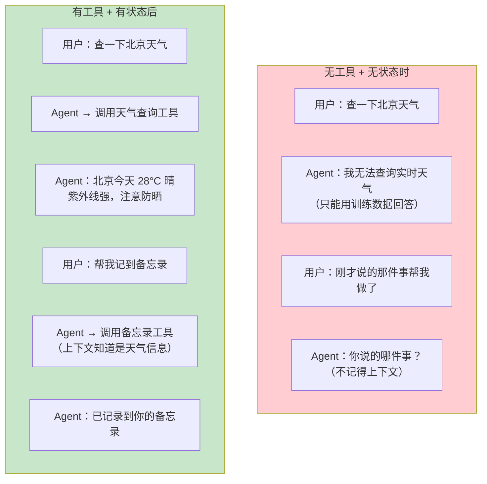
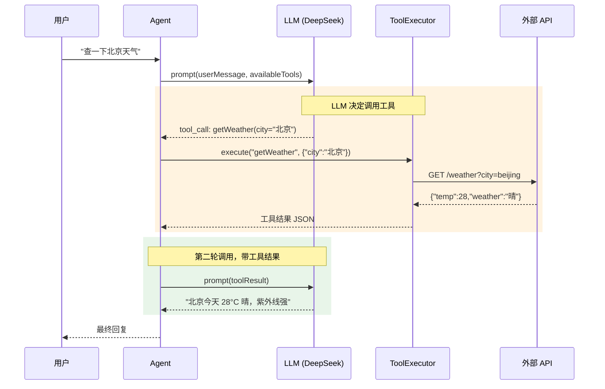
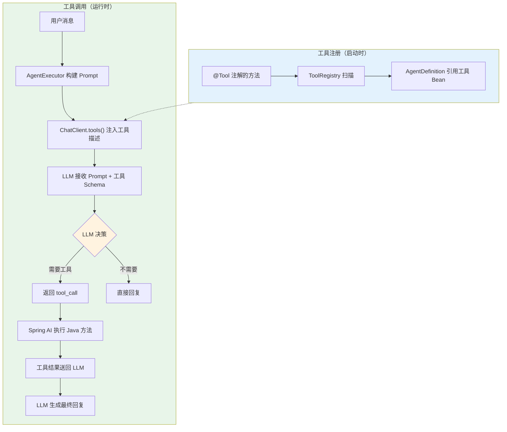
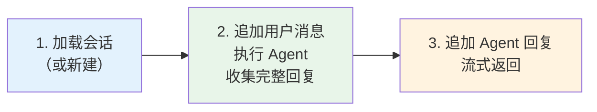
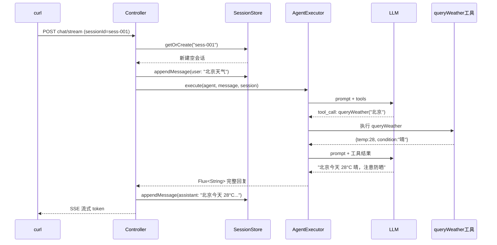
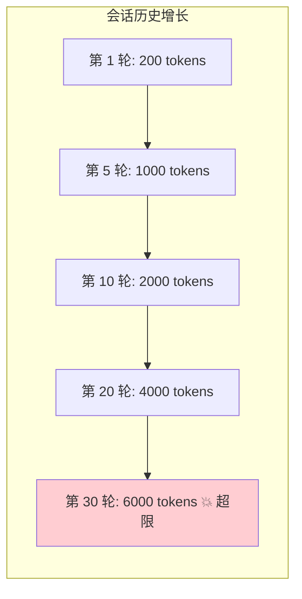
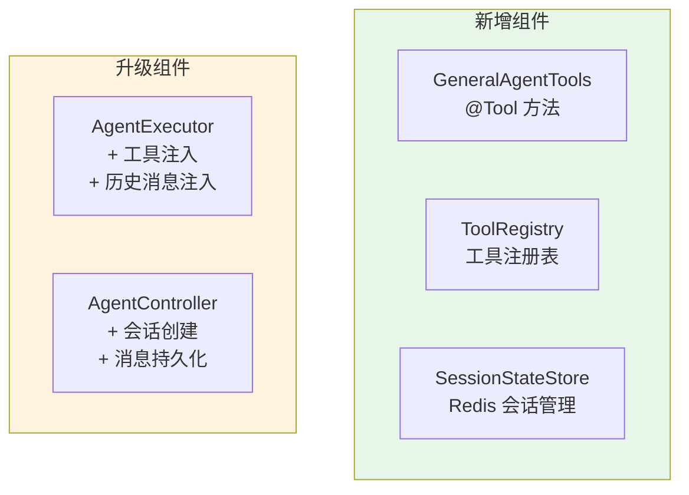

# 02-迭代一：单 Agent 工具链

> **定位**：为通用 Agent 加入工具注册与调用机制，同时实现 Agent 状态管理——让 Agent 从"只会说"升级为"能做事"，并能在多轮对话中保持上下文。涵盖 @Tool 注解定义、工具注册策略、状态持久化、工具调用全流程。读完这篇，你的 Agent 能查询数据、执行操作、记住对话历史。

> **读者画像**：已跑通最小 Demo，准备让 Agent 具备业务操作能力。

> **前置阅读**：[01-最小Demo搭建](01-最小Demo搭建.md)。

> **关联教程**：[教程 03-工具调用](../../教程/03-工具调用.md)、[教程 11-Agent状态管理](../../教程/11-Agent状态管理.md)。

---

## 1. 为什么要加工具和状态

最小 Demo 里的 Agent 是个"话痨"——什么问题都只用 LLM 内置知识回答。但多 Agent 平台需要每个 Agent 都是某个领域的"专家"，能执行真实操作：



本篇新增两大能力：

| 能力 | 实现方式 | 效果 |
|------|---------|------|
| 工具调用 | @Tool 注解 + ChatClient 工具注册 | Agent 能查询数据、执行操作 |
| 状态管理 | Redis + 会话 ID 绑定 | Agent 记住多轮对话上下文 |

---

## 2. 工具调用机制回顾

在写代码前，先理清 Spring AI 2.0 的工具调用完整链路：



整个工具调用是**两轮 LLM 交互**：

1. **第一轮**：LLM 分析用户意图，决定是否需要调用工具，返回 `tool_call`
2. **工具执行**：Spring AI 框架自动拦截 `tool_call`，执行对应的 Java 方法
3. **第二轮**：将工具结果喂给 LLM，LLM 基于结果生成自然语言回复

Spring AI 2.0 的关键改进：这一切对开发者透明——你只需要用 `@Tool` 注解定义方法，框架自动处理整个循环。

> 「遇到阻塞？→ [教程 03-工具调用](../../教程/03-工具调用.md)」

---

## 3. 工具定义

### 3.1 内置工具集

我们为通用 Agent 定义三个演示工具：

| 工具 | 功能 | 数据源 |
|------|------|--------|
| `getTime` | 查询当前时间 | 系统时钟 |
| `queryWeather` | 查询城市天气 | 模拟天气 API |
| `searchKnowledge` | 搜索知识库 | 模拟知识检索 |

### 3.2 @Tool 注解定义

```java
@Component
public class GeneralAgentTools {

    /**
     * 查询当前时间
     */
    @Tool(description = "获取当前日期和时间，格式为 yyyy-MM-dd HH:mm:ss")
    public String getCurrentTime() {
        return LocalDateTime.now()
            .format(DateTimeFormatter.ofPattern("yyyy-MM-dd HH:mm:ss"));
    }

    /**
     * 查询天气
     */
    @Tool(description = "查询指定城市的当前天气信息，包括温度、天气状况、湿度")
    public WeatherResult queryWeather(
        @ToolParam(description = "城市名称，如：北京、上海") String city
    ) {
        // 模拟天气 API 调用
        return mockWeatherApi(city);
    }

    /**
     * 搜索知识库
     */
    @Tool(description = "在知识库中搜索相关文档，返回匹配的文档摘要列表")
    public List<KnowledgeItem> searchKnowledge(
        @ToolParam(description = "搜索关键词") String keyword,
        @ToolParam(description = "返回结果数量，默认5") Integer limit
    ) {
        // 模拟向量检索
        return mockKnowledgeSearch(keyword, limit != null ? limit : 5);
    }

    // 数据模型
    public record WeatherResult(
        String city,
        double temperature,
        String condition,
        int humidity,
        String suggestion
    ) {}

    public record KnowledgeItem(
        String title,
        String summary,
        double relevanceScore
    ) {}
}
```

关键设计原则：

1. **`description` 写清楚**——LLM 靠它决定何时调用这个工具，描述不清会导致误调用
2. **`@ToolParam` 标注每个参数**——让 LLM 理解参数含义，正确传值
3. **返回结构化数据**——用 record 定义返回类型，LLM 更容易理解和转述
4. **工具方法保持简单**——一个工具做一件事，复杂逻辑拆成多个工具

### 3.3 工具与 Agent 的绑定

不同的 Agent 有不同的工具集。我们在 `AgentDefinition` 中扩展工具引用：

```java
public record AgentDefinition(
    String agentId,
    String name,
    String description,
    String systemPrompt,
    Set<String> capabilities,
    List<String> toolBeanNames,    // 新增：工具 Bean 名称列表
    ModelConfig modelConfig
) {}
```

配置文件中指定：

```yaml
agent:
  definitions:
    - agent-id: general-assistant
      name: 通用助手
      system-prompt: |
        你是一个通用任务助手。你可以查询天气、搜索知识库。
        回答要准确、简洁。需要实时信息时主动使用工具。
      capabilities: [general, qa]
      tool-bean-names: [generalAgentTools]
      model-config:
        model: deepseek-chat
        temperature: 0.7
```

---

## 4. 工具注册与执行

### 4.1 工具注册表

我们需要一个工具注册表，将工具 Bean 名称映射到实际的方法：

```java
@Component
public class ToolRegistry {

    private final Map<String, Object> toolBeans = new ConcurrentHashMap<>();
    private final ApplicationContext applicationContext;

    public ToolRegistry(ApplicationContext applicationContext) {
        this.applicationContext = applicationContext;
    }

    /**
     * 根据 Bean 名称加载工具实例
     */
    public List<Object> resolveTools(List<String> beanNames) {
        if (beanNames == null || beanNames.isEmpty()) {
            return List.of();
        }
        return beanNames.stream()
            .map(name -> toolBeans.computeIfAbsent(name,
                k -> applicationContext.getBean(k)))
            .toList();
    }
}
```

### 4.2 升级 AgentExecutor

在最小 Demo 的基础上，`AgentExecutor` 需要支持工具调用：

```java
@Service
public class AgentExecutor {

    private final ChatClient.Builder chatClientBuilder;
    private final ToolRegistry toolRegistry;

    public AgentExecutor(ChatClient.Builder chatClientBuilder,
                         ToolRegistry toolRegistry) {
        this.chatClientBuilder = chatClientBuilder;
        this.toolRegistry = toolRegistry;
    }

    /**
     * 执行 Agent（带工具），返回流式响应
     */
    public Flux<String> execute(AgentDefinition agent, String userMessage) {
        ChatClient client = buildClient(agent);

        var promptSpec = client.prompt()
            .system(agent.systemPrompt())
            .user(userMessage);

        // 注册工具
        List<Object> tools = toolRegistry.resolveTools(agent.toolBeanNames());
        if (!tools.isEmpty()) {
            promptSpec = promptSpec.tools(tools.toArray());
        }

        return promptSpec.stream().content();
    }

    private ChatClient buildClient(AgentDefinition agent) {
        var builder = chatClientBuilder
            .defaultSystem(agent.systemPrompt());

        if (agent.modelConfig() != null) {
            var config = agent.modelConfig();
            builder = builder.defaultOptions(DeepSeekChatOptions.builder()
                .withModel(config.model())
                .withTemperature(config.temperature())
                .withMaxTokens(config.maxTokens())
                .build());
        }

        return builder.build();
    }
}
```

关键变化只有一行：`promptSpec.tools(tools.toArray())`。Spring AI 2.0 会自动扫描这些对象上的 `@Tool` 注解方法，将方法签名转成 LLM 可理解的 JSON Schema，注入到提示中。

### 4.3 工具调用全流程



---

## 5. Agent 状态管理

### 5.1 为什么需要状态管理

最小 Demo 每次请求都是无状态的——Agent 不记得上一次对话。但实际场景中：

```
用户：帮我查北京天气
Agent：北京今天 28°C 晴
用户：那上海呢？              ← "那"指什么？Agent 需要知道上下文是"天气"
Agent：上海今天 30°C 多云
用户：帮我记一下这两个城市的数据  ← "这两个城市"需要记住北京和上海
```

多 Agent 平台中，状态管理更关键——Agent 间委派任务时需要传递上下文。

> 「遇到阻塞？→ [教程 11-Agent状态管理](../../教程/11-Agent状态管理.md)」

### 5.2 会话模型

```java
public record AgentSession(
    String sessionId,                 // 会话 ID
    String agentId,                   // 绑定的 Agent
    List<ChatMessage> messages,       // 对话历史
    Map<String, Object> context,      // 自定义上下文（任务参数等）
    LocalDateTime createdAt,
    LocalDateTime lastActiveAt
) {}

public record ChatMessage(
    String role,      // user / assistant / tool
    String content,
    String toolName,  // 如果是 tool 角色，记录工具名
    LocalDateTime timestamp
) {}
```

### 5.3 Redis 状态存储

```java
@Repository
public class SessionStateStore {

    private final ReactiveRedisTemplate<String, String> redisTemplate;
    private final ObjectMapper objectMapper;

    private static final Duration SESSION_TTL = Duration.ofHours(24);

    /**
     * 创建或恢复会话
     */
    public Mono<AgentSession> getOrCreate(String sessionId, String agentId) {
        String key = "agent:session:" + sessionId;
        return redisTemplate.opsForValue().get(key)
            .map(this::deserialize)
            .switchIfEmpty(Mono.defer(() -> Mono.just(
                new AgentSession(
                    sessionId, agentId,
                    new ArrayList<>(), new HashMap<>(),
                    LocalDateTime.now(), LocalDateTime.now()
                )
            )));
    }

    /**
     * 保存会话
     */
    public Mono<Void> save(AgentSession session) {
        String key = "agent:session:" + session.sessionId();
        return redisTemplate.opsForValue()
            .set(key, serialize(session), SESSION_TTL)
            .then();
    }

    /**
     * 追加消息并保存
     */
    public Mono<AgentSession> appendMessage(String sessionId, ChatMessage message) {
        return getOrCreate(sessionId, "")
            .map(session -> {
                var updatedMessages = new ArrayList<>(session.messages());
                updatedMessages.add(message);
                return new AgentSession(
                    session.sessionId(),
                    session.agentId(),
                    updatedMessages,
                    session.context(),
                    session.createdAt(),
                    LocalDateTime.now()
                );
            })
            .flatMap(session -> save(session).thenReturn(session));
    }
}
```

关键设计：

| 设计 | 理由 |
|------|------|
| TTL 24 小时 | 会话不宜永久保存，24 小时覆盖一个工作日 |
| Redis String 存储 JSON | 简单直接，避免 Hash 的嵌套序列化 |
| `getOrCreate` 模式 | 调用方不需要关心是新建还是恢复 |
| 追加消息用 `flatMap` | 先读后写，保证响应式链路不断 |

### 5.4 将状态注入 Agent 执行

升级 `AgentExecutor`，在调用 LLM 前注入历史消息：

```java
public Flux<String> execute(AgentDefinition agent, String userMessage,
                            AgentSession session) {
    ChatClient client = buildClient(agent);

    var promptSpec = client.prompt()
        .system(agent.systemPrompt())
        .user(userMessage);

    // 注入历史消息
    if (session != null && !session.messages().isEmpty()) {
        List<Message> history = session.messages().stream()
            .map(this::toSpringMessage)
            .toList();
        promptSpec = promptSpec.messages(history);
    }

    // 注册工具
    List<Object> tools = toolRegistry.resolveTools(agent.toolBeanNames());
    if (!tools.isEmpty()) {
        promptSpec = promptSpec.tools(tools.toArray());
    }

    return promptSpec.stream().content();
}

private Message toSpringMessage(ChatMessage msg) {
    return switch (msg.role()) {
        case "user" -> new UserMessage(msg.content());
        case "assistant" -> new AssistantMessage(msg.content());
        default -> new UserMessage(msg.content());
    };
}
```

### 5.5 Controller 集成状态管理

```java
@PostMapping("/{agentId}/chat/stream")
public Flux<ServerSentEvent<String>> chatStream(
        @PathVariable String agentId,
        @RequestBody ChatRequest request
) {
    return registry.findById(agentId)
        .switchIfEmpty(Mono.error(new AgentNotFoundException(agentId)))
        .flatMap(agent -> sessionStore.getOrCreate(request.sessionId(), agentId)
            .flatMap(session -> {
                // 追加用户消息
                return sessionStore.appendMessage(
                    request.sessionId(),
                    new ChatMessage("user", request.message(), null, LocalDateTime.now())
                ).flatMap(updatedSession ->
                    // 执行 Agent
                    executor.execute(agent, request.message(), updatedSession)
                        .collectList()
                        .flatMap(replyTokens -> {
                            String fullReply = String.join("", replyTokens);
                            // 追加 Agent 回复
                            return sessionStore.appendMessage(
                                request.sessionId(),
                                new ChatMessage("assistant", fullReply, null, LocalDateTime.now())
                            ).thenReturn(replyTokens);
                        })
                );
            })
            .flatMapMany(Flux::fromIterable)
        )
        .map(token -> ServerSentEvent.<String>builder()
            .event("token")
            .data(token)
            .build())
        .concatWith(Mono.just(ServerSentEvent.<String>builder()
            .event("done")
            .data("[DONE]")
            .build()));
}
```

这段代码比较长，核心逻辑是三步：



注意：为了保存 Agent 完整回复到会话历史，这里用 `collectList()` 先收集所有 token 再持久化。前端看到的仍然是流式输出（因为最后的 `flatMapMany(Flux::fromIterable)` 重新展开为流）。

---

## 6. 工具调用测试

### 6.1 测试天气查询

```bash
# 先创建会话并提问
curl -X POST http://localhost:8080/api/agents/general-assistant/chat/stream \
  -H "Content-Type: application/json" \
  -d '{"sessionId":"sess-001","message":"北京今天天气怎么样？"}'
```

预期流程：



### 6.2 测试多轮上下文

```bash
# 第二轮：利用上下文
curl -X POST http://localhost:8080/api/agents/general-assistant/chat/stream \
  -H "Content-Type: application/json" \
  -d '{"sessionId":"sess-001","message":"那上海呢？"}'
```

Agent 应该理解"那上海呢？"是在问上海的天气——因为会话历史中有"北京天气"的上下文。

---

## 7. 上下文长度管理

### 7.1 上下文膨胀问题

多轮对话的会话历史会不断增长。如果 20 轮对话，每轮 200 token，就有 4000 token 的历史——很快就会超出模型的上下文窗口。



### 7.2 滑动窗口策略

最简单有效的策略是滑动窗口——只保留最近 N 轮对话：

```java
private List<ChatMessage> applySlidingWindow(List<ChatMessage> messages, int maxMessages) {
    if (messages.size() <= maxMessages) {
        return messages;
    }
    // 保留最近 maxMessages 条
    return messages.subList(messages.size() - maxMessages, messages.size());
}
```

更高级的策略（后续迭代可加入）：

| 策略 | 说明 | 适用场景 |
|------|------|---------|
| 滑动窗口 | 保留最近 N 条 | 大多数场景 |
| Token 计数 | 按 Token 总量截断 | 精确控制 |
| 摘要压缩 | 用 LLM 总结早期对话 | 超长对话 |
| 重要消息保留 | 始终保留第一条系统消息 | 角色一致性 |

> 「遇到阻塞？→ [教程 29-上下文工程](../../教程/29-上下文工程.md)」

---

## 8. 工具调用可观测

### 8.1 记录工具调用日志

每个工具调用都应该被记录——这是后续调试和审计的基础：

```java
@Aspect
@Component
public class ToolCallLogger {

    private static final Logger log = LoggerFactory.getLogger(ToolCallLogger.class);

    @Around("@annotation(toolAnnotation)")
    public Object logToolCall(ProceedingJoinPoint joinPoint,
                              org.springframework.ai.tool.annotation.Tool toolAnnotation) throws Throwable {
        String toolDesc = toolAnnotation.description();
        Object[] args = joinPoint.getArgs();
        long start = System.currentTimeMillis();

        log.info("[TOOL_CALL] {} args={}", toolDesc, Arrays.toString(args));

        try {
            Object result = joinPoint.proceed();
            long elapsed = System.currentTimeMillis() - start;
            log.info("[TOOL_RESULT] {} took={}ms result={}",
                toolDesc, elapsed, truncate(result));
            return result;
        } catch (Exception e) {
            log.error("[TOOL_ERROR] {} error={}", toolDesc, e.getMessage());
            throw e;
        }
    }

    private String truncate(Object obj) {
        String str = obj != null ? obj.toString() : "null";
        return str.length() > 200 ? str.substring(0, 200) + "..." : str;
    }
}
```

### 8.2 Micrometer 指标埋点

```java
@Aspect
@Component
public class ToolCallMetrics {

    private final MeterRegistry meterRegistry;

    public ToolCallMetrics(MeterRegistry meterRegistry) {
        this.meterRegistry = meterRegistry;
    }

    @Around("@annotation(toolAnnotation)")
    public Object recordMetrics(ProceedingJoinPoint joinPoint,
                                org.springframework.ai.tool.annotation.Tool toolAnnotation) throws Throwable {
        String methodName = joinPoint.getSignature().getName();
        Timer.Sample sample = Timer.start(meterRegistry);

        try {
            Object result = joinPoint.proceed();
            sample.stop(meterRegistry.timer("agent.tool.call",
                "tool", methodName, "status", "success"));
            return result;
        } catch (Exception e) {
            sample.stop(meterRegistry.timer("agent.tool.call",
                "tool", methodName, "status", "error"));
            throw e;
        }
    }
}
```

Grafana 面板可以看到每个工具的调用次数、平均耗时、错误率。

> 「遇到阻塞？→ [教程 17-工具执行可观测与审计](../../教程/17-工具执行可观测与审计.md)」

---

## 9. 迭代一代码回顾

| 文件 | 职责 | 新增 |
|------|------|------|
| `GeneralAgentTools.java` | @Tool 工具定义 | 新增 |
| `ToolRegistry.java` | 工具 Bean 注册表 | 新增 |
| `SessionStateStore.java` | Redis 会话状态存储 | 新增 |
| `AgentExecutor.java` | 加入工具 + 状态注入 | 升级 |
| `AgentController.java` | 加入会话管理 | 升级 |
| `AgentDefinition.java` | 加入 toolBeanNames | 升级 |



---

## 10. 总结

本篇让 Agent 从"只会说"升级为"能做事 + 有记忆"：

1. **工具定义**——用 `@Tool` + `@ToolParam` 注解定义方法，Spring AI 自动将其转换为 LLM 可调用的工具 Schema
2. **工具注册**——`ToolRegistry` 管理 Bean 级工具引用，Agent 通过 `toolBeanNames` 绑定自己的工具集
3. **工具执行**——`AgentExecutor` 调用 `promptSpec.tools()` 注入工具，LLM 决策 + Spring AI 自动执行的链路全透明
4. **状态管理**——`SessionStateStore` 基于 Redis 的 `getOrCreate` + `appendMessage` 模式，24 小时 TTL 自动过期
5. **上下文注入**——执行 Agent 前将历史消息注入 Prompt，支持多轮对话的上下文理解
6. **可观测性**——AOP 切面记录工具调用日志 + Micrometer 指标埋点，为调试和审计提供基础

下一篇 [03-迭代二-多Agent编排](03-迭代二-多Agent编排.md) 将引入 Agent 注册中心、Agent 间通信和并行编排——从单 Agent 跨越到多 Agent 协作。
