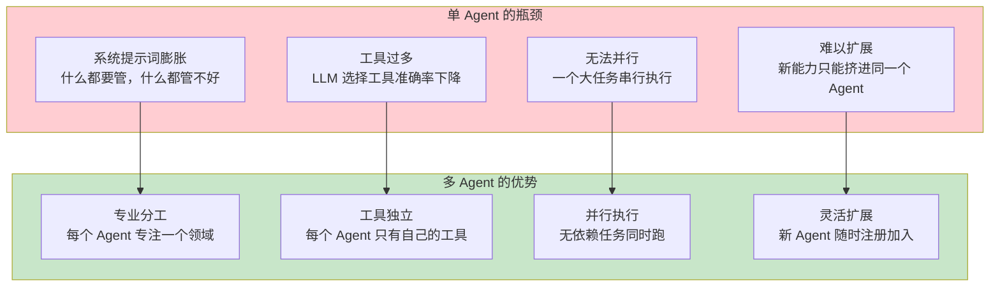
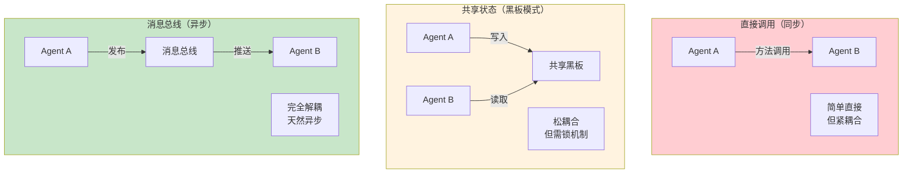
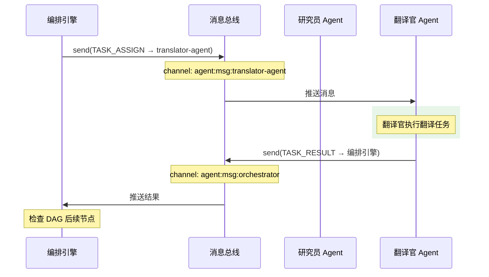
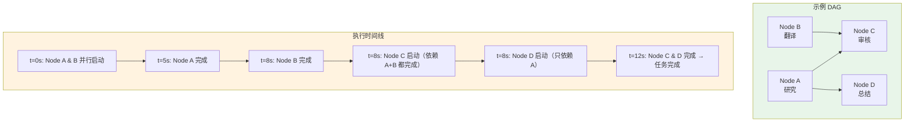
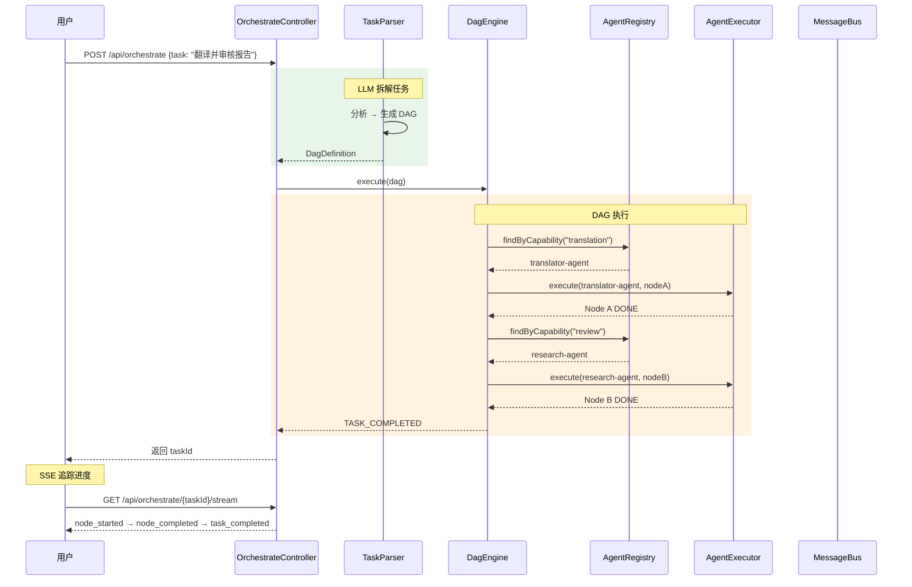
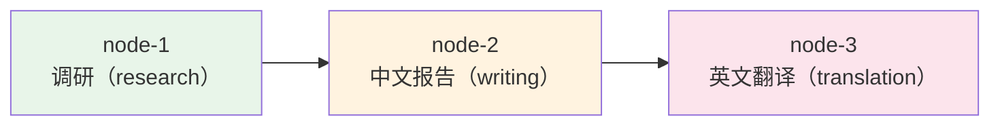
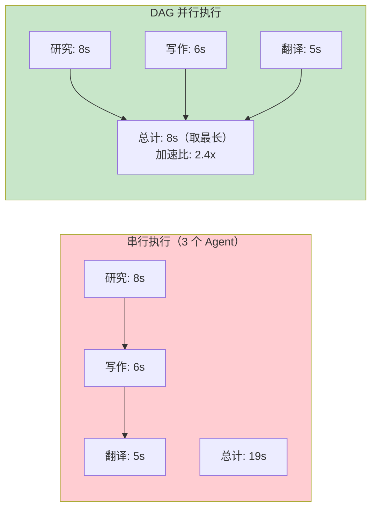
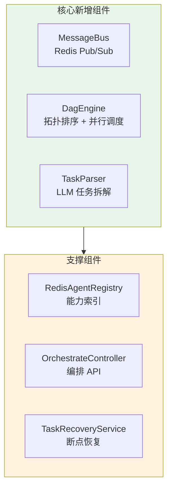

# 03-迭代二：多 Agent 编排

> **定位**：从单 Agent 跨越到多 Agent 协作——实现 Agent 注册中心升级、Agent 间通信机制、DAG 编排引擎。读完这篇，你的平台能注册多个 Agent、让它们并行执行任务、通过消息总线协调工作流，这是多 Agent 平台的核心能力跃迁。

> **读者画像**：已完成迭代一，Agent 已具备工具和状态管理，现在要引入第二个、第三个 Agent 并让它们协作。

> **前置阅读**：[02-迭代一-单Agent工具链](02-迭代一-单Agent工具链.md)。

> **关联教程**：[教程 08-多Agent协作](../../教程/08-多Agent协作.md)、[教程 14-管控分离架构](../../教程/14-管控分离架构.md)、[教程 31-Agent工作流编排](../../教程/31-Agent工作流编排.md)。

---

## 1. 从单 Agent 到多 Agent 的跨越

迭代一结束时，平台只有一个通用 Agent。但真实业务场景需要专业化分工——一个 Agent 不可能什么都擅长：



本篇新增三大核心能力：

| 能能 | 说明 |
|------|------|
| 多 Agent 注册 | 注册多个专业化 Agent，通过能力标签管理 |
| Agent 间通信 | Agent A 的输出传递给 Agent B 作为输入 |
| DAG 编排引擎 | 定义节点依赖关系，自动并行调度 |

---

## 2. 注册多 Agent

### 2.1 专业化 Agent 定义

我们在配置中注册三个专业化 Agent：

```yaml
agent:
  definitions:
    - agent-id: general-assistant
      name: 通用助手
      description: 处理日常问答和信息查询
      system-prompt: |
        你是通用任务助手，可以查询天气、搜索知识。
      capabilities: [general, qa]
      tool-bean-names: [generalAgentTools]
      model-config:
        model: deepseek-chat
        temperature: 0.7

    - agent-id: research-agent
      name: 研究员 Agent
      description: 深度分析问题，撰写研究报告，擅长逻辑推理
      system-prompt: |
        你是一个专业研究员。你的职责是深入分析问题，
        搜集信息，撰写结构化的研究报告。
        你的分析要全面、客观、有数据支撑。
      capabilities: [research, analysis, writing]
      tool-bean-names: [researchAgentTools]
      model-config:
        model: deepseek-chat
        temperature: 0.3
        max-tokens: 4096

    - agent-id: translator-agent
      name: 翻译官 Agent
      description: 多语言翻译，保持语义和语气的准确性
      system-prompt: |
        你是一个专业翻译官。你的职责是在不同语言之间准确翻译。
        翻译要忠实原文、表达自然、保留专业术语。
      capabilities: [translation, localization]
      tool-bean-names: []
      model-config:
        model: deepseek-chat
        temperature: 0.2
        max-tokens: 4096
```

注意每个 Agent 有不同的 temperature：

| Agent | temperature | 理由 |
|-------|-------------|------|
| 通用助手 | 0.7 | 兼顾灵活性和准确性 |
| 研究员 | 0.3 | 需要严谨，减少发散 |
| 翻译官 | 0.2 | 需要忠实，几乎不需要创造性 |

> 「遇到阻塞？→ [教程 08-多Agent协作](../../教程/08-多Agent协作.md)」

### 2.2 升级 AgentRegistry

将内存注册中心升级为 Redis 实现，支持跨实例的 Agent 发现：

```java
@Repository
public class RedisAgentRegistry implements AgentRegistry {

    private final ReactiveRedisTemplate<String, String> redisTemplate;
    private final ObjectMapper objectMapper;

    private static final String AGENT_KEY_PREFIX = "agent:def:";
    private static final String CAPABILITY_INDEX = "agent:cap:";

    @Override
    public Mono<Void> register(AgentDefinition agent) {
        String key = AGENT_KEY_PREFIX + agent.agentId();
        String json = serialize(agent);

        // 存储 Agent 定义
        Mono<Boolean> saveDef = redisTemplate.opsForValue().set(key, json);

        // 索引能力标签（用于按能力检索）
        Flux<Boolean> indexCaps = Flux.fromIterable(agent.capabilities())
            .flatMap(cap -> redisTemplate.opsForSet()
                .add(CAPABILITY_INDEX + cap, agent.agentId()));

        return saveDef.thenMany(indexCaps).then();
    }

    @Override
    public Mono<AgentDefinition> findById(String agentId) {
        return redisTemplate.opsForValue().get(AGENT_KEY_PREFIX + agentId)
            .map(this::deserialize);
    }

    @Override
    public Flux<AgentDefinition> findByCapability(String capability) {
        return redisTemplate.opsForSet().members(CAPABILITY_INDEX + capability)
            .flatMap(agentId -> findById(agentId));
    }

    @Override
    public Flux<AgentDefinition> findAll() {
        return redisTemplate.keys(AGENT_KEY_PREFIX + "*")
            .flatMap(key -> redisTemplate.opsForValue().get(key))
            .map(this::deserialize);
    }

    // 序列化辅助方法省略
}
```

关键设计：**能力索引**。每个能力标签对应一个 Redis Set，包含所有具备该能力的 Agent ID。这样路由引擎可以用 `O(1)` 查到候选 Agent。

---

## 3. Agent 间通信

### 3.1 通信模式选择

多 Agent 之间如何传递信息？有三种常见模式：



我们选择**消息总线**模式——Agent 通过 Redis Pub/Sub 通信，完全解耦：

| 决策 | 理由 |
|------|------|
| 解耦 | Agent A 不需要知道 Agent B 的存在，由编排引擎决定路由 |
| 异步 | Agent B 可以并行处理来自多个 Agent 的请求 |
| 可扩展 | 新增 Agent 只需订阅频道，不修改现有 Agent |

> 「遇到阻塞？→ [教程 14-管控分离架构](../../教程/14-管控分离架构.md)」

### 3.2 消息协议

定义 Agent 间通信的标准消息格式：

```java
public record AgentMessage(
    String messageId,               // 唯一消息 ID
    String sourceAgentId,           // 发送方 Agent
    String targetAgentId,           // 接收方 Agent（广播时为 "*")
    String taskId,                  // 关联的编排任务 ID
    MessageType type,               // 消息类型
    Map<String, Object> payload,    // 消息内容
    LocalDateTime timestamp
) {}

public enum MessageType {
    TASK_ASSIGN,        // 任务分配
    TASK_RESULT,        // 任务结果
    QUERY,              // 查询请求
    QUERY_RESPONSE,     // 查询响应
    CONTEXT_SHARE,      // 上下文共享
    ERROR               // 错误通知
}
```

### 3.3 消息总线实现

```java
@Service
public class MessageBus {

    private final ReactiveRedisTemplate<String, String> redisTemplate;
    private final ObjectMapper objectMapper;

    // 内存 Sink：按 Agent ID 分组
    private final Map<String, Sinks.Many<AgentMessage>> agentSinks =
        new ConcurrentHashMap<>();

    /**
     * 初始化 Agent 消息接收器
     */
    public Flux<AgentMessage> subscribe(String agentId) {
        return agentSinks.computeIfAbsent(agentId,
            k -> Sinks.many().multicast().onBackpressureBuffer()
        ).asFlux();
    }

    /**
     * 发送消息（点对点）
     */
    public Mono<Void> send(AgentMessage message) {
        String channel = "agent:msg:" + message.targetAgentId();
        String json = serialize(message);

        return redisTemplate.convertAndSend(channel, json)
            .doOnSuccess(n -> log.debug("Message sent to {}: {} msgs delivered",
                message.targetAgentId(), n))
            .then();
    }

    /**
     * 广播消息
     */
    public Mono<Void> broadcast(AgentMessage message) {
        String json = serialize(message);
        return redisTemplate.convertAndSend("agent:msg:broadcast", json)
            .then();
    }

    /**
     * 请求-响应模式（简化版）
     */
    public Mono<AgentMessage> requestResponse(AgentMessage request, Duration timeout) {
        String correlationId = request.messageId();

        return Mono.create(sink -> {
            // 订阅响应
            Disposable sub = subscribe(request.targetAgentId())
                .filter(msg -> msg.messageId().equals(correlationId))
                .timeout(timeout)
                .subscribe(sink::success, sink::error);

            // 发送请求
            send(request).subscribe(
                v -> {},
                e -> { sub.dispose(); sink.error(e); }
            );
        });
    }
}
```

### 3.4 Agent 间通信流程



---

## 4. DAG 编排引擎

### 4.1 DAG 数据结构

```java
public record DagDefinition(
    String dagId,
    String taskId,
    List<DagNode> nodes,
    List<DagEdge> edges,
    Map<String, Object> globalContext
) {}

public record DagNode(
    String nodeId,
    String description,
    String requiredCapability,     // 需要的 Agent 能力
    NodeType type,
    Map<String, Object> config,
    NodeStatus status,
    String result,                 // 执行结果
    String assignedAgentId,        // 分配的 Agent
    LocalDateTime startedAt,
    LocalDateTime completedAt,
    int retryCount
) {}

public enum NodeType {
    TASK,          // 普通任务
    APPROVAL,      // 审批网关
    MERGE,         // 结果合并
    CONDITIONAL    // 条件分支
}

public enum NodeStatus {
    PENDING,
    READY,         // 依赖已满足，可以执行
    RUNNING,
    DONE,
    FAILED,
    BLOCKED        // 等待审批
}
```

### 4.2 DAG 执行引擎核心

```java
@Service
public class DagEngine {

    private final AgentRegistry agentRegistry;
    private final AgentExecutor agentExecutor;
    private final MessageBus messageBus;
    private final TaskStateStore stateStore;

    /**
     * 执行 DAG
     */
    public Flux<DagEvent> execute(DagDefinition dag) {
        // 初始化所有节点状态
        return initializeNodes(dag)
            .then(stateStore.saveDag(dag))
            .thenMany(scheduleReadyNodes(dag));
    }

    /**
     * 调度所有可执行节点（依赖已满足）
     */
    private Flux<DagEvent> scheduleReadyNodes(DagDefinition dag) {
        List<DagNode> readyNodes = findReadyNodes(dag);

        if (readyNodes.isEmpty()) {
            // 检查是否全部完成
            if (allNodesDone(dag)) {
                return Flux.just(new DagEvent(dag.dagId(), null,
                    EventType.TASK_COMPLETED, "All nodes done"));
            }
            // 否则等待（异步节点完成时会触发重新调度）
            return Flux.empty();
        }

        // 并行执行所有就绪节点
        return Flux.fromIterable(readyNodes)
            .flatMap(node -> executeNode(dag, node));
    }

    /**
     * 执行单个节点
     */
    private Flux<DagEvent> executeNode(DagDefinition dag, DagNode node) {
        return findAgentForNode(node)
            .flatMapMany(agent -> {
                // 更新状态为 RUNNING
                return stateStore.updateNodeStatus(dag.dagId(),
                    node.nodeId(), NodeStatus.RUNNING, agent.agentId())
                    .thenMany(executeAgentForNode(dag, node, agent));
            });
    }

    /**
     * 并行执行核心：用 Flux.flatMap 并行调度
     */
    private Flux<DagEvent> executeAgentForNode(
            DagDefinition dag, DagNode node, AgentDefinition agent) {

        String userMessage = buildNodePrompt(dag, node);

        return agentExecutor.execute(agent, userMessage, null)
            .collectList()
            .flatMapMany(tokens -> {
                String result = String.join("", tokens);

                // 保存节点结果
                return stateStore.updateNodeResult(
                        dag.dagId(), node.nodeId(), result, NodeStatus.DONE)
                    // 通知 DAG 引擎：本节点完成，触发后续节点
                    .thenMany(Flux.concat(
                        Flux.just(new DagEvent(dag.dagId(), node.nodeId(),
                            EventType.NODE_COMPLETED, result)),
                        // 重新调度
                        rescheduleAfterNodeCompletion(dag, node.nodeId())
                    ));
            })
            .onErrorResume(ex -> handleNodeFailure(dag, node, ex));
    }

    /**
     * 查找就绪节点：所有前驱节点已 DONE
     */
    private List<DagNode> findReadyNodes(DagDefinition dag) {
        Set<String> completedNodeIds = dag.nodes().stream()
            .filter(n -> n.status() == NodeStatus.DONE)
            .map(DagNode::nodeId)
            .collect(Collectors.toSet());

        return dag.nodes().stream()
            .filter(n -> n.status() == NodeStatus.PENDING)
            .filter(n -> {
                // 检查所有前驱节点是否完成
                List<DagEdge> incomingEdges = dag.edges().stream()
                    .filter(e -> e.to().equals(n.nodeId()))
                    .toList();
                return incomingEdges.stream()
                    .allMatch(e -> completedNodeIds.contains(e.from()));
            })
            .toList();
    }
}
```

### 4.3 并行执行机制

DAG 引擎的核心是**并行调度**——多个无依赖的节点同时执行：



`Flux.flatMap()` 默认并发度 256——足以并行调度大量 Agent。如果需要限制并发数，使用 `flatMap(mapper, concurrency)`：

```java
// 限制最多同时执行 10 个 Agent
Flux.fromIterable(readyNodes)
    .flatMap(node -> executeNode(dag, node), 10)
```

> 「遇到阻塞？→ [教程 31-Agent工作流编排](../../教程/31-Agent工作流编排.md)」

### 4.4 DAG 事件流

```java
public record DagEvent(
    String dagId,
    String nodeId,
    EventType type,
    String data
) {}

public enum EventType {
    DAG_CREATED,
    NODE_STARTED,
    NODE_OUTPUT,
    NODE_COMPLETED,
    NODE_FAILED,
    TASK_COMPLETED,
    TASK_FAILED
}
```

编排引擎将 `Flux<DagEvent>` 暴露给 Controller，Controller 转为 SSE 推给前端。用户就能实时看到 DAG 每个节点的执行进展。

---

## 5. 编排接口

### 5.1 任务提交接口

```java
@RestController
@RequestMapping("/api/orchestrate")
public class OrchestrateController {

    private final TaskParser taskParser;
    private final DagEngine dagEngine;

    /**
     * 提交编排任务
     */
    @PostMapping
    public Mono<ResponseEntity<TaskResponse>> submitTask(
            @RequestBody OrchestrateRequest request
    ) {
        String taskId = UUID.randomUUID().toString();

        return taskParser.parse(request, taskId)
            .flatMap(dag -> dagEngine.execute(dag)
                .takeUntil(e -> e.type() == EventType.TASK_COMPLETED
                    || e.type() == EventType.TASK_FAILED)
                .then(Mono.just(dag)))
            .map(dag -> ResponseEntity.ok(
                new TaskResponse(taskId, dag.dagId(), "ACCEPTED")
            ));
    }

    /**
     * SSE 实时追踪任务执行
     */
    @GetMapping(value = "/{taskId}/stream",
                produces = MediaType.TEXT_EVENT_STREAM_VALUE)
    public Flux<ServerSentEvent<String>> streamTask(
            @PathVariable String taskId
    ) {
        return stateStore.subscribeDagEvents(taskId)
            .map(event -> ServerSentEvent.<String>builder()
                .event(event.type().name().toLowerCase())
                .data(toJson(event))
                .build());
    }

    public record TaskResponse(String taskId, String dagId, String status) {}
}
```

### 5.2 完整编排流程



---

## 6. 任务拆解器（TaskParser）

### 6.1 用 LLM 拆解任务

TaskParser 用 LLM 分析用户提交的自然语言任务，输出结构化的 DAG 定义：

```java
@Service
public class TaskParser {

    private final ChatClient chatClient;
    private final AgentRegistry agentRegistry;

    private static final String PARSE_PROMPT = """
        你是一个任务编排规划师。用户会给你一个复杂任务描述，
        你需要将其拆解为多个子任务，并定义子任务之间的依赖关系。

        可用的 Agent 能力列表：
        {availableCapabilities}

        请输出 JSON 格式的 DAG 定义：
        {
          "nodes": [
            {
              "nodeId": "node-1",
              "description": "子任务描述",
              "requiredCapability": "需要的能力标签"
            }
          ],
          "edges": [
            {"from": "node-1", "to": "node-2"}
          ]
        }

        规则：
        1. 每个子任务只需要一种能力
        2. 无依赖关系的子任务不要加边（允许并行）
        3. 保持子任务数量在 2-6 个之间

        用户任务：{task}
        """;

    public Mono<DagDefinition> parse(OrchestrateRequest request, String taskId) {
        // 获取所有可用能力
        return agentRegistry.findAll()
            .map(AgentDefinition::capabilities)
            .flatMapIterable(Set::stream)
            .distinct()
            .collectList()
            .flatMap(capabilities -> {
                String prompt = PARSE_PROMPT
                    .replace("{availableCapabilities}", capabilities.toString())
                    .replace("{task}", request.task());

                return chatClient.prompt()
                    .user(prompt)
                    .call()
                    .entity(DagDefinition.class);  // Spring AI 结构化输出
            })
            .map(dag -> enrichDag(dag, taskId));
    }

    private DagDefinition enrichDag(DagDefinition dag, String taskId) {
        // 补充元数据：dagId、taskId、初始状态等
        ...
    }
}
```

关键设计：使用 Spring AI 的 `entity()` 方法直接将 LLM 输出反序列化为 Java 对象——这依赖 LLM 返回合法 JSON，所以我们用 DeepSeek 的结构化输出能力。

> 「遇到阻塞？→ [教程 12-结构化输出](../../教程/12-结构化输出.md)」

### 6.2 任务拆解示例

用户输入："帮我调研 AI Agent 框架的发展趋势，写一份中英文双语报告。"

LLM 拆解结果：

```json
{
  "nodes": [
    {
      "nodeId": "node-1",
      "description": "调研 AI Agent 框架的发展历史和趋势",
      "requiredCapability": "research"
    },
    {
      "nodeId": "node-2",
      "description": "基于调研结果撰写中文报告",
      "requiredCapability": "writing"
    },
    {
      "nodeId": "node-3",
      "description": "将中文报告翻译为英文",
      "requiredCapability": "translation"
    }
  ],
  "edges": [
    {"from": "node-1", "to": "node-2"},
    {"from": "node-2", "to": "node-3"}
  ]
}
```

对应 DAG 可视化：



---

## 7. 状态持久化

### 7.1 DAG 执行状态

编排任务需要持久化——进程重启后能恢复执行。用 PostgreSQL 存储 DAG 定义和执行状态：

```sql
CREATE TABLE orchestration_task (
    task_id       VARCHAR(64) PRIMARY KEY,
    dag_id        VARCHAR(64) NOT NULL,
    description   TEXT,
    status        VARCHAR(20) NOT NULL,
    created_at    TIMESTAMP DEFAULT NOW(),
    completed_at  TIMESTAMP
);

CREATE TABLE dag_node (
    id            BIGSERIAL PRIMARY KEY,
    task_id       VARCHAR(64) REFERENCES orchestration_task(task_id),
    node_id       VARCHAR(64) NOT NULL,
    description   TEXT,
    required_capability VARCHAR(50),
    node_type     VARCHAR(20) NOT NULL,
    status        VARCHAR(20) NOT NULL,
    assigned_agent VARCHAR(64),
    result        TEXT,
    started_at    TIMESTAMP,
    completed_at  TIMESTAMP,
    retry_count   INT DEFAULT 0,
    UNIQUE(task_id, node_id)
);
```

### 7.2 恢复机制

```java
@Service
public class TaskRecoveryService {

    /**
     * 应用重启时恢复未完成的任务
     */
    @EventListener(ApplicationReadyEvent.class)
    public void recoverIncompleteTasks() {
        taskRepository.findIncompleteTasks()
            .flatMap(this::resumeDag)
            .subscribe();
    }

    private Mono<Void> resumeDag(OrchestrationTask task) {
        return dagRepository.findNodesByTaskId(task.taskId())
            .collectList()
            .map(this::rebuildDag)
            .flatMap(dag -> dagEngine.execute(dag).then());
    }
}
```

> 「遇到阻塞？→ [教程 35-长任务持久化与中断恢复](../../教程/35-长任务持久化与中断恢复.md)」

---

## 8. 并行 vs 串行性能对比



实际的加速比取决于 DAG 结构——如果所有节点都是串行依赖（纯链式），并行就无法加速。所以 TaskParser 在拆解任务时，应该尽量将无依赖的子任务设计为独立节点。

---

## 9. 多 Agent 测试

### 9.1 测试多 Agent 编排

```bash
# 提交编排任务
curl -X POST http://localhost:8080/api/orchestrate \
  -H "Content-Type: application/json" \
  -d '{
    "task": "调研 AI Agent 框架的发展趋势，写一份中文报告然后翻译成英文",
    "params": {},
    "policy": {
      "timeout": "PT5M",
      "maxRetries": 2,
      "parallelEnabled": true,
      "onFailure": "ABORT"
    },
    "requireApproval": false
  }'

# 响应
{"taskId":"task-abc123","dagId":"dag-xyz","status":"ACCEPTED"}

# SSE 追踪
curl -N http://localhost:8080/api/orchestrate/task-abc123/stream
```

### 9.2 SSE 事件流示例

```
event:dag_created
data:{"dagId":"dag-xyz","nodes":3,"edges":2}

event:node_started
data:{"nodeId":"node-1","capability":"research","agent":"research-agent"}

event:node_completed
data:{"nodeId":"node-1","result":"AI Agent 框架发展趋势..."}

event:node_started
data:{"nodeId":"node-2","capability":"writing","agent":"research-agent"}

event:node_completed
data:{"nodeId":"node-2","result":"AI Agent 框架发展报告（中文）..."}

event:node_started
data:{"nodeId":"node-3","capability":"translation","agent":"translator-agent"}

event:node_completed
data:{"nodeId":"node-3","result":"AI Agent Framework Report (English)..."}

event:task_completed
data:{"dagId":"dag-xyz","totalTime":"23s"}
```

---

## 10. 迭代二代码回顾

| 文件 | 职责 | 新增/升级 |
|------|------|----------|
| `RedisAgentRegistry.java` | Redis 注册中心 + 能力索引 | 升级 |
| `MessageBus.java` | Agent 间消息总线 | 新增 |
| `DagEngine.java` | DAG 执行引擎 | 新增 |
| `TaskParser.java` | LLM 任务拆解 | 新增 |
| `OrchestrateController.java` | 编排 API + SSE | 新增 |
| `TaskRecoveryService.java` | 断点恢复 | 新增 |



---

## 11. 总结

本篇完成了从单 Agent 到多 Agent 协作的跨越：

1. **多 Agent 注册**——Redis 注册中心 + 能力索引（Set），按能力检索 Agent 的复杂度为 O(1)
2. **Agent 间通信**——基于 Redis Pub/Sub 的消息总线，支持点对点和广播，请求-响应模式封装超时控制
3. **DAG 编排引擎**——拓扑排序找就绪节点、`Flux.flatMap` 并行调度、节点完成后自动触发后续节点
4. **任务拆解**——LLM 将自然语言任务拆解为结构化 DAG，Spring AI 的 `entity()` 方法直接反序列化
5. **状态持久化**——PostgreSQL 存储 DAG 定义和节点状态，应用重启可恢复未完成任务
6. **并行加速**——无依赖节点自动并行执行，实测加速比 2-5 倍

下一篇 [04-迭代三-任务委派与路由](04-迭代三-任务委派与路由.md) 将加入智能路由（根据任务匹配最优 Agent）和 Human-in-the-Loop 审批网关。
