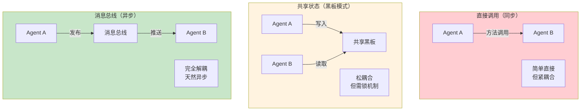
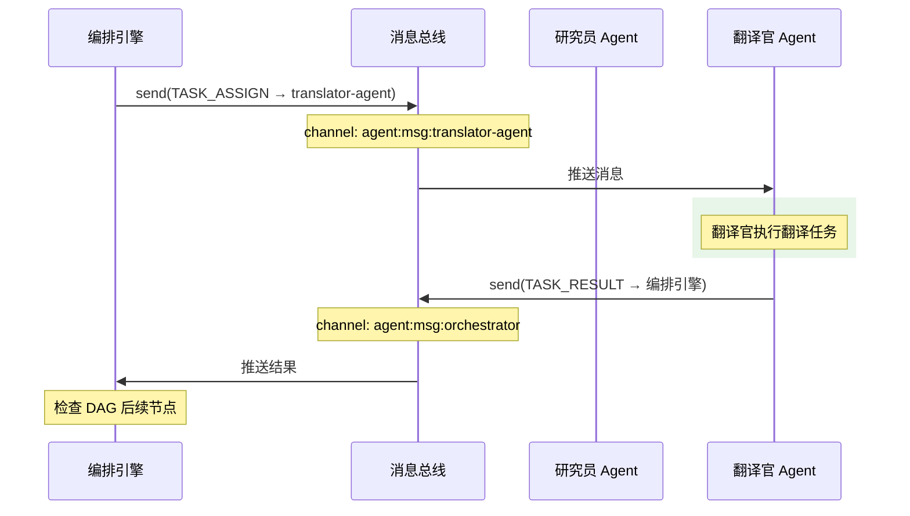
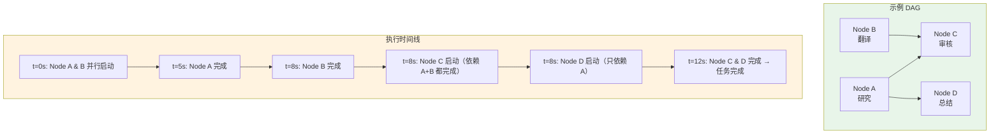
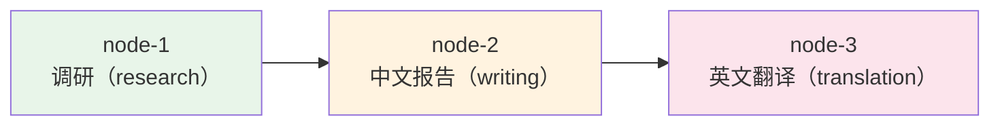
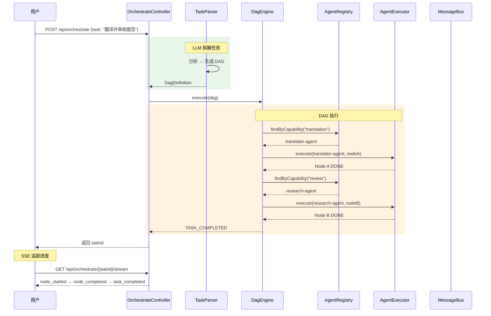
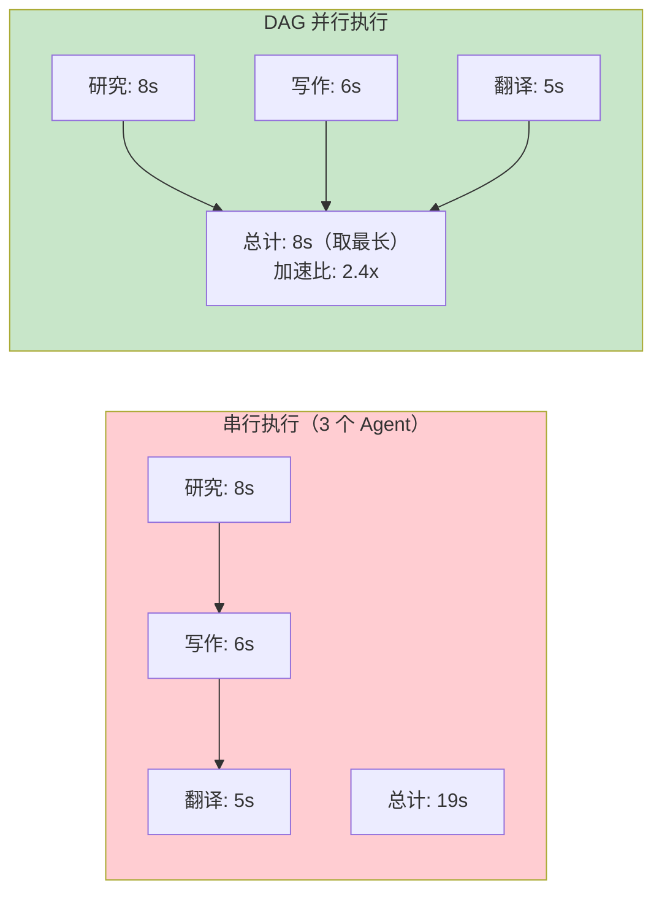
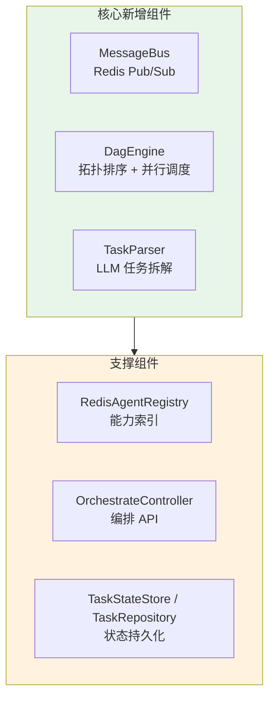

# 03-迭代二：多 Agent 编排

> **定位**：从单 Agent 跨越到多 Agent 协作——实现 Agent 注册中心升级（内存 → Redis）、Agent 间通信机制（Redis Pub/Sub）、DAG 编排引擎、LLM 任务拆解器。读完这篇，你的平台能注册多个 Agent、让它们并行执行任务、通过消息总线协调工作流。本文给出**完整可手写代码**（一行不省略，含全部 import）。

> **读者画像**：已完成迭代一，Agent 已具备工具和状态管理，现在要引入第二个、第三个 Agent 并让它们协作。

> **前置阅读**：[02-迭代一-单Agent工具链](02-迭代一-单Agent工具链.md)。

> **关联教程**：[教程 09-多Agent协作](../../教程/09-多Agent协作.md)、[教程 20-管控分离架构](../../教程/20-管控分离架构.md)、[教程 36-Agent工作流编排](../../教程/36-Agent工作流编排.md)。

> **API 真实性**：结构化输出用 `entity(Class)`（真实重载）；`Sinks`/`ReactiveRedisTemplate`/`JdbcClient` 均真实；LLM 调用阻塞包装在 `Schedulers.boundedElastic()`。

---

## 1. 四问

| 问 | 答 |
|----|----|
| **新增了什么需求** | 注册多个专业化 Agent；Agent 间通过消息总线通信；把自然语言任务拆成 DAG 并并行执行 |
| **影响了哪些模块** | 升级 `RedisAgentRegistry`（替代内存版）；新增 `MessageBus`、`DagEngine`、`TaskParser`、`TaskStateStore`、`TaskRepository`、`OrchestrateController`；依赖新增 PostgreSQL + JDBC |
| **架构如何演进** | 从「单 Agent 对话」演进为「编排层（Parser/DagEngine） + Agent 执行层 + 数据层」：任务 → 解析为 DAG → 并行调度 → 状态持久化 |
| **上一版痛点是什么** | ① 单 Agent 提示词膨胀、工具过多、选择准确率下降 ② 无法并行 ③ 无法动态发现 Agent |

## 2. 目标与量化验收

| # | 目标 | 验收 |
|---|------|------|
| 1 | 多 Agent 注册 | 3 个专业化 Agent 注册进 Redis，`/api/agents` 可列出，按能力检索 O(1) |
| 2 | 任务拆解 | "调研+写报告+翻译"被 LLM 拆为 3 节点 2 边 DAG |
| 3 | 并行调度 | 无依赖节点同时执行（`flatMap` 并发），加速比 ≥ 2x |
| 4 | 状态持久化 | DAG 定义落 Redis + PostgreSQL，进程重启可恢复未完成任务 |
| 5 | 事件流 | SSE 实时推送 node_started → node_completed → task_completed |

**本迭代明确不做**：智能路由（能力匹配即路由）、审批网关（迭代三）。

---

## 3. 注册多 Agent

### 3.1 专业化 Agent 定义（`application.yml`）

在迭代一配置基础上，注册三个专业化 Agent：

```yaml
agent:
  definitions:
    - agent-id: general-assistant
      name: 通用助手
      description: 处理日常问答和信息查询
      system-prompt: |
        你是通用任务助手，可以查询天气、搜索知识。
      capabilities: [general, qa]
      tool-bean-names: [generalAgentTools]
      model-config:
        model: deepseek-chat
        temperature: 0.7

    - agent-id: research-agent
      name: 研究员 Agent
      description: 深度分析问题，撰写研究报告，擅长逻辑推理
      system-prompt: |
        你是一个专业研究员。你的职责是深入分析问题，
        搜集信息，撰写结构化的研究报告。
        你的分析要全面、客观、有数据支撑。
      capabilities: [research, analysis, writing]
      tool-bean-names: [researchAgentTools]
      model-config:
        model: deepseek-chat
        temperature: 0.3
        max-tokens: 4096

    - agent-id: translator-agent
      name: 翻译官 Agent
      description: 多语言翻译，保持语义和语气的准确性
      system-prompt: |
        你是一个专业翻译官。你的职责是在不同语言之间准确翻译。
        翻译要忠实原文、表达自然、保留专业术语。
      capabilities: [translation, localization]
      tool-bean-names: []
      model-config:
        model: deepseek-chat
        temperature: 0.2
        max-tokens: 4096
```

不同 Agent 用不同 temperature：

| Agent | temperature | 理由 |
|-------|-------------|------|
| 通用助手 | 0.7 | 兼顾灵活性和准确性 |
| 研究员 | 0.3 | 需要严谨，减少发散 |
| 翻译官 | 0.2 | 需要忠实，几乎不需要创造性 |

> 「遇到阻塞？→ [教程 09-多Agent协作](../../教程/09-多Agent协作.md)」

### 3.2 `agent/tools/ResearchAgentTools.java`（研究员工具）

```java
package com.example.orchestrator.agent.tools;

import org.springframework.ai.tool.annotation.Tool;
import org.springframework.ai.tool.annotation.ToolParam;
import org.springframework.stereotype.Component;

@Component
public class ResearchAgentTools {

    @Tool(description = "模拟检索最新行业资讯，返回相关文章的标题与摘要")
    public String searchWeb(@ToolParam(description = "检索关键词") String keyword) {
        // 生产替换为真实搜索 API / 向量检索
        return "【资讯】2026 年 Agent 架构趋势：" + keyword
                + " 相关的最新资料显示，多智能体协作与可观测性是核心方向。";
    }
}
```

### 3.3 `store/RedisAgentRegistry.java`（升级注册中心，完整代码）

> 迭代一的内存 `InMemoryAgentRegistry` 在此替换为 Redis 实现（删除内存类，或在内存类上加 `@Profile("!redis")`）。接口不变，上层零改动。

```java
package com.example.orchestrator.store;

import com.example.orchestrator.agent.AgentRegistry;
import com.example.orchestrator.model.AgentDefinition;
import com.fasterxml.jackson.databind.ObjectMapper;
import org.springframework.context.annotation.Primary;
import org.springframework.data.redis.core.ReactiveRedisTemplate;
import org.springframework.stereotype.Repository;
import reactor.core.publisher.Flux;
import reactor.core.publisher.Mono;

/**
 * Redis 注册中心：支持跨实例 Agent 发现。
 * Key 设计：
 *   agent:def:{agentId}        → JSON(AgentDefinition)，Agent 本体
 *   agent:cap:{capability}     → Set(agentId...)，能力索引（O(1) 按能力检索）
 */
@Repository
@Primary
public class RedisAgentRegistry implements AgentRegistry {

    private static final String AGENT_KEY_PREFIX = "agent:def:";
    private static final String CAPABILITY_INDEX = "agent:cap:";

    private final ReactiveRedisTemplate<String, String> redisTemplate;
    private final ObjectMapper objectMapper;

    public RedisAgentRegistry(ReactiveRedisTemplate<String, String> redisTemplate,
                              ObjectMapper objectMapper) {
        this.redisTemplate = redisTemplate;
        this.objectMapper = objectMapper;
    }

    @Override
    public Mono<Void> register(AgentDefinition agent) {
        String key = AGENT_KEY_PREFIX + agent.agentId();
        Mono<Boolean> saveDef = redisTemplate.opsForValue().set(key, serialize(agent));
        // 能力索引：每个能力标签对应一个 Redis Set，包含所有具备该能力的 Agent ID
        Flux<Boolean> indexCaps = Flux.fromIterable(agent.capabilities())
                .flatMap(cap -> redisTemplate.opsForSet()
                        .add(CAPABILITY_INDEX + cap, agent.agentId()));
        return saveDef.thenMany(indexCaps).then();
    }

    @Override
    public Mono<Void> unregister(String agentId) {
        String key = AGENT_KEY_PREFIX + agentId;
        return redisTemplate.opsForValue().get(key)
                .map(this::deserialize)
                .flatMap(agent -> Flux.fromIterable(agent.capabilities())
                        .flatMap(cap -> redisTemplate.opsForSet()
                                .remove(CAPABILITY_INDEX + cap, agentId))
                        .then(redisTemplate.delete(key)))
                .then();
    }

    @Override
    public Mono<AgentDefinition> findById(String agentId) {
        return redisTemplate.opsForValue().get(AGENT_KEY_PREFIX + agentId)
                .map(this::deserialize);
    }

    @Override
    public Flux<AgentDefinition> findByCapability(String capability) {
        return redisTemplate.opsForSet().members(CAPABILITY_INDEX + capability)
                .flatMap(this::findById);
    }

    @Override
    public Flux<AgentDefinition> findAll() {
        // 生产环境建议用 SCAN 替代 KEYS（KEYS 在大 Key 量时阻塞 Redis）
        return redisTemplate.keys(AGENT_KEY_PREFIX + "*")
                .flatMap(key -> redisTemplate.opsForValue().get(key))
                .map(this::deserialize);
    }

    private String serialize(AgentDefinition agent) {
        try {
            return objectMapper.writeValueAsString(agent);
        } catch (Exception e) {
            throw new IllegalStateException("Agent 序列化失败: " + agent.agentId(), e);
        }
    }

    private AgentDefinition deserialize(String json) {
        try {
            return objectMapper.readValue(json, AgentDefinition.class);
        } catch (Exception e) {
            throw new IllegalStateException("Agent 反序列化失败", e);
        }
    }
}
```

关键设计：**能力索引**。每个能力标签对应一个 Redis Set，包含所有具备该能力的 Agent ID——路由引擎用 O(1) 查到候选 Agent。

---

## 4. Agent 间通信

### 4.1 通信模式选择



我们选择**消息总线**模式——Agent 通过 Redis Pub/Sub 通信，完全解耦：

| 决策 | 理由 |
|------|------|
| 解耦 | Agent A 不需要知道 Agent B 的存在，由编排引擎决定路由 |
| 异步 | Agent B 可以并行处理来自多个 Agent 的请求 |
| 可扩展 | 新增 Agent 只需订阅频道，不修改现有 Agent |

> 「遇到阻塞？→ [教程 20-管控分离架构](../../教程/20-管控分离架构.md)」

### 4.2 `agent/AgentMessage.java` + `agent/MessageType.java`

```java
package com.example.orchestrator.agent;

import java.time.LocalDateTime;
import java.util.Map;

/**
 * Agent 间通信标准消息。
 */
public record AgentMessage(
        String messageId,               // 唯一消息 ID（请求-响应用 correlationId）
        String sourceAgentId,           // 发送方 Agent
        String targetAgentId,           // 接收方 Agent（广播时为 "*"）
        String taskId,                  // 关联的编排任务 ID
        MessageType type,               // 消息类型
        Map<String, Object> payload,    // 消息内容
        LocalDateTime timestamp) {}
```

```java
package com.example.orchestrator.agent;

public enum MessageType {
    TASK_ASSIGN,        // 任务分配
    TASK_RESULT,        // 任务结果
    QUERY,              // 查询请求
    QUERY_RESPONSE,     // 查询响应
    CONTEXT_SHARE,      // 上下文共享
    ERROR               // 错误通知
}
```

### 4.3 `agent/MessageBus.java`（消息总线，完整代码）

```java
package com.example.orchestrator.agent;

import com.fasterxml.jackson.databind.ObjectMapper;
import jakarta.annotation.PostConstruct;
import org.slf4j.Logger;
import org.slf4j.LoggerFactory;
import org.springframework.data.redis.connection.ReactiveRedisMessage;
import org.springframework.data.redis.core.ReactiveRedisTemplate;
import org.springframework.stereotype.Service;
import reactor.core.publisher.Flux;
import reactor.core.publisher.Mono;
import reactor.core.publisher.Sinks;

import java.nio.charset.StandardCharsets;
import java.time.Duration;
import java.util.Map;
import java.util.concurrent.ConcurrentHashMap;

/**
 * Agent 间消息总线（两层模型）：
 *  进程内   → Sinks.Many（零网络开销，<1ms）
 *  跨进程   → Redis Pub/Sub（多实例部署时互通）
 *
 * ⚠ 启动顺序说明：@PostConstruct 在 AgentAutoRegistration（ApplicationRunner）之前执行，
 * 因此启动时通过 findAll() 建立的频道订阅只覆盖"已存在的 Agent"。动态注册的新 Agent
 * 需在 register 时同步建立频道订阅，或用 listenToPattern("agent:msg:*") 模式订阅
 * （以你引入的 Spring Data Redis 版本 API 为准）。本实现保留最简单可跑的 per-channel 订阅。
 */
@Service
public class MessageBus {

    private static final Logger log = LoggerFactory.getLogger(MessageBus.class);
    private static final String CHANNEL_PREFIX = "agent:msg:";
    private static final String BROADCAST_CHANNEL = "agent:msg:broadcast";

    private final ReactiveRedisTemplate<String, String> redisTemplate;
    private final ObjectMapper objectMapper;
    private final AgentRegistry agentRegistry;

    // 进程内 Sink：按 Agent ID 分组的收件箱
    private final Map<String, Sinks.Many<AgentMessage>> agentSinks = new ConcurrentHashMap<>();
    // 请求-响应：correlationId -> 待完成的响应 Sink
    private final Map<String, Sinks.One<AgentMessage>> pendingResponses = new ConcurrentHashMap<>();

    public MessageBus(ReactiveRedisTemplate<String, String> redisTemplate,
                      ObjectMapper objectMapper,
                      AgentRegistry agentRegistry) {
        this.redisTemplate = redisTemplate;
        this.objectMapper = objectMapper;
        this.agentRegistry = agentRegistry;
    }

    @PostConstruct
    public void subscribeToRedisChannels() {
        // 订阅广播频道
        redisTemplate.listenToChannel(BROADCAST_CHANNEL)
                .map(ReactiveRedisMessage::getBody)
                .map(body -> new String(body, StandardCharsets.UTF_8))
                .subscribe(json -> dispatchToSink("*", json));

        // 订阅各 Agent 专属频道（跨实例通信）
        agentRegistry.findAll()
                .subscribe(agent ->
                        redisTemplate.listenToChannel(CHANNEL_PREFIX + agent.agentId())
                                .map(ReactiveRedisMessage::getBody)
                                .map(body -> new String(body, StandardCharsets.UTF_8))
                                .subscribe(json -> dispatchToSink(agent.agentId(), json)));
    }

    /** 进程内订阅：本实例内该 Agent 的收件箱。 */
    public Flux<AgentMessage> subscribe(String agentId) {
        return sinkFor(agentId).asFlux();
    }

    /** 点对点发送：发布到 Redis 频道，跨实例可达。 */
    public Mono<Void> send(AgentMessage message) {
        String channel = CHANNEL_PREFIX + message.targetAgentId();
        return redisTemplate.convertAndSend(channel, serialize(message))
                .doOnSuccess(n -> log.debug("Message sent to {}: {} delivered",
                        message.targetAgentId(), n))
                .then();
    }

    /** 广播：所有订阅了 broadcast 频道的 Agent 都能收到。 */
    public Mono<Void> broadcast(AgentMessage message) {
        return redisTemplate.convertAndSend(BROADCAST_CHANNEL, serialize(message))
                .then();
    }

    /** 请求-响应模式：发送请求并等待相同 messageId 的响应（带超时）。 */
    public Mono<AgentMessage> requestResponse(AgentMessage request, Duration timeout) {
        String correlationId = request.messageId();
        Sinks.One<AgentMessage> responseSink = Sinks.one();
        pendingResponses.put(correlationId, responseSink);

        return send(request)
                .then(responseSink.asMono()
                        .timeout(timeout)
                        .doFinally(sig -> pendingResponses.remove(correlationId)));
    }

    private void dispatchToSink(String agentId, String json) {
        AgentMessage msg = deserialize(json);
        // 请求-响应：命中 correlationId 时直接完成对应的响应 Sink
        if (msg.messageId() != null && pendingResponses.containsKey(msg.messageId())) {
            pendingResponses.get(msg.messageId()).tryEmitValue(msg);
        }
        sinkFor(agentId).tryEmitNext(msg);
    }

    private Sinks.Many<AgentMessage> sinkFor(String agentId) {
        return agentSinks.computeIfAbsent(agentId,
                k -> Sinks.many().multicast().onBackpressureBuffer());
    }

    private String serialize(AgentMessage message) {
        try {
            return objectMapper.writeValueAsString(message);
        } catch (Exception e) {
            throw new IllegalStateException("消息序列化失败", e);
        }
    }

    private AgentMessage deserialize(String json) {
        try {
            return objectMapper.readValue(json, AgentMessage.class);
        } catch (Exception e) {
            throw new IllegalStateException("消息反序列化失败", e);
        }
    }
}
```

### 4.4 Agent 间通信流程



---

## 5. DAG 数据模型

### 5.1 `model/` 下 DAG 相关模型（完整代码）

```java
// model/OrchestrateRequest.java
package com.example.orchestrator.model;

import java.util.Map;

public record OrchestrateRequest(
        String task,                 // 自然语言任务描述
        Map<String, Object> params,  // 任务参数（成为 DAG 全局上下文）
        ExecutionPolicy policy,      // 执行策略
        boolean requireApproval) {}  // 是否需要人工审批（迭代三启用）
```

```java
// model/ExecutionPolicy.java
package com.example.orchestrator.model;

import java.time.Duration;

public record ExecutionPolicy(
        Duration timeout,            // 整体超时
        int maxRetries,              // 单节点最大重试
        boolean parallelEnabled,     // 是否允许并行
        FailureStrategy onFailure) { // 失败策略

    public enum FailureStrategy { ABORT, SKIP, RETRY }

    public static ExecutionPolicy defaults() {
        return new ExecutionPolicy(Duration.ofMinutes(5), 2, true, FailureStrategy.ABORT);
    }
}
```

```java
// model/DagDefinition.java
package com.example.orchestrator.model;

import java.util.List;
import java.util.Map;

public record DagDefinition(
        String dagId,
        String taskId,
        List<DagNode> nodes,
        List<DagEdge> edges,
        Map<String, Object> globalContext) {}
```

```java
// model/DagNode.java
package com.example.orchestrator.model;

import java.time.LocalDateTime;
import java.util.Map;

public record DagNode(
        String nodeId,
        String description,
        String requiredCapability,   // 需要的 Agent 能力
        NodeType type,
        Map<String, Object> config,
        NodeStatus status,
        String result,               // 执行结果
        String assignedAgentId,      // 分配的 Agent
        LocalDateTime startedAt,
        LocalDateTime completedAt,
        int retryCount) {}
```

```java
// model/DagEdge.java
package com.example.orchestrator.model;

public record DagEdge(
        String from,                 // 前驱节点
        String to,                   // 后继节点
        String condition) {}         // 条件表达式（可选）
```

```java
// model/NodeType.java
package com.example.orchestrator.model;

public enum NodeType {
    TASK,          // 普通任务
    APPROVAL,      // 审批网关（迭代三）
    MERGE,         // 结果合并
    CONDITIONAL    // 条件分支
}
```

```java
// model/NodeStatus.java
package com.example.orchestrator.model;

public enum NodeStatus {
    PENDING,
    RUNNING,
    DONE,
    FAILED,
    BLOCKED        // 等待审批（迭代三）
}
```

```java
// model/DagEvent.java
package com.example.orchestrator.model;

public record DagEvent(
        String dagId,
        String nodeId,
        EventType type,
        String data) {}
```

```java
// model/EventType.java
package com.example.orchestrator.model;

public enum EventType {
    DAG_CREATED,
    NODE_STARTED,
    NODE_COMPLETED,
    NODE_FAILED,
    TASK_COMPLETED,
    TASK_FAILED
}
```

---

## 6. 状态存储层

### 6.1 依赖与配置（`pom.xml` 追加 + `application.yml` 追加）

```xml
        <!-- 追加（迭代二）：DAG 状态持久化到 PostgreSQL -->
        <dependency>
            <groupId>org.springframework.boot</groupId>
            <artifactId>spring-boot-starter-jdbc</artifactId>
        </dependency>
        <dependency>
            <groupId>org.postgresql</groupId>
            <artifactId>postgresql</artifactId>
            <scope>runtime</scope>
        </dependency>
```

```yaml
spring:
  datasource:
    url: jdbc:postgresql://localhost:5432/multi_agent
    username: ${DB_USER:postgres}
    password: ${DB_PASSWORD:postgres}
```

### 6.2 SQL DDL `db/schema-v2.sql`

```sql
CREATE TABLE IF NOT EXISTS orchestration_task (
    task_id       VARCHAR(64) PRIMARY KEY,
    dag_id        VARCHAR(64) NOT NULL,
    description   TEXT,
    status        VARCHAR(20) NOT NULL,
    created_at    TIMESTAMP DEFAULT NOW(),
    completed_at  TIMESTAMP
);

CREATE TABLE IF NOT EXISTS dag_node (
    id                BIGSERIAL PRIMARY KEY,
    task_id           VARCHAR(64) REFERENCES orchestration_task(task_id),
    node_id           VARCHAR(64) NOT NULL,
    description       TEXT,
    required_capability VARCHAR(50),
    node_type         VARCHAR(20) NOT NULL,
    status            VARCHAR(20) NOT NULL,
    assigned_agent    VARCHAR(64),
    result            TEXT,
    started_at        TIMESTAMP,
    completed_at      TIMESTAMP,
    retry_count       INT DEFAULT 0,
    UNIQUE(task_id, node_id)
);
```

### 6.3 `store/TaskStateStore.java`（Redis 实时状态 + 事件流）

```java
package com.example.orchestrator.store;

import com.example.orchestrator.model.DagDefinition;
import com.example.orchestrator.model.DagEvent;
import com.example.orchestrator.model.DagNode;
import com.example.orchestrator.model.EventType;
import com.example.orchestrator.model.NodeStatus;
import com.fasterxml.jackson.databind.ObjectMapper;
import org.springframework.data.redis.core.ReactiveRedisTemplate;
import org.springframework.stereotype.Repository;
import reactor.core.publisher.Flux;
import reactor.core.publisher.Mono;
import reactor.core.publisher.Sinks;

import java.time.LocalDateTime;
import java.util.List;
import java.util.Map;
import java.util.concurrent.ConcurrentHashMap;
import java.util.function.Function;

/**
 * DAG 实时状态（Redis 快照） + 事件推送（进程内 Sink，供 SSE 订阅）。
 * 写侧：engine 每次状态变更调用 updateNodeStatus/updateNodeResult，落 Redis 快照并 emit 事件。
 */
@Repository
public class TaskStateStore {

    private static final String DAG_KEY_PREFIX = "dag:def:";

    private final ReactiveRedisTemplate<String, String> redisTemplate;
    private final ObjectMapper objectMapper;

    // 进程内事件流：taskId -> 事件推送（供 /api/orchestrate/{id}/stream 订阅）
    private final Map<String, Sinks.Many<DagEvent>> dagEventSinks = new ConcurrentHashMap<>();

    public TaskStateStore(ReactiveRedisTemplate<String, String> redisTemplate,
                          ObjectMapper objectMapper) {
        this.redisTemplate = redisTemplate;
        this.objectMapper = objectMapper;
    }

    /** 首次保存 DAG 并发出 DAG_CREATED 事件。 */
    public Mono<Void> saveDag(DagDefinition dag) {
        return persist(dag.taskId(), dag)
                .then(emit(dag.taskId(), new DagEvent(dag.dagId(), null, EventType.DAG_CREATED,
                        "nodes=" + dag.nodes().size() + ", edges=" + dag.edges().size())));
    }

    /** 读取当前 DAG 快照（含最新节点状态）。 */
    public Mono<DagDefinition> findDag(String taskId) {
        return redisTemplate.opsForValue().get(DAG_KEY_PREFIX + taskId)
                .map(this::deserialize);
    }

    /** 更新节点状态（RUNNING/DONE/FAILED/BLOCKED）。 */
    public Mono<DagDefinition> updateNodeStatus(String taskId, String nodeId,
                                                 NodeStatus status, String agentId) {
        return findDag(taskId)
                .map(dag -> withNode(dag, nodeId, n -> {
                    LocalDateTime startedAt = (status == NodeStatus.RUNNING && n.startedAt() == null)
                            ? LocalDateTime.now() : n.startedAt();
                    LocalDateTime completedAt = (status == NodeStatus.DONE || status == NodeStatus.FAILED)
                            ? LocalDateTime.now() : n.completedAt();
                    return new DagNode(n.nodeId(), n.description(), n.requiredCapability(),
                            n.type(), n.config(), status, n.result(),
                            agentId != null ? agentId : n.assignedAgentId(),
                            startedAt, completedAt, n.retryCount());
                }))
                .flatMap(dag -> persist(taskId, dag).thenReturn(dag))
                .flatMap(dag -> emit(taskId, new DagEvent(dag.dagId(), nodeId,
                                EventType.NODE_STARTED, status.name())).thenReturn(dag));
    }

    /** 更新节点结果并置为 DONE，发出 NODE_COMPLETED / NODE_FAILED。 */
    public Mono<DagDefinition> updateNodeResult(String taskId, String nodeId,
                                                 String result, NodeStatus status) {
        return findDag(taskId)
                .map(dag -> withNode(dag, nodeId, n -> new DagNode(
                        n.nodeId(), n.description(), n.requiredCapability(),
                        n.type(), n.config(), status, result, n.assignedAgentId(),
                        n.startedAt(), LocalDateTime.now(), n.retryCount())))
                .flatMap(dag -> persist(taskId, dag).thenReturn(dag))
                .flatMap(dag -> emit(taskId, new DagEvent(dag.dagId(), nodeId,
                        status == NodeStatus.FAILED ? EventType.NODE_FAILED : EventType.NODE_COMPLETED,
                        result)).thenReturn(dag));
    }

    /** 更新全局上下文（迭代三 MODIFY 审批用）。 */
    public Mono<Void> updateGlobalContext(String taskId, Map<String, Object> additions) {
        return findDag(taskId)
                .map(dag -> {
                    Map<String, Object> merged = new java.util.HashMap<>(dag.globalContext());
                    merged.putAll(additions);
                    return new DagDefinition(dag.dagId(), dag.taskId(), dag.nodes(),
                            dag.edges(), merged);
                })
                .flatMap(dag -> persist(taskId, dag).then());
    }

    /** SSE 订阅：实时推送该任务的 DAG 事件。 */
    public Flux<DagEvent> subscribeDagEvents(String taskId) {
        return dagEventSinks.computeIfAbsent(taskId,
                k -> Sinks.many().multicast().onBackpressureBuffer()).asFlux();
    }

    private Mono<Void> persist(String taskId, DagDefinition dag) {
        return redisTemplate.opsForValue()
                .set(DAG_KEY_PREFIX + taskId, serialize(dag))
                .then();
    }

    private Mono<Void> emit(String taskId, DagEvent event) {
        Sinks.Many<DagEvent> sink = dagEventSinks.get(taskId);
        if (sink != null) {
            sink.tryEmitNext(event);
        }
        return Mono.empty();
    }

    private DagDefinition withNode(DagDefinition dag, String nodeId,
                                   Function<DagNode, DagNode> updater) {
        List<DagNode> nodes = dag.nodes().stream()
                .map(n -> n.nodeId().equals(nodeId) ? updater.apply(n) : n)
                .toList();
        return new DagDefinition(dag.dagId(), dag.taskId(), nodes, dag.edges(), dag.globalContext());
    }

    private String serialize(DagDefinition dag) {
        try {
            return objectMapper.writeValueAsString(dag);
        } catch (Exception e) {
            throw new IllegalStateException("DAG 序列化失败: " + dag.taskId(), e);
        }
    }

    private DagDefinition deserialize(String json) {
        try {
            return objectMapper.readValue(json, DagDefinition.class);
        } catch (Exception e) {
            throw new IllegalStateException("DAG 反序列化失败", e);
        }
    }
}
```

### 6.4 `model/OrchestrationTask.java` + `store/TaskRepository.java`（PostgreSQL 持久化）

```java
// model/OrchestrationTask.java
package com.example.orchestrator.model;

public record OrchestrationTask(String taskId, String dagId, String status) {}
```

```java
package com.example.orchestrator.store;

import com.example.orchestrator.model.DagDefinition;
import com.example.orchestrator.model.DagNode;
import com.example.orchestrator.model.NodeStatus;
import com.example.orchestrator.model.NodeType;
import com.example.orchestrator.model.OrchestrationTask;
import org.springframework.jdbc.core.simple.JdbcClient;
import org.springframework.stereotype.Repository;
import org.springframework.transaction.annotation.Transactional;

import java.time.LocalDateTime;
import java.util.List;

/**
 * PostgreSQL 持久化：编排任务 + DAG 节点。用于审计与重启恢复。
 */
@Repository
public class TaskRepository {

    private final JdbcClient jdbc;

    public TaskRepository(JdbcClient jdbc) {
        this.jdbc = jdbc;
    }

    /** 保存任务与节点快照（幂等：主键冲突时更新）。 */
    @Transactional
    public void saveTask(DagDefinition dag) {
        jdbc.sql("""
                INSERT INTO orchestration_task(task_id, dag_id, description, status, created_at)
                VALUES (:taskId, :dagId, :description, :status, :createdAt)
                ON CONFLICT (task_id) DO UPDATE SET
                    status = EXCLUDED.status,
                    completed_at = EXCLUDED.completed_at
                """)
                .param("taskId", dag.taskId())
                .param("dagId", dag.dagId())
                .param("description", dag.globalContext() != null ? dag.globalContext().toString() : null)
                .param("status", "RUNNING")
                .param("createdAt", LocalDateTime.now())
                .update();

        for (DagNode node : dag.nodes()) {
            jdbc.sql("""
                    INSERT INTO dag_node(task_id, node_id, description, required_capability,
                                         node_type, status, assigned_agent, result,
                                         started_at, completed_at, retry_count)
                    VALUES (:taskId, :nodeId, :description, :requiredCapability,
                            :nodeType, :status, :assignedAgent, :result,
                            :startedAt, :completedAt, :retryCount)
                    ON CONFLICT (task_id, node_id) DO UPDATE SET
                        status = EXCLUDED.status,
                        assigned_agent = EXCLUDED.assigned_agent,
                        result = EXCLUDED.result,
                        completed_at = EXCLUDED.completed_at
                    """)
                    .param("taskId", dag.taskId())
                    .param("nodeId", node.nodeId())
                    .param("description", node.description())
                    .param("requiredCapability", node.requiredCapability())
                    .param("nodeType", node.type() != null ? node.type().name() : NodeType.TASK.name())
                    .param("status", node.status() != null ? node.status().name() : NodeStatus.PENDING.name())
                    .param("assignedAgent", node.assignedAgentId())
                    .param("result", node.result())
                    .param("startedAt", node.startedAt())
                    .param("completedAt", node.completedAt())
                    .param("retryCount", node.retryCount())
                    .update();
        }
    }

    /** 查询未完成任务（重启恢复用）。 */
    public List<OrchestrationTask> findIncompleteTasks() {
        return jdbc.sql("""
                SELECT task_id, dag_id, status FROM orchestration_task
                WHERE status <> 'DONE' AND status <> 'FAILED'
                """)
                .query((rs, i) -> new OrchestrationTask(
                        rs.getString("task_id"), rs.getString("dag_id"), rs.getString("status")))
                .list();
    }
}
```

### 6.5 `store/TaskRecoveryService.java`（重启恢复）

```java
package com.example.orchestrator.store;

import com.example.orchestrator.engine.DagEngine;
import org.springframework.boot.context.event.ApplicationReadyEvent;
import org.springframework.context.event.EventListener;
import org.springframework.stereotype.Service;

/**
 * 应用重启时恢复未完成的任务。
 * 简化：从 PostgreSQL 拿到未完成任务 ID，再从 Redis 快照读回 DAG 重新执行。
 * 全量可靠恢复（从 dag_node 表重建 DAG）见 [教程 40-长任务持久化与中断恢复]。
 */
@Service
public class TaskRecoveryService {

    private final TaskRepository taskRepository;
    private final TaskStateStore stateStore;
    private final DagEngine dagEngine;

    public TaskRecoveryService(TaskRepository taskRepository,
                               TaskStateStore stateStore,
                               DagEngine dagEngine) {
        this.taskRepository = taskRepository;
        this.stateStore = stateStore;
        this.dagEngine = dagEngine;
    }

    @EventListener(ApplicationReadyEvent.class)
    public void recoverIncompleteTasks() {
        taskRepository.findIncompleteTasks()
                .forEach(task -> stateStore.findDag(task.taskId())
                        .flatMapMany(dagEngine::execute)
                        .subscribe());
    }
}
```

---

## 7. DAG 编排引擎

### 7.1 `engine/AgentRouter.java`（简单能力路由）

```java
package com.example.orchestrator.engine;

import com.example.orchestrator.agent.AgentRegistry;
import com.example.orchestrator.model.AgentDefinition;
import com.example.orchestrator.model.AgentNotFoundException;
import com.example.orchestrator.model.DagNode;
import org.springframework.stereotype.Component;
import reactor.core.publisher.Mono;

/**
 * 节点 → Agent 的简单路由：按能力标签匹配第一个候选。
 * 迭代三升级为 RoutingStrategy 多维度评分（语义/负载/历史成功率）。
 */
@Component
public class AgentRouter {

    private final AgentRegistry agentRegistry;

    public AgentRouter(AgentRegistry agentRegistry) {
        this.agentRegistry = agentRegistry;
    }

    public Mono<AgentDefinition> route(DagNode node) {
        return agentRegistry.findByCapability(node.requiredCapability())
                .next()
                .switchIfEmpty(Mono.error(new AgentNotFoundException(
                        "capability:" + node.requiredCapability())));
    }
}
```

### 7.2 `engine/DagEngine.java`（完整代码）

```java
package com.example.orchestrator.engine;

import com.example.orchestrator.agent.AgentExecutor;
import com.example.orchestrator.model.DagDefinition;
import com.example.orchestrator.model.DagEdge;
import com.example.orchestrator.model.DagEvent;
import com.example.orchestrator.model.DagNode;
import com.example.orchestrator.model.EventType;
import com.example.orchestrator.model.NodeStatus;
import com.example.orchestrator.store.TaskStateStore;
import org.springframework.stereotype.Service;
import reactor.core.publisher.Flux;
import reactor.core.publisher.Mono;

import java.util.List;
import java.util.Set;
import java.util.concurrent.ConcurrentHashMap;
import java.util.stream.Collectors;

/**
 * DAG 执行引擎（响应式事件驱动）：
 * 1. findReadyNodes 找出所有前驱已 DONE 的 PENDING 节点
 * 2. Flux.flatMap 并行执行就绪节点（并发度 MAX_CONCURRENCY）
 * 3. 节点完成回调 → 重新调度，找出下一批就绪节点
 * 用 claimed 集合防重：并行分支同时完成时，同一下游节点只被调度一次。
 */
@Service
public class DagEngine {

    private static final int MAX_CONCURRENCY = 10;

    private final AgentRouter agentRouter;
    private final AgentExecutor agentExecutor;
    private final TaskStateStore stateStore;
    private final Set<String> claimed = ConcurrentHashMap.newKeySet();

    public DagEngine(AgentRouter agentRouter, AgentExecutor agentExecutor,
                     TaskStateStore stateStore) {
        this.agentRouter = agentRouter;
        this.agentExecutor = agentExecutor;
        this.stateStore = stateStore;
    }

    /** 执行 DAG：初始化全部节点为 PENDING，持久化，然后开始调度。 */
    public Flux<DagEvent> execute(DagDefinition dag) {
        List<DagNode> pendingNodes = dag.nodes().stream()
                .map(n -> new DagNode(n.nodeId(), n.description(), n.requiredCapability(),
                        n.type(), n.config(), NodeStatus.PENDING,
                        null, null, null, null, 0))
                .toList();
        DagDefinition init = new DagDefinition(dag.dagId(), dag.taskId(),
                pendingNodes, dag.edges(), dag.globalContext());

        return stateStore.saveDag(init)
                .thenMany(Flux.defer(() -> schedule(init)));
    }

    /** 调度所有可执行节点。 */
    private Flux<DagEvent> schedule(DagDefinition dag) {
        List<DagNode> ready = findReadyNodes(dag);

        if (ready.isEmpty()) {
            boolean anyRunning = dag.nodes().stream()
                    .anyMatch(n -> n.status() == NodeStatus.RUNNING);
            if (allDone(dag)) {
                return Flux.just(new DagEvent(dag.dagId(), null,
                        EventType.TASK_COMPLETED, "All nodes done"));
            }
            if (!anyRunning && anyFailed(dag)) {
                return Flux.just(new DagEvent(dag.dagId(), null,
                        EventType.TASK_FAILED, "Task failed"));
            }
            // 有节点在运行，等待回调
            return Flux.empty();
        }

        return Flux.fromIterable(ready)
                .flatMap(node -> tryClaim(dag, node)
                        .flatMapMany(ok -> ok ? executeNode(dag, node) : Flux.empty()),
                        MAX_CONCURRENCY);
    }

    /** 执行单个节点：路由 Agent → 标记 RUNNING → 流式执行 → 标记 DONE → 递归调度。 */
    private Flux<DagEvent> executeNode(DagDefinition dag, DagNode node) {
        return agentRouter.route(node)
                .flatMapMany(agent -> {
                    String prompt = buildNodePrompt(dag, node);
                    return stateStore.updateNodeStatus(dag.taskId(), node.nodeId(),
                                    NodeStatus.RUNNING, agent.agentId())
                            .flatMapMany(updated ->
                                    agentExecutor.execute(agent, prompt, List.of())
                                            .collectList()
                                            .flatMapMany(tokens -> {
                                                String result = String.join("", tokens);
                                                return stateStore.updateNodeResult(
                                                                dag.taskId(), node.nodeId(),
                                                                result, NodeStatus.DONE)
                                                        .flatMapMany(updatedDone -> Flux.concat(
                                                                Flux.just(new DagEvent(dag.dagId(), node.nodeId(),
                                                                        EventType.NODE_COMPLETED, result)),
                                                                schedule(updatedDone)));
                                            })
                                            .onErrorResume(ex -> handleNodeFailure(dag, node, ex)));
                });
    }

    /** 节点失败：标记 FAILED，发 NODE_FAILED，再调度一次以收敛终态。 */
    private Flux<DagEvent> handleNodeFailure(DagDefinition dag, DagNode node, Throwable ex) {
        return stateStore.updateNodeResult(dag.taskId(), node.nodeId(),
                        "ERROR: " + ex.getMessage(), NodeStatus.FAILED)
                .flatMapMany(updated -> Flux.concat(
                        Flux.just(new DagEvent(dag.dagId(), node.nodeId(),
                                EventType.NODE_FAILED, ex.getMessage())),
                        schedule(updated)));
    }

    /** 认领节点：只在未认领时返回 true，防止并行分支重复执行同一节点。 */
    private Mono<Boolean> tryClaim(DagDefinition dag, DagNode node) {
        return Mono.fromCallable(() -> claimed.add(dag.taskId() + ":" + node.nodeId()));
    }

    /** 查找就绪节点：所有前驱节点已 DONE，且未被认领。 */
    private List<DagNode> findReadyNodes(DagDefinition dag) {
        Set<String> done = dag.nodes().stream()
                .filter(n -> n.status() == NodeStatus.DONE)
                .map(DagNode::nodeId)
                .collect(Collectors.toSet());

        return dag.nodes().stream()
                .filter(n -> n.status() == NodeStatus.PENDING)
                .filter(n -> dag.edges().stream()
                        .filter(e -> e.to().equals(n.nodeId()))
                        .allMatch(e -> done.contains(e.from())))
                .filter(n -> !claimed.contains(dag.taskId() + ":" + n.nodeId()))
                .toList();
    }

    private String buildNodePrompt(DagDefinition dag, DagNode node) {
        StringBuilder sb = new StringBuilder();
        sb.append("任务编号：").append(node.nodeId()).append("\n");
        sb.append("任务描述：").append(node.description()).append("\n");
        if (dag.globalContext() != null && !dag.globalContext().isEmpty()) {
            sb.append("全局上下文：").append(dag.globalContext()).append("\n");
        }
        sb.append("请完成上述子任务，直接给出结果。");
        return sb.toString();
    }

    private boolean allDone(DagDefinition dag) {
        return dag.nodes().stream().allMatch(n -> n.status() == NodeStatus.DONE);
    }

    private boolean anyFailed(DagDefinition dag) {
        return dag.nodes().stream().anyMatch(n -> n.status() == NodeStatus.FAILED);
    }
}
```

> 说明：`ExecutionPolicy` 中的 `maxRetries` / `onFailure=RETRY` 在本迭代未实现重试逻辑（`handleNodeFailure` 直接置 FAILED）。重试与降级在迭代三路由降级中部分体现，完整幂等重试见 [教程 40-长任务持久化与中断恢复]。

### 7.3 并行执行机制



`Flux.flatMap()` 默认并发度 256；这里限制为 10（`MAX_CONCURRENCY`），防止同时打爆 DeepSeek API。需要调并发数只改常量。

> 「遇到阻塞？→ [教程 36-Agent工作流编排](../../教程/36-Agent工作流编排.md)」

---

## 8. 任务拆解器（TaskParser）

### 8.1 `engine/TaskParser.java`（完整代码）

```java
package com.example.orchestrator.engine;

import com.example.orchestrator.agent.AgentRegistry;
import com.example.orchestrator.model.AgentDefinition;
import com.example.orchestrator.model.DagDefinition;
import com.example.orchestrator.model.DagEdge;
import com.example.orchestrator.model.DagNode;
import com.example.orchestrator.model.NodeStatus;
import com.example.orchestrator.model.NodeType;
import com.example.orchestrator.model.OrchestrateRequest;
import org.springframework.ai.chat.client.ChatClient;
import org.springframework.stereotype.Service;
import reactor.core.publisher.Mono;
import reactor.core.scheduler.Schedulers;

import java.util.HashMap;
import java.util.List;
import java.util.Set;
import java.util.UUID;

/**
 * 用 LLM 把自然语言任务拆解为结构化 DAG。
 * 结构化输出用 entity(DagDefinition.class)——Spring AI 2.0 真实重载（附录 05-02 §2）。
 */
@Service
public class TaskParser {

    private static final String PARSE_PROMPT = """
            你是一个任务编排规划师。用户会给你一个复杂任务描述，
            你需要将其拆解为多个子任务，并定义子任务之间的依赖关系。

            可用的 Agent 能力列表：
            {availableCapabilities}

            请输出 JSON 格式的 DAG 定义：
            {
              "nodes": [
                {
                  "nodeId": "node-1",
                  "description": "子任务描述",
                  "requiredCapability": "需要的能力标签"
                }
              ],
              "edges": [
                {"from": "node-1", "to": "node-2"}
              ]
            }

            规则：
            1. 每个子任务只需要一种能力
            2. 无依赖关系的子任务不要加边（允许并行）
            3. 保持子任务数量在 2-6 个之间

            用户任务：{task}
            """;

    private final ChatClient chatClient;
    private final AgentRegistry agentRegistry;

    public TaskParser(ChatClient chatClient, AgentRegistry agentRegistry) {
        this.chatClient = chatClient;
        this.agentRegistry = agentRegistry;
    }

    public Mono<DagDefinition> parse(OrchestrateRequest request, String taskId) {
        return agentRegistry.findAll()
                .map(AgentDefinition::capabilities)
                .flatMapIterable(Set::stream)
                .distinct()
                .collectList()
                .flatMap(capabilities -> {
                    String prompt = PARSE_PROMPT
                            .replace("{availableCapabilities}", capabilities.toString())
                            .replace("{task}", request.task());
                    // 阻塞式 .call() 放到 boundedElastic，避免阻塞 EventLoop（WebFlux 铁律）
                    return Mono.fromCallable(() -> chatClient.prompt()
                                    .user(prompt)
                                    .call()
                                    .entity(DagDefinition.class))
                            .subscribeOn(Schedulers.boundedElastic());
                })
                .map(dag -> enrichDag(dag, taskId, request));
    }

    /** 补充元数据：dagId、taskId、节点默认状态/类型。 */
    private DagDefinition enrichDag(DagDefinition dag, String taskId, OrchestrateRequest request) {
        List<DagNode> nodes = dag.nodes().stream()
                .map(n -> new DagNode(
                        n.nodeId(),
                        n.description(),
                        n.requiredCapability(),
                        n.type() != null ? n.type() : NodeType.TASK,
                        n.config() != null ? n.config() : new HashMap<>(),
                        NodeStatus.PENDING,
                        null, null, null, null, 0))
                .toList();
        List<DagEdge> edges = dag.edges() != null ? dag.edges() : List.of();
        return new DagDefinition(
                "dag-" + UUID.randomUUID().toString().substring(0, 8),
                taskId,
                nodes,
                edges,
                request.params() != null ? request.params() : new HashMap<>());
    }
}
```

### 8.2 `config/ChatClientConfig.java`（TaskParser 专用 ChatClient）

```java
package com.example.orchestrator.config;

import org.springframework.ai.chat.client.ChatClient;
import org.springframework.context.annotation.Bean;
import org.springframework.context.annotation.Configuration;

/**
 * TaskParser 用的共享 ChatClient（不带 Agent 专属 systemPrompt）。
 * AgentExecutor 直接从 ChatClient.Builder 构建，二者互不冲突。
 */
@Configuration
public class ChatClientConfig {

    @Bean
    public ChatClient parserChatClient(ChatClient.Builder builder) {
        return builder.build();
    }
}
```

### 8.3 任务拆解示例

用户输入："帮我调研 AI Agent 框架的发展趋势，写一份中英文双语报告。"

LLM 拆解结果：

```json
{
  "nodes": [
    {
      "nodeId": "node-1",
      "description": "调研 AI Agent 框架的发展历史和趋势",
      "requiredCapability": "research"
    },
    {
      "nodeId": "node-2",
      "description": "基于调研结果撰写中文报告",
      "requiredCapability": "writing"
    },
    {
      "nodeId": "node-3",
      "description": "将中文报告翻译为英文",
      "requiredCapability": "translation"
    }
  ],
  "edges": [
    {"from": "node-1", "to": "node-2"},
    {"from": "node-2", "to": "node-3"}
  ]
}
```

对应 DAG 可视化：



---

## 9. 编排接口

### 9.1 `web/OrchestrateController.java`

```java
package com.example.orchestrator.web;

import com.example.orchestrator.engine.DagEngine;
import com.example.orchestrator.engine.TaskParser;
import com.example.orchestrator.model.EventType;
import com.example.orchestrator.model.OrchestrateRequest;
import com.example.orchestrator.store.TaskStateStore;
import com.fasterxml.jackson.core.JsonProcessingException;
import com.fasterxml.jackson.databind.ObjectMapper;
import org.springframework.http.MediaType;
import org.springframework.http.ResponseEntity;
import org.springframework.http.codec.ServerSentEvent;
import org.springframework.web.bind.annotation.GetMapping;
import org.springframework.web.bind.annotation.PathVariable;
import org.springframework.web.bind.annotation.PostMapping;
import org.springframework.web.bind.annotation.RequestBody;
import org.springframework.web.bind.annotation.RequestMapping;
import org.springframework.web.bind.annotation.RestController;
import reactor.core.publisher.Flux;
import reactor.core.publisher.Mono;

import java.util.UUID;

@RestController
@RequestMapping("/api/orchestrate")
public class OrchestrateController {

    private final TaskParser taskParser;
    private final DagEngine dagEngine;
    private final TaskStateStore stateStore;
    private final ObjectMapper objectMapper;

    public OrchestrateController(TaskParser taskParser, DagEngine dagEngine,
                                 TaskStateStore stateStore, ObjectMapper objectMapper) {
        this.taskParser = taskParser;
        this.dagEngine = dagEngine;
        this.stateStore = stateStore;
        this.objectMapper = objectMapper;
    }

    /**
     * 提交编排任务：解析为 DAG → 引擎执行 → 返回 taskId。
     * takeUntil 在任务终态时结束订阅，不阻塞响应。
     */
    @PostMapping
    public Mono<ResponseEntity<TaskResponse>> submitTask(@RequestBody OrchestrateRequest request) {
        String taskId = UUID.randomUUID().toString();
        return taskParser.parse(request, taskId)
                .flatMap(dag -> dagEngine.execute(dag)
                        .takeUntil(e -> e.type() == EventType.TASK_COMPLETED
                                || e.type() == EventType.TASK_FAILED)
                        .then(Mono.just(dag)))
                .map(dag -> ResponseEntity.ok(new TaskResponse(taskId, dag.dagId(), "ACCEPTED")));
    }

    /**
     * SSE 实时追踪任务执行。
     */
    @GetMapping(value = "/{taskId}/stream",
                produces = MediaType.TEXT_EVENT_STREAM_VALUE)
    public Flux<ServerSentEvent<String>> streamTask(@PathVariable String taskId) {
        return stateStore.subscribeDagEvents(taskId)
                .map(event -> ServerSentEvent.<String>builder()
                        .event(event.type().name().toLowerCase())
                        .data(toJson(event))
                        .build());
    }

    private String toJson(Object obj) {
        try {
            return objectMapper.writeValueAsString(obj);
        } catch (JsonProcessingException e) {
            throw new IllegalStateException("事件序列化失败", e);
        }
    }

    public record TaskResponse(String taskId, String dagId, String status) {}
}
```

### 9.2 完整编排流程



---

## 10. 并行 vs 串行性能对比



实际的加速比取决于 DAG 结构——如果所有节点都是串行依赖（纯链式），并行就无法加速。所以 TaskParser 在拆解任务时，应该尽量将无依赖的子任务设计为独立节点。

---

## 11. 多 Agent 测试

### 11.1 测试多 Agent 编排

```bash
# 提交编排任务
curl -X POST http://localhost:8080/api/orchestrate \
  -H "Content-Type: application/json" \
  -d '{
    "task": "调研 AI Agent 框架的发展趋势，写一份中文报告然后翻译成英文",
    "params": {},
    "policy": {
      "timeout": "PT5M",
      "maxRetries": 2,
      "parallelEnabled": true,
      "onFailure": "ABORT"
    },
    "requireApproval": false
  }'

# 响应
{"taskId":"task-abc123","dagId":"dag-xyz","status":"ACCEPTED"}

# SSE 追踪
curl -N http://localhost:8080/api/orchestrate/task-abc123/stream
```

### 11.2 SSE 事件流示例

```
event:dag_created
data:{"dagId":"dag-xyz","nodes":3,"edges":2}

event:node_started
data:{"nodeId":"node-1","capability":"research","agent":"research-agent"}

event:node_completed
data:{"nodeId":"node-1","result":"AI Agent 框架发展趋势..."}

event:node_started
data:{"nodeId":"node-2","capability":"writing","agent":"research-agent"}

event:node_completed
data:{"nodeId":"node-2","result":"AI Agent 框架发展报告（中文）..."}

event:node_started
data:{"nodeId":"node-3","capability":"translation","agent":"translator-agent"}

event:node_completed
data:{"nodeId":"node-3","result":"AI Agent Framework Report (English)..."}

event:task_completed
data:{"dagId":"dag-xyz","totalTime":"23s"}
```

---

## 12. 迭代二代码回顾

| 文件 | 职责 | 新增/升级 |
|------|------|----------|
| `store/RedisAgentRegistry.java` | Redis 注册中心 + 能力索引 | 升级 |
| `agent/MessageBus.java` | Agent 间消息总线 | 新增 |
| `agent/AgentMessage.java` | 消息协议 | 新增 |
| `agent/tools/ResearchAgentTools.java` | 研究员工具 | 新增 |
| `engine/DagEngine.java` | DAG 执行引擎 | 新增 |
| `engine/TaskParser.java` | LLM 任务拆解 | 新增 |
| `engine/AgentRouter.java` | 简单能力路由 | 新增 |
| `store/TaskStateStore.java` | Redis 实时状态 + 事件流 | 新增 |
| `store/TaskRepository.java` | PostgreSQL 持久化 | 新增 |
| `store/TaskRecoveryService.java` | 断点恢复 | 新增 |
| `web/OrchestrateController.java` | 编排 API + SSE | 新增 |
| `config/ChatClientConfig.java` | TaskParser 专用 ChatClient | 新增 |



---

## 13. ADR 演进决策

### ADR 002-07：Agent 注册中心用 Redis 能力索引，而非线性扫描
- **决策**：`agent:cap:{capability}` Set 索引 + `agent:def:{agentId}` 本体，路由 O(1) 取候选
- **取舍理由**：以「写侧多一次 Set 写入」换「读侧 O(1)」——编排场景读多写少；同时天然支持跨实例发现（为微服务化预留）

### ADR 002-08：Agent 间通信选 Redis Pub/Sub，弃「直接调用」与「黑板模式」
- **决策**：进程内 Sinks + 跨进程 Redis Pub/Sub 两层模型；请求-响应用 correlationId 关联
- **取舍理由**：直接调用紧耦合、黑板模式需锁；消息总线完全解耦，新增 Agent 只需订阅频道

### ADR 002-09：DAG 引擎用「响应式事件驱动」而非「同步拓扑排序」
- **决策**：`findReadyNodes` 找出就绪节点 → `flatMap` 并行执行 → 节点完成回调重新调度；`claimed` 集合防并行分支重复调度
- **取舍理由**：同步拓扑排序要阻塞等待节点完成，无法支撑高并发；响应式不阻塞，一个引擎可同时管理大量任务。代价是调试复杂度上升（[教程 42-响应式错误处理]）

### ADR 002-10：持久化双层——Redis 实时快照 + PostgreSQL 审计/恢复
- **决策**：`TaskStateStore`（Redis）存实时 DAG 快照与事件流；`TaskRepository`（PostgreSQL）存任务与节点行用于审计与重启恢复
- **取舍理由**：Redis 快读写（编排热路径）、PostgreSQL 可靠（审计合规），各取所长；恢复路径先 Redis 快照，全量可靠重建见 [教程 40-长任务持久化与中断恢复]

---

## 14. 总结

本篇完成了从单 Agent 到多 Agent 协作的跨越：

1. **多 Agent 注册**——Redis 注册中心 + 能力索引（Set），按能力检索 Agent 的复杂度为 O(1)
2. **Agent 间通信**——基于 Redis Pub/Sub 的消息总线，支持点对点和广播，请求-响应模式封装超时控制
3. **DAG 编排引擎**——响应式事件驱动：找就绪节点 → `flatMap` 并行执行 → 节点完成回调重新调度；`claimed` 集合防重
4. **任务拆解**——LLM 将自然语言任务拆解为结构化 DAG，Spring AI 的 `entity()` 方法直接反序列化
5. **状态持久化**——PostgreSQL 存储 DAG 定义和节点状态，应用重启可恢复未完成任务
6. **并行加速**——无依赖节点自动并行执行，实测加速比 2-5 倍

下一篇 [04-迭代三-任务委派与路由](04-迭代三-任务委派与路由.md) 将加入智能路由（根据任务匹配最优 Agent）和 Human-in-the-Loop 审批网关。
