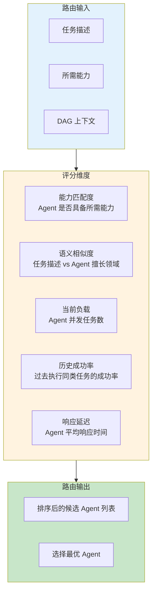
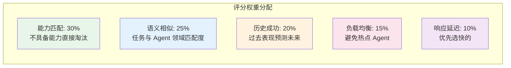
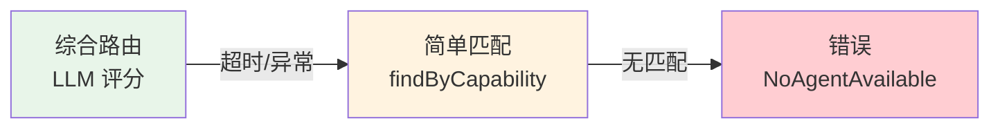
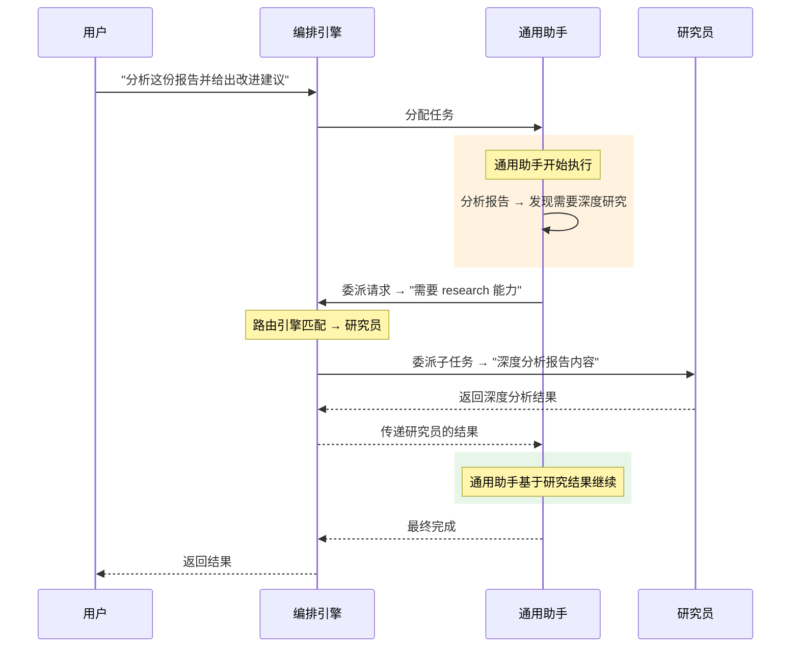
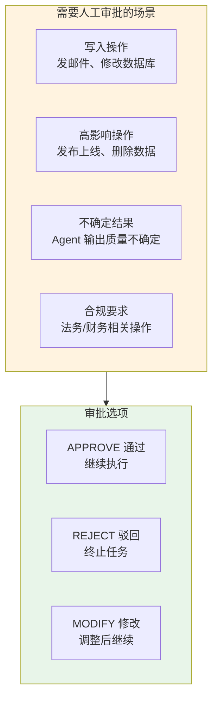
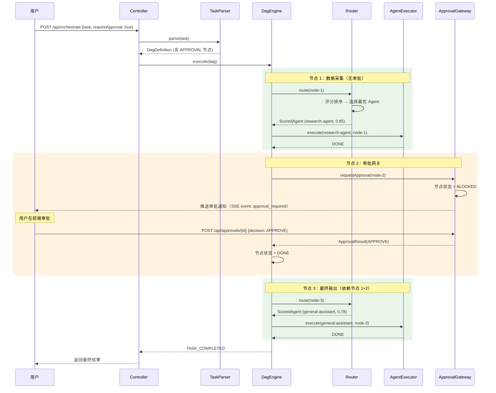
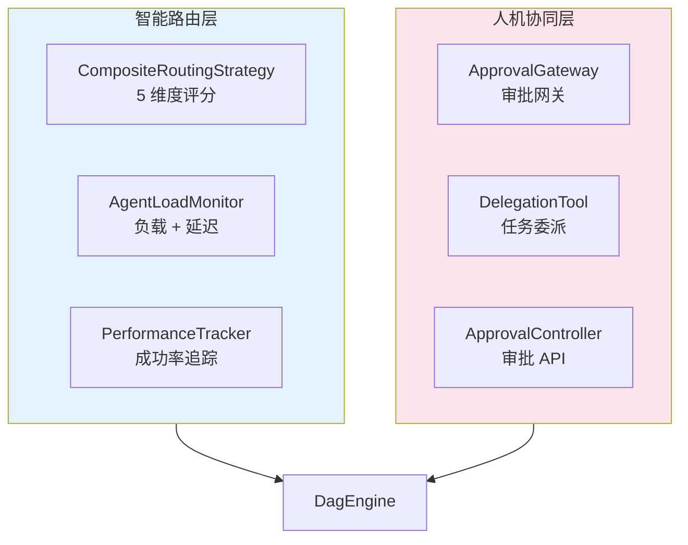

# 04-任务委派与路由

> **定位**：在多 Agent 编排的基础上加入智能路由（根据任务特征自动匹配最优 Agent）和 Human-in-the-Loop 审批网关。读完这篇，你的平台能动态选择最合适的 Agent 执行任务，并在关键决策节点引入人工审批——这是多 Agent 平台从"自动执行"走向"可控自主"的关键一步。本文给出**完整可手写代码**（一行不省略）。

> **读者画像**：已完成迭代二，多 Agent 编排已跑通，现在要让路由更智能、流程更可控。

> **前置阅读**：[03-多Agent编排](03-多Agent编排.md)。

> **关联教程**：[教程 08-Plan-and-Execute模式](../../教程/08-Plan-and-Execute模式.md)、[教程 28-Human-in-the-Loop与审批流](../../教程/28-Human-in-the-Loop与审批流.md)。

> **API 真实性**：LLM 语义评分用 `call().content()`（阻塞调用包 `Mono.fromCallable` + `boundedElastic`）；审批落点在 DAG 审批节点（迭代二引擎扩展），工具级 HITL 的正确落点仍是 `ToolCallingManager`（附录 05-02 §1.3）。

---

## 1. 四问

| 问 | 答 |
|----|----|
| **新增了什么需求** | 多维度智能路由（能力/语义/负载/历史成功率/延迟）；Agent 主动任务委派工具；人工审批网关（APPROVE/REJECT/MODIFY） |
| **影响了哪些模块** | 新增 `RoutingStrategy` 系列、`AgentLoadMonitor`、`AgentPerformanceTracker`、`ApprovalGateway`、`ApprovalController`、`DelegationTool`；升级 `DagEngine`（审批节点 + 路由）、`AgentRouter`（评分路由 + 降级） |
| **架构如何演进** | 从「简单能力匹配」演进为「评分路由 + 降级链」；从「全自动执行」演进为「关键节点人机协同」 |
| **上一版痛点是什么** | ① 简单能力匹配可能把技术文档分给营销 Agent ② Agent 自动执行敏感操作不可控 ③ 用户无法参与决策 |

### 1.1 本节核对（四问）

一句话核对：四问"上一版痛点"三条分别由 §3（语义路由）/§6（审批网关）/§6.5（审批接口让人参与）解决，无虚构痛点。

## 2. 目标与量化验收

| # | 目标 | 验收 |
|---|------|------|
| 1 | 语义路由 | 同一 writing 能力下，技术文档任务优先选技术向 Agent（语义分差 ≥ 0.1） |
| 2 | 负载均衡 | 热点 Agent 活跃任务 ≥ 8 时，新任务路由到更空闲的候选 |
| 3 | 路由降级 | LLM 语义评分超时/异常时降级为简单能力匹配，任务不中断 |
| 4 | 审批闸门 | APPROVAL 节点阻塞等待，APPROVE 继续 / REJECT 终止 / MODIFY 改参后继续 |
| 5 | 委派工具 | Agent 主动 `delegateTask` 时正确路由到专业 Agent 并取回结果 |

**本迭代明确不做**：完整幂等重试、审批超时后的复杂补偿（fail-safe 已内置为超时 REJECT）。

### 2.1 本节核对（验收可测性）

| # | 核对项 | PASS 判据 |
|---|--------|----------|
| 1 | 五条验收 | 每条都有本篇落点：#1→§3.7、#2→§3.7、#3→§4.4、#4→§6.6、#5→§5.4 |
| 2 | "明确不做"清单 | 本篇无完整幂等重试实现（`handleNodeFailure` 仍直置 FAILED），与清单一致 |

---

## 3. 智能路由引擎

### 3.1 路由决策模型



### 3.2 模型与接口

```java
// model/ScoredAgent.java
package com.example.orchestrator.model;

import java.util.Map;

public record ScoredAgent(
        AgentDefinition agent,
        double totalScore,
        Map<String, Double> scoreBreakdown) {}
```

```java
// model/RoutingContext.java
package com.example.orchestrator.model;

import java.util.List;
import java.util.Map;

public record RoutingContext(
        String taskId,
        Map<String, Object> dagContext,
        List<String> completedNodeIds,
        Map<String, String> nodeResults) {}
```

```java
// engine/RoutingStrategy.java
package com.example.orchestrator.engine;

import com.example.orchestrator.model.DagNode;
import com.example.orchestrator.model.RoutingContext;
import com.example.orchestrator.model.ScoredAgent;
import reactor.core.publisher.Mono;

import java.util.List;

/**
 * 路由策略接口：为 DAG 节点返回排序后的候选 Agent（带分数）。
 * 实现类：CompositeRoutingStrategy / RoundRobinStrategy / LeastLoadStrategy。
 */
public interface RoutingStrategy {

    Mono<List<ScoredAgent>> rankCandidates(DagNode node, RoutingContext context);
}
```

### 3.3 `engine/CompositeRoutingStrategy.java`（五维度评分，完整代码）

```java
package com.example.orchestrator.engine;

import com.example.orchestrator.agent.AgentLoadMonitor;
import com.example.orchestrator.agent.AgentPerformanceTracker;
import com.example.orchestrator.agent.AgentRegistry;
import com.example.orchestrator.model.AgentDefinition;
import com.example.orchestrator.model.DagNode;
import com.example.orchestrator.model.RoutingContext;
import com.example.orchestrator.model.ScoredAgent;
import org.springframework.ai.chat.client.ChatClient;
import org.springframework.stereotype.Service;
import reactor.core.publisher.Flux;
import reactor.core.publisher.Mono;
import reactor.core.scheduler.Schedulers;

import java.util.Comparator;
import java.util.List;
import java.util.Map;

@Service
public class CompositeRoutingStrategy implements RoutingStrategy {

    private static final double W_CAPABILITY = 0.30;   // 能力匹配
    private static final double W_SEMANTIC = 0.25;     // 语义相似
    private static final double W_LOAD = 0.15;         // 负载均衡
    private static final double W_SUCCESS = 0.20;      // 历史成功率
    private static final double W_LATENCY = 0.10;      // 响应延迟

    private final AgentRegistry agentRegistry;
    private final AgentLoadMonitor loadMonitor;
    private final AgentPerformanceTracker performanceTracker;
    private final ChatClient chatClient;               // 语义匹配

    public CompositeRoutingStrategy(AgentRegistry agentRegistry,
                                    AgentLoadMonitor loadMonitor,
                                    AgentPerformanceTracker performanceTracker,
                                    ChatClient chatClient) {
        this.agentRegistry = agentRegistry;
        this.loadMonitor = loadMonitor;
        this.performanceTracker = performanceTracker;
        this.chatClient = chatClient;
    }

    @Override
    public Mono<List<ScoredAgent>> rankCandidates(DagNode node, RoutingContext context) {
        return agentRegistry.findByCapability(node.requiredCapability())
                .collectList()
                .flatMap(candidates -> {
                    if (candidates.isEmpty()) {
                        return Mono.just(List.of());
                    }
                    // 并行计算每个候选 Agent 的评分
                    return Flux.fromIterable(candidates)
                            .flatMap(agent -> scoreAgent(agent, node, context))
                            .sort(Comparator.comparingDouble(ScoredAgent::totalScore).reversed())
                            .collectList();
                });
    }

    private Mono<ScoredAgent> scoreAgent(AgentDefinition agent, DagNode node, RoutingContext context) {
        // 维度 1：能力匹配度（有该能力 = 1.0）
        double capabilityScore = agent.capabilities().contains(node.requiredCapability()) ? 1.0 : 0.0;
        // 维度 3：负载评分（越低负载分越高）
        double loadScore = loadMonitor.getLoadScore(agent.agentId());
        // 维度 4：历史成功率
        double successScore = performanceTracker.getSuccessRate(agent.agentId(), node.requiredCapability());
        // 维度 5：延迟评分
        double latencyScore = loadMonitor.getLatencyScore(agent.agentId());

        // 维度 2：语义相似度（LLM 打分）
        return computeSemanticScore(agent, node)
                .map(semanticScore -> {
                    Map<String, Double> breakdown = Map.of(
                            "capability", capabilityScore,
                            "semantic", semanticScore,
                            "load", loadScore,
                            "success", successScore,
                            "latency", latencyScore);

                    double total = capabilityScore * W_CAPABILITY
                            + semanticScore * W_SEMANTIC
                            + loadScore * W_LOAD
                            + successScore * W_SUCCESS
                            + latencyScore * W_LATENCY;
                    return new ScoredAgent(agent, total, breakdown);
                });
    }

    /**
     * 用 LLM 计算任务描述与 Agent 擅长领域的语义匹配度（0.0-1.0）。
     * 阻塞式 .call() 包在 Mono.fromCallable + boundedElastic，避免阻塞 EventLoop。
     */
    private Mono<Double> computeSemanticScore(AgentDefinition agent, DagNode node) {
        String prompt = """
                请评估以下任务描述与 Agent 能力描述的匹配度，返回 0.0 到 1.0 的分数。

                Agent 名称：%s
                Agent 描述：%s
                任务描述：%s

                只返回一个数字，不要其他文字。
                """.formatted(agent.name(), agent.description(), node.description());

        return Mono.fromCallable(() -> {
                    String content = chatClient.prompt()
                            .user(prompt)
                            .call()
                            .content();
                    try {
                        double score = Double.parseDouble(content.trim());
                        return Math.max(0.0, Math.min(1.0, score));   // clamp 0-1
                    } catch (NumberFormatException e) {
                        return 0.5;    // 解析失败给默认分
                    }
                })
                .subscribeOn(Schedulers.boundedElastic())
                .onErrorReturn(0.5);
    }
}
```

### 3.4 评分权重说明



| 权重 | 值 | 设计理由 |
|------|-----|---------|
| 能力匹配 | 30% | 最高权重——不具备能力的 Agent 不该被选中 |
| 语义相似 | 25% | 第二高——同样是 writing 能力，技术文档 vs 营销文案差异巨大 |
| 历史成功 | 20% | 用数据说话——过去成功率高意味着匹配度好 |
| 负载均衡 | 15% | 避免某个 Agent 过载，保证系统吞吐 |
| 响应延迟 | 10% | 锦上添花——前四个维度接近时优先选快的 |

> 「遇到阻塞？→ [教程 32-模型路由与降级](../../教程/32-模型路由与降级.md)」

### 3.5 `agent/AgentLoadMonitor.java`（负载 + 延迟监控，完整代码）

```java
package com.example.orchestrator.agent;

import io.micrometer.core.instrument.Gauge;
import io.micrometer.core.instrument.MeterRegistry;
import org.springframework.stereotype.Service;

import java.util.ArrayDeque;
import java.util.Deque;
import java.util.Map;
import java.util.concurrent.ConcurrentHashMap;
import java.util.concurrent.atomic.AtomicInteger;

@Service
public class AgentLoadMonitor {

    private static final int WINDOW_SIZE = 20;          // 保留最近 20 次耗时
    private static final int MAX_CONCURRENT = 10;        // 单个 Agent 并发上限假设

    private final Map<String, AtomicInteger> activeTasks = new ConcurrentHashMap<>();
    private final Map<String, SlidingWindow> latencyWindows = new ConcurrentHashMap<>();

    public AgentLoadMonitor(MeterRegistry meterRegistry) {
        Gauge.builder("agent.active.tasks", activeTasks,
                        m -> m.values().stream().mapToInt(AtomicInteger::get).sum())
                .description("全部 Agent 的活跃任务总数")
                .register(meterRegistry);
    }

    public void taskStarted(String agentId) {
        activeTasks.computeIfAbsent(agentId, k -> new AtomicInteger(0)).incrementAndGet();
    }

    public void taskCompleted(String agentId, long elapsedMs) {
        activeTasks.getOrDefault(agentId, new AtomicInteger(0)).decrementAndGet();
        latencyWindows.computeIfAbsent(agentId, k -> new SlidingWindow(WINDOW_SIZE))
                .add(elapsedMs);
    }

    /** 负载评分（0-1，越高越好 = 越空闲）。 */
    public double getLoadScore(String agentId) {
        int active = activeTasks.getOrDefault(agentId, new AtomicInteger(0)).get();
        return Math.max(0, 1.0 - (active / (double) MAX_CONCURRENT));
    }

    /** 延迟评分（0-1，越高越好 = 越快）。10s = 0 分，1s = 1 分。 */
    public double getLatencyScore(String agentId) {
        SlidingWindow window = latencyWindows.get(agentId);
        if (window == null || window.isEmpty()) {
            return 0.8;    // 没有历史数据，给较高默认分
        }
        double avgMs = window.average();
        return Math.max(0, Math.min(1, (10000 - avgMs) / 9000));
    }

    /** 滑动窗口：保留最近 N 次耗时样本。 */
    public static final class SlidingWindow {
        private final int capacity;
        private final Deque<Long> samples = new ArrayDeque<>();

        public SlidingWindow(int capacity) {
            this.capacity = capacity;
        }

        public synchronized void add(long value) {
            samples.addLast(value);
            while (samples.size() > capacity) {
                samples.removeFirst();
            }
        }

        public synchronized double average() {
            if (samples.isEmpty()) {
                return 0;
            }
            long sum = 0;
            for (long v : samples) {
                sum += v;
            }
            return sum / (double) samples.size();
        }

        public synchronized boolean isEmpty() {
            return samples.isEmpty();
        }
    }
}
```

### 3.6 `agent/AgentPerformanceTracker.java`（历史成功率）

```java
package com.example.orchestrator.agent;

import org.springframework.stereotype.Service;

import java.util.Map;
import java.util.concurrent.ConcurrentHashMap;

@Service
public class AgentPerformanceTracker {

    private final Map<String, TaskStats> stats = new ConcurrentHashMap<>();

    public void recordResult(String agentId, String capability, boolean success) {
        String key = agentId + ":" + capability;
        stats.merge(key,
                new TaskStats(1, success ? 1 : 0, success ? 0 : 1),
                (old, init) -> new TaskStats(
                        old.totalTasks() + 1,
                        old.successfulTasks() + (success ? 1 : 0),
                        old.failedTasks() + (success ? 0 : 1)));
    }

    public double getSuccessRate(String agentId, String capability) {
        String key = agentId + ":" + capability;
        return stats.getOrDefault(key, new TaskStats(0, 0, 0)).successRate();
    }

    public record TaskStats(int totalTasks, int successfulTasks, int failedTasks) {
        public double successRate() {
            return totalTasks == 0 ? 0.5 : (double) successfulTasks / totalTasks;
        }
    }
}
```

### 3.7 本节测试与验证（五维评分与语义路由）

**前置条件**：03 篇全部验证通过；本篇 §3.2–§3.6 类已手写；注册一个与 `research-agent` 同能力（research）但描述偏"营销文案"的对照 Agent（yml 复制改 id/description 即可）。

**材料——路由对照探针**：

```bash
# 同为 research/writing 能力，语义应偏向技术向 Agent
curl -X POST http://localhost:8080/api/orchestrate \
  -H "Content-Type: application/json" \
  -d '{"task":"深度调研 JVM 垃圾回收器的技术演进并输出技术报告","requireApproval":false}'
curl http://localhost:8080/actuator/metrics/agent.active.tasks
```

**步骤与断言**：

| # | 操作 | 预期（PASS 判据） |
|---|------|------------------|
| 1 | 权重走查 | 五权重之和 = 1.00（0.30+0.25+0.20+0.15+0.10），与 §3.4 表一致 |
| 2 | 材料①（含对照 Agent） | 技术向任务的 `assigned_agent` 命中技术向 Agent，语义分差 ≥ 0.1（§2 验收 #1；可临时在 `scoreAgent` 加日志打印 breakdown 核对） |
| 3 | 语义评分输出非数字（临时改 Prompt 让模型回话） | `NumberFormatException` 分支给 0.5 默认分，路由不崩（`computeSemanticScore` 的 clamp/兜底生效） |
| 4 | 材料② Gauge | 有编排任务运行时值 > 0，空闲时回落 0（负载监控真实接线——若 DagEngine 未调 `taskStarted/taskCompleted` 则恒 0，需补接线） |
| 5 | 连续完成若干任务后观察路由 | `AgentPerformanceTracker` 有累计（成功任务路由权重上升——可通过 breakdown 的 success 分核对） |

**失败排查**：语义不区分→两个 Agent 的 `description` 写得雷同（描述就是语义路由的语料）；Gauge 恒 0→`taskStarted/taskCompleted` 未在执行链路调用；评分全 0.5→LLM 输出解析失败（看 §3.3 的 catch 分支日志）。

---

## 4. 路由门面与降级

### 4.1 `engine/AgentRouter.java`（升级：评分路由 + 降级链）

```java
package com.example.orchestrator.engine;

import com.example.orchestrator.agent.AgentRegistry;
import com.example.orchestrator.model.AgentDefinition;
import com.example.orchestrator.model.DagNode;
import com.example.orchestrator.model.NoAgentAvailableException;
import com.example.orchestrator.model.RoutingContext;
import org.slf4j.Logger;
import org.slf4j.LoggerFactory;
import org.springframework.stereotype.Component;
import reactor.core.publisher.Mono;

import java.time.Duration;

/**
 * 节点 → Agent 路由门面。
 * 三级降级链：综合评分 → 超时/异常/无候选 → 简单能力匹配 → 无 Agent 报错。
 */
@Component
public class AgentRouter {

    private static final Logger log = LoggerFactory.getLogger(AgentRouter.class);

    private final RoutingStrategy routingStrategy;
    private final AgentRegistry agentRegistry;

    public AgentRouter(RoutingStrategy routingStrategy, AgentRegistry agentRegistry) {
        this.routingStrategy = routingStrategy;
        this.agentRegistry = agentRegistry;
    }

    public Mono<AgentDefinition> route(DagNode node, RoutingContext context) {
        return routingStrategy.rankCandidates(node, context)
                .timeout(Duration.ofSeconds(5))          // 5 秒超时
                .flatMap(candidates -> {
                    if (candidates.isEmpty()) {
                        return fallbackToSimpleMatch(node);
                    }
                    return Mono.just(candidates.get(0).agent());
                })
                .onErrorResume(ex -> {
                    log.warn("Composite routing failed, falling back: {}", ex.getMessage());
                    return fallbackToSimpleMatch(node);   // 异常降级
                });
    }

    private Mono<AgentDefinition> fallbackToSimpleMatch(DagNode node) {
        return agentRegistry.findByCapability(node.requiredCapability())
                .next()
                .switchIfEmpty(Mono.error(new NoAgentAvailableException(
                        node.requiredCapability())));
    }
}
```

### 4.2 路由策略可配置化

```java
// engine/RoundRobinStrategy.java
package com.example.orchestrator.engine;

import com.example.orchestrator.agent.AgentRegistry;
import com.example.orchestrator.model.DagNode;
import com.example.orchestrator.model.RoutingContext;
import com.example.orchestrator.model.ScoredAgent;
import org.springframework.stereotype.Service;
import reactor.core.publisher.Mono;

import java.util.List;
import java.util.Map;
import java.util.concurrent.atomic.AtomicInteger;

@Service("roundRobinStrategy")
public class RoundRobinStrategy implements RoutingStrategy {

    private final AgentRegistry agentRegistry;
    private final AtomicInteger counter = new AtomicInteger(0);

    public RoundRobinStrategy(AgentRegistry agentRegistry) {
        this.agentRegistry = agentRegistry;
    }

    @Override
    public Mono<List<ScoredAgent>> rankCandidates(DagNode node, RoutingContext context) {
        return agentRegistry.findByCapability(node.requiredCapability())
                .collectList()
                .map(candidates -> {
                    if (candidates.isEmpty()) {
                        return List.<ScoredAgent>of();
                    }
                    int idx = Math.floorMod(counter.getAndIncrement(), candidates.size());
                    var chosen = candidates.get(idx);
                    return List.of(new ScoredAgent(chosen, 1.0,
                            Map.of("round-robin", 1.0)));
                });
    }
}
```

```java
// engine/LeastLoadStrategy.java
package com.example.orchestrator.engine;

import com.example.orchestrator.agent.AgentLoadMonitor;
import com.example.orchestrator.agent.AgentRegistry;
import com.example.orchestrator.model.DagNode;
import com.example.orchestrator.model.RoutingContext;
import com.example.orchestrator.model.ScoredAgent;
import org.springframework.stereotype.Service;
import reactor.core.publisher.Mono;

import java.util.Comparator;
import java.util.List;
import java.util.Map;

@Service("leastLoadStrategy")
public class LeastLoadStrategy implements RoutingStrategy {

    private final AgentRegistry agentRegistry;
    private final AgentLoadMonitor loadMonitor;

    public LeastLoadStrategy(AgentRegistry agentRegistry, AgentLoadMonitor loadMonitor) {
        this.agentRegistry = agentRegistry;
        this.loadMonitor = loadMonitor;
    }

    @Override
    public Mono<List<ScoredAgent>> rankCandidates(DagNode node, RoutingContext context) {
        return agentRegistry.findByCapability(node.requiredCapability())
                .collectList()
                .map(candidates -> candidates.stream()
                        .sorted(Comparator.comparingDouble(
                                a -> loadMonitor.getLoadScore(a.agentId())).reversed())
                        .map(a -> new ScoredAgent(a,
                                loadMonitor.getLoadScore(a.agentId()),
                                Map.of("load", loadMonitor.getLoadScore(a.agentId()))))
                        .toList());
    }
}
```

```java
// config/RoutingConfig.java
package com.example.orchestrator.config;

import com.example.orchestrator.engine.CompositeRoutingStrategy;
import com.example.orchestrator.engine.LeastLoadStrategy;
import com.example.orchestrator.engine.RoundRobinStrategy;
import com.example.orchestrator.engine.RoutingStrategy;
import org.springframework.beans.factory.annotation.Value;
import org.springframework.context.annotation.Bean;
import org.springframework.context.annotation.Configuration;
import org.springframework.context.annotation.Primary;

@Configuration
public class RoutingConfig {

    @Bean
    @Primary
    public RoutingStrategy routingStrategy(
            CompositeRoutingStrategy composite,
            RoundRobinStrategy roundRobin,
            LeastLoadStrategy leastLoad,
            @Value("${agent.routing.strategy:composite}") String strategy) {
        return switch (strategy) {
            case "round-robin" -> roundRobin;
            case "least-load" -> leastLoad;
            default -> composite;
        };
    }
}
```

`application.yml` 追加：

```yaml
agent:
  routing:
    strategy: composite   # composite | round-robin | least-load
```

### 4.3 路由降级链



> 「遇到阻塞？→ [教程 30-容错与弹性设计](../../教程/30-容错与弹性设计.md)」

### 4.4 本节测试与验证（降级链与策略切换）

**前置条件**：§3.7 已通过；`RoutingConfig` 与 yml 开关已配置。

**材料——策略切换与故障注入**：

```bash
# 策略切换核对（改 yml 后重启）：
#   agent.routing.strategy: round-robin / least-load / composite
# 故障注入：临时把 parserChatClient 的 base-url 指向不可达地址，触发语义评分超时/异常
curl -X POST http://localhost:8080/api/orchestrate \
  -H "Content-Type: application/json" \
  -d '{"task":"翻译一段技术摘要为英文","requireApproval":false}'
```

**步骤与断言**：

| # | 操作 | 预期（PASS 判据） |
|---|------|------------------|
| 1 | strategy=round-robin，连续 3 次同能力任务 | 候选 Agent 轮流被选（`AtomicInteger` 递增取模） |
| 2 | strategy=least-load，人为让某 Agent 高负载 | 新任务路由到 `getLoadScore` 更高的空闲 Agent |
| 3 | 故障注入后提交任务 | 日志出现 `Composite routing failed, falling back`，任务**仍完成**（降级为 `findByCapability` 简单匹配，§2 验收 #3） |
| 4 | 故障恢复后 | 重新走综合评分（降级是按次降级，不是永久切换） |
| 5 | 请求一个无人具备的能力（如临时注册 `requiredCapability: aviation` 的手工 DAG） | 抛 `NoAgentAvailableException`，任务以 FAILED 收敛（链尾兜底，不悬挂） |

**失败排查**：切换不生效→`@Value("${agent.routing.strategy:composite}")` 默认值写死或未重启；降级后任务也失败→`fallbackToSimpleMatch` 的能力标签拼错；5 秒超时不触发→`timeout` 没包在 `rankCandidates` 外层。

---

## 5. 任务委派机制

### 5.1 什么是任务委派

任务委派是 Agent 间的高级协作模式——Agent A 在执行过程中发现某个子任务超出自己的能力范围，主动将子任务委派给更专业的 Agent B：



### 5.2 `agent/tools/DelegationTool.java`（委派工具，完整代码）

```java
package com.example.orchestrator.agent.tools;

import com.example.orchestrator.agent.AgentExecutor;
import com.example.orchestrator.engine.RoutingStrategy;
import com.example.orchestrator.model.AgentDefinition;
import com.example.orchestrator.model.DagNode;
import com.example.orchestrator.model.NodeStatus;
import com.example.orchestrator.model.NodeType;
import com.example.orchestrator.model.RoutingContext;
import com.example.orchestrator.model.ScoredAgent;
import org.springframework.ai.tool.annotation.Tool;
import org.springframework.ai.tool.annotation.ToolParam;
import org.springframework.stereotype.Component;
import reactor.core.publisher.Mono;
import reactor.core.scheduler.Schedulers;

import java.util.List;
import java.util.Map;
import java.util.UUID;
import java.util.stream.Collectors;

/**
 * 让 Agent 能主动发起委派。@Tool 方法是同步的；把阻塞式委派流程挪到 boundedElastic，
 * 避免阻塞 EventLoop（WebFlux 铁律）。
 */
@Component
public class DelegationTool {

    private final RoutingStrategy routingStrategy;
    private final AgentExecutor agentExecutor;

    public DelegationTool(RoutingStrategy routingStrategy, AgentExecutor agentExecutor) {
        this.routingStrategy = routingStrategy;
        this.agentExecutor = agentExecutor;
    }

    @Tool(description = """
            将子任务委派给其他专业 Agent 执行。
            当遇到需要特定专业能力（如深度研究、翻译、数据分析）的任务时，
            使用此工具委派给更专业的 Agent。
            """)
    public String delegateTask(
            @ToolParam(description = "委派的任务描述") String taskDescription,
            @ToolParam(description = "需要的能力标签，如 research、translation") String capability) {

        return Mono.fromCallable(() -> delegateSync(taskDescription, capability))
                .subscribeOn(Schedulers.boundedElastic())
                .block();
    }

    private String delegateSync(String taskDescription, String capability) {
        DagNode delegateNode = new DagNode(
                UUID.randomUUID().toString(), taskDescription, capability,
                NodeType.TASK, Map.of(), NodeStatus.PENDING,
                null, null, null, null, 0);
        RoutingContext ctx = new RoutingContext("delegation", Map.of(), List.of(), Map.of());

        try {
            List<ScoredAgent> ranked = routingStrategy.rankCandidates(delegateNode, ctx).block();
            if (ranked == null || ranked.isEmpty()) {
                return "委派失败: 没有具备 " + capability + " 能力的 Agent";
            }
            AgentDefinition delegateAgent = ranked.get(0).agent();
            return agentExecutor.execute(delegateAgent, taskDescription, List.of())
                    .collectList()
                    .block()
                    .stream()
                    .collect(Collectors.joining());
        } catch (Exception e) {
            return "委派失败: " + e.getMessage();
        }
    }
}
```

### 5.3 委派与 DAG 编排的区别

| 维度 | DAG 编排 | 任务委派 |
|------|---------|---------|
| 触发方 | 编排引擎（顶层） | Agent 自主（运行时） |
| 时机 | 任务开始前已知 | 执行过程中动态决定 |
| 结构 | 预定义的 DAG | 运行时发现 |
| 耦合 | 松耦合 | Agent 间有调用关系 |

DAG 编排是 Plan-and-Execute 模式——先规划再执行。委派是 ReAct 模式——执行中发现需要帮助。

> 「遇到阻塞？→ [教程 08-Plan-and-Execute模式](../../教程/08-Plan-and-Execute模式.md)」

### 5.4 本节测试与验证（Agent 主动委派）

**前置条件**：`DelegationTool` 已注册到 general-assistant 的 `tool-bean-names`（yml 追加 `delegationTool`）。

**材料——委派探针 curl**：

```bash
# ① 触发委派：通用助手不具备深度研究专长，应调 delegateTask
curl -N -X POST http://localhost:8080/api/agents/general-assistant/chat/stream \
  -H "Content-Type: application/json" \
  -d '{"sessionId":"dele-001","message":"帮我深度研究一下多Agent框架对比，给出专业分析"}'
# ② 无人具备的能力（阴性样本）
curl -N -X POST http://localhost:8080/api/agents/general-assistant/chat/stream \
  -H "Content-Type: application/json" \
  -d '{"sessionId":"dele-002","message":"把这个任务委派给有 aviation 能力的 Agent"}'
```

**步骤与断言**：

| # | 操作 | 预期（PASS 判据） |
|---|------|------------------|
| 1 | 材料① | 日志出现 `[TOOL_CALL] name=delegateTask`；回复内容含研究型产出（research-agent 的输出被带回并转述） |
| 2 | 材料② | 回复含"委派失败: 没有具备 aviation 能力的 Agent"（空候选分支的友好文案，非异常堆栈） |
| 3 | 委派期间 `jstack` | 无 EventLoop 线程 BLOCKED（阻塞被挪到 `boundedElastic`，§5.2 注释的铁律） |
| 4 | 委派全程耗时段 | `rankCandidates.block()` + `execute…block()` 均在 boundedElastic 栈上（线程名 `boundedElastic-*`） |

**失败排查**：工具不触发→`tool-bean-names` 没加 `delegationTool`；回复直接自己编→systemPrompt 未引导"专业任务优先委派"；EventLoop 阻塞告警→忘了 `subscribeOn(Schedulers.boundedElastic())`。

---

## 6. Human-in-the-Loop 审批网关

### 6.1 审批场景

并非所有任务都应该全自动执行。以下场景需要人工介入：



### 6.2 审批模型

```java
// model/ApprovalRequest.java
package com.example.orchestrator.model;

import java.time.LocalDateTime;
import java.util.Map;

public record ApprovalRequest(
        String requestId,
        String taskId,
        String nodeId,
        String summary,             // 审批摘要
        String proposedAction,      // 拟执行的操作
        Map<String, Object> details,
        LocalDateTime createdAt) {}
```

```java
// model/ApprovalResult.java
package com.example.orchestrator.model;

import java.time.LocalDateTime;
import java.util.Map;

public record ApprovalResult(
        String requestId,
        ApprovalDecision decision,      // APPROVE / REJECT / MODIFY
        String comment,                 // 审批意见
        Map<String, Object> modifications,  // MODIFY 时携带的修改
        String approver,
        LocalDateTime decidedAt) {}
```

```java
// model/ApprovalDecision.java
package com.example.orchestrator.model;

public enum ApprovalDecision {
    APPROVE,
    REJECT,
    MODIFY
}
```

### 6.3 `engine/ApprovalGateway.java`（审批网关，完整代码）

```java
package com.example.orchestrator.engine;

import com.example.orchestrator.model.ApprovalRequest;
import com.example.orchestrator.model.ApprovalResult;
import com.example.orchestrator.model.NodeStatus;
import com.example.orchestrator.store.TaskStateStore;
import org.springframework.stereotype.Service;
import reactor.core.publisher.Flux;
import reactor.core.publisher.Mono;
import reactor.core.publisher.Sinks;

import java.time.Duration;
import java.time.LocalDateTime;
import java.util.Map;
import java.util.concurrent.ConcurrentHashMap;

@Service
public class ApprovalGateway {

    private final TaskStateStore stateStore;

    // 等待中的审批：requestId -> 结果 Sink
    private final Map<String, Sinks.One<ApprovalResult>> pendingSinks = new ConcurrentHashMap<>();
    // 待审批列表（SSE 推送）
    private final Sinks.Many<ApprovalRequest> pendingApprovals =
            Sinks.many().multicast().onBackpressureBuffer();

    public ApprovalGateway(TaskStateStore stateStore) {
        this.stateStore = stateStore;
    }

    /**
     * 请求审批：标记节点 BLOCKED → 保存审批请求 → 通知订阅者 → 挂起等待审批结果。
     * 1 小时超时视为 REJECT（fail-safe：不自动通过）。
     */
    public Mono<ApprovalResult> requestApproval(String taskId, String nodeId, ApprovalRequest request) {
        Sinks.One<ApprovalResult> sink = Sinks.one();
        pendingSinks.put(request.requestId(), sink);

        return stateStore.updateNodeStatus(taskId, nodeId, NodeStatus.BLOCKED, null)
                .then(Mono.just(request))
                .doOnNext(pendingApprovals::tryEmitNext)
                .then(sink.asMono()
                        .timeout(Duration.ofHours(1),
                                Mono.just(new ApprovalResult(request.requestId(),
                                        ApprovalDecision.REJECT, "审批超时自动拒绝",
                                        Map.of(), "system", LocalDateTime.now())))
                        .doFinally(sig -> pendingSinks.remove(request.requestId())));
    }

    /** 提交审批结果：完成对应请求的 Sink，唤醒等待的 DAG 执行。 */
    public Mono<Void> submitApproval(ApprovalResult result) {
        Sinks.One<ApprovalResult> sink = pendingSinks.get(result.requestId());
        if (sink != null) {
            sink.tryEmitValue(result);
        }
        return Mono.empty();
    }

    /** 待审批列表（前端轮询 / SSE 推送）。 */
    public Flux<ApprovalRequest> pendingApprovals() {
        return pendingApprovals.asFlux();
    }
}
```

### 6.4 DAG 引擎集成审批 + 路由

在迭代二 `DagEngine` 基础上升级：`executeNode` 检查 `APPROVAL` 节点走审批；普通节点走 `AgentRouter.route(node, context)`。

```java
package com.example.orchestrator.engine;

import com.example.orchestrator.agent.AgentExecutor;
import com.example.orchestrator.model.ApprovalRequest;
import com.example.orchestrator.model.DagDefinition;
import com.example.orchestrator.model.DagEvent;
import com.example.orchestrator.model.DagNode;
import com.example.orchestrator.model.EventType;
import com.example.orchestrator.model.NodeStatus;
import com.example.orchestrator.model.NodeType;
import com.example.orchestrator.model.RoutingContext;
import com.example.orchestrator.store.TaskStateStore;
import org.springframework.stereotype.Service;
import reactor.core.publisher.Flux;
import reactor.core.publisher.Mono;

import java.time.LocalDateTime;
import java.util.List;
import java.util.Map;
import java.util.Set;
import java.util.UUID;
import java.util.concurrent.ConcurrentHashMap;
import java.util.stream.Collectors;

@Service
public class DagEngine {

    private static final int MAX_CONCURRENCY = 10;

    private final AgentRouter agentRouter;
    private final AgentExecutor agentExecutor;
    private final TaskStateStore stateStore;
    private final ApprovalGateway approvalGateway;
    private final Set<String> claimed = ConcurrentHashMap.newKeySet();

    public DagEngine(AgentRouter agentRouter, AgentExecutor agentExecutor,
                     TaskStateStore stateStore, ApprovalGateway approvalGateway) {
        this.agentRouter = agentRouter;
        this.agentExecutor = agentExecutor;
        this.stateStore = stateStore;
        this.approvalGateway = approvalGateway;
    }

    public Flux<DagEvent> execute(DagDefinition dag) {
        List<DagNode> pendingNodes = dag.nodes().stream()
                .map(n -> new DagNode(n.nodeId(), n.description(), n.requiredCapability(),
                        n.type(), n.config(), NodeStatus.PENDING,
                        null, null, null, null, 0))
                .toList();
        DagDefinition init = new DagDefinition(dag.dagId(), dag.taskId(),
                pendingNodes, dag.edges(), dag.globalContext());

        return stateStore.saveDag(init)
                .thenMany(Flux.defer(() -> schedule(init)));
    }

    private Flux<DagEvent> schedule(DagDefinition dag) {
        List<DagNode> ready = findReadyNodes(dag);
        if (ready.isEmpty()) {
            boolean anyRunning = dag.nodes().stream()
                    .anyMatch(n -> n.status() == NodeStatus.RUNNING);
            if (allDone(dag)) {
                return Flux.just(new DagEvent(dag.dagId(), null,
                        EventType.TASK_COMPLETED, "All nodes done"));
            }
            if (!anyRunning && anyFailed(dag)) {
                return Flux.just(new DagEvent(dag.dagId(), null,
                        EventType.TASK_FAILED, "Task failed"));
            }
            return Flux.empty();
        }
        return Flux.fromIterable(ready)
                .flatMap(node -> tryClaim(dag, node)
                        .flatMapMany(ok -> ok ? executeNode(dag, node) : Flux.empty()),
                        MAX_CONCURRENCY);
    }

    private Flux<DagEvent> executeNode(DagDefinition dag, DagNode node) {
        // 审批节点：阻塞等待人工决策
        if (node.type() == NodeType.APPROVAL) {
            return executeApprovalNode(dag, node);
        }
        // 普通节点：评分路由 → 执行
        RoutingContext ctx = buildContext(dag);
        return agentRouter.route(node, ctx)
                .flatMapMany(agent -> {
                    String prompt = buildNodePrompt(dag, node);
                    return stateStore.updateNodeStatus(dag.taskId(), node.nodeId(),
                                    NodeStatus.RUNNING, agent.agentId())
                            .flatMapMany(updated ->
                                    agentExecutor.execute(agent, prompt, List.of())
                                            .collectList()
                                            .flatMapMany(tokens -> {
                                                String result = String.join("", tokens);
                                                return stateStore.updateNodeResult(
                                                                dag.taskId(), node.nodeId(),
                                                                result, NodeStatus.DONE)
                                                        .flatMapMany(updatedDone -> Flux.concat(
                                                                Flux.just(new DagEvent(dag.dagId(), node.nodeId(),
                                                                        EventType.NODE_COMPLETED, result)),
                                                                schedule(updatedDone)));
                                            })
                                            .onErrorResume(ex -> handleNodeFailure(dag, node, ex)));
                });
    }

    private Flux<DagEvent> executeApprovalNode(DagDefinition dag, DagNode node) {
        ApprovalRequest request = new ApprovalRequest(
                UUID.randomUUID().toString(), dag.taskId(), node.nodeId(),
                node.description(), "审批节点：" + node.description(),
                node.config() != null ? node.config() : Map.of(),
                LocalDateTime.now());

        return approvalGateway.requestApproval(dag.taskId(), node.nodeId(), request)
                .flatMapMany(result -> switch (result.decision()) {
                    case APPROVE -> stateStore.updateNodeResult(
                                    dag.taskId(), node.nodeId(),
                                    "Approved: " + result.comment(), NodeStatus.DONE)
                            .flatMapMany(updated -> Flux.concat(
                                    Flux.just(new DagEvent(dag.dagId(), node.nodeId(),
                                            EventType.NODE_COMPLETED, "Approved")),
                                    schedule(updated)));
                    case REJECT -> stateStore.updateNodeStatus(
                                    dag.taskId(), node.nodeId(), NodeStatus.FAILED, null)
                            .flatMapMany(updated -> Flux.just(new DagEvent(dag.dagId(), node.nodeId(),
                                    EventType.TASK_FAILED, "Rejected: " + result.comment())));
                    case MODIFY -> stateStore.updateGlobalContext(
                                    dag.taskId(), result.modifications())
                            .then(stateStore.updateNodeResult(
                                    dag.taskId(), node.nodeId(),
                                    "Modified: " + result.comment(), NodeStatus.DONE))
                            .flatMapMany(updated -> Flux.concat(
                                    Flux.just(new DagEvent(dag.dagId(), node.nodeId(),
                                            EventType.NODE_COMPLETED, "Modified")),
                                    schedule(updated)));
                });
    }

    private Flux<DagEvent> handleNodeFailure(DagDefinition dag, DagNode node, Throwable ex) {
        return stateStore.updateNodeResult(dag.taskId(), node.nodeId(),
                        "ERROR: " + ex.getMessage(), NodeStatus.FAILED)
                .flatMapMany(updated -> Flux.concat(
                        Flux.just(new DagEvent(dag.dagId(), node.nodeId(),
                                EventType.NODE_FAILED, ex.getMessage())),
                        schedule(updated)));
    }

    private Mono<Boolean> tryClaim(DagDefinition dag, DagNode node) {
        return Mono.fromCallable(() -> claimed.add(dag.taskId() + ":" + node.nodeId()));
    }

    private List<DagNode> findReadyNodes(DagDefinition dag) {
        Set<String> done = dag.nodes().stream()
                .filter(n -> n.status() == NodeStatus.DONE)
                .map(DagNode::nodeId)
                .collect(Collectors.toSet());
        return dag.nodes().stream()
                .filter(n -> n.status() == NodeStatus.PENDING)
                .filter(n -> dag.edges().stream()
                        .filter(e -> e.to().equals(n.nodeId()))
                        .allMatch(e -> done.contains(e.from())))
                .filter(n -> !claimed.contains(dag.taskId() + ":" + n.nodeId()))
                .toList();
    }

    private RoutingContext buildContext(DagDefinition dag) {
        List<String> done = dag.nodes().stream()
                .filter(n -> n.status() == NodeStatus.DONE)
                .map(DagNode::nodeId)
                .toList();
        Map<String, String> results = dag.nodes().stream()
                .filter(n -> n.result() != null)
                .collect(Collectors.toMap(DagNode::nodeId, DagNode::result));
        return new RoutingContext(dag.taskId(), dag.globalContext(), done, results);
    }

    private String buildNodePrompt(DagDefinition dag, DagNode node) {
        StringBuilder sb = new StringBuilder();
        sb.append("任务编号：").append(node.nodeId()).append("\n");
        sb.append("任务描述：").append(node.description()).append("\n");
        if (dag.globalContext() != null && !dag.globalContext().isEmpty()) {
            sb.append("全局上下文：").append(dag.globalContext()).append("\n");
        }
        sb.append("请完成上述子任务，直接给出结果。");
        return sb.toString();
    }

    private boolean allDone(DagDefinition dag) {
        return dag.nodes().stream().allMatch(n -> n.status() == NodeStatus.DONE);
    }

    private boolean anyFailed(DagDefinition dag) {
        return dag.nodes().stream().anyMatch(n -> n.status() == NodeStatus.FAILED);
    }
}
```

### 6.5 审批接口

```java
// web/ApprovalController.java
package com.example.orchestrator.web;

import com.example.orchestrator.engine.ApprovalGateway;
import com.example.orchestrator.model.ApprovalDecision;
import com.example.orchestrator.model.ApprovalRequest;
import com.example.orchestrator.model.ApprovalResult;
import org.springframework.http.ResponseEntity;
import org.springframework.web.bind.annotation.GetMapping;
import org.springframework.web.bind.annotation.PathVariable;
import org.springframework.web.bind.annotation.PostMapping;
import org.springframework.web.bind.annotation.RequestBody;
import org.springframework.web.bind.annotation.RequestMapping;
import org.springframework.web.bind.annotation.RestController;
import reactor.core.publisher.Flux;
import reactor.core.publisher.Mono;

import java.time.LocalDateTime;
import java.util.Map;

@RestController
@RequestMapping("/api/approvals")
public class ApprovalController {

    private final ApprovalGateway gateway;

    public ApprovalController(ApprovalGateway gateway) {
        this.gateway = gateway;
    }

    /** 获取待审批列表（轮询 / SSE 推送）。 */
    @GetMapping("/pending")
    public Flux<ApprovalRequest> pendingApprovals() {
        return gateway.pendingApprovals();
    }

    /** 提交审批。 */
    @PostMapping("/{requestId}")
    public Mono<ResponseEntity<Void>> submit(
            @PathVariable String requestId,
            @RequestBody SubmitApprovalRequest request) {
        return gateway.submitApproval(new ApprovalResult(
                        requestId,
                        request.decision(),
                        request.comment(),
                        request.modifications() != null ? request.modifications() : Map.of(),
                        request.approver(),
                        LocalDateTime.now()))
                .then(Mono.just(ResponseEntity.ok().build()));
    }

    public record SubmitApprovalRequest(
            ApprovalDecision decision,
            String comment,
            Map<String, Object> modifications,
            String approver) {}
}
```

> 「遇到阻塞？→ [教程 28-Human-in-the-Loop与审批流](../../教程/28-Human-in-the-Loop与审批流.md)」

### 6.6 本节测试与验证（审批三决策与 fail-safe）

**前置条件**：升级版 `DagEngine`/`ApprovalGateway`/`ApprovalController` 已就绪；能拆出 APPROVAL 节点的任务可用（`requireApproval: true`）。

**材料——审批剧本**（复用 §8.1/§8.2 curl）：

```bash
# 提交含审批的任务（先开 SSE 再提交）
curl -N http://localhost:8080/api/orchestrate/<taskId>/stream &
curl -X POST http://localhost:8080/api/orchestrate \
  -H "Content-Type: application/json" \
  -d '{"task":"翻译一份技术文档为英文，然后审核翻译质量","requireApproval":true}'
# 待审批列表 + 提交决策
curl http://localhost:8080/api/approvals/pending
curl -X POST http://localhost:8080/api/approvals/<requestId> \
  -H "Content-Type: application/json" \
  -d '{"decision":"APPROVE","comment":"通过","approver":"admin"}'
# REJECT / MODIFY 剧本改 decision 与加 modifications 即可：
# {"decision":"MODIFY","comment":"调整语气","modifications":{"tone":"formal"},"approver":"admin"}
```

**步骤与断言**：

| # | 操作 | 预期（PASS 判据） |
|---|------|------------------|
| 1 | 提交后查 `redis-cli GET dag:def:<taskId>` | 审批节点状态 = `BLOCKED`（非 RUNNING），普通节点不受阻 |
| 2 | APPROVE 剧本 | 审批节点 → DONE，`node_completed` 后下游节点继续，最终 `task_completed` |
| 3 | REJECT 剧本 | 收到 `TASK_FAILED`（data 含 `Rejected:`），任务终止不继续 |
| 4 | MODIFY 剧本 | `modifications` 合并进 `globalContext`（redis-cli 复核 `tone=formal` 在场），节点 DONE 后继续 |
| 5 | 挂起期间 `jstack` | 无 BLOCKED 线程（Sinks 挂起零线程占用） |
| 6 | 超时 fail-safe（把 1 小时临时改 5 秒，或单测直接调 `requestApproval` 不审批） | 超时后返回 REJECT"审批超时自动拒绝"，`pendingSinks` 无泄漏（`doFinally` 清理） |

**失败排查**：不进 BLOCKED→`node.type()` 没被 TaskParser 拆成 APPROVAL（检查 requireApproval 传递）；审批后不唤醒→`submitApproval` 的 requestId 与请求不一致；MODIFY 不生效→`updateGlobalContext` 未被调用或下游 prompt 没读 globalContext。

---

## 7. 完整路由 + 审批流程



### 7.1 本节核对（时序图与实现一致性）

| # | 核对项 | PASS 判据 |
|---|--------|----------|
| 1 | 时序图三段 | 与 §6.4 代码路径一致：普通节点走 `route → execute`，审批节点走 `requestApproval → 挂起 → 唤醒` |
| 2 | 事件名 | 图中 `approval_required` 事件由 `ApprovalGateway.pendingApprovals()` 通道承载（00 篇 §5.2 已说明不在 `EventType` 枚举中），与实现不矛盾 |

---

## 8. 完整测试

### 8.1 测试智能路由

```bash
curl -X POST http://localhost:8080/api/orchestrate \
  -H "Content-Type: application/json" \
  -d '{
    "task": "翻译一份技术文档为英文，然后审核翻译质量",
    "requireApproval": true
  }'

# SSE 追踪路由决策
curl -N http://localhost:8080/api/orchestrate/{taskId}/stream
```

### 8.2 测试审批流程

```bash
# 查看待审批
curl http://localhost:8080/api/approvals/pending

# 提交审批
curl -X POST http://localhost:8080/api/approvals/{requestId} \
  -H "Content-Type: application/json" \
  -d '{
    "decision": "APPROVE",
    "comment": "翻译质量良好，通过",
    "approver": "admin"
  }'
```

### 8.3 SSE 事件流（含审批）

```
event:dag_created
data:{"nodes":3,"edges":2}

event:node_started
data:{"nodeId":"node-1","agent":"translator-agent","score":0.87}

event:node_completed
data:{"nodeId":"node-1","result":"Translation completed: 'The system scales horizontally using a message-driven architecture to handle thousands of concurrent agents.'"}

event:approval_required
data:{"nodeId":"node-2","requestId":"apr-001","summary":"审核翻译质量"}

event:node_started
data:{"nodeId":"node-3","agent":"research-agent","score":0.82}

event:task_completed
data:{"totalTime":"45s","approvals":1}
```

### 8.4 本节核对（既有验证节定位）

说明：本篇 §8 本身就是"完整测试"节（§8.1 路由 curl / §8.2 审批 curl / §8.3 事件流），其材料已作为 §3.7/§4.4/§6.6 的探针复用——无需插入重复小节；§8.3 的 `score`/`approvals` 字段为设计期示意，实测以 `DagEvent.data` 真实字段为准。

---

## 9. 迭代三代码回顾

| 文件 | 职责 | 新增/升级 |
|------|------|----------|
| `engine/CompositeRoutingStrategy.java` | 多维度智能路由 | 新增 |
| `engine/RoundRobinStrategy.java` | 轮询路由 | 新增 |
| `engine/LeastLoadStrategy.java` | 最小负载路由 | 新增 |
| `agent/AgentLoadMonitor.java` | Agent 负载 + 延迟监控 | 新增 |
| `agent/AgentPerformanceTracker.java` | 历史成功率追踪 | 新增 |
| `agent/tools/DelegationTool.java` | Agent 主动委派工具 | 新增 |
| `engine/ApprovalGateway.java` | 审批网关 | 新增 |
| `web/ApprovalController.java` | 审批 API | 新增 |
| `config/RoutingConfig.java` | 路由策略可配置 | 新增 |
| `engine/AgentRouter.java` | 评分路由 + 降级链 | 升级 |
| `engine/DagEngine.java` | 审批节点 + 路由 | 升级 |
| `model/NoAgentAvailableException.java` | 无可用 Agent 异常 | 新增 |



### 9.1 本节核对（代码回顾表）

一句话核对：表中 12 个文件与 §3–§6 出现的代码一一对应（新增 10、升级 2），无表里有正文无的文件。

---

## 10. ADR 演进决策

### ADR 002-11：路由用「多维度评分 + 降级链」，而非纯 LLM 单点决策
- **决策**：能力 30% + 语义 25% + 成功率 20% + 负载 15% + 延迟 10%；LLM 只负责语义匹配子维度；超时/异常降级为简单能力匹配
- **取舍理由**：纯 LLM 路由延迟高、成本高、不可解释；混合评分把「语义」交给 LLM、把「可量化维度」交给程序，且降级保证可用性

### ADR 002-12：审批用「DAG 审批节点 + Sinks 阻塞等待」，超时 fail-safe 拒绝
- **决策**：`APPROVAL` 节点在 `DagEngine` 中暂停，`ApprovalGateway` 用 `Sinks.One` 挂起等待；1 小时超时自动 REJECT（不自动通过）
- **取舍理由**：审批必须「意图已定、执行未发生」——放在 DAG 调度层与节点状态机天然契合；工具级审批（如危险工具执行前）则用 `ToolCallingManager` 装饰器（附录 05-02 §1.3），两者落点不同

### ADR 002-13：MODIFY 审批让「人改参数、机器继续」
- **决策**：`MODIFY` 把 `modifications` 合并进 DAG 全局上下文后节点置 DONE 继续
- **取舍理由**：纯粹「是/否」审批体验差；MODIFY 让人参与决策而非仅仅把关，提升结果质量

### 10.1 本节核对（ADR 规范性）

| # | 核对项 | PASS 判据 |
|---|--------|----------|
| 1 | ADR 002-11 ~ 002-13 | 均含决策 + 取舍理由，权重数字与 §3.3 常量一致，审批落点表述与 CLAUDE.md HITL 铁律一致 |
| 2 | 编号衔接 | 承接 03 篇 002-10，连续无跳号 |

---

## 11. 总结

> 本节核对：总结六点与 §3–§6 一一对应，权重数字与 §3.3 常量一致。

本篇让多 Agent 平台具备了智能决策和可控执行能力：

1. **智能路由**——五维度评分模型（能力 30% + 语义 25% + 成功率 20% + 负载 15% + 延迟 10%），用 LLM 计算语义匹配度，用历史数据预测成功率
2. **负载监控**——实时追踪每个 Agent 的活跃任务数和响应延迟，为路由决策提供数据支撑
3. **任务委派**——Agent 通过 `delegateTask` 工具自主委派子任务给专业 Agent，实现运行时动态协作
4. **Human-in-the-Loop**——审批网关在关键节点暂停 DAG 执行，支持 APPROVE / REJECT / MODIFY 三种审批决策
5. **策略可配置**——路由策略通过配置切换（综合评分 / 轮询 / 最小负载），支持超时降级
6. **弹性设计**——路由失败时自动降级为简单匹配，保证任务不因路由异常而中断

至此，多 Agent 编排平台的三大迭代全部完成：
- 迭代一：单 Agent 工具链（Agent 能做事）
- 迭代二：多 Agent 编排（Agent 能协作）
- 迭代三：智能路由 + 审批（协作更智能、更可控）

下一篇 [05-核心代码讲解](05-核心代码讲解.md) 将对全项目核心代码做完整梳理和深度解析。

---

## 12. 全篇回归验证

**前置**：§3.7 / §4.4 / §5.4 / §6.6 均已通过。

| # | 操作 | 预期（PASS 判据） |
|---|------|------------------|
| 1 | 三迭代全链路剧本：提交含审批任务 → SSE 观察 BLOCKED → 委派工具被触发一次 → APPROVE → 下游按评分路由执行 → `task_completed` | 各环节产物（taskId/BLOCKED 快照/审批单/delegateTask 日志/最终事件）齐全，无断点 |
| 2 | `agent.routing.strategy` 三值各跑一轮同任务 | 三种策略都能收敛到 `task_completed`（策略可插拔，结果差异只影响 Agent 选择） |
| 3 | `mvn clean test`（含 03/04 篇手写测试类） | 全部通过 |

**失败排查**：回归 1 断链→按事件流定位最后一站（SSE 事件即断点坐标），回对应小节排查项。
