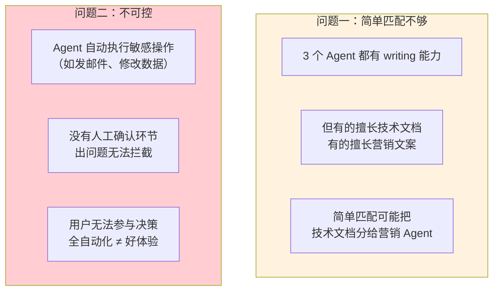
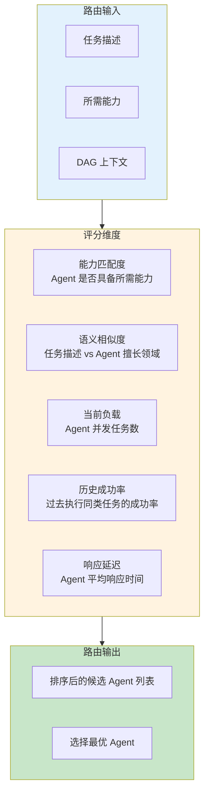
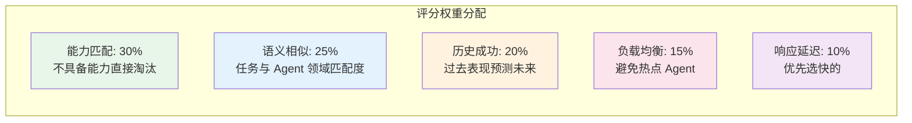
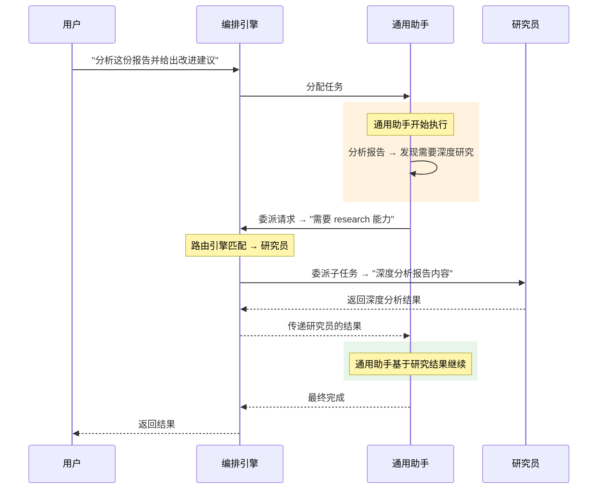
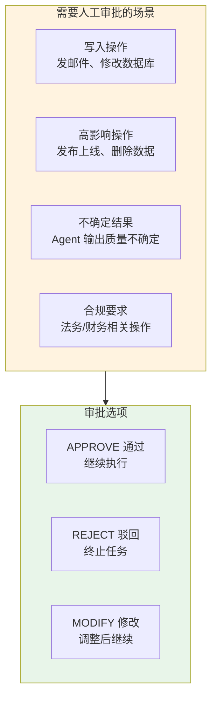
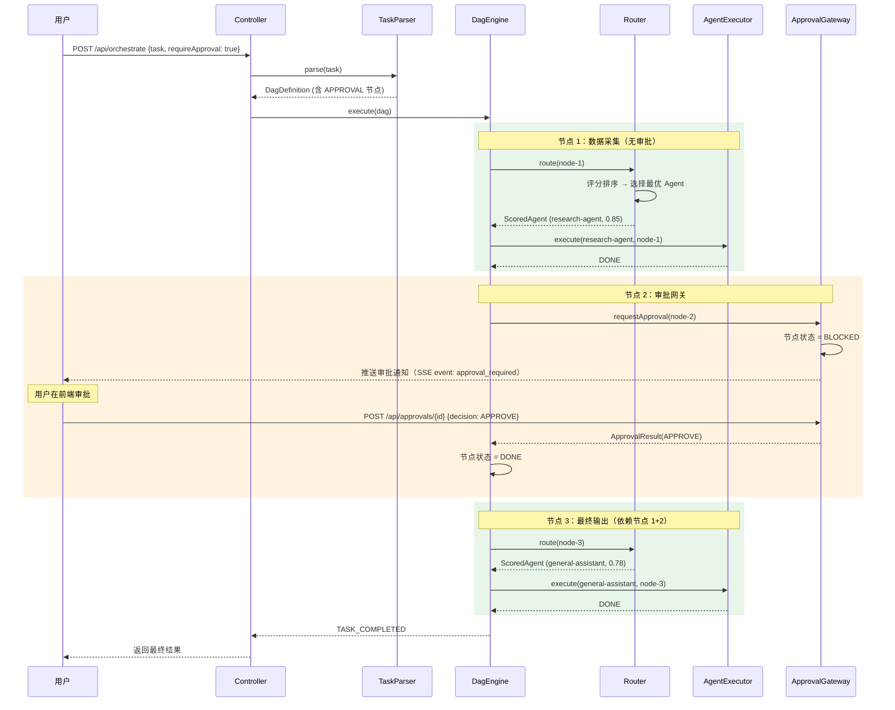
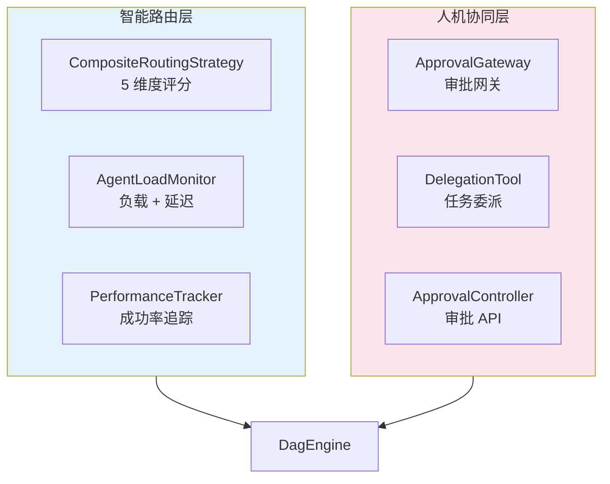

# 04-迭代三：任务委派与路由

> **定位**：在多 Agent 编排的基础上加入智能路由（根据任务特征自动匹配最优 Agent）和 Human-in-the-Loop 审批网关。读完这篇，你的平台能动态选择最合适的 Agent 执行任务，并在关键决策节点引入人工审批——这是多 Agent 平台从"自动执行"走向"可控自主"的关键一步。

> **读者画像**：已完成迭代二，多 Agent 编排已跑通，现在要让路由更智能、流程更可控。

> **前置阅读**：[03-迭代二-多Agent编排](03-迭代二-多Agent编排.md)。

> **关联教程**：[教程 07-Plan-and-Execute模式](../../教程/07-Plan-and-Execute模式.md)、[教程 22-Human-in-the-Loop与审批流](../../教程/22-Human-in-the-Loop与审批流.md)。

---

## 1. 为什么需要智能路由和审批

迭代二的 DAG 引擎在分配节点时用的是简单的"能力匹配"——`findByCapability(node.requiredCapability)` 返回第一个具备该能力的 Agent。但生产场景中存在两个核心问题：



本篇新增两大能力：

| 能力 | 解决问题 |
|------|---------|
| 智能路由 | 根据任务描述 + Agent 负载 + 历史表现选择最优 Agent |
| Human-in-the-Loop | 关键节点暂停等待人工审批，支持通过/驳回/修改 |

---

## 2. 智能路由引擎

### 2.1 路由决策模型

路由引擎不是简单的 if-else 分支，而是一个多维度评分系统：



### 2.2 路由策略接口

```java
public interface RoutingStrategy {

    /**
     * 为 DAG 节点选择最优 Agent
     */
    Mono<AgentDefinition> route(DagNode node, RoutingContext context);

    /**
     * 返回排序后的候选 Agent（带分数）
     */
    Mono<List<ScoredAgent>> rankCandidates(DagNode node, RoutingContext context);
}

public record ScoredAgent(
    AgentDefinition agent,
    double totalScore,
    Map<String, Double> scoreBreakdown
) {}

public record RoutingContext(
    String taskId,
    Map<String, Object> dagContext,
    List<String> completedNodeIds,
    Map<String, String> nodeResults
) {}
```

### 2.3 综合路由策略实现

```java
@Service
public class CompositeRoutingStrategy implements RoutingStrategy {

    private final AgentRegistry agentRegistry;
    private final AgentLoadMonitor loadMonitor;
    private final AgentPerformanceTracker performanceTracker;
    private final ChatClient chatClient;  // 用于语义匹配

    private static final double W_CAPABILITY = 0.30;
    private static final double W_SEMANTIC   = 0.25;
    private static final double W_LOAD       = 0.15;
    private static final double W_SUCCESS    = 0.20;
    private static final double W_LATENCY    = 0.10;

    @Override
    public Mono<List<ScoredAgent>> rankCandidates(
            DagNode node, RoutingContext context) {

        return agentRegistry.findByCapability(node.requiredCapability())
            .collectList()
            .flatMap(candidates -> {
                if (candidates.isEmpty()) {
                    return Mono.just(List.of());
                }
                // 并行计算每个候选 Agent 的评分
                return Flux.fromIterable(candidates)
                    .flatMap(agent -> scoreAgent(agent, node, context))
                    .sort(Comparator.comparingDouble(
                        ScoredAgent::totalScore).reversed())
                    .collectList();
            });
    }

    private Mono<ScoredAgent> scoreAgent(
            AgentDefinition agent, DagNode node, RoutingContext context) {

        // 维度 1: 能力匹配度（有该能力 = 1.0）
        double capabilityScore = agent.capabilities()
            .contains(node.requiredCapability()) ? 1.0 : 0.0;

        // 维度 2: 语义相似度（用 LLM 打分 0-1）
        Mono<Double> semanticMono = computeSemanticScore(agent, node);

        // 维度 3: 负载评分（负载越低分越高）
        double loadScore = loadMonitor.getLoadScore(agent.agentId());

        // 维度 4: 历史成功率
        double successScore = performanceTracker.getSuccessRate(
            agent.agentId(), node.requiredCapability());

        // 维度 5: 延迟评分
        double latencyScore = loadMonitor.getLatencyScore(agent.agentId());

        return semanticMono.map(semanticScore -> {
            Map<String, Double> breakdown = Map.of(
                "capability", capabilityScore,
                "semantic", semanticScore,
                "load", loadScore,
                "success", successScore,
                "latency", latencyScore
            );

            double total = capabilityScore * W_CAPABILITY
                + semanticScore * W_SEMANTIC
                + loadScore * W_LOAD
                + successScore * W_SUCCESS
                + latencyScore * W_LATENCY;

            return new ScoredAgent(agent, total, breakdown);
        });
    }

    /**
     * 用 LLM 计算任务描述与 Agent 擅长领域的语义匹配度
     */
    private Mono<Double> computeSemanticScore(
            AgentDefinition agent, DagNode node) {
        String prompt = """
            请评估以下任务描述与 Agent 能力描述的匹配度，返回 0.0 到 1.0 的分数。

            Agent 名称：%s
            Agent 描述：%s
            任务描述：%s

            只返回一个数字，不要其他文字。
            """.formatted(agent.name(), agent.description(), node.description());

        return chatClient.prompt()
            .user(prompt)
            .call()
            .content()
            .map(content -> {
                try {
                    return Double.parseDouble(content.trim());
                } catch (NumberFormatException e) {
                    return 0.5; // 默认中等分数
                }
            })
            .onErrorReturn(0.5);
    }
}
```

### 2.4 评分权重说明



权重设计逻辑：

| 权重 | 值 | 设计理由 |
|------|-----|---------|
| 能力匹配 | 30% | 最高权重——不具备能力的 Agent 不该被选中 |
| 语义相似 | 25% | 第二高——同样是 writing 能力，技术文档 vs 营销文案差异巨大 |
| 历史成功 | 20% | 用数据说话——过去成功率高意味着匹配度好 |
| 负载均衡 | 15% | 避免某个 Agent 过载，保证系统吞吐 |
| 响应延迟 | 10% | 锦上添花——前四个维度接近时优先选快的 |

> 「遇到阻塞？→ [教程 27-模型路由与降级](../../教程/27-模型路由与降级.md)」

---

## 3. Agent 负载监控

### 3.1 负载监控器

```java
@Service
public class AgentLoadMonitor {

    private final MeterRegistry meterRegistry;

    // 记录每个 Agent 的活跃任务数
    private final Map<String, AtomicInteger> activeTasks = new ConcurrentHashMap<>();

    // 记录最近 N 次的响应时间
    private final Map<String, SlidingWindow> latencyWindows = new ConcurrentHashMap<>();

    private static final int WINDOW_SIZE = 20;

    /**
     * Agent 开始执行任务
     */
    public void taskStarted(String agentId) {
        activeTasks.computeIfAbsent(agentId,
            k -> new AtomicInteger(0)).incrementAndGet();
    }

    /**
     * Agent 完成任务
     */
    public void taskCompleted(String agentId, Duration elapsed) {
        activeTasks.getOrDefault(agentId, new AtomicInteger(0)).decrementAndGet();
        latencyWindows.computeIfAbsent(agentId,
            k -> new SlidingWindow(WINDOW_SIZE)).add(elapsed.toMillis());
    }

    /**
     * 负载评分（0-1，越高越好 = 越空闲）
     */
    public double getLoadScore(String agentId) {
        int active = activeTasks.getOrDefault(agentId, new AtomicInteger(0)).get();
        // 假设每个 Agent 最多并发 10 个任务
        return Math.max(0, 1.0 - (active / 10.0));
    }

    /**
     * 延迟评分（0-1，越高越好 = 越快）
     */
    public double getLatencyScore(String agentId) {
        SlidingWindow window = latencyWindows.get(agentId);
        if (window == null || window.isEmpty()) {
            return 0.8; // 没有历史数据，给较高默认分
        }
        double avgMs = window.average();
        // 10s = 0 分，1s = 1 分
        return Math.max(0, Math.min(1, (10000 - avgMs) / 9000));
    }
}
```

### 3.2 性能追踪

```java
@Service
public class AgentPerformanceTracker {

    private final Map<String, TaskStats> stats = new ConcurrentHashMap<>();

    public record TaskStats(
        int totalTasks,
        int successfulTasks,
        int failedTasks
    ) {
        public double successRate() {
            return totalTasks == 0 ? 0.5 : (double) successfulTasks / totalTasks;
        }
    }

    public void recordResult(String agentId, String capability, boolean success) {
        String key = agentId + ":" + capability;
        stats.merge(key,
            new TaskStats(1, success ? 1 : 0, success ? 0 : 1),
            (old, init) -> new TaskStats(
                old.totalTasks() + 1,
                old.successfulTasks() + (success ? 1 : 0),
                old.failedTasks() + (success ? 0 : 1)
            ));
    }

    public double getSuccessRate(String agentId, String capability) {
        String key = agentId + ":" + capability;
        return stats.getOrDefault(key,
            new TaskStats(0, 0, 0)).successRate();
    }
}
```

---

## 4. 任务委派机制

### 4.1 什么是任务委派

任务委派是 Agent 间的高级协作模式——Agent A 在执行过程中发现某个子任务超出自己的能力范围，主动将子任务委派给更专业的 Agent B：



### 4.2 委派工具实现

给通用助手添加一个"委派"工具，让 Agent 能主动发起委派：

```java
@Component
public class DelegationTool {

    private final RoutingStrategy routingStrategy;
    private final AgentExecutor agentExecutor;
    private final MessageBus messageBus;

    @Tool(description = """
        将子任务委派给其他专业 Agent 执行。
        当遇到需要特定专业能力（如深度研究、翻译、数据分析）的任务时，
        使用此工具委派给更专业的 Agent。
        """)
    public String delegateTask(
        @ToolParam(description = "委派的任务描述") String taskDescription,
        @ToolParam(description = "需要的能力标签，如 research、translation") String capability
    ) {
        // 同步委派（阻塞当前 Agent 直到子任务完成）
        DagNode delegateNode = new DagNode(
            UUID.randomUUID().toString(),
            taskDescription,
            capability,
            NodeType.TASK,
            Map.of(),
            NodeStatus.PENDING,
            null, null, null, null, 0
        );

        RoutingContext context = new RoutingContext(
            "delegation", Map.of(), List.of(), Map.of()
        );

        try {
            // 路由 + 执行（阻塞式简化处理）
            ScoredAgent best = routingStrategy.rankCandidates(delegateNode, context)
                .block().get(0);

            AgentDefinition delegateAgent = best.agent();

            List<String> tokens = agentExecutor
                .execute(delegateAgent, taskDescription, null)
                .collectList()
                .block();

            return String.join("", tokens);
        } catch (Exception e) {
            return "委派失败: " + e.getMessage();
        }
    }
}
```

### 4.3 委派与 DAG 编排的区别

| 维度 | DAG 编排 | 任务委派 |
|------|---------|---------|
| 触发方 | 编排引擎（顶层） | Agent 自主（运行时） |
| 时机 | 任务开始前已知 | 执行过程中动态决定 |
| 结构 | 预定义的 DAG | 运行时发现 |
| 耦合 | 松耦合 | Agent 间有调用关系 |

DAG 编排是 Plan-and-Execute 模式——先规划再执行。委派是 ReAct 模式——执行中发现需要帮助。

> 「遇到阻塞？→ [教程 07-Plan-and-Execute模式](../../教程/07-Plan-and-Execute模式.md)」

---

## 5. Human-in-the-Loop 审批网关

### 5.1 审批场景

并非所有任务都应该全自动执行。以下场景需要人工介入：



### 5.2 审批网关设计

在 DAG 引擎中加入审批节点类型。当遇到 `APPROVAL` 类型的节点时，引擎暂停执行，等待人工操作：

```java
@Service
public class ApprovalGateway {

    private final TaskStateStore stateStore;
    private final Sinks.Many<ApprovalRequest> pendingApprovals;

    public ApprovalGateway(TaskStateStore stateStore) {
        this.stateStore = stateStore;
        this.pendingApprovals = Sinks.many().multicast().onBackpressureBuffer();
    }

    /**
     * 请求审批（阻塞 DAG 执行）
     */
    public Mono<ApprovalResult> requestApproval(
            String taskId, String nodeId, ApprovalRequest request) {

        // 更新节点状态为 BLOCKED
        return stateStore.updateNodeStatus(taskId, nodeId,
                NodeStatus.BLOCKED, null)
            .then(stateStore.saveApprovalRequest(request))
            .then(pendingApprovals.tryEmitNext(request))
            .then(Mono.defer(() -> {
                // 等待审批结果（通过 Sink 或 Redis Pub/Sub）
                return stateStore.waitForApproval(request.requestId(),
                    Duration.ofHours(1));
            }));
    }

    /**
     * 提交审批结果
     */
    public Mono<Void> submitApproval(ApprovalResult result) {
        return stateStore.saveApprovalResult(result)
            .then(stateStore.notifyApprovalResolved(result));
    }

    /**
     * 获取待审批列表（前端轮询 / SSE 推送）
     */
    public Flux<ApprovalRequest> pendingApprovals() {
        return pendingApprovals.asFlux();
    }
}

public record ApprovalRequest(
    String requestId,
    String taskId,
    String nodeId,
    String summary,            // 审批摘要
    String proposedAction,     // 拟执行的操作
    Map<String, Object> details,
    LocalDateTime createdAt
) {}

public record ApprovalResult(
    String requestId,
    ApprovalDecision decision,  // APPROVE / REJECT / MODIFY
    String comment,             // 审批意见
    Map<String, Object> modifications, // 修改内容（MODIFY 时）
    String approver,
    LocalDateTime decidedAt
) {}

public enum ApprovalDecision {
    APPROVE,
    REJECT,
    MODIFY
}
```

### 5.3 DAG 引擎集成审批

升级 DAG 引擎，在执行节点时检查是否需要审批：

```java
private Flux<DagEvent> executeNode(DagDefinition dag, DagNode node) {
    // 如果是审批节点，暂停等待
    if (node.type() == NodeType.APPROVAL) {
        return executeApprovalNode(dag, node);
    }
    // 普通节点，正常执行
    return findAgentForNode(node)
        .flatMapMany(agent -> executeAgentForNode(dag, node, agent));
}

private Flux<DagEvent> executeApprovalNode(DagDefinition dag, DagNode node) {
    ApprovalRequest request = buildApprovalRequest(dag, node);

    return approvalGateway.requestApproval(dag.taskId(), node.nodeId(), request)
        .flatMapMany(result -> switch (result.decision()) {
            case APPROVE -> {
                // 审批通过，标记节点完成，继续后续节点
                yield stateStore.updateNodeResult(
                        dag.dagId(), node.nodeId(),
                        "Approved: " + result.comment(),
                        NodeStatus.DONE)
                    .thenMany(rescheduleAfterNodeCompletion(dag, node.nodeId()));
            }
            case REJECT -> {
                // 驳回，终止整个任务
                yield stateStore.updateNodeStatus(
                        dag.dagId(), node.nodeId(),
                        NodeStatus.FAILED, null)
                    .thenMany(Flux.just(new DagEvent(
                        dag.dagId(), node.nodeId(),
                        EventType.TASK_FAILED,
                        "Rejected: " + result.comment())));
            }
            case MODIFY -> {
                // 修改后继续，将修改内容注入上下文
                yield stateStore.updateGlobalContext(
                        dag.dagId(), result.modifications())
                    .then(stateStore.updateNodeResult(
                        dag.dagId(), node.nodeId(),
                        "Modified: " + result.comment(),
                        NodeStatus.DONE))
                    .thenMany(rescheduleAfterNodeCompletion(dag, node.nodeId()));
            }
        });
}
```

### 5.4 审批接口

```java
@RestController
@RequestMapping("/api/approvals")
public class ApprovalController {

    private final ApprovalGateway gateway;

    /**
     * 获取待审批列表
     */
    @GetMapping("/pending")
    public Flux<ApprovalRequest> pendingApprovals() {
        return gateway.pendingApprovals();
    }

    /**
     * 提交审批
     */
    @PostMapping("/{requestId}")
    public Mono<ResponseEntity<Void>> submit(
            @PathVariable String requestId,
            @RequestBody ApprovalRequest request
    ) {
        return gateway.submitApproval(
                new ApprovalResult(
                    requestId,
                    request.decision(),
                    request.comment(),
                    request.modifications(),
                    request.approver(),
                    LocalDateTime.now()
                ))
            .then(Mono.just(ResponseEntity.ok().build()));
    }
}
```

> 「遇到阻塞？→ [教程 22-Human-in-the-Loop与审批流](../../教程/22-Human-in-the-Loop与审批流.md)」

---

## 6. 完整路由 + 审批流程

将智能路由和审批网关整合到一次完整的编排任务中：



---

## 7. 路由策略可配置化

### 7.1 策略切换

不同业务场景需要不同的路由策略。通过策略模式支持运行时切换：

```java
public interface RoutingStrategy {
    Mono<List<ScoredAgent>> rankCandidates(DagNode node, RoutingContext context);
}

// 策略 1：综合评分（本文实现）
@Service("compositeStrategy")
public class CompositeRoutingStrategy implements RoutingStrategy { ... }

// 策略 2：轮询（简单负载均衡）
@Service("roundRobinStrategy")
public class RoundRobinStrategy implements RoutingStrategy { ... }

// 策略 3：最小负载优先
@Service("leastLoadStrategy")
public class LeastLoadStrategy implements RoutingStrategy { ... }
```

```java
@Configuration
public class RoutingConfig {

    @Bean
    @Primary
    public RoutingStrategy routingStrategy(
            CompositeRoutingStrategy composite,
            @Value("${agent.routing.strategy:composite}") String strategy
    ) {
        return switch (strategy) {
            case "round-robin" -> applicationContext.getBean(
                "roundRobinStrategy", RoutingStrategy.class);
            case "least-load" -> applicationContext.getBean(
                "leastLoadStrategy", RoutingStrategy.class);
            default -> composite;
        };
    }
}
```

### 7.2 路由降级

当智能路由失败时（如 LLM 调用超时），降级为简单匹配：

```java
public Mono<AgentDefinition> route(DagNode node, RoutingContext context) {
    return compositeStrategy.rankCandidates(node, context)
        .timeout(Duration.ofSeconds(5))  // 5 秒超时
        .flatMap(candidates -> {
            if (candidates.isEmpty()) {
                // 降级：简单能力匹配
                return fallbackToSimpleMatch(node);
            }
            return Mono.just(candidates.get(0).agent());
        })
        .onErrorResume(ex -> fallbackToSimpleMatch(node));  // 异常降级
}

private Mono<AgentDefinition> fallbackToSimpleMatch(DagNode node) {
    return agentRegistry.findByCapability(node.requiredCapability())
        .next()  // 取第一个
        .switchIfEmpty(Mono.error(new NoAgentAvailableException(
            node.requiredCapability())));
}
```

> 「遇到阻塞？→ [教程 24-容错与弹性设计](../../教程/24-容错与弹性设计.md)」

---

## 8. 完整测试

### 8.1 测试智能路由

```bash
# 提交任务（多 Agent 可选时观察路由选择）
curl -X POST http://localhost:8080/api/orchestrate \
  -H "Content-Type: application/json" \
  -d '{
    "task": "翻译一份技术文档为英文，然后审核翻译质量",
    "requireApproval": true
  }'

# SSE 追踪路由决策
curl -N http://localhost:8080/api/orchestrate/{taskId}/stream
```

### 8.2 测试审批流程

```bash
# 查看待审批
curl http://localhost:8080/api/approvals/pending

# 提交审批
curl -X POST http://localhost:8080/api/approvals/{requestId} \
  -H "Content-Type: application/json" \
  -d '{
    "decision": "APPROVE",
    "comment": "翻译质量良好，通过",
    "approver": "admin"
  }'
```

### 8.3 SSE 事件流（含审批）

```
event:dag_created
data:{"nodes":3,"edges":2}

event:node_started
data:{"nodeId":"node-1","agent":"translator-agent","score":0.87}

event:node_completed
data:{"nodeId":"node-1","result":"Translation completed..."}

event:approval_required
data:{"nodeId":"node-2","requestId":"apr-001","summary":"审核翻译质量"}

event:node_started
data:{"nodeId":"node-3","agent":"research-agent","score":0.82}

event:task_completed
data:{"totalTime":"45s","approvals":1}
```

---

## 9. 迭代三代码回顾

| 文件 | 职责 | 新增/升级 |
|------|------|----------|
| `CompositeRoutingStrategy.java` | 多维度智能路由 | 新增 |
| `AgentLoadMonitor.java` | Agent 负载监控 | 新增 |
| `AgentPerformanceTracker.java` | 历史成功率追踪 | 新增 |
| `DelegationTool.java` | Agent 主动委派工具 | 新增 |
| `ApprovalGateway.java` | 审批网关 | 新增 |
| `ApprovalController.java` | 审批 API | 新增 |
| `DagEngine.java` | 集成审批节点 + 路由 | 升级 |



---

## 10. 总结

本篇让多 Agent 平台具备了智能决策和可控执行能力：

1. **智能路由**——五维度评分模型（能力 30% + 语义 25% + 成功率 20% + 负载 15% + 延迟 10%），用 LLM 计算语义匹配度，用历史数据预测成功率
2. **负载监控**——实时追踪每个 Agent 的活跃任务数和响应延迟，为路由决策提供数据支撑
3. **任务委派**——Agent 通过 `delegateTask` 工具自主委派子任务给专业 Agent，实现运行时动态协作
4. **Human-in-the-Loop**——审批网关在关键节点暂停 DAG 执行，支持 APPROVE / REJECT / MODIFY 三种审批决策
5. **策略可配置**——路由策略通过配置切换（综合评分 / 轮询 / 最小负载），支持超时降级
6. **弹性设计**——路由失败时自动降级为简单匹配，保证任务不因路由异常而中断

至此，多 Agent 编排平台的三大迭代全部完成：
- 迭代一：单 Agent 工具链（Agent 能做事）
- 迭代二：多 Agent 编排（Agent 能协作）
- 迭代三：智能路由 + 审批（协作更智能、更可控）

下一篇 [05-核心代码讲解](05-核心代码讲解.md) 将对全项目核心代码做完整梳理和深度解析。
