# 05-核心代码讲解

> **定位**：对多 Agent 编排平台全项目核心代码做完整梳理和深度解析——Agent 抽象层、工具注册机制、DAG 编排引擎、智能路由策略、审批网关，逐模块拆解关键代码的设计决策和实现细节。读完这篇，你对整个平台的每一行核心代码都有清晰认知。所有代码**完整可手写**（一行不省略）。

> **读者画像**：已完成前三篇迭代文档，希望从"能用"升级到"精通"。

> **前置阅读**：[00-需求分析与架构设计](00-需求分析与架构设计.md) ~ [04-迭代三-任务委派与路由](04-迭代三-任务委派与路由.md)。

> **关联教程**：[教程 03-工具调用](../../教程/03-工具调用.md)、[教程 09-多Agent协作](../../教程/09-多Agent协作.md)、[教程 12-Agent状态管理](../../教程/12-Agent状态管理.md)、[教程 20-管控分离架构](../../教程/20-管控分离架构.md)、[教程 28-Human-in-the-Loop与审批流](../../教程/28-Human-in-the-Loop与审批流.md)、[教程 36-Agent工作流编排](../../教程/36-Agent工作流编排.md)。

---

## 1. 全项目架构总览

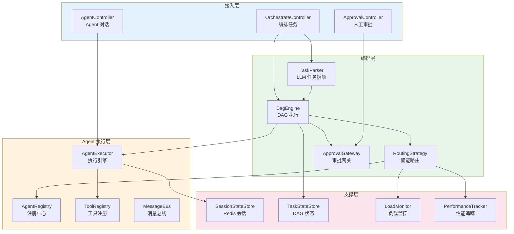

---

## 2. AgentDefinition：不可变契约

### 2.1 代码全貌

```java
// model/AgentDefinition.java
package com.example.orchestrator.model;

import java.util.List;
import java.util.Set;

public record AgentDefinition(
        String agentId,               // 唯一标识
        String name,                  // 显示名称
        String description,           // 能力描述（路由语义匹配用）
        String systemPrompt,          // 系统提示词
        Set<String> capabilities,     // 能力标签
        List<String> toolBeanNames,   // 工具 Bean 名称
        ModelConfig modelConfig) {}   // 模型参数覆盖
```

```java
// model/ModelConfig.java
package com.example.orchestrator.model;

public record ModelConfig(
        String model,
        Double temperature,
        Integer maxTokens) {}
```

### 2.2 设计决策解析

| 决策 | 选择 | 理由 |
|------|------|------|
| 用 record 而非 class | record | Agent 定义不可变，修改 = 注销再注册 |
| capabilities 用 Set | Set | 能力不重复，查找 O(1) |
| toolBeanNames 用 List | List | 工具有优先级顺序 |
| systemPrompt 是纯字符串 | String | 不用复杂模板对象，保持简单 |

### 2.3 为什么不把工具直接定义在 Agent 内

工具是独立的 Spring Bean，通过 `toolBeanNames` 引用——而不是直接在 `AgentDefinition` 里嵌入工具实现。原因有三：

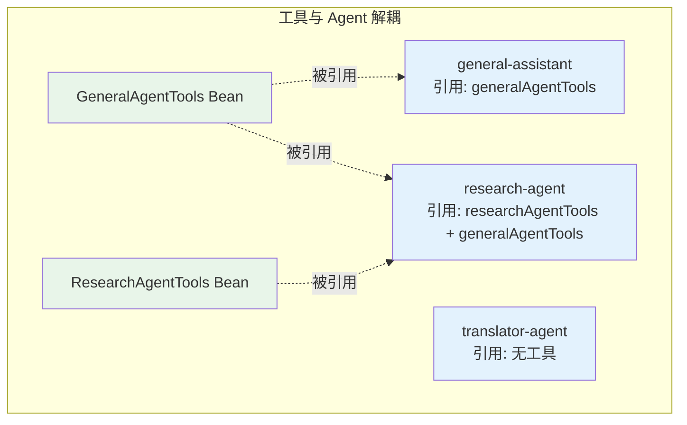

1. **工具复用**——多个 Agent 可以共享同一组工具
2. **配置驱动**——Agent 的工具集通过 YAML 配置，不改代码
3. **测试友好**——工具 Bean 可以独立单元测试

---

## 3. AgentExecutor：执行引擎核心

### 3.1 完整代码解析

```java
// agent/AgentExecutor.java
package com.example.orchestrator.agent;

import com.example.orchestrator.model.AgentDefinition;
import com.example.orchestrator.model.SessionMessage;
import org.springframework.ai.chat.client.ChatClient;
import org.springframework.ai.chat.messages.AssistantMessage;
import org.springframework.ai.chat.messages.Message;
import org.springframework.ai.chat.messages.UserMessage;
import org.springframework.ai.openai.OpenAiChatOptions;
import org.springframework.stereotype.Service;
import reactor.core.publisher.Flux;

import java.util.List;

@Service
public class AgentExecutor {

    private final ChatClient.Builder chatClientBuilder;
    private final ToolRegistry toolRegistry;

    public AgentExecutor(ChatClient.Builder chatClientBuilder, ToolRegistry toolRegistry) {
        this.chatClientBuilder = chatClientBuilder;
        this.toolRegistry = toolRegistry;
    }

    public Flux<String> execute(AgentDefinition agent, String userMessage,
                                List<SessionMessage> history) {
        // 1. 构建独立 ChatClient
        ChatClient client = buildClient(agent);

        // 2. 构建 Prompt
        var promptSpec = client.prompt()
                .system(agent.systemPrompt())
                .user(userMessage);

        // 3. 注入历史消息（多轮上下文）
        if (history != null && !history.isEmpty()) {
            List<Message> springMessages = history.stream()
                    .map(this::toSpringMessage)
                    .toList();
            promptSpec = promptSpec.messages(springMessages);
        }

        // 4. 注入工具
        List<Object> tools = toolRegistry.resolveTools(agent.toolBeanNames());
        if (!tools.isEmpty()) {
            promptSpec = promptSpec.tools(tools.toArray());
        }

        // 5. 流式执行
        return promptSpec.stream().content();
    }

    private Message toSpringMessage(SessionMessage msg) {
        return switch (msg.role()) {
            case "assistant" -> new AssistantMessage(msg.content());
            default -> new UserMessage(msg.content());
        };
    }

    private ChatClient buildClient(AgentDefinition agent) {
        var builder = chatClientBuilder.defaultSystem(agent.systemPrompt());
        if (agent.modelConfig() != null) {
            var config = agent.modelConfig();
            builder = builder.defaultOptions(OpenAiChatOptions.builder()   // Spring AI 2.0.0：defaultOptions 收 Builder
                    .model(config.model())
                    .temperature(config.temperature())
                    .maxTokens(config.maxTokens()));
        }
        return builder.build();
    }
}
```

### 3.2 五步执行流程

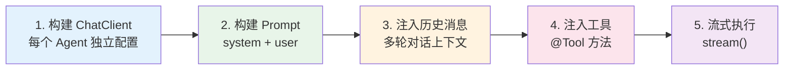

### 3.3 为什么每次都 buildClient

`ChatClient.Builder` 是 Spring AI 提供的工厂，每次调用 `build()` 创建一个独立的 ChatClient 实例。每次执行都重建的原因：

```java
// 错误做法：共享单例 → 所有 Agent 共享同一个 systemPrompt
@Bean
ChatClient sharedClient(ChatClient.Builder builder) {
    return builder.defaultSystem("固定提示词").build();
}

// 正确做法：每次构建 → 每个 Agent 有不同的 systemPrompt / temperature / maxTokens
private ChatClient buildClient(AgentDefinition agent) {
    return chatClientBuilder
            .defaultSystem(agent.systemPrompt())
            .build();
}
```

每个 Agent 有不同的 systemPrompt、temperature、maxTokens。用 Builder 每次构建，确保隔离。`ChatClient.Builder` 本身是轻量级的，构建开销可忽略。

> 「遇到阻塞？→ [教程 03-工具调用](../../教程/03-工具调用.md)」

---

## 4. DagEngine：编排引擎深度解析

### 4.1 核心调度逻辑（迭代三终版，完整代码）

```java
// engine/DagEngine.java（核心方法）
package com.example.orchestrator.engine;

import com.example.orchestrator.agent.AgentExecutor;
import com.example.orchestrator.model.DagDefinition;
import com.example.orchestrator.model.DagEvent;
import com.example.orchestrator.model.DagNode;
import com.example.orchestrator.model.EventType;
import com.example.orchestrator.model.NodeStatus;
import com.example.orchestrator.store.TaskStateStore;
import org.springframework.stereotype.Service;
import reactor.core.publisher.Flux;

import java.util.List;
import java.util.Set;
import java.util.concurrent.ConcurrentHashMap;
import java.util.stream.Collectors;

@Service
public class DagEngine {

    private static final int MAX_CONCURRENCY = 10;
    private final AgentRouter agentRouter;
    private final AgentExecutor agentExecutor;
    private final TaskStateStore stateStore;
    private final Set<String> claimed = ConcurrentHashMap.newKeySet();

    public DagEngine(AgentRouter agentRouter, AgentExecutor agentExecutor,
                     TaskStateStore stateStore) {
        this.agentRouter = agentRouter;
        this.agentExecutor = agentExecutor;
        this.stateStore = stateStore;
    }

    public Flux<DagEvent> execute(DagDefinition dag) {
        List<DagNode> pendingNodes = dag.nodes().stream()
                .map(n -> new DagNode(n.nodeId(), n.description(), n.requiredCapability(),
                        n.type(), n.config(), NodeStatus.PENDING,
                        null, null, null, null, 0))
                .toList();
        DagDefinition init = new DagDefinition(dag.dagId(), dag.taskId(),
                pendingNodes, dag.edges(), dag.globalContext());
        return stateStore.saveDag(init)
                .thenMany(Flux.defer(() -> schedule(init)));
    }

    /** 调度所有就绪节点；无就绪节点时收敛终态。 */
    private Flux<DagEvent> schedule(DagDefinition dag) {
        List<DagNode> ready = findReadyNodes(dag);
        if (ready.isEmpty()) {
            boolean anyRunning = dag.nodes().stream()
                    .anyMatch(n -> n.status() == NodeStatus.RUNNING);
            if (allDone(dag)) {
                return Flux.just(new DagEvent(dag.dagId(), null,
                        EventType.TASK_COMPLETED, "All nodes done"));
            }
            if (!anyRunning && anyFailed(dag)) {
                return Flux.just(new DagEvent(dag.dagId(), null,
                        EventType.TASK_FAILED, "Task failed"));
            }
            return Flux.empty();    // 有节点运行中，等待回调
        }
        return Flux.fromIterable(ready)
                .flatMap(node -> tryClaim(dag, node)
                        .flatMapMany(ok -> ok ? executeNode(dag, node) : Flux.empty()),
                        MAX_CONCURRENCY);
    }

    private Flux<DagEvent> executeNode(DagDefinition dag, DagNode node) {
        return agentRouter.route(node, buildContext(dag))
                .flatMapMany(agent -> {
                    String prompt = buildNodePrompt(dag, node);
                    return stateStore.updateNodeStatus(dag.taskId(), node.nodeId(),
                                    NodeStatus.RUNNING, agent.agentId())
                            .flatMapMany(updated ->
                                    agentExecutor.execute(agent, prompt, List.of())
                                            .collectList()
                                            .flatMapMany(tokens -> {
                                                String result = String.join("", tokens);
                                                return stateStore.updateNodeResult(
                                                                dag.taskId(), node.nodeId(),
                                                                result, NodeStatus.DONE)
                                                        .flatMapMany(updatedDone -> Flux.concat(
                                                                Flux.just(new DagEvent(dag.dagId(), node.nodeId(),
                                                                        EventType.NODE_COMPLETED, result)),
                                                                schedule(updatedDone)));
                                            })
                                            .onErrorResume(ex -> handleNodeFailure(dag, node, ex)));
                });
    }

    private Flux<DagEvent> handleNodeFailure(DagDefinition dag, DagNode node, Throwable ex) {
        return stateStore.updateNodeResult(dag.taskId(), node.nodeId(),
                        "ERROR: " + ex.getMessage(), NodeStatus.FAILED)
                .flatMapMany(updated -> Flux.concat(
                        Flux.just(new DagEvent(dag.dagId(), node.nodeId(),
                                EventType.NODE_FAILED, ex.getMessage())),
                        schedule(updated)));
    }

    private Mono<Boolean> tryClaim(DagDefinition dag, DagNode node) {
        return Mono.fromCallable(() -> claimed.add(dag.taskId() + ":" + node.nodeId()));
    }

    /** 查找就绪节点：所有前驱已完成，且未被认领。 */
    private List<DagNode> findReadyNodes(DagDefinition dag) {
        Set<String> done = dag.nodes().stream()
                .filter(n -> n.status() == NodeStatus.DONE)
                .map(DagNode::nodeId)
                .collect(Collectors.toSet());
        return dag.nodes().stream()
                .filter(n -> n.status() == NodeStatus.PENDING)
                .filter(n -> dag.edges().stream()
                        .filter(e -> e.to().equals(n.nodeId()))
                        .allMatch(e -> done.contains(e.from())))
                .filter(n -> !claimed.contains(dag.taskId() + ":" + n.nodeId()))
                .toList();
    }

    private String buildNodePrompt(DagDefinition dag, DagNode node) {
        StringBuilder sb = new StringBuilder();
        sb.append("任务编号：").append(node.nodeId()).append("\n");
        sb.append("任务描述：").append(node.description()).append("\n");
        if (dag.globalContext() != null && !dag.globalContext().isEmpty()) {
            sb.append("全局上下文：").append(dag.globalContext()).append("\n");
        }
        sb.append("请完成上述子任务，直接给出结果。");
        return sb.toString();
    }

    private boolean allDone(DagDefinition dag) {
        return dag.nodes().stream().allMatch(n -> n.status() == NodeStatus.DONE);
    }

    private boolean anyFailed(DagDefinition dag) {
        return dag.nodes().stream().anyMatch(n -> n.status() == NodeStatus.FAILED);
    }
}
```

> 说明：上面是迭代二终版的完整核心方法（不含迭代三的审批节点分支与 `buildContext`/`ApprovalGateway`）。迭代三完整版见 [04-迭代三 §6.4]。

### 4.2 拓扑排序的响应式实现

传统 DAG 拓扑排序是同步递归的。我们用响应式 Flux 实现了事件驱动的调度：

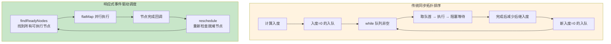

核心差异：响应式调度**不阻塞等待**节点完成。每个节点执行完成后通过回调触发 `reschedule`，重新检查哪些节点变为可执行。这让编排引擎能同时管理大量并发任务。

### 4.3 并行调度关键

```java
// 限制并行度，防止资源耗尽（DeepSeek API 并发限制 + 服务器资源决定上限）
private static final int MAX_CONCURRENCY = 10;

Flux.fromIterable(readyNodes)
        .flatMap(node -> executeNode(dag, node), MAX_CONCURRENCY)
```

`flatMap` 的第二个参数控制最大并发数。10 个 Agent 同时执行是经验值。

> 「遇到阻塞？→ [教程 36-Agent工作流编排](../../教程/36-Agent工作流编排.md)」

---

## 5. RoutingStrategy：智能路由评分

### 5.1 评分公式

```java
double total = capabilityScore * 0.30   // 能力匹配
             + semanticScore * 0.25     // 语义相似
             + successScore * 0.20      // 历史成功率
             + loadScore * 0.15         // 负载
             + latencyScore * 0.10;     // 延迟
```

### 5.2 各维度评分详解

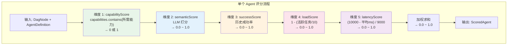

### 5.3 语义评分的 LLM 调用（WebFlux 安全写法）

```java
// engine/CompositeRoutingStrategy.java 中的语义评分
private Mono<Double> computeSemanticScore(AgentDefinition agent, DagNode node) {
    String prompt = """
            评估任务描述与 Agent 能力描述的匹配度，返回 0.0-1.0。

            Agent 名称：%s
            Agent 描述：%s
            任务描述：%s

            只返回数字。
            """.formatted(agent.name(), agent.description(), node.description());

    return Mono.fromCallable(() -> {
                String content = chatClient.prompt()
                        .user(prompt)
                        .call()
                        .content();
                try {
                    double score = Double.parseDouble(content.trim());
                    return Math.max(0.0, Math.min(1.0, score));   // clamp 0-1
                } catch (NumberFormatException e) {
                    return 0.5;    // 解析失败给默认分
                }
            })
            .subscribeOn(Schedulers.boundedElastic())   // 阻塞调用挪出 EventLoop
            .onErrorReturn(0.5);
}
```

设计要点：

1. **Prompt 极简**——只返回数字，减少 token 消耗
2. **clamp 0-1**——LLM 可能返回越界值，强制限制
3. **默认 0.5**——解析失败或异常时给中等分数，不影响整体路由
4. **异步执行**——`Mono.fromCallable` + `boundedElastic`，不阻塞调度线程

### 5.4 路由降级策略

```java
// engine/AgentRouter.java 的核心
public Mono<AgentDefinition> route(DagNode node, RoutingContext context) {
    return routingStrategy.rankCandidates(node, context)
            .timeout(Duration.ofSeconds(5))
            .flatMap(candidates -> candidates.isEmpty()
                    ? fallbackToSimpleMatch(node)
                    : Mono.just(candidates.get(0).agent()))
            .onErrorResume(ex -> {
                log.warn("Composite routing failed, falling back: {}", ex.getMessage());
                return fallbackToSimpleMatch(node);
            });
}

private Mono<AgentDefinition> fallbackToSimpleMatch(DagNode node) {
    return agentRegistry.findByCapability(node.requiredCapability())
            .next()
            .switchIfEmpty(Mono.error(new NoAgentAvailableException(
                    node.requiredCapability())));
}
```

三级降级链：

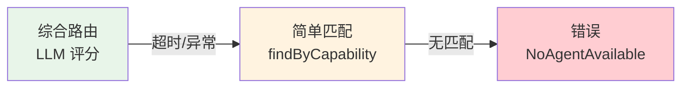

> 「遇到阻塞？→ [教程 32-模型路由与降级](../../教程/32-模型路由与降级.md)」

---

## 6. ApprovalGateway：审批网关

### 6.1 阻塞等待机制

审批网关的核心挑战是**阻塞 DAG 执行直到人工操作**。我们用 `Sinks.One` + fail-safe 超时实现响应式等待：

```java
// engine/ApprovalGateway.java 的核心
public Mono<ApprovalResult> requestApproval(String taskId, String nodeId, ApprovalRequest request) {
    Sinks.One<ApprovalResult> sink = Sinks.one();
    pendingSinks.put(request.requestId(), sink);

    return stateStore.updateNodeStatus(taskId, nodeId, NodeStatus.BLOCKED, null)
            .then(Mono.just(request))
            .doOnNext(pendingApprovals::tryEmitNext)
            .then(sink.asMono()
                    .timeout(Duration.ofHours(1),
                            Mono.just(new ApprovalResult(request.requestId(),
                                    ApprovalDecision.REJECT, "审批超时自动拒绝",
                                    Map.of(), "system", LocalDateTime.now())))
                    .doFinally(sig -> pendingSinks.remove(request.requestId())));
}
```

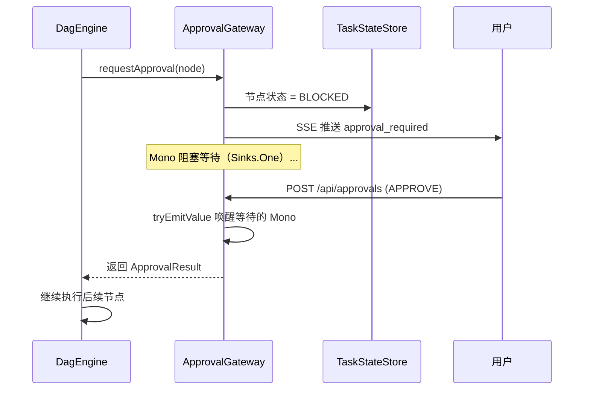

### 6.2 三种审批结果处理

```java
return approvalGateway.requestApproval(dag.taskId(), node.nodeId(), request)
        .flatMapMany(result -> switch (result.decision()) {
            // 通过 → 标记完成，继续
            case APPROVE -> stateStore.updateNodeResult(
                            dag.taskId(), node.nodeId(),
                            "Approved: " + result.comment(), NodeStatus.DONE)
                    .flatMapMany(updated -> Flux.concat(
                            Flux.just(new DagEvent(dag.dagId(), node.nodeId(),
                                    EventType.NODE_COMPLETED, "Approved")),
                            schedule(updated)));

            // 驳回 → 终止任务
            case REJECT -> stateStore.updateNodeStatus(
                            dag.taskId(), node.nodeId(), NodeStatus.FAILED, null)
                    .flatMapMany(updated -> Flux.just(new DagEvent(dag.dagId(), node.nodeId(),
                            EventType.TASK_FAILED, "Rejected: " + result.comment())));

            // 修改 → 注入修改，继续
            case MODIFY -> stateStore.updateGlobalContext(
                            dag.taskId(), result.modifications())
                    .then(stateStore.updateNodeResult(
                            dag.taskId(), node.nodeId(),
                            "Modified: " + result.comment(), NodeStatus.DONE))
                    .flatMapMany(updated -> Flux.concat(
                            Flux.just(new DagEvent(dag.dagId(), node.nodeId(),
                                    EventType.NODE_COMPLETED, "Modified")),
                            schedule(updated)));
        });
```

MODIFY 的设计是最有价值的——人工不只是"是/否"，还能调整任务参数后继续执行。例如审核翻译质量时，审批者可以修改部分翻译后让流程继续。

> 「遇到阻塞？→ [教程 28-Human-in-the-Loop与审批流](../../教程/28-Human-in-the-Loop与审批流.md)」

---

## 7. TaskParser：LLM 任务拆解

### 7.1 结构化输出

```java
// engine/TaskParser.java 的核心
public Mono<DagDefinition> parse(OrchestrateRequest request, String taskId) {
    return agentRegistry.findAll()
            .map(AgentDefinition::capabilities)
            .flatMapIterable(Set::stream)
            .distinct()
            .collectList()
            .flatMap(capabilities -> {
                String prompt = PARSE_PROMPT
                        .replace("{availableCapabilities}", capabilities.toString())
                        .replace("{task}", request.task());
                return Mono.fromCallable(() -> chatClient.prompt()
                                .user(prompt)
                                .call()
                                .entity(DagDefinition.class))    // Spring AI 2.0 真实结构化输出
                        .subscribeOn(Schedulers.boundedElastic());
            })
            .map(dag -> enrichDag(dag, taskId, request));
}
```

`.entity(DagDefinition.class)` 是 Spring AI 2.0 的结构化输出 API——它自动：

1. 在 Prompt 中附加 JSON Schema 指令
2. 解析 LLM 返回的 JSON
3. 反序列化为 Java 对象

> ⚠ 结构化输出真实重载：`entity(Class)`、`entity(ParameterizedTypeReference)`，以及 `entity(X, Consumer<EntityParamSpec>)` 变体——`EntityParamSpec` 真实方法仅 `useProviderStructuredOutput()` 与 `validateSchema()`（javap 实证，见 [附录 05-02 §2]）。`entity(Class, spec -> spec.useProviderStructuredOutput().validateSchema())` 可直接使用。

### 7.2 Prompt 工程

```java
private static final String PARSE_PROMPT = """
        你是一个任务编排规划师。用户会给你一个复杂任务描述，
        你需要将其拆解为多个子任务，并定义子任务之间的依赖关系。

        可用的 Agent 能力列表：{availableCapabilities}

        输出 JSON 格式的 DAG 定义：
        {
          "nodes": [{"nodeId":"node-1","description":"...","requiredCapability":"..."}],
          "edges": [{"from":"node-1","to":"node-2"}]
        }

        规则：
        1. 每个子任务只需要一种能力
        2. 无依赖关系的子任务不要加边（允许并行）
        3. 子任务数量 2-6 个

        用户任务：{task}
        """;
```

Prompt 设计要点：

| 要素 | 说明 |
|------|------|
| 角色设定 | "任务编排规划师"——让 LLM 进入角色 |
| 可用能力列表 | 动态注入——LLM 只能选择已注册的能力 |
| 输出格式 | JSON Schema 示例——降低格式错误率 |
| 规则约束 | 3 条规则——限制子任务数量、鼓励并行 |

> 「遇到阻塞？→ [教程 08-Plan-and-Execute模式](../../教程/08-Plan-and-Execute模式.md)」

---

## 8. SessionStateStore：会话状态管理

### 8.1 Redis Key 设计

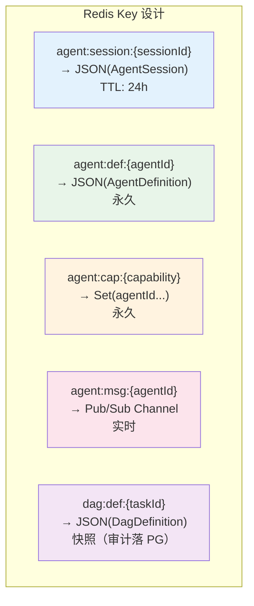

### 8.2 getOrCreate 模式

```java
// store/SessionStateStore.java 的核心
public Mono<AgentSession> getOrCreate(String sessionId, String agentId) {
    String key = "agent:session:" + sessionId;
    return redisTemplate.opsForValue().get(key)
            .map(this::deserialize)
            .switchIfEmpty(Mono.defer(() -> {
                AgentSession newSession = new AgentSession(
                        sessionId, agentId,
                        new ArrayList<>(), new HashMap<>(),
                        LocalDateTime.now(), LocalDateTime.now());
                return redisTemplate.opsForValue()
                        .set(key, serialize(newSession), Duration.ofHours(24))
                        .thenReturn(newSession);
            }));
}
```

关键设计：

1. **`switchIfEmpty` + `Mono.defer`**——defer 确保新建逻辑只在缓存未命中时执行
2. **原子性考虑**——极端情况下两个并发请求可能同时创建。对于会话来说可接受（最终一致），正式环境可用 Redis SETNX
3. **TTL 自动过期**——24 小时后 Redis 自动清理，无需定时任务

> 「遇到阻塞？→ [教程 12-Agent状态管理](../../教程/12-Agent状态管理.md)」

---

## 9. MessageBus：Agent 间通信

### 9.1 Sinks + Redis Pub/Sub

```java
// agent/MessageBus.java 的核心
@Service
public class MessageBus {

    // 本地 Sink：每个 Agent 一个接收器
    private final Map<String, Sinks.Many<AgentMessage>> agentSinks = new ConcurrentHashMap<>();
    // 请求-响应：correlationId -> 响应 Sink
    private final Map<String, Sinks.One<AgentMessage>> pendingResponses = new ConcurrentHashMap<>();

    @PostConstruct
    public void subscribeToRedisChannels() {
        // 订阅广播频道
        redisTemplate.listenToChannel("agent:msg:broadcast")
                .map(ReactiveRedisMessage::getBody)                 // byte[] → 消息体
                .map(body -> new String(body, StandardCharsets.UTF_8))
                .subscribe(json -> dispatchToSink("*", json));

        // 订阅各 Agent 频道（跨实例）
        agentRegistry.findAll()
                .subscribe(agent ->
                        redisTemplate.listenToChannel("agent:msg:" + agent.agentId())
                                .map(ReactiveRedisMessage::getBody)
                                .map(body -> new String(body, StandardCharsets.UTF_8))
                                .subscribe(json -> dispatchToSink(agent.agentId(), json)));
    }

    private void dispatchToSink(String agentId, String json) {
        AgentMessage msg = deserialize(json);
        if (msg.messageId() != null && pendingResponses.containsKey(msg.messageId())) {
            pendingResponses.get(msg.messageId()).tryEmitValue(msg);   // 完成请求-响应
        }
        agentSinks.computeIfAbsent(agentId,
                k -> Sinks.many().multicast().onBackpressureBuffer()
        ).tryEmitNext(msg);
    }
}
```

### 9.2 两层通信模型

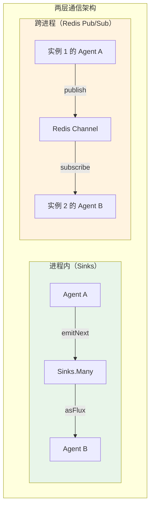

**Sinks（进程内）**：同一 JVM 内的 Agent 间通信，零网络开销，延迟 < 1ms。

**Redis Pub/Sub（跨进程）**：多实例部署时，实例 1 的 Agent 需要与实例 2 的 Agent 通信。Redis 作为消息中转。

> 「遇到阻塞？→ [教程 09-多Agent协作](../../教程/09-多Agent协作.md)」

---

## 10. 关键模式总结

### 10.1 全项目设计模式一览

| 模式 | 应用位置 | 作用 |
|------|---------|------|
| 策略模式 | RoutingStrategy | 路由策略可替换 |
| 注册表模式 | AgentRegistry, ToolRegistry | 动态发现组件 |
| 观察者模式 | Sinks/Flux 事件流 | DAG 事件驱动调度 |
| 模板方法 | AgentExecutor.execute() | 固定五步流程 |
| 降级模式 | 路由降级、错误处理 | 保证可用性 |
| 管控分离 | DagEngine vs AgentExecutor | 编排与执行解耦 |

> 「遇到阻塞？→ [教程 20-管控分离架构](../../教程/20-管控分离架构.md)」

### 10.2 响应式编程模式

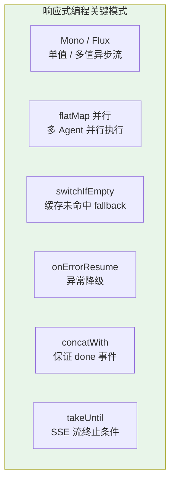

| 模式 | 代码示例 | 使用场景 |
|------|---------|---------|
| flatMap 并行 | `Flux.fromIterable(nodes).flatMap(execute, 10)` | DAG 并行调度 |
| switchIfEmpty | `findById(id).switchIfEmpty(error())` | Agent 不存在时报错 |
| onErrorResume | `.onErrorReturn(0.5)` | 评分失败给默认值 |
| concatWith | `.concatWith(just(doneEvent))` | SSE 流追加 done |
| takeUntil | `.takeUntil(e -> e.isDone())` | SSE 自动断开 |
| Sinks.One | `sink.asMono().timeout(...)` | 审批阻塞等待 |

> 「遇到阻塞？→ [教程 42-响应式错误处理](../../教程/42-响应式错误处理.md)」

---

## 11. 架构决策回顾

### 11.1 关键决策清单

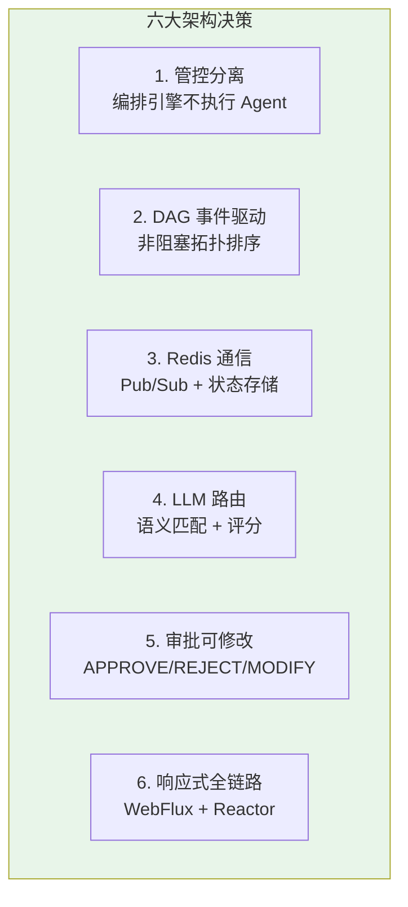

### 11.2 决策权衡分析

| 决策 | 好处 | 代价 |
|------|------|------|
| 管控分离 | 编排和 Agent 独立扩缩容 | 多一层间接调用 |
| DAG 事件驱动 | 高并发、非阻塞 | 调试复杂度高 |
| Redis 通信 | 跨实例、高性能 | 引入 Redis 依赖 |
| LLM 路由 | 语义精准 | 增加延迟 + 成本 |
| 审批可修改 | 灵活性高 | MODIFY 逻辑复杂 |
| 响应式全链路 | 高吞吐 | 学习曲线陡峭 |

每个决策都是权衡——没有银弹。这些选择在"中型企业多 Agent 平台"场景下是最优解，但在超大规模（万级 Agent）或超低延迟（毫秒级路由）场景下可能需要调整。

### 11.3 ADR 决策摘要（全项目）

| ADR | 决策 | 落点 |
|-----|------|------|
| 002-00 | 管控分离：编排与执行解耦 | [00 §9]、DagEngine vs AgentExecutor |
| 002-01 | 任务模型用 DAG，支持并行 + 审批网关 | [00 §9]、TaskParser/DagEngine |
| 002-03 | 工具拦截用 `ToolCallingManager` 装饰器，弃 AOP | [02 §10]、LoggingToolCallingManager |
| 002-04 | 会话用自定义模型 + Redis String + TTL | [02 §12]、SessionStateStore |
| 002-05 | 注册中心用 Redis 能力索引（O(1) 检索） | [03 §13]、RedisAgentRegistry |
| 002-06 | Agent 通信选 Redis Pub/Sub 两层模型 | [03 §13]、MessageBus |
| 002-07 | DAG 引擎响应式事件驱动 + claimed 防重 | [03 §13]、DagEngine |
| 002-08 | 持久化双层：Redis 快照 + PostgreSQL 审计 | [03 §13]、TaskStateStore/TaskRepository |
| 002-09 | 路由多维度评分 + 降级链 | [04 §10]、CompositeRoutingStrategy/AgentRouter |
| 002-10 | 审批用 DAG 审批节点 + Sinks 阻塞等待，fail-safe | [04 §10]、ApprovalGateway |
| 002-11 | MODIFY 审批让人改参数、机器继续 | [04 §10]、DagEngine.executeApprovalNode |

---

## 12. 性能优化建议

### 12.1 已内建的优化

| 优化 | 位置 | 效果 |
|------|------|------|
| 并行调度 | DagEngine.flatMap | 并行加速 2-5x |
| Redis 能力索引 | AgentRegistry Set | O(1) 能力查找 |
| 滑动窗口状态 | SessionStateStore | 控制上下文长度 |
| 工具可观测 | LoggingToolCallingManager | 无侵入观测（正确落点） |
| 路由超时降级 | AgentRouter | 5s 超时保底 |

### 12.2 生产环境建议

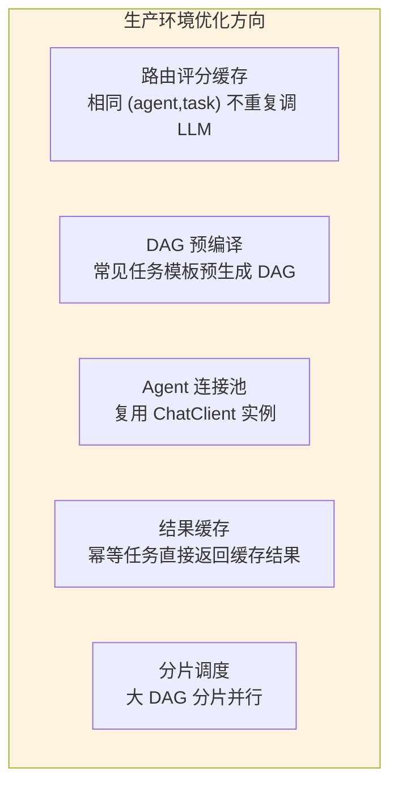

> 「遇到阻塞？→ [教程 38-Agent性能优化](../../教程/38-Agent性能优化.md)」

---

## 13. 总结

本篇对多 Agent 编排平台的全项目核心代码做了深度解析：

1. **AgentDefinition**——record 定义不可变契约，工具与 Agent 解耦通过 Bean 引用绑定
2. **AgentExecutor**——五步执行流程（构建 Client → Prompt → 历史注入 → 工具注入 → 流式执行），每次构建独立 Client 保证隔离
3. **DagEngine**——响应式事件驱动的拓扑排序，`flatMap` 并行调度，节点完成回调触发重新调度，`claimed` 集合防重
4. **RoutingStrategy**——五维度评分（能力 30% + 语义 25% + 成功率 20% + 负载 15% + 延迟 10%），LLM 语义匹配 + 历史数据 + 超时降级
5. **ApprovalGateway**——基于 Sinks.One 的异步阻塞等待 + fail-safe 超时，支持 APPROVE / REJECT / MODIFY 三种审批决策
6. **TaskParser**——LLM 结构化输出将自然语言拆解为 DAG，Spring AI 的 `entity()` 方法自动反序列化
7. **MessageBus**——两层通信模型（进程内 Sinks + 跨进程 Redis Pub/Sub），兼顾性能和可扩展性
8. **六大架构决策**——管控分离、DAG 事件驱动、Redis 通信、LLM 路由、审批可修改、响应式全链路

至此，多 Agent 编排平台的全部 6 篇文档完成：

| 文档 | 核心内容 |
|------|---------|
| [00-需求分析与架构设计](00-需求分析与架构设计.md) | 业务场景、编排架构、API 设计、迭代路线 |
| [01-最小Demo搭建](01-最小Demo搭建.md) | Agent 抽象、注册中心、单 Agent 流式对话 |
| [02-迭代一-单Agent工具链](02-迭代一-单Agent工具链.md) | @Tool 工具注册、状态管理、多轮对话 |
| [03-迭代二-多Agent编排](03-迭代二-多Agent编排.md) | 多 Agent 注册、消息总线、DAG 引擎 |
| [04-迭代三-任务委派与路由](04-迭代三-任务委派与路由.md) | 智能路由、任务委派、审批网关 |
| 05-核心代码讲解（本文档） | 全项目核心代码深度解析 |
