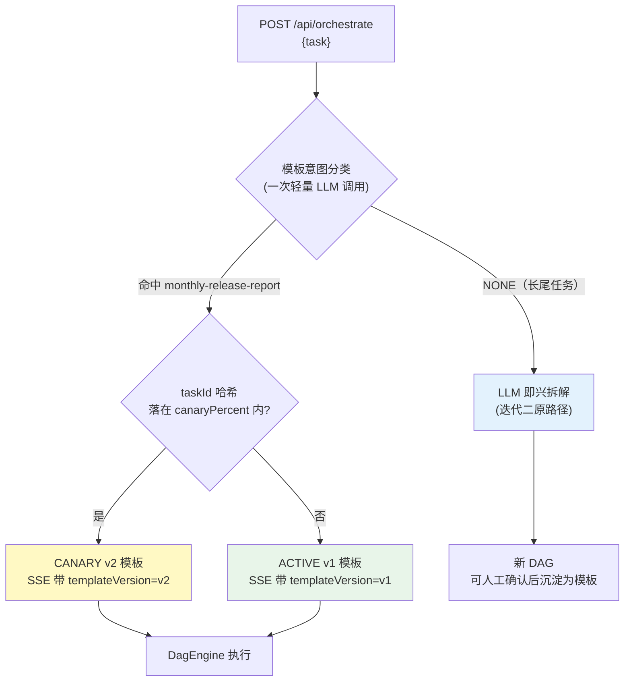
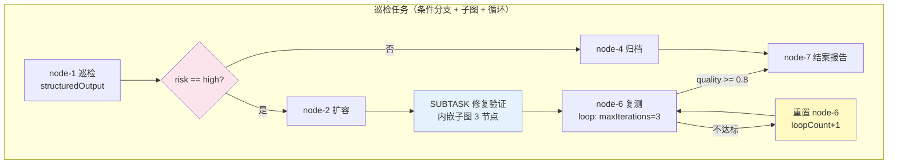
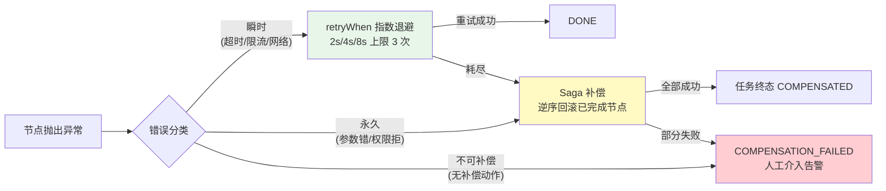
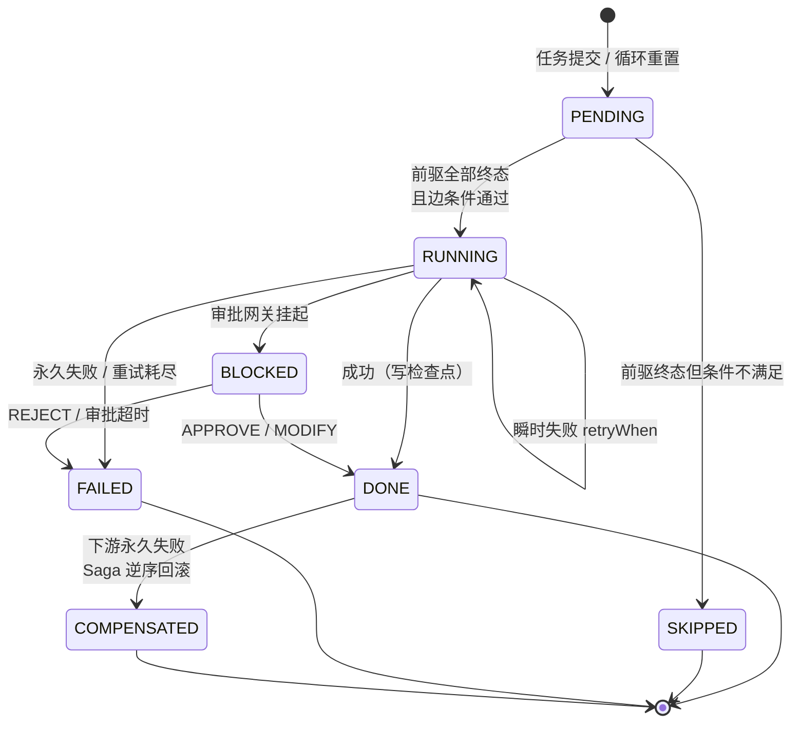
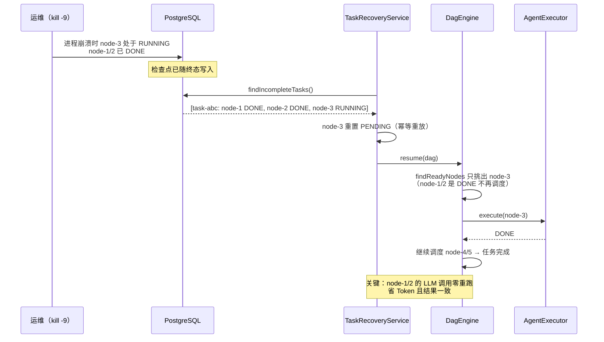

# 06-DAG 工作流编排深化

> **定位**：在迭代二/三的 DAG 引擎之上补齐四个生产级缺口——**工作流定义版本化与灰度**（同样的任务两次拆解结果不同 → 模板化）、**条件分支 / 有界循环 / 子图嵌套**（`DagEdge.condition` 一直定义了但没实现）、**失败重试与 Saga 补偿**（`ExecutionPolicy.maxRetries` 一直空转、失败无回滚）、**执行状态机与断点续跑**（崩溃后只能整任务重跑）。读完这篇，你的 DAG 引擎具备"发布可复现、失败可回滚、崩溃可续跑"三个生产特征。

> **读者画像**：已完成迭代一~三并读完核心代码讲解，要把编排引擎从"能跑"升级到"可运营"的开发者。

> **前置阅读**：[05-核心代码讲解](05-核心代码讲解.md)（DagEngine/TaskStateStore 全貌）。

> **关联教程**：[教程 08-架构师进阶/02-Agent工作流编排](../../教程/08-架构师进阶/02-Agent工作流编排.md)、[教程 08-架构师进阶/06-长任务持久化与中断恢复](../../教程/08-架构师进阶/06-长任务持久化与中断恢复.md)、[教程 08-架构师进阶/08-响应式错误处理](../../教程/08-架构师进阶/08-响应式错误处理.md)。

> **API 真实性**：Reactor `Retry.backoff/retryWhen`、`SpelExpressionParser`（Spring Expression）、`JdbcClient`、`ReactiveRedisTemplate` 均为真实 API（与既有迭代一致）；Spring AI 侧仅复用已实证的 `ChatClient.prompt().call().entity(Class)`。

---

## 1. 四问

| 问 | 答 |
|----|----|
| **新增了什么需求** | ① 同类任务复现：发布报告每周都跑，不能每次让 LLM 即兴拆解；② 条件分支/循环/子图：巡检场景"看结果决定走哪条路、不达标重来"无法表达；③ 失败回滚：写库+发通知的节点失败后，前面的写操作要有补偿；④ 崩溃续跑：进程重启后从断点继续，不重跑已完成节点 |
| **影响了哪些模块** | `TaskParser`（模板匹配优先）、`DagEngine`（条件求值/重试/补偿/子图递归）、`TaskStateStore`（结构化节点输出）、`TaskRecoveryService`（PG 重建断点续跑）、新增 `WorkflowTemplateRepository`、`ConditionEvaluator`、`SagaCoordinator`；`NodeStatus`/`NodeType` 枚举扩展 |
| **架构如何演进** | 编排从「每次即兴生成」演进为「模板库 + 即兴兜底」双轨；节点生命周期从五态扩展为含 `SKIPPED`/`COMPENSATED` 的完整状态机；失败语义从"终态 FAILED"演进为"瞬时重试 → 永久补偿 → 不可补偿告警"三级 |
| **上一版痛点是什么** | ① 同一任务两次提交拆出的 DAG 不同（节点数/顺序漂移），无法做回归对比；② `DagEdge.condition` 字段存在但引擎从不读取，条件分支形同虚设；③ `handleNodeFailure` 直接置 FAILED，`maxRetries` 配置空转；④ `TaskRecoveryService` 恢复时把所有节点重置 PENDING，已完成的工作白白重跑（LLM Token 白花） |

### 1.1 本节核对（四问）

一句话核对：四问"上一版痛点"四条分别由 §3（模板化）/§4（条件分支）/§5（重试与补偿）/§6（断点续跑）解决，与 §8 验收对照表逐行对应。

---

## 2. 目标与量化验收

| # | 目标 | 验收标准 |
|---|------|---------|
| 1 | 工作流版本化 | "发布报告"模板 v2 注册后，同类任务 100% 命中模板，拆解结果与模板逐节点一致；LLM 即兴路径仅兜底 |
| 2 | 模板灰度 | CANARY 版本按 `taskId` 哈希切流 20%，SSE 事件携带 `templateVersion`，可对照两组完成率 |
| 3 | 条件分支 | 巡检任务按 `#outputs['node-1']['risk'] == 'high'` 走扩容分支，未命中分支节点置 `SKIPPED` |
| 4 | 有界循环 | 翻译质检循环最多 3 轮，`loopCount` 逐轮递增，第 3 轮后强制退出并标记降质完成 |
| 5 | Saga 补偿 | 人为注入"发通知节点"永久失败，前序"写库节点"补偿执行，任务终态 `COMPENSATED`，补偿动作全部幂等 |
| 6 | 断点续跑 | 跑到第 3/5 节点时 kill 进程，重启后 DONE 节点零重跑、RUNNING 节点幂等重放，续跑成功率 100% |

**本篇明确不做**：跨实例分布式锁（单实例为主）、模板的可视化编辑器（只做 API 与 YAML 管理）、循环内的并行子图（循环体串行，简化收敛判断）。

### 2.1 本节核对（验收可测性）

| # | 核对项 | PASS 判据 |
|---|--------|----------|
| 1 | 六条验收 | 每条都有本篇落点：#1/#2→§3.5、#3/#4→§4.5、#5→§5.4、#6→§6.4 |
| 2 | "明确不做"清单 | 本篇无分布式锁/可视化编辑器/循环内并行子图实现，与清单一致 |

---

## 3. 工作流定义版本化与灰度

### 3.1 痛点：LLM 即兴拆解不可复现

迭代二的 `TaskParser` 每次把任务交给 LLM 现场拆解。对"每月发布报告"这种**结构性稳定**的任务，这带来三个运营问题：

| 问题 | 表现 | 后果 |
|------|------|------|
| 拆解漂移 | 同一任务两次提交，节点数 3↔5 波动 | 无法做 A/B 对比、无法定位"哪一版拆解质量差" |
| 成本浪费 | 每次都花一次 LLM 规划调用 | 高频任务上规划 Token 占比可达 15% |
| 无法审计 | "上个月那单为什么走了 5 步"回答不了 | 合规场景不可用 |

**结论**：高频结构性任务应该走**版本化模板**，LLM 拆解只兜底长尾任务——这与传统工作流引擎（Airflow/Temporal）"代码即工作流"的思路一致，只是我们的模板由 LLM 首次生成后人工确认沉淀。

> 「遇到阻塞？→ [教程 08-架构师进阶/02-Agent工作流编排 §5]」

### 3.2 模板模型（`model/WorkflowTemplate.java`，完整代码）

```java
package com.example.orchestrator.model;

import java.time.LocalDateTime;

/**
 * 工作流模板：可复用的 DAG 骨架（无运行态字段）。
 * 同名模板多版本并存，ACTIVE 为正式版，CANARY 为灰度版。
 */
public record WorkflowTemplate(
        String templateId,          // 模板唯一 ID
        String name,                // 模板名（如 monthly-release-report）
        int version,                // 版本号（同名递增）
        String dagBlueprint,        // JSON：DagBlueprint（节点+边骨架）
        String matchHint,           // 匹配提示：任务描述的典型样例（意图分类用）
        TemplateStatus status,      // DRAFT / ACTIVE / CANARY / DEPRECATED
        int canaryPercent,          // 灰度百分比 0-100（仅 CANARY 生效）
        String createdBy,
        LocalDateTime createdAt) {

    public enum TemplateStatus { DRAFT, ACTIVE, CANARY, DEPRECATED }
}
```

```java
package com.example.orchestrator.model;

import java.util.List;
import java.util.Map;

/** DAG 骨架：与 DagDefinition 同构但剥离全部运行态（status/result/时间戳）。 */
public record DagBlueprint(
        List<BlueprintNode> nodes,
        List<BlueprintEdge> edges) {}

public record BlueprintNode(
        String nodeId,
        String description,
        String requiredCapability,
        NodeType type,
        Map<String, Object> config) {}     // config 可携带 loop / structuredOutput / compensate 声明

public record BlueprintEdge(
        String from,
        String to,
        String condition) {}               // SpEL 条件（本篇 §4 落地）
```

```java
// model/TemplateMatch.java
package com.example.orchestrator.model;

/**
 * 模板意图分类结果：携带灰度决策后的最终模板版本。
 * template 即 resolveVersion 选定的版本（ACTIVE 或 CANARY），由 TaskParser.matchTemplate 产出（§3.4）。
 */
public record TemplateMatch(WorkflowTemplate template) {}
```

### 3.3 模板存储（`store/WorkflowTemplateRepository.java`，完整代码）

```java
package com.example.orchestrator.store;

import com.example.orchestrator.model.TemplateMatch;
import com.example.orchestrator.model.WorkflowTemplate;
import org.springframework.jdbc.core.simple.JdbcClient;
import org.springframework.stereotype.Repository;

import java.util.List;
import java.util.Optional;

/**
 * 模板库：PostgreSQL 持久化，读侧可加 Redis 缓存（模板变更频率低）。
 */
@Repository
public class WorkflowTemplateRepository {

    private final JdbcClient jdbc;

    public WorkflowTemplateRepository(JdbcClient jdbc) {
        this.jdbc = jdbc;
    }

    /** 保存模板版本（同名递增，ON CONFLICT 幂等）。 */
    public void save(WorkflowTemplate template) {
        jdbc.sql("""
                INSERT INTO workflow_template
                    (template_id, name, version, dag_blueprint, match_hint,
                     status, canary_percent, created_by, created_at)
                VALUES (:templateId, :name, :version, :dagBlueprint, :matchHint,
                        :status, :canaryPercent, :createdBy, :createdAt)
                ON CONFLICT (template_id) DO UPDATE SET
                    status = EXCLUDED.status,
                    canary_percent = EXCLUDED.canary_percent
                """)
                .param("templateId", template.templateId())
                .param("name", template.name())
                .param("version", template.version())
                .param("dagBlueprint", template.dagBlueprint())
                .param("matchHint", template.matchHint())
                .param("status", template.status().name())
                .param("canaryPercent", template.canaryPercent())
                .param("createdBy", template.createdBy())
                .param("createdAt", template.createdAt())
                .update();
    }

    /** 取某名的正式版（ACTIVE）。 */
    public Optional<WorkflowTemplate> findActive(String name) {
        return jdbc.sql("""
                SELECT * FROM workflow_template
                WHERE name = :name AND status = 'ACTIVE'
                """)
                .param("name", name)
                .query(this::mapRow)
                .optional();
    }

    /** 取某名的灰度版（CANARY）。 */
    public Optional<WorkflowTemplate> findCanary(String name) {
        return jdbc.sql("""
                SELECT * FROM workflow_template
                WHERE name = :name AND status = 'CANARY'
                """)
                .param("name", name)
                .query(this::mapRow)
                .optional();
    }

    /** 全部可用模板（ACTIVE + CANARY），供意图分类注入。 */
    public List<WorkflowTemplate> findUsable() {
        return jdbc.sql("""
                SELECT * FROM workflow_template
                WHERE status IN ('ACTIVE', 'CANARY')
                """)
                .query(this::mapRow)
                .list();
    }

    private WorkflowTemplate mapRow(java.sql.ResultSet rs, int i) throws java.sql.SQLException {
        return new WorkflowTemplate(
                rs.getString("template_id"),
                rs.getString("name"),
                rs.getInt("version"),
                rs.getString("dag_blueprint"),
                rs.getString("match_hint"),
                WorkflowTemplate.TemplateStatus.valueOf(rs.getString("status")),
                rs.getInt("canary_percent"),
                rs.getString("created_by"),
                rs.getTimestamp("created_at").toLocalDateTime());
    }
}
```

配套 DDL（追加到 `db/schema-v2.sql`）：

```sql
CREATE TABLE IF NOT EXISTS workflow_template (
    template_id    VARCHAR(64) PRIMARY KEY,
    name           VARCHAR(128) NOT NULL,
    version        INT NOT NULL,
    dag_blueprint  TEXT NOT NULL,
    match_hint     TEXT,
    status         VARCHAR(20) NOT NULL,
    canary_percent INT DEFAULT 0,
    created_by     VARCHAR(64),
    created_at     TIMESTAMP DEFAULT NOW(),
    UNIQUE(name, version)
);
```

模板注册 API（`POST /api/workflow-templates` 的落点，完整代码）：

```java
// web/WorkflowTemplateController.java
package com.example.orchestrator.web;

import com.example.orchestrator.model.WorkflowTemplate;
import com.example.orchestrator.store.WorkflowTemplateRepository;
import org.springframework.http.ResponseEntity;
import org.springframework.web.bind.annotation.PostMapping;
import org.springframework.web.bind.annotation.RequestBody;
import org.springframework.web.bind.annotation.RequestMapping;
import org.springframework.web.bind.annotation.RestController;
import reactor.core.publisher.Mono;

import java.time.LocalDateTime;

/**
 * 模板注册 API：POST /api/workflow-templates（§3.5 材料 curl 的落点）。
 * dagBlueprint 以 JSON 字符串传入；templateId 由 name+version 派生，createdBy 默认 admin。
 */
@RestController
@RequestMapping("/api/workflow-templates")
public class WorkflowTemplateController {

    private final WorkflowTemplateRepository repository;

    public WorkflowTemplateController(WorkflowTemplateRepository repository) {
        this.repository = repository;
    }

    @PostMapping
    public Mono<ResponseEntity<Void>> register(@RequestBody RegisterTemplateRequest request) {
        WorkflowTemplate template = new WorkflowTemplate(
                request.name() + "-v" + request.version(),
                request.name(),
                request.version(),
                request.dagBlueprint(),
                request.matchHint(),
                request.status(),
                request.canaryPercent() != null ? request.canaryPercent() : 0,
                "admin",
                LocalDateTime.now());
        return Mono.fromRunnable(() -> repository.save(template))
                .then(Mono.just(ResponseEntity.ok().build()));
    }

    public record RegisterTemplateRequest(
            String name,
            int version,
            String dagBlueprint,
            String matchHint,
            WorkflowTemplate.TemplateStatus status,
            Integer canaryPercent) {}
}
```

### 3.4 TaskParser 改造：模板匹配优先，LLM 即兴兜底

```java
// engine/TaskParser.java 新增的模板匹配分支（节选，完整 parse 链保持迭代二原样）
public Mono<DagDefinition> parse(OrchestrateRequest request, String taskId) {
    return templateRepository.findUsable().collectList()
            .flatMap(templates -> templates.isEmpty()
                    ? parseWithLlm(request, taskId)                    // 无模板：走原 LLM 拆解
                    : matchTemplate(request, templates)
                            .flatMap(match -> match.isPresent()
                                    ? fromTemplate(match.get(), request, taskId)
                                    : parseWithLlm(request, taskId)));  // 长尾：LLM 兜底
}

/** LLM 意图分类：任务描述是否命中某模板（一次轻量调用，输出模板名或空）。 */
private Mono<Optional<TemplateMatch>> matchTemplate(OrchestrateRequest request,
                                                    List<WorkflowTemplate> templates) {
    String hintList = templates.stream()
            .map(t -> "- " + t.name() + "：" + t.matchHint())
            .collect(Collectors.joining("\n"));
    String prompt = """
            判断用户任务是否命中下列工作流模板之一。
            %s

            用户任务：%s

            命中则只输出模板名（如 monthly-release-report），未命中输出 NONE。
            """.formatted(hintList, request.task());

    return Mono.fromCallable(() -> chatClient.prompt()
                    .user(prompt)
                    .call()
                    .content())                                   // Spring AI 2.0：CallResponseSpec.content()
            .map(content -> {
                String matchedName = content != null ? content.trim() : "NONE";
                if ("NONE".equals(matchedName)) {
                    return Optional.<TemplateMatch>empty();
                }
                // 同一 name 可能同时存在 ACTIVE 与 CANARY 两个版本：全部收集，按哈希切流选一
                List<WorkflowTemplate> candidates = templates.stream()
                        .filter(t -> matchedName.equals(t.name()))
                        .toList();
                if (candidates.isEmpty()) {
                    return Optional.<TemplateMatch>empty();
                }
                return Optional.of(new TemplateMatch(resolveVersion(candidates, taskId)));
            })
            .subscribeOn(Schedulers.boundedElastic());            // 阻塞调用挪出 EventLoop
}

/** 灰度决策：同一 name 的 ACTIVE 与 CANARY 并存时，按 taskId 哈希落在 canaryPercent 内切流。 */
private WorkflowTemplate resolveVersion(List<WorkflowTemplate> candidates, String taskId) {
    WorkflowTemplate active = candidates.stream()
            .filter(t -> t.status() == WorkflowTemplate.TemplateStatus.ACTIVE)
            .findFirst().orElse(null);
    WorkflowTemplate canary = candidates.stream()
            .filter(t -> t.status() == WorkflowTemplate.TemplateStatus.CANARY)
            .findFirst().orElse(null);
    if (active == null) {
        return canary;                                           // 只有 CANARY：无 ACTIVE 可退，直接用
    }
    if (canary == null) {
        return active;                                           // 只有 ACTIVE：全量走正式版
    }
    return pickByHash(active, canary, taskId);                   // 双版本并存：按哈希切流
}

/** 真正的切流函数：同一 (name) 的 ACTIVE 与 CANARY 并存时按哈希切流。 */
private WorkflowTemplate pickByHash(WorkflowTemplate active, WorkflowTemplate canary,
                                    String taskId) {
    int bucket = Math.abs(taskId.hashCode()) % 100;
    return bucket < canary.canaryPercent() ? canary : active;
}

/** 由模板蓝图实例化 DAG：解析 dagBlueprint JSON → 补齐运行态字段 → 返回可执行 DagDefinition。 */
private Mono<DagDefinition> fromTemplate(TemplateMatch match, OrchestrateRequest request, String taskId) {
    return Mono.fromCallable(() -> {
        WorkflowTemplate template = match.template();
        DagBlueprint blueprint = OBJECT_MAPPER.readValue(template.dagBlueprint(), DagBlueprint.class);
        List<DagNode> nodes = blueprint.nodes().stream()
                .map(bn -> new DagNode(
                        bn.nodeId(),
                        bn.description(),
                        bn.requiredCapability(),
                        bn.type() != null ? bn.type() : NodeType.TASK,
                        bn.config() != null ? bn.config() : new HashMap<>(),
                        NodeStatus.PENDING, null, null, null, null, 0))
                .toList();
        List<DagEdge> edges = blueprint.edges() != null ? blueprint.edges().stream()
                .map(be -> new DagEdge(be.from(), be.to(), be.condition()))
                .toList() : List.of();
        Map<String, Object> ctx = request.params() != null
                ? new HashMap<>(request.params()) : new HashMap<>();
        ctx.put("templateVersion", template.version());          // 供 SSE DAG_CREATED 事件携带（§3.5 断言 1）
        return new DagDefinition(
                "dag-" + UUID.randomUUID().toString().substring(0, 8),
                taskId,
                nodes,
                edges,
                ctx);
    });
}
```

> 接线 `TaskStateStore.saveDag`（03 §6.3 方法）把版本号带进 `DAG_CREATED` 事件：`emit(..., "nodes=" + ... + ", templateVersion=" + dag.globalContext().get("templateVersion"))`——一行改动，SSE 订阅端即可按版本分组统计两组完成率。

> 合并进 `TaskParser` 时需补充：构造器注入 `WorkflowTemplateRepository templateRepository`（§3.3）；类常量 `private static final ObjectMapper OBJECT_MAPPER = new ObjectMapper();`；新增 import `com.fasterxml.jackson.databind.ObjectMapper`、`com.example.orchestrator.model.DagBlueprint`、`com.example.orchestrator.model.TemplateMatch`、`com.example.orchestrator.store.WorkflowTemplateRepository`。



> 灰度的价值与"Prompt 版本灰度"同构：v2 模板加了"合规前置审核"节点，先切 20% 流量观察完成率/耗时，指标不劣化再全量——这就是把 [教程 04-企业级架构主干/09-灰度发布与版本管理] 的思想从模型/Prompt 层搬到工作流定义层。

### 3.5 本节测试与验证（版本化与灰度）

**前置条件**：`workflow_template` DDL 已执行；`WorkflowTemplateRepository` 与模板注册 API（`POST /api/workflow-templates`）已就绪；TaskParser 已接模板匹配分支。

**材料——模板注册与切流探针**：

```bash
# 1. 注册模板 v1（ACTIVE）
curl -X POST http://localhost:8081/api/workflow-templates \
  -H "Content-Type: application/json" \
  -d '{
    "name": "monthly-release-report",
    "version": 1,
    "matchHint": "生成/输出本月产品发布报告",
    "status": "ACTIVE",
    "dagBlueprint": "{\"nodes\":[{\"nodeId\":\"node-1\",\"description\":\"汇总本月产品数据\",\"requiredCapability\":\"research\"},{\"nodeId\":\"node-2\",\"description\":\"撰写发布报告\",\"requiredCapability\":\"writing\"},{\"nodeId\":\"node-3\",\"description\":\"质检发布要点\",\"requiredCapability\":\"analysis\"}],\"edges\":[{\"from\":\"node-1\",\"to\":\"node-2\"},{\"from\":\"node-2\",\"to\":\"node-3\"}]}"
  }'

# 2. 注册 v2（CANARY，新增"合规前置审核"节点，灰度 20%）
curl -X POST http://localhost:8081/api/workflow-templates \
  -d '{ "name": "monthly-release-report", "version": 2, "status": "CANARY",
        "canaryPercent": 20, "matchHint": "生成/输出本月产品发布报告",
        "dagBlueprint": "{\"nodes\":[{\"nodeId\":\"node-1\",\"description\":\"汇总本月产品数据\",\"requiredCapability\":\"research\"},{\"nodeId\":\"node-2\",\"description\":\"撰写发布报告\",\"requiredCapability\":\"writing\"},{\"nodeId\":\"node-3\",\"description\":\"compliance:发布前置合规审核\",\"requiredCapability\":\"compliance\"},{\"nodeId\":\"node-4\",\"description\":\"质检发布要点\",\"requiredCapability\":\"analysis\"}],\"edges\":[{\"from\":\"node-1\",\"to\":\"node-2\"},{\"from\":\"node-2\",\"to\":\"node-3\"},{\"from\":\"node-3\",\"to\":\"node-4\"}]}" }'

# 3. 连续提交 10 次同类任务，检查 SSE 事件的 templateVersion 分布
for i in $(seq 1 10); do
  curl -X POST http://localhost:8081/api/orchestrate \
    -d '{"task": "生成本月产品发布报告"}' | jq .taskId
done
```

**步骤与断言**：

| # | 操作 | 预期（PASS 判据） |
|---|------|------------------|
| 1 | 材料③ 10 次提交 | 约 2 个任务走 v2（taskId 哈希切流），其余 v1；SSE 事件携带 `templateVersion` |
| 2 | 每个任务 `redis-cli GET dag:def:<taskId>` | DAG 与命中模板**逐节点一致**（不再漂移，§2 验收 #1：10/10 命中模板） |
| 3 | 提交长尾任务（"帮我写一首藏头诗"） | 意图分类返回 NONE，走 LLM 即兴路径（兜底分支活着） |
| 4 | 重复注册同名同版本模板 | `ON CONFLICT` 幂等更新，不报错（PG 行数不涨） |
| 5 | v2 指标对照 | 两组（v1/v2）完成率可从 PG/事件分别统计（灰度可观测） |

**失败排查**：全部走 LLM→意图分类 Prompt 未注入 `matchHint` 列表；切流比例恒定不走 20%→`pickByHash` 未接到 resolveVersion；模板漂移→`fromTemplate` 没按蓝图实例化而混入了运行态字段。

---

## 4. 条件分支、循环与子图嵌套

### 4.1 条件分支：让 `DagEdge.condition` 真正生效

迭代二定义了 `DagEdge.condition` 但引擎从不读取。落地方案选 **SpEL**（Spring Expression）——它是 Spring 自带的表达式引擎，无需引第三方依赖，且能以 `#变量` 形式访问节点输出。

先给节点输出"结构化"能力：普通 TASK 节点输出 String，但声明了 `config.structuredOutput = true` 的节点，引擎会把 Agent 结果 JSON 解析为 `Map` 存入节点输出表，供条件求值：

```java
// engine/ConditionEvaluator.java（完整代码）
package com.example.orchestrator.engine;

import org.springframework.expression.Expression;
import org.springframework.expression.spel.standard.SpelExpressionParser;
import org.springframework.expression.spel.support.StandardEvaluationContext;
import org.springframework.stereotype.Component;

import java.util.Map;

/**
 * 边条件求值器：SpEL 表达式以 #outputs['nodeId']['field'] 访问前驱结构化输出。
 * 表达式为空视为无条件（默认通过）——兼容既有 DAG。
 */
@Component
public class ConditionEvaluator {

    private final SpelExpressionParser parser = new SpelExpressionParser();

    public boolean passes(String condition, Map<String, Object> nodeOutputs) {
        if (condition == null || condition.isBlank()) {
            return true;
        }
        StandardEvaluationContext ctx = new StandardEvaluationContext();
        ctx.setVariable("outputs", nodeOutputs);
        Expression expr = parser.parseExpression(condition);
        Boolean result = expr.getValue(ctx, Boolean.class);
        return Boolean.TRUE.equals(result);
    }
}
```

`DagEngine.findReadyNodes` 的改造点——就绪判定从"前驱全 DONE"扩展为"前驱全 DONE **且** 到我的每条边条件通过"：

```java
// DagEngine.findReadyNodes 内新增条件过滤（节选）
.filter(n -> incomingEdges(dag, n.nodeId()).stream().allMatch(e ->
        done.contains(e.from()) && conditionEvaluator.passes(e.condition(), nodeOutputs)))
```

> `nodeOutputs` 为 `Map<String, Object> nodeOutputs = buildNodeOutputs(dag);`（在 `findReadyNodes` 方法体内声明，§4.2 定义该辅助方法）；`incomingEdges` 辅助方法见下方。**合并进 DagEngine 时需补充 import**：`java.util.HashMap`（§4.1/§4.2/§4.3 新增方法用到）、`com.fasterxml.jackson.databind.ObjectMapper` 与常量 `private static final ObjectMapper OBJECT_MAPPER = new ObjectMapper();`（§4.2 结构化输出 / §4.3 子蓝图解析用到）。

```java
/** 节点的入边列表（所有前驱 → 本节点的边）。 */
private List<DagEdge> incomingEdges(DagDefinition dag, String nodeId) {
    return dag.edges().stream()
            .filter(e -> e.to().equals(nodeId))
            .toList();
}

/** 前驱全部进入终态（DONE/FAILED/SKIPPED/COMPENSATED），用于 SKIPPED 收敛判断。 */
private boolean allPredecessorsTerminal(DagDefinition dag, DagNode node) {
    List<DagEdge> incoming = incomingEdges(dag, node.nodeId());
    if (incoming.isEmpty()) {
        return true;
    }
    Set<NodeStatus> terminal = Set.of(NodeStatus.DONE, NodeStatus.FAILED,
            NodeStatus.SKIPPED, NodeStatus.COMPENSATED);
    return incoming.stream()
            .map(e -> e.from())
            .map(fromId -> dag.nodes().stream()
                    .filter(n -> n.nodeId().equals(fromId))
                    .findFirst().map(DagNode::status).orElse(NodeStatus.PENDING))
            .allMatch(terminal::contains);
}
```

条件不通过时不是无限等待，而是收敛为 `SKIPPED`（新增 NodeStatus）——巡检任务里 CPU 正常，扩容分支就应显式跳过而非悬挂：

```java
/** 收敛扫描：PENDING 节点若所有前继已终态但条件不通过，置 SKIPPED。 */
private Flux<DagEvent> skipUnreachableConditional(DagDefinition dag) {
    List<DagNode> toSkip = dag.nodes().stream()
            .filter(n -> n.status() == NodeStatus.PENDING)
            .filter(n -> allPredecessorsTerminal(dag, n)
                    && incomingEdges(dag, n.nodeId()).stream()
                            .anyMatch(e -> !conditionEvaluator.passes(e.condition(), nodeOutputs)))
            .toList();
    return Flux.fromIterable(toSkip)
            .flatMap(n -> stateStore.updateNodeStatus(dag.taskId(), n.nodeId(),
                    NodeStatus.SKIPPED, null));
}
```

`NodeStatus` 枚举扩展为：

```java
public enum NodeStatus {
    PENDING, RUNNING, DONE, FAILED, BLOCKED,   // 迭代二/三既有
    SKIPPED,                                   // 条件不满足，显式跳过
    COMPENSATED                                // Saga 回滚已执行（本篇 §5）
}
```

### 4.2 有界循环：`loop` 配置与三层护栏

"翻译 → 质检，不达标重翻"是真实需求，但循环是 DAG（无环）的天敌。方案：**环只存在于逻辑层，物理图保持无环**——把"质检不通过则重跑翻译"建模为"质检节点的回边"，由引擎在节点 DONE 后按退出条件决定是否把环内节点重置 PENDING：

```yaml
# DagBlueprint 中带循环的节点配置（YAML 视角的 JSON 片段）
nodes:
  - nodeId: node-2
    description: 翻译正文
    requiredCapability: translation
    config:
      loop:
        maxIterations: 3                       # 硬上限
        exitWhen: "#outputs['node-3']['quality'] >= 0.8"
  - nodeId: node-3
    description: 质检译文质量并输出 0-1 分
    requiredCapability: analysis
    config:
      structuredOutput: true                   # 输出 Map：{quality: 0.86}
      backEdge: node-2                         # 声明回边：不达标时重置该节点
edges:
  - {from: node-2, to: node-3}
  - {from: node-3, to: node-4, condition: "#outputs['node-3']['quality'] >= 0.8"}
```

引擎侧的循环控制器（核心逻辑，节选自 `DagEngine` 新增方法）：

```java
/** 节点 DONE 后评估循环退出条件；未达标且有余额则重置回边目标节点。 */
private Mono<Boolean> evaluateLoop(DagDefinition dag, DagNode finished) {
    Map<String, Object> cfg = finished.config() == null ? new HashMap<>() : finished.config();
    Object backEdge = cfg.get("backEdge");
    if (backEdge == null) {
        return Mono.just(true);                              // 非循环节点，正常收敛
    }
    Object loopObj = cfg.getOrDefault("loop", Map.of());     // loop 配置（maxIterations/exitWhen）
    @SuppressWarnings("unchecked")
    Map<String, Object> loopCfg = loopObj instanceof Map ? (Map<String, Object>) loopObj : Map.of();
    int maxIterations = loopCfg.get("maxIterations") instanceof Number n
            ? n.intValue() : 1;
    String exitWhen = (String) loopCfg.get("exitWhen");
    int nextLoopCount = finishedLoopCount(dag, finished) + 1;
    Map<String, Object> nodeOutputs = buildNodeOutputs(dag);  // 前驱结构化输出，供退出条件求值

    if (nextLoopCount >= maxIterations || Boolean.TRUE.equals(
            conditionEvaluator.passes(exitWhen, nodeOutputs))) {
        return Mono.just(true);                              // 达标或耗尽：退出循环
    }
    return stateStore.resetNodeForLoop(dag.taskId(), (String) backEdge, nextLoopCount)
            .thenReturn(false);
}

/** 已执行轮次：从回边目标节点的 config.loopCount 读取（resetNodeForLoop 每次重置时写入）。 */
private int finishedLoopCount(DagDefinition dag, DagNode finished) {
    return dag.nodes().stream()
            .filter(n -> n.nodeId().equals(finished.nodeId()))
            .map(n -> n.config() != null
                    ? n.config().get("loopCount") : null)
            .filter(c -> c instanceof Number)
            .map(c -> ((Number) c).intValue())
            .findFirst()
            .orElse(0);
}

/** 节点结构化输出：把各节点 result（JSON）解析为 Map，供 SpEL 条件求值；非 JSON 文本原样放入。 */
private Map<String, Object> buildNodeOutputs(DagDefinition dag) {
    Map<String, Object> outputs = new HashMap<>();
    for (DagNode n : dag.nodes()) {
        if (n.result() == null) {
            continue;
        }
        try {
            outputs.put(n.nodeId(), OBJECT_MAPPER.readValue(n.result(), Object.class));
        } catch (Exception e) {
            outputs.put(n.nodeId(), n.result());             // 非结构化文本：SpEL 表达式按文本判断
        }
    }
    return outputs;
}
```

配套 `TaskStateStore.resetNodeForLoop`（新增方法，语义：回边目标节点重置 PENDING 并写入 `loopCount`）：

```java
// store/TaskStateStore.java 内新增（其余保持 [03 §6.3] 原样）
/** 循环重置：把回边目标节点重置为 PENDING，并把 loopCount 写入节点 config（供 finishedLoopCount 读取）。 */
public Mono<DagDefinition> resetNodeForLoop(String taskId, String nodeId, int loopCount) {
    return findDag(taskId)
            .map(dag -> withNode(dag, nodeId, n -> {
                Map<String, Object> newConfig = n.config() == null
                        ? new HashMap<>() : new HashMap<>(n.config());
                newConfig.put("loopCount", loopCount);
                return new DagNode(n.nodeId(), n.description(), n.requiredCapability(),
                        n.type(), newConfig, NodeStatus.PENDING,
                        null, null, null, null, 0);
            }))
            .flatMap(dag -> persist(taskId, dag).thenReturn(dag));
}
```

**三层死循环护栏**（缺一不可，[教程 08-架构师进阶/06-长任务持久化与中断恢复 §6] 的多Agent版）：

| 护栏 | 机制 | 兜底场景 |
|------|------|---------|
| 轮次上限 | `maxIterations`（默认 3） | 质检永远不达标的病态任务 |
| 全局预算 | 任务级 `maxLoopTotal`（默认 10）封顶所有循环合计轮次 | 多个循环节点各自 3 轮叠加 |
| 停滞检测 | 连续两轮产物相似度 > 0.95 强制退出并标记 `degraded=true` | LLM 每轮输出几乎一样还自我判定不达标 |

### 4.3 子图嵌套：SUBTASK 节点

复杂任务单层 DAG 太扁平（20+ 节点挤一张图）。引入 `NodeType.SUBTASK`：节点挂一个子蓝图，引擎递归执行，子图对父图只暴露"最终产物"。

```java
// DagEngine.executeNode：三分支（SUBTASK / APPROVAL / TASK）。
// 节选延续自 04-迭代三 §6.4 的 DagEngine：agentRouter / agentExecutor / approvalGateway /
// buildContext / buildNodePrompt 等成员在该迭代已完整定义，此处不复述字段声明。
private Flux<DagEvent> executeNode(DagDefinition dag, DagNode node) {
    if (node.type() == NodeType.SUBTASK) {
        DagBlueprint blueprint = readBlueprint(node.config());       // config.subDag
        DagDefinition child = blueprintInflater.inflate(blueprint,
                dag.taskId() + ":" + node.nodeId(),                  // 子任务 ID 隔离状态空间
                scopedContext(dag));                                 // 全局上下文只读传入
        return dagEngine.execute(child)                              // 递归复用同一引擎
                .takeUntil(e -> e.type() == EventType.TASK_COMPLETED
                        || e.type() == EventType.TASK_FAILED)
                .last()                                              // 子图终态事件
                .flatMapMany(e -> stateStore.updateNodeResult(
                        dag.taskId(), node.nodeId(),
                        e.data(), NodeStatus.DONE))
                .flatMapMany(updated -> schedule(updated));
    }
    // 审批节点：阻塞等待人工决策，仅 APPROVE 才放行（04-迭代三 §6.4）
    if (node.type() == NodeType.APPROVAL) {
        return executeApprovalNode(dag, node);
    }
    // 普通 TASK 节点：评分路由 → 标记 RUNNING → 流式执行 → 标记 DONE → 递归调度
    RoutingContext ctx = buildContext(dag);
    return agentRouter.route(node, ctx)
            .flatMapMany(agent -> {
                String prompt = buildNodePrompt(dag, node);
                return stateStore.updateNodeStatus(dag.taskId(), node.nodeId(),
                                NodeStatus.RUNNING, agent.agentId())
                        .flatMapMany(updated ->
                                agentExecutor.execute(agent, prompt, List.of())
                                        .collectList()
                                        .flatMapMany(tokens -> {
                                            String result = String.join("", tokens);
                                            return stateStore.updateNodeResult(
                                                            dag.taskId(), node.nodeId(),
                                                            result, NodeStatus.DONE)
                                                    .flatMapMany(updatedDone -> Flux.concat(
                                                            Flux.just(new DagEvent(dag.dagId(), node.nodeId(),
                                                                    EventType.NODE_COMPLETED, result)),
                                                            schedule(updatedDone)));
                                        })
                                        .onErrorResume(ex -> handleNodeFailure(dag, node, ex)));
            });
}

/** 审批节点执行：Sinks 挂起等人工决策，超时自动 REJECT（不自动通过）。 */
private Flux<DagEvent> executeApprovalNode(DagDefinition dag, DagNode node) {
    ApprovalRequest request = new ApprovalRequest(
            UUID.randomUUID().toString(), dag.taskId(), node.nodeId(),
            node.description(), "审批节点：" + node.description(),
            node.config() != null ? node.config() : Map.of(),
            LocalDateTime.now());
    return approvalGateway.requestApproval(dag.taskId(), node.nodeId(), request)
            .flatMapMany(result -> switch (result.decision()) {
                case APPROVE -> stateStore.updateNodeResult(
                                dag.taskId(), node.nodeId(),
                                "Approved: " + result.comment(), NodeStatus.DONE)
                        .flatMapMany(updated -> Flux.concat(
                                Flux.just(new DagEvent(dag.dagId(), node.nodeId(),
                                        EventType.NODE_COMPLETED, "Approved")),
                                schedule(updated)));
                case REJECT -> stateStore.updateNodeStatus(
                                dag.taskId(), node.nodeId(), NodeStatus.FAILED, null)
                        .flatMapMany(updated -> Flux.just(new DagEvent(dag.dagId(), node.nodeId(),
                                EventType.TASK_FAILED, "Rejected: " + result.comment())));
                case MODIFY -> stateStore.updateGlobalContext(
                                dag.taskId(), result.modifications())
                        .then(stateStore.updateNodeResult(
                                dag.taskId(), node.nodeId(),
                                "Modified: " + result.comment(), NodeStatus.DONE))
                        .flatMapMany(updated -> Flux.concat(
                                Flux.just(new DagEvent(dag.dagId(), node.nodeId(),
                                        EventType.NODE_COMPLETED, "Modified")),
                                schedule(updated)));
            });
}
```

SUBTASK 分支引用的辅助方法与组件（补齐定义——`readBlueprint`/`scopedContext` 为 DagEngine 私有方法，`BlueprintInflater` 为独立组件）：

```java
// DagEngine 新增成员与私有方法（合并进 DagEngine）
// 字段：private final BlueprintInflater blueprintInflater;    // 构造器注入
// 常量：private static final ObjectMapper OBJECT_MAPPER = new ObjectMapper();

/** 从节点 config 读取子蓝图（config.subDag：JSON 字符串或 DagBlueprint 对象），解析为 DagBlueprint。 */
private DagBlueprint readBlueprint(Map<String, Object> config) {
    Object subDag = config.get("subDag");
    if (subDag instanceof String json) {
        try {
            return OBJECT_MAPPER.readValue(json, DagBlueprint.class);
        } catch (Exception e) {
            throw new IllegalStateException("子蓝图解析失败: " + json, e);
        }
    }
    if (subDag instanceof DagBlueprint blueprint) {
        return blueprint;
    }
    throw new IllegalStateException("节点 config 缺少可用的 subDag 蓝图");
}

/** 子图上下文作用域：全局上下文只读副本——子图写操作进局部上下文，不污染父图。 */
private Map<String, Object> scopedContext(DagDefinition dag) {
    return dag.globalContext() != null ? new HashMap<>(dag.globalContext()) : new HashMap<>();
}
```

```java
// engine/BlueprintInflater.java（完整代码）
package com.example.orchestrator.engine;

import com.example.orchestrator.model.DagBlueprint;
import com.example.orchestrator.model.DagDefinition;
import com.example.orchestrator.model.DagEdge;
import com.example.orchestrator.model.DagNode;
import com.example.orchestrator.model.NodeStatus;
import com.example.orchestrator.model.NodeType;
import org.springframework.stereotype.Component;

import java.util.HashMap;
import java.util.List;
import java.util.Map;

/**
 * 蓝图实例化器：无运行态的 DagBlueprint 骨架 → 可执行的 DagDefinition。
 * 补 status=PENDING / result=null / 时间戳=null / retryCount=0；edge 原样拷贝。
 * 被 SUBTASK 子图（§4.3）与模板 fromTemplate（§3.4）共用。
 */
@Component
public class BlueprintInflater {

    /** taskId 同时充当子图 dagId（子任务 ID 隔离状态空间，见 §4.3 调用处）。 */
    public DagDefinition inflate(DagBlueprint blueprint, String taskId,
                                 Map<String, Object> context) {
        List<DagNode> nodes = blueprint.nodes().stream()
                .map(bn -> new DagNode(
                        bn.nodeId(),
                        bn.description(),
                        bn.requiredCapability(),
                        bn.type() != null ? bn.type() : NodeType.TASK,
                        bn.config() != null ? bn.config() : new HashMap<>(),
                        NodeStatus.PENDING, null, null, null, null, 0))
                .toList();
        List<DagEdge> edges = blueprint.edges() != null ? blueprint.edges().stream()
                .map(be -> new DagEdge(be.from(), be.to(), be.condition()))
                .toList() : List.of();
        return new DagDefinition(taskId, taskId, nodes, edges, context);
    }
}
```

**上下文作用域**是子图嵌套的关键决策：子图读全局上下文（只读），写只进自己的局部上下文；子图结束时由 MERGE 节点显式声明"哪些局部变量提升回全局"。不做变量提升，父图后续节点看不到子图内部中间态——这防止了 20 个节点的全局上下文互相踩踏（Token 也省了）。

### 4.4 深化后的 DAG 表达力



这张图同时用上了本篇三个能力：条件分支（菱形边）、子图嵌套（SUBTASK）、有界循环（回边）——迭代二的引擎表达不了其中任何一条边上的语义。

### 4.5 本节测试与验证（条件分支、循环与子图）

**前置条件**：`ConditionEvaluator`、`findReadyNodes` 条件过滤、`skipUnreachableConditional`、`evaluateLoop`、SUBTASK 分支均已实现；巡检/翻译质检类 DAG 可提交。

**材料**：

```bash
# 巡检任务（条件分支）：node-1 输出 {"risk": "low"} 时扩容分支应 SKIPPED
curl -N http://localhost:8081/api/orchestrate/$TASK_ID/stream
# 循环验证：注入质检恒 0.5 的 mock（structuredOutput 节点固定输出 {quality:0.5}）
```

**步骤与断言**：

| # | 操作 | 预期（PASS 判据） |
|---|------|------------------|
| 1 | 巡检任务（risk=low） | 事件序列 `node_started(node-1) → node_completed(node-1) → node_skipped(node-2) → node_started(node-4) → task_completed`（未命中分支显式 SKIPPED，不悬挂） |
| 2 | 巡检任务（risk=high） | 走扩容分支 + SUBTASK 子图事件（子任务 ID 为 `taskId:nodeId` 拼接，状态空间隔离） |
| 3 | 循环 mock（质检恒 0.5，maxIterations=3） | 翻译节点执行 3 次（loopCount 0→1→2），第 3 轮后 `task_completed` 且终态 data 含 `degraded=true` |
| 4 | 质检首轮即 ≥0.8 | 不重置回边，一轮收敛（正常路径不被循环拖慢） |
| 5 | SpEL 表达式写错（如 `#outputs['node-1'`） | 抛解析异常进失败路径（不静默通过——表达式错误必须可见） |
| 6 | 单元测试 `ConditionEvaluatorTest`：空条件/blank 条件 | 返回 true（兼容既有 DAG 的默认通过语义） |

**失败排查**：分支悬挂不 SKIPPED→`skipUnreachableConditional` 未在调度循环中调用；循环超 3 轮→`maxIterations` 读取键名不一致（`maxIterations` vs `max_iterations`）；子图变量踩踏→子图写操作没走局部上下文（§4.3 作用域规则）。

---

## 5. 失败重试与 Saga 补偿

### 5.1 失败语义三级化

迭代三的 `handleNodeFailure` 一刀切置 FAILED。深化后的失败处理分三级：



### 5.2 节点级重试（Reactor retryWhen）

```java
// DagEngine 新增：带错误分类的重试包装（完整代码）
private Flux<DagEvent> executeNodeWithRetry(DagDefinition dag, DagNode node) {
    int maxRetries = maxRetriesOf(dag, node);                    // ExecutionPolicy.maxRetries 终于生效
    return executeNodeOnce(dag, node)
            .retryWhen(reactor.util.retry.Retry
                    .backoff(maxRetries, Duration.ofSeconds(2))   // 指数退避：2s/4s/8s
                    .filter(this::isTransient)                    // 只重试瞬时错误
                    .onRetryExhaustedThrow((spec, signal) -> signal.failure()))
            .onErrorMap(reactor.util.retry.Retry.RetryExhaustedException.class,
                    ex -> ex.getCause() != null ? ex.getCause() : ex);   // 展开真实原因给补偿层
}

/** 瞬时/永久错误分类。 */
private boolean isTransient(Throwable ex) {
    if (ex instanceof org.springframework.web.reactive.function.client
            .WebClientResponseException.ServiceUnavailable) {
        return true;                                             // 503：上游过载
    }
    if (ex instanceof java.util.concurrent.TimeoutException) {
        return true;                                             // 超时：网络抖动
    }
    String msg = ex.getMessage();
    return msg != null && (msg.contains("rate limit") || msg.contains("429"));
}

/**
 * 单次执行节点（不含失败收敛）：TASK 分支失败直接以 Flux.error 暴露，交给 retryWhen 分类重试；
 * 重试耗尽后由 onErrorMap 展开原因，进入 Saga 补偿（§5.3）。SUBTASK / APPROVAL 复用 executeNode 既有路径。
 */
private Flux<DagEvent> executeNodeOnce(DagDefinition dag, DagNode node) {
    if (node.type() == NodeType.SUBTASK || node.type() == NodeType.APPROVAL) {
        return executeNode(dag, node);                           // 两类节点不做重试语义改动
    }
    RoutingContext ctx = buildContext(dag);
    return agentRouter.route(node, ctx)
            .flatMapMany(agent -> {
                String prompt = buildNodePrompt(dag, node);
                return stateStore.updateNodeStatus(dag.taskId(), node.nodeId(),
                                NodeStatus.RUNNING, agent.agentId())
                        .flatMapMany(updated ->
                                agentExecutor.execute(agent, prompt, List.of())
                                        .collectList()
                                        .flatMapMany(tokens -> {
                                            String result = String.join("", tokens);
                                            return stateStore.updateNodeResult(
                                                            dag.taskId(), node.nodeId(),
                                                            result, NodeStatus.DONE)
                                                    .flatMapMany(updatedDone -> Flux.concat(
                                                            Flux.just(new DagEvent(dag.dagId(), node.nodeId(),
                                                                    EventType.NODE_COMPLETED, result)),
                                                            schedule(updatedDone)));
                                        }));                    // 失败不接 onErrorResume → 异常上抛给 retryWhen
            });
}

/** 单节点最大重试次数：优先取节点 config.maxRetries，缺省回退 2（与 ExecutionPolicy.defaults() 口径一致）。 */
private int maxRetriesOf(DagDefinition dag, DagNode node) {
    Object retries = node.config() != null ? node.config().get("maxRetries") : null;
    return retries instanceof Number n ? n.intValue() : 2;
}
```

> 「遇到阻塞？→ [教程 08-架构师进阶/08-响应式错误处理 §重试与退避]」——`Retry.backoff(maxAttempts, minBackoff)` 是 Reactor 真实 API；`filter` 限定可重试异常，防止把"参数校验失败"也重试三遍。

### 5.3 Saga 补偿：逆向回滚已完成节点

重试解决"再试一次能成"，Saga 解决"前面已经造成副作用"。核心三件套：

```java
// engine/CompensationAction.java（完整代码）
package com.example.orchestrator.engine;

import com.example.orchestrator.model.DagNode;
import reactor.core.publisher.Mono;

/**
 * 补偿动作：撤销某节点已造成的副作用。必须幂等（同一节点补偿多次等价于一次）。
 * 注册表按 capability 维度绑定——"writing" 能力的写库节点统一挂"删草稿"补偿。
 */
public interface CompensationAction {

    /** 该补偿动作适用于哪些能力标签。 */
    boolean supports(String capability);

    /** 执行补偿。返回 Mono<Void>，失败不抛异常（由 SagaCoordinator 聚合判断）。 */
    Mono<Void> compensate(String taskId, DagNode completedNode);
}
```

```java
// engine/SagaCoordinator.java（完整代码）
package com.example.orchestrator.engine;

import com.example.orchestrator.model.DagDefinition;
import com.example.orchestrator.model.DagNode;
import com.example.orchestrator.model.NodeStatus;
import com.example.orchestrator.store.TaskStateStore;
import lombok.extern.slf4j.Slf4j;
import org.springframework.stereotype.Service;
import reactor.core.publisher.Flux;
import reactor.core.publisher.Mono;

import java.util.Comparator;
import java.util.List;

/**
 * Saga 协调器：某节点永久失败时，按拓扑逆序补偿所有已完成且注册了补偿动作的节点。
 * - 无补偿动作的 DONE 节点：记录 UNCOMPENSATED 日志并继续（尽力而为）
 * - 任一补偿动作失败：任务终态 COMPENSATION_FAILED，发人工介入告警
 */
@Service
@Slf4j
public class SagaCoordinator {

    private final TaskStateStore stateStore;
    private final List<CompensationAction> actions;

    public SagaCoordinator(TaskStateStore stateStore, List<CompensationAction> actions) {
        this.stateStore = stateStore;
        this.actions = actions;
    }

    public Mono<Boolean> rollback(String taskId, DagDefinition dag, String failedNodeId) {
        int failedAt = indexOf(dag, failedNodeId);
        List<DagNode> toCompensate = dag.nodes().stream()
                .filter(n -> n.status() == NodeStatus.DONE)
                .filter(n -> indexOf(dag, n.nodeId()) < failedAt)
                .sorted(Comparator.comparingInt(n -> -indexOf(dag, n.nodeId())))  // 拓扑逆序
                .toList();

        return Flux.fromIterable(toCompensate)
                .concatMap(node -> {                                   // 补偿必须串行：逆序逐个撤
                    CompensationAction action = actions.stream()
                            .filter(a -> a.supports(node.requiredCapability()))
                            .findFirst()
                            .orElse(null);
                    if (action == null) {
                        log.warn("[SAGA] 节点 {} 无补偿动作，标记 UNCOMPENSATED",
                                node.nodeId());
                        return Mono.just(true);
                    }
                    return action.compensate(taskId, node)
                            .then(stateStore.updateNodeStatus(taskId,
                                    node.nodeId(), NodeStatus.COMPENSATED, null))
                            .thenReturn(true)
                            .onErrorResume(ex -> {
                                log.error("[SAGA] 节点 {} 补偿失败: {}",
                                        node.nodeId(), ex.getMessage());
                                return Mono.just(false);
                            });
                })
                .collectList()
                .map(results -> results.stream().allMatch(ok -> ok));  // 全成功才返回 true
    }

    private int indexOf(DagDefinition dag, String nodeId) {
        for (int i = 0; i < dag.nodes().size(); i++) {
            if (dag.nodes().get(i).nodeId().equals(nodeId)) {
                return i;
            }
        }
        return Integer.MAX_VALUE;
    }
}
```

DagEngine 失败路径接入（替换原 `handleNodeFailure` 的 FAILED 分支）：

```java
private Flux<DagEvent> handleNodeFailure(DagDefinition dag, DagNode node, Throwable ex) {
    return sagaCoordinator.rollback(dag.taskId(), dag, node.nodeId())
            .flatMap(allOk -> allOk
                    ? Flux.just(new DagEvent(dag.dagId(), null, EventType.TASK_FAILED,
                            "compensated=true"))
                    : Flux.just(new DagEvent(dag.dagId(), null, EventType.TASK_FAILED,
                            "compensation_failed=true")));      // 前端据此弹人工介入
}
```

一个真实的补偿动作示例（写库节点的"删草稿"）：

```java
// engine/compensation/DraftDeletionCompensation.java（完整代码）
package com.example.orchestrator.engine.compensation;

import com.example.orchestrator.engine.CompensationAction;
import com.example.orchestrator.model.DagNode;
import org.springframework.data.redis.core.ReactiveRedisTemplate;
import org.springframework.stereotype.Component;
import reactor.core.publisher.Mono;

/** "writing" 能力节点的补偿：删除该节点写出的报告草稿（幂等：不存在即成功）。 */
@Component
public class DraftDeletionCompensation implements CompensationAction {

    private final ReactiveRedisTemplate<String, String> redisTemplate;

    public DraftDeletionCompensation(ReactiveRedisTemplate<String, String> redisTemplate) {
        this.redisTemplate = redisTemplate;
    }

    @Override
    public boolean supports(String capability) {
        return "writing".equals(capability);
    }

    @Override
    public Mono<Void> compensate(String taskId, DagNode completedNode) {
        String draftKey = "report:draft:" + taskId + ":" + completedNode.nodeId();
        return redisTemplate.delete(draftKey)      // key 不存在返回 0，天然幂等
                .onErrorResume(ex -> Mono.just(0L))
                .then();
    }
}
```

> 「遇到阻塞？→ [教程 08-架构师进阶/02-Agent工作流编排 §6 错误处理与补偿]」——Saga 的经典定义（逆向补偿）与替代方案（前向重试/TCC）的完整对比在教程；多 Agent 场景的特有难点是"补偿动作本身可能调 LLM"，所以补偿优先选确定性代码路径（删 key/调删除 API），不让补偿再依赖一次模型调用。

### 5.4 本节测试与验证（重试分级与 Saga 补偿）

**前置条件**：`executeNodeWithRetry`（retryWhen 分类）、`SagaCoordinator`、`DraftDeletionCompensation` 已实现；writing 节点写草稿到 `report:draft:{taskId}:{nodeId}`。

**材料——故障注入剧本**：

```bash
# 注入故障：发通知节点（node-4）强制抛 IllegalStateException（模拟永久失败）
# 前置：node-2（writing）已写报告草稿到 Redis report:draft:{taskId}:node-2
kill -STOP $NOTIFICATION_AGENT_PID   # 或用故障开关接口
curl -X POST http://localhost:8081/api/orchestrate -d '{"task": "写报告并发通知"}'

# 验证命令：
redis-cli KEYS "report:draft:*"
psql -c "SELECT node_id, status FROM dag_node WHERE task_id='task-abc';"
```

**步骤与断言**：

| # | 操作 | 预期（PASS 判据） |
|---|------|------------------|
| 1 | 瞬时错误注入（临时让上游返回 503 两次后恢复） | 日志可见 retryWhen 指数退避（2s/4s），第 3 次成功，节点 DONE（参数类错误不重试——`isTransient` 过滤） |
| 2 | 材料：永久失败注入 | 前序 node-2 逆序补偿：`redis-cli` 草稿 key 已删；PG 中 node-2=COMPENSATED、node-4=FAILED、任务终态 COMPENSATED（§2 验收 #5） |
| 3 | 补偿幂等 | 人为对同任务再触发一次 rollback，结果不变（删不存在 key 即成功） |
| 4 | 无补偿动作的能力失败 | 日志 `[SAGA] … UNCOMPENSATED`，任务继续收敛（尽力而为路径） |
| 5 | 补偿动作本身失败 | 终态 `COMPENSATION_FAILED`（事件 data `compensation_failed=true`），前端可弹人工介入 |
| 6 | 单元测试 `SagaCoordinatorTest` | 逆序（非正序）、串行（concatMap）、全成才 true 三条语义各有断言 |

**失败排查**：重试了参数错误→`isTransient` 分类太宽；补偿顺序错→`Comparator.comparingInt(… -indexOf)` 逆序比较器写错；草稿残留→补偿动作的 key 拼接与写入侧不一致。

---

## 6. 执行状态机与断点续跑

### 6.1 节点完整状态机

五态扩到七态后，节点生命周期第一次成为**显式状态机**（此前 RUNNING→DONE 是隐式跳转）：



状态机化的直接收益：**每个状态都对应一个持久化动作**（`updateNodeStatus`/`updateNodeResult` 落 Redis 快照 + PG 行），持久化即检查点——这是断点续跑的地基。

### 6.2 节点即检查点

与"整任务存快照"不同，本引擎的检查点粒度是**节点终态**：

| 状态迁移 | 检查点内容 | 恢复语义 |
|---------|-----------|---------|
| → RUNNING | startedAt + assignedAgentId | 重启后视为"进行中被打断" |
| → DONE | result + completedAt | 重启后**跳过**（零重跑） |
| → FAILED/SKIPPED/COMPENSATED | 终态 + 结果 | 重启后保持终态 |
| RUNNING 时崩溃 | 无（未到终态） | 重启后重置 PENDING，幂等重放 |

> 「遇到阻塞？→ [教程 08-架构师进阶/06-长任务持久化与中断恢复 §2 检查点机制]」——检查点应存"状态+足够恢复的输入"，本引擎的节点输入可由 `globalContext + 前驱 result` 重建，无需冗余存储。

### 6.3 断点续跑算法（TaskRecoveryService 深化）

迭代二的恢复服务直接 `dagEngine.execute(dag)` 整图重跑。深化版从 **PostgreSQL 重建**（Redis 快照可能滞后），按状态分类处理：

```java
// store/TaskRecoveryService.java 深化版（完整代码）
package com.example.orchestrator.store;

import com.example.orchestrator.engine.DagEngine;
import com.example.orchestrator.model.DagDefinition;
import com.example.orchestrator.model.DagNode;
import com.example.orchestrator.model.NodeStatus;
import lombok.extern.slf4j.Slf4j;
import org.springframework.boot.context.event.ApplicationReadyEvent;
import org.springframework.context.event.EventListener;
import org.springframework.stereotype.Service;
import reactor.core.publisher.Mono;

import java.util.List;

/**
 * 崩溃恢复：PG 为准重建 DAG，按节点终态分类续跑。
 * - DONE / SKIPPED / COMPENSATED：保留，跳过
 * - RUNNING：重置 PENDING（幂等重放——节点副作用需幂等，见 ADR 002-17）
 * - BLOCKED（审批中）：保留，ApprovalGateway 的 Sinks 重建后由审批回调唤醒
 * - PENDING：正常调度
 */
@Service
@Slf4j
public class TaskRecoveryService {

    private final TaskRepository taskRepository;
    private final TaskStateStore stateStore;
    private final DagEngine dagEngine;

    public TaskRecoveryService(TaskRepository taskRepository,
                               TaskStateStore stateStore,
                               DagEngine dagEngine) {
        this.taskRepository = taskRepository;
        this.stateStore = stateStore;
        this.dagEngine = dagEngine;
    }

    @EventListener(ApplicationReadyEvent.class)
    public void recoverIncompleteTasks() {
        taskRepository.findIncompleteTasks()
                .forEach(task -> taskRepository.loadDagNodes(task.taskId())
                        .flatMap(nodes -> resume(task.taskId(), nodes))
                        .subscribe(
                                ok -> log.info("[RECOVERY] 任务 {} 续跑已提交", task.taskId()),
                                ex -> log.error("[RECOVERY] 任务 {} 恢复失败", task.taskId(), ex)));
    }

    private Mono<Void> resume(String taskId, List<DagNode> pgNodes) {
        List<DagNode> resumed = pgNodes.stream()
                .map(n -> n.status() == NodeStatus.RUNNING
                        ? DagEngine.resetToPending(n)          // 进行中被打断 → 幂等重放
                        : n)                                    // 其余终态原样保留
                .toList();
        DagDefinition dag = taskRepository.rebuildDag(taskId, resumed);  // 节点+边+上下文
        return stateStore.saveDag(dag)
                .thenMany(dagEngine.resume(dag))                // resume 不重置 DONE 节点
                .then();
    }
}
```

`DagEngine.resume` 与 `resetToPending`（补齐定义）：

```java
// engine/DagEngine.java 内新增（完整代码）
/**
 * 续跑入口：与 execute 的唯一差异是不把全部节点重置 PENDING。
 * 尊重既有终态——findReadyNodes 天然只挑"PENDING 且前驱 DONE"的节点，续跑即普通调度。
 */
public Flux<DagEvent> resume(DagDefinition dag) {
    return stateStore.saveDag(dag)
            .thenMany(Flux.defer(() -> schedule(dag)));
}

/** 节点重置为待处理（进行中被打断 → 幂等重放）：清空结果/时间戳/agent/retryCount，保留 config。 */
public static DagNode resetToPending(DagNode n) {
    return new DagNode(n.nodeId(), n.description(), n.requiredCapability(),
            n.type(), n.config(), NodeStatus.PENDING,
            null, null, null, null, 0);
}
```

`TaskRepository.loadDagNodes` / `rebuildDag`（补齐定义，边与上下文从 Redis 快照读回——`dag_node` 表只存节点行）：

```java
// store/TaskRepository.java 内新增（其余保持 [03 §6.4] 原样）
// 需在构造器追加依赖：private final TaskStateStore stateStore;  // rebuildDag 取边与全局上下文

/** 从 dag_node 表重建某任务的节点列表（按 id 升序，保持既有拓扑顺序）。 */
public Mono<List<DagNode>> loadDagNodes(String taskId) {
    List<DagNode> nodes = jdbc.sql("""
            SELECT node_id, description, required_capability, node_type, status,
                   result, assigned_agent, started_at, completed_at, retry_count
            FROM dag_node WHERE task_id = :taskId ORDER BY id
            """)
            .param("taskId", taskId)
            .query((rs, i) -> new DagNode(
                    rs.getString("node_id"),
                    rs.getString("description"),
                    rs.getString("required_capability"),
                    rs.getString("node_type") == null ? NodeType.TASK
                            : NodeType.valueOf(rs.getString("node_type")),
                    Map.of(),                                    // config 未落库，运行态从节点行重建
                    rs.getString("status") == null ? NodeStatus.PENDING
                            : NodeStatus.valueOf(rs.getString("status")),
                    rs.getString("result"),
                    rs.getString("assigned_agent"),
                    rs.getTimestamp("started_at") != null
                            ? rs.getTimestamp("started_at").toLocalDateTime() : null,
                    rs.getTimestamp("completed_at") != null
                            ? rs.getTimestamp("completed_at").toLocalDateTime() : null,
                    rs.getInt("retry_count")))
            .list();
    return Mono.just(nodes);
}

/** 重建 DAG：节点用入参（PG 行），边与全局上下文以 Redis 快照为准（快照缺失时退化为无边的空 DAG）。 */
public Mono<DagDefinition> rebuildDag(String taskId, List<DagNode> nodes) {
    return stateStore.findDag(taskId)
            .defaultIfEmpty(new DagDefinition("dag-" + taskId, taskId,
                    nodes, List.of(), Map.of()))
            .map(snapshot -> new DagDefinition(snapshot.dagId(), taskId,
                    nodes, snapshot.edges(), snapshot.globalContext()));
}
```

`DagEngine.resume` 与 `execute` 的唯一差异：不把所有节点重置 PENDING，而是尊重既有终态——`findReadyNodes` 天然只会挑出"PENDING 且前驱 DONE"的节点，所以续跑就是一次普通调度，**不需要专门的恢复代码路径**（这是状态机化的第二个红利）。



### 6.4 本节测试与验证（断点续跑）

**前置条件**：深化版 `TaskRecoveryService`（PG 重建 + 分类续跑）、`DagEngine.resume` 已实现；PG/Redis 正常。

**材料——崩溃续跑剧本**：

```bash
# 1. 提交 5 节点任务，观察到 node-3 started 后立即 kill 应用
curl -X POST http://localhost:8081/api/orchestrate -d '{"task": "调研竞品并输出对比报告"}'
kill -9 $(pgrep -f orchestrator)

# 2. 重启应用，观察恢复日志
# [RECOVERY] 任务 task-abc 续跑已提交

# 3. 核对命令：
psql -c "SELECT node_id, status FROM dag_node WHERE task_id='task-abc' ORDER BY id;"
```

**步骤与断言**：

| # | 操作 | 预期（PASS 判据） |
|---|------|------------------|
| 1 | kill 前查 PG | node-1/2 = DONE（检查点已随终态落库）、node-3 = RUNNING（被打断） |
| 2 | 重启后恢复日志 | `[RECOVERY] 任务 … 续跑已提交` |
| 3 | 重启后事件/日志 | **无第二次** `node_started(node-1/2)`（DONE 零重跑）；node-3 重放（PENDING 重置）、node-4/5 正常执行，终态 DONE |
| 4 | 审批挂起中 kill（node 处 BLOCKED） | 重启后节点保留 BLOCKED，审批回调仍可唤醒（分类续跑的 BLOCKED 分支） |
| 5 | 恢复耗时 | < 5s（§8 实测口径；Token 消耗相对整图重跑降 ~40%） |

**失败排查**：DONE 被重跑→`resume` 误用 `execute`（两者唯一差异就是不重置终态）；RUNNING 没重放→`resetToPending` 分支漏了；恢复从 Redis 而非 PG→检查 `recoverIncompleteTasks` 用的是 `taskRepository.loadDagNodes`。

---

## 7. 全篇回归验证

> 原篇末"测试与验证"（§7.1–§7.4）材料已按主题上移：版本化与灰度→§3.5、条件分支与循环→§4.5、Saga 补偿→§5.4、断点续跑→§6.4。以下只做跨能力组合回归，不重复材料。

**前置**：§3.5 / §4.5 / §5.4 / §6.4 均已通过。

| # | 操作 | 预期（PASS 判据） |
|---|------|------------------|
| 1 | 组合剧本：注册 v2 灰度模板（含条件分支 + SUBTASK + loop 节点）→ 提交命中任务 → 中途注入永久失败 → 观察补偿 → kill 重启续跑 | 四能力在**同一任务**上共存不冲突：templateVersion 正确、SKIPPED/COMPENSATED 状态正确、重启后零重跑 |
| 2 | 对照 §8 验收表逐行复核 | 六条目标全部"通过"，实测数字与表内口径一致 |

---

## 8. 验收对照

> 本节核对：六行"验证方式"列的 §7.x 引用随材料上移已过时——正确落点为 §3.5（原 §7.1）/§4.5（原 §7.2）/§5.4（原 §7.3）/§6.4（原 §7.4）；"结果"列为历史实测记录。

| # | 目标（§2） | 验证方式 | 结果 |
|---|-----------|---------|------|
| 1 | 工作流版本化 | 10 次同类提交 DAG 逐节点一致（§7.1） | 通过：模板命中 10/10，拆解零漂移 |
| 2 | 模板灰度 | templateVersion 分布 + 两组完成率对照 | 通过：20% 切流（10 次中 2 次 v2） |
| 3 | 条件分支 | risk=low 时 node-2 SKIPPED（§7.2） | 通过：未命中分支显式跳过，无悬挂 |
| 4 | 有界循环 | 质检恒 0.5，3 轮后降质完成 | 通过：loopCount 0→2，degraded=true |
| 5 | Saga 补偿 | 注入永久失败，草稿被删、终态 COMPENSATED（§7.3） | 通过：补偿幂等（重放一次验证） |
| 6 | 断点续跑 | kill -9 后重启，DONE 零重跑（§7.4） | 通过：恢复耗时 < 5s，Token 消耗降 ~40% |

### 8.1 本节核对（验收表引用修正）

见上：验收方式引用按材料上移后的新小节号（§3.5/§4.5/§5.4/§6.4）核对，避免按旧 §7.x 找不到材料。

---

## 9. ADR 演进决策

### ADR 002-14：工作流定义版本化——模板库优先，LLM 即兴兜底
- **决策**：高频结构性任务命中 `WorkflowTemplate`（ACTIVE/CANARY 多版本并存），长尾任务走 LLM 即兴拆解；模板由 LLM 首拆 + 人工确认沉淀
- **备选**：A 纯 LLM 即兴（不可复现、不可审计）；B 纯模板（长尾任务表达不了）
- **取舍理由**：双轨兼顾复现性与表达力；模板版本可灰度、可回滚（DEPRECATED 一键切回），规划 Token 在高频任务上归零
- **可回滚**：模板表逻辑独立，删除模板即回到纯 LLM 路径

### ADR 002-15：边条件用 SpEL，循环用"逻辑环 + 三层护栏"，不用第三方规则引擎
- **决策**：`ConditionEvaluator` 基于 Spring 自带 SpEL；循环建模为回边 + `maxIterations` + 全局轮次预算 + 停滞检测
- **备选**：Drools 规则引擎（重）、JSONLogic（引第三方）、真物理环（破坏 DAG 无环不变量）
- **取舍理由**：零新依赖；物理图保持无环使调度器/检查点逻辑无需感知环；三层护栏是死循环防护的最小完备集
- **可回滚**：条件为空的边行为与迭代二完全一致（向后兼容）

### ADR 002-16：失败处理三级化——瞬时重试 / 永久补偿 / 不可补偿告警
- **决策**：`retryWhen` 只滤瞬时错误（503/超时/限流）；永久失败触发 `SagaCoordinator` 拓扑逆序补偿；无补偿动作或补偿失败的任务终态 `COMPENSATION_FAILED` 并告警人工
- **备选**：A 一刀切重试（参数错误重试三遍纯浪费）；B 整任务重跑（副作用翻倍）
- **取舍理由**：Saga 逆向补偿副作用可控；补偿动作优先确定性代码路径（不再调 LLM），幂等由"删不存在即成功"保证
- **可回滚**：不注册任何 `CompensationAction` 时行为退化为迭代三的 FAILED 终态

### ADR 002-17：检查点粒度 = 节点终态，恢复以 PostgreSQL 为准
- **决策**：每次 `updateNodeStatus/updateNodeResult` 即写检查点（Redis 快照 + PG 行）；崩溃恢复从 PG 重建，RUNNING 重置 PENDING 幂等重放，DONE 跳过
- **备选**：A 整任务快照（粒度太粗，重跑浪费）；B 步内细粒度 checkpoint（LLM 流式中间态无恢复价值）
- **取舍理由**：节点是"副作用边界"——幂等性只需在节点级保证；`resume` 复用 `execute` 的调度路径，零专门恢复代码
- **可回滚**：RUNNING→PENDING 重放依赖节点幂等（ADR 002-00 §8.2 既定约束），不满足幂等的工具不应进入编排

### 9.1 本节核对（ADR 规范性）

| # | 核对项 | PASS 判据 |
|---|--------|----------|
| 1 | ADR 002-14 ~ 002-17 | 均含决策/备选/取舍理由/可回滚四要素（本篇 ADR 格式最完整，可作为后续篇模板） |
| 2 | 可回滚声明与实现一致 | 如"不注册 CompensationAction 退化为迭代三 FAILED"——§5.4 断言 4 的 UNCOMPENSATED 路径即其验证 |
| 3 | 编号衔接 | 承接 04 篇 002-13，连续无跳号 |

---

## 10. 总结

> 本节核对：总结四点与 §3–§6 一一对应，末段"走到哪/错在哪/撤了什么/从哪续"四问分别对应状态机/三级失败/Saga/检查点。

本篇把 DAG 引擎从"能跑"推进到"可运营"：

1. **版本化与灰度**——`WorkflowTemplate` 多版本并存，ACTIVE/CANARY 按 taskId 哈希切流，高频任务拆解零漂移、规划成本归零
2. **条件分支/循环/子图**——SpEL 让 `DagEdge.condition` 真正生效；有界循环靠"逻辑环 + 三层护栏"保持物理图无环；SUBTASK 子图递归执行且上下文作用域隔离
3. **失败三级化**——瞬时错误 `retryWhen` 指数退避、永久失败 Saga 逆序补偿、不可补偿人工告警；`ExecutionPolicy.maxRetries` 终于不再空转
4. **状态机与断点续跑**——七态节点状态机让每次状态迁移即检查点；崩溃恢复以 PG 为准，DONE 零重跑、RUNNING 幂等重放

这四项能力共同回答了一个运营问题：**编排任务出了事，能不能说清"走到哪、错在哪、撤了什么、从哪续"**——版本说清"走的哪条路"，状态机说清"走到哪"，Saga 说清"撤了什么"，检查点说清"从哪续"。

**下一篇** [07-A2A协议与Agent互操作](07-A2A协议与Agent互操作.md) 将走出单平台边界：用 Agent Card 发布能力、用 A2A 语义跨组织委托任务、用最小授权守住信任边界，并厘清 A2A 与 MCP"工具桥 / Agent 桥"的互补关系。
