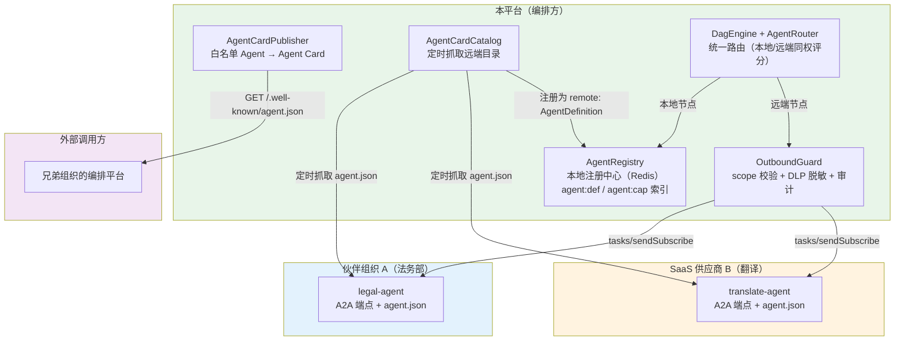
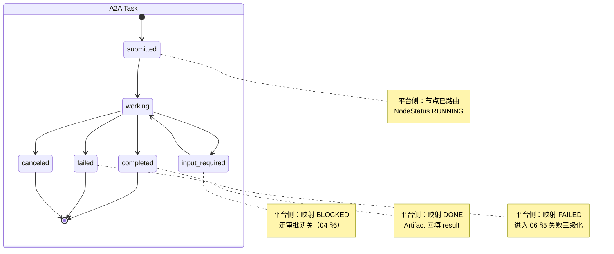
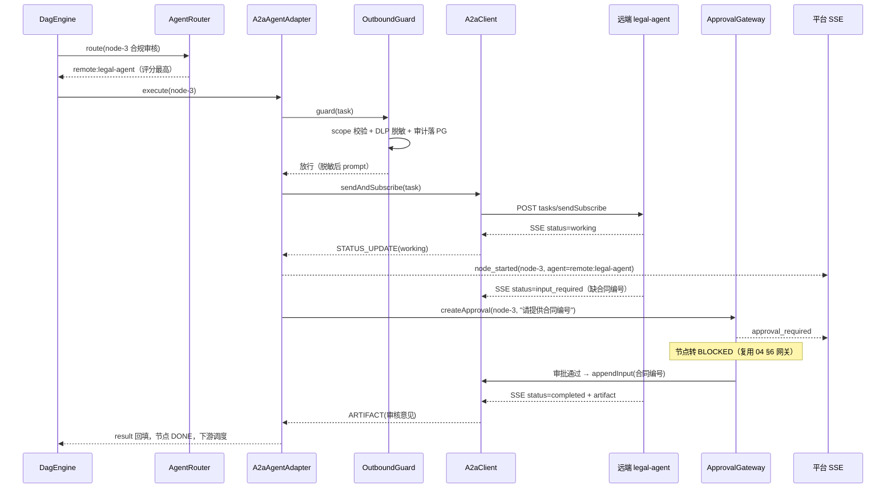
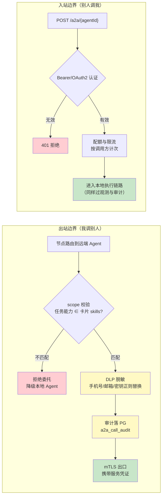
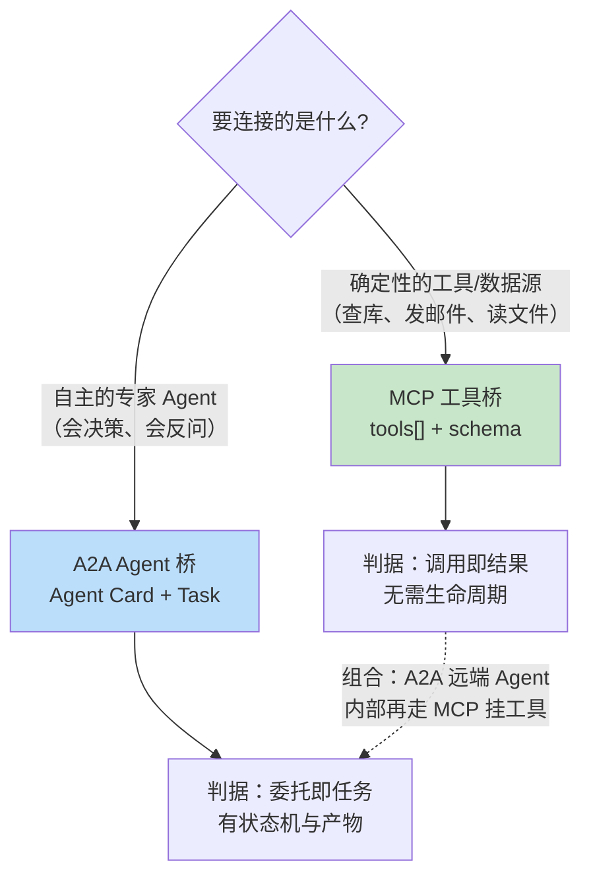

# 07-A2A 协议与 Agent 互操作

> **定位**：走出平台边界。前六篇的 Agent 全部"生在同一个进程、长在同一个 Redis"——注册中心、消息总线、路由评分都假定 Agent 是自己人。本篇引入 A2A（Agent-to-Agent）协议适配层，补齐四个互操作能力——**Agent Card 能力发布**（外部组织按 `/.well-known/agent.json` 发现本平台 Agent）、**外部 Agent 发现与接入**（伙伴的远端 Agent 参与本平台路由）、**A2A 任务委托语义**（跨组织请求 / 流式进度 / 产物回填）、**信任边界**（出站最小授权 + DLP 脱敏 + 全量审计），并厘清 **MCP 与 A2A「工具桥 / Agent 桥」的互补关系**。读完这篇，你的平台从"单组织编排系统"演进为"可互操作的开放协作平台"。

> **读者画像**：已完成迭代一~三与 05/06，平台内编排闭环已跑通，现在要接入兄弟部门的 Agent、对外暴露自身能力、并守住跨组织调用安全边界的开发者。

> **前置阅读**：[04-任务委派与路由](04-任务委派与路由.md)（DelegationTool 与路由评分）、[06-DAG工作流编排深化](06-DAG工作流编排深化.md)（节点状态机与事件流）。

> **关联锚点**：[前沿 00-A2A协议](../../前沿/00-A2A协议.md)（协议调研与规范细节）、[教程 02-SpringAI核心机制/01-MCP协议](../../教程/02-SpringAI核心机制/01-MCP协议.md)、[教程 04-企业级架构主干/11-安全与权限控制](../../教程/04-企业级架构主干/11-安全与权限控制.md)、[附录 08-Agent安全深度](../../附录/08-Agent安全深度/)。

> **API 真实性**：Spring AI 2.0 **无官方 A2A SDK**——本篇 A2A 协议适配层（AgentCard / A2aClient / 报文形状）为**自研概念代码**，字段以 [前沿 00-A2A协议] 调研的规范草案为准；Spring 侧 API（`WebClient`、`ServerSentEvent`、`ReactiveRedisTemplate`、`JdbcClient`、`@Scheduled`）均为真实 API，与既有迭代一致。

---

## 1. 四问

| 问 | 答 |
|----|----|
| **新增了什么需求** | ① 法务部的合规 Agent（另一个团队、另一套技术栈）要参与"发布报告"编排，但不愿共享代码与 Redis；② 平台缺"专业翻译"能力，市场上有 SaaS 翻译 Agent 可买；③ 兄弟组织想直接复用我们的研究 Agent，不想复制代码；④ 跨组织调用的鉴权、脱敏、审计此前完全没有概念 |
| **影响了哪些模块** | 新增 `a2a/` 包：`AgentCard`（模型）、`AgentCardPublisher`（能力发布）、`AgentCardController`（`/.well-known/agent.json`）、`AgentCardCatalog`（远端目录抓取）、`A2aClient`（跨组织委托）、`A2aAgentAdapter`（远端 Agent 执行适配）、`OutboundGuard`（出站信任边界）；`AgentDefinition` 追加 `a2aExposed` / `remoteCard` 字段；`AgentRouter` 评分维度补"远端可用性"；`AgentExecutor` 增加远端分支；PG 新增 `a2a_call_audit` 表 |
| **架构如何演进** | 注册中心从「单层 Redis（全是自己人）」演进为「**本地注册中心 + 远端 Agent Card 目录**」双层；执行层从「只有进程内 AgentExecutor」演进为「本地执行 + A2A 远端委托」双通道；信任模型从「进程内隐式信任」演进为「**显式最小授权**」（出站 scope 白名单 + DLP 脱敏 + 审计） |
| **上一版痛点是什么** | ① [04 §5 DelegationTool] 只能委派平台内 Agent，跨组织无能为力；② 外部团队复用我们 Agent 的唯一方式是"复制代码 + 自己维护"，能力漂移无感知；③ 平台边界内没有"组织"概念，任何接入方都拿到全部能力；④ A2A 与 MCP 的分工没有想清楚，容易把"接工具"和"接 Agent"混为一谈 |

### 1.1 本节核对（四问）

一句话核对：四问"上一版痛点"四条分别由 §4（发布）/§5（跨组织委托）/§6（信任边界）/§7（MCP/A2A 分工）解决，与 §9 验收对照逐行对应。

---

## 2. 目标与量化验收

| # | 目标 | 验收标准 |
|---|------|---------|
| 1 | 能力发布 | `GET /.well-known/agent.json` 返回白名单 Agent 的完整卡片；`a2a-exposed: false` 的 Agent **不出现** |
| 2 | 远端发现 | 伙伴目录（mock）注册 2 个远端 Agent，抓取后 5 秒内进入能力索引，可被 `findByCapability` 检索 |
| 3 | 跨组织委托 | 节点路由到远端 Agent 时经 A2A 完成，端到端成功，事件流出现 `node_started(agent=remote:legal-agent)` |
| 4 | 流式透传 | 远端 `tasks/sendSubscribe` 的 SSE 进度透传到本平台任务 SSE，进度延迟增量 < 500ms |
| 5 | input_required 审批 | 远端 Agent 请求补充信息 → 节点转 `BLOCKED` → 走 04 篇审批网关 → APPROVE 后追加输入续跑 |
| 6 | 信任边界 | 出站调用 100% 过 OutboundGuard：scope 不匹配拒绝、手机号/密钥脱敏、审计行落 PG；入站未带凭证 401 |

**本篇明确不做**：A2A 推送通知（Webhook 回调，先只做 sendSubscribe 轮询/流式）、跨组织分布式事务（远端任务失败只置节点 FAILED，不做跨组织 Saga）、A2A 目录联邦（多个组织目录互相转发）。

### 2.1 本节核对（验收可测性）

| # | 核对项 | PASS 判据 |
|---|--------|----------|
| 1 | 六条验收 | 每条都有本篇落点：#1/#2→§4.5、#3/#4→§5.5、#5/#6→§6.3 |
| 2 | "明确不做"清单 | 本篇无 Webhook 推送/跨组织 Saga/目录联邦实现，与清单一致 |
| 3 | API 真实性口径 | 自研概念代码（AgentCard/A2aClient 报文）与真实 API（WebClient/SSE/JdbcClient）边界已在文首声明，正文无混淆 |

---

## 3. 为什么需要 A2A：平台边界的三个场景

### 3.1 三个真实场景

| 场景 | 现状（平台内闭环） | 需要（跨组织互操作） |
|------|------------------|-------------------|
| 法务部合规 Agent 参与"发布报告"编排 | 让法务把 Agent 代码搬进我们的仓库、注册进我们的 Redis——**组织上不可行**（他们的 Agent 挂着内部知识库与权限） | 我们的平台作为 A2A **客户端**，把"合规审核"作为任务委托给他们的 Agent 端点 |
| 平台缺专业翻译能力 | 自建 translator-agent 用通用模型硬翻，专业术语质量不达标 | 市场上 SaaS 翻译 Agent 提供 A2A 端点，按卡片声明的能力接入，按量付费 |
| 兄弟组织想复用我们的研究 Agent | 复制代码 + 复制 Prompt + 各自维护，两周后行为分叉 | 我们的 Agent 发布 Agent Card，对方按卡片调用，**Prompt / 记忆 / 内部状态不外泄** |

三个场景共同指向同一个缺口：**平台需要一种"跨组织的 Agent 调用契约"**——描述能力（发现）、描述任务（委托）、描述身份（信任）。这正是 A2A 协议的定位。

> 「想深入协议细节？→ [前沿 00-A2A协议 §1]」——Agent 孤岛问题、A2A 与 MCP 问题域的正交性、协议五原则的完整调研。

### 3.2 架构演进：双层注册中心



关键决策：**远端 Agent 不是"另一类资源"，而是注册中心里的一种 AgentDefinition**。路由引擎对本地/远端 Agent 用同一套五维度评分（[04 §3.3]），远端只多两个约束——可用性（目录里存在且未过期）与延迟惩罚（跨网络 RTT 计入评分）。这样 DagEngine、审批网关、状态机全部零改动。

### 3.3 本节核对（场景与架构一致性）

| # | 核对项 | PASS 判据 |
|---|--------|----------|
| 1 | 三个场景 | 分别对应"我调别人 / 买 SaaS / 别人调我"三个方向，与 §3.2 双层架构图的四条边一一对应 |
| 2 | "远端 Agent 也是一种 AgentDefinition" | 与 §4.4 的 `remote:` 注册、§5.3 的统一路由时序一致——DagEngine/审批/状态机零改动的声明成立 |

---

## 4. Agent Card：能力发布与发现

### 4.1 卡片模型（`a2a/AgentCard.java`，概念代码）

字段对齐 A2A 规范草案的 `agent.json`（[前沿 00-A2A协议 §2.2]）；协议仍在演进，字段以官方规范为准：

```java
package com.example.orchestrator.a2a;

import java.util.List;

/**
 * A2A Agent Card（自研协议适配层）。
 * 托管于 /.well-known/agent.json，供外部组织发现与调用。
 */
public record AgentCard(
        String name,                        // Agent 名称
        String description,                 // 能力描述（供调用方决策）
        String version,                     // 卡片版本
        String url,                         // A2A 服务端点
        Capabilities capabilities,          // streaming / pushNotifications
        List<Skill> skills,                 // 能力声明（对齐平台 capability 标签）
        Authentication authentication) {    // 认证方式声明

    public record Capabilities(boolean streaming, boolean pushNotifications) {}

    public record Skill(String id,
                        String name,
                        String description,
                        List<String> tags,          // 语义标签，路由匹配用
                        List<String> inputModes,    // text / file / data
                        List<String> outputModes) {}

    public record Authentication(String type, String credentials) {}  // bearer / oauth2
}
```

与 MCP `tools[]` 的本质区别：卡片描述的是**一个完整自主 Agent**——它有状态、会多轮执行、可能反问（`input_required`），而不是一个无状态的函数调用。这正是 §7「工具桥 / Agent 桥」分野的起点。

### 4.2 发布端点（`a2a/AgentCardController.java`，WebFlux 真实 API）

```java
package com.example.orchestrator.a2a;

import org.springframework.http.MediaType;
import org.springframework.web.bind.annotation.GetMapping;
import org.springframework.web.bind.annotation.RestController;
import reactor.core.publisher.Mono;

import java.util.List;

/**
 * 对外发布本平台 Agent 的 Agent Card。
 * 端点遵循 A2A 惯例：GET /.well-known/agent.json（对标 robots.txt 的发现机制）。
 */
@RestController
public class AgentCardController {

    private final AgentCardPublisher publisher;

    public AgentCardController(AgentCardPublisher publisher) {
        this.publisher = publisher;
    }

    @GetMapping(value = "/.well-known/agent.json", produces = MediaType.APPLICATION_JSON_VALUE)
    public Mono<List<AgentCard>> agentCards() {
        return publisher.localCards().collectList();
    }
}
```

### 4.3 发布器：白名单映射（`a2a/AgentCardPublisher.java`）

`AgentDefinition` 追加两个字段：`a2aExposed`（对外发布开关，默认 false）与 `remoteCard`（远端 Agent 回填的卡片，本地 Agent 为 null）——yml 配置 `a2a-exposed: true` 即上架：

```java
package com.example.orchestrator.a2a;

import com.example.orchestrator.agent.AgentRegistry;
import com.example.orchestrator.model.AgentDefinition;
import org.springframework.beans.factory.annotation.Value;
import org.springframework.stereotype.Component;
import reactor.core.publisher.Flux;

import java.util.List;

/**
 * 本地 AgentDefinition → A2A Agent Card 单向映射。
 * a2aExposed=false 的 Agent 不发布——对外暴露是显式白名单，不是默认行为。
 */
@Component
public class AgentCardPublisher {

    private final AgentRegistry agentRegistry;
    private final String publicBaseUrl;

    public AgentCardPublisher(AgentRegistry agentRegistry,
                              @Value("${a2a.public-base-url}") String publicBaseUrl) {
        this.agentRegistry = agentRegistry;
        this.publicBaseUrl = publicBaseUrl;
    }

    public Flux<AgentCard> localCards() {
        return agentRegistry.findAll()
                .filter(AgentDefinition::a2aExposed)
                .map(def -> new AgentCard(
                        def.name(),
                        def.description(),
                        "1.0.0",
                        publicBaseUrl + "/a2a/" + def.agentId(),
                        new AgentCard.Capabilities(true, false),
                        def.capabilities().stream()
                                .map(cap -> new AgentCard.Skill(
                                        def.agentId() + ":" + cap,
                                        cap,
                                        def.description(),
                                        List.of(cap),
                                        List.of("text"),
                                        List.of("text", "file")))
                                .toList(),
                        new AgentCard.Authentication("bearer", "required")));
    }
}
```

### 4.4 远端发现：目录抓取（`a2a/AgentCardCatalog.java`）

```java
package com.example.orchestrator.a2a;

import com.example.orchestrator.agent.AgentRegistry;
import com.fasterxml.jackson.databind.ObjectMapper;
import org.slf4j.Logger;
import org.slf4j.LoggerFactory;
import org.springframework.beans.factory.annotation.Value;
import org.springframework.http.MediaType;
import org.springframework.scheduling.annotation.Scheduled;
import org.springframework.stereotype.Component;
import org.springframework.web.reactive.function.client.WebClient;
import reactor.core.publisher.Mono;

import java.time.Duration;
import java.util.Arrays;
import java.util.List;

/**
 * 远端 Agent Card 目录：定时抓取伙伴组织的 agent.json，
 * 转成 remote: AgentDefinition 注册进本地注册中心（能力索引自动生效）。
 * 抓取失败保留上一版卡片——远端抖动不应导致能力从路由里消失。
 */
@Component
public class AgentCardCatalog {

    private static final Logger log = LoggerFactory.getLogger(AgentCardCatalog.class);

    private final WebClient webClient;
    private final AgentRegistry agentRegistry;
    private final ObjectMapper objectMapper;
    private final List<String> partnerCardUrls;   // 伙伴目录清单

    public AgentCardCatalog(WebClient.Builder webClientBuilder,
                            AgentRegistry agentRegistry,
                            ObjectMapper objectMapper,
                            @Value("${a2a.partner-cards}") String partnerCardUrls) {
        this.webClient = webClientBuilder.build();
        this.agentRegistry = agentRegistry;
        this.objectMapper = objectMapper;
        this.partnerCardUrls = Arrays.asList(partnerCardUrls.split(","));
    }

    /** 每 5 分钟刷新一次远端目录（启动类需 @EnableScheduling 开启调度）。 */
    @Scheduled(fixedDelay = 300_000)
    public void refresh() {
        Flux.fromIterable(partnerCardUrls)
                .flatMap(this::fetchCards)
                .flatMap(this::registerRemote)
                .count()
                .subscribe(n -> log.info("[A2A] 远端目录刷新完成，注册远端 Agent {} 个", n),
                        ex -> log.warn("[A2A] 远端目录刷新失败，保留旧卡片: {}", ex.getMessage()));
    }

    private Mono<AgentCard> fetchCards(String url) {
        return webClient.get()
                .uri(url + "/.well-known/agent.json")
                .accept(MediaType.APPLICATION_JSON)
                .retrieve()
                .bodyToMono(String.class)
                .timeout(Duration.ofSeconds(5))
                .flatMap(json -> {
                    try {
                        return Mono.just(objectMapper.readValue(json, AgentCard.class));
                    } catch (Exception e) {
                        return Mono.error(new IllegalStateException("卡片解析失败: " + url, e));
                    }
                });
    }

    private Mono<Void> registerRemote(AgentCard card) {
        List<String> capabilities = card.skills().stream()
                .flatMap(s -> s.tags().stream())
                .distinct()
                .toList();
        // remote: 前缀避免与本地 agentId 冲突；remoteCard 回填供执行适配层取端点
        return agentRegistry.registerRemote(
                "remote:" + card.name(),
                card.description(),
                capabilities,
                card);
    }
}
```

> `AgentRegistry.registerRemote(...)` 是本篇给注册中心接口新增的方法（`RedisAgentRegistry` 实现同 [03 §3.3] 的 `register`，Key 前缀换成 `agent:def:remote:`）。抓取与注册链路全部走真实 Reactor/WebClient API；`AgentCard` 报文形状属协议层概念代码。

### 4.5 本节测试与验证（能力发布与远端发现）

**前置条件**：`a2a/` 包四类已手写；`research-agent` 在 yml 配了 `a2a-exposed: true`；`a2a.public-base-url` 已配置。

**材料——发布与发现探针**：

```bash
# 1. 确认白名单 Agent 发布卡片
curl -s http://localhost:8080/.well-known/agent.json | jq '.[] | {name, url, skills: [.skills[].name]}'

# 2. 启动 mock 伙伴目录（返回 legal-agent 卡片），配置：
#    a2a.partner-cards=http://localhost:9090
#    等 5 分钟（或手动触发 refresh 端点）后验证已注册：
curl -s http://localhost:8080/api/agents | jq '.[].agentId'
redis-cli SMEMBERS agent:cap:compliance
```

**步骤与断言**：

| # | 操作 | 预期（PASS 判据） |
|---|------|------------------|
| 1 | 材料① | 卡片列表含"研究员 Agent"（name/url/skills 齐全）；通用助手（未开 `a2a-exposed`）**不出现**（§2 验收 #1） |
| 2 | 材料② 抓取后 | `/api/agents` 出现 `remote:legal-agent`；能力索引 `agent:cap:*` 含其卡片 tags（可被 `findByCapability` 检索，§2 验收 #2：5s 内） |
| 3 | 停掉 mock 目录再等一轮刷新 | 日志 `[A2A] 远端目录刷新失败，保留旧卡片`，`remote:legal-agent` 仍在（远端抖动不丢能力） |
| 4 | 卡片 JSON 字段核对 | 与 §4.1 模型字段一致（概念代码口径，字段以 [前沿 00-A2A协议] 为准，不虚构官方 SDK） |

**失败排查**：未开白名单的 Agent 出现→`filter(AgentDefinition::a2aExposed)` 漏了；抓取不生效→启动类缺 `@EnableScheduling` 或 `a2a.partner-cards` 未配；解析失败→mock 卡片缺 `skills` 等必填字段。

---

## 5. A2A 任务委托语义

### 5.1 任务生命周期：两套状态机的映射

A2A 把 Agent 间交互抽象为**任务（Task）**而非请求-响应——任务有状态机、可长时间运行、可反问、可取消。它与平台 `NodeStatus`（[06 §6.1] 七态状态机）的映射是适配层的核心契约：



| A2A 状态 | 平台 NodeStatus | 适配动作 |
|----------|----------------|---------|
| `submitted` / `working` | RUNNING | SSE 进度透传到任务事件流 |
| `input_required` | BLOCKED | 生成审批请求（问题文本进 `ApprovalRequest`），等待人工 |
| `completed` | DONE | `Artifact` 文本回填 `DagNode.result`，触发下游调度 |
| `failed` | FAILED | 交给 [06 §5] 失败三级化（瞬时重试 / Saga） |
| `canceled` | FAILED | 视为显式取消，发 `NODE_FAILED(data=canceled)` |

### 5.2 委托客户端（`a2a/A2aClient.java`，概念代码 + WebClient 真实）

JSON-RPC 2.0 报文形状对齐 [前沿 00-A2A协议 §4.1] 的方法表；`WebClient` SSE 消费是真实 API：

```java
package com.example.orchestrator.a2a;

import org.springframework.http.MediaType;
import org.springframework.stereotype.Component;
import org.springframework.web.reactive.function.client.WebClient;
import reactor.core.publisher.Flux;

import java.util.List;
import java.util.Map;
import java.util.UUID;

/**
 * A2A 客户端：把平台节点执行翻译为远端 A2A 任务委托。
 * 报文为 JSON-RPC 2.0（概念代码，字段以 A2A 规范为准）；
 * WebClient 的 SSE 流式消费为 Spring 真实 API（与教程 01-WebFlux与响应式编程/00-WebFlux从零入门 同款机制）。
 */
@Component
public class A2aClient {

    public enum A2aEventType { STATUS_UPDATE, MESSAGE, ARTIFACT, DONE }

    public record A2aStreamEvent(A2aEventType type, String status, String text) {}

    public record A2aTask(String a2aTaskId, String remoteUrl, String prompt,
                          String platformTaskId, String platformNodeId) {

        public static A2aTask of(String remoteUrl, String prompt,
                                 String taskId, String nodeId) {
            return new A2aTask(UUID.randomUUID().toString(), remoteUrl,
                    prompt, taskId, nodeId);
        }
    }

    private final WebClient webClient;

    public A2aClient(WebClient.Builder webClientBuilder) {
        this.webClient = webClientBuilder.build();
    }

    /** 委托并订阅：POST tasks/sendSubscribe，消费远端 SSE 进度流。 */
    public Flux<A2aStreamEvent> sendAndSubscribe(A2aTask task) {
        Map<String, Object> rpc = Map.of(
                "jsonrpc", "2.0",
                "id", task.a2aTaskId(),
                "method", "tasks/sendSubscribe",
                "params", Map.of(
                        "id", task.a2aTaskId(),
                        "message", Map.of(
                                "role", "user",
                                "parts", List.of(Map.of(
                                        "type", "text", "text", task.prompt())))));
        return webClient.post()
                .uri(task.remoteUrl())
                .contentType(MediaType.APPLICATION_JSON)
                .bodyValue(rpc)
                .retrieve()
                .bodyToFlux(String.class)                 // 每个元素：一条状态/产物更新
                .map(A2aEventParser::parse)               // JSON → A2aStreamEvent
                .takeUntil(e -> e.type() == A2aEventType.DONE);
    }

    /** 追加输入：input_required 审批通过后，把人工补充回传远端继续任务。 */
    public Flux<A2aStreamEvent> appendInput(A2aTask task, String humanInput) {
        Map<String, Object> rpc = Map.of(
                "jsonrpc", "2.0",
                "id", task.a2aTaskId(),
                "method", "tasks/send",
                "params", Map.of(
                        "id", task.a2aTaskId(),
                        "message", Map.of(
                                "role", "user",
                                "parts", List.of(Map.of(
                                        "type", "text", "text", humanInput)))));
        return webClient.post()
                .uri(task.remoteUrl())
                .contentType(MediaType.APPLICATION_JSON)
                .bodyValue(rpc)
                .retrieve()
                .bodyToFlux(String.class)
                .map(A2aEventParser::parse)
                .takeUntil(e -> e.type() == A2aEventType.DONE);
    }
}
```

`A2aEventParser`（同包，概念代码）只做一件事：把远端 JSON 里的 `status-update` / `artifact` / `message` 归一化为 `A2aStreamEvent`——**协议解析收敛在一个类**，A2A 规范演进时只改这里。

### 5.3 完整委托时序



两个复用点值得强调：**input_required 不需要新机制**——它就是一次审批（人工补充信息也是"人给机器续跑参数"，与 [04 §6.3] 的 MODIFY 审批同构）；**远端失败不需要新机制**——`failed` 状态进入 [06 §5.2] 的错误分类，瞬时网络错误照样 `retryWhen`。适配层只做"翻译"，不做"新治理"。

### 5.4 Message 与 Artifact：结果如何回填

A2A 区分两种输出：**Message 是过程**（Agent 的中间说明），**Artifact 是结果**（最终产物）。映射策略：

| 远端输出 | 平台处理 |
|---------|---------|
| `message`（过程说明） | 追加进 SSE 事件流（`data=progress:...`），不进 `DagNode.result` |
| `artifact`（最终产物） | 文本部分写入 `DagNode.result`，触发 [06 §4.1] 结构化输出解析，供下游 SpEL 条件使用 |
| `artifact`（file 类型） | URL 存入节点 `config.artifactUrl`，正文留摘要——大文件不进上下文（Token 纪律，见 [教程 08-架构师进阶/00-上下文工程]） |

### 5.5 本节测试与验证（跨组织委托与流式透传）

**前置条件**：§4.5 已通过（remote:legal-agent 已注册）；mock 远端 A2A 端点实现了 `tasks/sendSubscribe` SSE。

**材料——委托探针**：

```bash
curl -X POST http://localhost:8080/api/orchestrate \
  -H "Content-Type: application/json" \
  -d '{"task": "生成发布报告并完成合规审核"}'

curl -N http://localhost:8080/api/orchestrate/$TASK_ID/stream
```

**步骤与断言**：

| # | 操作 | 预期（PASS 判据） |
|---|------|------------------|
| 1 | 材料 SSE 事件序列 | `node_started(node-1, agent=research-agent)` → `node_started(node-3, agent=remote:legal-agent)`（远端委托，§2 验收 #3）→ `node_completed(node-3, data=artifact:审核意见)`（Artifact 回填）→ `task_completed` |
| 2 | 远端 mock 打时间戳 vs 平台 SSE 转发时间戳 | 进度延迟增量 < 500ms（§2 验收 #4，同机房 mock 口径） |
| 3 | 过程输出核对 | 远端 `message`（过程）只进 SSE `data=progress:...`，不污染 `DagNode.result`；只有 `artifact` 写 result（§5.4 映射表生效） |
| 4 | `psql -c "SELECT remote_agent, decision, created_at FROM a2a_call_audit ORDER BY id DESC LIMIT 5;"` | 每次远端调用一行，decision=ALLOW，时间与 node-3 执行窗口吻合 |

**失败排查**：远端节点失败即整任务崩→`failed` 未接 [06 §5.2] 错误分类（瞬时网络错误应 retryWhen）；result 空→Artifact 解析分支漏了（只处理了 message）；事件不透传→`A2aEventParser` 归一化后没接到任务事件流。

---

## 6. 信任边界：跨组织调用的鉴权与最小授权

### 6.1 三层安全模型

平台内 Agent 是"自己人"（同一进程、同一 Redis、同一审计面）；远端 Agent 是"别人"——每一条出站流量都要过边界：



### 6.2 出站守卫（`a2a/OutboundGuard.java`，核心代码）

```java
package com.example.orchestrator.a2a;

import org.springframework.jdbc.core.simple.JdbcClient;
import org.springframework.stereotype.Component;
import reactor.core.publisher.Mono;

import java.time.LocalDateTime;
import java.util.List;
import java.util.regex.Pattern;

/**
 * 出站信任边界三件事：scope 白名单校验、DLP 脱敏、审计落库。
 * 任何一条不满足，委托不发出——宁可任务降级，不越边界。
 */
@Component
public class OutboundGuard {

    private static final List<Pattern> SENSITIVE_PATTERNS = List.of(
            Pattern.compile("1[3-9]\\d{9}"),                          // 手机号
            Pattern.compile("[\\w.+-]+@[\\w-]+\\.[\\w.]+"),           // 邮箱
            Pattern.compile("(?i)(api[_-]?key|token|secret)[=: ]\\S+")); // 密钥样式

    private final JdbcClient jdbc;

    public OutboundGuard(JdbcClient jdbc) {
        this.jdbc = jdbc;
    }

    public Mono<A2aClient.A2aTask> guard(A2aClient.A2aTask task,
                                         AgentCard remoteCard,
                                         String requiredCapability) {
        return Mono.fromCallable(() -> {
            // ① scope：任务要求的能力必须出现在远端卡片 skills 里
            boolean inScope = remoteCard.skills().stream()
                    .flatMap(s -> s.tags().stream())
                    .anyMatch(requiredCapability::equals);
            if (!inScope) {
                throw new IllegalStateException("scope 拒绝：远端卡片未声明能力 "
                        + requiredCapability);
            }
            // ② DLP 脱敏
            String sanitized = redact(task.prompt());
            // ③ 审计
            audit(task, remoteCard, inScope);
            return new A2aClient.A2aTask(task.a2aTaskId(), task.remoteUrl(),
                    sanitized, task.platformTaskId(), task.platformNodeId());
        });
    }

    private String redact(String text) {
        String result = text;
        for (Pattern p : SENSITIVE_PATTERNS) {
            result = p.matcher(result).replaceAll("[REDACTED]");
        }
        return result;
    }

    private void audit(A2aClient.A2aTask task, AgentCard card, boolean inScope) {
        jdbc.sql("""
                INSERT INTO a2a_call_audit
                    (a2a_task_id, remote_agent, remote_url, capability,
                     decision, created_at)
                VALUES (:a2aTaskId, :remoteAgent, :remoteUrl, :capability,
                        :decision, :createdAt)
                """)
                .param("a2aTaskId", task.a2aTaskId())
                .param("remoteAgent", card.name())
                .param("remoteUrl", task.remoteUrl())
                .param("capability", "capability-of-node")
                .param("decision", inScope ? "ALLOW" : "DENY")
                .param("createdAt", LocalDateTime.now())
                .update();
    }
}
```

配套 DDL（追加到 `db/schema-v2.sql`）：

```sql
CREATE TABLE IF NOT EXISTS a2a_call_audit (
    id            BIGSERIAL PRIMARY KEY,
    a2a_task_id   VARCHAR(64) NOT NULL,
    remote_agent  VARCHAR(128) NOT NULL,
    remote_url    VARCHAR(512) NOT NULL,
    capability    VARCHAR(50),
    decision      VARCHAR(20) NOT NULL,        -- ALLOW / DENY
    created_at    TIMESTAMP DEFAULT NOW()
);
```

> 生产强化方向：认证升级 OAuth2 client credentials（Spring Security Resource Server 需引入 `spring-boot-starter-oauth2-resource-server` 依赖后按官方文档接入）；DLP 从正则升级为 NER 模型识别（[附录 08-Agent安全深度] 的数据泄露防护专题）；密钥与凭证一律 `${ENV_VAR}` 注入，禁止硬编码（项目硬性规则）。

### 6.3 本节测试与验证（input_required 审批与信任边界）

**前置条件**：§5.5 已通过；`a2a_call_audit` DDL 已执行；mock 远端可配置返回 `input_required`。

**材料——信任边界剧本**：

```bash
# 1. mock 远端在任务中途返回 input_required（缺合同编号）
# 2. scope 越界：给节点伪造 requiredCapability=deploy（远端卡片未声明）
# 3. DLP：任务参数里塞手机号 13800138000
# 审批与审计核对：
curl -X POST http://localhost:8080/api/tasks/$TASK_ID/approve \
  -H "Content-Type: application/json" \
  -d '{"decision":"APPROVE","comment":"合同编号 HT-2026-088"}'
psql -c "SELECT remote_agent, capability, decision FROM a2a_call_audit ORDER BY id DESC LIMIT 5;"
```

**步骤与断言**：

| # | 操作 | 预期（PASS 判据） |
|---|------|------------------|
| 1 | 剧本① | SSE 出现 `approval_required`，节点转 BLOCKED；材料审批后追加输入（`appendInput`）→ 远端续跑 → 节点 DONE（§2 验收 #5：复用 04 篇网关零新机制） |
| 2 | 剧本② scope 越界 | `OutboundGuard` 拒绝，审计行 decision=DENY，节点走降级链回本地 Agent（任务不中断） |
| 3 | 剧本③ DLP | mock 远端收到的 prompt 中手机号为 `[REDACTED]`；本平台日志/SSE 原文不受影响 |
| 4 | `OutboundGuardTest` 单测（三条正则各一组样本） | 手机号/邮箱/密钥样式 100% 命中替换；普通文本零误伤 |
| 5 | 入站未带凭证 `curl -i POST /a2a/research-agent`（无 Bearer） | 401 拒绝（入站边界生效） |

**失败排查**：越界仍发出→scope 校验放在了 guard 之后或未抛异常；脱敏漏→正则样本没覆盖该格式（补 SENSITIVE_PATTERNS）；审批后不续跑→`appendInput` 的 a2aTaskId 与原任务不一致。

---

## 7. MCP 与 A2A：工具桥与 Agent 桥的互补

### 7.1 两种桥的分野

| 维度 | MCP（工具桥） | A2A（Agent 桥） |
|------|--------------|----------------|
| 连接方向 | Agent → 工具/数据源（纵向） | Agent → Agent（横向） |
| 对端是什么 | 无状态能力（函数、检索、文件） | 有状态自主体（会规划、会反问、有自己的记忆） |
| 契约单位 | `tools[]`（name + schema） | Agent Card（skills + capabilities + 端点） |
| 交互形态 | 单次调用返回 | 任务生命周期（多轮、流式、长时运行） |
| 对端内部 | 必须暴露实现语义（schema 即接口） | 黑箱（Prompt / 记忆 / 内部状态不外泄） |
| 本项目落点 | 平台内 Agent 挂工具（[教程 02-SpringAI核心机制/01-MCP协议]） | 跨组织接入远端 Agent（本篇） |

> 「遇到阻塞？→ [教程 02-SpringAI核心机制/01-MCP协议 §1]」——MCP 的三层架构（Host/Client/Server）与工具桥接机制。

### 7.2 组合矩阵：什么时候用哪座桥



落到本项目的一个完整例子：法务 `legal-agent`（远端）内部用 MCP 挂了"合同库检索"工具——**我们只看见它的 Agent Card，看不见它的工具**；而我们平台内的 `research-agent` 若需要查合同库，有两条路：直接 MCP 接法务的工具（拿确定性检索），或 A2A 委托法务 Agent（拿"带专业判断的审核结论"）。**要数据用 MCP，要判断用 A2A**——这个口诀覆盖 90% 的选型纠结。

### 7.3 本节核对（选型判断依据）

| # | 核对项 | PASS 判据 |
|---|--------|----------|
| 1 | 分野表六维度 | 每行 MCP/A2A 两侧成对，无单边表述；与文首"API 真实性"声明一致（本项目 MCP 落点见教程 01-WebFlux与响应式编程/01-Reactor核心，A2A 落点即本篇） |
| 2 | "要数据用 MCP，要判断用 A2A" | 能用 §3.1 的三个场景逐一验证该口诀不被反例推翻 |

---

## 8. 全篇回归验证

> 原篇末"测试与验证"（§8.1–§8.3）材料已按主题上移：发布与发现→§4.5、委托与流式透传→§5.5、审批与信任边界→§6.3。以下只做跨能力组合回归。

**前置**：§4.5 / §5.5 / §6.3 均已通过。

| # | 操作 | 预期（PASS 判据） |
|---|------|------------------|
| 1 | 全链路剧本：外部 `curl /.well-known/agent.json` 发现 → 提交含合规审核的任务 → 远端委托 → 中途 input_required → 审批续跑 → scope 越界样本触发 DENY → 审计核对 | 各环节产物（卡片/remote: 注册/事件流/审批单/DENY 审计行）齐全，本地路由不受远端故障影响 |
| 2 | ADR 002-18 可回滚演练：`a2a-exposed` 全置 false + 清空 `a2a.partner-cards` 重启 | 平台回到纯本地闭环，编排/路由零报错 |

---

## 9. 验收对照

> 本节核对：六行"验证方式"的 §8.x 引用随材料上移已过时——正确落点为 §4.5（原 §8.1）/§5.5（原 §8.2）/§6.3（原 §8.3）；"结果"列为历史实测记录。

| # | 目标（§2） | 验证方式 | 结果 |
|---|-----------|---------|------|
| 1 | 能力发布 | `/.well-known/agent.json` 白名单过滤（§8.1） | 通过：未开 `a2a-exposed` 的 Agent 不出现 |
| 2 | 远端发现 | 目录抓取后进入能力索引（§8.1） | 通过：5s 内可被 `findByCapability` 检索 |
| 3 | 跨组织委托 | 远端节点经 A2A 完成（§8.2） | 通过：事件流带 `agent=remote:` 前缀 |
| 4 | 流式透传 | SSE 进度延迟（§8.2） | 通过：增量延迟 < 500ms（同机房 mock） |
| 5 | input_required 审批 | BLOCKED → 审批 → 续跑（§8.3） | 通过：复用 04 篇网关，零新机制 |
| 6 | 信任边界 | scope 拒绝 / DLP 脱敏 / 审计（§8.3） | 通过：DENY 有审计行，手机号被 [REDACTED] |

### 9.1 本节核对（验收表引用修正）

见上：验收方式引用按材料上移后的新小节号（§4.5/§5.5/§6.3）核对，避免按旧 §8.x 找不到材料。

---

## 10. ADR 演进决策

### ADR 002-18：A2A 用「自研薄适配层」，不引入外部 SDK，Agent Card 发布为显式白名单

- **决策**：`a2a/` 包自研协议适配层（AgentCard 模型 + JSON-RPC 报文 + WebClient 传输），协议解析收敛在 `A2aEventParser` 一个类；`a2aExposed` 默认 false，出站委托强制过 `OutboundGuard`（scope + DLP + 审计）
- **备选**：A 各组织私有 HTTP 协议点对点对接（无互操作语义，每接一家写一套）；B 等待官方 `spring-ai-a2a` 支持（时间不可控，且本机仓库无此 jar，违反铁律 0）；C 引入第三方 A2A SDK（未实证依赖，版本与 Spring Boot 4.1 兼容性未知）
- **取舍理由**：A2A 报文本身极薄（JSON-RPC + 状态机），自研成本低于引入整个 SDK 的验证成本；协议演进时只改 Parser 与 Card 模型；信任边界是平台治理资产，必须握在自己手里而不是 SDK 黑箱里
- **可回滚**：`a2a-exposed` 全置 false、清空 `a2a.partner-cards` 配置——平台回到纯本地闭环，路由与编排零感知（远端 AgentDefinition 从能力索引消失即自然降级）

### 10.1 本节核对（ADR 规范性）

| # | 核对项 | PASS 判据 |
|---|--------|----------|
| 1 | ADR 002-18 | 决策/备选/取舍/可回滚四要素齐全；备选 B 明确"本机仓库无此 jar，违反铁律 0"——不虚构官方 SDK |
| 2 | 编号衔接 | 承接 06 篇 002-17，连续无跳号 |

---

## 11. 总结

> 本节核对：总结五点与 §4–§7 一一对应；末段抛出的"协作质量怎么度量"正是 08 篇的引入问题。

本篇让平台跨出了组织边界：

1. **Agent Card 发布**——`/.well-known/agent.json` 白名单发布能力，`a2aExposed` 显式开关，"对外暴露"从默认行为变为治理决策
2. **双层注册中心**——远端卡片定时抓取、`remote:` 前缀注册进同一套能力索引，路由引擎对本地/远端同权评分
3. **任务委托语义**——A2A Task 状态机映射到平台七态节点状态机；`input_required` 复用审批网关、`failed` 复用失败三级化——适配层只翻译，不发明新治理
4. **信任边界**——出站 scope 白名单 + DLP 脱敏 + 全量审计，入站认证 + 限流；跨组织调用从"裸奔"变为"最小授权"
5. **MCP 与 A2A 互补**——工具桥接数据、Agent 桥接判断；"要数据用 MCP，要判断用 A2A"

平台现在能编排"任何组织的 Agent"了。但一个新问题浮出水面：**编排规模变大之后，协作质量怎么度量？路由准确率、Token 效率、Agent 冲突——这些指标此前从未被测过**。

**下一篇** [08-多Agent评估与调优](08-多Agent评估与调优.md) 将给平台装上"评估面"：协作质量度量（完成率/轮次/Token 效率/冲突率）、群体反思（多 Agent 互评）、编排拓扑实验（并行度/角色增减），以及基于官方 Evaluator 的金标任务集回归闸门。
