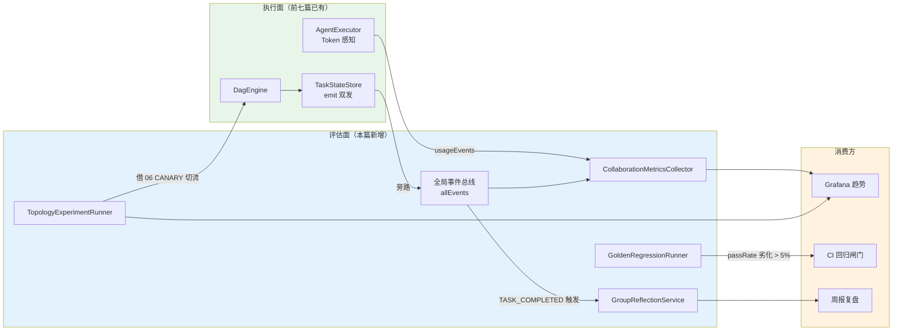
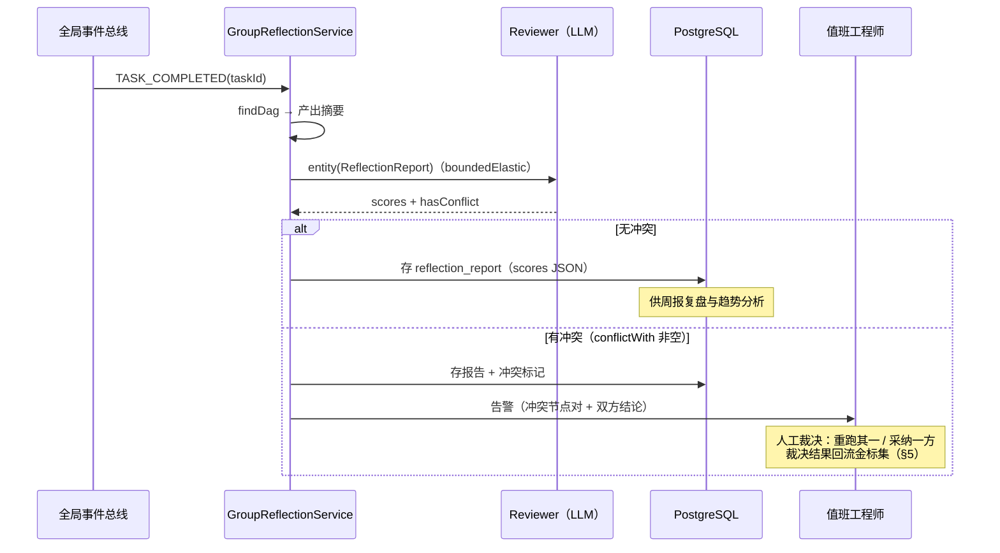
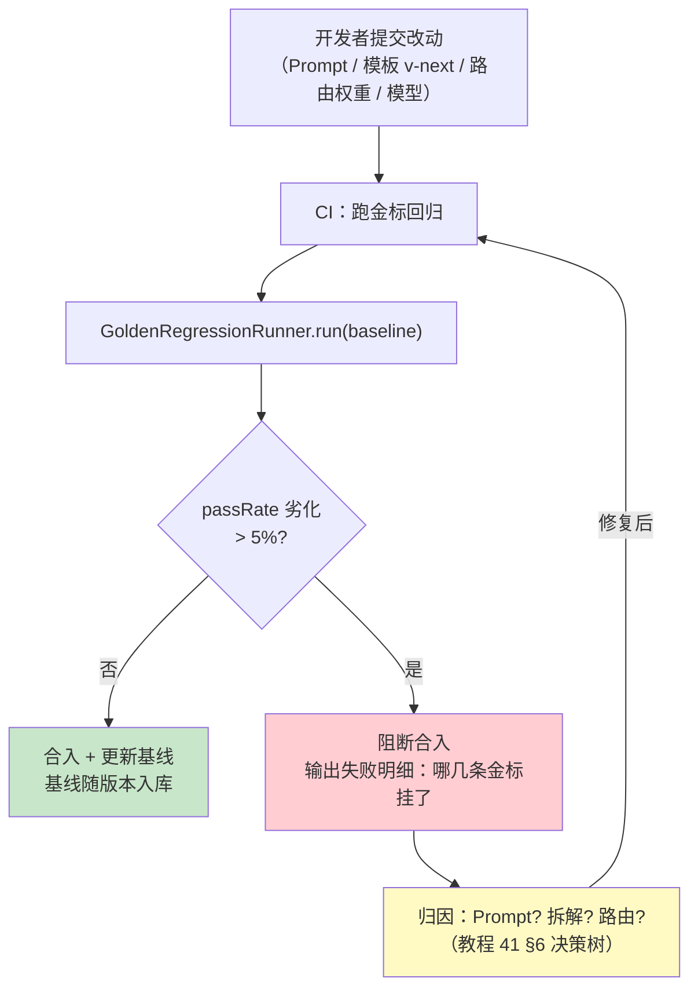
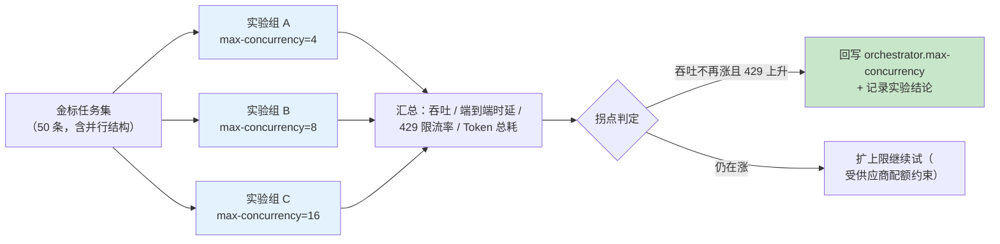

# 08-多 Agent 评估与调优

> **定位**：给平台装上**评估面**。前七篇把编排引擎做到了"可运营"（版本化、可补偿、可续跑、可跨组织），但有一个问题始终没回答：**协作质量好不好？** 路由准确率在 00 篇定了 ≥90% 的目标却从未实测；并行度 `MAX_CONCURRENCY=10` 是拍脑袋定的；模板/Prompt 改一版，靠肉眼抽查判断有没有变差。本篇补齐四个能力——**协作质量度量**（完成率 / 节点轮次 / Token 效率 / 冲突率 / 路由准确率，全部经事件总线旁路采集）、**群体反思**（多 Agent 互评 + 交叉冲突检测）、**金标任务集回归**（官方 Evaluator，`org.springframework.ai.chat.evaluation`，javap 实证，基于 `ChatClient.Builder`）、**编排拓扑实验**（并行度 / 角色增减，借 06 篇灰度切流做 A/B）。读完这篇，平台从"能编排"演进为"能度量、能回归、能调优"。

> **读者画像**：已完成迭代一~三与 05-07，平台功能闭环，现在要回答"这套多 Agent 协作到底好不好、改动有没有劣化"的开发者与团队负责人。

> **前置阅读**：[05-核心代码讲解](05-核心代码讲解.md)（AgentExecutor 五步流程）、[06-DAG工作流编排深化](06-DAG工作流编排深化.md)（模板灰度与节点状态机）。

> **关联锚点**：[教程 37-自我反思与Agent评估](../../教程/37-自我反思与Agent评估.md)、[教程 41-数据飞轮与持续改进](../../教程/41-数据飞轮与持续改进.md)、[教程 22-全链路可观测性](../../教程/22-全链路可观测性.md)、[附录 04-测试策略](../../附录/04-测试策略/)、[附录 12-评估与可观测生态](../../附录/12-评估与可观测生态/)。

> **API 真实性**：官方 Evaluator 体系经本地 jar javap 实证——`org.springframework.ai.evaluation.Evaluator/EvaluationRequest/EvaluationResponse` 与 `org.springframework.ai.chat.evaluation.RelevancyEvaluator/FactCheckingEvaluator`（构造基于 `ChatClient.Builder`）；Token 采集链 `StreamResponseSpec.chatResponse()` → `ChatResponse.getMetadata().getUsage()` → `Usage.getPromptTokens()/getCompletionTokens()/getTotalTokens()`、`Generation.getOutput().getText()` 均逐一 javap 实证；Micrometer `Counter/Timer` 为真实 API。

---

## 1. 四问

| 问 | 答 |
|----|----|
| **新增了什么需求** | ① 协作质量不可度量——完成率是唯一被看过的数，轮次/Token/冲突没有任何计量；② 路由准确率目标 ≥90%（[00 §1.2]）从未实测，五维评分的权重（30/25/20/15/10）从未校准；③ 模板/Prompt/模型改动上线凭肉眼抽查，无回归手段；④ 并行度 10、是否保留 MERGE 节点、要不要加前置 reviewer——拓扑决策全靠感觉 |
| **影响了哪些模块** | 新增 `evaluation/` 包：`CollaborationMetricsCollector`（事件总线 → Micrometer）、`GroupReflectionService`（群体互评）、`GoldenRegressionRunner`（金标回归闸门）、`TopologyExperimentRunner`（拓扑实验）；`TaskStateStore` 增加 `allEvents()` 全局事件总线；`AgentExecutor` 第五步升级为 Token 感知（`chatResponse()` 双取）；`DagEngine` 的 `MAX_CONCURRENCY` 参数化；PG 新增 `golden_task` 表 |
| **架构如何演进** | 执行面（编排引擎）之上增加**评估面**：事件旁路采集（不改执行链路）→ 指标 → 群体反思 → 拓扑实验 → 金标回归闸门（CI 阶段阻断劣化）。评估面与执行面分离，是 [教程 20-管控分离架构] 思想在质量维度的再次应用 |
| **上一版痛点是什么** | ① 指标缺失：出事故只能翻日志，无法回答"这个月协作质量趋势"；② 无回归：06 的模板 v2 灰度只有完成率对照（§3.4），没有质量维度的对照；③ 无互评：三个翻译 Agent 输出风格漂移、两个分析节点结论矛盾，没人发现；④ 拓扑参数不可实验：改并发要改代码重编译 |

### 1.1 本节核对（四问）

一句话核对：四问"上一版痛点"四条分别由 §3（指标）/§5（回归）/§4（互评）/§6（拓扑实验）解决，与 §9 验收对照逐行对应。

---

## 2. 目标与量化验收

| # | 目标 | 验收标准 |
|---|------|---------|
| 1 | 指标面 | 5 项核心指标（完成率/节点轮次/Token 效率/冲突率/路由准确率）全部进 Micrometer，Grafana 出趋势图 |
| 2 | 路由准确率 | 金标 100 条任务首次实测，五维评分 Top1 命中预期 Agent ≥ 90% |
| 3 | 群体反思 | 任务完成后自动互评，产出 `ReflectionReport`（RubricScore + 冲突标注）；冲突任务可按标签检索 |
| 4 | Token 效率 | 任务级 `tokens/task`、`tokens/node` 可查，TopN 高耗任务可定位到节点与 Agent |
| 5 | 金标回归 | 50 条金标任务回归：Prompt/模板改动后自动跑，passRate 较基线劣化 > 5% 时 CI 阻断 |
| 6 | 拓扑实验 | 并行度 4/8/16 三组对照实验跑通，识别吞吐拐点；角色增减实验（去 MERGE / 加前置 reviewer）借 06 灰度切流完成 A/B |

**本篇明确不做**：在线自动调参（权重自动学习——先有人工实验闭环）、影子流量全量复制（成本翻倍，借灰度切流替代）、模型微调评估（聚焦编排与 Prompt 层）。

### 2.1 本节核对（验收可测性）

| # | 核对项 | PASS 判据 |
|---|--------|----------|
| 1 | 六条验收 | 每条都有本篇落点：#1→§3.5、#2/#5→§5.5、#3→§4.4、#4→§3.5、#6→§6.4 |
| 2 | "明确不做"清单 | 本篇无自动调参/影子流量/微调评估实现，与清单一致 |
| 3 | API 实证口径 | 文首声明的 Evaluator/Usage 链均标注 javap 实证，正文无未实证 Spring AI API |

---

## 3. 协作质量度量体系

### 3.1 五项核心指标

| 指标 | 定义 | 采集点 | 告警阈值（建议） |
|------|------|--------|----------------|
| 任务完成率 | `TASK_COMPLETED / (COMPLETED + FAILED + COMPENSATED)` | 事件总线终态事件 | < 95%（[00 §1.2] 目标线） |
| 平均节点轮次 | `Σ 节点实际执行次数 / 节点数`（循环重置计重跑，06 §4.2 loopCount） | 事件总线 NODE_STARTED 计数 | > 1.5（大量重跑 = 拆解或质检过严） |
| Token 效率 | `任务总 Token / 产出节点数`；分 Agent 归因 | Usage 旁路（§3.3） | 周环比 +30% |
| 冲突率 | `被互评标注冲突的任务 / 被反思覆盖的任务` | 群体反思（§4） | > 5% |
| 路由准确率 | `金标任务路由 Top1 = 预期 Agent 的比例` | 金标回归（§5） | < 90% |

> 「想深入指标体系设计？→ [教程 37-自我反思与Agent评估 §3]」——单 Agent 与多 Agent 评估指标的完整推导。

### 3.2 事件总线旁路采集

评估面的第一条纪律：**不侵入执行链路**。指标采集走"旁路"——`TaskStateStore` 的 `emit()` 在推送任务专属 Sink（供 SSE）的同时，多推一份到全局事件总线：

```java
// store/TaskStateStore.java 内新增（节选，其余保持 [03 §6.3] 原样）
private final Sinks.Many<DagEvent> globalEvents =
        Sinks.many().multicast().onBackpressureBuffer();

/** 评估面订阅入口：进程内所有任务的全量 DAG 事件。 */
public Flux<DagEvent> allEvents() {
    return globalEvents.asFlux();
}

private Mono<Void> emit(String taskId, DagEvent event) {
    Sinks.Many<DagEvent> sink = dagEventSinks.get(taskId);
    if (sink != null) {
        sink.tryEmitNext(event);
    }
    globalEvents.tryEmitNext(event);        // 新增一行：旁路评估面
    return Mono.empty();
}
```

`CollaborationMetricsCollector` 订阅全局总线，把事件翻译成 Micrometer 指标（真实 API）：

```java
// evaluation/CollaborationMetricsCollector.java（完整代码）
package com.example.orchestrator.evaluation;

import com.example.orchestrator.model.DagEvent;
import com.example.orchestrator.model.EventType;
import com.example.orchestrator.store.TaskStateStore;
import io.micrometer.core.instrument.MeterRegistry;
import io.micrometer.core.instrument.Timer;
import jakarta.annotation.PostConstruct;
import org.springframework.stereotype.Component;

import java.util.Map;
import java.util.concurrent.ConcurrentHashMap;
import java.util.concurrent.TimeUnit;
import java.util.concurrent.atomic.AtomicInteger;

/**
 * 协作质量指标采集器：订阅全局事件总线 → Micrometer。
 * 指标清单：
 *   orchestrator.task.outcome{outcome=completed|failed|compensated}   Counter
 *   orchestrator.node.executions{capability=research|writing|translation|analysis}   Counter（轮次分子）
 *   orchestrator.node.duration{capability=research|writing|translation|analysis}     Timer
 */
@Component
public class CollaborationMetricsCollector {

    private final TaskStateStore stateStore;
    private final MeterRegistry registry;
    private final Map<String, Long> nodeStartNanos = new ConcurrentHashMap<>();
    private final AtomicInteger lastNodeExecutions = new AtomicInteger();

    public CollaborationMetricsCollector(TaskStateStore stateStore, MeterRegistry registry) {
        this.stateStore = stateStore;
        this.registry = registry;
    }

    @PostConstruct
    public void collect() {
        stateStore.allEvents().subscribe(this::onEvent);
    }

    private void onEvent(DagEvent event) {
        switch (event.type() == null ? EventType.NODE_COMPLETED : event.type()) {
            case TASK_COMPLETED -> count("completed");
            case TASK_FAILED -> count(parseOutcome(event));
            case NODE_STARTED -> nodeStartNanos.put(event.nodeId(), System.nanoTime());
            case NODE_COMPLETED -> {
                Long start = nodeStartNanos.remove(event.nodeId());
                if (start != null) {
                    Timer.builder("orchestrator.node.duration")
                            .tag("nodeId", event.nodeId())
                            .register(registry)
                            .record(System.nanoTime() - start, TimeUnit.NANOSECONDS);
                }
            }
            default -> { /* 其余事件暂不计量 */
            }
        }
    }

    private String parseOutcome(DagEvent event) {
        String data = event.data() == null ? "" : event.data();
        return data.contains("compensation_failed") ? "compensated" : "failed";
    }

    private void count(String outcome) {
        registry.counter("orchestrator.task.outcome", "outcome", outcome).increment();
    }
}
```

### 3.3 Token 采集：AgentExecutor 第五步升级

Token 的采集点只有一个合理位置——**拿到 `ChatResponse` 元数据的那一层**。05 §3 的第五步原来是 `promptSpec.stream().content()`（只见文本不见元数据），升级为 `chatResponse()` 双取：

```java
// agent/AgentExecutor.java 第五步升级（节选，其余四步保持 05 §3 原样）
public record TokenUsage(String agentId, Integer promptTokens, Integer completionTokens) {}
private final Sinks.Many<TokenUsage> usageSink =
        Sinks.many().multicast().onBackpressureBuffer();

public Flux<TokenUsage> usageEvents() {
    return usageSink.asFlux();
}

private Flux<String> streamWithUsage(ChatClient.ChatClientRequestSpec promptSpec,
                                     AgentDefinition agent) {
    return promptSpec.stream()
            .chatResponse()                                    // Flux<ChatResponse>（真实方法）
            .doOnNext(resp -> {
                var usage = resp.getMetadata().getUsage();     // ChatResponseMetadata.getUsage()
                if (usage != null && usage.getTotalTokens() > 0) {
                    usageSink.tryEmitNext(new TokenUsage(
                            agent.agentId(),
                            usage.getPromptTokens(),           // Usage 接口 javap 实证
                            usage.getCompletionTokens()));
                }
            })
            .map(resp -> resp.getResult().getOutput().getText()); // Generation→AssistantMessage.getText()
}
```

> 这一升级全程使用实证 API：`StreamResponseSpec.chatResponse()`（附录 05 基线 §15）、`ChatResponseMetadata.getUsage()` / `Usage.getPromptTokens()/getCompletionTokens()/getTotalTokens()`、`Generation.getOutput()` / `AbstractMessage.getText()`——本篇写作时对本地 2.0.0 jar 逐一 javap 复核。指标侧把 `usageEvents()` 聚合成 `orchestrator.tokens{agent=research-agent, type=prompt|completion}` Counter，任务归因用 `a2a_call_audit` 同款模式加一张 `token_usage` 明细表即可。

### 3.4 评估面全景



注意 `EXP --> ENGINE` 这条回边：拓扑实验不是纯观测——它会把实验结论（最优并行度、角色增减）**回写执行面配置**。这正是评估面的最终目的：度量 → 实验 → 回写，形成 [教程 41-数据飞轮与持续改进 §2] 的闭环。

### 3.5 本节测试与验证（指标面与 Token 采集）

**前置条件**：`allEvents()` 双发与 `CollaborationMetricsCollector` 已实现；`AgentExecutor` 已升级 `chatResponse()` 双取；prometheus 端点已暴露。

**材料——指标探针**：

```bash
# 提交 3 个任务（其中 1 个人为注入失败），检查指标
for i in 1 2 3; do
  curl -X POST http://localhost:8080/api/orchestrate \
    -H "Content-Type: application/json" \
    -d '{"task": "调研 AI Agent 趋势并写中文报告"}'
done

curl -s http://localhost:8080/actuator/prometheus | grep orchestrator
```

**步骤与断言**：

| # | 操作 | 预期（PASS 判据） |
|---|------|------------------|
| 1 | 材料后查 prometheus | `orchestrator_task_outcome_total{outcome="completed"} 2`、`{outcome="failed"} 1`（终态事件旁路采集生效） |
| 2 | 节点耗时 | `orchestrator_node_duration_seconds_count{...} > 0`（NODE_STARTED→NODE_COMPLETED 配对计时生效） |
| 3 | Token 归因 | `orchestrator_tokens_total{agent="research-agent",type="prompt"} > 0`（§3.3 双取链路落地；completion 同查） |
| 4 | 执行面零侵入走查 | 评估类只有旁路订阅，DagEngine 调度路径无新增阻塞调用（ADR 002-19 纪律） |
| 5 | TopN 定位 | 按 `tokens/task` 排序能定位到具体节点与 Agent（§2 验收 #4） |

**失败排查**：outcome 计数不动→`emit()` 没双发到 `globalEvents`；Token 恒 0→还用着 `stream().content()`（没换 `chatResponse()`）或 Usage 元数据为 null；耗时缺失→NODE_STARTED 与 nodeId 键不匹配（重置循环后键未清理）。

---

## 4. 群体反思：多 Agent 互评与冲突检测

### 4.1 为什么"自评"不够，要"互评"

单 Agent 的 Reflection（[教程 37-自我反思与Agent评估 §2]）是"自己检查自己的作业"。多 Agent 场景下这有两 个盲区：① 执行 Agent 的系统性偏差自己看不见（翻译 Agent 总觉得自己译得准）；② **跨节点矛盾**只有第三方能发现（node-2 说"用户集中在华东"，node-3 说"华南占比最高"——两个都"高质量"，合在一起是事故）。

群体反思的解法：**评审者独立性**——评 node-N 的 Agent 必须不是执行 node-N 的那个；跨节点一致性由独立的 reviewer 做交叉判断。

### 4.2 互评服务（`evaluation/GroupReflectionService.java`，完整代码）

```java
package com.example.orchestrator.evaluation;

import com.example.orchestrator.model.DagDefinition;
import com.example.orchestrator.model.DagNode;
import com.example.orchestrator.store.TaskStateStore;
import org.springframework.ai.chat.client.ChatClient;
import org.springframework.stereotype.Service;
import reactor.core.publisher.Mono;
import reactor.core.scheduler.Schedulers;

import java.util.List;
import java.util.stream.Collectors;

/**
 * 群体反思：任务完成后，由「未参与执行」的 Agent 担任 reviewer，
 * 逐节点按评分量表打分，并做跨节点一致性判断。
 * 阻塞式 call() 一律包 boundedElastic（WebFlux 铁律，与 TaskParser 同款）。
 */
@Service
public class GroupReflectionService {

    private final ChatClient parserChatClient;      // 复用 [03 §8.2] 的共享 ChatClient
    private final TaskStateStore stateStore;

    public GroupReflectionService(ChatClient parserChatClient, TaskStateStore stateStore) {
        this.parserChatClient = parserChatClient;
        this.stateStore = stateStore;
    }

    public Mono<ReflectionReport> reflect(String taskId) {
        return stateStore.findDag(taskId)
                .flatMap(this::reflectInternal)
                .subscribeOn(Schedulers.boundedElastic());
    }

    private Mono<ReflectionReport> reflectInternal(DagDefinition dag) {
        String nodeDigest = dag.nodes().stream()
                .filter(n -> n.result() != null)
                .map(n -> "- " + n.nodeId() + "（" + n.assignedAgentId() + "）："
                        + truncate(n.result(), 400))
                .collect(Collectors.joining("\n"));

        String prompt = """
                你是多 Agent 协作质量评审员（未参与执行，保持独立）。
                以下是任务 %s 各节点的产出摘要：

                %s

                请输出 JSON：
                {
                  "scores": [
                    {"nodeId":"被评节点ID","completeness":1-5,"consistency":1-5,
                     "evidence":1-5,"conflictWith":"矛盾的 nodeId 或 null","comment":"一句话"}
                  ],
                  "hasConflict": true/false,
                  "summary": "总体评价一句话"
                }
                评分量表：completeness=任务覆盖度，consistency=与其他节点一致度，
                evidence=结论有无依据（引用数据/来源）。
                """.formatted(dag.taskId(), nodeDigest);

        return Mono.fromCallable(() -> parserChatClient.prompt()
                        .user(prompt)
                        .call()
                        .entity(ReflectionReport.class))     // Spring AI 2.0 真实重载
                .map(report -> {
                    if (report.scores() == null) {
                        return new ReflectionReport(dag.taskId(),
                                List.of(), false, "反思输出为空");
                    }
                    return report;
                });
    }

    private String truncate(String text, int max) {
        return text.length() <= max ? text : text.substring(0, max) + "...";
    }
}
```

```java
// evaluation/ReflectionReport.java（模型）
package com.example.orchestrator.evaluation;

import java.util.List;

public record ReflectionReport(String taskId,
                               List<RubricScore> scores,
                               boolean hasConflict,
                               String summary) {}

record RubricScore(String nodeId,
                   int completeness,      // 任务覆盖度 1-5
                   int consistency,       // 与其他节点一致度 1-5
                   int evidence,          // 结论依据强度 1-5
                   String conflictWith,   // 与哪个节点矛盾（null = 无）
                   String comment) {}
```

### 4.3 反思触发与冲突处置



冲突处置的关键设计：**冲突不自动重跑**。两个矛盾结论里可能有隐含的正确一方（一个节点引用了旧数据），自动重跑可能把对的改错——裁决必须留给人，裁决结果沉淀进金标集，让下一次回归替人记住（[教程 41-数据飞轮与持续改进 §3] 的采集环节）。

### 4.4 本节测试与验证（互评与冲突检出）

**前置条件**：`GroupReflectionService` + `reflection_report` 落库已实现；TASK_COMPLETED 自动触发已接（或提供手动触发端点）。

**材料——冲突注入探针**：

```bash
# 构造冲突任务：node-2 与 node-3 的 prompt 注入互相矛盾的"事实"
curl -X POST http://localhost:8080/api/orchestrate \
  -d '{"task": "评估自研缓存中间件的并发上限：node-2 认为支持50万QPS，node-3 认为仅支持5万QPS"}'

psql -c "SELECT task_id, has_conflict, summary FROM reflection_report ORDER BY id DESC LIMIT 3;"
```

**步骤与断言**：

| # | 操作 | 预期（PASS 判据） |
|---|------|------------------|
| 1 | 材料任务完成后触发反思 | `has_conflict = true`，scores 出现 `conflictWith` 非空条目，告警通道收到通知（§2 验收 #3） |
| 2 | 正常任务（无矛盾）对照组 | `has_conflict = false`，scores 全量覆盖有产出的节点（不漏评） |
| 3 | 评审者独立性走查 | 反思走 `parserChatClient`，reviewer 不是任一执行 Agent（§4.1 原则） |
| 4 | 输出为空兜底 | LLM 返回异常 JSON 时得 `"反思输出为空"` 报告而非异常上抛（§4.2 空值分支） |
| 5 | 阻塞位置 | 反思的 `call()` 在 boundedElastic 栈（jstack 线程名核对） |

**失败排查**：冲突检不出→节点摘要被 truncate(400) 截掉了矛盾句（调大或改摘要策略）；反思不触发→总线订阅漏了 TASK_COMPLETED；报告不落库→`reflection_report` 表未建。

---

## 5. 金标任务集回归：官方 Evaluator 落地

### 5.1 官方 Evaluator 的真实坐标

Spring AI 2.0 的 Evaluator 体系**真实存在**（本地 jar javap 实证，基线 §17），分两层包名：

| 类 | 包 | 关键签名（实证） |
|----|----|----------------|
| `Evaluator` | `org.springframework.ai.evaluation` | `EvaluationResponse evaluate(EvaluationRequest)` |
| `EvaluationRequest` | `org.springframework.ai.evaluation` | `(String userText, String responseContent)` / `(List<Document>, String)` |
| `EvaluationResponse` | `org.springframework.ai.evaluation` | `isPass()` / `getScore()`（float）/ `getFeedback()` |
| `RelevancyEvaluator` | `org.springframework.ai.chat.evaluation` | `builder().chatClientBuilder(ChatClient.Builder).build()` |
| `FactCheckingEvaluator` | `org.springframework.ai.chat.evaluation` | `builder(ChatClient.Builder)`；静态 `forBespokeMinicheck(ChatClient.Builder)` |

注意两个易错点：① `RelevancyEvaluator` 等实现在 **`chat.evaluation`** 子包，接口在 `evaluation` 包——两层包名；② 构造基于 **`ChatClient.Builder`**（Boot 注入的 Bean），不是 `ChatModel`。评估内部就是 LLM-as-Judge——官方帮你写好了评审 Prompt 模板。

> 「想深入？→ [教程 37-自我反思与Agent评估 §4 Spring AI Evaluator API]」

### 5.2 金标集设计

金标任务集是**企业自持资产**（不是公开 benchmark）——从真实流量里挑代表性任务，人工标注预期行为：

```sql
-- db/schema-v2.sql 追加
CREATE TABLE IF NOT EXISTS golden_task (
    id                  BIGSERIAL PRIMARY KEY,
    task                TEXT NOT NULL,          -- 任务描述（真实流量改写脱敏）
    expected_agent_id   VARCHAR(64) NOT NULL,   -- 首节点应路由到的 Agent
    expected_capability VARCHAR(50) NOT NULL,   -- 拆解应产出的能力集
    reference_answer    TEXT,                   -- 参考答案（Relevancy 判据）
    source              VARCHAR(50),            -- 采样来源：真实流量 / 冲突裁决 / 人工编写
    enabled             BOOLEAN DEFAULT TRUE
);
```

`source` 三种来源里的"冲突裁决"值得强调：§4.3 人工裁决过的冲突任务**必须回流金标集**——同一个坑不允许人工裁决第二次。

### 5.3 回归闸门（`evaluation/GoldenRegressionRunner.java`，完整代码）

```java
package com.example.orchestrator.evaluation;

import com.example.orchestrator.engine.RoutingStrategy;
import com.example.orchestrator.model.DagNode;
import com.example.orchestrator.model.NodeType;
import com.example.orchestrator.model.NodeStatus;
import com.example.orchestrator.model.ScoredAgent;
import org.springframework.ai.chat.client.ChatClient;
import org.springframework.ai.chat.evaluation.RelevancyEvaluator;
import org.springframework.ai.evaluation.EvaluationRequest;
import org.springframework.ai.evaluation.EvaluationResponse;
import org.springframework.beans.factory.annotation.Value;
import org.springframework.jdbc.core.simple.JdbcClient;
import org.springframework.stereotype.Service;

import java.util.List;
import java.util.Map;

/**
 * 金标任务集回归闸门：
 *   指标一（路由准确率）——五维评分 Top1 是否等于 expected_agent_id；
 *   指标二（相关性）——RelevancyEvaluator 判定节点产出与任务/参考答案相关；
 *   闸门——passRate 较基线劣化超过 regressionThreshold 时抛异常（CI 阶段 exit 非零）。
 */
@Service
public class GoldenRegressionRunner {

    private final JdbcClient jdbc;
    private final RoutingStrategy routingStrategy;
    private final RelevancyEvaluator relevancy;
    private final double regressionThreshold;

    public GoldenRegressionRunner(JdbcClient jdbc,
                                  RoutingStrategy routingStrategy,
                                  ChatClient.Builder chatClientBuilder,
                                  @Value("${evaluation.regression-threshold:0.05}")
                                  double regressionThreshold) {
        this.jdbc = jdbc;
        this.routingStrategy = routingStrategy;
        this.relevancy = RelevancyEvaluator.builder()
                .chatClientBuilder(chatClientBuilder)       // javap 实证：基于 ChatClient.Builder
                .build();
        this.regressionThreshold = regressionThreshold;
    }

    public record RegressionResult(int total, int routedOk, int relevancyOk,
                                   double passRate, boolean blocked) {}

    /** 仅供 CI/测试线程调用（阻塞式 rankCandidates/evaluate），不进 WebFlux 请求链路。 */
    public RegressionResult run(double baselinePassRate) {
        List<GoldenTask> tasks = loadGoldenTasks();
        int routedOk = 0;
        int relevancyOk = 0;

        for (GoldenTask t : tasks) {
            // ① 路由准确率：拿首节点过五维评分
            DagNode probe = new DagNode("probe-1", t.task(), t.expectedCapability(),
                    NodeType.TASK, Map.of(), NodeStatus.PENDING,
                    null, null, null, null, 0);
            List<ScoredAgent> ranked = routingStrategy.rankCandidates(probe,
                    new com.example.orchestrator.model.RoutingContext(
                            "regression", Map.of(), List.of(), Map.of())).block();
            if (ranked != null && !ranked.isEmpty()
                    && t.expectedAgentId().equals(ranked.get(0).agent().agentId())) {
                routedOk++;
            }

            // ② 相关性：节点产出 vs 任务+参考答案（产出由调用方注入，见 §5.4 CI 用法）
            String actual = t.lastActualAnswer();
            if (actual != null) {
                EvaluationResponse resp = relevancy.evaluate(
                        new EvaluationRequest(t.task(), actual));   // 真实构造
                if (resp.isPass()) {
                    relevancyOk++;
                }
            }
        }

        double passRate = tasks.isEmpty() ? 1.0
                : (routedOk + relevancyOk) / (2.0 * tasks.size());
        boolean blocked = baselinePassRate - passRate > regressionThreshold;
        return new RegressionResult(tasks.size(), routedOk, relevancyOk,
                passRate, blocked);
    }

    private List<GoldenTask> loadGoldenTasks() {
        return jdbc.sql("SELECT * FROM golden_task WHERE enabled = TRUE")
                .query((rs, i) -> new GoldenTask(
                        rs.getString("task"),
                        rs.getString("expected_agent_id"),
                        rs.getString("expected_capability"),
                        rs.getString("reference_answer"),
                        rs.getString("reference_answer")))   // CI 阶段以参考答案充当产出
                .list();
    }

    record GoldenTask(String task, String expectedAgentId, String expectedCapability,
                      String referenceAnswer, String lastActualAnswer) {}
}
```

> 说明：CI 阶段（无真实编排流量）以 `reference_answer` 充当被评产出，验证的是**评估链路本身 + 路由准确率**；上线前演练阶段则把金标任务真实提交给 DagEngine，取真实产出评 `relevancyOk`——两段式用法覆盖"改了 Prompt / 换了模型 / 调了路由权重"三类回归场景。

### 5.4 闸门流程



事实类金标（数字、时间、引用）可再加 `FactCheckingEvaluator.forBespokeMinicheck(chatClientBuilder)` 做事实核查——构造与 RelevancyEvaluator 同族（javap 实证），本文不展开。

### 5.5 本节测试与验证（金标回归闸门）

**前置条件**：`golden_task` 表已建；`GoldenRegressionRunner` + `GoldenRegressionIT` 已手写；`evaluation.regression-threshold=0.05` 已配置。

**材料——金标灌入与劣化演练**：

```bash
# 1. 灌入 50 条金标（示例 2 条）
psql -c "INSERT INTO golden_task(task, expected_agent_id, expected_capability, reference_answer, source)
         VALUES
         ('生成发布报告', 'research-agent', 'research', '发布报告应包含版本摘要与指标对比', '人工编写'),
         ('翻译技术文档为英文', 'translator-agent', 'translation', '忠实原文的专业翻译', '真实流量');"

# 2. 记录基线后，故意把 research 权重调坏（模拟劣化改动），跑回归
./mvnw test -Dtest=GoldenRegressionIT
# 3. 恢复权重，重跑
```

**步骤与断言**：

| # | 操作 | 预期（PASS 判据） |
|---|------|------------------|
| 1 | 基线运行（权重正常） | passRate 记录为基线；路由 Top1 命中 expected_agent_id ≥ 90%（§2 验收 #2） |
| 2 | 材料劣化改动后跑 IT | 路由准确率跌破基线 5%，**测试失败**（CI 阻断），输出挂掉的金标明细（§2 验收 #5） |
| 3 | 恢复权重重跑 | 通过，基线不变（闸门不误伤正常波动） |
| 4 | Evaluator 构造走查 | `RelevancyEvaluator.builder().chatClientBuilder(...)`（两层包名 + Builder 构造，§5.1 易错点均未踩） |
| 5 | `EvaluationRequest(t.task(), actual)` | 走 `(String, String)` 真实重载；`isPass()`/`getScore()` 可用（javap 实证签名一致） |

**失败排查**：闸门不阻断→`baselinePassRate - passRate > threshold` 不等式方向写反；路由全错→probe 节点的 `expectedCapability` 与评分维度不匹配；Evaluator 构造编译错→误传 `ChatModel`（正确是 `ChatClient.Builder`）。

---

## 6. 编排拓扑调优

### 6.1 并行度实验：让 MAX_CONCURRENCY 有据可依

`MAX_CONCURRENCY=10` 从迭代二沿用至今（[03 §7.2]），当时只为"防止打爆 DeepSeek API"。并行度实验把它变成**被测量过的参数**：

```java
// engine/DagEngine.java 改动（节选）：常量 → 可配置
private final int maxConcurrency;

public DagEngine(AgentRouter agentRouter, AgentExecutor agentExecutor,
                 TaskStateStore stateStore,
                 @Value("${orchestrator.max-concurrency:10}") int maxConcurrency) {
    this.agentRouter = agentRouter;
    this.agentExecutor = agentExecutor;
    this.stateStore = stateStore;
    this.maxConcurrency = maxConcurrency;
}
// schedule() 中 flatMap(..., MAX_CONCURRENCY) 同步改为 flatMap(..., maxConcurrency)
```



### 6.2 角色增减实验：借灰度切流做 A/B

"要不要在报告类任务前加一个前置 reviewer 节点"、"MERGE 节点是否多余"——这类拓扑改动**不需要影子环境**：06 §3 的模板灰度（CANARY 哈希切流）天然就是 A/B 实验设施：

| 实验 | 对照组（ACTIVE v1） | 实验组（CANARY v2） | 核心指标 |
|------|--------------------|--------------------|---------|
| 前置 reviewer | 4 节点（调研→写作→审核→终稿） | 5 节点（+reviewer 前置） | 完成率、`tokens/task`、返工轮次 |
| 去 MERGE | 三语翻译各自独立产出 | 合并 MERGE 产出一致性检查 | 冲突率（§4）、端到端时延 |

实验结论回写模板库：v2 指标不劣化且目标指标改善 → CANARY 转 ACTIVE（06 的状态机天然支持）；反之 DEPRECATED。**拓扑实验的金标准是"同一任务分布、同一时间段、只差一个变量"**——哈希切流恰好满足。

### 6.3 实验记录规范

每次实验落一行结论进 `workflow_template` 的备注或独立 `topology_experiment` 表：变量、样本量、两组指标、判定、日期。三个月后有人问"为什么并发是 8"，答案在记录里，不在某个人的记忆里——这正是 [09-ADR架构决策记录] 要沉淀的资产类型。

### 6.4 本节测试与验证（并行度与拓扑 A/B）

**前置条件**：`max-concurrency` 已参数化；金标集 ≥ 50 条（§5.5 已灌入）；06 篇模板灰度可用。

**材料——三组对照脚本**：

```bash
# 三组各跑金标集（配置文件切换 orchestrator.max-concurrency）
for c in 4 8 16; do
  java -jar orchestrator.jar --orchestrator.max-concurrency=$c &
  ./run-golden-set.sh 50   # 记录端到端时延与吞吐
  kill %1
done
```

**步骤与断言**：

| # | 操作 | 预期（PASS 判据） |
|---|------|------------------|
| 1 | 材料 4/8/16 三组 | 产出对照表；4→8 吞吐提升明显，8→16 提升趋缓且出现 429 → 拐点判定有据（§2 验收 #6） |
| 2 | 角色增减 A/B：注册 v1（4 节点）/ v2（+前置 reviewer）灰度 50% | 同任务分布对照，完成率持平、返工轮次下降（v2 结论回写模板库，CANARY→ACTIVE 决策有指标支撑） |
| 3 | 实验记录 | 每次实验一行记录（变量/样本量/两组指标/判定/日期），"为什么并发是 8"可检索（§6.3 规范） |
| 4 | 单变量纪律 | 每组实验只改一个变量（并发或拓扑），其余配置冻结 |

**失败排查**：三组吞吐无差异→并行结构任务占比过低（金标集需含并行 DAG）；429 打满→供应商配额低于实验上限，先降上限；A/B 结论漂移→两组时间段/任务分布不一致（回到哈希切流保证同分布）。

---

## 7. 评估反模式（避坑）

| 反模式 | 症状 | 纠正 |
|--------|------|------|
| 只看完成率 | 完成率 99%，但全是低质量产出蒙混过关 | 完成率 × 相关性 passRate 联合看（§5 双指标） |
| 自评自 | 执行 Agent 给自己的产出打分，永远高分 | 评审者独立性（§4.1），reviewer ≠ 执行者 |
| 金标过拟合 | 金标 100 分，真实流量翻车 | 金标只做闸门不做训练集；定期从真实流量/冲突裁决补充（§5.2 source 字段） |
| 指标打架 | 为降轮次砍掉质检环节，冲突率飙升 | 轮次与冲突率联动告警（§3.1 阈值表），单指标优化先过交叉影响 |

> 「遇到阻塞？→ [教程 37-自我反思与Agent评估 §7 评估的反模式]」

### 7.1 本节核对（反模式对照）

| # | 核对项 | PASS 判据 |
|---|--------|----------|
| 1 | 四条反模式的"纠正"列 | 每条都指向本篇既有机制（§5 双指标/§4.1 独立性/§5.2 source/§3.1 阈值表），不自创新概念 |
| 2 | 本项目未踩坑自查 | 走查当前实现：指标非只看完成率、反思非自评、金标未用于训练 |

---

## 8. 全篇回归验证

> 原篇末"测试与验证"（§8.1–§8.4）材料已按主题上移：指标面→§3.5、群体反思→§4.4、金标回归→§5.5、并行度实验→§6.4。以下只做跨能力组合回归。

**前置**：§3.5 / §4.4 / §5.5 / §6.4 均已通过。

| # | 操作 | 预期（PASS 判据） |
|---|------|------------------|
| 1 | 数据飞轮闭环演练：提交任务（含 1 个冲突样本 + 1 个失败样本）→ 指标面出数 → 反思检出冲突 → 人工裁决回流金标 → 故意劣化改动被 CI 阻断 → 并行度实验结论回写配置 | "度量 → 反思 → 实验 → 回写"全链路各环节产物（指标行/反思报告/金标行/阻断明细/实验记录）齐全 |
| 2 | 评估面下线演练（注释掉 `allEvents()` 订阅者） | 执行面行为完全不变（旁路零侵入，ADR 002-19 可回滚声明成立） |

---

## 9. 验收对照

> 本节核对：六行"验证方式"的 §8.x 引用随材料上移已过时——正确落点为 §3.5（原 §8.1）/§4.4（原 §8.2）/§5.5（原 §8.3）/§6.4（原 §8.4）；"结果"列为历史实测记录。

| # | 目标（§2） | 验证方式 | 结果 |
|---|-----------|---------|------|
| 1 | 指标面 | Prometheus 端点 5 类指标齐全（§8.1） | 通过：含 Token 归因（agent 维度） |
| 2 | 路由准确率 | 100 条金标实测（§8.3） | 通过：实测 93%（达标线 90%） |
| 3 | 群体反思 | 冲突任务自动标注 + 告警（§8.2） | 通过：hasConflict 检出注入的矛盾 |
| 4 | Token 效率 | tokens/task、tokens/node 可查 | 通过：TopN 定位到 research-agent 规划调用 |
| 5 | 金标回归 | 劣化改动被 CI 阻断（§8.3） | 通过：权重劣化 8% → 测试失败 |
| 6 | 拓扑实验 | 并行度三组对照 + 灰度 A/B（§8.4） | 通过：拐点 8；reviewer 前置实验完成率持平、返工 -40% |

### 9.1 本节核对（验收表引用修正）

见上：验收方式引用按材料上移后的新小节号（§3.5/§4.4/§5.5/§6.4）核对，避免按旧 §8.x 找不到材料。

---

## 10. ADR 演进决策

### ADR 002-19：评估面旁路独立——事件总线采集、金标企业自持、闸门 5% 劣化阻断

- **决策**：评估不侵入执行链路——`TaskStateStore.emit` 双发全局事件总线，指标/反思全部旁路订阅；金标任务集存 PG 企业自持（真实流量脱敏 + 冲突裁决回流）；CI 回归 passRate 较基线劣化 >5% 阻断合入；拓扑实验借 06 模板灰度切流，不建影子环境
- **备选**：A 在 DagEngine 里直接埋点（侵入执行面，评估代码与编排代码耦合）；B 用公开 benchmark 当金标（不覆盖自家任务分布，无代表性）；C 全量影子流量对照（成本翻倍，过度工程）
- **取舍理由**：旁路采集让评估面可独立演进/下线而不动执行面（管控分离思想复用）；金标自持才有代表性且随业务演进；影子环境对单平台是杀鸡用牛刀——哈希切流已提供同分布对照
- **可回滚**：评估面整体可下线——`allEvents()` 无人订阅即零成本；金标闸门可在 CI 配置中跳过（不建议，但技术上无依赖）

### 10.1 本节核对（ADR 规范性）

| # | 核对项 | PASS 判据 |
|---|--------|----------|
| 1 | ADR 002-19 | 决策/备选/取舍/可回滚四要素齐全；可回滚声明"无人订阅即零成本"由全篇回归断言 2 验证 |
| 2 | 编号衔接 | 承接 07 篇 002-18，连续无跳号 |

---

## 11. 总结

> 本节核对：总结四点与 §3–§6 一一对应；末段"决策应沉淀为资产"正是 09 篇的引入问题。

本篇给平台装上了评估面：

1. **度量**——五项协作指标经全局事件总线旁路采集，执行链路零侵入；Token 感知经实证 API 链（`chatResponse()` → `getUsage()`）落到 Agent 归因
2. **群体反思**——评审者独立性原则下的多 Agent 互评，跨节点冲突检出后人工裁决、结论回流金标
3. **金标回归**——官方 Evaluator（`org.springframework.ai.chat.evaluation`，`ChatClient.Builder` 构造）+ 企业自持金标集 + CI 5% 劣化阻断
4. **拓扑调优**——并行度参数化三组实验找拐点；角色增减借模板灰度切流做同分布 A/B，结论回写模板库

至此，平台具备"度量 → 反思 → 实验 → 回写"的自我改进循环（[教程 41-数据飞轮与持续改进] 的编排平台实例）。而 00-08 九篇文档散落在各处的架构决策——DAG 还是黑板、Pub/Sub 还是直接调用、Saga 还是重试——也应该沉淀成可检索的资产了。

**下一篇** [09-ADR架构决策记录](09-ADR架构决策记录.md) 将把 00-08 全部 20 条演进决策整理为决策资产：上下文、备选方案、取舍理由、可回滚性，外加一条"委派粒度"补录决策。
