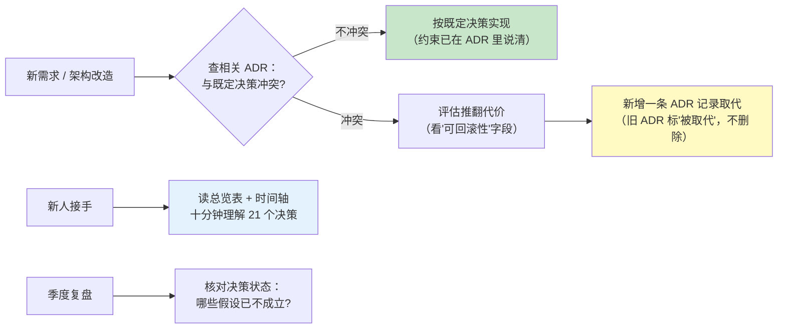
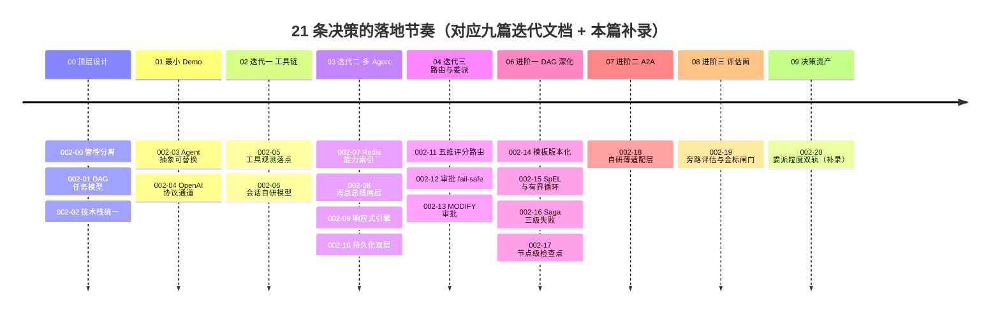
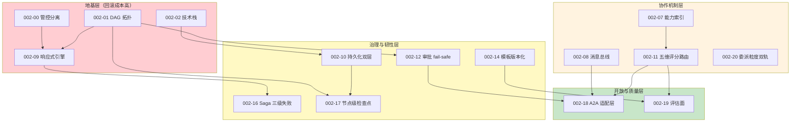

# 项目 02：多 Agent 协作平台 — 09-ADR 架构决策记录

> **定位**：把项目 02 从 00 到 08 九篇文档里散落的**全部 20 条演进决策**（ADR 002-00 ~ 002-19）+ **1 条补录决策**（ADR 002-20）沉淀为一份可检索的**决策资产**——每条记录**决策上下文 / 备选方案（≥2）/ 取舍理由 / 可回滚性**。这是项目的「决策 DNA」：三个月后要改造编排引擎时，先来这里查「当时为什么这么定」，而不是推倒重来。其中 11 条地基级决策在本篇展开全格式详解，其余 9 条以总览表 + 原文锚点收录。

> **读者画像**：想复盘本项目每个关键决策「为什么」的读者；学习 ADR 写法范式的架构师；准备接手改造本平台的工程师（改架构前必读）。

> **前置阅读**：[00-需求分析与架构设计](00-需求分析与架构设计.md)（顶层三条 ADR 的语境）、[05-核心代码讲解](05-核心代码讲解.md)（决策对应的代码全貌）。

> **方法论**：ADR 格式与决策纪律参照 [附录 07-架构决策方法论/00-ADR架构决策记录]；涉及 Spring AI 2.0 API 的决策均与 [附录 05-SpringAI2-API基准] 对齐（`javap` 实证）。

---

## 1. 四问

| 问 | 答 |
|----|----|
| **新增了什么需求** | ① 决策散落在九篇文档的篇末附注里，查"当时为什么这么定"要翻九处；② ADR 编号存在冲突（002-01 / 002-02 在 00 与 01 两篇重复出现），决策引用有歧义；③ 多数简式 ADR 缺"上下文 / 可回滚"两个字段，只回答了"选了什么"；④ 新人接手没有十分钟看全 20+ 个决策的入口 |
| **影响了哪些模块** | 不改任何代码——新增本文档；级联重编号 01/02/03/04/06 篇末 ADR（ADR 002-03 ~ 002-17 全局唯一，映射关系见 §3 总览表）；[00 §9] 的 ADR 范围注同步更新 |
| **架构如何演进** | 决策记录从「迭代篇附注」演进为「独立决策资产」：总览表（编号/落地锚点/状态）+ 演进时间轴 + 11 条全格式详解 + 四层依赖图 + 使用纪律；补录 1 条隐性决策（ADR 002-20 委派粒度双轨） |
| **上一版痛点是什么** | ① 决策可追溯性依赖读者记忆与翻找；② 被推翻的决策没有状态标记约定（采纳/被取代/回滚）；③ 改造前没有"这个决策被谁依赖"的检查入口——容易一脚踩到别人的地基 |

### 1.1 本节核对（四问）

一句话核对：四问"新增需求"四条分别由 §3 总览/编号重排/§5 全格式/§2 入口解决；"不改任何代码"声明成立（本篇为纯决策资产）。

---

## 2. 为什么需要 ADR

九篇迭代文档的篇末都各带 3~4 条简式 ADR（决策一句话 + 备选 + 取舍），它们回答了「当时选了什么」，但没有统一回答四个问题：**约束是什么（上下文）、还考虑过什么（备选）、付出了什么代价（取舍）、怎么退回来（可回滚）**。代码会重构、文档会过期，但决策的约束条件不会消失——不沉淀下来，就会被反复重新争论。

ADR 在本项目里有三个使用时刻：



### 2.1 本节核对（使用时刻覆盖）

| # | 核对项 | PASS 判据 |
|---|--------|----------|
| 1 | 四要素 | 上下文/备选/取舍/可回滚四个问题在 §5 详解条目中全部有对应字段 |
| 2 | 三个使用时刻 | 新需求/新人接手/季度复盘在流程图中均有出口，无死路节点 |

---

## 3. ADR 总览（21 条 = 20 条演进 + 1 条补录）

| # | 决策 | 落地文档 | 状态 |
|---|------|---------|------|
| 002-00 | 编排与执行分离的管控分离架构 | [00 §9] | ✅ 采纳 |
| 002-01 | 任务模型用 DAG，支持并行与审批网关 | [00 §9] | ✅ 采纳 |
| 002-02 | 技术栈统一 Spring AI 2.0 + WebFlux + Redis + PostgreSQL | [00 §9] | ✅ 采纳 |
| 002-03 | v0 立 Agent 抽象 + 注册中心接口，底层实现可替换 | [01 篇末] | ✅ 采纳（内存版已被 002-07 取代实现，接口未变） |
| 002-04 | LLM 统一走 OpenAI 协议 + DeepSeek base-url | [01 篇末] | ✅ 采纳 |
| 002-05 | 工具拦截用 `ToolCallingManager` 装饰器，弃用 AOP | [02 篇末] | ✅ 采纳 |
| 002-06 | 会话用自定义模型 + Redis String + TTL，不用官方 ChatMemory | [02 篇末] | ✅ 采纳 |
| 002-07 | Agent 注册中心用 Redis 能力索引，而非线性扫描 | [03 §13] | ✅ 采纳 |
| 002-08 | Agent 间通信选 Redis Pub/Sub 两层模型 | [03 §13] | ✅ 采纳 |
| 002-09 | DAG 引擎用响应式事件驱动，并发上限参数化（08） | [03 §13] / [08 §6.1] | ✅ 采纳 |
| 002-10 | 持久化双层：Redis 实时快照 + PostgreSQL 审计/恢复 | [03 §13] | ✅ 采纳 |
| 002-11 | 路由用多维度评分 + 降级链，而非纯 LLM 单点决策 | [04 §10] | ✅ 采纳 |
| 002-12 | 审批用 DAG 审批节点 + Sinks 阻塞等待，超时 fail-safe 拒绝 | [04 §10] | ✅ 采纳 |
| 002-13 | MODIFY 审批让「人改参数、机器继续」 | [04 §10] | ✅ 采纳 |
| 002-14 | 工作流定义版本化：模板库优先，LLM 即兴兜底 | [06 §9] | ✅ 采纳 |
| 002-15 | 边条件用 SpEL，循环用逻辑环 + 三层护栏 | [06 §9] | ✅ 采纳 |
| 002-16 | 失败处理三级化：瞬时重试 / 永久补偿 / 不可补偿告警 | [06 §9] | ✅ 采纳 |
| 002-17 | 检查点粒度 = 节点终态，恢复以 PostgreSQL 为准 | [06 §9] | ✅ 采纳 |
| 002-18 | A2A 用自研薄适配层，Agent Card 发布为显式白名单 | [07 §10] | ✅ 采纳 |
| 002-19 | 评估面旁路独立：事件总线采集、金标自持、5% 劣化闸门 | [08 §10] | ✅ 采纳 |
| 002-20 | 委派粒度双轨：DAG 预编排为主 + 运行时委派兜底 | 本篇补录（源自 [04 §5.3]） | ✅ 采纳（补录） |

> 状态只有三种：✅ 采纳 / 🔄 被取代（注明被哪条取代）/ ⛔ 已回滚。决策被推翻时**新增 ADR 记录原因，不删旧 ADR**——被取代的决策同样记录了当时的约束。

### 3.1 本节核对（总览表完整性）

| # | 核对项 | PASS 判据 |
|---|--------|----------|
| 1 | 21 行（002-00 ~ 002-20） | 编号连续无缺号、无重复；每行有落地文档锚点与状态 |
| 2 | 锚点有效性 | 抽查 5 行锚点（如 [06 §9]、[08 §10]）能跳到对应 ADR 原文且编号一致 |
| 3 | 状态枚举 | 只用 ✅/🔄/⛔ 三种；被取代的实现（002-03 内存版）有注明而非删除 |

---

## 4. 决策演进时间轴



时间轴揭示一个规律：**前半程（00-04）的决策都在回答"怎么把多 Agent 跑起来"，后半程（06-08）的决策都在回答"怎么让它可运营"**——版本化、补偿、检查点、评估闸门。架构演进的分水岭不是功能多少，而是"出了事能不能说清楚"。

### 4.1 本节核对（时间轴一致性）

| # | 核对项 | PASS 判据 |
|---|--------|----------|
| 1 | 时间轴与总览表 | 每篇文档下列出的 ADR 编号与 §3 表"落地文档"列互相印证，无单边出入 |
| 2 | 05 篇缺位 | 时间轴无 05（讲解篇不产决策）——与 05 篇定位一致，非漏写 |

---

## 5. 关键 ADR 详解（11 条全格式）

### 5.1 ADR 002-01：编排拓扑选型——DAG 而非黑板模式或主管委派

- **上下文**：00 篇要把"复杂任务自动拆解分配"建模。候选拓扑恰好覆盖多 Agent 协作的三大范式：**黑板模式**（Agent 围绕共享状态工作，各自决定何时读写）、**主管委派**（Supervisor LLM 循环决策"下一个派给谁"，ReAct 式）、**DAG**（先规划成图，再按图执行，Plan-and-Execute 式）。约束：日均 5000+ 任务、无依赖子任务必须并行、任务要可审计（哪个节点谁做的花了几秒）、审批要能阻塞在图上的确定位置。
- **备选**：
  - A 黑板模式：松耦合，Agent 可动态加入；但需要锁与写冲突消解，全局进度不可见（任务卡住时不知道该谁动），对 LLM Agent 尤其昂贵——每个 Agent 都要"反复看黑板决定要不要动" = 持续烧规划 Token
  - B 主管委派：实现最直观（一个 while 循环 + 一次 LLM 决策）；但 supervisor 是串行单点，上下文随任务复杂度膨胀，且"进度"只存在于 supervisor 的上下文里——崩溃即失忆，无法检查点
  - C DAG：拓扑显式、无依赖自动并行、节点即副作用边界（幂等与检查点有了天然粒度）、审批可以是一类节点
- **决策**：C（DAG）为主拓扑。B 的"运行时委派"思想保留为局部补充——即 DelegationTool（[04 §5]）与本篇补录的 ADR 002-20。
- **取舍**：DAG 表达力弱于任意拓扑——条件分支、循环在 00~05 期间一直"定义了字段但没实现"，直到 [06] 才以"逻辑环 + 三层护栏"补齐；换来的是调度可收敛、状态机清晰、全链路可审计。这是典型的**用表达力换可控性**。
- **可回滚性**：**低**——这是地基型决策，002-09/10/14/16/17 全部建立在"节点 + 边"模型之上。正因不可轻易回滚，它最值得一条 ADR；若真要推翻（如改 Actor 模型），等于重写编排层，应新增 ADR 论证而不是悄悄改。

### 5.2 ADR 002-00：编排与执行分离的管控分离架构

- **上下文**：最朴素的实现是"引擎里直接 new ChatClient 调模型"——功能照样能跑。但 00 的指标（峰值 100 并发编排、99.9% 可用）要求引擎与 Agent 能力独立演进：Agent 会持续增删（07 甚至出现远端 Agent），引擎不该感知执行细节。
- **备选**：A 引擎直调（耦合，Agent 变更即引擎变更）；B 引擎只定义 `AgentExecutor` 接口、执行独立成层（管控分离，[教程 04-企业级架构主干/00-管控分离架构] 的 Control/Data Plane 分层在进程内的体现）；C 引擎与执行彻底分进程（微服务化——对单平台团队是过早优化）。
- **决策**：B。引擎（TaskParser/DagEngine/Router）不执行；`AgentExecutor` 是唯一执行入口。
- **取舍**：多一层间接（排障多跳一跳）；换来 07 只需在 `AgentExecutor` 加远端分支、08 只需在它内部加 Token 感知——两次进阶迭代都没动引擎。C 留作规模化后的演进方向，进程内接口边界先行。
- **可回滚性**：中。接口边界已在，拆分进程只改通信方式；退回直调需要改全部调用点，不建议。

### 5.3 ADR 002-08：Agent 间通信——Redis Pub/Sub 两层模型

- **上下文**：迭代二要让 Agent 互相协作。候选三种通信方式（[03 §4.1] 有完整对比图）：直接方法调用、共享黑板、消息总线。约束：Agent 可动态增删、要跨实例部署（为微服务化预留）、WebFlux 全链路不许阻塞。
- **备选**：A 直接调用（紧耦合，Agent A 必须持有 B 的引用）；B 共享状态黑板（需要锁，与 ADR 002-01 拒掉黑板拓扑的理由相同）；C 消息总线——进程内 `Sinks.Many`（<1ms）+ 跨进程 Redis Pub/Sub（多实例互通）两层。
- **决策**：C。点对点 + 广播 + 请求-响应（correlationId + 超时）三语义。
- **取舍**：Pub/Sub 不保证送达（Redis 无持久化订阅队列）——对"任务结果回传"这类不可丢消息，靠 PG 持久化 + [06] 检查点恢复兜底，而不是升级 Kafka（那时会引入一整套运维面，属过度工程）。若未来任务量级跨 Kafka 阈值，新增 ADR 评估。
- **可回滚性**：高。两层模型里进程内层独立可用，砍掉 Redis 层即回到单实例模式。

### 5.4 ADR 002-20（补录）：委派粒度双轨——预编排 DAG 为主，运行时委派兜底

- **上下文**：[04 §5.3] 用一张对比表描述过这件事，但当时没立 ADR——直到 07/08 发现"什么时候该把子任务建成 DAG 节点、什么时候让 Agent 自己委派"被反复讨论，才意识到这是一条被隐性执行了一年的决策，值得补录。两个时机本质不同：**任务开始前可预见的拆解**（"调研→写作→翻译"）适合静态建模；**执行中才发现的能力缺口**（通用助手做着做着发现需要深度研究）只能运行时发现。
- **备选**：A 全预编排（执行中缺口无法表达，只能失败重来）；B 全运行时委派（supervisor 串行单点，回到 ADR 002-01 拒掉的 B 方案）；C 双轨——DAG 承载可预见的结构，DelegationTool 承载运行时缺口。
- **决策**：C。判据一句话：**能预规划的不留给运行时**（可并行、可审计、可模板化沉淀——06 的版本化只对 DAG 结构生效）；运行时委派只兜不可预见的缺口。
- **取舍**：委派调用不进 DAG 图——观测上它是节点内部的一次工具调用（走 002-05 的观测拦截），不占节点位。代价是委派的成本/耗时混入宿主节点指标，需要 [08 §3] 的 Token 归因辅助拆解。
- **可回滚性**：高。摘掉 DelegationTool（从工具清单移除）即回到纯 DAG，零结构性影响。

### 5.5 ADR 002-09：响应式事件驱动引擎 + 并发上限参数化

- **上下文**：DAG 引擎的执行模型有两种写法：同步拓扑排序（逐节点 block 等 LLM 返回）或响应式事件驱动（`findReadyNodes` → `flatMap` 并行 → 完成回调再调度）。约束：一个引擎实例同时管多个任务、节点执行是 2~30 秒的慢 IO。
- **备选**：A 同步 + 虚拟线程（Java 21 每任务一线程，写法直观；百万并发不缺线程，但背压、超时、取消的编排要手搓，且与 WebFlux 主栈并存会出现两套并发模型）；B 响应式事件驱动（`flatMap(fn, n)` 自带并发闸门，SSE/背压天然一致）；C 响应式 + 外部信号量限流（重复造 `flatMap` 已有的闸门）。
- **决策**：B。`MAX_CONCURRENCY` 起始 10——不是算出来的，是"别打爆 DeepSeek 配额"的保守值；[08 §6.1] 把它参数化（`orchestrator.max-concurrency`）并用并行度实验校准到拐点。
- **取舍**：响应式调试成本高（[教程 08-架构师进阶/08-响应式错误处理] 整篇在还这笔债）；换来单实例管理大量并发任务 + 与 WebFlux 一致的并发模型。`claimed` 集合防并行分支重复认领同一节点，是这个模型下必须自研的防重语义。
- **可回滚性**：中。引擎内核整体换同步模型等于重写；但并发上限可随时调，实验结论可随时回写。

### 5.6 ADR 002-05：观测拦截点——`ToolCallingManager` 装饰器，弃 AOP

- **上下文**：迭代一要给工具调用加观测（参数、结果、耗时）。`@Tool` 是注解方法，直觉方案是 AOP 切面；但 Spring AI 的工具调用是**反射直调**，绕过代理——AOP 切面根本收不到。候选三个拦截点：AOP、Advisor 链、`ToolCallingManager` 装饰器。
- **备选**：A AOP（收不到，方案直接不可行）；B 挂 Advisor（Advisor 管的是"请求/响应"语义，工具循环的执行细节不在它的拦截面上）；C 装饰 `ToolCallingManager`——`executeToolCalls(Prompt, ChatResponse)` 是**每一次工具执行的必经点**（本地 jar javap 实证签名，见 [附录 05-SpringAI2-API基准 §6]），包一层装饰器即全量拦截。
- **决策**：C（`LoggingToolCallingManager`，[02 篇] 落地）。同一个落点后来被 HITL 复用（[教程 04-企业级架构主干/08-Human-in-the-Loop与审批流] 的正确落点结论：装饰器或 `ToolCallback` 包装层，不是 Advisor）。
- **取舍**：装饰器要透传 `resolveToolDefinitions` 等全部方法（样板代码）；换来拦截点唯一且必然命中。
- **可回滚性**：高。摘掉装饰器 Bean 即恢复原生行为。

### 5.7 ADR 002-14：工作流定义版本化——模板库优先，LLM 即兴兜底

- **上下文**：06 之前所有任务都由 TaskParser 现场让 LLM 拆解。三个运营问题倒逼版本化：同类任务两次拆解结果漂移（无法回归对比）、高频任务重复花规划 Token、拆解过程不可审计。
- **备选**：A 纯 LLM 即兴（不可复现）；B 纯模板（长尾任务表达不了）；C 双轨——`WorkflowTemplate`（ACTIVE/CANARY 多版本 + 哈希切流灰度）承载高频结构性任务，LLM 即兴只兜长尾，且新拆解可人工确认后沉淀为模板。
- **决策**：C（[06 §3]）。灰度复用 [教程 04-企业级架构主干/09-灰度发布与版本管理] 的思想，只是对象从 Prompt 变成工作流定义。
- **取舍**：模板库引入"意图分类"前置调用（一次轻量 LLM 判定命中哪个模板）；换来高频任务拆解零漂移、规划成本归零、可灰度可回滚（DEPRECATED 一键切回）。
- **可回滚性**：高。删除模板即回到纯即兴路径，两条路径长期并存互不依赖。

### 5.8 ADR 002-16：失败处理三级化——瞬时重试 / 永久补偿 / 不可补偿告警

- **上下文**：06 之前节点失败一刀切置 FAILED（`maxRetries` 配置空转）。真实失败有三种性质：网络抖动（再试就好）、参数/权限错误（重试无用且已有副作用）、不可补偿的破坏（需要人）。
- **备选**：A 一刀切重试（参数错误重试三遍纯烧钱）；B 整任务重跑（副作用翻倍）；C 按错误分类分流——瞬时错误 `Retry.backoff` 指数退避，永久失败触发 `SagaCoordinator` 拓扑逆序补偿，不可补偿/补偿失败置 `COMPENSATION_FAILED` 告警人工。
- **决策**：C（[06 §5]）。补偿动作强制两个纪律：幂等（删不存在的 key 即成功）、确定性代码路径（补偿不再调 LLM）。
- **取舍**：Saga 逆序补偿要求每个有副作用的 capability 注册 `CompensationAction`——写侧负担；换来副作用可撤销、失败可解释（"撤了什么"有答案）。无补偿注册时行为自然退化为迭代三的 FAILED 终态（向后兼容）。
- **可回滚性**：高。不注册任何补偿动作即整体退化为旧行为。

### 5.9 ADR 002-12：审批用 DAG 审批节点 + Sinks 阻塞等待，超时 fail-safe 拒绝

- **上下文**：关键节点要人工审批（HITL）。难点：响应式链路里"等一个不知道多久的人工动作"不能占用线程。
- **备选**：A 轮询 DB 状态（延迟高且空转）；B `Sinks.One<ApprovalDecision>` 挂起——节点转 BLOCKED，审批回调 `tryEmitValue` 唤醒，EventLoop 零占用；C 拆成两个任务（审批前后各一个）——破坏 DAG 语义，全局上下文要跨任务传递。
- **决策**：B（[04 §6.3] ApprovalGateway）。超时语义定为 **fail-safe 拒绝**：审批超时 = 拒绝（宁可保守，不可默认放行危险操作）。
- **取舍**：Sinks 是进程内的——单实例语义；多实例部署时审批回调要路由到任务所在实例（可经消息总线广播唤醒），06 的断点续跑（BLOCKED 保留 + Sinks 重建）已覆盖重启场景。
- **可回滚性**：高。去掉 APPROVAL 类型节点即回到无审批执行。

### 5.10 ADR 002-18：A2A 用自研薄适配层，不引入外部 SDK

- **上下文**：07 要跨组织接入远端 Agent。Spring AI 2.0 无官方 A2A SDK（本地仓库无 jar，铁律 0 不允许引用未实证依赖）；A2A 规范仍在演进。
- **备选**：A 各组织私有 HTTP 协议点对点（无互操作语义，每接一家写一套）；B 等官方 SDK（时间不可控）；C 第三方 SDK（未实证、与 Boot 4.1 兼容性未知）；D 自研薄适配层——AgentCard 模型 + JSON-RPC 报文 + WebClient 传输，协议解析收敛在单一 Parser 类。
- **决策**：D。配套两条治理：Agent Card 发布是显式白名单（`a2aExposed` 默认 false）；出站强制过 `OutboundGuard`（scope + DLP + 审计）。
- **取舍**：协议演进时要自己跟版（只改 Parser 与 Card 模型，改动面刻意收敛）；换来信任边界这一治理资产完全自主可控。
- **可回滚性**：高。白名单全 false + 清空伙伴目录，平台回到纯本地闭环，路由编排零感知。

### 5.11 ADR 002-19：评估面旁路独立——事件总线采集、金标自持、5% 劣化闸门

- **上下文**：08 之前平台"能跑但不能度量"：路由准确率目标从未实测、拓扑参数拍脑袋、改动无回归。评估能力怎么加，加在哪？
- **备选**：A 在 DagEngine 里直接埋点（评估代码侵入执行面，两套演进节奏互相拖累）；B 公开 benchmark 当金标（不覆盖自家任务分布）；C 全量影子流量对照（成本翻倍）；D 旁路评估面——`emit()` 双发全局事件总线，指标/反思旁路订阅；金标企业自持（真实流量脱敏 + 冲突裁决回流）；闸门 5% 劣化阻断；拓扑实验借 002-14 的灰度切流。
- **决策**：D。评估面是 [002-00] 管控分离思想在质量维度的复用。
- **取舍**：旁路订阅基于进程内 Sinks，多实例部署时指标要经 Micrometer 聚合（本来就要进 Prometheus，无额外代价）；换来评估面可整体下线而不动执行面一行。
- **可回滚性**：高。`allEvents()` 无人订阅即零成本；闸门在 CI 可配置跳过（技术上无依赖，流程上不建议）。

### 5.12 本节核对（详解条目规范性）

| # | 核对项 | PASS 判据 |
|---|--------|----------|
| 1 | 11 条详解（§5.1–§5.11） | 每条四要素齐全（上下文/备选≥2/取舍/可回滚）；"可回滚性"分高/中/低且理由可信（002-01 敢写"低"） |
| 2 | 与原文一致 | 每条决策句与对应迭代篇篇末 ADR 原文不矛盾（详解是扩写不是改写） |
| 3 | API 口径 | 涉及 Spring AI 的表述（002-05 拦截点、002-18 无官方 SDK）与 [附录 05] 实证一致 |

---

## 6. 决策依赖图

20 条决策不是平铺的——地基决策约束上层决策。改造前先看这张图，评估你的改动会不会踩到别人的地基：



读图示例：想换掉 Redis（动 002-02/07/08/10 四条）——牵一发动全身，必须新增 ADR 并逐条评估；想调整评分权重（只动 002-11 上层）——跑一遍金标回归（002-19 的闸门正好覆盖这个场景）即可放行。

### 6.1 本节核对（依赖图正确性）

| # | 核对项 | PASS 判据 |
|---|--------|----------|
| 1 | 每条边 | 依赖关系可由正文推出（如 D01→D17：检查点粒度=节点终态依赖 DAG 节点模型），无随意连线 |
| 2 | 四层归类 | 地基四条（002-00/01/02/09）与各详解"可回滚性=低/中"的判断一致——层与回滚成本不矛盾 |
| 3 | 未入图决策 | 图中节点数与 §3 总览可对应（部分弱依赖决策未画线——确认是无依赖而非漏画） |

---

## 7. ADR 使用纪律与自检清单

**纪律**（沿用 [附录 07-架构决策方法论]）：

1. **一条决策一条 ADR**——混合决策拆开写（002-12 与 002-13 就是从"审批机制"拆出的两条）
2. **备选 ≥ 2 且真实考虑过**——凑数的稻草人备选违背 ADR 本意
3. **被推翻不删除**——旧 ADR 标 🔄 并注明被谁取代，推翻原因写在新 ADR 的上下文里
4. **编号不重用**——本项目编号规则 `002-NN`（02 = 项目 02），单调递增
5. **可回滚性必须写实**——写"低"不丢人（见 002-01），写假的"高"才误事

**新增决策自检清单**：

- [ ] 上下文：当时的约束说清了吗（指标、成本、团队现状）？
- [ ] 备选：至少 2 条，各自的致命缺点点明了吗？
- [ ] 取舍：付出的代价敢写吗（调试成本、写侧负担、表达力损失）？
- [ ] 可回滚：回滚的具体动作是什么，依赖它的决策（查 §6 依赖图）受什么影响？
- [ ] 落地：对应迭代篇与代码锚点留了吗？

### 7.1 本节核对（纪律自检）

| # | 核对项 | PASS 判据 |
|---|--------|----------|
| 1 | 五条纪律 | 每条都能在 §3/§5 找到遵守实例（如"编号不重用"对应四问里的重编号修复） |
| 2 | 自检清单 | 用它逐条复检 §5 任一条目，四要素 + 落地锚点全部打钩 |

---

## 8. 总结

> 本节核对：总结五点与 §3–§7 一一对应；"下一该抬头看路"引出 10 篇。

本篇把九篇文档的 21 条架构决策（20 条演进 + 1 条补录）沉淀为决策资产：

1. **总览表**——21 条决策一句话 + 落地锚点 + 状态，两分钟定位
2. **时间轴**——决策随迭代的落地节奏，"跑起来 → 可运营"的分水岭一目了然
3. **全格式详解 11 条**——含任务书点名的核心选型：编排拓扑（黑板 vs 主管委派 vs DAG）、Agent 间通信、委派粒度（补录）、并发限制、观测拦截点、DAG 版本化、Saga 三级失败、审批 fail-safe、A2A 适配、评估面
4. **依赖图**——地基层 / 协作机制 / 治理韧性 / 开放质量四层，改造前的第一站
5. **纪律与自检**——决策资产自身的保鲜机制

有了决策资产，最后一篇该抬头看路了：2026 年行业在多 Agent 协作上走到了哪里，本平台的下一程在哪里。

---

## 9. 轻量回归与对照（决策资产篇口径）

**说明**：本篇是决策资产篇，不改代码——回归口径是「**总览与各篇 ADR 原文零漂移 + 依赖图与可回滚性自洽**」，而非重跑功能。

**材料——一致性核对命令**：

```bash
# ① 各迭代篇 ADR 标题编号抽查（应连续 002-00 ~ 002-20，无缺号、无重复）
grep -rn "ADR 002-" 00-需求分析与架构设计.md 01-最小Demo搭建.md 02-单Agent工具链.md \
  03-多Agent编排.md 04-任务委派与路由.md 06-DAG工作流编排深化.md 07-A2A协议与Agent互操作.md \
  08-多Agent评估与调优.md | sed 's/.*ADR \(002-[0-9]*\).*/\1/' | sort -u

# ② 依赖图节点数与 §3 总览对照（D00~D20 节点应全部出现在图内或标注）
grep -oE "D[0-9]{2}" 09-ADR架构决策记录.md | sort -u
```

**步骤与断言**：

| # | 操作 | 预期（PASS 判据） |
|---|------|------------------|
| 1 | 材料① 编号抽查 | 21 个唯一编号（002-00 ~ 002-20）连续无缺号、无重复——与 §3 总览行数一致 |
| 2 | §3 总览抽查 5 行锚点 | 每条"落地文档"能跳到对应篇 ADR 节且编号一致 |
| 3 | 依赖图读图演练 | 想换 Redis → 命中 002-02/07/08/10 四条，与 §6 读图示例一致 |
| 4 | 可回滚性自洽 | 地基四条（002-00/01/02/09）标注"低/中"，与 §6 依赖图地基层归类一致 |

**失败排查**：编号冲突→回对应迭代篇核对 ADR 标题；锚点失效→篇内 ADR 节标题与 §3 表"落地文档"列不一致；依赖图节点缺失→§6 图内节点与 §3 总览逐行对账。

**下一篇** [10-工业前沿与演进方向](10-工业前沿与演进方向.md) 将对照 Google Agent Bake-Off、Google 生产级 Agent 五篇指南、Nebius Agents Blueprint 三份一线实践，审视本平台的缺口与演进方向，并为项目 02 收官。
