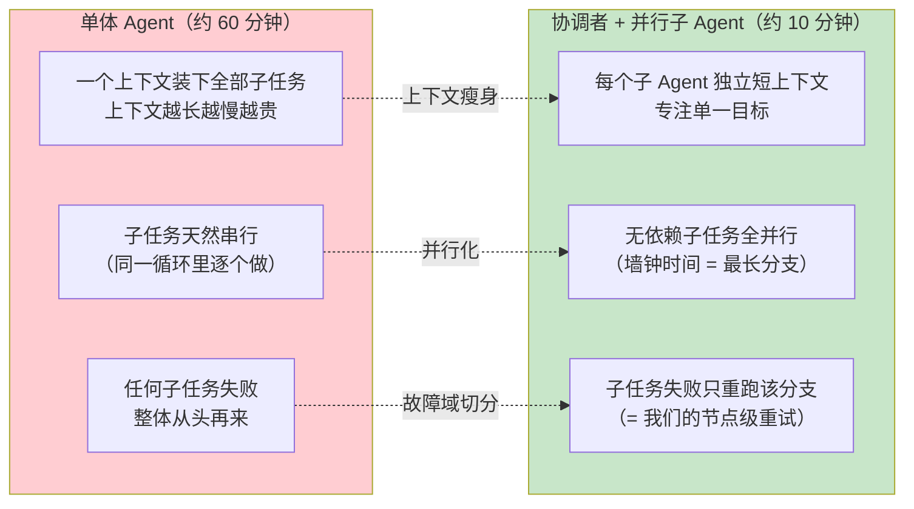
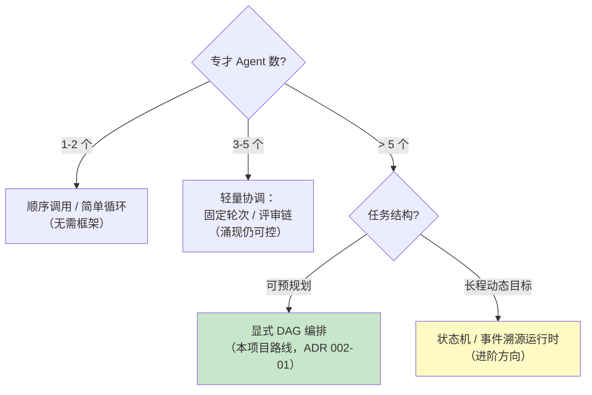
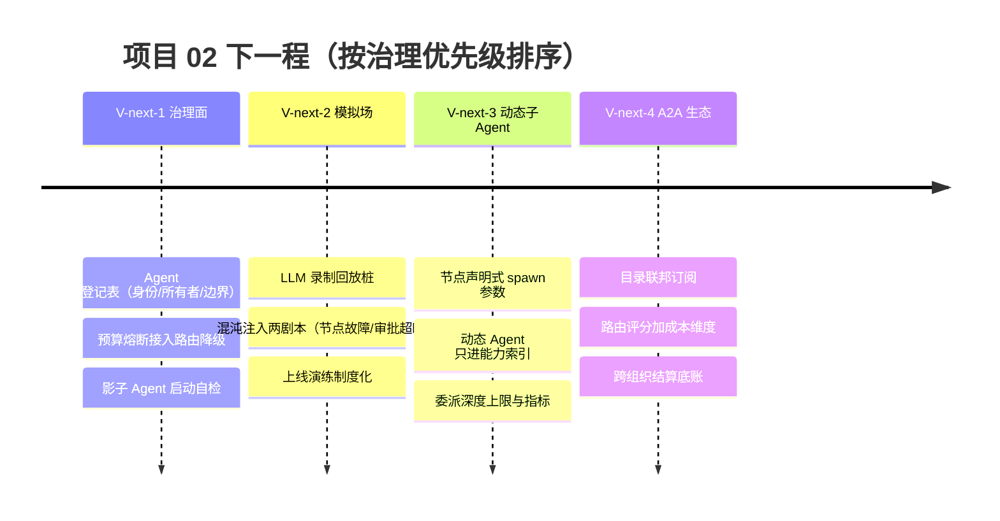

# 项目 02：多 Agent 协作平台 — 10-工业前沿与演进方向

> **定位**：站在 2026 年多 Agent 协作的行业共识上审视项目 02——对照三份一线实践：[Google Agent Bake-Off 五条开发者建议](https://developers.googleblog.com/build-better-ai-agents-5-developer-tips-from-the-agent-bake-off/)（子 Agent 分工 1h→10min、>5 Agent 必须正式协调框架）、[Google 生产级 AI Agent 五篇指南](https://cloud.google.com/blog/topics/developers-practitioners/five-guides-to-building-and-scaling-production-ready-ai-agents)（Agent 级治理、A2A 互操作）、[Nebius Agents Blueprint](https://nebius.com/blog/posts/introducing-the-nebius-agents-blueprint)（Agent 失败是系统失败、模拟先行）。逐项对照本平台找缺口、给出演进方向与下一程路线，并**为项目 02 收官**。

> **读者画像**：已完成 00-09 全部文档、想把这个多 Agent 平台继续向生产纵深推进的读者，以及想了解多 Agent 协作走向的架构师。

> **前置阅读**：[09-ADR架构决策记录](09-ADR架构决策记录.md)（本文的"现状"均以 ADR 编号引用）。

> **来源声明**：本文引用均为真实外部资料，已标注链接；对来源内容的转述以原文为准，本文只做与本平台相关的映射与推演。

---

## 1. 四问

| 问 | 答 |
|----|----|
| **新增了什么需求** | 项目收官前必须回答两个问题：2026 年行业在多 Agent 协作上走到了哪里？本平台对照行业还缺什么、下一程往哪走？——这是平台"能跑"之后的方向性需求 |
| **影响了哪些模块** | 无代码改动——产出认知与路线：五大前沿方向对照（F1-F5）、V-next-1~4 演进路线（治理面 → 模拟场 → 动态子 Agent → A2A 生态），供后续迭代立项 |
| **架构如何演进** | 本文不演进实现，演进**坐标系**——把平台放回行业实践（Bake-Off / Google / Nebius）中重新定位：显式编排与并行已是地基，Agent 级治理与模拟先行是缺口 |
| **上一版痛点是什么** | 09 沉淀了"过去为什么这么定"，但没有回答"未来去哪里"；平台指标全部闭环（00 目标 → 06/08 验收）之后，缺少外部对照来发现盲区 |

### 1.1 本节核对（四问）

一句话核对："无代码改动"声明成立（本文纯认知/路线产出）；"上一版痛点"指向 09 篇只答过去不答未来，与本文定位一致。

---

## 2. 调研结论：三份来源的共识

三份来源视角不同——Bake-Off 是一场**工程竞赛**的复盘、Google 五篇指南是**平台方**的生产经验、Nebius Blueprint 是**推理服务商**的架构主张——但指向同一组结论：

1. **子 Agent 专才分工 + 并行，是最大的性能杠杆**（[Bake-Off](https://developers.googleblog.com/build-better-ai-agents-5-developer-tips-from-the-agent-bake-off/)）：优胜团队用"一个协调者 + 多个并行专才子 Agent"替代单体 Agent，把约 1 小时的任务压到约 10 分钟——不是换了更贵的模型，是**换了协作结构**。
2. **超过约 5 个专才 Agent，必须上正式协调框架**（同上）：小团队可以靠涌现式协作（swarm/自由对话），规模化后涌现 = 不可预测——要显式编排、明确状态与移交。这与我们 [ADR 002-01] 选 DAG 拒"主管随意委派"的判断完全一致。
3. **Agent 失败是系统失败，不是模型失败**（[Nebius](https://nebius.com/blog/posts/introducing-the-nebius-agents-blueprint/)）：单环节 95% 成功率，十个串联环节的整体成功率只剩约 60%——多 Agent 系统的杠杆在编排、检索与评估，不在无脑换更大的模型。
4. **Agent 是要治理的运维对象**（[Google](https://cloud.google.com/blog/topics/developers-practitioners/five-guides-to-building-and-scaling-production-ready-ai-agents)）：每个 Agent 要有身份、登记、所有者、数据与工具边界——防"影子 Agent"失控。
5. **模拟先行（simulate first）**（Google / Nebius）：Agent 系统改动上线前先在模拟环境跑评估——这与我们 [08] 的金标回归闸门方向一致，但行业走得更远：整条链路的模拟与故障注入。

对照本平台：结论 1、2 我们已在地基里（DAG 显式编排 + `flatMap` 并行 + 08 的并行度实验）；结论 3 部分覆盖（06 失败三级化、08 评估面）；**结论 4、5 是当前最大的两个缺口**——Agent 级治理与模拟先行。

### 2.1 本节核对（来源与结论对应）

| # | 核对项 | PASS 判据 |
|---|--------|----------|
| 1 | 五条结论 | 每条都标注了来源链接；关键数字（1h→10min、>5 Agent、95%^10≈60%）均可回溯到来源原文 |
| 2 | 本平台映射 | 结论 1/2/3 引用的 ADR 编号（002-01/002-09 等）真实存在且口径一致；"结论 4/5 是缺口"与 §3 对照表一致 |

---

## 3. 前沿对照表（五大方向）

| # | 前沿方向 | 来源 | 本平台现状 | 演进方向 |
|---|---------|------|-----------|---------|
| F1 | 子 Agent 专才分工 + 并行（1h→10min） | [Bake-Off](https://developers.googleblog.com/build-better-ai-agents-5-developer-tips-from-the-agent-bake-off/) | 并行调度与并行度实验已有（[ADR 002-09]、[08 §6]）；但 Agent 粒度是"职业"级静态注册 | 任务级**动态子 Agent**：按任务特征临时 spawn 专才子 Agent，用完即回收 |
| F2 | 正式协调框架（>5 Agent 必须） | [Bake-Off](https://developers.googleblog.com/build-better-ai-agents-5-developer-tips-from-the-agent-bake-off/) | DAG 显式编排是地基（[ADR 002-01]）；但运行时委派（[ADR 002-20]）不受图约束 | 委派深度上限 + 委派链入事件流与指标（纳入 002-19 评估面） |
| F3 | A2A 生态与跨组织协作 | [Google](https://cloud.google.com/blog/topics/developers-practitioners/five-guides-to-building-and-scaling-production-ready-ai-agents)、[前沿 00-A2A协议] | 07 已落地自研适配层（[ADR 002-18]） | 目录联邦、跨组织结算计量（[前沿 09-Agent经济与支付]） |
| F4 | Agent 级治理（身份/登记/边界/预算） | [Google](https://cloud.google.com/blog/topics/developers-practitioners/five-guides-to-building-and-scaling-production-ready-ai-agents) | 有工具级观测（[ADR 002-05]）与 Token 归因（08），**无 Agent 级治理** | 注册中心升级为治理登记表：身份/所有者/数据边界/预算/配额 |
| F5 | 模拟先行（上线前模拟 + 故障注入） | [Nebius](https://nebius.com/blog/posts/introducing-the-nebius-agents-blueprint/)、[Google](https://cloud.google.com/blog/topics/developers-practitioners/five-guides-to-building-and-scaling-production-ready-ai-agents) | 金标回归闸门已阻断质量劣化（[08 §5]） | 模拟环境全量跑金标 + 混沌注入（节点失败/审批超时/远端 5xx），演练 Saga 与续跑 |

### 3.1 本节核对（对照表完整性）

| # | 核对项 | PASS 判据 |
|---|--------|----------|
| 1 | F1–F5 五行 | 每行四列齐全（方向/来源/现状/演进），现状列引用的 ADR/篇目锚点有效 |
| 2 | 缺口声明 | "结论 4、5 是最大缺口"（§2）与表中 F4/F5 的"现状"列未完成表述一致 |

---

## 4. 五大方向逐一展开

### 4.1 F1：子 Agent 专才化——1 小时到 10 分钟的结构红利

Bake-Off 最广为引用的数字：优胜团队把单体 Agent 改造成"协调者 + 并行专才子 Agent"后，任务耗时从约 1 小时降到约 10 分钟。拆开看，这个收益由三部分构成：

本平台的对应关系：S2、S3 我们从迭代二就有（`flatMap` 并行 + 节点级失败处理）；**S1 是缺口**——我们的 Agent 是 yml 静态注册的"职业"（研究员/翻译官），粒度粗。演进方向：TaskParser 拆解时允许节点声明"子 Agent 生成参数"（角色 Prompt + 工具集 + 一次性 ID），执行时动态构建、用完注销——06 的 SUBTASK 子图 + 07 的远端适配层已把"执行单元可插拔"的地基打好，动态 Agent 是顺理成章的下一步（落地时注意与 [ADR 002-07] 注册中心的交互：动态 Agent 只进能力索引不进持久注册表）。

### 4.2 F2：正式协调框架——涌现的边界在哪里

Bake-Off 的经验值：约 5 个专才 Agent 是涌现式协作的舒适上限，超过就要正式框架。这背后是两个指数：**通信轮次**随 Agent 数超线性增长（n 个 Agent 两两对话的组合爆炸），**不可预测性**随自由度累积。选型判断可以收敛成一棵决策树：

本平台在这棵树上的位置很清晰：**>5 且可预规划 → DAG**，走对了。真正的盲区在 [ADR 002-20] 的运行时委派——它不受图约束，理论上可以链式委派形成"影子编排"。治理动作：委派深度上限（建议 2）、每次委派进事件流与 `orchestrator.delegation.depth` 指标——把影子行为拉进 002-19 评估面的视野。

### 4.3 F3：A2A 生态——从"点对点接入"到"生态位"

07 落地的适配层解决的是"点对点"：我们 ↔ 伙伴。2026 年的 A2A 生态正在长出三层公共设施，本平台的生态位选择：

| 生态层 | 是什么 | 本平台演进 |
|--------|--------|-----------|
| 目录联邦 | 多组织 Agent Card 目录互相转发/聚合 | `AgentCardCatalog` 支持目录订阅上游目录（配置级改动） |
| 能力市场 | 按 Agent Card 检索、比价、试用远端 Agent | 目录抓取增加质量/价格元数据，纳入 [ADR 002-11] 路由评分（成本维度） |
| 结算计量 | 跨组织调用的计量与支付 | `a2a_call_audit` 已有调用明细，演进为计费账单底账（[前沿 09-Agent经济与支付]） |

Google 指南反复强调的配套纪律：**跨组织语义安全**——传统鉴权之外，Agent 间的自然语言载荷要做语义级检查（Prompt 注入经由远端 Agent 的产物回流）。07 的 DLP 出站脱敏是单向的，演进方向是入站产物也过一遍语义检查（[附录 08-Agent安全深度] 的间接注入分类）。

### 4.4 F4：Agent 级治理——把注册中心升级为登记表

Google 五层治理栈（身份徽章 / 登记表 / 语义策略网关 / 行为异常检测 / 安全看板）映射到本平台：

| 治理层 | Google 定义 | 本平台现状 | 演进 |
|--------|------------|-----------|------|
| 身份 | Agent 身份证（ID/版本/所有者） | `AgentDefinition` 有 ID 无所有者 | 加 owner/policy 字段 |
| 登记 | 允许的数据边界/工具清单 | yml 注册 + 07 白名单（仅出站） | 未登记 Agent 禁止上线（启动自检，防影子 Agent） |
| 策略 | 语义策略网关 | 无 | 节点执行前过策略检查（可用 06 的 SpEL 表达式复用） |
| 异常检测 | 行为异常（越权/超预算） | Token 归因有数据（08） | 预算熔断：Agent 级 Token/调用预算超限自动摘除路由候选（[教程 60-成本治理与Token计量]） |
| 看板 | 安全总览 | Grafana 指标面 | 治理视图：预算消耗/越权尝试/影子 Agent 告警 |

其中"预算熔断"是性价比最高的一步：08 的 Token 归因已把数据备齐，缺的只是一个比较器加路由降级钩子——而 [ADR 002-11] 的降级链天然支持"摘除候选"。

### 4.5 F5：模拟先行——从"回归闸门"到"预演场"

08 的金标回归闸门回答的是"改动有没有让质量变差"；行业的"模拟先行"更进一步：**上线前在模拟环境预演整个系统行为**——不只评质量，还演练故障。本平台的模拟层可以搭在现成组件上：

| 模拟对象 | 复用组件 | 模拟手段 |
|---------|---------|---------|
| LLM 响应 | AgentExecutor 接口（[ADR 002-00] 的分层红利） | 录制回放（金标 reference_answer 做确定性桩） |
| 节点故障 | 06 失败三级化 | 故障开关注入：瞬时 503 / 永久失败 / 补偿失败 |
| 审批行为 | 04 审批网关 | 自动审批器（APPROVE/REJECT/超时三模式） |
| 远端 Agent | 07 A2A 适配层 | mock 目录 + 延迟/`input_required` 注入 |

模拟先行的验收标准很朴素：**每一次上线演练都在模拟环境跑过金标 + 混沌两个剧本，且都有量化结果**——这与 Nebius 的"Agent 失败是系统失败"结论闭环：系统失败要在系统级预演中发现，而不是在生产中。

### 4.6 本节核对（展开与对照表一致）

| # | 核对项 | PASS 判据 |
|---|--------|----------|
| 1 | §4.1–§4.5 与 §3 表 F1–F5 | 逐行对应，展开篇的"演进方向"不超出表中口径（可细化不可改向） |
| 2 | 决策树（§4.2） | 本平台位置（>5 且可预规划 → DAG）与 [ADR 002-01] 一致；盲区（002-20 委派不受图约束）有对应治理动作 |
| 3 | 未实证边界 | 动态子 Agent/目录联邦/策略网关均标注为演进方向，未被写成已实现能力 |

---

## 5. 下一程演进路线

排序理由：**治理先行**——没有登记表与预算，动态子 Agent（V-next-3）会让 Agent 数量失控，反而放大风险；模拟场（V-next-2）紧随其后，因为它是后面所有改动的安全网；A2A 生态（V-next-4）放在最后，因为它依赖外部生态成熟度，内部能力先行。

### 5.1 本节核对（路线排序依据）

| # | 核对项 | PASS 判据 |
|---|--------|----------|
| 1 | V-next-1~4 | 四阶段覆盖 §3 表全部演进方向（F4→1、F5→2、F1/F2→3、F3→4），无遗漏无新增 |
| 2 | "治理先行"排序理由 | 能自洽解释（动态化前必须有登记表与预算），与 F4/F5 缺口判断呼应 |

---

## 6. 项目 02 收官

> 本节核对：十一行交付物表的文件名/编号与实际文件一致；"前三项指标在 06/08 验收有量化答案"的声明与 06 §8/08 §9 实测结果行对应。

十一篇文档，从业务场景走到行业前沿：

| 文档 | 交付物 |
|------|--------|
| [00-需求分析与架构设计](00-需求分析与架构设计.md) | 业务场景、量化指标、架构分层、迭代路线 |
| [01-最小Demo搭建](01-最小Demo搭建.md) | Agent 抽象、注册中心接口、单 Agent SSE 对话 |
| [02-单Agent工具链](02-单Agent工具链.md) | `@Tool` 工具链、工具观测装饰器、会话状态 |
| [03-多Agent编排](03-多Agent编排.md) | Redis 注册中心、消息总线、DAG 引擎、任务拆解 |
| [04-任务委派与路由](04-任务委派与路由.md) | 五维评分路由、降级链、DelegationTool、审批网关 |
| [05-核心代码讲解](05-核心代码讲解.md) | 全项目代码地图与设计复盘 |
| [06-DAG工作流编排深化](06-DAG工作流编排深化.md) | 模板版本化灰度、条件分支/循环/子图、Saga 补偿、断点续跑 |
| [07-A2A协议与Agent互操作](07-A2A协议与Agent互操作.md) | Agent Card 发布/发现、跨组织委托、信任边界、MCP/A2A 分工 |
| [08-多Agent评估与调优](08-多Agent评估与调优.md) | 协作指标面、群体反思、金标回归闸门、拓扑实验 |
| [09-ADR架构决策记录](09-ADR架构决策记录.md) | 21 条决策资产 + 依赖图 + 使用纪律 |
| 10-工业前沿与演进方向（本文档） | 行业对照、下一程路线、收官 |

回头看 00 篇开出的指标：任务完成率 ≥95%、路由准确率 ≥90%、并行加速比 ≥3x、可用性 99.9%——前三项在 06/08 的验收里都有了量化答案，"可用性"则在 06 的断点续跑与 Saga 补偿里拿到了它的地基。更重要的是这套演进留下的**方法**：每一版从"上一版痛点"出发（四问）、每一次架构选择留下 ADR、每一项能力配验收标准——这套方法可以复制到任何一个 Agent 系统。

对照 2026 年的行业共识，这个平台交出的答卷是：**显式编排、失败可补偿、崩溃可续跑、质量可回归、边界可信任**；下一程的题目也已经写好：治理、模拟、动态化、生态化。

**项目 02 到此收官。** 带着这套多 Agent 协作的完整工程经验，你可以继续在文档体系中选择任何一个新项目开始——每个项目独立成篇，互不依赖。
