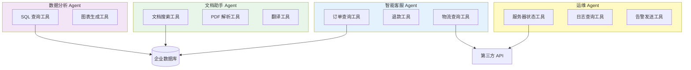
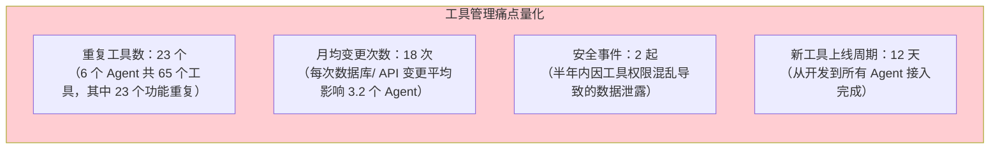
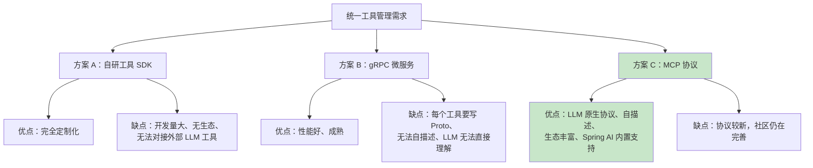
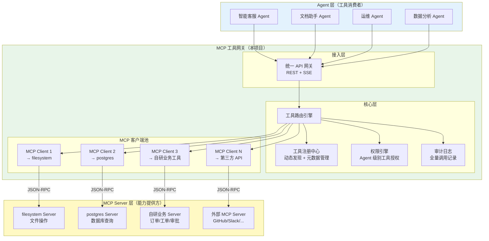
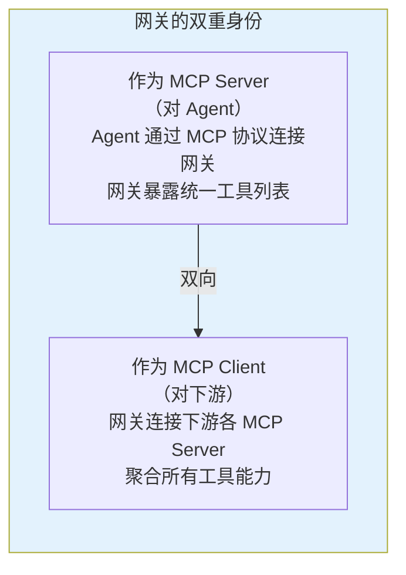
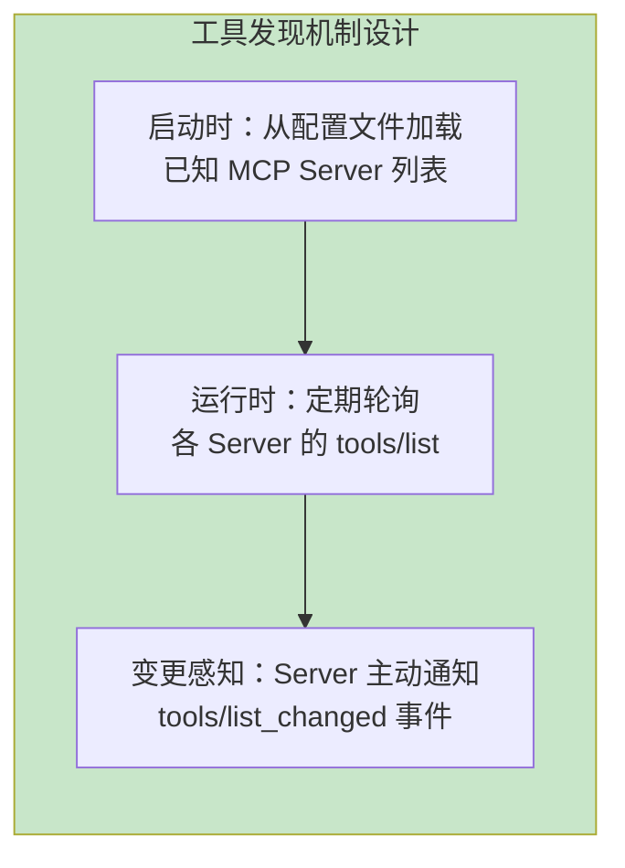
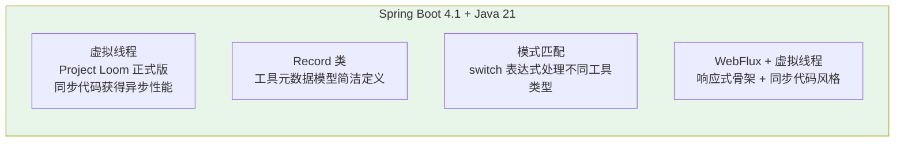
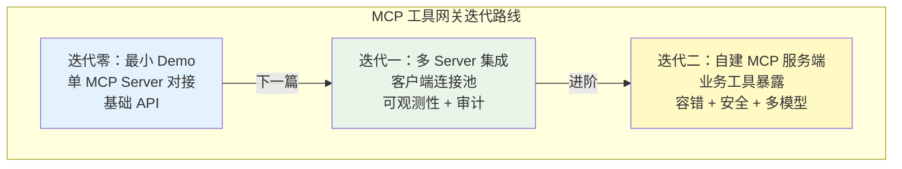
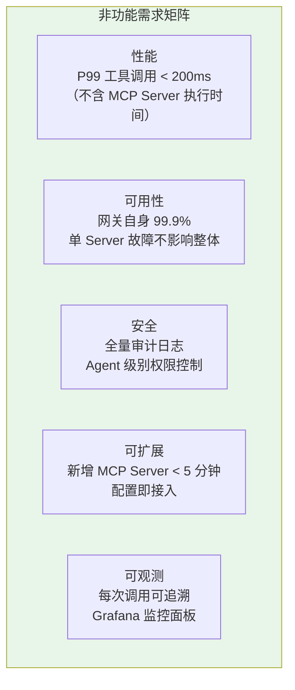
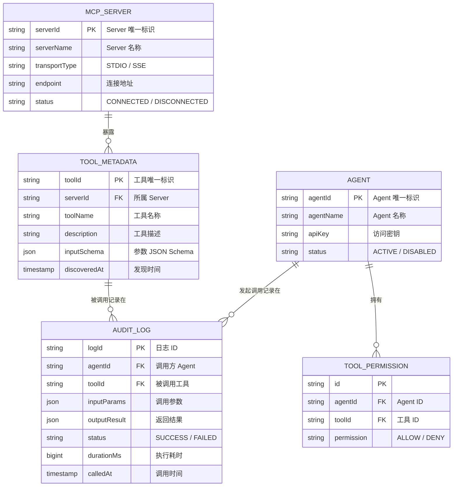

# 00-需求分析与架构设计

> **定位**：从企业真实痛点出发，完整推演一个基于 MCP 协议的统一工具网关项目的需求分析、架构设计与技术选型。这篇文档不写一行实现代码，而是回答"为什么做、做什么、怎么做"三个根本问题，为后续四篇迭代文档奠定地基。
>
> **读者画像**：架构师、技术负责人、需要从零规划工具中台的全栈开发者。
>
> **前置阅读**：[教程 10-MCP 协议](../../教程/10-MCP协议.md)、[教程 03-工具调用](../../教程/03-工具调用.md)。

---

## 1. 业务背景：工具管理的混乱现状

### 1.1 问题起源

某中型科技公司内部有 6 个 AI Agent 应用：智能客服、文档助手、代码审查机器人、运维巡检 Agent、数据分析助手、HR 智能问答。每个 Agent 各自维护自己的工具集：



这张图暴露了三个核心问题：

| 问题 | 表现 | 影响 |
|------|------|------|
| **工具重复建设** | 订单查询工具在客服 Agent 和数据 Agent 中各写了一遍 | 开发成本翻倍，维护成本翻倍 |
| **安全管控缺失** | 每个 Agent 直接连数据库，权限各自管理 | 无法统一审计，安全漏洞风险高 |
| **变更成本高** | 数据库换了密码，需要改 4 个 Agent 的代码 | 协调成本高，容易遗漏 |

### 1.2 痛点量化

经过一个月的调研，问题被量化为以下数据：



管理层下达了明确目标：**建设统一工具管理平台，让工具一次开发、处处可用、集中管控**。

---

## 2. 项目定位：基于 MCP 的统一工具网关

### 2.1 为什么选择 MCP 协议

在技术选型阶段，团队评估了三种方案：



最终选择 MCP 协议，核心理由有三：

1. **LLM 原生**：MCP 的工具定义直接包含 `name`、`description`、`inputSchema`，LLM 无需额外适配就能理解工具能力。这比 gRPC 需要额外写工具描述文件高效得多。

2. **自描述发现**：MCP Server 通过 `tools/list` 自动暴露工具清单，新工具上线后网关零配置即可发现——这是统一工具管理的核心前提。

3. **生态复用**：社区已有 filesystem、github、postgres 等数十个官方/社区 MCP Server，可以直接接入网关，无需重复造轮子。

> **深入理解 MCP 协议的全貌** → [教程 10-MCP 协议](../../教程/10-MCP协议.md)：该教程详细讲解了 MCP 的 Host/Client/Server 三层架构、JSON-RPC 2.0 通信协议、stdio 与 SSE 两种传输方式，以及 MCP 与传统 Tool Calling 的本质区别。

### 2.2 项目定位声明

> **MCP 工具网关**是企业级统一工具管理中间件。它向下对接各类 MCP Server（文件系统、数据库、第三方 API、自研业务工具），向上为所有 AI Agent 提供统一的工具发现、调用、审计入口。Agent 不再直接管理工具，而是通过网关按需获取工具能力。

一句话定位：**工具的网关入口，Agent 的能力超市**。

---

## 3. 整体架构设计

### 3.1 架构全景图



### 3.2 分层职责

| 层次 | 职责 | 关键组件 |
|------|------|---------|
| **接入层** | 对 Agent 暴露统一 API，接收工具调用请求 | REST Controller + SSE 流式端点 |
| **核心层** | 工具路由、权限校验、元数据管理、审计记录 | ToolRouter、RegistryService、AuthEngine、AuditService |
| **客户端层** | 管理与各 MCP Server 的连接池，转发调用 | MCP Client Pool（动态创建/销毁连接） |
| **Server 层** | 实际工具能力提供方（不属于本项目，但需要对接） | 各类 MCP Server 进程 |

### 3.3 核心设计决策

**决策一：网关是 MCP Client 还是 MCP Server？**

网关同时扮演两个角色：



这种设计让 Agent 侧只需一个 MCP 连接（连到网关），就能访问所有工具——无需感知下游有多少个 MCP Server。

**决策二：同步还是异步？**

选择 WebFlux 响应式栈，原因如下：

| 考量 | 同步阻塞（MVC） | 异步响应式（WebFlux） | 决策 |
|------|----------------|---------------------|------|
| MCP Server 调用延迟 | 线程阻塞等待 | 非阻塞 | WebFlux |
| 并发工具调用 | 线程池限制 | Event Loop 少线程高并发 | WebFlux |
| SSE 流式输出 | 需要 AsyncContext | 原生 Flux 支持 | WebFlux |
| 开发复杂度 | 低 | 中 | MVC 有优势 |

综合性能需求和 SSE 原生支持，选择 WebFlux。项目使用 Java 21 虚拟线程（Virtual Thread）进一步降低响应式编程的复杂性——在需要阻塞操作的场景中，虚拟线程让代码保持同步写法但获得异步性能。

**决策三：工具发现机制——静态配置还是动态注册？**



采用三层发现机制：配置加载 + 定期轮询 + 事件通知，确保工具列表实时准确。

---

## 4. 技术选型

### 4.1 技术栈总览

| 层面 | 技术选型 | 版本 | 选型理由 |
|------|---------|------|---------|
| **框架** | Spring Boot | 4.1 | 最新 LTS，虚拟线程原生支持 |
| **AI 框架** | Spring AI | 2.0.0 | 内置 MCP Client/Server 支持 |
| **Web** | Spring WebFlux | 随 Boot | 响应式、SSE 原生支持 |
| **JDK** | Java | 21 | 虚拟线程、模式匹配、Record |
| **MCP SDK** | Spring AI MCP | 2.0.0 | 官方实现，与 Spring AI 深度集成 |
| **可观测** | Micrometer + OTel | 随 Boot | 全链路追踪 |
| **持久化** | H2（开发）/ PostgreSQL（生产） | - | 审计日志存储 |
| **配置** | application.yml + Nacos | - | 多环境配置管理 |

### 4.2 Spring Boot 4.1 + Java 21 的关键优势



Java 21 虚拟线程是选择 Spring Boot 4.1 的核心驱动力。在 MCP 工具网关场景中，大量 IO 密集操作（JSON-RPC 调用、数据库查询、HTTP 请求）非常适合虚拟线程模型——开发者写同步代码，JVM 自动调度到虚拟线程上，一个普通笔记本能轻松处理数万并发连接。

### 4.3 依赖清单

```xml
<!-- pom.xml 核心依赖 -->
<parent>
    <groupId>org.springframework.boot</groupId>
    <artifactId>spring-boot-starter-parent</artifactId>
    <version>4.1.0</version>
</parent>

<properties>
    <java.version>21</java.version>
    <spring-ai.version>2.0.0</spring-ai.version>
</properties>

<dependencies>
    <!-- WebFlux 响应式 Web 框架 -->
    <dependency>
        <groupId>org.springframework.boot</groupId>
        <artifactId>spring-boot-starter-webflux</artifactId>
    </dependency>

    <!-- Spring AI MCP 客户端（连接下游 MCP Server） -->
    <dependency>
        <groupId>org.springframework.ai</groupId>
        <artifactId>spring-ai-mcp-client-spring-boot-starter</artifactId>
    </dependency>

    <!-- Spring AI MCP 服务端（对 Agent 暴露工具） -->
    <dependency>
        <groupId>org.springframework.ai</groupId>
        <artifactId>spring-ai-mcp-server-spring-boot-starter</artifactId>
    </dependency>

    <!-- 可观测性 -->
    <dependency>
        <groupId>org.springframework.boot</groupId>
        <artifactId>spring-boot-starter-actuator</artifactId>
    </dependency>
    <dependency>
        <groupId>io.micrometer</groupId>
        <artifactId>micrometer-tracing-bridge-otel</artifactId>
    </dependency>

    <!-- 审计日志持久化 -->
    <dependency>
        <groupId>org.springframework.boot</groupId>
        <artifactId>spring-boot-starter-data-jpa</artifactId>
    </dependency>
</dependencies>
```

---

## 5. 项目结构规划

### 5.1 模块划分

```mermaid
graph TB
    subgraph 项目结构["mcp-tool-gateway 项目结构"]
        ROOT["mcp-tool-gateway/"]

        subgraph gateway["gateway-core（网关核心）"]
            G1["api/<br/>REST + SSE 接口"]
            G2["router/<br/>工具路由引擎"]
            G3["registry/<br/>工具注册中心"]
            G4["auth/<br/>权限引擎"]
            G5["audit/<br/>审计服务"]
        end

        subgraph client["mcp-client-pool（客户端池）"]
            C1["pool/<br/>MCP Client 生命周期管理"]
            C2["health/<br/>Server 健康检查"]
            C3["discovery/<br/>工具动态发现"]
        end

        subgraph server["mcp-server-endpoint（服务端端点）"]
            S1["endpoint/<br/>对 Agent 暴露 MCP 接口"]
            S2["aggregator/<br/>工具列表聚合器"]
        end

        subphase common["common（公共模块）"]
            CM1["model/<br/>DTO 和领域模型"]
            CM2["config/<br/>配置类"]
            CM3["exception/<br/>统一异常处理"]
        end
    end

    ROOT --> gateway
    ROOT --> client
    ROOT --> server
    ROOT --> common

    style 项目结构 fill:#e3f2fd
```

### 5.2 目录结构

```
mcp-tool-gateway/
├── pom.xml
├── src/main/java/com/example/mcp/gateway/
│   ├── McpGatewayApplication.java
│   ├── api/                          # 对 Agent 暴露的 REST API
│   │   ├── ToolGatewayController.java
│   │   └── SseGatewayController.java
│   ├── router/                       # 工具路由引擎
│   │   ├── ToolRouter.java
│   │   └── RoutingStrategy.java
│   ├── registry/                     # 工具注册中心
│   │   ├── ToolRegistry.java
│   │   ├── ToolMetadata.java
│   │   └── ToolDiscoveryService.java
│   ├── pool/                         # MCP Client 连接池
│   │   ├── McpClientPool.java
│   │   ├── McpClientFactory.java
│   │   └── HealthChecker.java
│   ├── auth/                         # 权限引擎
│   │   ├── AuthEngine.java
│   │   └── ToolPermission.java
│   ├── audit/                        # 审计服务
│   │   ├── AuditService.java
│   │   ├── AuditLog.java
│   │   └── AuditRepository.java
│   ├── config/                       # 配置类
│   │   ├── GatewayProperties.java
│   │   ├── McpClientConfig.java
│   │   └── ObservationConfig.java
│   └── exception/                    # 统一异常处理
│       ├── GatewayException.java
│       └── GlobalExceptionHandler.java
├── src/main/resources/
│   ├── application.yml
│   └── mcp-servers.json              # 下游 MCP Server 配置
└── src/test/java/
    └── com/example/mcp/gateway/
        ├── router/
        ├── registry/
        └── integration/
```

---

## 6. 迭代规划

整个项目分三个迭代，逐步从最小 Demo 演进到生产级网关。



### 6.1 迭代目标矩阵

| 迭代 | 核心目标 | 关键交付物 | 对应文档 |
|------|---------|-----------|---------|
| **迭代零** | 验证 MCP 协议可行性 | 单 Server 对接 + 基础查询 API | [01-最小 Demo 搭建](01-最小Demo搭建.md) |
| **迭代一** | 多 Server 统一管理 | Client Pool + Registry + 审计 | [02-迭代一-MCP 客户端集成](02-迭代一-MCP客户端集成.md) |
| **迭代二** | 自建工具能力暴露 | 自建 MCP Server + 容错 + 安全 | [03-迭代二-自定义 MCP 服务端](03-迭代二-自定义MCP服务端.md) |

### 6.2 非功能需求



---

## 7. 关键风险与应对

### 7.1 技术风险

| 风险 | 概率 | 影响 | 应对方案 |
|------|------|------|---------|
| MCP 协议版本变更 | 中 | 高 | 网关层做版本适配抽象，锁定 Spring AI MCP SDK 版本 |
| 下游 Server 不稳定 | 高 | 中 | 熔断 + 降级 + 健康检查（迭代二实现） |
| 工具名称冲突 | 中 | 低 | Registry 做命名空间隔离（`serverName.toolName`） |
| 网关成为单点 | 中 | 高 | 网关无状态化设计，支持水平扩展 |

### 7.2 安全风险

MCP 工具网关集中管理了所有工具的调用入口，安全风险需要特别关注。这部分将在迭代二中详细展开，核心思路是参考 [教程 25-安全与权限控制](../../教程/25-安全与权限控制.md) 中的 Agent 安全三道防线模型，在网关层实现统一的输入校验、权限控制和审计追溯。

> **安全架构深入** → [教程 25-安全与权限控制](../../教程/25-安全与权限控制.md)：讲解了 Agent 安全的输入安全（Prompt 注入防护）、执行安全（工具权限控制）、输出安全（内容过滤）三道防线体系。

---

## 8. 数据模型设计

### 8.1 核心实体关系



### 8.2 关键设计说明

- **ToolMetadata** 使用 JSON Schema 存储工具参数定义，这直接来自 MCP Server 的 `tools/list` 响应，无需额外转换。
- **AuditLog** 记录全量调用信息（参数 + 结果），支持事后回溯和安全审计。在高吞吐场景下，审计日志走异步队列写入，不阻塞主调用链。
- **ToolPermission** 采用白名单模式：默认拒绝，显式授权后才允许调用。

---

## 9. 总结

本文从企业工具管理的真实痛点出发，完整推演了 MCP 工具网关项目的需求分析和架构设计：

1. **痛点清晰**：6 个 Agent、65 个工具、23 个重复——工具重复建设、安全管控缺失、变更成本高三重痛点驱动了统一工具平台的建设需求。

2. **选型合理**：MCP 协议凭借 LLM 原生、自描述发现、生态丰富三大优势，击败自研 SDK 和 gRPC 方案。Spring Boot 4.1 + Java 21 + WebFlux + Spring AI 2.0 构成完整技术栈。

3. **架构分层**：接入层（API 网关）→ 核心层（路由/注册/权限/审计）→ 客户端层（MCP Client 池）→ Server 层（能力提供方），四层分明、职责清晰。

4. **迭代务实**：三个迭代从最小 Demo 到多 Server 集成再到自建服务端，逐步叠加可观测性、容错、安全能力，每一步都可独立交付价值。

下一篇 [01-最小 Demo 搭建](01-最小Demo搭建.md) 将开始动手实践，搭建项目骨架并完成第一个 MCP Server 的对接。
