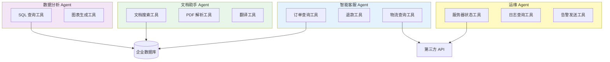
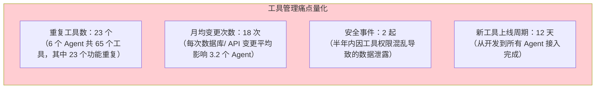
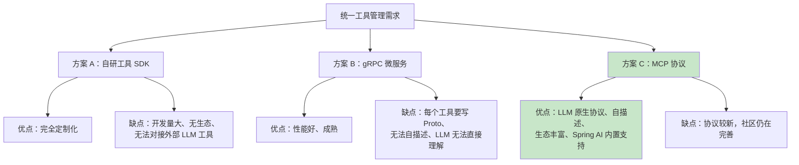
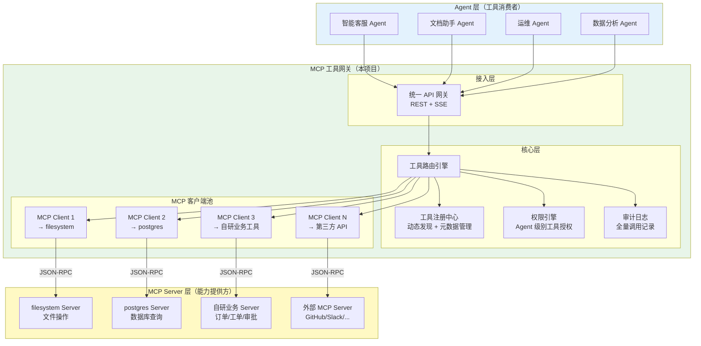
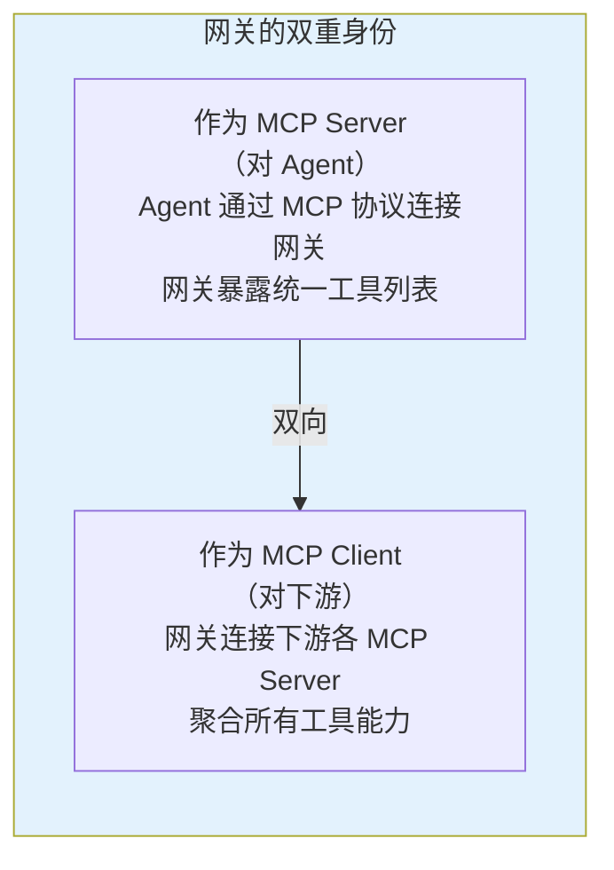
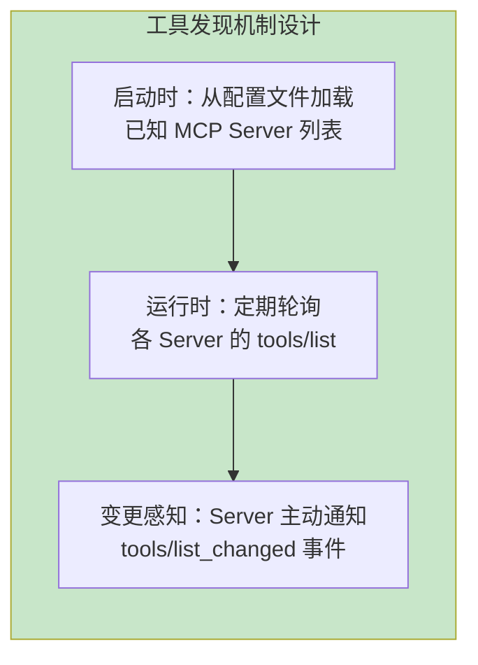
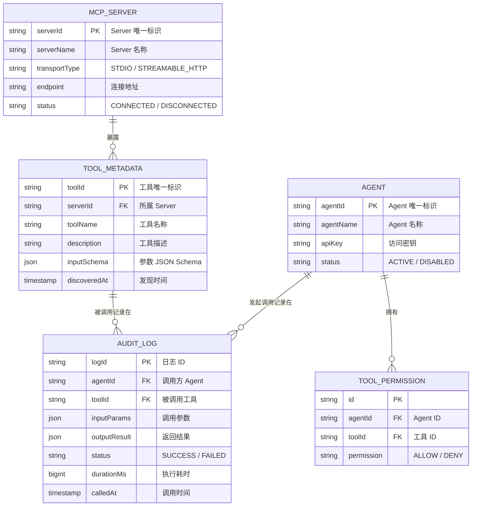
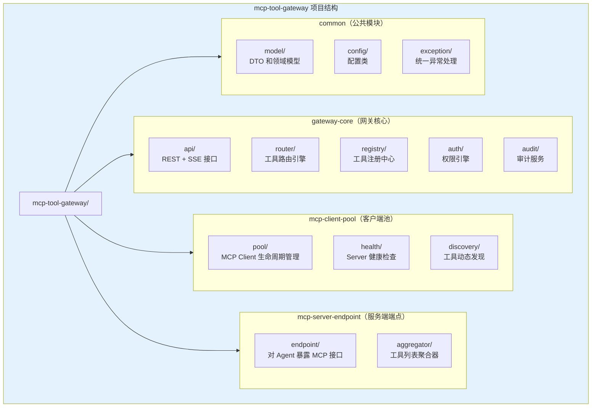
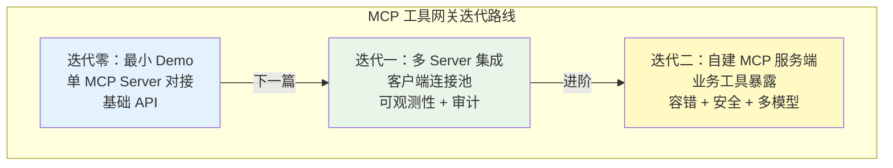
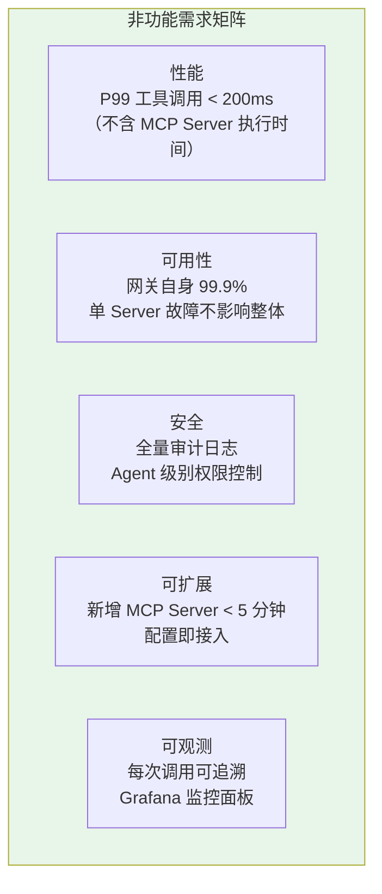

# 00-需求分析与架构设计

> **定位**：从企业真实痛点出发，完整推演一个基于 MCP 协议的统一工具网关项目的需求分析、架构设计与技术选型。这篇文档不写具体迭代实现，而是回答"为什么做、做什么、怎么做"三个根本问题，并给出**完整可手写的工程蓝图**——最终版 `pom.xml`、`application.yml`、数据模型 SQL DDL，为后续四篇迭代文档奠定地基。
>
> **读者画像**：架构师、技术负责人、需要从零规划工具中台的全栈开发者。
>
> **前置阅读**：[教程 20-MCP协议](../../教程/20-MCP协议.md)、[教程 03-工具调用](../../教程/03-工具调用.md)。API 真实性以 [附录 05-SpringAI2-API基准](../../附录/05-SpringAI2-API基准/01-MCP真实API与坐标.md) 为准。

---

---

## ★ 阅读顺序总览（序号 = 你的实际阅读顺序）

> 本子文件夹 10 个文件，**文件名编号 00-09 即阅读顺序**：

| 阶段 | 文件 | 读者定位 |
|------|------|---------|
| ① 全貌 | 00-需求分析与架构设计 | **先读**：业务背景/双面网关架构/技术选型/数据模型/迭代规划 |
| ② 起步 | 01-最小Demo搭建 | **动手**：单 Server 连通跑通 |
| ③ 主体迭代 | 02~04（客户端集成/自定义服务端/核心讲解） | **顺序读**：客户端连接池→服务端暴露→代码全景复盘 |
| ④ 进阶迭代 | 05~07（Streamable HTTP+OAuth / 市场计费 / 联邦路由） | **进阶**：协议现行→商业层→多集群 |
| ⑤ 决策资产 | 08-ADR架构决策记录 | **按需查阅**：11 条决策 DNA（改架构前先查） |
| ⑥ 前沿收官 | 09-工业前沿与演进方向 | **收官**：2026 校准 + v6-v8 演进 |


## 1. 业务背景：工具管理的混乱现状

### 1.1 问题起源

某中型科技公司内部有 6 个 AI Agent 应用：智能客服、文档助手、代码审查机器人、运维巡检 Agent、数据分析助手、HR 智能问答。每个 Agent 各自维护自己的工具集：



这张图暴露了三个核心问题：

| 问题 | 表现 | 影响 |
|------|------|------|
| **工具重复建设** | 订单查询工具在客服 Agent 和数据 Agent 中各写了一遍 | 开发成本翻倍，维护成本翻倍 |
| **安全管控缺失** | 每个 Agent 直接连数据库，权限各自管理 | 无法统一审计，安全漏洞风险高 |
| **变更成本高** | 数据库换了密码，需要改 4 个 Agent 的代码 | 协调成本高，容易遗漏 |

### 1.2 痛点量化

经过一个月的调研，问题被量化为以下数据：



管理层下达了明确目标：**建设统一工具管理平台，让工具一次开发、处处可用、集中管控**。

### 1.3 本节核对（业务背景与痛点量化）

- [ ] 三类痛点（重复建设/安全管控缺失/变更成本高）均能在现状图中找到对应事实
- [ ] 量化数据（23 重复工具 / 月均 18 次变更 / 2 起安全事件 / 12 天上线周期）与立项报告口径一致
- [ ] "一次开发、处处可用、集中管控"目标能覆盖全部三类痛点

---

## 2. 项目定位：基于 MCP 的统一工具网关

### 2.1 为什么选择 MCP 协议

在技术选型阶段，团队评估了三种方案：



最终选择 MCP 协议，核心理由有三：

1. **LLM 原生**：MCP 的工具定义直接包含 `name`、`description`、`inputSchema`，LLM 无需额外适配就能理解工具能力。这比 gRPC 需要额外写工具描述文件高效得多。

2. **自描述发现**：MCP Server 通过 `tools/list` 自动暴露工具清单，新工具上线后网关零配置即可发现——这是统一工具管理的核心前提。

3. **生态复用**：社区已有 filesystem、github、postgres 等数十个官方/社区 MCP Server，可以直接接入网关，无需重复造轮子。

> **深入理解 MCP 协议的全貌** → [教程 20-MCP协议](../../教程/20-MCP协议.md)：该教程详细讲解了 MCP 的 Host/Client/Server 三层架构、JSON-RPC 2.0 通信协议、stdio 与 Streamable HTTP 两种传输方式，以及 MCP 与传统 Tool Calling 的本质区别。

### 2.2 项目定位声明

> **MCP 工具网关**是企业级统一工具管理中间件。它向下对接各类 MCP Server（文件系统、数据库、第三方 API、自研业务工具），向上为所有 AI Agent 提供统一的工具发现、调用、审计入口。Agent 不再直接管理工具，而是通过网关按需获取工具能力。

一句话定位：**工具的网关入口，Agent 的能力超市**。

### 2.3 本节核对（MCP 选型理由）

- [ ] 三条选型理由（LLM 原生 / 自描述发现 / 生态复用）各自能对应 §1 的痛点（变更成本 / 零配置接入 / 重复建设）
- [ ] 自研 SDK 与 gRPC 两个落选方案的缺点表述与决策图一致，无遗漏关键缺点
- [ ] "协议较新，社区仍在完善"这一已知缺点已在 §9 风险表登记

---

## 3. 整体架构设计

### 3.1 架构全景图



### 3.2 分层职责

| 层次 | 职责 | 关键组件 |
|------|------|---------|
| **接入层** | 对 Agent 暴露统一 API，接收工具调用请求 | REST Controller + SSE 流式端点 |
| **核心层** | 工具路由、权限校验、元数据管理、审计记录 | ToolRouter、RegistryService、AuthEngine、AuditService |
| **客户端层** | 管理与各 MCP Server 的连接池，转发调用 | MCP Client Pool（动态创建/销毁连接） |
| **Server 层** | 实际工具能力提供方（自建部分在迭代二落地） | 各类 MCP Server 进程 |

### 3.3 核心设计决策

**决策一：网关是 MCP Client 还是 MCP Server？**

网关同时扮演两个角色：



这种设计让 Agent 侧只需一个 MCP 连接（连到网关），就能访问所有工具——无需感知下游有多少个 MCP Server。

**决策二：同步还是异步？**

选择 WebFlux 响应式栈 + Java 21 虚拟线程，原因如下：

| 考量 | 同步阻塞（MVC） | 异步响应式（WebFlux） | 决策 |
|------|----------------|---------------------|------|
| MCP Server 调用延迟 | 线程阻塞等待 | 非阻塞 | WebFlux |
| 并发工具调用 | 线程池限制 | Event Loop 少线程高并发 | WebFlux |
| SSE 流式输出 | 需要 AsyncContext | 原生 Flux 支持 | WebFlux |
| 开发复杂度 | 低 | 中 | 虚拟线程兜底 |

> ⚠ WebFlux 铁律（CLAUDE.md）：禁止在 EventLoop 上 block/Thread.sleep。本项目通过 `server.threads.virtual.enabled=true` 让 HTTP 请求跑在虚拟线程上，`McpSyncClient` 的阻塞调用发生在虚拟线程而非 EventLoop 上——同步写法 + 异步性能。

**决策三：工具发现机制——静态配置还是动态注册？**



采用三层发现机制：配置加载 + 定期轮询 + 事件通知，确保工具列表实时准确（迭代一落地前两层）。

### 3.4 本节核对（架构分层与三大决策）

- [ ] 四层职责表与架构全景图一一对应（接入/核心/客户端/Server 层各有图中节点）
- [ ] 双重身份（对 Agent 是 Server、对下游是 Client）在全景图中有对应体现
- [ ] WebFlux + 虚拟线程决策未违反铁律（阻塞调用跑在虚拟线程，不在 EventLoop 上 block）
- [ ] 三层发现机制中标注了迭代落地范围（迭代一落地前两层）

---

## 4. 技术选型与工程蓝图

### 4.1 技术栈总览

| 层面 | 技术选型 | 版本 | 选型理由 |
|------|---------|------|---------|
| **框架** | Spring Boot | 4.1 | 最新 LTS，虚拟线程原生支持 |
| **AI 框架** | Spring AI | 2.0.0 | 内置 MCP Client/Server 支持 |
| **Web** | Spring WebFlux | 随 Boot | 响应式、SSE 原生支持 |
| **JDK** | Java | 21 | 虚拟线程、模式匹配、Record |
| **MCP 客户端** | `spring-ai-starter-mcp-client` | 2.0.0 | 官方实现，与 Spring AI 深度集成 |
| **MCP 服务端** | `spring-ai-starter-mcp-server-webflux` | 2.0.0 | 自建工具暴露（迭代二） |
| **可观测** | Micrometer + Prometheus | 随 Boot | 全链路追踪与指标 |
| **持久化** | H2（开发）/ PostgreSQL（生产） | - | 审计日志与元数据存储 |
| **容错** | Resilience4j | 2.2.0 | 熔断 + 重试 + 降级（迭代二） |

### 4.2 完整 `pom.xml`（可手写，最终版）

> 演进式说明：迭代零只需 webflux + mcp-client + actuator；迭代一加 data-jpa/h2/prometheus；迭代二加 mcp-server-webflux/resilience4j。下面给出最终全量版，注释标注所属迭代。

```xml
<?xml version="1.0" encoding="UTF-8"?>
<project xmlns="http://maven.apache.org/POM/4.0.0"
         xmlns:xsi="http://www.w3.org/2001/XMLSchema-instance"
         xsi:schemaLocation="http://maven.apache.org/POM/4.0.0
         https://maven.apache.org/xsd/maven-4.0.0.xsd">
    <modelVersion>4.0.0</modelVersion>

    <parent>
        <groupId>org.springframework.boot</groupId>
        <artifactId>spring-boot-starter-parent</artifactId>
        <version>4.1.0</version>
        <relativePath/>
    </parent>

    <groupId>com.example</groupId>
    <artifactId>mcp-tool-gateway</artifactId>
    <version>0.1.0</version>
    <name>mcp-tool-gateway</name>
    <description>MCP Unified Tool Gateway</description>

    <properties>
        <java.version>21</java.version>
        <spring-ai.version>2.0.0</spring-ai.version>
        <resilience4j.version>2.2.0</resilience4j.version>
    </properties>

    <dependencyManagement>
        <dependencies>
            <dependency>
                <groupId>org.springframework.ai</groupId>
                <artifactId>spring-ai-bom</artifactId>
                <version>${spring-ai.version}</version>
                <type>pom</type>
                <scope>import</scope>
            </dependency>
        </dependencies>
    </dependencyManagement>

    <dependencies>
        <!-- 基础：响应式 Web 框架（迭代零） -->
        <dependency>
            <groupId>org.springframework.boot</groupId>
            <artifactId>spring-boot-starter-webflux</artifactId>
        </dependency>

        <!-- MCP 客户端：连接下游 MCP Server（迭代零，真实坐标附录 05-01） -->
        <dependency>
            <groupId>org.springframework.ai</groupId>
            <artifactId>spring-ai-starter-mcp-client</artifactId>
        </dependency>

        <!-- MCP 服务端（WebFlux 变体）：暴露自研工具（迭代二） -->
        <dependency>
            <groupId>org.springframework.ai</groupId>
            <artifactId>spring-ai-starter-mcp-server-webflux</artifactId>
        </dependency>

        <!-- Actuator + Prometheus：健康检查与指标（迭代零/一） -->
        <dependency>
            <groupId>org.springframework.boot</groupId>
            <artifactId>spring-boot-starter-actuator</artifactId>
        </dependency>
        <dependency>
            <groupId>io.micrometer</groupId>
            <artifactId>micrometer-registry-prometheus</artifactId>
        </dependency>

        <!-- JPA + H2：审计日志持久化（迭代一） -->
        <dependency>
            <groupId>org.springframework.boot</groupId>
            <artifactId>spring-boot-starter-data-jpa</artifactId>
        </dependency>
        <dependency>
            <groupId>com.h2database</groupId>
            <artifactId>h2</artifactId>
            <scope>runtime</scope>
        </dependency>

        <!-- 容错：熔断 + 重试 + 降级（迭代二） -->
        <dependency>
            <groupId>io.github.resilience4j</groupId>
            <artifactId>resilience4j-spring-boot3</artifactId>
            <version>${resilience4j.version}</version>
        </dependency>

        <!-- 配置元数据 -->
        <dependency>
            <groupId>org.springframework.boot</groupId>
            <artifactId>spring-boot-configuration-processor</artifactId>
            <optional>true</optional>
        </dependency>

        <!-- 测试 -->
        <dependency>
            <groupId>org.springframework.boot</groupId>
            <artifactId>spring-boot-starter-test</artifactId>
            <scope>test</scope>
        </dependency>
    </dependencies>

    <build>
        <plugins>
            <plugin>
                <groupId>org.springframework.boot</groupId>
                <artifactId>spring-boot-maven-plugin</artifactId>
            </plugin>
        </plugins>
    </build>
</project>
```

### 4.3 完整 `application.yml`（可手写，最终版）

```yaml
server:
  port: 8080
  # Java 21 虚拟线程——同步代码获得异步性能（WebFlux 铁律的兜底）
  threads:
    virtual:
      enabled: true

spring:
  application:
    name: mcp-tool-gateway

  ai:
    mcp:
      client:
        # 连接下游 MCP Server（stdio 本地进程）
        stdio:
          servers-configuration: classpath:mcp-servers.json
      server:
        # 自建 MCP Server（迭代二）：暴露自研业务工具
        name: "enterprise-business-tools"
        version: "1.0.0"
        # ⚠ 修正（审计 2026-08-14）: HTTP+SSE 已废弃，现行标准是 Streamable HTTP
        transport: streamable-http

  # 审计日志持久化（H2 开发库；生产换 PostgreSQL，DDL 见 §5.3）
  datasource:
    url: jdbc:h2:mem:gateway;DB_CLOSE_DELAY=-1
    driver-class-name: org.h2.Driver
    username: sa
    password: ""

  jpa:
    hibernate:
      ddl-auto: update          # 开发期自动建表；生产用 SQL DDL 手动建
    open-in-view: false

# 网关自定义配置（迭代一由 GatewayProperties 绑定）
gateway:
  tool-timeout: 30s
  health-check-interval: 30s
  discovery-interval: 60s
  audit-enabled: true
  audit:
    log-arguments: true
    log-results: true
    max-result-length: 4096

management:
  endpoints:
    web:
      exposure:
        include: health,info,prometheus
  metrics:
    tags:
      application: mcp-tool-gateway

logging:
  level:
    org.springframework.ai.mcp: DEBUG
    com.example.mcp: DEBUG
```

### 4.4 本节测试与验证（工程蓝图可编译性）

**前置条件**：JDK 21、Maven 已安装；本节 `pom.xml` / `application.yml` 已抄录到工程（迭代零最小集即可：webflux + mcp-client + actuator，其余依赖按演进说明分迭代加入）。

**材料——依赖与配置核对命令**：

```bash
mvn -q dependency:resolve -DincludeArtifactIds=spring-ai-starter-mcp-client
grep -A2 "virtual:" src/main/resources/application.yml
```

**步骤与断言**：

| # | 操作 | 预期（PASS 判据） |
|---|------|------------------|
| 1 | `mvn clean compile` | 编译通过；`spring-ai-starter-mcp-client` 无版本冲突（BOM 2.0.0 接管） |
| 2 | 材料 dependency:resolve | MCP 客户端坐标为 `org.springframework.ai:spring-ai-starter-mcp-client`（附录 05-01 基准，非 `*-webflux` 变体） |
| 3 | 材料 grep | `server.threads.virtual.enabled=true` 存在（虚拟线程兜底已开） |
| 4 | 暂不引入 LLM Key 启动 | 仅网关骨架时启动不因缺 OpenAI 配置失败（本蓝图无 chat model 依赖） |

**失败排查**：①`Could not find artifact spring-ai-starter-mcp-client-webflux`→坐标写错，WebFlux 走 `mcp-spring-webflux` 且网关不需要；②BOM 不生效→`dependencyManagement` 里 `<type>pom</type><scope>import</scope>` 缺失；③yaml 解析失败→`spring.ai.server.transport` 层级写错（在 `spring.ai.mcp.server` 下）。

---

## 5. 数据模型设计

### 5.1 核心实体关系



### 5.2 关键设计说明

- **ToolMetadata** 使用 JSON Schema 存储工具参数定义，这直接来自 MCP Server 的 `tools/list` 响应，无需额外转换。
- **AuditLog** 记录全量调用信息（参数 + 结果），支持事后回溯和安全审计。在高吞吐场景下，审计日志走异步队列写入（迭代一的 `@Async`），不阻塞主调用链。
- **ToolPermission** 采用白名单模式：默认拒绝，显式授权后才允许调用（迭代二的 `AgentIdentity.allowedTools` 是它的内存版）。

### 5.3 数据模型 SQL DDL（PostgreSQL 生产建表）

> 演进式说明：迭代一只落地 `audit_logs` 表（见 [02-迭代一 §6.4](02-MCP客户端集成.md)）；下表是完整目标 schema，元数据/权限表在后续项目演进中落地。

```sql
-- Agent 表：调用方身份
CREATE TABLE agent (
    agent_id   VARCHAR(64)  PRIMARY KEY,
    agent_name VARCHAR(128) NOT NULL,
    api_key    VARCHAR(128) NOT NULL,
    status     VARCHAR(16)  NOT NULL DEFAULT 'ACTIVE'   -- ACTIVE / DISABLED
);

-- MCP Server 表：下游能力提供方
CREATE TABLE mcp_server (
    server_id      VARCHAR(64)  PRIMARY KEY,
    server_name    VARCHAR(128) NOT NULL,
    transport_type VARCHAR(16)  NOT NULL,               -- STDIO / STREAMABLE_HTTP
    endpoint       VARCHAR(512),
    status         VARCHAR(16)  NOT NULL DEFAULT 'CONNECTED'  -- CONNECTED / DISCONNECTED
);

-- 工具元数据表：从 tools/list 解析缓存
CREATE TABLE tool_metadata (
    tool_id       VARCHAR(128) PRIMARY KEY,
    server_id     VARCHAR(64)  NOT NULL REFERENCES mcp_server(server_id),
    tool_name     VARCHAR(128) NOT NULL,
    description   VARCHAR(1024),
    input_schema  JSONB,
    discovered_at TIMESTAMP    NOT NULL DEFAULT CURRENT_TIMESTAMP
);

-- 工具权限表：Agent × 工具白名单（默认 DENY）
CREATE TABLE tool_permission (
    id         BIGINT GENERATED BY DEFAULT AS IDENTITY PRIMARY KEY,
    agent_id   VARCHAR(64)  NOT NULL REFERENCES agent(agent_id),
    tool_id    VARCHAR(128) NOT NULL REFERENCES tool_metadata(tool_id),
    permission VARCHAR(16)  NOT NULL DEFAULT 'DENY',    -- ALLOW / DENY
    UNIQUE (agent_id, tool_id)
);

-- 审计日志表：全量调用记录
CREATE TABLE audit_log (
    log_id        BIGINT GENERATED BY DEFAULT AS IDENTITY PRIMARY KEY,
    agent_id      VARCHAR(64) REFERENCES agent(agent_id),
    tool_id       VARCHAR(128) REFERENCES tool_metadata(tool_id),
    input_params  JSONB,
    output_result JSONB,
    status        VARCHAR(16) NOT NULL,                 -- SUCCESS / FAILED
    duration_ms   BIGINT      NOT NULL,
    called_at     TIMESTAMP   NOT NULL
);

CREATE INDEX idx_audit_called_at ON audit_log (called_at);
CREATE INDEX idx_audit_agent_id  ON audit_log (agent_id);
```

### 5.4 本节测试与验证（DDL 建表）

**前置条件**：PostgreSQL 实例可连（生产 schema）；`psql` 可用。开发期 H2 由 `ddl-auto: update` 自动建表，本节验证针对 §5.3 生产 DDL。

**材料——建表与核对命令**：

```bash
psql -h localhost -U postgres -d gateway -f schema.sql
```

```sql
SELECT table_name FROM information_schema.tables
 WHERE table_name IN ('agent','mcp_server','tool_metadata','tool_permission','audit_log');
\d tool_permission
```

**步骤与断言**：

| # | 操作 | 预期（PASS 判据） |
|---|------|------------------|
| 1 | 材料 psql 执行 DDL | 五张表全部创建，无 SQL 语法错误 |
| 2 | 材料 information_schema 查询 | 返回 5 行 |
| 3 | `\d tool_permission` | 存在 `UNIQUE (agent_id, tool_id)` 约束、`permission` 默认 `DENY`（白名单模式） |
| 4 | `INSERT` 一条 `tool_permission` 重复 `(agent_id, tool_id)` | 报唯一约束冲突（幂等授权受保护） |

**失败排查**：①外键失败→先建 `agent`/`mcp_server`/`tool_metadata` 再建从表（按 §5.3 顺序执行）；②JSONB 列报错→PG 版本 < 9.4，改 `json` 或升级；④开发库 H2 建表失败→`ddl-auto: update` 与 JPA 实体不一致，核对迭代一 `AuditLog` 实体字段。

---

## 6. 项目结构规划

### 6.1 模块划分



### 6.2 目录结构（迭代落地映射）

```
mcp-tool-gateway/
├── pom.xml
├── src/main/java/com/example/mcp/gateway/
│   ├── McpGatewayApplication.java       # 启动类（@EnableAsync/@EnableScheduling/@ConfigurationPropertiesScan）
│   ├── api/                            # 对 Agent 暴露的 REST API
│   │   ├── ToolGatewayController.java     # [迭代零] 工具列表 + 调用
│   │   └── SecureToolGatewayController.java # [迭代二] 认证版调用端点
│   ├── router/                         # 工具路由引擎
│   │   ├── ToolRouter.java                # [迭代一] 多 Server 路由 + 可观测 + 审计
│   │   └── ResilientToolRouter.java       # [迭代二] 熔断 + 重试 + 降级
│   ├── registry/                       # 工具注册中心
│   │   ├── ToolRegistry.java              # [迭代零] 单 Server 启动加载
│   │   └── ToolDiscoveryService.java      # [迭代一] 定时动态发现
│   ├── pool/                           # MCP Client 连接池
│   │   ├── McpConnection.java             # [迭代一] 连接状态机
│   │   ├── McpClientPool.java             # [迭代一] 连接池
│   │   ├── PoolInitializer.java           # [迭代一] 启动注册
│   │   ├── HealthChecker.java             # [迭代一] 健康检查
│   │   └── McpPoolHealthIndicator.java    # [迭代一] Actuator 健康端点
│   ├── auth/                           # 权限引擎
│   │   ├── AgentIdentity.java             # [迭代二] Agent 身份与白名单
│   │   ├── AgentAuthService.java          # [迭代二] API Key 认证
│   │   └── SecurityValidator.java         # [迭代二] 注入检测 + 高危阈值
│   ├── audit/                          # 审计服务
│   │   ├── AuditLog.java                  # [迭代一] 审计实体
│   │   ├── AuditRepository.java           # [迭代一] JPA 仓库
│   │   └── AuditService.java              # [迭代一] 异步写入
│   ├── tools/                          # 自研业务工具
│   │   ├── OrderTools.java                # [迭代二] @Tool 订单查询
│   │   ├── TicketTools.java               # [迭代二] @Tool 工单
│   │   ├── ApprovalTools.java             # [迭代二] @Tool 审批
│   │   ├── OrderService.java              # [迭代二] 订单业务
│   │   ├── TicketService.java             # [迭代二] 工单业务
│   │   └── ApprovalService.java           # [迭代二] 审批业务
│   ├── resilience/                     # 容错
│   │   └── CircuitBreakerFactory.java     # [迭代二] 熔断器工厂
│   ├── strategy/                       # 多模型策略
│   │   ├── ToolSupplyStrategy.java        # [迭代二] 策略接口
│   │   ├── CostFirstStrategy.java         # [迭代二] 成本优先
│   │   ├── QualityFirstStrategy.java      # [迭代二] 质量优先
│   │   └── StrategySelector.java          # [迭代二] 策略选择器
│   └── config/                         # 配置类
│       ├── GatewayProperties.java         # [迭代一] 网关配置属性
│       ├── GatewayInitializer.java        # [迭代零] 启动初始化
│       ├── ObservationConfig.java         # [迭代一] 指标公共标签
│       ├── GatewayMetrics.java            # [迭代一] 核心指标
│       └── McpServerConfig.java           # [迭代二] ToolCallbackProvider 暴露
├── src/main/resources/
│   ├── application.yml
│   └── mcp-servers.json              # 下游 MCP Server 配置
└── src/test/java/
    └── com/example/mcp/gateway/
```

### 6.3 本节核对（结构规划与迭代映射）

- [ ] 目录树中每个 Java 类都标注了所属迭代（[迭代零]/[迭代一]/[迭代二]），无未标注类
- [ ] 四大模块划分（gateway-core / mcp-client-pool / mcp-server-endpoint / common）与 §3.2 分层职责表对应
- [ ] 迭代零交付的最小集合（Application/Controller/Registry/Router/Initializer + 三个 Record）在 01 篇全部出现

---

## 7. 迭代规划

整个项目分三个迭代，逐步从最小 Demo 演进到生产级网关。



### 7.1 迭代目标矩阵

| 迭代 | 核心目标 | 关键交付物 | 对应文档 |
|------|---------|-----------|---------|
| **迭代零** | 验证 MCP 协议可行性 | 单 Server 对接 + 基础查询 API | [01-最小 Demo 搭建](01-最小Demo搭建.md) |
| **迭代一** | 多 Server 统一管理 | Client Pool + Registry + 审计 | [02-MCP 客户端集成](02-MCP客户端集成.md) |
| **迭代二** | 自建工具能力暴露 | 自建 MCP Server + 容错 + 安全 | [03-自定义 MCP 服务端](03-自定义MCP服务端.md) |

### 7.2 非功能需求



### 7.3 本节核对（迭代规划完整性）

- [ ] 三个迭代的交付物与 §6.2 目录树标注的迭代归属一致（如 ToolDiscoveryService 属迭代一）
- [ ] 五项 NFR 均可在 §8 验收表中找到对应的可度量验收方式
- [ ] 每个迭代对应的文档链接（01/02/03 篇）真实存在

---

## 8. 量化验收表（项目级）

| 维度 | 指标 | 目标值 | 验收方式 |
|------|------|--------|---------|
| **性能** | 工具调用 P99（不含 Server 执行） | < 200ms | Prometheus `mcp_tool_duration_seconds{quantile="0.99"}` |
| **可用性** | 单 Server 故障隔离 | 不影响其他 Server 工具调用 | 停掉一个 Server，调用其余 Server 工具 |
| **安全** | 认证与审计覆盖率 | 100% 调用有审计、未授权调用被拒 | 审计表行数 = 调用次数；白名单外调用返回 SecurityException |
| **可扩展** | 新增 MCP Server 耗时 | < 5 分钟 | `mcp-servers.json` 加一个条目 + 重启 |
| **可观测** | 每次调用可追溯 | 100% 有 Span + 指标 | Grafana 按 traceId 检索 |

### 8.1 本节核对（验收表可执行性）

- [ ] 每个指标的验收方式可操作（有具体命令/端点/表可查），不是空泛描述
- [ ] P99 指标名 `mcp_tool_duration_seconds{quantile="0.99"}` 与迭代一 GatewayMetrics 定义一致
- [ ] 指标口径注明"不含 Server 执行时间"，避免与下游延迟混淆

---

## 9. 关键风险与应对

### 9.1 技术风险

| 风险 | 概率 | 影响 | 应对方案 |
|------|------|------|---------|
| MCP 协议版本变更 | 中 | 高 | 网关层做版本适配抽象，锁定 Spring AI MCP SDK 版本（附录 05-01 基准） |
| 下游 Server 不稳定 | 高 | 中 | 熔断 + 降级 + 健康检查（迭代二实现） |
| 工具名称冲突 | 中 | 低 | Registry 做命名空间隔离（`serverName.toolName`，`ToolInfo.globalId()`） |
| 网关成为单点 | 中 | 高 | 网关无状态化设计，支持水平扩展 |

### 9.2 安全风险

MCP 工具网关集中管理了所有工具的调用入口，安全风险需要特别关注。这部分将在迭代二中详细展开，核心思路是参考 [教程 64-安全与权限控制](../../教程/64-安全与权限控制.md) 中的 Agent 安全三道防线模型，在网关层实现统一的输入校验、权限控制和审计追溯。

> **安全架构深入** → [教程 64-安全与权限控制](../../教程/64-安全与权限控制.md)：讲解了 Agent 安全的输入安全（Prompt 注入防护）、执行安全（工具权限控制）、输出安全（内容过滤）三道防线体系。

### 9.3 本节核对（风险登记）

- [ ] 四项技术风险各有"应对方案"且指向具体迭代或附录基准，无"待定"
- [ ] "网关成为单点"的应对（无状态化 + 水平扩展）与 §3 WebFlux/虚拟线程选型自洽
- [ ] 安全风险的落点（迭代二 + 教程 31）与 §6.2 目录树 auth/ 包对应

---

## 10. ADR 演进决策

### ADR 03-00：工具网关采用"Client + Server 双重身份"架构

- **决策**：网关同时对上层 Agent 扮演 MCP Server（暴露统一工具列表），对下层 MCP Server 扮演 Client（聚合能力）
- **备选方案**：A. 只做 Client（Agent 需逐个连下游 Server，违背"统一入口"目标）；B. 只做 Server（无法消费现有生态 Server）
- **取舍理由**：双重身份让 Agent 侧只需一个 MCP 连接；迭代零先落地 Client 身份，迭代二补 Server 身份，避免一上来就双重复杂度

### ADR 03-01：传输协议选 Streamable HTTP 而非 HTTP+SSE

- **决策**：自建 Server 用 Streamable HTTP 单端点（2025-03 规范后现行标准）；客户端 stdio 连本地 Server
- **备选方案**：HTTP+SSE（旧稿大量示例使用，但已废弃）
- **取舍理由**：附录 05-01 §4 基准——HTTP+SSE 已废弃，Streamable HTTP 单端点 POST+mixin 流式响应是现行标准

### ADR 03-02：工具注册中心用命名空间隔离（serverName.toolName）

- **决策**：`ToolInfo.globalId() = serverName + "." + toolName`，全局唯一
- **备选方案**：纯工具名（不同 Server 同名工具冲突）；Server 内编号（不可读、不利于权限配置）
- **取舍理由**：多 Server 聚合场景下同名工具必然出现（如 filesystem.read_file 与 postgres.read_file），命名空间隔离可读且天然支持按 Server 授权

### 10.1 本节核对（ADR 决策记录）

- [ ] 每条 ADR 三要素齐全（决策/备选方案/取舍理由），备选至少 1 个
- [ ] ADR 03-01 的协议结论（Streamable HTTP 现行、HTTP+SSE 废弃）与附录 05-01 §4 基准一致
- [ ] ADR 编号在 08 篇《ADR 架构决策记录》中有对应条目，无孤儿决策

---

## 11. 代码使用说明（照抄前必读）

本项目的代码遵循「项目文档不生成 .java 文件、代码由用户手写」的规范，因此：

1. **框架 API 全部真实**：Spring AI 2.0.0 的 `McpSyncClient`/`@Tool`/`ToolCallbackProvider`/`Observation` 均按 [附录 05-SpringAI2-API基准](../../附录/05-SpringAI2-API基准/01-MCP真实API与坐标.md) 的真实签名书写，可照抄编译；标注「⚠ 修正」处为审计后对齐的基准写法。
2. **自定义业务类是"概念骨架"**：如 `ToolRegistry`、`McpClientPool`、`AgentAuthService` 等为本项目专属业务类，文档给出完整可手写实现（内存版），**具体业务存储（数据库/配置中心）需你按文档思路替换**——这正是学习目标（理解架构后手写）。
3. **依赖标注**：凡引入 pom.xml 未声明的新依赖，均标注「需在 pom.xml 中添加依赖」并给出完整 `<dependency>` 片段。
4. **WebFlux 一致性**：所有代码遵循响应式铁律（禁 ThreadLocal 传请求上下文、EventLoop 上禁 block、Redis 用 ReactiveRedisTemplate）；本项目用虚拟线程兜底 `McpSyncClient` 的阻塞调用。
5. **演进式阅读**：每个迭代篇都从"上一版痛点"出发，回答"新增需求→影响模块→架构演进"三问，请按 `00 → 01 → 02 → 03 → 04` 顺序阅读，不要跳读最终版。

### 11.1 本节核对（使用说明遵守情况）

- [ ] 正文凡引入 pom.xml 之外的新依赖处均标注了「需在 pom.xml 中添加依赖」并给出片段
- [ ] 概念骨架代码（ToolRegistry 内存版等）均有显式标注，未冒充官方 API
- [ ] 框架 API 引用均可回溯到附录 05 基准条目

---

## 12. 总结

本文从企业工具管理的真实痛点出发，完整推演了 MCP 工具网关项目的需求分析和架构设计：

1. **痛点清晰**：6 个 Agent、65 个工具、23 个重复——工具重复建设、安全管控缺失、变更成本高三重痛点驱动了统一工具平台的建设需求。

2. **选型合理**：MCP 协议凭借 LLM 原生、自描述发现、生态丰富三大优势，击败自研 SDK 和 gRPC 方案。Spring Boot 4.1 + Java 21 + WebFlux + Spring AI 2.0 构成完整技术栈。

3. **架构分层**：接入层（API 网关）→ 核心层（路由/注册/权限/审计）→ 客户端层（MCP Client 池）→ Server 层（能力提供方），四层分明、职责清晰。网关兼具 Client 与 Server 双重身份。

4. **蓝图完整**：给出最终版 `pom.xml`、`application.yml`、数据模型 SQL DDL，各迭代按演进式路径逐步落地（迭代零单 Server → 迭代一多 Server + 可观测 → 迭代二自建 Server + 容错安全）。

5. **迭代务实**：三个迭代从最小 Demo 到多 Server 集成再到自建服务端，逐步叠加可观测性、容错、安全能力，每一步都可独立交付价值，并有量化验收表兜底。

下一篇 [01-最小 Demo 搭建](01-最小Demo搭建.md) 将开始动手实践，搭建项目骨架并完成第一个 MCP Server 的对接。

**一句话核对**：总结五点与正文 §1/§2/§3/§4/§7 一一对应，无新增未在正文出现的结论。
