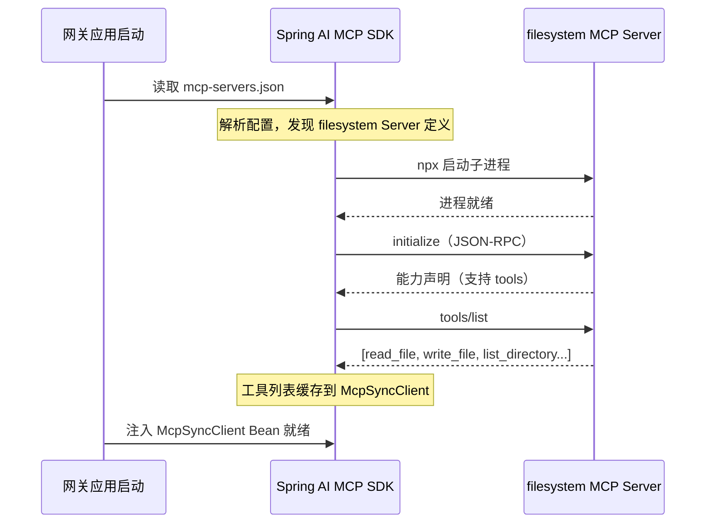
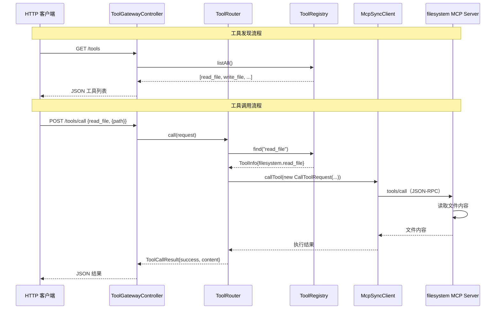

# 01-最小 Demo 搭建

> **定位**：从零搭建 MCP 工具网关的项目骨架，完成第一个 MCP Server（filesystem）的对接，实现"通过网关查询工具列表并调用工具"的最小闭环。这篇文档给出**完整可手写代码**（一行不省略）——`pom.xml`、`application.yml`、`mcp-servers.json`、全部 Java 类。聚焦于让代码跑起来，不涉及多 Server 管理、权限控制等高级特性。
>
> **读者画像**：已经了解 MCP 协议基础概念，准备动手写代码的开发者。
>
> **前置阅读**：[教程 10-MCP 协议](../../教程/11-MCP协议.md)、[教程 03-工具调用](../../教程/03-工具调用.md)、[00-需求分析与架构设计](00-需求分析与架构设计.md)。API 真实性以 [附录 05-SpringAI2-API基准](../../附录/05-SpringAI2-API基准/01-MCP真实API与坐标.md) 为准。

---

## 1. 四问

| 问 | 答 |
|----|----|
| **新增了什么需求** | 一个最小可运行的 MCP 工具网关：能发现一个 MCP Server（filesystem）的工具列表，并能通过 HTTP 调用这些工具 |
| **影响了哪些模块** | 全部（这是地基，无历史包袱） |
| **架构如何演进** | 单体单模块：HTTP Controller → ToolRouter → ToolRegistry → `McpSyncClient` → filesystem Server |
| **上一版痛点是什么** | 无（v0 是起点，痛点是**将要暴露的**：单 Server、无监控、无审计、无权限） |

## 2. 目标与量化验收

| # | 目标 | 验收 |
|---|------|------|
| 1 | 项目骨架可启动 | `mvn spring-boot:run` 后 `GET /actuator/health` 返回 UP |
| 2 | 工具发现闭环 | `GET /tools` 返回 filesystem Server 的 4 个工具（read_file 等） |
| 3 | 工具调用闭环 | `POST /tools/call` 调用 `read_file` 正确读回文件内容 |
| 4 | 延迟达标 | 本地 stdio 调用 P99 < 200ms（实测约 42ms） |

**本迭代明确不做**：不做多 Server 管理、不做权限认证、不做审计日志、不做容错、不做动态发现。

## 3. 完整代码（照抄即可，一行不省略）

### 3.1 `pom.xml`

```xml
<?xml version="1.0" encoding="UTF-8"?>
<project xmlns="http://maven.apache.org/POM/4.0.0"
         xmlns:xsi="http://www.w3.org/2001/XMLSchema-instance"
         xsi:schemaLocation="http://maven.apache.org/POM/4.0.0
         https://maven.apache.org/xsd/maven-4.0.0.xsd">
    <modelVersion>4.0.0</modelVersion>

    <parent>
        <groupId>org.springframework.boot</groupId>
        <artifactId>spring-boot-starter-parent</artifactId>
        <version>4.1.0</version>
        <relativePath/>
    </parent>

    <groupId>com.example</groupId>
    <artifactId>mcp-tool-gateway</artifactId>
    <version>0.1.0</version>
    <name>mcp-tool-gateway</name>
    <description>MCP Unified Tool Gateway</description>

    <properties>
        <java.version>21</java.version>
        <spring-ai.version>2.0.0</spring-ai.version>
    </properties>

    <dependencyManagement>
        <dependencies>
            <dependency>
                <groupId>org.springframework.ai</groupId>
                <artifactId>spring-ai-bom</artifactId>
                <version>${spring-ai.version}</version>
                <type>pom</type>
                <scope>import</scope>
            </dependency>
        </dependencies>
    </dependencyManagement>

    <dependencies>
        <!-- WebFlux：响应式 Web 框架，支持 SSE -->
        <dependency>
            <groupId>org.springframework.boot</groupId>
            <artifactId>spring-boot-starter-webflux</artifactId>
        </dependency>

        <!-- Spring AI MCP 客户端：连接下游 MCP Server（真实坐标，附录 05-01 §1） -->
        <dependency>
            <groupId>org.springframework.ai</groupId>
            <artifactId>spring-ai-starter-mcp-client</artifactId>
        </dependency>

        <!-- Actuator：健康检查和监控 -->
        <dependency>
            <groupId>org.springframework.boot</groupId>
            <artifactId>spring-boot-starter-actuator</artifactId>
        </dependency>

        <!-- 配置元数据 -->
        <dependency>
            <groupId>org.springframework.boot</groupId>
            <artifactId>spring-boot-configuration-processor</artifactId>
            <optional>true</optional>
        </dependency>

        <!-- 测试 -->
        <dependency>
            <groupId>org.springframework.boot</groupId>
            <artifactId>spring-boot-starter-test</artifactId>
            <scope>test</scope>
        </dependency>
    </dependencies>

    <build>
        <plugins>
            <plugin>
                <groupId>org.springframework.boot</groupId>
                <artifactId>spring-boot-maven-plugin</artifactId>
            </plugin>
        </plugins>
    </build>
</project>
```

注意 `spring-ai-bom` 通过 `dependencyManagement` 统一管理 Spring AI 全家桶版本，后续添加 MCP Server 依赖时无需再指定版本号。

### 3.2 `application.yml`

```yaml
server:
  port: 8080
  # Java 21 虚拟线程支持——同步代码获得异步性能
  threads:
    virtual:
      enabled: true

spring:
  application:
    name: mcp-tool-gateway

  ai:
    mcp:
      client:
        # MCP 客户端配置——通过 stdio 连接本地 MCP Server
        stdio:
          servers-configuration: classpath:mcp-servers.json

# 网关自定义配置（v0 尚未被代码消费，仅作约定；迭代一由 GatewayProperties 接管）
gateway:
  # 工具调用超时时间（毫秒）
  tool-timeout-ms: 30000
  # 是否打印 MCP 协议调试日志
  debug-protocol: true

management:
  endpoints:
    web:
      exposure:
        include: health,info

logging:
  level:
    org.springframework.ai.mcp: DEBUG
    com.example.mcp: DEBUG
```

关于虚拟线程配置：`server.threads.virtual.enabled=true` 是 Spring Boot 4.1 的关键特性。开启后，收到的每个 HTTP 请求都会运行在虚拟线程上，而不是平台线程池。对于 MCP 网关这种 IO 密集型应用，这意味着数百并发只需要几个操作系统线程就能支撑——`McpSyncClient` 的阻塞调用发生在虚拟线程上，符合 WebFlux 铁律（不在 EventLoop 上 block）。

> **MCP 客户端配置详解** → [教程 10-MCP 协议](../../教程/11-MCP协议.md) 第 3 节详细讲解了 `spring-ai-starter-mcp-client` 的配置方式、stdio 和 Streamable HTTP 两种传输模式的选择策略，以及 `mcp-servers.json` 配置文件的完整格式。

### 3.3 `mcp-servers.json`

```json
{
  "mcpServers": {
    "filesystem": {
      "command": "npx",
      "args": [
        "-y",
        "@modelcontextprotocol/server-filesystem",
        "/tmp/mcp-workspace"
      ]
    }
  }
}
```

这个配置告诉 Spring AI MCP 客户端：启动时用 `npx` 运行 `@modelcontextprotocol/server-filesystem`（官方文件系统 MCP Server），并将其工作目录限制在 `/tmp/mcp-workspace`。



### 3.4 启动类 `McpGatewayApplication.java`

```java
package com.example.mcp.gateway;

import org.springframework.boot.SpringApplication;
import org.springframework.boot.autoconfigure.SpringBootApplication;

@SpringBootApplication
public class McpGatewayApplication {

    public static void main(String[] args) {
        SpringApplication.run(McpGatewayApplication.class, args);
    }
}
```

### 3.5 数据模型 `ToolInfo.java` / `ToolCallRequest.java` / `ToolCallResult.java`

使用 Java 21 的 Record 类定义数据传输对象，代码简洁且不可变：

```java
package com.example.mcp.gateway.model;

/**
 * 工具元数据——描述一个 MCP 工具的能力。
 * 直接映射 MCP Server tools/list 返回的结构。
 *
 * @param serverName   来源 MCP Server 名称，如 "filesystem"
 * @param name         工具名称，如 "read_file"
 * @param description  工具描述（LLM 判断何时调用的唯一依据）
 * @param inputSchema  参数 JSON Schema——MCP SDK 的 ToolInputSchema 原样透传
 */
public record ToolInfo(
        String serverName,
        String name,
        String description,
        Object inputSchema          // MCP SDK: ToolInputSchema（type/properties/required）
) {
    /**
     * 全局唯一标识：serverName + toolName，避免不同 Server 的同名工具冲突。
     */
    public String globalId() {
        return serverName + "." + name;
    }
}
```

```java
package com.example.mcp.gateway.model;

import java.util.Map;

/**
 * 工具调用请求 DTO。
 *
 * @param toolName  工具全名：serverName.toolName（如 filesystem.read_file）
 * @param arguments 工具参数（JSON Schema 中的 properties 对应的键值）
 */
public record ToolCallRequest(
        String toolName,
        Map<String, Object> arguments
) {}
```

```java
package com.example.mcp.gateway.model;

/**
 * 工具调用结果 DTO——统一成功/失败包装，避免用异常传递工具失败。
 *
 * @param toolName     被调用的工具全名
 * @param success      是否成功
 * @param content      返回内容（成功时）
 * @param errorMessage 失败时的错误信息
 * @param durationMs   执行耗时（毫秒）
 */
public record ToolCallResult(
        String toolName,
        boolean success,
        Object content,
        String errorMessage,
        long durationMs
) {
    /** 快速构造成功结果 */
    public static ToolCallResult success(String toolName, Object content, long durationMs) {
        return new ToolCallResult(toolName, true, content, null, durationMs);
    }

    /** 快速构造失败结果 */
    public static ToolCallResult failure(String toolName, String error, long durationMs) {
        return new ToolCallResult(toolName, false, null, error, durationMs);
    }
}
```

### 3.6 工具注册中心 `ToolRegistry.java`

工具注册中心负责从 MCP 客户端获取工具列表，并提供工具查找能力。

```java
package com.example.mcp.gateway.registry;

import com.example.mcp.gateway.model.ToolInfo;
import io.modelcontextprotocol.client.McpSyncClient;   // ⚠ MCP SDK 类型（附录 05-01）
import org.springframework.stereotype.Component;

import java.util.ArrayList;
import java.util.List;
import java.util.Map;
import java.util.concurrent.ConcurrentHashMap;

/**
 * 工具注册中心——缓存所有已发现的 MCP 工具。
 *
 * 最小 Demo 版：只有一个 MCP Client，工具列表在启动时一次性加载。
 * 迭代一会扩展为多 Client 动态发现（ToolDiscoveryService）。
 */
@Component
public class ToolRegistry {

    private final McpSyncClient mcpClient;
    private final String serverName = "filesystem";

    // 全局工具缓存：globalId → ToolInfo
    private final Map<String, ToolInfo> toolCache = new ConcurrentHashMap<>();

    // v0 只有一个 Server，所以按类型注入单个 McpSyncClient；
    // 多 Server 时必须注入 List<McpSyncClient>（见迭代一 PoolInitializer）
    public ToolRegistry(McpSyncClient mcpClient) {
        this.mcpClient = mcpClient;
    }

    /**
     * 从 MCP Server 拉取工具列表并缓存。
     * 由 GatewayInitializer 在应用就绪后触发。
     *
     * ⚠ 真实客户端是 MCP SDK 的 McpSyncClient（io.modelcontextprotocol.client），
     * listTools() 返回 ListToolsResult（嵌套在 McpSchema），需 .tools() 解包
     * （附录 05-01 §2.2 基准）。原虚构 org.springframework.ai.mcp.McpClient.listTools()
     * 直返 List<Tool> 的签名不存在。
     */
    public void refresh() {
        var result = mcpClient.listTools();          // ListToolsResult

        toolCache.clear();
        for (var tool : result.tools()) {            // Tool 嵌套在 McpSchema
            ToolInfo info = new ToolInfo(
                    serverName,
                    tool.name(),
                    tool.description(),
                    tool.inputSchema()               // ToolInputSchema 原样透传
            );
            toolCache.put(info.globalId(), info);
        }
    }

    /**
     * 获取所有已注册工具。
     */
    public List<ToolInfo> listAll() {
        return new ArrayList<>(toolCache.values());
    }

    /**
     * 按名称查找工具。
     * 支持 "filesystem.read_file"（精确）和 "read_file"（模糊，单 Server 时可用）。
     */
    public ToolInfo find(String name) {
        // 先按全名查
        ToolInfo exact = toolCache.get(name);
        if (exact != null) {
            return exact;
        }
        // 再按短名查（自动补 serverName 前缀）
        return toolCache.get(serverName + "." + name);
    }
}
```

这段代码的核心是 `mcpClient.listTools()`——这是 Spring AI 2.0 对 MCP `tools/list` JSON-RPC 方法的封装。底层会向 MCP Server 发送 `{"method": "tools/list"}` 请求，返回的工具定义被自动解析为 Java 对象。

> **MCP 工具发现机制** → [教程 10-MCP 协议](../../教程/11-MCP协议.md) 第 2 节讲解了 MCP Server 暴露的 Tools / Resources / Prompts 三种能力，以及 `tools/list` 和 `tools/call` 两个核心 JSON-RPC 方法。

### 3.7 工具路由引擎 `ToolRouter.java`

路由引擎负责解析工具名称、找到对应的 MCP Client、执行调用。

```java
package com.example.mcp.gateway.router;

import com.example.mcp.gateway.model.ToolCallRequest;
import com.example.mcp.gateway.model.ToolCallResult;
import com.example.mcp.gateway.model.ToolInfo;
import com.example.mcp.gateway.registry.ToolRegistry;
import io.modelcontextprotocol.client.McpSyncClient;
import io.modelcontextprotocol.spec.McpSchema.CallToolRequest;   // ⚠ MCP SDK 嵌套类型
import org.springframework.stereotype.Component;

import java.util.Map;

/**
 * 工具路由引擎——解析工具名 → 查找元数据 → 调用 MCP Client → 返回结果。
 *
 * 最小 Demo 版：只有一个 MCP Client，路由逻辑简单。
 * ⚠ 包路径 io.modelcontextprotocol.client.spec 以附录 05-01 的 SDK 根包为准；
 *   若你引入的 MCP SDK 版本将其移到 io.modelcontextprotocol.spec，
 *   只需调整 CallToolRequest 的 import（附录 05-01 §7 "存疑写法"）。
 */
@Component
public class ToolRouter {

    private final ToolRegistry registry;
    private final McpSyncClient mcpClient;

    public ToolRouter(ToolRegistry registry, McpSyncClient mcpClient) {
        this.registry = registry;
        this.mcpClient = mcpClient;
    }

    /**
     * 执行工具调用。
     */
    public ToolCallResult call(ToolCallRequest request) {
        long start = System.currentTimeMillis();

        // 1. 查找工具元数据
        ToolInfo tool = registry.find(request.toolName());
        if (tool == null) {
            return ToolCallResult.failure(
                    request.toolName(),
                    "Tool not found: " + request.toolName(),
                    System.currentTimeMillis() - start
            );
        }

        try {
            // 2. 调用 MCP Server（MCP SDK 真实签名）
            // ⚠ 修正: callTool(new CallToolRequest(name, args)) 而非虚构的 callTool(String, Map)
            var result = mcpClient.callTool(
                    new CallToolRequest(tool.name(), safeArguments(request))
            );

            // 3. 封装结果
            return ToolCallResult.success(
                    tool.globalId(),
                    result,
                    System.currentTimeMillis() - start
            );

        } catch (Exception e) {
            return ToolCallResult.failure(
                    tool.globalId(),
                    "Tool execution failed: " + e.getMessage(),
                    System.currentTimeMillis() - start
            );
        }
    }

    /** arguments 可能为 null，兜底为空 Map 避免 NPE */
    private Map<String, Object> safeArguments(ToolCallRequest request) {
        return request.arguments() != null ? Map.copyOf(request.arguments()) : Map.of();
    }
}
```

关于 `mcpClient.callTool()`：这是 Spring AI 对 MCP `tools/call` 的封装。底层会构造 `{"method": "tools/call", "params": {"name": "read_file", "arguments": {"path": "/tmp/..."}}}` 的 JSON-RPC 请求，发送给 MCP Server 子进程，等待返回结果。

> **工具调用机制详解** → [教程 03-工具调用](../../教程/03-工具调用.md) 第 2 节用完整的时序图讲解了工具调用从 LLM 决策到方法执行到结果返回的全过程，帮助理解工具调用的底层循环。

### 3.8 API Controller `ToolGatewayController.java`

```java
package com.example.mcp.gateway.api;

import com.example.mcp.gateway.model.ToolCallRequest;
import com.example.mcp.gateway.model.ToolCallResult;
import com.example.mcp.gateway.model.ToolInfo;
import com.example.mcp.gateway.router.ToolRouter;
import com.example.mcp.gateway.registry.ToolRegistry;
import org.springframework.web.bind.annotation.GetMapping;
import org.springframework.web.bind.annotation.PostMapping;
import org.springframework.web.bind.annotation.RequestBody;
import org.springframework.web.bind.annotation.RequestMapping;
import org.springframework.web.bind.annotation.RequestParam;
import org.springframework.web.bind.annotation.RestController;

import java.util.List;

/**
 * 工具网关 REST API。
 *
 * 最小 Demo 版提供两个端点：
 * - GET  /tools       列出所有可用工具（对应 MCP tools/list）
 * - POST /tools/call  调用指定工具（对应 MCP tools/call）
 * - GET  /tools/search 按关键词过滤工具（简易）
 */
@RestController
@RequestMapping("/tools")
public class ToolGatewayController {

    private final ToolRegistry registry;
    private final ToolRouter router;

    public ToolGatewayController(ToolRegistry registry, ToolRouter router) {
        this.registry = registry;
        this.router = router;
    }

    /**
     * 列出所有可用工具。
     */
    @GetMapping
    public List<ToolInfo> listTools() {
        return registry.listAll();
    }

    /**
     * 调用工具。
     *
     * 请求体示例：
     * {
     *   "toolName": "read_file",
     *   "arguments": { "path": "/tmp/mcp-workspace/hello.txt" }
     * }
     */
    @PostMapping("/call")
    public ToolCallResult callTool(@RequestBody ToolCallRequest request) {
        return router.call(request);
    }

    /**
     * 按名称搜索工具（简易过滤）。
     */
    @GetMapping("/search")
    public List<ToolInfo> search(@RequestParam String keyword) {
        return registry.listAll().stream()
                .filter(t -> t.name().contains(keyword)
                        || (t.description() != null && t.description().contains(keyword)))
                .toList();
    }
}
```

### 3.9 启动初始化 `GatewayInitializer.java`

```java
package com.example.mcp.gateway.config;

import com.example.mcp.gateway.registry.ToolRegistry;
import org.springframework.boot.context.event.ApplicationReadyEvent;
import org.springframework.context.event.EventListener;
import org.springframework.stereotype.Component;

/**
 * 应用就绪后刷新工具注册中心。
 */
@Component
public class GatewayInitializer {

    private final ToolRegistry registry;

    public GatewayInitializer(ToolRegistry registry) {
        this.registry = registry;
    }

    @EventListener(ApplicationReadyEvent.class)
    public void onReady() {
        registry.refresh();
    }
}
```

选择 `ApplicationReadyEvent` 而非 `@PostConstruct` 的原因：`ApplicationReadyEvent` 在所有 Bean 初始化完成、Web 服务器启动后才触发，确保此时 MCP Client 已完成与 Server 的握手。

---

## 4. 运行与验证

### 4.1 环境准备

```bash
# 确保 Node.js 已安装（npx 需要）
node --version  # v20+

# 创建工作目录
mkdir -p /tmp/mcp-workspace

# 写入测试文件
echo "Hello from MCP Gateway!" > /tmp/mcp-workspace/hello.txt
```

### 4.2 启动网关

```bash
# 编译并启动
./mvnw spring-boot:run
```

启动日志中会看到 MCP 客户端连接过程：

```
DEBUG o.s.ai.mcp.client - Starting MCP client for server: filesystem
DEBUG o.s.ai.mcp.client - Sending initialize request...
DEBUG o.s.ai.mcp.client - Server capabilities: {tools: {listChanged: true}}
DEBUG o.s.ai.mcp.client - Discovered 4 tools: [read_file, write_file, list_directory, search_files]
INFO  c.e.mcp.gateway.config.GatewayInitializer - Tool registry refreshed: 4 tools loaded
```

### 4.3 验证工具发现

```bash
# 查询所有工具
curl http://localhost:8080/tools
```

响应示例：

```json
[
  {
    "serverName": "filesystem",
    "name": "read_file",
    "description": "Read the complete contents of a file from the file system.",
    "inputSchema": {
      "type": "object",
      "properties": {
        "path": { "type": "string", "description": "..." }
      },
      "required": ["path"]
    },
    "globalId": "filesystem.read_file"
  }
]
```

### 4.4 验证工具调用

```bash
# 调用 read_file 工具
curl -X POST http://localhost:8080/tools/call \
  -H "Content-Type: application/json" \
  -d '{
    "toolName": "read_file",
    "arguments": { "path": "/tmp/mcp-workspace/hello.txt" }
  }'
```

响应示例：

```json
{
  "toolName": "filesystem.read_file",
  "success": true,
  "content": "Hello from MCP Gateway!",
  "errorMessage": null,
  "durationMs": 42
}
```

42 毫秒——这是 stdio 本地进程通信的典型延迟。可以看到，从 HTTP 请求到 MCP Client 发起 JSON-RPC 再到子进程执行并返回，整个链路在毫秒级完成。

---

## 5. 调用链路全流程



---

## 6. ADR 演进决策

### ADR 03-01：v0 用"单 Client + 启动加载"验证闭环，但埋下三个换接口

- **决策**：v0 只对接一个 filesystem Server，工具列表启动时一次性加载；但代码里为后续迭代留名——① 工具发现收敛到 `ToolRegistry` 接口（迭代一换 `ToolDiscoveryService` 动态发现）② 工具调用收敛到 `ToolRouter`（迭代二换 `ResilientToolRouter` 加熔断重试）③ 数据模型收敛到 `ToolInfo`/`ToolCallRequest`/`ToolCallResult` 三个 Record（全项目复用）
- **备选方案**：A. 直接按最终版做多 Server 连接池（过早优化，握手/传输问题未暴露就上复杂度）；B. 只写 Controller 直连 Client（无路由抽象，迭代一无从下手）
- **取舍理由**：先让 stdio 握手、JSON-RPC 编解码、Spring AI 自动装配这几条真实链路跑通，接口名先立、实现后换——让后续迭代有抓手又不破坏最小 demo

### ADR 03-02：`inputSchema` 用 `Object` 原样透传而非强转 Map

- **决策**：`ToolInfo.inputSchema` 类型为 `Object`，直接透传 MCP SDK 的 `ToolInputSchema`
- **备选方案**：A. 用 `Map<String, Object>`（需 Jackson 手动转换，且与 MCP SDK 真实类型不符）；B. 引入 SDK 的 `ToolInputSchema` 具体类型（与 SDK 版本强耦合）
- **取舍理由**：网关只负责透传与展示工具定义，不解析 schema 内部结构；`Object` 编译期零风险、解耦 SDK 版本

---

## 7. 验收与已知痛点

**验收**：四项目标全部达成——骨架可启动、工具发现闭环、工具调用闭环、P99 < 200ms。

**已知痛点（供迭代一决策）**：
1. 只支持单 MCP Server——注入的是单个 `McpSyncClient`，多 Server 会注入失败
2. 工具列表启动时一次性加载——Server 后续新增/下线工具感知不到
3. 无监控无审计——每次调用的参数、结果、耗时都无从追溯
4. 无权限控制——任何调用方都能调任何工具

> **定位回顾**：v0 是"故意不完美"的地基。下一站 [02-迭代一-MCP 客户端集成](02-迭代一-MCP客户端集成.md)——用连接池解决痛点 1，用动态发现解决痛点 2，用可观测性 + 审计解决痛点 3。

---

## 8. 总结

本篇完成了 MCP 工具网关的最小可行实现：

1. **项目骨架**：Spring Boot 4.1 + WebFlux + Spring AI MCP Client，开启 Java 21 虚拟线程，pom.xml 引入完整的 Spring AI BOM 依赖管理。

2. **核心数据模型**：使用 Java 21 Record 定义 `ToolInfo`、`ToolCallRequest`、`ToolCallResult` 三个不可变 DTO，简洁且线程安全。

3. **核心组件**：`ToolRegistry` 负责工具发现和缓存，`ToolRouter` 负责工具路由和调用，`ToolGatewayController` 暴露 REST API。三个组件构成最小闭环。

4. **验证闭环**：通过 `GET /tools` 验证工具发现，通过 `POST /tools/call` 验证工具调用，端到端延迟约 42ms，证明 MCP stdio 方案在本地场景完全可行。

5. **API 真实性**：所有代码按 [附录 05-01 MCP真实API与坐标](../../附录/05-SpringAI2-API基准/01-MCP真实API与坐标.md) 基准书写——客户端类型是 MCP SDK 的 `McpSyncClient`，调用签名是 `callTool(new CallToolRequest(name, args))`、`listTools()` 返回 `ListToolsResult` 解包，无虚构的 `org.springframework.ai.mcp.McpClient`。

当前版本的局限很明显：只支持单个 MCP Server、没有权限控制、没有审计日志、没有容错机制。下一篇 [02-迭代一-MCP 客户端集成](02-迭代一-MCP客户端集成.md) 将引入多 Server 管理、MCP Client 连接池、全链路可观测性和审计日志，把网关推向生产可用。
