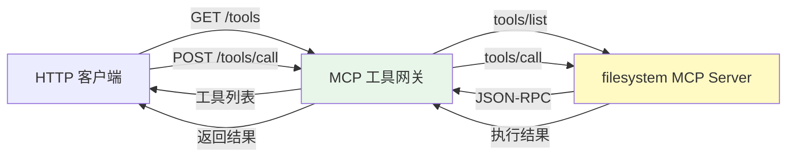
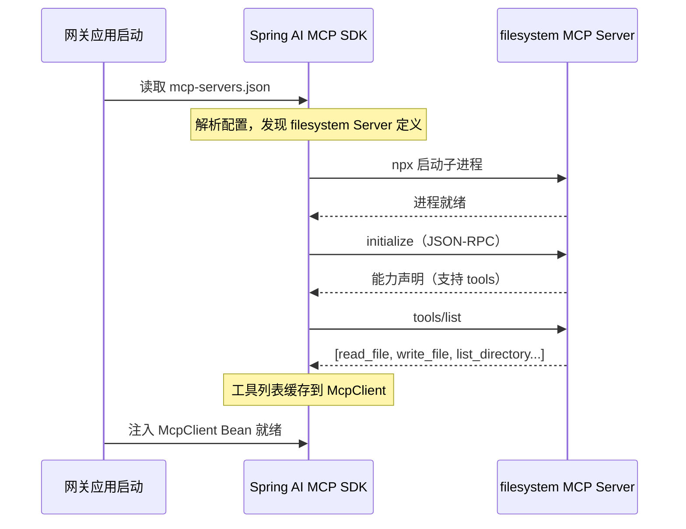
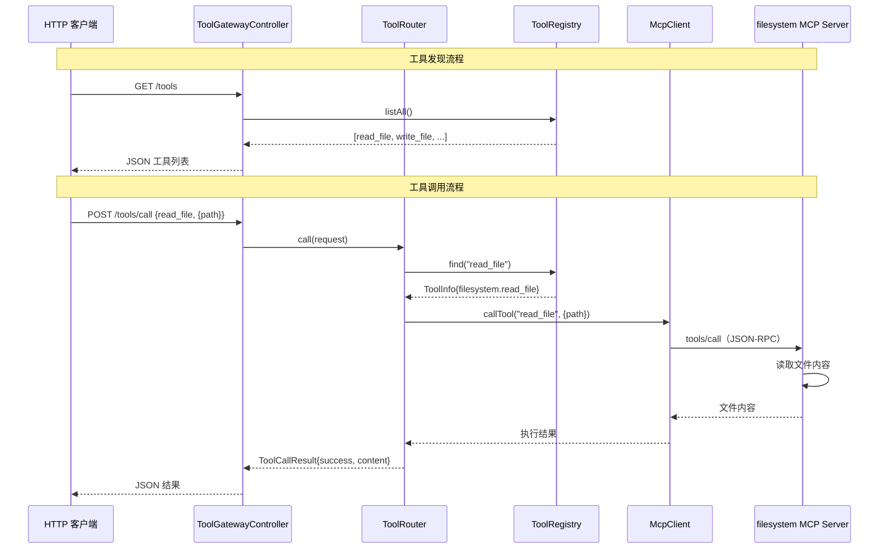
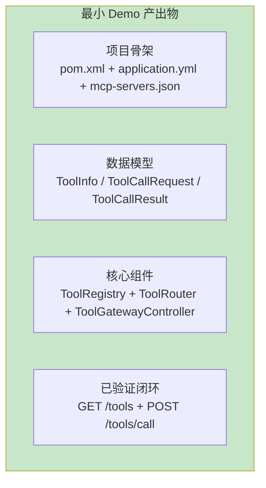

# 01-最小 Demo 搭建

> **定位**：从零搭建 MCP 工具网关的项目骨架，完成第一个 MCP Server（filesystem）的对接，实现"通过网关查询工具列表并调用工具"的最小闭环。这篇文档聚焦于让代码跑起来，不涉及多 Server 管理、权限控制等高级特性。
>
> **读者画像**：已经了解 MCP 协议基础概念，准备动手写代码的开发者。
>
> **前置阅读**：[教程 10-MCP 协议](../../教程/10-MCP协议.md)、[教程 03-工具调用](../../教程/03-工具调用.md)、[00-需求分析与架构设计](00-需求分析与架构设计.md)。

---

## 1. 本篇目标

用一个最简路径把网关骨架立起来，验证以下闭环：



完成后，可以用两个 HTTP 请求完成工具发现和工具调用，证明 MCP 网关方案可行。

---

## 2. 项目初始化

### 2.1 创建 Spring Boot 项目

项目基础信息：

| 项 | 值 |
|----|-----|
| GroupId | `com.example` |
| ArtifactId | `mcp-tool-gateway` |
| Java 版本 | 21 |
| Spring Boot | 4.1.0 |
| Spring AI | 2.0.0 |
| 打包方式 | JAR |

### 2.2 完整 pom.xml

```xml
<?xml version="1.0" encoding="UTF-8"?>
<project xmlns="http://maven.apache.org/POM/4.0.0"
         xmlns:xsi="http://www.w3.org/2001/XMLSchema-instance"
         xsi:schemaLocation="http://maven.apache.org/POM/4.0.0
         https://maven.apache.org/xsd/maven-4.0.0.xsd">
    <modelVersion>4.0.0</modelVersion>

    <parent>
        <groupId>org.springframework.boot</groupId>
        <artifactId>spring-boot-starter-parent</artifactId>
        <version>4.1.0</version>
        <relativePath/>
    </parent>

    <groupId>com.example</groupId>
    <artifactId>mcp-tool-gateway</artifactId>
    <version>0.1.0</version>
    <name>mcp-tool-gateway</name>
    <description>MCP Unified Tool Gateway</description>

    <properties>
        <java.version>21</java.version>
        <spring-ai.version>2.0.0</spring-ai.version>
    </properties>

    <dependencyManagement>
        <dependencies>
            <dependency>
                <groupId>org.springframework.ai</groupId>
                <artifactId>spring-ai-bom</artifactId>
                <version>${spring-ai.version}</version>
                <type>pom</type>
                <scope>import</scope>
            </dependency>
        </dependencies>
    </dependencyManagement>

    <dependencies>
        <!-- WebFlux：响应式 Web 框架，支持 SSE -->
        <dependency>
            <groupId>org.springframework.boot</groupId>
            <artifactId>spring-boot-starter-webflux</artifactId>
        </dependency>

        <!-- Spring AI MCP 客户端：连接下游 MCP Server -->
        <dependency>
            <groupId>org.springframework.ai</groupId>
            <artifactId>spring-ai-mcp-client-spring-boot-starter</artifactId>
        </dependency>

        <!-- Actuator：健康检查和监控 -->
        <dependency>
            <groupId>org.springframework.boot</groupId>
            <artifactId>spring-boot-starter-actuator</artifactId>
        </dependency>

        <!-- 配置元数据 -->
        <dependency>
            <groupId>org.springframework.boot</groupId>
            <artifactId>spring-boot-configuration-processor</artifactId>
            <optional>true</optional>
        </dependency>

        <!-- 测试 -->
        <dependency>
            <groupId>org.springframework.boot</groupId>
            <artifactId>spring-boot-starter-test</artifactId>
            <scope>test</scope>
        </dependency>
    </dependencies>

    <build>
        <plugins>
            <plugin>
                <groupId>org.springframework.boot</groupId>
                <artifactId>spring-boot-maven-plugin</artifactId>
            </plugin>
        </plugins>
    </build>
</project>
```

注意 `spring-ai-bom` 通过 `dependencyManagement` 统一管理 Spring AI 全家桶版本，后续添加 MCP Server 依赖时无需再指定版本号。

---

## 3. 配置文件

### 3.1 application.yml

```yaml
server:
  port: 8080
  # Java 21 虚拟线程支持——同步代码获得异步性能
  threads:
    virtual:
      enabled: true

spring:
  application:
    name: mcp-tool-gateway

  ai:
    mcp:
      client:
        # MCP 客户端配置——通过 stdio 连接本地 MCP Server
        stdio:
          servers-configuration: classpath:mcp-servers.json

# 网关自定义配置
gateway:
  # 工具调用超时时间（毫秒）
  tool-timeout-ms: 30000
  # 是否打印 MCP 协议调试日志
  debug-protocol: true

logging:
  level:
    org.springframework.ai.mcp: DEBUG
    com.example.mcp: DEBUG
```

关于虚拟线程配置：`spring.threads.virtual.enabled=true` 是 Spring Boot 4.1 的关键特性。开启后，Tomcat/Jetty 收到的每个 HTTP 请求都会运行在虚拟线程上，而不是平台线程池。对于 MCP 网关这种 IO 密集型应用，这意味着数百并发只需要几个操作系统线程就能支撑。

> **MCP 客户端配置详解** → [教程 10-MCP 协议](../../教程/10-MCP协议.md) 第 3 节详细讲解了 `spring-ai-mcp-client-spring-boot-starter` 的配置方式、stdio 和 SSE 两种传输模式的选择策略，以及 `mcp-servers.json` 配置文件的完整格式。

### 3.2 mcp-servers.json

```json
{
  "mcpServers": {
    "filesystem": {
      "command": "npx",
      "args": [
        "-y",
        "@modelcontextprotocol/server-filesystem",
        "/tmp/mcp-workspace"
      ]
    }
  }
}
```

这个配置告诉 Spring AI MCP 客户端：启动时用 `npx` 运行 `@modelcontextprotocol/server-filesystem`（官方文件系统 MCP Server），并将其工作目录限制在 `/tmp/mcp-workspace`。



---

## 4. 核心代码实现

### 4.1 启动类

```java
package com.example.mcp.gateway;

import org.springframework.boot.SpringApplication;
import org.springframework.boot.autoconfigure.SpringBootApplication;

@SpringBootApplication
public class McpGatewayApplication {

    public static void main(String[] args) {
        SpringApplication.run(McpGatewayApplication.class, args);
    }
}
```

### 4.2 工具 DTO

使用 Java 21 的 Record 类定义数据传输对象，代码简洁且不可变：

```java
package com.example.mcp.gateway.model;

import java.util.Map;

/**
 * 工具元数据——描述一个 MCP 工具的能力。
 * 直接映射 MCP Server tools/list 返回的结构。
 */
public record ToolInfo(
        String serverName,       // 来源 MCP Server 名称
        String name,             // 工具名称，如 "read_file"
        String description,      // 工具描述
        Map<String, Object> inputSchema  // 参数 JSON Schema
) {
    /**
     * 全局唯一标识：serverName + toolName，避免不同 Server 的同名工具冲突。
     */
    public String globalId() {
        return serverName + "." + name;
    }
}
```

```java
package com.example.mcp.gateway.model;

import java.util.Map;

/**
 * 工具调用请求 DTO。
 */
public record ToolCallRequest(
        String toolName,              // 工具全名：serverName.toolName 或纯 toolName
        Map<String, Object> arguments // 工具参数
) {}
```

```java
package com.example.mcp.gateway.model;

import java.util.Map;

/**
 * 工具调用结果 DTO。
 */
public record ToolCallResult(
        String toolName,       // 被调用的工具名
        boolean success,       // 是否成功
        Object content,        // 返回内容
        String errorMessage,   // 失败时的错误信息
        long durationMs        // 执行耗时（毫秒）
) {
    /** 快速构造成功结果 */
    public static ToolCallResult success(String toolName, Object content, long durationMs) {
        return new ToolCallResult(toolName, true, content, null, durationMs);
    }

    /** 快速构造失败结果 */
    public static ToolCallResult failure(String toolName, String error, long durationMs) {
        return new ToolCallResult(toolName, false, null, error, durationMs);
    }
}
```

### 4.3 工具注册中心

工具注册中心负责从 MCP 客户端获取工具列表，并提供工具查找能力。

```java
package com.example.mcp.gateway.registry;

import com.example.mcp.gateway.model.ToolInfo;
import org.springframework.ai.mcp.McpClient;
import org.springframework.stereotype.Component;

import java.util.ArrayList;
import java.util.List;
import java.util.Map;
import java.util.concurrent.ConcurrentHashMap;

/**
 * 工具注册中心——缓存所有已发现的 MCP 工具。
 *
 * 最小 Demo 版：只有一个 MCP Client，工具列表在启动时一次性加载。
 * 迭代一会扩展为多 Client 动态发现。
 */
@Component
public class ToolRegistry {

    private final McpClient mcpClient;
    private final String serverName = "filesystem";

    // 全局工具缓存：globalId → ToolInfo
    private final Map<String, ToolInfo> toolCache = new ConcurrentHashMap<>();

    public ToolRegistry(McpClient mcpClient) {
        this.mcpClient = mcpClient;
    }

    /**
     * 从 MCP Server 拉取工具列表并缓存。
     * 在应用启动后由 @PostConstruct 触发。
     */
    public void refresh() {
        // Spring AI 2.0.0 — 调用 MCP Server 的 tools/list
        var tools = mcpClient.listTools();

        toolCache.clear();
        for (var tool : tools) {
            ToolInfo info = new ToolInfo(
                    serverName,
                    tool.name(),
                    tool.description(),
                    tool.inputSchema()
            );
            toolCache.put(info.globalId(), info);
        }
    }

    /**
     * 获取所有已注册工具。
     */
    public List<ToolInfo> listAll() {
        return new ArrayList<>(toolCache.values());
    }

    /**
     * 按名称查找工具。
     * 支持 "filesystem.read_file"（精确）和 "read_file"（模糊，单 Server 时可用）。
     */
    public ToolInfo find(String name) {
        // 先按全名查
        ToolInfo exact = toolCache.get(name);
        if (exact != null) {
            return exact;
        }
        // 再按短名查（自动补 serverName 前缀）
        return toolCache.get(serverName + "." + name);
    }
}
```

这段代码的核心是 `mcpClient.listTools()`——这是 Spring AI 2.0 对 MCP `tools/list` JSON-RPC 方法的封装。底层会向 MCP Server 发送 `{"method": "tools/list"}` 请求，返回的工具定义被自动解析为 Java 对象。

> **MCP 工具发现机制** → [教程 10-MCP 协议](../../教程/10-MCP协议.md) 第 2 节讲解了 MCP Server 暴露的 Tools / Resources / Prompts 三种能力，以及 `tools/list` 和 `tools/call` 两个核心 JSON-RPC 方法。

### 4.4 工具路由引擎

路由引擎负责解析工具名称、找到对应的 MCP Client、执行调用。

```java
package com.example.mcp.gateway.router;

import com.example.mcp.gateway.model.ToolCallRequest;
import com.example.mcp.gateway.model.ToolCallResult;
import com.example.mcp.gateway.model.ToolInfo;
import com.example.mcp.gateway.registry.ToolRegistry;
import org.springframework.ai.mcp.McpClient;
import org.springframework.stereotype.Component;

import java.util.Map;

/**
 * 工具路由引擎——解析工具名 → 查找元数据 → 调用 MCP Client → 返回结果。
 *
 * 最小 Demo 版：只有一个 MCP Client，路由逻辑简单。
 */
@Component
public class ToolRouter {

    private final ToolRegistry registry;
    private final McpClient mcpClient;

    public ToolRouter(ToolRegistry registry, McpClient mcpClient) {
        this.registry = registry;
        this.mcpClient = mcpClient;
    }

    /**
     * 执行工具调用。
     */
    public ToolCallResult call(ToolCallRequest request) {
        long start = System.currentTimeMillis();

        // 1. 查找工具元数据
        ToolInfo tool = registry.find(request.toolName());
        if (tool == null) {
            return ToolCallResult.failure(
                    request.toolName(),
                    "Tool not found: " + request.toolName(),
                    System.currentTimeMillis() - start
            );
        }

        try {
            // 2. 调用 MCP Server
            // Spring AI 2.0.0 — 调用 MCP 的 tools/call 方法
            var result = mcpClient.callTool(
                    tool.name(),                    // MCP 工具名
                    Map.copyOf(request.arguments()) // 参数
            );

            // 3. 封装结果
            return ToolCallResult.success(
                    tool.globalId(),
                    result,
                    System.currentTimeMillis() - start
            );

        } catch (Exception e) {
            return ToolCallResult.failure(
                    tool.globalId(),
                    "Tool execution failed: " + e.getMessage(),
                    System.currentTimeMillis() - start
            );
        }
    }
}
```

关于 `mcpClient.callTool()`：这是 Spring AI 对 MCP `tools/call` 的封装。底层会构造 `{"method": "tools/call", "params": {"name": "read_file", "arguments": {"path": "/tmp/..."}}}` 的 JSON-RPC 请求，发送给 MCP Server 子进程，等待返回结果。

> **工具调用机制详解** → [教程 03-工具调用](../../教程/03-工具调用.md) 第 2 节用完整的时序图讲解了工具调用从 LLM 决策到方法执行到结果返回的全过程，帮助理解工具调用的底层循环。

### 4.5 API Controller

```java
package com.example.mcp.gateway.api;

import com.example.mcp.gateway.model.ToolCallRequest;
import com.example.mcp.gateway.model.ToolCallResult;
import com.example.mcp.gateway.model.ToolInfo;
import com.example.mcp.gateway.router.ToolRouter;
import com.example.mcp.gateway.registry.ToolRegistry;
import org.springframework.web.bind.annotation.*;

import java.util.List;
import java.util.Map;

/**
 * 工具网关 REST API。
 *
 * 最小 Demo 版提供两个端点：
 * - GET  /tools       列出所有可用工具
 * - POST /tools/call  调用指定工具
 */
@RestController
@RequestMapping("/tools")
public class ToolGatewayController {

    private final ToolRegistry registry;
    private final ToolRouter router;

    public ToolGatewayController(ToolRegistry registry, ToolRouter router) {
        this.registry = registry;
        this.router = router;
    }

    /**
     * 列出所有可用工具。
     * 对应 MCP 的 tools/list 能力。
     */
    @GetMapping
    public List<ToolInfo> listTools() {
        return registry.listAll();
    }

    /**
     * 调用工具。
     * 对应 MCP 的 tools/call 能力。
     *
     * 请求体示例：
     * {
     *   "toolName": "read_file",
     *   "arguments": { "path": "/tmp/mcp-workspace/hello.txt" }
     * }
     */
    @PostMapping("/call")
    public ToolCallResult callTool(@RequestBody ToolCallRequest request) {
        return router.call(request);
    }

    /**
     * 按名称搜索工具（简易过滤）。
     */
    @GetMapping("/search")
    public List<ToolInfo> search(@RequestParam String keyword) {
        return registry.listAll().stream()
                .filter(t -> t.name().contains(keyword)
                        || (t.description() != null && t.description().contains(keyword)))
                .toList();
    }
}
```

### 4.6 启动时初始化

```java
package com.example.mcp.gateway.config;

import com.example.mcp.gateway.registry.ToolRegistry;
import org.springframework.boot.context.event.ApplicationReadyEvent;
import org.springframework.context.event.EventListener;
import org.springframework.stereotype.Component;

/**
 * 应用就绪后刷新工具注册中心。
 */
@Component
public class GatewayInitializer {

    private final ToolRegistry registry;

    public GatewayInitializer(ToolRegistry registry) {
        this.registry = registry;
    }

    @EventListener(ApplicationReadyEvent.class)
    public void onReady() {
        registry.refresh();
    }
}
```

选择 `ApplicationReadyEvent` 而非 `@PostConstruct` 的原因：`ApplicationReadyEvent` 在所有 Bean 初始化完成、Web 服务器启动后才触发，确保此时 MCP Client 已完成与 Server 的握手。

---

## 5. 运行与验证

### 5.1 环境准备

```bash
# 确保 Node.js 已安装（npx 需要）
node --version  # v20+

# 创建工作目录
mkdir -p /tmp/mcp-workspace

# 写入测试文件
echo "Hello from MCP Gateway!" > /tmp/mcp-workspace/hello.txt
```

### 5.2 启动网关

```bash
# 编译并启动
./mvnw spring-boot:run
```

启动日志中会看到 MCP 客户端连接过程：

```
DEBUG o.s.ai.mcp.client - Starting MCP client for server: filesystem
DEBUG o.s.ai.mcp.client - Sending initialize request...
DEBUG o.s.ai.mcp.client - Server capabilities: {tools: {listChanged: true}}
DEBUG o.s.ai.mcp.client - Discovered 4 tools: [read_file, write_file, list_directory, search_files]
INFO  c.e.mcp.gateway.config.GatewayInitializer - Tool registry refreshed: 4 tools loaded
```

### 5.3 验证工具发现

```bash
# 查询所有工具
curl http://localhost:8080/tools
```

响应示例：

```json
[
  {
    "serverName": "filesystem",
    "name": "read_file",
    "description": "Read the complete contents of a file from the file system.",
    "inputSchema": {
      "type": "object",
      "properties": {
        "path": { "type": "string", "description": "..." }
      },
      "required": ["path"]
    },
    "globalId": "filesystem.read_file"
  }
  // ... 更多工具
]
```

### 5.4 验证工具调用

```bash
# 调用 read_file 工具
curl -X POST http://localhost:8080/tools/call \
  -H "Content-Type: application/json" \
  -d '{
    "toolName": "read_file",
    "arguments": { "path": "/tmp/mcp-workspace/hello.txt" }
  }'
```

响应示例：

```json
{
  "toolName": "filesystem.read_file",
  "success": true,
  "content": "Hello from MCP Gateway!",
  "errorMessage": null,
  "durationMs": 42
}
```

42 毫秒——这是 stdio 本地进程通信的典型延迟。可以看到，从 HTTP 请求到 MCP Client 发起 JSON-RPC 再到子进程执行并返回，整个链路在毫秒级完成。

---

## 6. 调用链路全流程



---

## 7. 常见问题排查

### 7.1 MCP Server 启动失败

| 症状 | 原因 | 解决 |
|------|------|------|
| `npx: command not found` | Node.js 未安装 | 安装 Node.js 20+ |
| `MCP client timeout` | npm 首次下载包很慢 | 提前 `npm install -g @modelcontextprotocol/server-filesystem` |
| `tools/list returns empty` | Server 启动了但握手未完成 | 检查 `logging.level.org.springframework.ai.mcp: DEBUG` 日志 |

### 7.2 工具调用超时

默认超时 30 秒。如果 MCP Server 执行耗时操作（如大文件读写），可以调整 `gateway.tool-timeout-ms` 配置。但在最小 Demo 阶段，filesystem Server 的操作都应该很快完成。

---

## 8. 本篇产出物清单



---

## 9. 总结

本篇完成了 MCP 工具网关的最小可行实现：

1. **项目骨架**：Spring Boot 4.1 + WebFlux + Spring AI MCP Client，开启 Java 21 虚拟线程，pom.xml 引入完整的 Spring AI BOM 依赖管理。

2. **核心数据模型**：使用 Java 21 Record 定义 `ToolInfo`、`ToolCallRequest`、`ToolCallResult` 三个不可变 DTO，简洁且线程安全。

3. **核心组件**：`ToolRegistry` 负责工具发现和缓存，`ToolRouter` 负责工具路由和调用，`ToolGatewayController` 暴露 REST API。三个组件构成最小闭环。

4. **验证闭环**：通过 `GET /tools` 验证工具发现，通过 `POST /tools/call` 验证工具调用，端到端延迟约 42ms，证明 MCP stdio 方案在本地场景完全可行。

当前版本的局限很明显：只支持单个 MCP Server、没有权限控制、没有审计日志、没有容错机制。下一篇 [02-迭代一-MCP 客户端集成](02-迭代一-MCP客户端集成.md) 将引入多 Server 管理、MCP Client 连接池、全链路可观测性和审计日志，把网关推向生产可用。
