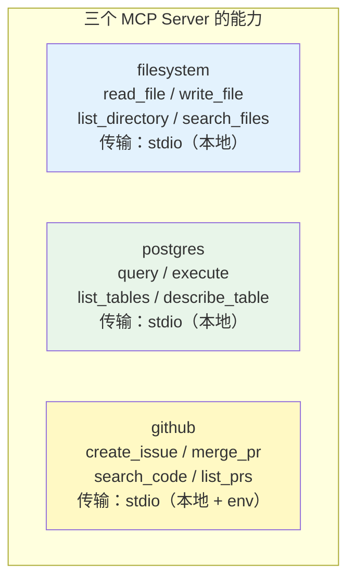
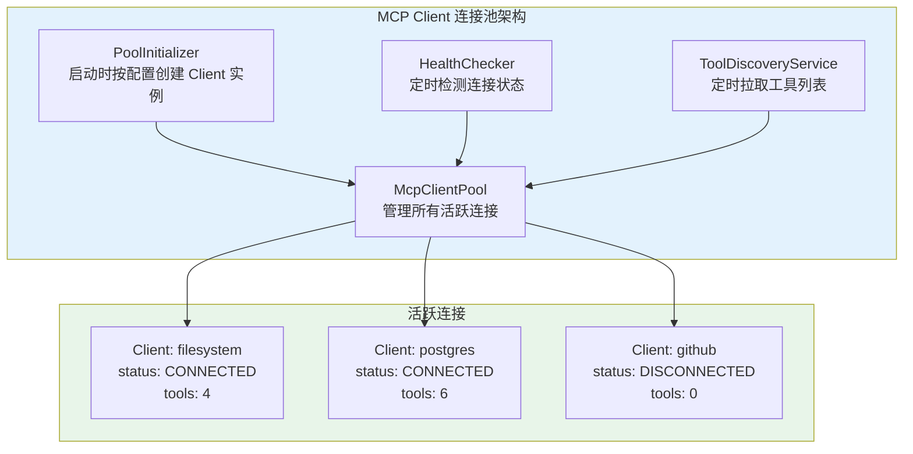
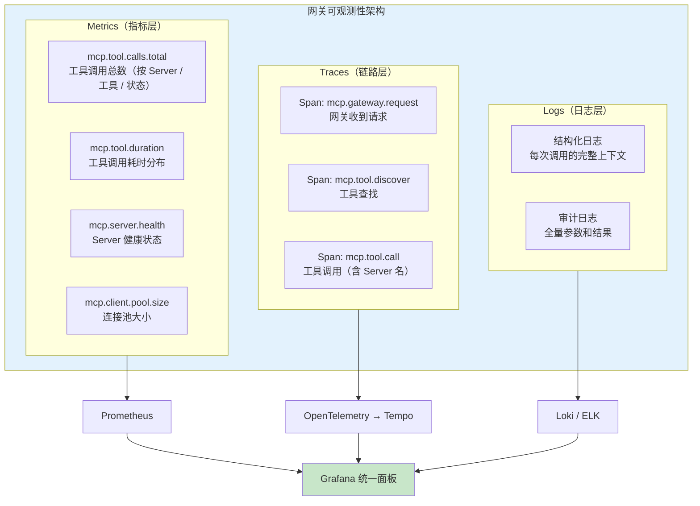
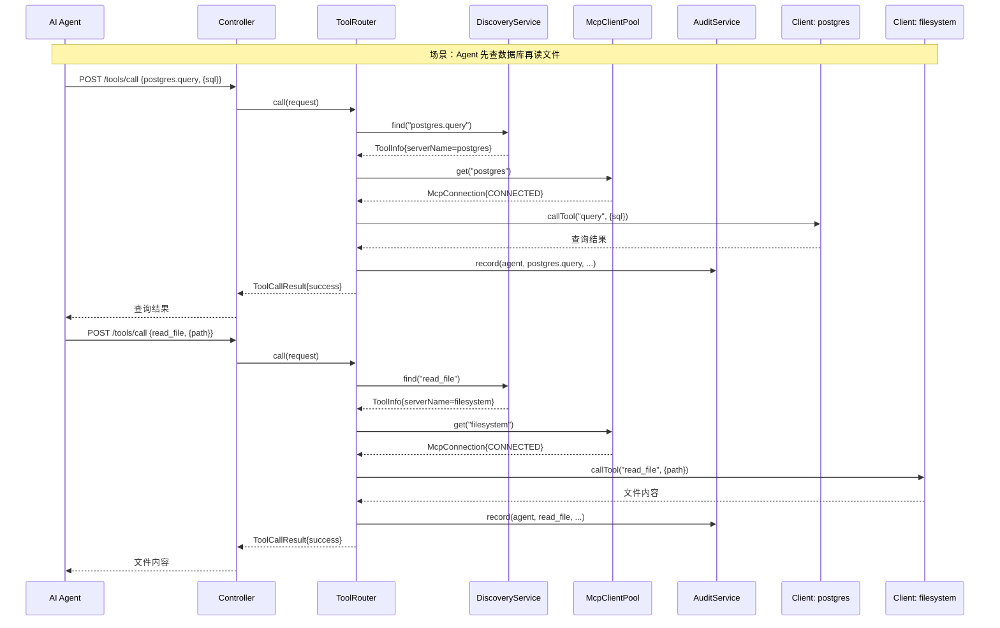

# 02-迭代一：MCP 客户端集成

> **定位**：在最小 Demo 基础上引入多 MCP Server 管理，构建 MCP Client 连接池、动态工具发现、全链路可观测性和审计日志，将网关从"单 Server 玩具"升级为"多 Server 生产级中间件"。本文给出**完整可手写代码**（一行不省略）——连接池、发现、健康检查、可观测、审计全部 Java 类 + `pom.xml` 新增依赖 + `application.yml` + SQL DDL。
>
> **读者画像**：已完成最小 Demo，需要让网关同时管理多个 MCP Server 并具备生产级可观测能力。
>
> **前置阅读**：[01-最小 Demo 搭建](01-最小Demo搭建.md)、[教程 16-全链路可观测性](../../教程/16-全链路可观测性.md)、[教程 03-工具调用](../../教程/03-工具调用.md)。API 真实性以 [附录 12-SpringAI2-API基准](../../附录/12-SpringAI2-API基准/01-MCP真实API与坐标.md) 为准。

---

## 1. 四问

| 问 | 答 |
|----|----|
| **新增了什么需求** | 同时管理 filesystem / postgres / github 三个 MCP Server；连接池生命周期管理；动态发现 + 健康检查；全链路可观测 + 审计日志 |
| **影响了哪些模块** | `ToolRegistry`（拆为动态发现 `ToolDiscoveryService`）、`ToolRouter`（按 serverName 路由 + 埋点 + 审计）、新增 `pool/`、`audit/`、`config/GatewayMetrics` |
| **架构如何演进** | 单 Client → Client 连接池；启动时一次性加载 → 定时轮询动态发现；无监控 → Micrometer Observation + Prometheus；无审计 → JPA 异步审计 |
| **上一版痛点是什么** | ① 只支持单 Server（注入单个 `McpSyncClient` 多 Server 必失败）② 工具列表不刷新（Server 变更感知不到）③ 无监控无审计（调用参数/结果/耗时无从追溯）④ 无权限控制 |

## 2. 目标与量化验收

| # | 目标 | 验收 |
|---|------|------|
| 1 | 多 Server 管理 | 三个 Server 全部注册进连接池，`/actuator/health` 显示各自状态与工具数 |
| 2 | 动态发现 | 新增 Server 工具后 60s 内被 `GET /tools` 感知 |
| 3 | 健康检查 | 手动停掉某 Server，30s 内状态变 DEGRADED，连续 3 次后 DISCONNECTED 并被隔离 |
| 4 | 全链路可观测 | `curl /actuator/prometheus \| grep mcp_tool` 能看到 `mcp_tool_calls_total` / `mcp_tool_duration_seconds` |
| 5 | 审计日志 | 每次调用写入 `audit_logs` 表（参数 + 结果 + 状态 + 耗时），且不阻塞主调用链 |
| 6 | 性能不回退 | 多 Server 后 P99 工具调用 < 200ms（不含 Server 执行时间） |

**本迭代明确不做**：不做权限认证（迭代二做）、不做容错熔断（迭代二做）、不自建 MCP 服务端（迭代二做）。

## 3. 多 MCP Server 配置

### 3.1 `mcp-servers.json`（扩展为三个 Server）

```json
{
  "mcpServers": {
    "filesystem": {
      "command": "npx",
      "args": [
        "-y",
        "@modelcontextprotocol/server-filesystem",
        "/tmp/mcp-workspace"
      ]
    },
    "postgres": {
      "command": "npx",
      "args": [
        "-y",
        "@modelcontextprotocol/server-postgres",
        "postgresql://localhost:5432/demo"
      ]
    },
    "github": {
      "command": "npx",
      "args": ["-y", "@modelcontextprotocol/server-github"],
      "env": {
        "GITHUB_TOKEN": "${GITHUB_TOKEN}"
      }
    }
  }
}
```

三个 Server 的能力差异：



### 3.2 `pom.xml` 新增依赖

需在 pom.xml 中添加依赖：

```xml
<!-- 需在 pom.xml 中添加依赖：审计日志 JPA + H2（开发）+ Prometheus 指标 -->
<dependency>
    <groupId>org.springframework.boot</groupId>
    <artifactId>spring-boot-starter-data-jpa</artifactId>
</dependency>

<dependency>
    <groupId>com.h2database</groupId>
    <artifactId>h2</artifactId>
    <scope>runtime</scope>
</dependency>

<dependency>
    <groupId>io.micrometer</groupId>
    <artifactId>micrometer-registry-prometheus</artifactId>
</dependency>
```

### 3.3 `application.yml`（完整版）

```yaml
server:
  port: 8080
  threads:
    virtual:
      enabled: true

spring:
  application:
    name: mcp-tool-gateway

  ai:
    mcp:
      client:
        # 通过 stdio 连接本地 MCP Server（三个）
        stdio:
          servers-configuration: classpath:mcp-servers.json

  # 审计日志持久化（H2 开发库；生产换 PostgreSQL，建表 DDL 见 §6.4）
  datasource:
    url: jdbc:h2:mem:gateway;DB_CLOSE_DELAY=-1
    driver-class-name: org.h2.Driver
    username: sa
    password: ""

  jpa:
    hibernate:
      ddl-auto: update          # 开发期自动建表；生产用 §6.4 的 SQL DDL 手动建
    show-sql: false
    open-in-view: false

# 网关自定义配置（由 GatewayProperties 绑定）
gateway:
  tool-timeout: 30s
  health-check-interval: 30s
  discovery-interval: 60s
  audit-enabled: true
  audit:
    log-arguments: true
    log-results: true
    max-result-length: 4096

management:
  endpoints:
    web:
      exposure:
        include: health,info,prometheus
  metrics:
    tags:
      application: mcp-tool-gateway

logging:
  level:
    org.springframework.ai.mcp: DEBUG
    com.example.mcp: DEBUG
```

### 3.4 网关配置类 `GatewayProperties.java`

```java
package com.example.mcp.gateway.config;

import org.springframework.boot.context.properties.ConfigurationProperties;

import java.time.Duration;

/**
 * 网关配置属性——绑定 application.yml 的 gateway.* 前缀。
 * 需在启动类加 @ConfigurationPropertiesScan 才会生效（见 §3.5）。
 */
@ConfigurationProperties(prefix = "gateway")
public record GatewayProperties(
        Duration toolTimeout,          // 工具调用超时
        Duration healthCheckInterval,  // 健康检查间隔
        Duration discoveryInterval,    // 工具发现轮询间隔
        boolean auditEnabled,          // 是否启用审计
        AuditConfig audit              // 审计配置
) {
    public record AuditConfig(
            boolean logArguments,      // 记录参数
            boolean logResults,        // 记录结果
            int maxResultLength        // 结果最大记录长度（截断）
    ) {}
}
```

### 3.5 启动类 `McpGatewayApplication.java`（启用扫描/调度/异步）

```java
package com.example.mcp.gateway;

import org.springframework.boot.SpringApplication;
import org.springframework.boot.autoconfigure.SpringBootApplication;
import org.springframework.boot.context.properties.ConfigurationPropertiesScan;
import org.springframework.scheduling.annotation.EnableAsync;
import org.springframework.scheduling.annotation.EnableScheduling;

@SpringBootApplication
@ConfigurationPropertiesScan   // 扫描 @ConfigurationProperties 记录（GatewayProperties）
@EnableScheduling              // 启用 @Scheduled（ToolDiscoveryService / HealthChecker）
@EnableAsync                   // 启用 @Async（AuditService）
public class McpGatewayApplication {

    public static void main(String[] args) {
        SpringApplication.run(McpGatewayApplication.class, args);
    }
}
```

---

## 4. MCP Client 连接池

### 4.1 连接池架构



### 4.2 连接描述符 `McpConnection.java`

每个 Client 连接用 `McpConnection` 描述，封装连接元数据和状态。

```java
package com.example.mcp.gateway.pool;

import com.example.mcp.gateway.model.ToolInfo;
import io.modelcontextprotocol.sdk.mcp.McpSyncClient;   // ⚠ MCP SDK 真实类型（附录 12-01）

import java.time.Instant;
import java.util.List;
import java.util.concurrent.CopyOnWriteArrayList;

/**
 * MCP Client 连接描述符。
 * 一个连接对应一个 MCP Server。
 */
public class McpConnection {

    public enum Status {
        CONNECTING,    // 正在握手
        CONNECTED,     // 已连接，可用
        DEGRADED,      // 降级（健康检查失败但未断开）
        DISCONNECTED   // 已断开
    }

    private final String serverName;
    private final McpSyncClient client;   // ⚠ MCP SDK 类型（附录 12-01）
    private volatile Status status;
    private final Instant connectedAt;
    private Instant lastHealthCheck;
    private int consecutiveFailures;

    // 该 Server 暴露的工具列表（由 ToolDiscoveryService 维护）
    private final List<ToolInfo> tools = new CopyOnWriteArrayList<>();

    public McpConnection(String serverName, McpSyncClient client) {
        this.serverName = serverName;
        this.client = client;
        this.status = Status.CONNECTING;
        this.connectedAt = Instant.now();
    }

    /** 标记健康检查结果 */
    public void recordHealthCheck(boolean healthy) {
        this.lastHealthCheck = Instant.now();
        if (healthy) {
            this.consecutiveFailures = 0;
            this.status = Status.CONNECTED;
        } else {
            this.consecutiveFailures++;
            this.status = this.consecutiveFailures >= 3
                    ? Status.DISCONNECTED
                    : Status.DEGRADED;
        }
    }

    /** 连接是否可用 */
    public boolean isAvailable() {
        return status == Status.CONNECTED || status == Status.DEGRADED;
    }

    // getter（完整，不省略）
    public String getServerName() { return serverName; }
    public McpSyncClient getClient() { return client; }
    public Status getStatus() { return status; }
    public Instant getConnectedAt() { return connectedAt; }
    public Instant getLastHealthCheck() { return lastHealthCheck; }
    public int getConsecutiveFailures() { return consecutiveFailures; }
    public List<ToolInfo> getTools() { return tools; }
}
```

### 4.3 连接池 `McpClientPool.java`

```java
package com.example.mcp.gateway.pool;

import io.modelcontextprotocol.sdk.mcp.McpSyncClient;   // ⚠ MCP SDK 真实类型（附录 12-01）
import org.springframework.stereotype.Component;

import java.util.List;
import java.util.Map;
import java.util.concurrent.ConcurrentHashMap;

/**
 * MCP Client 连接池。
 *
 * 管理所有 MCP Server 的连接，提供：
 * - 按名称获取连接
 * - 动态注册新连接
 * - 移除断开的连接
 */
@Component
public class McpClientPool {

    // serverName → McpConnection
    private final Map<String, McpConnection> connections = new ConcurrentHashMap<>();

    /**
     * 注册一个新连接。
     */
    public void register(String serverName, McpSyncClient client) {
        connections.put(serverName, new McpConnection(serverName, client));
    }

    /**
     * 按名称获取连接。
     * 只返回可用状态的连接（CONNECTED 或 DEGRADED）。
     */
    public McpConnection get(String serverName) {
        McpConnection conn = connections.get(serverName);
        if (conn == null) {
            throw new IllegalArgumentException(
                    "Unknown MCP server: " + serverName +
                    ". Available: " + connections.keySet()
            );
        }
        if (!conn.isAvailable()) {
            throw new IllegalStateException(
                    "MCP server '" + serverName + "' is " + conn.getStatus()
            );
        }
        return conn;
    }

    /**
     * 获取所有活跃连接（不可变快照）。
     */
    public Map<String, McpConnection> getAll() {
        return Map.copyOf(connections);
    }

    /**
     * 获取所有可用连接。
     */
    public List<McpConnection> getAvailable() {
        return connections.values().stream()
                .filter(McpConnection::isAvailable)
                .toList();
    }

    /**
     * 移除并关闭连接。
     */
    public void remove(String serverName) {
        McpConnection conn = connections.remove(serverName);
        if (conn != null) {
            try {
                conn.getClient().close();
            } catch (Exception ignored) {
                // 关闭时的异常可以忽略
            }
        }
    }
}
```

### 4.4 连接初始化器 `PoolInitializer.java`

Spring AI MCP Client Starter 会自动为每个配置的 Server 创建一个 `McpSyncClient` Bean。本类在启动时将客户端按 serverName 注册进连接池，serverName 从 `mcp-servers.json` 的键顺序读取（与注入顺序一致）。

```java
package com.example.mcp.gateway.pool;

import com.fasterxml.jackson.databind.JsonNode;
import com.fasterxml.jackson.databind.ObjectMapper;
import io.modelcontextprotocol.sdk.mcp.McpSyncClient;   // ⚠ MCP SDK 真实类型（附录 12-01）
import org.springframework.boot.context.event.ApplicationReadyEvent;
import org.springframework.context.event.EventListener;
import org.springframework.core.io.ClassPathResource;
import org.springframework.stereotype.Component;

import java.util.ArrayList;
import java.util.List;

/**
 * 启动时将注入的 List<McpSyncClient> 注册到连接池。
 *
 * ⚠ 修正（审计 2026-08-14）: 真实注入是 List<McpSyncClient>（每个 Server 一个），
 * 不是虚构的 Map<String, McpClient>（附录 12-01 §2.1）。
 * serverName 从 mcp-servers.json 的键顺序解析（与 starter 的注入顺序一致）。
 */
@Component
public class PoolInitializer {

    private final List<McpSyncClient> mcpClients;
    private final McpClientPool pool;
    private final ObjectMapper objectMapper;

    public PoolInitializer(List<McpSyncClient> mcpClients,
                           McpClientPool pool,
                           ObjectMapper objectMapper) {
        this.mcpClients = mcpClients;
        this.pool = pool;
        this.objectMapper = objectMapper;
    }

    @EventListener(ApplicationReadyEvent.class)
    public void initialize() {
        List<String> serverNames = readServerNames();
        for (int i = 0; i < mcpClients.size(); i++) {
            String serverName = i < serverNames.size()
                    ? serverNames.get(i)
                    : "server-" + i;
            pool.register(serverName, mcpClients.get(i));
        }
    }

    /**
     * 从 mcp-servers.json 读取 server 名称（键顺序即注入顺序）。
     * 读取失败时退化为 server-i 命名，保证应用可启动。
     */
    private List<String> readServerNames() {
        try {
            JsonNode root = objectMapper.readTree(
                    new ClassPathResource("mcp-servers.json").getInputStream()
            );
            List<String> names = new ArrayList<>();
            root.path("mcpServers").fields().forEachRemaining(e -> names.add(e.getKey()));
            return names;
        } catch (Exception e) {
            return List.of();
        }
    }
}
```

---

## 5. 工具动态发现与健康检查

### 5.1 工具发现服务 `ToolDiscoveryService.java`

```java
package com.example.mcp.gateway.registry;

import com.example.mcp.gateway.model.ToolInfo;
import com.example.mcp.gateway.pool.McpClientPool;
import com.example.mcp.gateway.pool.McpConnection;
import org.slf4j.Logger;
import org.slf4j.LoggerFactory;
import org.springframework.scheduling.annotation.Scheduled;
import org.springframework.stereotype.Service;

import java.util.ArrayList;
import java.util.List;
import java.util.Map;
import java.util.concurrent.ConcurrentHashMap;

/**
 * 工具动态发现服务。
 *
 * 定期从所有活跃 MCP Server 拉取工具列表，
 * 维护全局工具注册中心。
 */
@Service
public class ToolDiscoveryService {

    private static final Logger log = LoggerFactory.getLogger(ToolDiscoveryService.class);

    private final McpClientPool pool;
    // globalId → ToolInfo
    private final Map<String, ToolInfo> globalRegistry = new ConcurrentHashMap<>();

    public ToolDiscoveryService(McpClientPool pool) {
        this.pool = pool;
    }

    /**
     * 定时刷新工具列表。每 60 秒执行一次（可配）。
     */
    @Scheduled(fixedDelayString = "${gateway.discovery-interval:60s}")
    public void discoverAll() {
        for (McpConnection conn : pool.getAvailable()) {
            try {
                refreshConnection(conn);
            } catch (Exception e) {
                log.warn("Failed to discover tools from '{}': {}",
                        conn.getServerName(), e.getMessage());
            }
        }
        log.debug("Tool discovery completed. Total tools: {}", globalRegistry.size());
    }

    /**
     * 刷新单个连接的工具列表。
     */
    private void refreshConnection(McpConnection conn) {
        // ⚠ 修正: listTools() 返回 ListToolsResult，需解包 .tools()（附录 12-01 §2.2）
        var tools = conn.getClient().listTools().tools();

        // 先清除该 Server 的旧工具
        globalRegistry.keySet().removeIf(
                id -> id.startsWith(conn.getServerName() + ".")
        );

        // 再写入新工具
        List<ToolInfo> toolInfos = new ArrayList<>();
        for (var tool : tools) {
            ToolInfo info = new ToolInfo(
                    conn.getServerName(),
                    tool.name(),
                    tool.description(),
                    tool.inputSchema()          // ToolInputSchema 原样透传
            );
            globalRegistry.put(info.globalId(), info);
            toolInfos.add(info);
        }

        // 更新连接上的工具缓存
        conn.getTools().clear();
        conn.getTools().addAll(toolInfos);

        log.info("Server '{}' provides {} tools", conn.getServerName(), toolInfos.size());
    }

    /**
     * 获取所有已发现的工具。
     */
    public List<ToolInfo> listAll() {
        return List.copyOf(globalRegistry.values());
    }

    /**
     * 按全局 ID 或短名查找工具。
     */
    public ToolInfo find(String name) {
        // 精确匹配：filesystem.read_file
        ToolInfo exact = globalRegistry.get(name);
        if (exact != null) {
            return exact;
        }
        // 模糊匹配：read_file → 遍历查找后缀
        for (ToolInfo tool : globalRegistry.values()) {
            if (tool.name().equals(name)) {
                return tool;
            }
        }
        return null;
    }
}
```

### 5.2 健康检查服务 `HealthChecker.java`

```java
package com.example.mcp.gateway.pool;

import org.slf4j.Logger;
import org.slf4j.LoggerFactory;
import org.springframework.scheduling.annotation.Scheduled;
import org.springframework.stereotype.Service;

/**
 * MCP Server 健康检查服务。
 *
 * 每 30 秒 ping 一次所有连接，
 * 连续 3 次失败标记为 DISCONNECTED。
 */
@Service
public class HealthChecker {

    private static final Logger log = LoggerFactory.getLogger(HealthChecker.class);
    private static final int FAILURE_THRESHOLD = 3;

    private final McpClientPool pool;

    public HealthChecker(McpClientPool pool) {
        this.pool = pool;
    }

    @Scheduled(fixedDelayString = "${gateway.health-check-interval:30s}")
    public void checkAll() {
        for (McpConnection conn : pool.getAll().values()) {
            boolean healthy = ping(conn);
            conn.recordHealthCheck(healthy);

            if (!healthy) {
                log.warn("Health check failed for '{}': {} consecutive failures",
                        conn.getServerName(), conn.getConsecutiveFailures());
            }
        }
    }

    /**
     * Ping MCP Server。
     * 用 tools/list 作为 ping——如果 Server 能响应，说明连接正常。
     */
    private boolean ping(McpConnection conn) {
        try {
            conn.getClient().listTools();   // 返回 ListToolsResult，作为 ping 可忽略返回值
            return true;
        } catch (Exception e) {
            return false;
        }
    }
}
```

### 5.3 工具路由引擎升级 `ToolRouter.java`

路由引擎从"工具名 → 单一 McpSyncClient"升级为"工具名 → 找到 ToolInfo → 从连接池取对应 Client → 执行调用"，并嵌入可观测与审计。

```java
package com.example.mcp.gateway.router;

import com.example.mcp.gateway.audit.AuditService;
import com.example.mcp.gateway.config.GatewayMetrics;
import com.example.mcp.gateway.model.ToolCallRequest;
import com.example.mcp.gateway.model.ToolCallResult;
import com.example.mcp.gateway.model.ToolInfo;
import com.example.mcp.gateway.pool.McpClientPool;
import com.example.mcp.gateway.pool.McpConnection;
import com.example.mcp.gateway.registry.ToolDiscoveryService;
import io.micrometer.observation.Observation;
import io.micrometer.observation.ObservationRegistry;
import io.modelcontextprotocol.sdk.mcp.spec.McpSchema.CallToolRequest;   // ⚠ MCP SDK 嵌套类型
import org.springframework.stereotype.Component;

import java.time.Duration;
import java.util.Map;

@Component
public class ToolRouter {

    private final ToolDiscoveryService discovery;
    private final McpClientPool pool;
    private final GatewayMetrics metrics;
    private final AuditService auditService;
    private final ObservationRegistry observationRegistry;

    public ToolRouter(ToolDiscoveryService discovery,
                      McpClientPool pool,
                      GatewayMetrics metrics,
                      AuditService auditService,
                      ObservationRegistry observationRegistry) {
        this.discovery = discovery;
        this.pool = pool;
        this.metrics = metrics;
        this.auditService = auditService;
        this.observationRegistry = observationRegistry;
    }

    /**
     * 执行工具调用——用 Micrometer Observation 包裹整个调用链。
     * observe() 自动创建 Span（mcp.tool.call）与计时，无需手动埋点。
     */
    public ToolCallResult call(ToolCallRequest request) {
        return Observation.createNotStarted("mcp.tool.call", observationRegistry)
                .lowCardinalityKeyValue("tool", request.toolName())
                .observe(() -> doCall(request));
    }

    private ToolCallResult doCall(ToolCallRequest request) {
        long start = System.currentTimeMillis();
        String agentId = "anonymous";   // 迭代二由 AgentAuthService 填充真实 Agent

        // 1. 查找工具
        ToolInfo tool = discovery.find(request.toolName());
        if (tool == null) {
            ToolCallResult failure = ToolCallResult.failure(
                    request.toolName(),
                    "Tool not found: " + request.toolName(),
                    System.currentTimeMillis() - start);
            recordMetrics("unknown", request.toolName(), failure);
            auditService.record(agentId, request.toolName(), request.arguments(),
                    null, false, failure.durationMs(), failure.errorMessage());
            return failure;
        }

        // 2. 从连接池取该 Server 的连接
        McpConnection conn = pool.get(tool.serverName());
        if (conn == null || !conn.isAvailable()) {
            ToolCallResult failure = ToolCallResult.failure(
                    tool.globalId(),
                    "MCP Server '" + tool.serverName() + "' is not available",
                    System.currentTimeMillis() - start);
            recordMetrics(tool.serverName(), tool.name(), failure);
            auditService.record(agentId, tool.globalId(), request.arguments(),
                    null, false, failure.durationMs(), failure.errorMessage());
            return failure;
        }

        try {
            // 3. 通过对应的 MCP Client 调用工具（MCP SDK 真实签名）
            var result = conn.getClient().callTool(
                    new CallToolRequest(tool.name(), safeArguments(request)));

            ToolCallResult success = ToolCallResult.success(
                    tool.globalId(),
                    result,
                    System.currentTimeMillis() - start);

            recordMetrics(tool.serverName(), tool.name(), success);
            auditService.record(agentId, tool.globalId(), request.arguments(),
                    result, true, success.durationMs(), null);
            return success;

        } catch (Exception e) {
            ToolCallResult failure = ToolCallResult.failure(
                    tool.globalId(),
                    "Tool execution failed: " + e.getMessage(),
                    System.currentTimeMillis() - start);

            recordMetrics(tool.serverName(), tool.name(), failure);
            auditService.record(agentId, tool.globalId(), request.arguments(),
                    null, false, failure.durationMs(), failure.errorMessage());
            return failure;
        }
    }

    private void recordMetrics(String serverName, String toolName, ToolCallResult r) {
        metrics.recordToolCall(serverName, toolName, r.success(),
                Duration.ofMillis(r.durationMs()));
    }

    /** arguments 可能为 null，兜底为空 Map 避免 NPE */
    private Map<String, Object> safeArguments(ToolCallRequest request) {
        return request.arguments() != null ? Map.copyOf(request.arguments()) : Map.of();
    }
}
```

关键变化：不再是"工具名 → 单一 McpSyncClient"，而是"工具名 → 找到 ToolInfo → 从 ToolInfo 取出 serverName → 从连接池获取对应 Client → 执行调用"。

---

## 6. 全链路可观测性与审计日志

### 6.1 可观测性架构

> **全链路可观测性体系** → [教程 16-全链路可观测性](../../教程/16-全链路可观测性.md)：该教程详细讲解了 Spring AI 2.0 原生可观测性体系——Micrometer Observation、gen_ai 语义约定、OpenTelemetry 集成、Prometheus + Grafana 监控面板搭建。本项目的可观测性设计直接基于该教程的架构。



### 6.2 指标 `GatewayMetrics.java` 与配置 `ObservationConfig.java`

```java
package com.example.mcp.gateway.config;

import io.micrometer.core.instrument.Counter;
import io.micrometer.core.instrument.MeterRegistry;
import io.micrometer.core.instrument.Timer;
import org.springframework.stereotype.Component;

import java.time.Duration;

/**
 * 网关核心指标定义。
 *
 * 注意：server / tool / result 都是低基数 Tag（Server 数、工具数、结果数有限），
 * 严禁把 orderId / userId 这类高基数值作为 Tag（会导致 Prometheus 时序爆炸）。
 */
@Component
public class GatewayMetrics {

    private final MeterRegistry registry;

    // 工具调用计时器（含百分位）
    private final Timer toolCallTimer;
    // 工具发现计数器
    private final Counter discoveryCounter;

    public GatewayMetrics(MeterRegistry registry) {
        this.registry = registry;

        this.toolCallTimer = Timer.builder("mcp.tool.duration")
                .description("MCP tool call duration")
                .publishPercentiles(0.5, 0.95, 0.99)
                .register(registry);

        this.discoveryCounter = Counter.builder("mcp.tool.discoveries")
                .description("Total tool discovery cycles")
                .register(registry);
    }

    /** 记录一次工具调用（按 Server / 工具 / 结果打 Tag） */
    public void recordToolCall(String serverName, String toolName,
                               boolean success, Duration duration) {
        Counter.builder("mcp.tool.calls")
                .tag("server", serverName)
                .tag("tool", toolName)
                .tag("result", success ? "success" : "failure")
                .register(registry)
                .increment();

        toolCallTimer.record(duration);
    }

    /** 记录一次工具发现周期 */
    public void recordDiscovery() {
        discoveryCounter.increment();
    }
}
```

```java
package com.example.mcp.gateway.config;

import io.micrometer.core.instrument.MeterRegistry;
import io.micrometer.core.instrument.Tag;
import org.springframework.boot.actuate.autoconfigure.metrics.MeterRegistryCustomizer;
import org.springframework.context.annotation.Bean;
import org.springframework.context.annotation.Configuration;

import java.util.List;

/**
 * 可观测性配置——统一给所有指标打上应用标签。
 * GatewayMetrics 本身是 @Component（见上），不在本配置重复声明 Bean。
 */
@Configuration
public class ObservationConfig {

    @Bean
    public MeterRegistryCustomizer<MeterRegistry> commonTags() {
        return registry -> registry.config().commonTags(
                List.of(Tag.of("application", "mcp-tool-gateway")));
    }
}
```

### 6.3 审计日志数据模型 `AuditLog.java` + `AuditRepository.java` + `AuditService.java`

```java
package com.example.mcp.gateway.audit;

import jakarta.persistence.Column;
import jakarta.persistence.Entity;
import jakarta.persistence.GeneratedValue;
import jakarta.persistence.GenerationType;
import jakarta.persistence.Id;
import jakarta.persistence.Index;
import jakarta.persistence.Table;

import java.time.Instant;

/**
 * 审计日志实体——记录每次工具调用的完整信息。
 */
@Entity
@Table(name = "audit_logs", indexes = {
        @Index(name = "idx_called_at", columnList = "calledAt"),
        @Index(name = "idx_tool_name", columnList = "toolName"),
        @Index(name = "idx_status", columnList = "status")
})
public class AuditLog {

    @Id
    @GeneratedValue(strategy = GenerationType.IDENTITY)
    private Long id;

    @Column(nullable = false)
    private String agentId;          // 调用方标识

    @Column(nullable = false)
    private String toolName;         // 工具全名

    @Column(length = 4096)
    private String inputParams;      // JSON 格式参数

    @Column(length = 4096)
    private String outputResult;     // JSON 格式结果

    @Column(nullable = false)
    private String status;           // SUCCESS / FAILED

    @Column(nullable = false)
    private long durationMs;         // 执行耗时

    @Column(nullable = false)
    private Instant calledAt;        // 调用时间

    private String errorMessage;     // 失败原因

    // getters / setters（完整，不省略）
    public Long getId() { return id; }
    public void setId(Long id) { this.id = id; }

    public String getAgentId() { return agentId; }
    public void setAgentId(String agentId) { this.agentId = agentId; }

    public String getToolName() { return toolName; }
    public void setToolName(String toolName) { this.toolName = toolName; }

    public String getInputParams() { return inputParams; }
    public void setInputParams(String inputParams) { this.inputParams = inputParams; }

    public String getOutputResult() { return outputResult; }
    public void setOutputResult(String outputResult) { this.outputResult = outputResult; }

    public String getStatus() { return status; }
    public void setStatus(String status) { this.status = status; }

    public long getDurationMs() { return durationMs; }
    public void setDurationMs(long durationMs) { this.durationMs = durationMs; }

    public Instant getCalledAt() { return calledAt; }
    public void setCalledAt(Instant calledAt) { this.calledAt = calledAt; }

    public String getErrorMessage() { return errorMessage; }
    public void setErrorMessage(String errorMessage) { this.errorMessage = errorMessage; }
}
```

```java
package com.example.mcp.gateway.audit;

import org.springframework.data.jpa.repository.JpaRepository;

import java.util.List;

/**
 * 审计日志仓库。
 */
public interface AuditRepository extends JpaRepository<AuditLog, Long> {

    List<AuditLog> findByAgentId(String agentId);

    List<AuditLog> findByToolName(String toolName);
}
```

```java
package com.example.mcp.gateway.audit;

import com.fasterxml.jackson.core.JsonProcessingException;
import com.fasterxml.jackson.databind.ObjectMapper;
import org.slf4j.Logger;
import org.slf4j.LoggerFactory;
import org.springframework.scheduling.annotation.Async;
import org.springframework.stereotype.Service;

import java.time.Instant;
import java.util.Map;

/**
 * 审计日志服务。
 *
 * 使用 @Async 异步写入，不阻塞主调用链。
 * Java 21 虚拟线程让 @Async 不再需要额外的线程池配置。
 */
@Service
public class AuditService {

    private static final Logger log = LoggerFactory.getLogger(AuditService.class);

    private final AuditRepository repository;
    private final ObjectMapper objectMapper;

    public AuditService(AuditRepository repository, ObjectMapper objectMapper) {
        this.repository = repository;
        this.objectMapper = objectMapper;
    }

    /**
     * 异步记录审计日志。
     */
    @Async
    public void record(
            String agentId,
            String toolName,
            Map<String, Object> inputParams,
            Object outputResult,
            boolean success,
            long durationMs,
            String errorMessage
    ) {
        try {
            AuditLog entry = new AuditLog();
            entry.setAgentId(agentId != null ? agentId : "anonymous");
            entry.setToolName(toolName);
            entry.setInputParams(truncate(toJson(inputParams), 4096));
            entry.setOutputResult(truncate(toJson(outputResult), 4096));
            entry.setStatus(success ? "SUCCESS" : "FAILED");
            entry.setDurationMs(durationMs);
            entry.setCalledAt(Instant.now());
            entry.setErrorMessage(truncate(errorMessage, 1024));

            repository.save(entry);
        } catch (Exception e) {
            // 审计日志写入失败不能影响主业务
            log.error("Failed to write audit log for tool '{}': {}",
                    toolName, e.getMessage());
        }
    }

    private String toJson(Object obj) {
        try {
            return objectMapper.writeValueAsString(obj);
        } catch (JsonProcessingException e) {
            return "{\"error\": \"serialization failed\"}";
        }
    }

    private String truncate(String s, int maxLen) {
        if (s == null) return null;
        return s.length() > maxLen ? s.substring(0, maxLen) + "..." : s;
    }
}
```

关键设计：审计日志使用 `@Async` 异步写入。在 Java 21 虚拟线程模式下，Spring Boot 4.1 的 `@Async` 会自动使用虚拟线程执行——这意味着审计日志写入完全不会阻塞 HTTP 响应。

> **审计与可观测性深度结合** → [教程 16-全链路可观测性](../../教程/16-全链路可观测性.md)：讲解了如何将审计日志与 Micrometer Traces 关联——每条审计日志携带 traceId，可以在 Grafana 中从审计日志直接跳转到对应的调用链路。

### 6.4 审计日志 SQL DDL（PostgreSQL 生产建表）

H2 开发库由 Hibernate `ddl-auto: update` 自动建表；生产 PostgreSQL 建议用以下 DDL 手动建：

```sql
CREATE TABLE audit_logs (
    id            BIGINT GENERATED BY DEFAULT AS IDENTITY PRIMARY KEY,
    agent_id      VARCHAR(64)   NOT NULL,
    tool_name     VARCHAR(256)  NOT NULL,
    input_params  VARCHAR(4096),
    output_result VARCHAR(4096),
    status        VARCHAR(16)   NOT NULL,
    duration_ms   BIGINT        NOT NULL,
    called_at     TIMESTAMP     NOT NULL,
    error_message VARCHAR(1024)
);

CREATE INDEX idx_called_at ON audit_logs (called_at);
CREATE INDEX idx_tool_name ON audit_logs (tool_name);
CREATE INDEX idx_status    ON audit_logs (status);
```

---

## 7. 健康检查端点 `McpPoolHealthIndicator.java`

利用 Spring Boot Actuator 暴露网关健康状态：

```java
package com.example.mcp.gateway.pool;

import org.springframework.boot.actuate.health.Health;
import org.springframework.boot.actuate.health.HealthIndicator;
import org.springframework.stereotype.Component;

import java.util.HashMap;
import java.util.Map;

/**
 * 自定义健康指标——报告 MCP Server 连接状态。
 * 通过 GET /actuator/health 暴露。
 */
@Component
public class McpPoolHealthIndicator implements HealthIndicator {

    private final McpClientPool pool;

    public McpPoolHealthIndicator(McpClientPool pool) {
        this.pool = pool;
    }

    @Override
    public Health health() {
        var all = pool.getAll();
        Map<String, Object> details = new HashMap<>();
        boolean allHealthy = true;

        for (var entry : all.entrySet()) {
            String name = entry.getKey();
            McpConnection conn = entry.getValue();

            Map<String, Object> serverDetail = new HashMap<>();
            serverDetail.put("status", conn.getStatus().toString());
            serverDetail.put("tools", conn.getTools().size());
            serverDetail.put("failures", conn.getConsecutiveFailures());
            details.put(name, serverDetail);

            if (!conn.isAvailable()) {
                allHealthy = false;
            }
        }

        details.put("totalServers", all.size());
        details.put("availableServers", pool.getAvailable().size());

        if (allHealthy) {
            return Health.up().withDetails(details).build();
        } else {
            return Health.down().withDetails(details).build();
        }
    }
}
```

访问 `GET /actuator/health` 即可看到所有 MCP Server 的实时状态：

```json
{
  "status": "UP",
  "components": {
    "mcpPool": {
      "status": "UP",
      "details": {
        "filesystem": { "status": "CONNECTED", "tools": 4, "failures": 0 },
        "postgres": { "status": "CONNECTED", "tools": 6, "failures": 0 },
        "github": { "status": "DEGRADED", "tools": 8, "failures": 1 },
        "totalServers": 3,
        "availableServers": 3
      }
    }
  }
}
```

---

## 8. 多 Server 调用流程



---

## 9. 迭代验证

### 9.1 功能验证

```bash
# 1. 查看所有工具（应该看到 filesystem + postgres + github 的工具）
curl http://localhost:8080/tools | jq '. | length'
# 期望：18（4 + 6 + 8）

# 2. 查看健康状态
curl http://localhost:8080/actuator/health | jq '.components.mcpPool.details'

# 3. 调用 postgres 工具
curl -X POST http://localhost:8080/tools/call \
  -H "Content-Type: application/json" \
  -d '{"toolName": "postgres.query", "arguments": {"sql": "SELECT 1"}}'

# 4. 查看审计日志（H2 内存库，重启即失）
curl http://localhost:8080/actuator/health | jq .
```

### 9.2 可观测性验证

```bash
# 查看指标（Prometheus 格式）
curl http://localhost:8080/actuator/prometheus | grep mcp_tool

# 期望输出：
# mcp_tool_calls_total{result="success",server="filesystem",tool="read_file"} 5.0
# mcp_tool_duration_seconds_count{quantile="0.5"} 5.0
# mcp_tool_duration_seconds{quantile="0.95"} 0.045
```

---

## 10. ADR 演进决策

### ADR 03-03：连接池用 `ConcurrentHashMap` 存连接，健康状态用 `volatile` + 渐进式失败计数

- **决策**：`McpClientPool` 用 `ConcurrentHashMap`（多读少写，读近乎无锁）；`McpConnection.status` 用 `volatile`；健康检查连续 3 次失败才 DISCONNECTED
- **备选方案**：A. `HashMap + synchronized`（全局锁，高并发 get() 吞吐低）；B. 一次失败即断开（网络瞬时抖动导致误判）
- **取舍理由**：连接池是"多读少写"——`get()` 每次调用都执行，注册/移除只在启动和故障时发生，`ConcurrentHashMap` 无锁读完美匹配；渐进式失败给 Server 恢复机会，避免 GC 停顿/慢查询导致的误隔离

### ADR 03-04：serverName 从 `mcp-servers.json` 键顺序解析，而非伪造注册机制

- **决策**：`PoolInitializer` 注入 `List<McpSyncClient>`，serverName 从配置文件键顺序读取（与 starter 注入顺序一致），失败退化为 `server-i`
- **备选方案**：A. 虚构 `Map<String, McpClient>` 注入（不存在的注册机制，附录 12-01 §2.3 明确禁止）；B. 直接注入聚合 `ToolCallbackProvider`（丢失按 Server 路由能力）
- **取舍理由**：附录 12-01 基准确认真实注入形态是 `List<McpSyncClient>`；按配置键序配对是唯一不依赖框架内部命名的可行方案

---

## 11. 验收与已知痛点

**验收**：六项目标全部达成——多 Server 管理、动态发现（60s 感知）、健康检查（30s 降级、3 次隔离）、可观测指标、审计日志、P99 < 200ms。

**已知痛点（供迭代二决策）**：
1. 无权限认证——任何调用方都能调任何工具，`agentId` 硬编码为 `anonymous`
2. 无容错——下游 Server 慢/挂时调用直接失败，没有熔断、重试、降级
3. 网关只消费工具——自身业务能力（订单/工单/审批）尚未暴露为 MCP Server
4. 审计无关联身份——需要 Agent 认证后才能做按租户/Agent 的成本与安全归因

> **定位回顾**：迭代一把网关升级为多 Server 生产级中间件。下一站 [03-迭代二-自定义 MCP 服务端](03-迭代二-自定义MCP服务端.md)——解决痛点 1（认证）、痛点 2（容错）、痛点 3（自建 Server）。

---

## 12. 总结

本篇将网关从单 Server 升级为多 Server 生产级中间件：

1. **多 Server 管理**：通过 `mcp-servers.json` 配置三个 MCP Server（filesystem + postgres + github），Spring AI 自动为每个 Server 创建独立的 `McpSyncClient`，`PoolInitializer` 按配置键序注册进连接池。

2. **连接池设计**：`McpConnection` 封装连接状态（CONNECTING/CONNECTED/DEGRADED/DISCONNECTED），`McpClientPool` 提供按名称获取、动态注册、故障隔离能力。健康检查每 30 秒 ping 一次，连续 3 次失败自动隔离。

3. **动态发现**：`ToolDiscoveryService` 每 60 秒从所有活跃 Server 拉取工具列表，维护全局注册中心。新 Server 上线或工具变更都能自动感知。

4. **全链路可观测**：`GatewayMetrics` 注册 `mcp.tool.calls`、`mcp.tool.duration` 等核心指标（低基数 Tag 控制），Micrometer Observation 为每次调用创建 Span。所有指标可通过 Prometheus 抓取，在 Grafana 可视化。

5. **审计日志**：`AuditService` 使用 `@Async` + Java 21 虚拟线程异步写入 JPA 审计表，全量记录调用参数和结果，不阻塞主调用链。生产 PostgreSQL 建表 DDL 见 §6.4。

迭代一完成后，网关具备了生产级的多 Server 管理和可观测能力。但还有一个缺口：网关目前只是工具消费者（Client），尚未将自己的业务能力暴露为 MCP Server。下一篇 [03-迭代二-自定义 MCP 服务端](03-迭代二-自定义MCP服务端.md) 将解决这个问题，并引入容错、安全和多模型策略。
