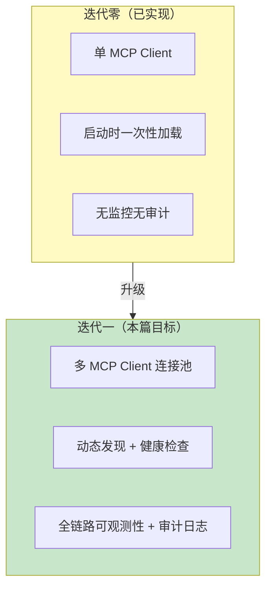
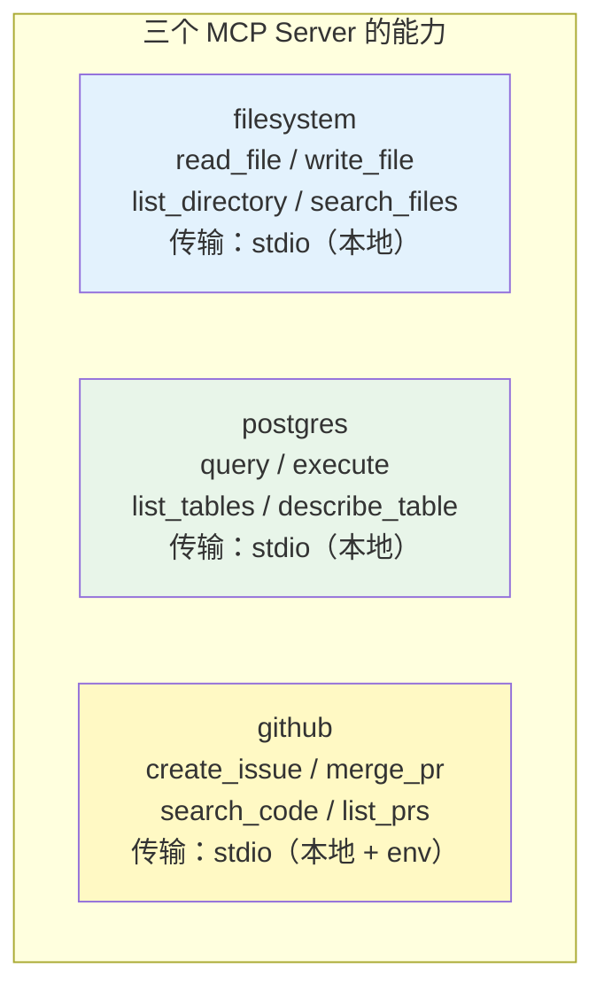
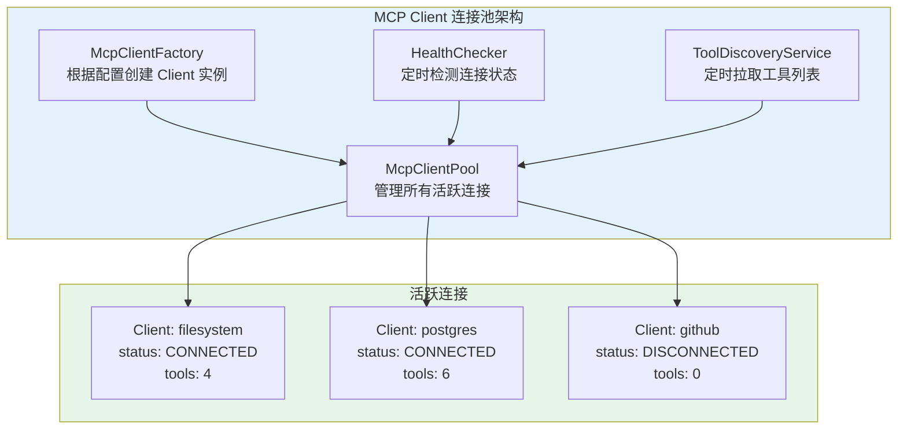
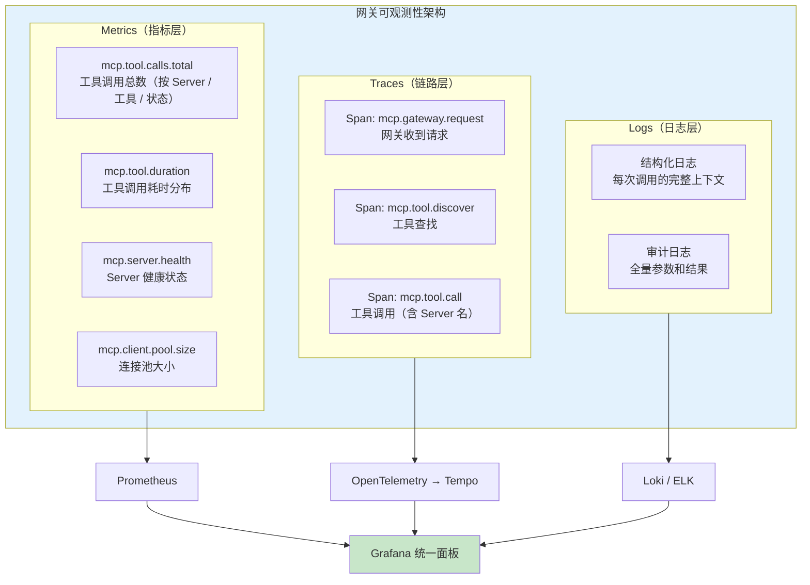
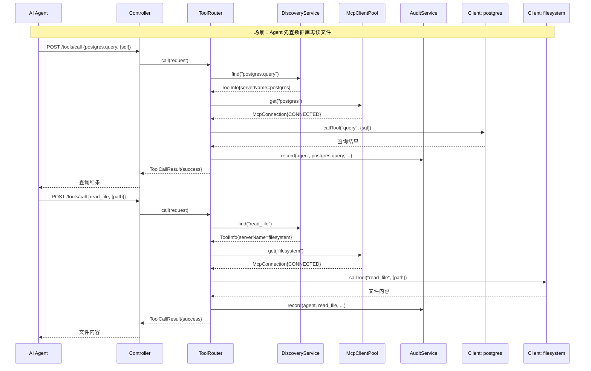

# 02-迭代一：MCP 客户端集成

> **定位**：在最小 Demo 基础上引入多 MCP Server 管理，构建 MCP Client 连接池、动态工具发现、全链路可观测性和审计日志，将网关从"单 Server 玩具"升级为"多 Server 生产级中间件"。
>
> **读者画像**：已完成最小 Demo，需要让网关同时管理多个 MCP Server 并具备生产级可观测能力。
>
> **前置阅读**：[01-最小 Demo 搭建](01-最小Demo搭建.md)、[教程 16-全链路可观测性](../../教程/16-全链路可观测性.md)、[教程 03-工具调用](../../教程/03-工具调用.md)。

---

## 1. 迭代目标

最小 Demo 只对接了一个 filesystem Server。真实场景中，网关需要同时管理多个 MCP Server：



具体交付目标：

| 能力 | 描述 |
|------|------|
| **多 Server 管理** | 同时连接 filesystem、postgres、github 三个 MCP Server |
| **Client 连接池** | 动态创建/销毁 MCP Client 连接，管理连接生命周期 |
| **工具动态发现** | 定期轮询 + 事件通知，工具列表实时更新 |
| **健康检查** | 定时检测各 Server 可用性，自动隔离故障节点 |
| **全链路可观测** | Micrometer Observation + OpenTelemetry，每次调用可追溯 |
| **审计日志** | 全量记录工具调用参数和结果，支持事后回溯 |

---

## 2. 多 MCP Server 配置

### 2.1 扩展 mcp-servers.json

```json
{
  "mcpServers": {
    "filesystem": {
      "command": "npx",
      "args": [
        "-y",
        "@modelcontextprotocol/server-filesystem",
        "/tmp/mcp-workspace"
      ]
    },
    "postgres": {
      "command": "npx",
      "args": [
        "-y",
        "@modelcontextprotocol/server-postgres",
        "postgresql://localhost:5432/demo"
      ]
    },
    "github": {
      "command": "npx",
      "args": ["-y", "@modelcontextprotocol/server-github"],
      "env": {
        "GITHUB_TOKEN": "${GITHUB_TOKEN}"
      }
    }
  }
}
```

三个 Server 的能力差异：



### 2.2 网关配置类

```java
package com.example.mcp.gateway.config;

import org.springframework.boot.context.properties.ConfigurationProperties;

import java.time.Duration;
import java.util.List;

/**
 * 网关配置属性。
 */
@ConfigurationProperties(prefix = "gateway")
public record GatewayProperties(
        Duration toolTimeout,          // 工具调用超时
        Duration healthCheckInterval,  // 健康检查间隔
        Duration discoveryInterval,    // 工具发现轮询间隔
        boolean auditEnabled,          // 是否启用审计
        AuditConfig audit              // 审计配置
) {
    public record AuditConfig(
            boolean logArguments,      // 记录参数
            boolean logResults,        // 记录结果
            int maxResultLength        // 结果最大记录长度（截断）
    ) {}
}
```

```yaml
# application.yml 新增配置
gateway:
  tool-timeout: 30s
  health-check-interval: 30s
  discovery-interval: 60s
  audit-enabled: true
  audit:
    log-arguments: true
    log-results: true
    max-result-length: 4096
```

---

## 3. MCP Client 连接池

### 3.1 连接池架构



### 3.2 MCP Client 连接描述符

每个 Client 连接用 `McpConnection` 描述，封装连接元数据和状态：

```java
package com.example.mcp.gateway.pool;

import com.example.mcp.gateway.model.ToolInfo;
import org.springframework.ai.mcp.McpClient;

import java.time.Instant;
import java.util.List;
import java.util.concurrent.CopyOnWriteArrayList;

/**
 * MCP Client 连接描述符。
 * 一个连接对应一个 MCP Server。
 */
public class McpConnection {

    public enum Status {
        CONNECTING,    // 正在握手
        CONNECTED,     // 已连接，可用
        DEGRADED,      // 降级（健康检查失败但未断开）
        DISCONNECTED   // 已断开
    }

    private final String serverName;
    private final McpClient client;
    private volatile Status status;
    private final Instant connectedAt;
    private Instant lastHealthCheck;
    private int consecutiveFailures;

    // 该 Server 暴露的工具列表（由 DiscoveryService 维护）
    private final List<ToolInfo> tools = new CopyOnWriteArrayList<>();

    public McpConnection(String serverName, McpClient client) {
        this.serverName = serverName;
        this.client = client;
        this.status = Status.CONNECTING;
        this.connectedAt = Instant.now();
    }

    /** 标记健康检查结果 */
    public void recordHealthCheck(boolean healthy) {
        this.lastHealthCheck = Instant.now();
        if (healthy) {
            this.consecutiveFailures = 0;
            this.status = Status.CONNECTED;
        } else {
            this.consecutiveFailures++;
            this.status = this.consecutiveFailures >= 3
                    ? Status.DISCONNECTED
                    : Status.DEGRADED;
        }
    }

    /** 连接是否可用 */
    public boolean isAvailable() {
        return status == Status.CONNECTED || status == Status.DEGRADED;
    }

    // getter 省略...
    public String getServerName() { return serverName; }
    public McpClient getClient() { return client; }
    public Status getStatus() { return status; }
    public List<ToolInfo> getTools() { return tools; }
    public int getConsecutiveFailures() { return consecutiveFailures; }
}
```

### 3.3 MCP Client 连接池实现

```java
package com.example.mcp.gateway.pool;

import org.springframework.ai.mcp.McpClient;
import org.springframework.stereotype.Component;

import java.util.Map;
import java.util.concurrent.ConcurrentHashMap;

/**
 * MCP Client 连接池。
 *
 * 管理所有 MCP Server 的连接，提供：
 * - 按名称获取连接
 * - 动态注册新连接
 * - 移除断开的连接
 */
@Component
public class McpClientPool {

    // serverName → McpConnection
    private final Map<String, McpConnection> connections = new ConcurrentHashMap<>();

    /**
     * 注册一个新连接。
     */
    public void register(String serverName, McpClient client) {
        connections.put(serverName, new McpConnection(serverName, client));
    }

    /**
     * 按名称获取连接。
     * 只返回可用状态的连接（CONNECTED 或 DEGRADED）。
     */
    public McpConnection get(String serverName) {
        McpConnection conn = connections.get(serverName);
        if (conn == null) {
            throw new IllegalArgumentException(
                    "Unknown MCP server: " + serverName +
                    ". Available: " + connections.keySet()
            );
        }
        if (!conn.isAvailable()) {
            throw new IllegalStateException(
                    "MCP server '" + serverName + "' is " + conn.getStatus()
            );
        }
        return conn;
    }

    /**
     * 获取所有活跃连接。
     */
    public Map<String, McpConnection> getAll() {
        return Map.copyOf(connections);
    }

    /**
     * 获取所有可用连接。
     */
    public List<McpConnection> getAvailable() {
        return connections.values().stream()
                .filter(McpConnection::isAvailable)
                .toList();
    }

    /**
     * 移除并关闭连接。
     */
    public void remove(String serverName) {
        McpConnection conn = connections.remove(serverName);
        if (conn != null) {
            try {
                conn.getClient().close();
            } catch (Exception ignored) {
                // 关闭时的异常可以忽略
            }
        }
    }
}
```

### 3.4 连接初始化器

Spring AI MCP Client Starter 会自动创建多个 `McpClient` Bean（每个对应 `mcp-servers.json` 中的一个 Server）。我们需要在应用启动时将这些 Client 注册到连接池。

```java
package com.example.mcp.gateway.pool;

import org.springframework.ai.mcp.McpClient;
import org.springframework.boot.context.event.ApplicationReadyEvent;
import org.springframework.context.event.EventListener;
import org.springframework.stereotype.Component;

import java.util.Map;

/**
 * 启动时将所有 McpClient 注册到连接池。
 */
@Component
public class PoolInitializer {

    // Spring AI 2.0.0 — 自动注入所有 McpClient（每个 Server 一个）
    private final Map<String, McpClient> mcpClients;
    private final McpClientPool pool;

    public PoolInitializer(Map<String, McpClient> mcpClients, McpClientPool pool) {
        this.mcpClients = mcpClients;
        this.pool = pool;
    }

    @EventListener(ApplicationReadyEvent.class)
    public void initialize() {
        for (var entry : mcpClients.entrySet()) {
            String beanName = entry.getKey();
            // Bean 名格式："mcpClient-filesystem" → 提取 serverName
            String serverName = beanName.replace("mcpClient-", "");
            pool.register(serverName, entry.getValue());
        }
    }
}
```

Spring AI 2.0 会为 `mcp-servers.json` 中配置的每个 Server 创建一个 `McpClient` Bean，Bean 名格式为 `mcpClient-{serverName}`。通过注入 `Map<String, McpClient>` 可以一次性获取所有 Client 实例。

---

## 4. 工具动态发现与健康检查

### 4.1 工具发现服务

```java
package com.example.mcp.gateway.registry;

import com.example.mcp.gateway.model.ToolInfo;
import com.example.mcp.gateway.pool.McpClientPool;
import com.example.mcp.gateway.pool.McpConnection;
import org.slf4j.Logger;
import org.slf4j.LoggerFactory;
import org.springframework.scheduling.annotation.Scheduled;
import org.springframework.stereotype.Service;

import java.util.ArrayList;
import java.util.List;
import java.util.Map;
import java.util.concurrent.ConcurrentHashMap;

/**
 * 工具动态发现服务。
 *
 * 定期从所有活跃 MCP Server 拉取工具列表，
 * 维护全局工具注册中心。
 */
@Service
public class ToolDiscoveryService {

    private static final Logger log = LoggerFactory.getLogger(ToolDiscoveryService.class);

    private final McpClientPool pool;
    // globalId → ToolInfo
    private final Map<String, ToolInfo> globalRegistry = new ConcurrentHashMap<>();

    public ToolDiscoveryService(McpClientPool pool) {
        this.pool = pool;
    }

    /**
     * 定时刷新工具列表。
     * 每 60 秒执行一次。
     */
    @Scheduled(fixedDelayString = "${gateway.discovery-interval:60s}")
    public void discoverAll() {
        for (McpConnection conn : pool.getAvailable()) {
            try {
                refreshConnection(conn);
            } catch (Exception e) {
                log.warn("Failed to discover tools from '{}': {}",
                        conn.getServerName(), e.getMessage());
            }
        }
        log.debug("Tool discovery completed. Total tools: {}", globalRegistry.size());
    }

    /**
     * 刷新单个连接的工具列表。
     */
    private void refreshConnection(McpConnection conn) {
        // Spring AI 2.0.0 — 调用 tools/list
        var tools = conn.getClient().listTools();

        // 先清除该 Server 的旧工具
        globalRegistry.keySet().removeIf(
                id -> id.startsWith(conn.getServerName() + ".")
        );

        // 再写入新工具
        List<ToolInfo> toolInfos = new ArrayList<>();
        for (var tool : tools) {
            ToolInfo info = new ToolInfo(
                    conn.getServerName(),
                    tool.name(),
                    tool.description(),
                    tool.inputSchema()
            );
            globalRegistry.put(info.globalId(), info);
            toolInfos.add(info);
        }

        // 更新连接上的工具缓存
        conn.getTools().clear();
        conn.getTools().addAll(toolInfos);

        log.info("Server '{}' provides {} tools", conn.getServerName(), toolInfos.size());
    }

    /**
     * 获取所有已发现的工具。
     */
    public List<ToolInfo> listAll() {
        return List.copyOf(globalRegistry.values());
    }

    /**
     * 按全局 ID 或短名查找工具。
     */
    public ToolInfo find(String name) {
        // 精确匹配：filesystem.read_file
        ToolInfo exact = globalRegistry.get(name);
        if (exact != null) {
            return exact;
        }
        // 模糊匹配：read_file → 遍历查找后缀
        for (ToolInfo tool : globalRegistry.values()) {
            if (tool.name().equals(name)) {
                return tool;
            }
        }
        return null;
    }
}
```

### 4.2 健康检查服务

```java
package com.example.mcp.gateway.pool;

import org.slf4j.Logger;
import org.slf4j.LoggerFactory;
import org.springframework.scheduling.annotation.Scheduled;
import org.springframework.stereotype.Service;

/**
 * MCP Server 健康检查服务。
 *
 * 每 30 秒 ping 一次所有连接，
 * 连续 3 次失败标记为 DISCONNECTED。
 */
@Service
public class HealthChecker {

    private static final Logger log = LoggerFactory.getLogger(HealthChecker.class);
    private static final int FAILURE_THRESHOLD = 3;

    private final McpClientPool pool;

    public HealthChecker(McpClientPool pool) {
        this.pool = pool;
    }

    @Scheduled(fixedDelayString = "${gateway.health-check-interval:30s}")
    public void checkAll() {
        for (McpConnection conn : pool.getAll().values()) {
            boolean healthy = ping(conn);
            conn.recordHealthCheck(healthy);

            if (!healthy) {
                log.warn("Health check failed for '{}': {} consecutive failures",
                        conn.getServerName(), conn.getConsecutiveFailures());
            }
        }
    }

    /**
     * Ping MCP Server。
     * 用 tools/list 作为 ping——如果 Server 能响应，说明连接正常。
     */
    private boolean ping(McpConnection conn) {
        try {
            // 超时 5 秒
            conn.getClient().listTools();
            return true;
        } catch (Exception e) {
            return false;
        }
    }
}
```

### 4.3 工具路由引擎升级

路由引擎需要升级为支持多 Server 路由：

```java
package com.example.mcp.gateway.router;

import com.example.mcp.gateway.model.ToolCallRequest;
import com.example.mcp.gateway.model.ToolCallResult;
import com.example.mcp.gateway.model.ToolInfo;
import com.example.mcp.gateway.pool.McpClientPool;
import com.example.mcp.gateway.pool.McpConnection;
import com.example.mcp.gateway.registry.ToolDiscoveryService;
import org.springframework.stereotype.Component;

import java.util.Map;

@Component
public class ToolRouter {

    private final ToolDiscoveryService discovery;
    private final McpClientPool pool;

    public ToolRouter(ToolDiscoveryService discovery, McpClientPool pool) {
        this.discovery = discovery;
        this.pool = pool;
    }

    public ToolCallResult call(ToolCallRequest request) {
        long start = System.currentTimeMillis();

        // 1. 查找工具
        ToolInfo tool = discovery.find(request.toolName());
        if (tool == null) {
            return ToolCallResult.failure(
                    request.toolName(),
                    "Tool not found: " + request.toolName(),
                    System.currentTimeMillis() - start
            );
        }

        // 2. 找到工具所属的 MCP Server 连接
        McpConnection conn = pool.get(tool.serverName());
        if (conn == null || !conn.isAvailable()) {
            return ToolCallResult.failure(
                    tool.globalId(),
                    "MCP Server '" + tool.serverName() + "' is not available",
                    System.currentTimeMillis() - start
            );
        }

        try {
            // 3. 通过对应的 MCP Client 调用工具
            var result = conn.getClient().callTool(
                    tool.name(),
                    Map.copyOf(request.arguments())
            );

            return ToolCallResult.success(
                    tool.globalId(),
                    result,
                    System.currentTimeMillis() - start
            );

        } catch (Exception e) {
            return ToolCallResult.failure(
                    tool.globalId(),
                    "Tool execution failed: " + e.getMessage(),
                    System.currentTimeMillis() - start
            );
        }
    }
}
```

关键变化：不再是"工具名 → 单一 McpClient"，而是"工具名 → 找到 ToolInfo → 从 ToolInfo 取出 serverName → 从连接池获取对应 Client → 执行调用"。

---

## 5. 全链路可观测性

### 5.1 可观测性架构

> **全链路可观测性体系** → [教程 16-全链路可观测性](../../教程/16-全链路可观测性.md)：该教程详细讲解了 Spring AI 2.0 原生可观测性体系——Micrometer Observation、gen_ai 语义约定、OpenTelemetry 集成、Prometheus + Grafana 监控面板搭建。本项目的可观测性设计直接基于该教程的架构。



### 5.2 自定义 Observation 配置

```java
package com.example.mcp.gateway.config;

import io.micrometer.observation.ObservationRegistry;
import io.micrometer.core.instrument.MeterRegistry;
import org.springframework.context.annotation.Bean;
import org.springframework.context.annotation.Configuration;

@Configuration
public class ObservationConfig {

    /**
     * 网关自定义指标——在 MeterRegistry 中预注册关键指标。
     */
    @Bean
    public GatewayMetrics gatewayMetrics(MeterRegistry meterRegistry) {
        return new GatewayMetrics(meterRegistry);
    }
}
```

```java
package com.example.mcp.gateway.config;

import io.micrometer.core.instrument.Counter;
import io.micrometer.core.instrument.MeterRegistry;
import io.micrometer.core.instrument.Timer;
import org.springframework.stereotype.Component;

import java.time.Duration;

/**
 * 网关核心指标定义。
 */
@Component
public class GatewayMetrics {

    private final MeterRegistry registry;

    // 工具调用计数器
    private final Counter toolCallCounter;
    // 工具调用计时器
    private final Timer toolCallTimer;
    // 工具发现计数器
    private final Counter discoveryCounter;

    public GatewayMetrics(MeterRegistry registry) {
        this.registry = registry;

        this.toolCallCounter = Counter.builder("mcp.tool.calls")
                .description("Total MCP tool calls")
                .tag("gateway", "mcp-tool-gateway")
                .register(registry);

        this.toolCallTimer = Timer.builder("mcp.tool.duration")
                .description("MCP tool call duration")
                .publishPercentiles(0.5, 0.95, 0.99)
                .register(registry);

        this.discoveryCounter = Counter.builder("mcp.tool.discoveries")
                .description("Total tool discovery cycles")
                .register(registry);
    }

    /** 记录一次工具调用 */
    public void recordToolCall(String serverName, String toolName,
                                boolean success, Duration duration) {
        Counter.builder("mcp.tool.calls")
                .tag("server", serverName)
                .tag("tool", toolName)
                .tag("result", success ? "success" : "failure")
                .register(registry)
                .increment();

        toolCallTimer.record(duration);
    }

    /** 记录一次工具发现周期 */
    public void recordDiscovery() {
        discoveryCounter.increment();
    }
}
```

### 5.3 在路由引擎中集成可观测性

```java
// ToolRouter.java 中增加可观测性逻辑

@Component
public class ToolRouter {

    private final ToolDiscoveryService discovery;
    private final McpClientPool pool;
    private final GatewayMetrics metrics;
    private final ObservationRegistry observationRegistry;

    public ToolRouter(ToolDiscoveryService discovery,
                      McpClientPool pool,
                      GatewayMetrics metrics,
                      ObservationRegistry observationRegistry) {
        this.discovery = discovery;
        this.pool = pool;
        this.metrics = metrics;
        this.observationRegistry = observationRegistry;
    }

    public ToolCallResult call(ToolCallRequest request) {
        long start = System.nanoTime();

        // 使用 Micrometer Observation 包裹整个调用过程
        return Observation.createNotStarted("mcp.tool.call", observationRegistry)
                .lowCardinalityKeyValue("tool", request.toolName())
                .observe(() -> {
                    long startTime = System.currentTimeMillis();
                    ToolCallResult result = doCall(request);
                    Duration duration = Duration.ofMillis(
                            System.currentTimeMillis() - startTime
                    );
                    metrics.recordToolCall(
                            extractServerName(request.toolName()),
                            request.toolName(),
                            result.success(),
                            duration
                    );
                    return result;
                });
    }

    private ToolCallResult doCall(ToolCallRequest request) {
        // ... 原有路由和调用逻辑 ...
    }

    private String extractServerName(String toolName) {
        int dot = toolName.indexOf('.');
        return dot > 0 ? toolName.substring(0, dot) : "unknown";
    }
}
```

`Observation.createNotStarted(...).observe(() -> {...})` 是 Micrometer 的核心 API。它会自动创建 Span（用于分布式追踪）和 Metrics（用于计时），无需手动埋点。在 Grafana Tempo 或 Zipkin 中可以看到完整的调用链路。

> **Observation 深入** → [教程 16-全链路可观测性](../../教程/16-全链路可观测性.md) 第 2 节讲解了 Spring AI 自动产生的 Span 层级结构，以及如何通过 ObservationRegistry 自定义 Span。

---

## 6. 审计日志

### 6.1 审计日志数据模型

```java
package com.example.mcp.gateway.audit;

import jakarta.persistence.*;
import java.time.Instant;

/**
 * 审计日志实体——记录每次工具调用的完整信息。
 */
@Entity
@Table(name = "audit_logs", indexes = {
        @Index(name = "idx_called_at", columnList = "calledAt"),
        @Index(name = "idx_tool_name", columnList = "toolName"),
        @Index(name = "idx_status", columnList = "status")
})
public class AuditLog {

    @Id
    @GeneratedValue(strategy = GenerationType.IDENTITY)
    private Long id;

    @Column(nullable = false)
    private String agentId;          // 调用方标识

    @Column(nullable = false)
    private String toolName;         // 工具全名

    @Column(length = 4096)
    private String inputParams;      // JSON 格式参数

    @Column(length = 4096)
    private String outputResult;     // JSON 格式结果

    @Column(nullable = false)
    private String status;           // SUCCESS / FAILED

    @Column(nullable = false)
    private long durationMs;         // 执行耗时

    @Column(nullable = false)
    private Instant calledAt;        // 调用时间

    private String errorMessage;     // 失败原因

    // getters and setters 省略...
    public String getToolName() { return toolName; }
    public String getStatus() { return status; }
    public Instant getCalledAt() { return calledAt; }
}
```

### 6.2 审计服务

```java
package com.example.mcp.gateway.audit;

import com.fasterxml.jackson.core.JsonProcessingException;
import com.fasterxml.jackson.databind.ObjectMapper;
import org.slf4j.Logger;
import org.slf4j.LoggerFactory;
import org.springframework.scheduling.annotation.Async;
import org.springframework.stereotype.Service;

import java.time.Instant;
import java.util.Map;

/**
 * 审计日志服务。
 *
 * 使用异步写入，不阻塞主调用链。
 */
@Service
public class AuditService {

    private static final Logger log = LoggerFactory.getLogger(AuditService.class);

    private final AuditRepository repository;
    private final ObjectMapper objectMapper;

    public AuditService(AuditRepository repository, ObjectMapper objectMapper) {
        this.repository = repository;
        this.objectMapper = objectMapper;
    }

    /**
     * 异步记录审计日志。
     * Java 21 虚拟线程让 @Async 不再需要额外的线程池配置。
     */
    @Async
    public void record(
            String agentId,
            String toolName,
            Map<String, Object> inputParams,
            Object outputResult,
            boolean success,
            long durationMs,
            String errorMessage
    ) {
        try {
            AuditLog entry = new AuditLog();
            entry.setAgentId(agentId != null ? agentId : "anonymous");
            entry.setToolName(toolName);
            entry.setInputParams(truncate(toJson(inputParams), 4096));
            entry.setOutputResult(truncate(toJson(outputResult), 4096));
            entry.setStatus(success ? "SUCCESS" : "FAILED");
            entry.setDurationMs(durationMs);
            entry.setCalledAt(Instant.now());
            entry.setErrorMessage(errorMessage);

            repository.save(entry);

        } catch (Exception e) {
            // 审计日志写入失败不能影响主业务
            log.error("Failed to write audit log for tool '{}': {}",
                    toolName, e.getMessage());
        }
    }

    private String toJson(Object obj) {
        try {
            return objectMapper.writeValueAsString(obj);
        } catch (JsonProcessingException e) {
            return "{\"error\": \"serialization failed\"}";
        }
    }

    private String truncate(String s, int maxLen) {
        if (s == null) return null;
        return s.length() > maxLen ? s.substring(0, maxLen) + "..." : s;
    }
}
```

关键设计：审计日志使用 `@Async` 异步写入。在 Java 21 虚拟线程模式下，Spring Boot 4.1 的 `@Async` 会自动使用虚拟线程执行，不需要配置 `ThreadPoolTaskExecutor`——这意味着审计日志写入完全不会阻塞 HTTP 响应。

> **审计与可观测性深度结合** → [教程 16-全链路可观测性](../../教程/16-全链路可观测性.md)：讲解了如何将审计日志与 Micrometer Traces 关联——每条审计日志携带 traceId，可以在 Grafana 中从审计日志直接跳转到对应的调用链路。

### 6.3 在路由引擎中集成审计

```java
// ToolRouter 的 doCall 方法增加审计逻辑

private ToolCallResult doCall(ToolCallRequest request) {
    long start = System.currentTimeMillis();

    ToolInfo tool = discovery.find(request.toolName());
    if (tool == null) {
        ToolCallResult failure = ToolCallResult.failure(
                request.toolName(),
                "Tool not found: " + request.toolName(),
                System.currentTimeMillis() - start
        );
        // 记录失败的审计日志
        auditService.record(
                "anonymous",
                request.toolName(),
                request.arguments(),
                null,
                false,
                failure.durationMs(),
                failure.errorMessage()
        );
        return failure;
    }

    McpConnection conn = pool.get(tool.serverName());

    try {
        var result = conn.getClient().callTool(
                tool.name(),
                Map.copyOf(request.arguments())
        );

        ToolCallResult success = ToolCallResult.success(
                tool.globalId(),
                result,
                System.currentTimeMillis() - start
        );

        // 记录成功的审计日志
        auditService.record(
                "anonymous",
                tool.globalId(),
                request.arguments(),
                result,
                true,
                success.durationMs(),
                null
        );

        return success;

    } catch (Exception e) {
        ToolCallResult failure = ToolCallResult.failure(
                tool.globalId(),
                "Tool execution failed: " + e.getMessage(),
                System.currentTimeMillis() - start
        );

        auditService.record(
                "anonymous",
                tool.globalId(),
                request.arguments(),
                null,
                false,
                failure.durationMs(),
                failure.errorMessage()
        );

        return failure;
    }
}
```

---

## 7. 健康检查端点

利用 Spring Boot Actuator 暴露网关健康状态：

```java
package com.example.mcp.gateway.pool;

import org.springframework.boot.actuate.health.Health;
import org.springframework.boot.actuate.health.HealthIndicator;
import org.springframework.stereotype.Component;

import java.util.HashMap;
import java.util.Map;

/**
 * 自定义健康指标——报告 MCP Server 连接状态。
 */
@Component
public class McpPoolHealthIndicator implements HealthIndicator {

    private final McpClientPool pool;

    public McpPoolHealthIndicator(McpClientPool pool) {
        this.pool = pool;
    }

    @Override
    public Health health() {
        var all = pool.getAll();
        Map<String, Object> details = new HashMap<>();
        boolean allHealthy = true;

        for (var entry : all.entrySet()) {
            String name = entry.getKey();
            McpConnection conn = entry.getValue();

            Map<String, Object> serverDetail = new HashMap<>();
            serverDetail.put("status", conn.getStatus().toString());
            serverDetail.put("tools", conn.getTools().size());
            serverDetail.put("failures", conn.getConsecutiveFailures());
            details.put(name, serverDetail);

            if (!conn.isAvailable()) {
                allHealthy = false;
            }
        }

        details.put("totalServers", all.size());
        details.put("availableServers", pool.getAvailable().size());

        if (allHealthy) {
            return Health.up().withDetails(details).build();
        } else {
            return Health.down().withDetails(details).build();
        }
    }
}
```

访问 `GET /actuator/health` 即可看到所有 MCP Server 的实时状态：

```json
{
  "status": "UP",
  "components": {
    "mcpPool": {
      "status": "UP",
      "details": {
        "filesystem": {
          "status": "CONNECTED",
          "tools": 4,
          "failures": 0
        },
        "postgres": {
          "status": "CONNECTED",
          "tools": 6,
          "failures": 0
        },
        "github": {
          "status": "DEGRADED",
          "tools": 8,
          "failures": 1
        },
        "totalServers": 3,
        "availableServers": 3
      }
    }
  }
}
```

---

## 8. 多 Server 调用流程



---

## 9. 迭代验证

### 9.1 功能验证

```bash
# 1. 查看所有工具（应该看到 filesystem + postgres + github 的工具）
curl http://localhost:8080/tools | jq '. | length'
# 期望：18（4 + 6 + 8）

# 2. 查看健康状态
curl http://localhost:8080/actuator/health | jq '.components.mcpPool.details'

# 3. 调用 postgres 工具
curl -X POST http://localhost:8080/tools/call \
  -H "Content-Type: application/json" \
  -d '{"toolName": "postgres.query", "arguments": {"sql": "SELECT 1"}}'

# 4. 查看审计日志（需要 JPA + H2）
curl http://localhost:8080/actuator/auditevents
```

### 9.2 可观测性验证

```bash
# 查看指标（Prometheus 格式）
curl http://localhost:8080/actuator/prometheus | grep mcp_tool

# 期望输出：
# mcp_tool_calls_total{result="success",server="filesystem",tool="read_file"} 5.0
# mcp_tool_duration_seconds_count{quantile="0.5"} 5.0
# mcp_tool_duration_seconds{quantile="0.95"} 0.045
```

---

## 10. 总结

本篇将网关从单 Server 升级为多 Server 生产级中间件：

1. **多 Server 管理**：通过 `mcp-servers.json` 配置三个 MCP Server（filesystem + postgres + github），Spring AI 自动为每个 Server 创建独立的 `McpClient`。

2. **连接池设计**：`McpConnection` 封装连接状态（CONNECTING/CONNECTED/DEGRADED/DISCONNECTED），`McpClientPool` 提供按名称获取、动态注册、故障隔离能力。健康检查每 30 秒 ping 一次，连续 3 次失败自动隔离。

3. **动态发现**：`ToolDiscoveryService` 每 60 秒从所有活跃 Server 拉取工具列表，维护全局注册中心。新 Server 上线或工具变更都能自动感知。

4. **全链路可观测**：通过 `GatewayMetrics` 注册 `mcp.tool.calls`、`mcp.tool.duration` 等核心指标，通过 Micrometer Observation 为每次调用创建 Span。所有指标可通过 Prometheus 抓取，在 Grafana 可视化。

5. **审计日志**：`AuditService` 使用 `@Async` + Java 21 虚拟线程异步写入 JPA 审计表，全量记录调用参数和结果，不阻塞主调用链。

迭代一完成后，网关具备了生产级的多 Server 管理和可观测能力。但还有一个缺口：网关目前只是工具消费者（Client），尚未将自己的业务能力暴露为 MCP Server。下一篇 [03-迭代二-自定义 MCP 服务端](03-迭代二-自定义MCP服务端.md) 将解决这个问题，并引入容错、安全和多模型策略。
