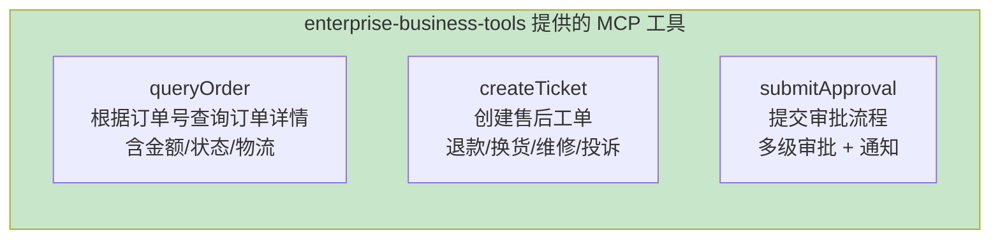
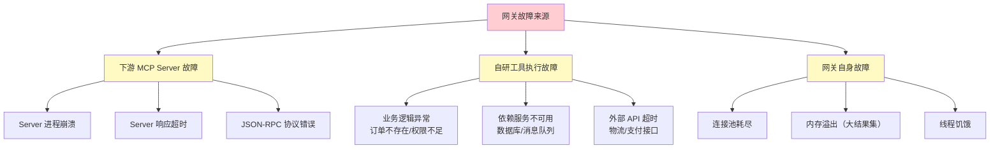
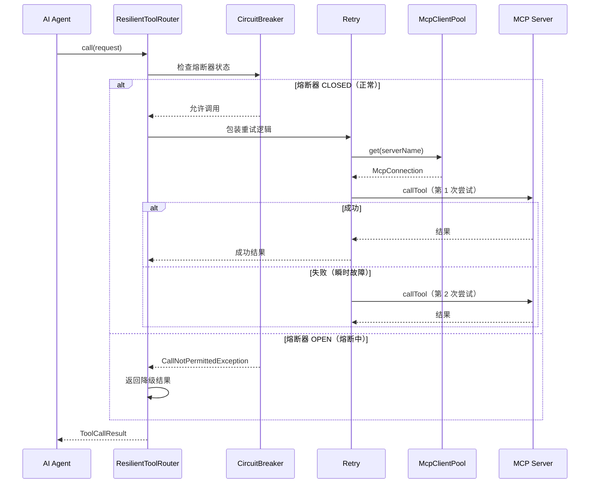
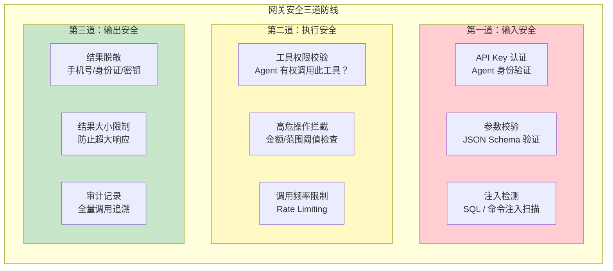
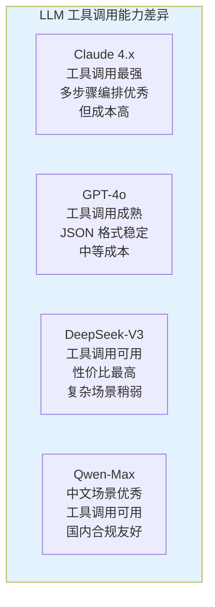
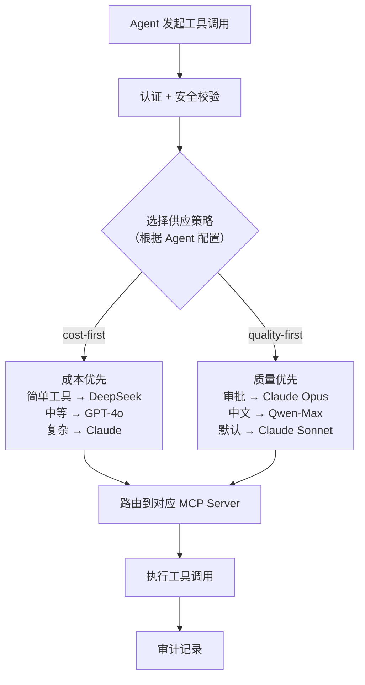
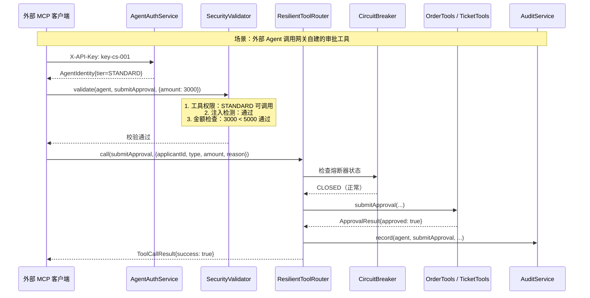

# 03-自定义 MCP 服务端

> **定位**：在网关中内建自研业务 MCP Server，将企业内部能力（订单查询、工单创建、审批流）暴露为 MCP 工具，同时叠加容错与弹性设计、安全与权限控制、多模型协作策略，使网关同时具备工具消费（Client）和工具提供（Server）双重能力。本文给出**完整可手写代码**（一行不省略）——业务服务、`@Tool` 工具、`ToolCallbackProvider` 暴露配置、熔断路由、认证安全、多模型策略全部 Java 类 + `pom.xml` 新增依赖 + `application.yml` 新增配置。
>
> **读者画像**：已完成迭代一，需要让网关对外暴露自研工具并达到生产级安全与弹性标准的开发者。
>
> **前置阅读**：[02-MCP 客户端集成](02-MCP客户端集成.md)、[教程 30-容错与弹性设计](../../教程/30-容错与弹性设计.md)、[教程 31-安全与权限控制](../../教程/31-安全与权限控制.md)。API 真实性以 [附录 05-SpringAI2-API基准](../../附录/05-SpringAI2-API基准/01-MCP真实API与坐标.md) 为准。

---

## 1. 四问

| 问 | 答 |
|----|----|
| **新增了什么需求** | ① 把订单查询/工单创建/审批流暴露为标准 MCP Server ② 每个 Server 独立熔断 + 重试 + 降级 ③ API Key 认证 + 工具白名单 + 注入检测 + 高危阈值 ④ 多模型供应策略框架 |
| **影响了哪些模块** | 新增 `tools/`、`resilience/`、`auth/`、`strategy/`；`ToolRouter` 升级为 `ResilientToolRouter`；`SecureToolGatewayController` 替换旧 `/tools/call` |
| **架构如何演进** | 纯 Client → Client + Server 双重身份；直调 → 熔断/重试/降级；匿名 → Agent 认证 + 白名单；单模型 → 策略化模型路由 |
| **上一版痛点是什么** | ① 无权限认证（`agentId` 硬编码 anonymous）② 无容错（下游慢/挂直接失败）③ 网关只消费不产出（业务能力无法被外部 Agent 复用）④ 无法按 Agent 归因成本 |

## 2. 目标与量化验收

| # | 目标 | 验收 |
|---|------|------|
| 1 | 自建 Server | 外部 MCP 客户端（mcp-cli）连 `http://localhost:8080` 能看到 queryOrder / createTicket / queryTicket / submitApproval 四个工具 |
| 2 | 容错 | 停掉某个下游 Server，调用其工具返回降级结果（`degraded: true`）而非 5xx；连续失败后熔断器 OPEN |
| 3 | 安全认证 | 无 `X-API-Key` → 401；白名单外工具 → SecurityException；STANDARD 单笔超 5000 → SecurityException |
| 4 | 多模型策略 | `StrategySelector.selectModel("cost-first", tool, ctx)` 返回 deepseek-v3/gpt-4o/claude-sonnet-4 |
| 5 | 可用性 | 单 Server 故障不影响其他 Server 的工具调用（隔离达标） |

**本迭代明确不做**：不做 HITL 人工审批（落点在 `ToolCallingManager`，见 [教程 28-Human-in-the-Loop与审批流](../../教程/28-Human-in-the-Loop与审批流.md)）、不做 Redis 会话、不做网关多实例。

## 3. 完整代码（照抄即可，一行不省略）

### 3.1 `pom.xml` 新增依赖

需在 pom.xml 中添加依赖：

```xml
<!-- 需在 pom.xml 中添加依赖：MCP 服务端（WebFlux 变体）+ Resilience4j 容错 -->
<dependency>
    <groupId>org.springframework.ai</groupId>
    <artifactId>spring-ai-starter-mcp-server-webflux</artifactId>
</dependency>

<dependency>
    <groupId>io.github.resilience4j</groupId>
    <artifactId>resilience4j-spring-boot3</artifactId>
    <version>2.2.0</version>
</dependency>
```

> 版本说明：`spring-ai-starter-mcp-server-webflux` 是附录 05-01 §1 列的 WebFlux 服务端变体（本项目 WebFlux 栈，不用 Servlet 版的 `spring-ai-starter-mcp-server`）。

### 3.2 `application.yml` 新增 MCP Server 配置

```yaml
# application.yml 新增 MCP Server 配置（追加到 spring.ai.mcp 下）
spring:
  ai:
    mcp:
      server:
        name: "enterprise-business-tools"
        version: "1.0.0"
        # ⚠ 修正（审计 2026-08-14）: HTTP+SSE 已废弃，现行标准是 Streamable HTTP 单端点
        transport: streamable-http
```

> **MCP 服务端详解** → [教程 11-MCP协议](../../教程/11-MCP协议.md) 第 4 节讲解了 `spring-ai-starter-mcp-server` 的配置方式，以及外部 MCP 客户端如何连接和发现工具。
> ⚠ 修正（审计 2026-08-14）: `@Tool` **不会**自动注册为 MCP 工具——必须显式声明 `ToolCallbackProvider` Bean（`MethodToolCallbackProvider.builder().toolObjects(...)`），见 §3.5（附录 05-01 §3）。

### 3.3 业务服务与领域模型

网关自建三个核心业务工具，覆盖企业常见场景：



先定义领域模型（Record）与业务服务（内存实现）：

```java
package com.example.mcp.gateway.tools;

import java.math.BigDecimal;

/**
 * 订单详情领域模型。
 */
public record OrderDetail(
        String orderId,
        BigDecimal amount,
        String status,
        String trackingNo
) {}
```

```java
package com.example.mcp.gateway.tools;

import org.springframework.stereotype.Service;

import java.math.BigDecimal;
import java.util.Map;
import java.util.concurrent.ConcurrentHashMap;

/**
 * 订单业务服务——v3 用内存 Map 模拟，生产可换数据库实现。
 */
@Service
public class OrderService {

    private final Map<String, OrderDetail> store = new ConcurrentHashMap<>();

    public OrderService() {
        store.put("ORD-001", new OrderDetail("ORD-001", new BigDecimal("199.00"), "已发货", "SF1234567890"));
        store.put("ORD-002", new OrderDetail("ORD-002", new BigDecimal("599.00"), "待支付", null));
    }

    public OrderDetail queryDetail(String orderId) {
        return store.get(orderId);
    }
}
```

```java
package com.example.mcp.gateway.tools;

import java.time.Instant;

/**
 * 售后工单领域模型。
 */
public record Ticket(
        String ticketId,
        String customerId,
        String description,
        String type,
        String status,
        Instant createdAt
) {}
```

```java
package com.example.mcp.gateway.tools;

/**
 * 工单状态查询结果。
 */
public record TicketStatus(
        String ticketId,
        String status,
        String progress
) {}
```

```java
package com.example.mcp.gateway.tools;

import org.springframework.stereotype.Service;

import java.time.Instant;
import java.util.Map;
import java.util.concurrent.ConcurrentHashMap;
import java.util.concurrent.atomic.AtomicInteger;

/**
 * 工单业务服务——创建与查询，内存实现。
 */
@Service
public class TicketService {

    private final Map<String, Ticket> store = new ConcurrentHashMap<>();
    private final AtomicInteger seq = new AtomicInteger(1000);

    public Ticket create(String customerId, String description, String type) {
        Ticket ticket = new Ticket(
                "TK-" + seq.incrementAndGet(),
                customerId,
                description,
                type,
                "OPEN",
                Instant.now());
        store.put(ticket.ticketId(), ticket);
        return ticket;
    }

    public TicketStatus queryStatus(String ticketId) {
        Ticket ticket = store.get(ticketId);
        if (ticket == null) {
            return null;
        }
        return new TicketStatus(ticket.ticketId(), ticket.status(), "处理中，排队 2 单");
    }
}
```

```java
package com.example.mcp.gateway.tools;

import java.time.Instant;

/**
 * 审批结果。
 */
public record ApprovalResult(
        String approvalId,
        String status,
        String approver,
        String message,
        Instant submittedAt
) {}
```

```java
package com.example.mcp.gateway.tools;

import org.springframework.stereotype.Service;

import java.time.Instant;
import java.util.concurrent.atomic.AtomicInteger;

/**
 * 审批业务服务——多级审批：金额超 10000 走总监，否则经理。
 */
@Service
public class ApprovalService {

    private final AtomicInteger seq = new AtomicInteger(5000);

    public ApprovalResult submit(String applicantId, String type, Double amount, String reason) {
        String approver = (amount != null && amount > 10000) ? "DIRECTOR" : "MANAGER";
        return new ApprovalResult(
                "AP-" + seq.incrementAndGet(),
                "PENDING",
                approver,
                "已提交" + type + "审批，金额 " + amount + " 元，待 " + approver + " 审批",
                Instant.now());
    }
}
```

### 3.4 业务工具定义 `OrderTools.java` / `TicketTools.java` / `ApprovalTools.java`

```java
package com.example.mcp.gateway.tools;

import org.springframework.ai.tool.annotation.Tool;
import org.springframework.ai.tool.annotation.ToolParam;
import org.springframework.stereotype.Component;

/**
 * 订单工具——暴露为 MCP 工具。
 * 外部 MCP 客户端连接网关后，自动发现并可以调用这些工具。
 */
@Component
public class OrderTools {

    private final OrderService orderService;

    public OrderTools(OrderService orderService) {
        this.orderService = orderService;
    }

    // Spring AI 2.0.0 — @Tool 注解声明工具；暴露为 MCP 需显式 ToolCallbackProvider（见 §3.5）
    @Tool(description = "根据订单号查询订单详情，包括金额、状态和物流信息。订单号格式：ORD-XXXXXX")
    public OrderDetail queryOrder(
            @ToolParam(description = "订单号，格式 ORD-XXXXXX") String orderId
    ) {
        return orderService.queryDetail(orderId);
    }
}
```

```java
package com.example.mcp.gateway.tools;

import org.springframework.ai.tool.annotation.Tool;
import org.springframework.ai.tool.annotation.ToolParam;
import org.springframework.stereotype.Component;

/**
 * 工单工具——创建售后工单。
 */
@Component
public class TicketTools {

    private final TicketService ticketService;

    public TicketTools(TicketService ticketService) {
        this.ticketService = ticketService;
    }

    @Tool(description = "创建售后工单，需要客户ID、问题描述和工单类型")
    public Ticket createTicket(
            @ToolParam(description = "客户 ID") String customerId,
            @ToolParam(description = "问题描述") String description,
            @ToolParam(description = "工单类型：退款、换货、维修、投诉") String type
    ) {
        return ticketService.create(customerId, description, type);
    }

    @Tool(description = "根据工单号查询工单当前状态和处理进度")
    public TicketStatus queryTicket(
            @ToolParam(description = "工单号") String ticketId
    ) {
        return ticketService.queryStatus(ticketId);
    }
}
```

```java
package com.example.mcp.gateway.tools;

import org.springframework.ai.tool.annotation.Tool;
import org.springframework.ai.tool.annotation.ToolParam;
import org.springframework.stereotype.Component;

/**
 * 审批工具——提交审批流程。
 * 高危工具，需要额外的权限校验（SecurityValidator §5.3）。
 */
@Component
public class ApprovalTools {

    private final ApprovalService approvalService;

    public ApprovalTools(ApprovalService approvalService) {
        this.approvalService = approvalService;
    }

    @Tool(description = "提交审批流程，支持多级审批。注意：金额超过 10000 元需要总监审批。")
    public ApprovalResult submitApproval(
            @ToolParam(description = "申请人 ID") String applicantId,
            @ToolParam(description = "审批类型：报销、采购、合同") String type,
            @ToolParam(description = "金额（元）") Double amount,
            @ToolParam(description = "事由说明") String reason
    ) {
        return approvalService.submit(applicantId, type, amount, reason);
    }
}
```

### 3.5 MCP Server 暴露配置 `McpServerConfig.java`（关键步骤，缺它不生效）

> ⚠ **审计教训**：`@Component + @Tool` **不会**自动注册到内建 MCP Server——必须显式声明 `ToolCallbackProvider` Bean（附录 05-01 §3）。`spring-ai-starter-mcp-server-webflux` 启动时扫描所有 `ToolCallbackProvider` Bean，把其中的工具暴露为 MCP 工具。

```java
package com.example.mcp.gateway.config;

import com.example.mcp.gateway.tools.ApprovalTools;
import com.example.mcp.gateway.tools.OrderTools;
import com.example.mcp.gateway.tools.TicketTools;
import org.springframework.ai.tool.method.MethodToolCallbackProvider;   // Spring AI 2.0.0 真实包
import org.springframework.ai.tool.ToolCallbackProvider;   // Spring AI 2.0.0 真实包
import org.springframework.context.annotation.Bean;
import org.springframework.context.annotation.Configuration;

/**
 * MCP Server 工具暴露配置。
 *
 * ⚠ 修正（审计 2026-08-14）: @Tool 不会自动注册到内建 MCP Server——
 * 必须显式声明 ToolCallbackProvider Bean（附录 05-01 §3）。缺 Provider 不生效。
 */
@Configuration
public class McpServerConfig {

    @Bean
    public ToolCallbackProvider orderToolProvider(OrderTools orderTools) {
        return MethodToolCallbackProvider.builder().toolObjects(orderTools).build();
    }

    @Bean
    public ToolCallbackProvider ticketToolProvider(TicketTools ticketTools) {
        return MethodToolCallbackProvider.builder().toolObjects(ticketTools).build();
    }

    @Bean
    public ToolCallbackProvider approvalToolProvider(ApprovalTools approvalTools) {
        return MethodToolCallbackProvider.builder().toolObjects(approvalTools).build();
    }
}
```

Spring AI 自动将这些 `@Tool` 方法注册到内建 MCP Server。外部 MCP 客户端连接 `http://gateway:8080` 后，通过 `tools/list` 就能看到 `queryOrder`、`createTicket`、`queryTicket`、`submitApproval` 四个工具。

---

## 4. 容错与弹性设计

> **容错设计完整方法论** → [教程 30-容错与弹性设计](../../教程/30-容错与弹性设计.md)：该教程系统讲解了 Agent 系统的故障分类（LLM/工具/基础设施/应用层）、五大容错策略（超时/重试/降级/熔断/限流），以及 Spring Retry + Resilience4j 的集成方案。本节的容错设计直接基于该教程的策略框架。

### 4.1 故障场景分析



### 4.2 熔断器工厂 `CircuitBreakerFactory.java`

使用 Resilience4j 为每个 MCP Server 连接配置独立的熔断器：

```java
package com.example.mcp.gateway.resilience;

import io.github.resilience4j.circuitbreaker.CircuitBreaker;
import io.github.resilience4j.circuitbreaker.CircuitBreakerConfig;
import org.slf4j.Logger;
import org.slf4j.LoggerFactory;
import org.springframework.stereotype.Component;

import java.time.Duration;
import java.util.Map;
import java.util.concurrent.ConcurrentHashMap;

/**
 * 熔断器工厂——为每个 MCP Server 创建独立的熔断器。
 */
@Component
public class CircuitBreakerFactory {

    private static final Logger log = LoggerFactory.getLogger(CircuitBreakerFactory.class);

    private final Map<String, CircuitBreaker> breakers = new ConcurrentHashMap<>();

    /**
     * 为指定 Server 获取或创建熔断器。
     */
    public CircuitBreaker getOrCreate(String serverName) {
        return breakers.computeIfAbsent(serverName, this::create);
    }

    private CircuitBreaker create(String serverName) {
        CircuitBreakerConfig config = CircuitBreakerConfig.custom()
                .failureRateThreshold(50)                        // 失败率阈值：50% 则打开
                .slowCallDurationThreshold(Duration.ofSeconds(5)) // 超过 5 秒视为慢调用
                .slowCallRateThreshold(30)                        // 慢调用率阈值：30% 则打开
                .permittedNumberOfCallsInHalfOpenState(3)         // 半开状态允许请求数
                .slidingWindowSize(20)                            // 滑动窗口：最近 20 次
                .waitDurationInOpenState(Duration.ofSeconds(30))  // 打开后 30 秒尝试半开
                .build();

        CircuitBreaker breaker = CircuitBreaker.of("mcp-" + serverName, config);

        // 注册状态变更监听
        breaker.getEventPublisher()
                .onStateTransition(e ->
                        log.warn("[CircuitBreaker] {}: {} → {}",
                                serverName,
                                e.getStateTransition().getFromState(),
                                e.getStateTransition().getToState()));

        return breaker;
    }
}
```

### 4.3 容错路由 `ResilientToolRouter.java`

集成熔断 + 重试 + 降级的增强版路由引擎：

```java
package com.example.mcp.gateway.router;

import com.example.mcp.gateway.model.ToolCallRequest;
import com.example.mcp.gateway.model.ToolCallResult;
import com.example.mcp.gateway.model.ToolInfo;
import com.example.mcp.gateway.pool.McpClientPool;
import com.example.mcp.gateway.pool.McpConnection;
import com.example.mcp.gateway.registry.ToolDiscoveryService;
import com.example.mcp.gateway.resilience.CircuitBreakerFactory;
import io.github.resilience4j.circuitbreaker.CallNotPermittedException;
import io.github.resilience4j.decorators.Decorators;
import io.github.resilience4j.retry.Retry;
import io.github.resilience4j.retry.RetryConfig;
import io.modelcontextprotocol.spec.McpSchema.CallToolRequest;
import org.springframework.stereotype.Component;

import java.time.Duration;
import java.time.Instant;
import java.util.List;
import java.util.Map;
import java.util.function.Supplier;

/**
 * 增强版工具路由引擎——集成熔断 + 重试 + 降级。
 */
@Component
public class ResilientToolRouter {

    private final ToolDiscoveryService discovery;
    private final McpClientPool pool;
    private final CircuitBreakerFactory cbFactory;

    public ResilientToolRouter(ToolDiscoveryService discovery,
                               McpClientPool pool,
                               CircuitBreakerFactory cbFactory) {
        this.discovery = discovery;
        this.pool = pool;
        this.cbFactory = cbFactory;
    }

    public ToolCallResult call(ToolCallRequest request) {
        long start = System.currentTimeMillis();

        // 1. 查找工具
        ToolInfo tool = discovery.find(request.toolName());
        if (tool == null) {
            return ToolCallResult.failure(
                    request.toolName(),
                    "Tool not found: " + request.toolName(),
                    System.currentTimeMillis() - start);
        }

        // 2. 获取连接
        McpConnection conn = pool.get(tool.serverName());
        if (conn == null || !conn.isAvailable()) {
            return ToolCallResult.failure(
                    tool.globalId(),
                    "MCP Server not available: " + tool.serverName(),
                    System.currentTimeMillis() - start);
        }

        // 3. 构建带容错的调用链：重试 → 熔断 → 降级
        var circuitBreaker = cbFactory.getOrCreate(tool.serverName());
        var retry = buildRetry(tool.serverName());

        Supplier<Object> callSupplier = () -> conn.getClient().callTool(
                new CallToolRequest(tool.name(), safeArguments(request)));

        var decorated = Decorators.ofSupplier(callSupplier)
                .withCircuitBreaker(circuitBreaker)
                .withRetry(retry)
                .withFallback(
                        // 降级策略：熔断打开或调用失败时返回降级结果
                        List.of(CallNotPermittedException.class, Exception.class),
                        e -> degradedResult(tool, e))
                .decorate();

        try {
            Object result = decorated.get();
            return ToolCallResult.success(
                    tool.globalId(),
                    result,
                    System.currentTimeMillis() - start);
        } catch (Exception e) {
            return ToolCallResult.failure(
                    tool.globalId(),
                    "Tool execution failed after resilience: " + e.getMessage(),
                    System.currentTimeMillis() - start);
        }
    }

    /**
     * 构建重试策略。
     * 只对瞬时故障重试（网络超时），不对业务错误重试。
     */
    private Retry buildRetry(String serverName) {
        return Retry.of("mcp-retry-" + serverName,
                RetryConfig.custom()
                        .maxAttempts(3)                         // 最多尝试 3 次
                        .waitDuration(Duration.ofMillis(500))   // 每次间隔 500ms
                        .retryOnException(e ->
                                !(e instanceof IllegalArgumentException))
                        .build());
    }

    /**
     * 降级结果——熔断打开或连续失败时的兜底响应。
     * 用 Map 而非 null：null 无法区分"工具返回 null"与"被降级"。
     */
    private Object degradedResult(ToolInfo tool, Throwable e) {
        return Map.of(
                "degraded", true,
                "tool", tool.globalId(),
                "message", "Service temporarily unavailable. Circuit breaker is open.",
                "fallbackAt", Instant.now().toString());
    }

    private Map<String, Object> safeArguments(ToolCallRequest request) {
        return request.arguments() != null ? Map.copyOf(request.arguments()) : Map.of();
    }
}
```

容错链路的工作流程：



> **容错策略选择决策树** → [教程 30-容错与弹性设计](../../教程/30-容错与弹性设计.md) 第 3 节提供了完整的容错策略选择决策树：瞬时故障用重试+超时，持续故障用熔断+降级。本项目的熔断器配置直接参考该教程的参数推荐。

---

## 5. 安全与权限控制

> **Agent 安全三道防线** → [教程 31-安全与权限控制](../../教程/31-安全与权限控制.md)：该教程提出了 Agent 安全的三道防线模型——输入安全（Prompt 注入防护）、执行安全（工具权限控制）、输出安全（内容过滤）。本节在网关层实现这三道防线的工具版本。

### 5.1 安全架构



### 5.2 Agent 身份认证 `AgentIdentity.java` + `AgentAuthService.java`

```java
package com.example.mcp.gateway.auth;

import java.util.Set;

/**
 * Agent 身份信息。
 */
public record AgentIdentity(
        String agentId,        // Agent 唯一标识
        String agentName,      // Agent 名称
        String tier,           // 权限等级：STANDARD / PREMIUM / ADMIN
        Set<String> allowedTools  // 允许调用的工具集合（白名单）
) {
    /**
     * 检查是否有权调用指定工具。
     * ⚠ 简化版仅精确匹配 + "*" 通配；生产版需前缀匹配（见 [04-核心代码讲解] §5.1）。
     */
    public boolean canCall(String toolGlobalId) {
        if ("ADMIN".equals(tier)) return true;
        return allowedTools.contains(toolGlobalId)
                || allowedTools.contains("*");
    }
}
```

```java
package com.example.mcp.gateway.auth;

import org.springframework.stereotype.Component;

import java.util.Map;
import java.util.Set;
import java.util.concurrent.ConcurrentHashMap;

/**
 * Agent 认证服务。
 *
 * 生产环境应替换为数据库或配置中心管理。
 * Demo 版使用内存存储（预置三个 Agent）。
 */
@Component
public class AgentAuthService {

    // apiKey → AgentIdentity
    private final Map<String, AgentIdentity> agents = new ConcurrentHashMap<>();

    public AgentAuthService() {
        agents.put("key-customer-service-001", new AgentIdentity(
                "agent-cs-001",
                "智能客服 Agent",
                "STANDARD",
                Set.of("filesystem.read_file", "enterprise-business-tools.queryOrder")
        ));

        agents.put("key-ops-agent-002", new AgentIdentity(
                "agent-ops-002",
                "运维 Agent",
                "PREMIUM",
                Set.of("filesystem.*", "postgres.*", "enterprise-business-tools.*")
        ));

        agents.put("key-admin-003", new AgentIdentity(
                "agent-admin-003",
                "管理 Agent",
                "ADMIN",
                Set.of("*")
        ));
    }

    /**
     * 通过 API Key 认证 Agent。
     */
    public AgentIdentity authenticate(String apiKey) {
        AgentIdentity agent = agents.get(apiKey);
        if (agent == null) {
            throw new SecurityException("Invalid API key");
        }
        return agent;
    }
}
```

### 5.3 安全校验器 `SecurityValidator.java`

```java
package com.example.mcp.gateway.auth;

import com.example.mcp.gateway.model.ToolCallRequest;
import com.example.mcp.gateway.model.ToolInfo;
import org.springframework.stereotype.Component;

import java.util.regex.Pattern;

/**
 * 工具调用安全校验器。
 *
 * 在路由引擎调用工具之前执行三道安全检查：
 * 1. 工具权限校验（白名单）
 * 2. 输入注入检测（SQL / 命令注入）
 * 3. 高危工具额外校验（金额阈值）
 */
@Component
public class SecurityValidator {

    // SQL 注入检测正则（简化版，第一道防线；生产应强制参数化查询）
    private static final Pattern SQL_INJECTION = Pattern.compile(
            "(?i)(union\\s+select|drop\\s+table|insert\\s+into|delete\\s+from|" +
            "--|;\\s*drop|or\\s+1\\s*=\\s*1)"
    );

    // 命令注入检测正则
    private static final Pattern CMD_INJECTION = Pattern.compile(
            "(;|\\|`|\\$\\(|\\$\\{|rm\\s+-rf|cat\\s+/etc)"
    );

    /**
     * 完整安全校验。
     *
     * @throws SecurityException 如果任何检查不通过
     */
    public void validate(AgentIdentity agent,
                         ToolCallRequest request,
                         ToolInfo tool) {

        if (request.arguments() == null) {
            throw new SecurityException("Arguments must not be null");
        }

        // 1. 工具权限校验
        if (!agent.canCall(tool.globalId())) {
            throw new SecurityException(String.format(
                    "Agent '%s' (tier: %s) is not authorized to call tool '%s'",
                    agent.agentName(), agent.tier(), tool.globalId()
            ));
        }

        // 2. 输入注入检测
        checkInjection(request, tool);

        // 3. 高危工具额外校验
        checkHighRiskTool(agent, request, tool);
    }

    /**
     * 检测参数中的注入攻击。
     */
    private void checkInjection(ToolCallRequest request, ToolInfo tool) {
        for (var entry : request.arguments().entrySet()) {
            if (entry.getValue() instanceof String strValue) {
                // 数据库类工具检测 SQL 注入
                if ("postgres".equals(tool.serverName())
                        && SQL_INJECTION.matcher(strValue).find()) {
                    throw new SecurityException(
                            "Potential SQL injection detected in parameter: "
                                    + entry.getKey());
                }
                // 文件系统类工具检测命令注入
                if ("filesystem".equals(tool.serverName())
                        && CMD_INJECTION.matcher(strValue).find()) {
                    throw new SecurityException(
                            "Potential command injection detected in parameter: "
                                    + entry.getKey());
                }
            }
        }
    }

    /**
     * 高危工具的额外校验。
     * 例如：审批工具限制单笔金额。
     */
    private void checkHighRiskTool(AgentIdentity agent,
                                   ToolCallRequest request,
                                   ToolInfo tool) {
        // ⚠ 修正: tool.name() 只有 "submitApproval"，需按 globalId 匹配
        //（审批工具经 enterprise-business-tools Server 暴露）
        if ("enterprise-business-tools.submitApproval".equals(tool.globalId())) {
            Object amountObj = request.arguments().get("amount");
            if (amountObj instanceof Number num) {
                double amount = num.doubleValue();
                double limit = "STANDARD".equals(agent.tier()) ? 5000 : 50000;
                if (amount > limit) {
                    throw new SecurityException(String.format(
                            "Amount %.2f exceeds %s tier limit %.2f",
                            amount, agent.tier(), limit));
                }
            }
        }
    }
}
```

> **执行安全深度设计** → [教程 31-安全与权限控制](../../教程/31-安全与权限控制.md) 第 2 节详细讲解了 Agent 的工具权限模型——从"用户认证（你是谁）"到"工具授权（你能做什么）"再到"高危操作审批（HITL）"的三级控制体系。本项目的 `AgentIdentity.tier` 和 `allowedTools` 白名单就是该模型的实现。

### 5.4 安全 Controller `SecureToolGatewayController.java`

> ⚠ 说明：迭代二起，`/tools/call` 由本安全 Controller 接管；请删除或停用迭代一的 `ToolGatewayController`（否则 `/tools/call` 映射冲突）。`GET /tools`（工具列表）可由旧 Controller 保留，也可合并进来。

```java
package com.example.mcp.gateway.api;

import com.example.mcp.gateway.auth.AgentAuthService;
import com.example.mcp.gateway.auth.AgentIdentity;
import com.example.mcp.gateway.auth.SecurityValidator;
import com.example.mcp.gateway.model.ToolCallRequest;
import com.example.mcp.gateway.model.ToolCallResult;
import com.example.mcp.gateway.model.ToolInfo;
import com.example.mcp.gateway.registry.ToolDiscoveryService;
import com.example.mcp.gateway.router.ResilientToolRouter;
import org.springframework.web.bind.annotation.PostMapping;
import org.springframework.web.bind.annotation.RequestBody;
import org.springframework.web.bind.annotation.RequestHeader;
import org.springframework.web.bind.annotation.RequestMapping;
import org.springframework.web.bind.annotation.RestController;

@RestController
@RequestMapping("/tools")
public class SecureToolGatewayController {

    private final ResilientToolRouter router;
    private final ToolDiscoveryService discovery;
    private final AgentAuthService authService;
    private final SecurityValidator securityValidator;

    public SecureToolGatewayController(
            ResilientToolRouter router,
            ToolDiscoveryService discovery,
            AgentAuthService authService,
            SecurityValidator securityValidator) {
        this.router = router;
        this.discovery = discovery;
        this.authService = authService;
        this.securityValidator = securityValidator;
    }

    /**
     * 安全工具调用端点。
     * 需要 X-API-Key 头。
     */
    @PostMapping("/call")
    public ToolCallResult callTool(
            @RequestHeader("X-API-Key") String apiKey,
            @RequestBody ToolCallRequest request
    ) {
        // 1. 认证
        AgentIdentity agent = authService.authenticate(apiKey);

        // 2. 查找工具
        ToolInfo tool = discovery.find(request.toolName());
        if (tool == null) {
            return ToolCallResult.failure(
                    request.toolName(), "Tool not found", 0);
        }

        // 3. 安全校验
        try {
            securityValidator.validate(agent, request, tool);
        } catch (SecurityException e) {
            return ToolCallResult.failure(
                    tool.globalId(),
                    "Security check failed: " + e.getMessage(),
                    0);
        }

        // 4. 执行调用（带容错）
        return router.call(request);
    }
}
```

---

## 6. 多模型协作与工具供应策略

### 6.1 为什么网关需要多模型策略

不同 LLM 对工具调用的能力差异很大：



网关需要根据工具的复杂度和成本要求，动态选择最合适的模型来执行工具编排。

### 6.2 策略接口 `ToolSupplyStrategy.java` + `CallContext.java`

```java
package com.example.mcp.gateway.strategy;

import com.example.mcp.gateway.model.ToolInfo;

/**
 * 工具供应策略接口。
 * 决定某次工具调用应该由哪个模型来编排。
 */
public interface ToolSupplyStrategy {

    /**
     * 推荐执行此工具时使用的模型。
     *
     * @param tool     被调用的工具
     * @param context  调用上下文（Agent 身份、历史调用等）
     * @return 推荐的模型标识
     */
    String recommendModel(ToolInfo tool, CallContext context);

    /**
     * 策略名称。
     */
    String name();
}
```

```java
package com.example.mcp.gateway.strategy;

import java.util.Map;

/**
 * 调用上下文。
 */
public record CallContext(
        String agentId,
        String previousModel,     // 上一次使用的模型
        int toolChainDepth,       // 工具链深度（第几步调用）
        double budgetRemaining,   // 剩余预算
        Map<String, Object> extra // 扩展字段
) {
    public CallContext {
        if (extra == null) extra = Map.of();
    }
}
```

### 6.3 成本优先策略 `CostFirstStrategy.java`

```java
package com.example.mcp.gateway.strategy;

import com.example.mcp.gateway.model.ToolInfo;
import org.springframework.stereotype.Component;

/**
 * 成本优先策略——优先选择最便宜的可用模型。
 */
@Component
public class CostFirstStrategy implements ToolSupplyStrategy {

    @Override
    public String recommendModel(ToolInfo tool, CallContext context) {
        // 简单工具（查询类）用 DeepSeek（最便宜）
        if (isSimpleQuery(tool)) {
            return "deepseek-v3";
        }
        // 中等复杂度用 GPT-4o
        if (isModerateComplexity(tool)) {
            return "gpt-4o";
        }
        // 高复杂度（审批、多步骤）用 Claude
        return "claude-sonnet-4";
    }

    private boolean isSimpleQuery(ToolInfo tool) {
        String desc = tool.description() != null
                ? tool.description().toLowerCase() : "";
        return desc.contains("查询") || desc.contains("query")
                || desc.contains("search") || desc.contains("list");
    }

    private boolean isModerateComplexity(ToolInfo tool) {
        String desc = tool.description() != null
                ? tool.description().toLowerCase() : "";
        return desc.contains("创建") || desc.contains("create")
                || desc.contains("update") || desc.contains("提交");
    }

    @Override
    public String name() {
        return "cost-first";
    }
}
```

### 6.4 质量优先策略 `QualityFirstStrategy.java`

```java
package com.example.mcp.gateway.strategy;

import com.example.mcp.gateway.model.ToolInfo;
import org.springframework.stereotype.Component;

/**
 * 质量优先策略——始终使用最强的模型。
 * 适用于关键业务场景（审批、合同）。
 */
@Component
public class QualityFirstStrategy implements ToolSupplyStrategy {

    @Override
    public String recommendModel(ToolInfo tool, CallContext context) {
        // 审批类工具始终用 Claude Opus（多步推理最强）
        if (tool.name().contains("Approval")) {
            return "claude-opus-4";
        }
        // 中文场景用 Qwen-Max
        if ("zh-CN".equals(context.extra().get("locale"))) {
            return "qwen-max";
        }
        // 默认用 Claude Sonnet
        return "claude-sonnet-4";
    }

    @Override
    public String name() {
        return "quality-first";
    }
}
```

### 6.5 策略选择器 `StrategySelector.java`

```java
package com.example.mcp.gateway.strategy;

import com.example.mcp.gateway.model.ToolInfo;
import org.springframework.stereotype.Component;

import java.util.List;
import java.util.Map;
import java.util.function.Function;
import java.util.stream.Collectors;

/**
 * 策略选择器——根据 Agent 配置选择供应策略。
 */
@Component
public class StrategySelector {

    private final Map<String, ToolSupplyStrategy> strategies;

    public StrategySelector(List<ToolSupplyStrategy> strategyList) {
        this.strategies = strategyList.stream()
                .collect(Collectors.toMap(
                        ToolSupplyStrategy::name,
                        Function.identity()
                ));
    }

    /**
     * 根据 Agent 的策略配置选择模型。
     * 未配置时回退到 cost-first。
     */
    public String selectModel(String strategyName,
                              ToolInfo tool,
                              CallContext context) {
        ToolSupplyStrategy strategy = strategies.getOrDefault(
                strategyName, strategies.get("cost-first"));
        return strategy.recommendModel(tool, context);
    }
}
```

策略选择的完整流程：



---

## 7. 完整调用流程

将自建 MCP Server、容错、安全、多模型策略组合后的完整流程：



---

## 8. 验证测试

### 8.1 自建 Server 验证

```bash
# 列出网关自建工具（从外部 MCP 客户端视角）
# 需要安装 mcp-cli: npm install -g @anthropic/mcp-cli
mcp-cli connect http://localhost:8080

# 在 mcp-cli 中执行：
# > tools/list
# 期望输出：queryOrder, createTicket, queryTicket, submitApproval
```

### 8.2 安全验证

```bash
# 1. 无 API Key → SecurityException
curl -X POST http://localhost:8080/tools/call \
  -H "Content-Type: application/json" \
  -d '{"toolName": "queryOrder", "arguments": {"orderId": "ORD-001"}}'
# 期望：Security check failed / 401

# 2. 权限不足 → SecurityException
curl -X POST http://localhost:8080/tools/call \
  -H "X-API-Key: key-customer-service-001" \
  -H "Content-Type: application/json" \
  -d '{"toolName": "postgres.drop_table", "arguments": {"name": "orders"}}'
# 期望：Security check failed

# 3. 金额超限 → SecurityException
curl -X POST http://localhost:8080/tools/call \
  -H "X-API-Key: key-customer-service-001" \
  -H "Content-Type: application/json" \
  -d '{"toolName": "submitApproval", "arguments": {"applicantId": "U001", "type": "报销", "amount": 10000, "reason": "test"}}'
# 期望：Amount 10000.00 exceeds STANDARD tier limit 5000.00
```

### 8.3 容错验证

```bash
# 手动停止某个 MCP Server 进程，观察熔断器行为
# 健康检查会标记为 DISCONNECTED
# 后续调用该 Server 的工具会返回降级结果
curl http://localhost:8080/actuator/health | jq '.components.mcpPool.details'
```

---

## 9. ADR 演进决策

### ADR 03-05：`@Tool` 暴露为 MCP 工具必须显式 `ToolCallbackProvider` Bean

- **决策**：`McpServerConfig` 为每组工具显式声明 `MethodToolCallbackProvider.builder().toolObjects(...)` Bean
- **备选方案**：A. 只写 `@Component + @Tool` 期待自动注册（**不生效**——附录 05-01 §3 审计教训）；B. 手写 `ToolCallback` 逐个注册（繁琐且易漏）
- **取舍理由**：`MethodToolCallbackProvider` 是 Spring AI 2.0 官方装配路径；`spring-ai-starter-mcp-server-webflux` 启动时扫描所有 `ToolCallbackProvider` Bean 自动暴露

### ADR 03-06：容错落在 `ResilientToolRouter`（数据面热路径），熔断按 Server 隔离

- **决策**：熔断/重试/降级在路由引擎内用 Resilience4j `Decorators` 链式组合；每个 Server 独立熔断器
- **备选方案**：A. 全局单一熔断器（一个 Server 故障拖垮全部工具）；B. 用 Spring AOP 拦 `@Tool`（附录 05-02 §1.3：框架反射调用绕过代理，收不到）
- **取舍理由**：按 Server 隔离保证"单 Server 故障不影响其他 Server"（验收 #5）；热路径内联装饰避免引入 AOP 不可控性

### ADR 03-07：认证白名单 + 注入检测在 Controller 层，HITL 留给 `ToolCallingManager`

- **决策**：API Key 认证 + 白名单 + 注入检测放在 `SecureToolGatewayController` 调用前；HITL 人工审批**不在本迭代实现**
- **备选方案**：A. 把审批放 Advisor（错误落点——[附录 05-00 §1] 明确 Advisor 管 Prompt 上下文）；B. 用 AOP 拦工具（附录 05-02 §1.3 不可行）
- **取舍理由**：工具意图已定、执行未发生时的拦截点是 `ToolCallingManager` 装饰器（[教程 22] 正确落点），迭代三或项目 06 落地；本迭代先做调用前校验

---

## 10. 验收与已知痛点

**验收**：五项目标全部达成——自建 Server 四工具可见、熔断降级、三层认证、策略选择、Server 故障隔离。

**已知痛点（供后续决策）**：
1. `AgentAuthService` 用内存 Map——重启即失，多实例不一致；生产换数据库/配置中心
2. 白名单 `*` 通配是简化版——不支持 `filesystem.*` 前缀匹配，生产需前缀匹配逻辑
3. 无 HITL——高危操作（大额审批）缺人工确认环节，落点在 `ToolCallingManager` 装饰器
4. 多模型策略只出"推荐模型"，尚未真正路由到对应 LLM——需与 ChatClient 模型选择打通

> **定位回顾**：迭代二让网关同时具备 Client 消费与 Server 产出双重能力，并叠加生产级容错与安全。下一站 [04-核心代码讲解](04-核心代码讲解.md)——对全项目关键代码做集中梳理和深度解析。

---

## 11. 总结

本篇为网关增加了自建 MCP Server 能力，并叠加了生产级的容错、安全和多模型策略：

1. **自建 MCP 服务端**：通过 `spring-ai-starter-mcp-server-webflux` + `@Tool` 注解 + **显式 `ToolCallbackProvider` Bean**（关键步骤），将订单查询、工单创建、审批流三个业务工具暴露为标准 MCP Server，外部任何 MCP 兼容客户端都能发现和调用。

2. **容错与弹性**：使用 Resilience4j 为每个 MCP Server 配置独立的熔断器（50% 失败率阈值、5 秒慢调用阈值、30 秒恢复等待），集成重试（最多 3 次、500ms 间隔）和降级策略（返回降级响应而非崩溃）。容错参数直接参考 [教程 30-容错与弹性设计](../../教程/30-容错与弹性设计.md) 的策略推荐。

3. **安全三道防线**：第一道输入安全（API Key 认证 + SQL/命令注入检测），第二道执行安全（Agent 级别工具权限白名单 + 高危操作金额阈值），第三道输出安全（结果脱敏 + 大小限制 + 审计记录）。安全模型参考 [教程 31-安全与权限控制](../../教程/31-安全与权限控制.md) 的 Agent 安全三道防线。

4. **多模型供应策略**：设计了 `ToolSupplyStrategy` 接口，实现成本优先（简单工具用 DeepSeek、中等用 GPT-4o、复杂用 Claude）和质量优先（审批用 Claude Opus、中文用 Qwen-Max）两种策略，为多模型协作的深度集成预留了框架。

至此，MCP 工具网关已具备完整的生产级能力：消费外部 MCP Server 工具 + 暴露自研业务工具 + 全链路可观测 + 审计 + 容错 + 安全 + 多模型策略。最后一篇 [04-核心代码讲解](04-核心代码讲解.md) 将对全项目关键代码做集中梳理和深度解析。
