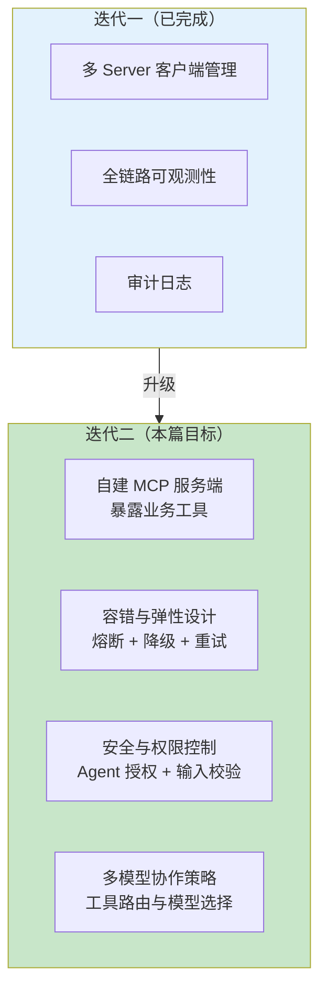
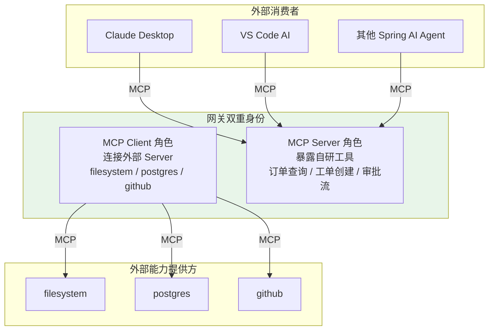
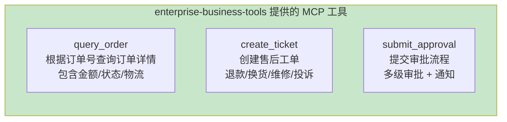
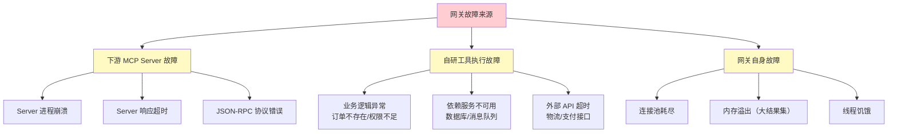
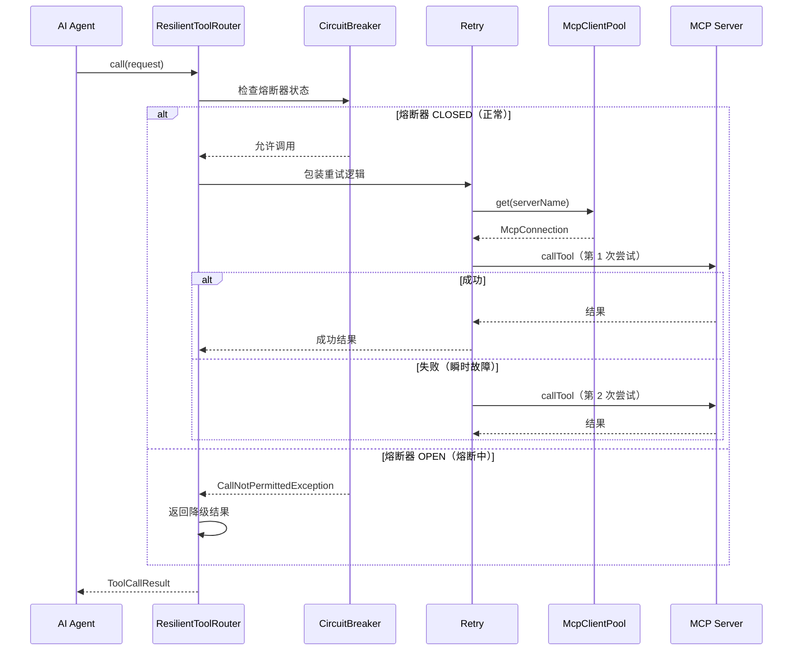
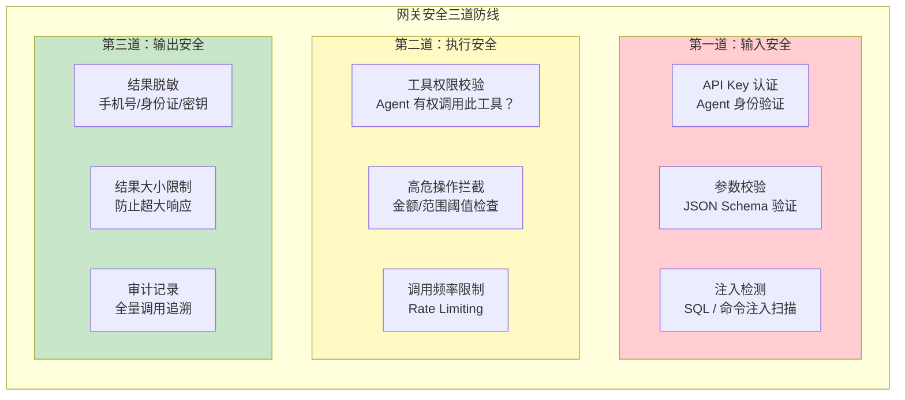
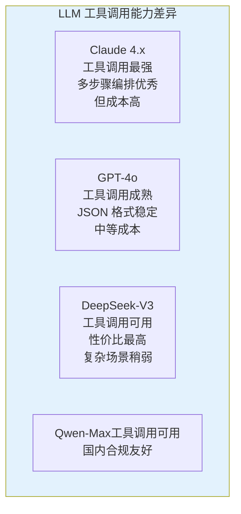
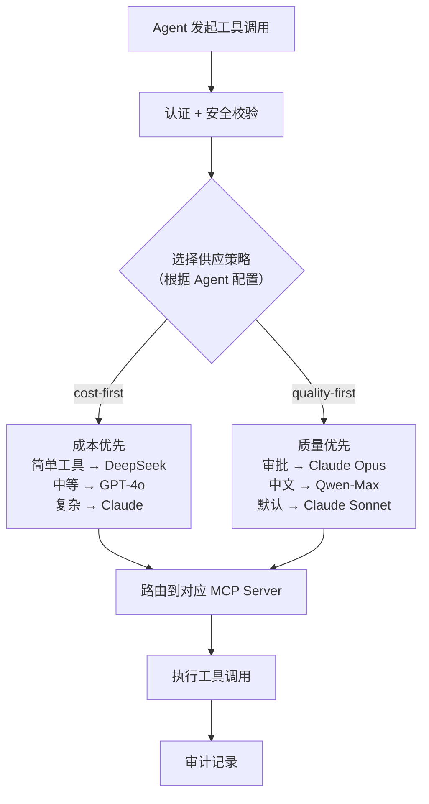
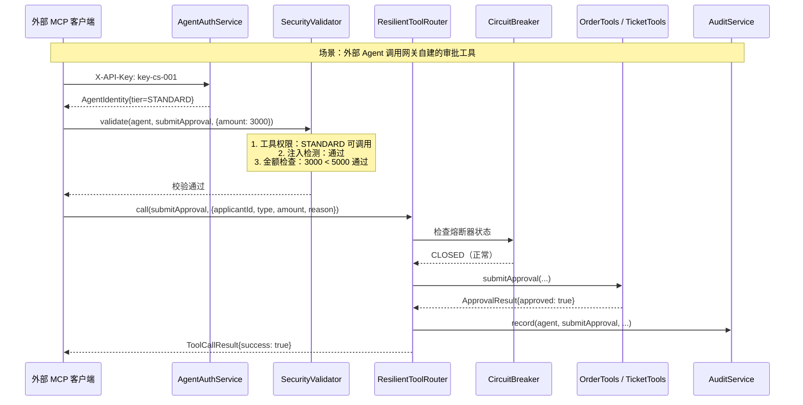

# 03-迭代二：自定义 MCP 服务端

> **定位**：在网关中内建自研业务 MCP Server，将企业内部能力（订单查询、工单创建、审批流）暴露为 MCP 工具，同时叠加容错与弹性设计、安全与权限控制、多模型协作策略，使网关同时具备工具消费（Client）和工具提供（Server）双重能力。
>
> **读者画像**：已完成迭代一，需要让网关对外暴露自研工具并达到生产级安全与弹性标准的开发者。
>
> **前置阅读**：[02-迭代一-MCP 客户端集成](02-迭代一-MCP客户端集成.md)、[教程 24-容错与弹性设计](../../教程/24-容错与弹性设计.md)、[教程 25-安全与权限控制](../../教程/25-安全与权限控制.md)。

---

## 1. 迭代目标



本篇完成后，网关的完整能力图谱：



---

## 2. 自建 MCP 服务端

### 2.1 添加 MCP Server 依赖

```xml
<!-- pom.xml 新增 -->
<!-- Spring AI MCP 服务端——将自研工具暴露为 MCP Server -->
<dependency>
    <groupId>org.springframework.ai</groupId>
    <artifactId>spring-ai-mcp-server-spring-boot-starter</artifactId>
</dependency>
```

### 2.2 MCP Server 配置

```yaml
# application.yml 新增 MCP Server 配置
spring:
  ai:
    mcp:
      server:
        name: "enterprise-business-tools"
        version: "1.0.0"
        type: SYNC              # 同步模式，简单直接
        sse-message-endpoint: /mcp/message   # SSE 消息端点
```

> **MCP 服务端详解** → [教程 10-MCP 协议](../../教程/10-MCP协议.md) 第 4 节讲解了 `spring-ai-mcp-server-spring-boot-starter` 的配置方式、`@Tool` 注解如何自动暴露为 MCP 工具，以及外部 MCP 客户端如何连接和发现工具。

### 2.3 业务工具定义

网关自建三个核心业务工具，覆盖企业常见场景：



```java
package com.example.mcp.gateway.tools;

import org.springframework.ai.tool.annotation.Tool;
import org.springframework.ai.tool.annotation.ToolParam;
import org.springframework.stereotype.Component;

import java.time.LocalDate;
import java.util.Map;

/**
 * 订单工具——暴露为 MCP 工具。
 *
 * 外部 MCP 客户端连接网关后，
 * 自动发现并可以调用这些工具。
 */
@Component
public class OrderTools {

    private final OrderService orderService;

    public OrderTools(OrderService orderService) {
        this.orderService = orderService;
    }

    // Spring AI 2.0.0 — @Tool 注解自动暴露为 MCP 工具
    @Tool(description = "根据订单号查询订单详情，包括金额、状态和物流信息。订单号格式：ORD-XXXXXX")
    public OrderDetail queryOrder(
            @ToolParam(description = "订单号，格式 ORD-XXXXXX") String orderId
    ) {
        return orderService.queryDetail(orderId);
    }
}
```

```java
package com.example.mcp.gateway.tools;

import org.springframework.ai.tool.annotation.Tool;
import org.springframework.ai.tool.annotation.ToolParam;
import org.springframework.stereotype.Component;

/**
 * 工单工具——创建售后工单。
 */
@Component
public class TicketTools {

    private final TicketService ticketService;

    public TicketTools(TicketService ticketService) {
        this.ticketService = ticketService;
    }

    @Tool(description = "创建售后工单，需要客户ID、问题描述和工单类型")
    public Ticket createTicket(
            @ToolParam(description = "客户 ID") String customerId,
            @ToolParam(description = "问题描述") String description,
            @ToolParam(description = "工单类型：退款、换货、维修、投诉") String type
    ) {
        return ticketService.create(customerId, description, type);
    }

    @Tool(description = "根据工单号查询工单当前状态和处理进度")
    public TicketStatus queryTicket(
            @ToolParam(description = "工单号") String ticketId
    ) {
        return ticketService.queryStatus(ticketId);
    }
}
```

```java
package com.example.mcp.gateway.tools;

import org.springframework.ai.tool.annotation.Tool;
import org.springframework.ai.tool.annotation.ToolParam;
import org.springframework.stereotype.Component;

/**
 * 审批工具——提交审批流程。
 * 高危工具，需要额外的权限校验。
 */
@Component
public class ApprovalTools {

    private final ApprovalService approvalService;

    public ApprovalTools(ApprovalService approvalService) {
        this.approvalService = approvalService;
    }

    @Tool(description = "提交审批流程，支持多级审批。注意：金额超过 10000 元需要总监审批。")
    public ApprovalResult submitApproval(
            @ToolParam(description = "申请人 ID") String applicantId,
            @ToolParam(description = "审批类型：报销、采购、合同") String type,
            @ToolParam(description = "金额（元）") Double amount,
            @ToolParam(description = "事由说明") String reason
    ) {
        return approvalService.submit(applicantId, type, amount, reason);
    }
}
```

Spring AI 自动将这些 `@Tool` 方法注册到内建的 MCP Server。外部 MCP 客户端连接 `http://gateway:8080/mcp/message` 后，通过 `tools/list` 就能看到 `queryOrder`、`createTicket`、`queryTicket`、`submitApproval` 四个工具。

---

## 3. 容错与弹性设计

> **容错设计完整方法论** → [教程 24-容错与弹性设计](../../教程/24-容错与弹性设计.md)：该教程系统讲解了 Agent 系统的故障分类（LLM/工具/基础设施/应用层）、五大容错策略（超时/重试/降级/熔断/限流），以及 Spring Retry + Resilience4j 的集成方案。本节的容错设计直接基于该教程的策略框架。

### 3.1 故障场景分析

MCP 工具网关面临的核心故障：



### 3.2 熔断器：保护下游 Server

使用 Resilience4j 为每个 MCP Server 连接配置独立的熔断器：

```java
package com.example.mcp.gateway.resilience;

import io.github.resilience4j.circuitbreaker.CircuitBreaker;
import io.github.resilience4j.circuitbreaker.CircuitBreakerConfig;
import org.springframework.stereotype.Component;

import java.time.Duration;
import java.util.Map;
import java.util.concurrent.ConcurrentHashMap;

/**
 * 熔断器工厂——为每个 MCP Server 创建独立的熔断器。
 */
@Component
public class CircuitBreakerFactory {

    private final Map<String, CircuitBreaker> breakers = new ConcurrentHashMap<>();

    /**
     * 为指定 Server 获取或创建熔断器。
     */
    public CircuitBreaker getOrCreate(String serverName) {
        return breakers.computeIfAbsent(serverName, this::create);
    }

    private CircuitBreaker create(String serverName) {
        CircuitBreakerConfig config = CircuitBreakerConfig.custom()
                // 失败率阈值：50% 的请求失败则打开熔断器
                .failureRateThreshold(50)
                // 慢调用阈值：超过 5 秒视为慢调用
                .slowCallDurationThreshold(Duration.ofSeconds(5))
                // 慢调用率阈值：30% 的请求慢则打开熔断器
                .slowCallRateThreshold(30)
                // 半开状态允许的请求数
                .permittedNumberOfCallsInHalfOpenState(3)
                // 滑动窗口大小：最近 20 次调用
                .slidingWindowSize(20)
                // 等待时间：熔断器打开后 30 秒尝试半开
                .waitDurationInOpenState(Duration.ofSeconds(30))
                .build();

        CircuitBreaker breaker = CircuitBreaker.of("mcp-" + serverName, config);

        // 注册状态变更监听
        breaker.getEventPublisher()
                .onStateTransition(e -> {
                    // 熔断器状态变更时记录日志和告警
                    System.out.printf("[CircuitBreaker] %s: %s → %s%n",
                            serverName,
                            e.getStateTransition().getFromState(),
                            e.getStateTransition().getToState());
                });

        return breaker;
    }
}
```

### 3.3 在路由引擎中集成熔断 + 重试 + 降级

```java
package com.example.mcp.gateway.router;

import com.example.mcp.gateway.model.*;
import com.example.mcp.gateway.pool.*;
import com.example.mcp.gateway.resilience.CircuitBreakerFactory;
import io.github.resilience4j.circuitbreaker.CallNotPermittedException;
import io.github.resilience4j.decorators.Decorators;
import io.github.resilience4j.retry.Retry;
import io.vavr.control.Try;
import org.springframework.stereotype.Component;

import java.time.Duration;
import java.util.Map;
import java.util.function.Supplier;

/**
 * 增强版工具路由引擎——集成熔断 + 重试 + 降级。
 */
@Component
public class ResilientToolRouter {

    private final ToolDiscoveryService discovery;
    private final McpClientPool pool;
    private final CircuitBreakerFactory cbFactory;

    public ResilientToolRouter(ToolDiscoveryService discovery,
                                McpClientPool pool,
                                CircuitBreakerFactory cbFactory) {
        this.discovery = discovery;
        this.pool = pool;
        this.cbFactory = cbFactory;
    }

    public ToolCallResult call(ToolCallRequest request) {
        long start = System.currentTimeMillis();

        // 1. 查找工具
        ToolInfo tool = discovery.find(request.toolName());
        if (tool == null) {
            return ToolCallResult.failure(
                    request.toolName(),
                    "Tool not found: " + request.toolName(),
                    System.currentTimeMillis() - start
            );
        }

        // 2. 获取连接
        McpConnection conn = pool.get(tool.serverName());
        if (conn == null || !conn.isAvailable()) {
            return ToolCallResult.failure(
                    tool.globalId(),
                    "MCP Server not available: " + tool.serverName(),
                    System.currentTimeMillis() - start
            );
        }

        // 3. 构建带容错的调用链
        var circuitBreaker = cbFactory.getOrCreate(tool.serverName());
        var retry = buildRetry(tool.serverName());

        Supplier<Object> callSupplier = () -> {
            // 实际的 MCP 工具调用
            return conn.getClient().callTool(
                    tool.name(),
                    Map.copyOf(request.arguments())
            );
        };

        // 使用 Decorators 组合：重试 → 熔断 → 降级
        var decorated = Decorators.ofSupplier(callSupplier)
                .withCircuitBreaker(circuitBreaker)
                .withRetry(retry)
                .withFallback(
                        // 降级策略：熔断打开或调用失败时返回降级结果
                        java.util.List.of(
                                CallNotPermittedException.class,
                                Exception.class
                        ),
                        e -> degradedResult(tool, e)
                )
                .decorate();

        try {
            var result = decorated.get();
            return ToolCallResult.success(
                    tool.globalId(),
                    result,
                    System.currentTimeMillis() - start
            );
        } catch (Exception e) {
            return ToolCallResult.failure(
                    tool.globalId(),
                    "Tool execution failed after resilience: " + e.getMessage(),
                    System.currentTimeMillis() - start
            );
        }
    }

    /**
     * 构建重试策略。
     * 只对瞬时故障重试（网络超时），不对业务错误重试。
     */
    private Retry buildRetry(String serverName) {
        return Retry.of("mcp-retry-" + serverName,
                io.github.resilience4j.retry.RetryConfig.custom()
                        .maxAttempts(3)                         // 最多尝试 3 次
                        .waitDuration(Duration.ofMillis(500))   // 每次间隔 500ms
                        .retryOnException(e ->
                                !(e instanceof IllegalArgumentException)
                        )  // 参数错误不重试
                        .build());
    }

    /**
     * 降级结果——熔断打开或连续失败时的兜底响应。
     */
    private Object degradedResult(ToolInfo tool, Throwable e) {
        return Map.of(
                "degraded", true,
                "tool", tool.globalId(),
                "message", "Service temporarily unavailable. Circuit breaker is open.",
                "fallbackAt", java.time.Instant.now().toString()
        );
    }
}
```

容错链路的工作流程：



> **容错策略选择决策树** → [教程 24-容错与弹性设计](../../教程/24-容错与弹性设计.md) 第 3 节提供了完整的容错策略选择决策树：瞬时故障用重试+超时，持续故障用熔断+降级。本项目的熔断器配置直接参考该教程的参数推荐。

---

## 4. 安全与权限控制

> **Agent 安全三道防线** → [教程 25-安全与权限控制](../../教程/25-安全与权限控制.md)：该教程提出了 Agent 安全的三道防线模型——输入安全（Prompt 注入防护）、执行安全（工具权限控制）、输出安全（内容过滤）。本节在网关层实现这三道防线的工具版本。

### 4.1 安全架构



### 4.2 Agent 身份认证

```java
package com.example.mcp.gateway.auth;

/**
 * Agent 身份信息。
 */
public record AgentIdentity(
        String agentId,        // Agent 唯一标识
        String agentName,      // Agent 名称
        String tier,           // 权限等级：STANDARD / PREMIUM / ADMIN
        java.util.Set<String> allowedTools  // 允许调用的工具集合（白名单）
) {
    /**
     * 检查是否有权调用指定工具。
     */
    public boolean canCall(String toolGlobalId) {
        // ADMIN 拥有全部权限
        if ("ADMIN".equals(tier)) return true;
        // 白名单匹配
        return allowedTools.contains(toolGlobalId)
                || allowedTools.contains("*");  // 通配符
    }
}
```

```java
package com.example.mcp.gateway.auth;

import org.springframework.stereotype.Component;

import java.util.Map;
import java.util.Set;
import java.util.concurrent.ConcurrentHashMap;

/**
 * Agent 认证服务。
 *
 * 生产环境应替换为数据库或配置中心管理。
 * Demo 版使用内存存储。
 */
@Component
public class AgentAuthService {

    // apiKey → AgentIdentity
    private final Map<String, AgentIdentity> agents = new ConcurrentHashMap<>();

    public AgentAuthService() {
        // 预置三个 Agent
        agents.put("key-customer-service-001", new AgentIdentity(
                "agent-cs-001",
                "智能客服 Agent",
                "STANDARD",
                Set.of("filesystem.read_file", "OrderTools.queryOrder")
        ));

        agents.put("key-ops-agent-002", new AgentIdentity(
                "agent-ops-002",
                "运维 Agent",
                "PREMIUM",
                Set.of("filesystem.*", "postgres.*", "TicketTools.*")
        ));

        agents.put("key-admin-003", new AgentIdentity(
                "agent-admin-003",
                "管理 Agent",
                "ADMIN",
                Set.of("*")
        ));
    }

    /**
     * 通过 API Key 认证 Agent。
     */
    public AgentIdentity authenticate(String apiKey) {
        AgentIdentity agent = agents.get(apiKey);
        if (agent == null) {
            throw new SecurityException("Invalid API key");
        }
        return agent;
    }
}
```

### 4.3 安全拦截器

```java
package com.example.mcp.gateway.auth;

import com.example.mcp.gateway.model.ToolCallRequest;
import com.example.mcp.gateway.model.ToolInfo;
import org.springframework.stereotype.Component;

import java.util.List;
import java.util.regex.Pattern;

/**
 * 工具调用安全校验器。
 *
 * 在路由引擎调用工具之前执行三道安全检查。
 */
@Component
public class SecurityValidator {

    // SQL 注入检测正则（简化版）
    private static final Pattern SQL_INJECTION = Pattern.compile(
            "(?i)(union\\s+select|drop\\s+table|insert\\s+into|delete\\s+from|" +
            "--|;\\s*drop|or\\s+1\\s*=\\s*1)"
    );

    // 命令注入检测正则
    private static final Pattern CMD_INJECTION = Pattern.compile(
            "(;|\\|`|\\$\\(|\\$\\{|rm\\s+-rf|cat\\s+/etc)"
    );

    /**
     * 完整安全校验。
     *
     * @throws SecurityException 如果任何检查不通过
     */
    public void validate(AgentIdentity agent,
                         ToolCallRequest request,
                         ToolInfo tool) {

        // 1. 工具权限校验
        if (!agent.canCall(tool.globalId())) {
            throw new SecurityException(String.format(
                    "Agent '%s' (tier: %s) is not authorized to call tool '%s'",
                    agent.agentName(), agent.tier(), tool.globalId()
            ));
        }

        // 2. 输入注入检测
        checkInjection(request, tool);

        // 3. 高危工具额外校验
        checkHighRiskTool(agent, request, tool);
    }

    /**
     * 检测参数中的注入攻击。
     */
    private void checkInjection(ToolCallRequest request, ToolInfo tool) {
        for (var entry : request.arguments().entrySet()) {
            if (entry.getValue() instanceof String strValue) {
                // 数据库类工具检测 SQL 注入
                if (tool.serverName().equals("postgres")) {
                    if (SQL_INJECTION.matcher(strValue).find()) {
                        throw new SecurityException(
                                "Potential SQL injection detected in parameter: "
                                        + entry.getKey());
                    }
                }
                // 文件系统类工具检测命令注入
                if (tool.serverName().equals("filesystem")) {
                    if (CMD_INJECTION.matcher(strValue).find()) {
                        throw new SecurityException(
                                "Potential command injection detected in parameter: "
                                        + entry.getKey());
                    }
                }
            }
        }
    }

    /**
     * 高危工具的额外校验。
     * 例如：审批工具限制单笔金额。
     */
    private void checkHighRiskTool(AgentIdentity agent,
                                    ToolCallRequest request,
                                    ToolInfo tool) {
        // 审批工具：STANDARD 等级单笔不超过 5000
        if ("ApprovalTools.submitApproval".equals(tool.name())) {
            Object amountObj = request.arguments().get("amount");
            if (amountObj instanceof Number num) {
                double amount = num.doubleValue();
                double limit = "STANDARD".equals(agent.tier()) ? 5000 : 50000;
                if (amount > limit) {
                    throw new SecurityException(String.format(
                            "Amount %.2f exceeds %s tier limit %.2f",
                            amount, agent.tier(), limit));
                }
            }
        }
    }
}
```

> **执行安全深度设计** → [教程 25-安全与权限控制](../../教程/25-安全与权限控制.md) 第 2 节详细讲解了 Agent 的工具权限模型——从"用户认证（你是谁）"到"工具授权（你能做什么）"再到"高危操作审批（HITL）"的三级控制体系。本项目的 `AgentIdentity.tier` 和 `allowedTools` 白名单就是该模型的实现。

### 4.4 在 Controller 中集成认证

```java
package com.example.mcp.gateway.api;

import com.example.mcp.gateway.auth.AgentIdentity;
import com.example.mcp.gateway.auth.AgentAuthService;
import com.example.mcp.gateway.model.*;
import org.springframework.web.bind.annotation.*;

@RestController
@RequestMapping("/tools")
public class SecureToolGatewayController {

    private final ResilientToolRouter router;
    private final ToolDiscoveryService discovery;
    private final AgentAuthService authService;
    private final SecurityValidator securityValidator;

    public SecureToolGatewayController(
            ResilientToolRouter router,
            ToolDiscoveryService discovery,
            AgentAuthService authService,
            SecurityValidator securityValidator) {
        this.router = router;
        this.discovery = discovery;
        this.authService = authService;
        this.securityValidator = securityValidator;
    }

    /**
     * 安全工具调用端点。
     * 需要 X-API-Key 头。
     */
    @PostMapping("/call")
    public ToolCallResult callTool(
            @RequestHeader("X-API-Key") String apiKey,
            @RequestBody ToolCallRequest request
    ) {
        // 1. 认证
        AgentIdentity agent = authService.authenticate(apiKey);

        // 2. 查找工具
        ToolInfo tool = discovery.find(request.toolName());
        if (tool == null) {
            return ToolCallResult.failure(
                    request.toolName(), "Tool not found", 0);
        }

        // 3. 安全校验
        try {
            securityValidator.validate(agent, request, tool);
        } catch (SecurityException e) {
            return ToolCallResult.failure(
                    tool.globalId(),
                    "Security check failed: " + e.getMessage(),
                    0);
        }

        // 4. 执行调用
        return router.call(request);
    }
}
```

---

## 5. 多模型协作与工具供应策略

> **多模型协作** → [教程 39-多模型协作与供应策略]（即将上线）：该教程将讲解多 LLM 协作模式——模型路由、Fallback 链、A/B 测试、成本优化策略。本节在网关层预置多模型工具供应策略框架，为后续教程上线后深度集成做准备。

### 5.1 为什么网关需要多模型策略

不同 LLM 对工具调用的能力差异很大：



网关需要根据工具的复杂度和成本要求，动态选择最合适的模型来执行工具编排。

### 5.2 工具供应策略模型

```java
package com.example.mcp.gateway.strategy;

import com.example.mcp.gateway.model.ToolInfo;

/**
 * 工具供应策略接口。
 * 决定某次工具调用应该由哪个模型来编排。
 */
public interface ToolSupplyStrategy {

    /**
     * 推荐执行此工具时使用的模型。
     *
     * @param tool     被调用的工具
     * @param context  调用上下文（Agent 身份、历史调用等）
     * @return 推荐的模型标识
     */
    String recommendModel(ToolInfo tool, CallContext context);

    /**
     * 策略名称。
     */
    String name();
}
```

```java
package com.example.mcp.gateway.strategy;

import com.example.mcp.gateway.model.ToolInfo;

import java.util.Map;

/**
 * 调用上下文。
 */
public record CallContext(
        String agentId,
        String previousModel,     // 上一次使用的模型
        int toolChainDepth,       // 工具链深度（第几步调用）
        double budgetRemaining,   // 剩余预算
        Map<String, Object> extra // 扩展字段
) {}
```

### 5.3 成本优先策略

```java
package com.example.mcp.gateway.strategy;

import com.example.mcp.gateway.model.ToolInfo;
import org.springframework.stereotype.Component;

/**
 * 成本优先策略——优先选择最便宜的可用模型。
 */
@Component
public class CostFirstStrategy implements ToolSupplyStrategy {

    @Override
    public String recommendModel(ToolInfo tool, CallContext context) {
        // 简单工具（查询类）用 DeepSeek（最便宜）
        if (isSimpleQuery(tool)) {
            return "deepseek-v3";
        }
        // 中等复杂度用 GPT-4o
        if (isModerateComplexity(tool)) {
            return "gpt-4o";
        }
        // 高复杂度（审批、多步骤）用 Claude
        return "claude-sonnet-4";
    }

    private boolean isSimpleQuery(ToolInfo tool) {
        String desc = tool.description() != null
                ? tool.description().toLowerCase() : "";
        return desc.contains("查询") || desc.contains("query")
                || desc.contains("search") || desc.contains("list");
    }

    private boolean isModerateComplexity(ToolInfo tool) {
        String desc = tool.description() != null
                ? tool.description().toLowerCase() : "";
        return desc.contains("创建") || desc.contains("create")
                || desc.contains("update") || desc.contains("提交");
    }

    @Override
    public String name() {
        return "cost-first";
    }
}
```

### 5.4 质量优先策略

```java
package com.example.mcp.gateway.strategy;

import com.example.mcp.gateway.model.ToolInfo;
import org.springframework.stereotype.Component;

/**
 * 质量优先策略——始终使用最强的模型。
 * 适用于关键业务场景（审批、合同）。
 */
@Component
public class QualityFirstStrategy implements ToolSupplyStrategy {

    @Override
    public String recommendModel(ToolInfo tool, CallContext context) {
        // 审批类工具始终用 Claude（多步推理最强）
        if (tool.name().contains("Approval")) {
            return "claude-opus-4";
        }
        // 中文场景用 Qwen-Max
        if (context.extra().containsKey("locale")
                && "zh-CN".equals(context.extra().get("locale"))) {
            return "qwen-max";
        }
        // 默认用 Claude Sonnet
        return "claude-sonnet-4";
    }

    @Override
    public String name() {
        return "quality-first";
    }
}
```

### 5.5 策略选择器

```java
package com.example.mcp.gateway.strategy;

import org.springframework.stereotype.Component;

import java.util.List;
import java.util.Map;
import java.util.function.Function;
import java.util.stream.Collectors;

/**
 * 策略选择器——根据 Agent 配置选择供应策略。
 */
@Component
public class StrategySelector {

    private final Map<String, ToolSupplyStrategy> strategies;

    public StrategySelector(List<ToolSupplyStrategy> strategyList) {
        this.strategies = strategyList.stream()
                .collect(Collectors.toMap(
                        ToolSupplyStrategy::name,
                        Function.identity()
                ));
    }

    /**
     * 根据 Agent 的策略配置选择模型。
     */
    public String selectModel(String strategyName,
                               ToolInfo tool,
                               CallContext context) {
        ToolSupplyStrategy strategy = strategies.get(strategyName);
        if (strategy == null) {
            // 默认策略
            strategy = strategies.get("cost-first");
        }
        return strategy.recommendModel(tool, context);
    }
}
```

策略选择的完整流程：



---

## 6. 完整调用流程

将自建 MCP Server、容错、安全、多模型策略组合后的完整流程：



---

## 7. 验证测试

### 7.1 自建 Server 验证

```bash
# 列出网关自建工具（从外部 MCP 客户端视角）
# 需要安装 mcp-cli: npm install -g @anthropic/mcp-cli
mcp-cli connect http://localhost:8080/mcp/message

# 在 mcp-cli 中执行：
# > tools/list
# 期望输出：queryOrder, createTicket, queryTicket, submitApproval
```

### 7.2 安全验证

```bash
# 1. 无 API Key → 401
curl -X POST http://localhost:8080/tools/call \
  -H "Content-Type: application/json" \
  -d '{"toolName": "queryOrder", "arguments": {"orderId": "ORD-001"}}'
# 期望：401 Unauthorized

# 2. 权限不足 → SecurityException
curl -X POST http://localhost:8080/tools/call \
  -H "X-API-Key: key-customer-service-001" \
  -H "Content-Type: application/json" \
  -d '{"toolName": "postgres.drop_table", "arguments": {"name": "orders"}}'
# 期望：Security check failed

# 3. 金额超限 → SecurityException
curl -X POST http://localhost:8080/tools/call \
  -H "X-API-Key: key-customer-service-001" \
  -H "Content-Type: application/json" \
  -d '{"toolName": "submitApproval", "arguments": {"applicantId": "U001", "type": "报销", "amount": 10000, "reason": "test"}}'
# 期望：Amount 10000.00 exceeds STANDARD tier limit 5000.00
```

### 7.3 容错验证

```bash
# 手动停止某个 MCP Server 进程，观察熔断器行为
# 健康检查会标记为 DISCONNECTED
# 后续调用该 Server 的工具会返回降级结果
curl http://localhost:8080/actuator/health | jq '.components.mcpPool.details'
```

---

## 8. 总结

本篇为网关增加了自建 MCP Server 能力，并叠加了生产级的容错、安全和多模型策略：

1. **自建 MCP 服务端**：通过 `spring-ai-mcp-server-spring-boot-starter` 和 `@Tool` 注解，将订单查询、工单创建、审批流三个业务工具暴露为标准 MCP Server，外部任何 MCP 兼容客户端都能发现和调用。

2. **容错与弹性**：使用 Resilience4j 为每个 MCP Server 配置独立的熔断器（50% 失败率阈值、5 秒慢调用阈值、30 秒恢复等待），集成重试（最多 3 次、500ms 间隔）和降级策略（返回降级响应而非崩溃）。容错参数直接参考 [教程 24-容错与弹性设计](../../教程/24-容错与弹性设计.md) 的策略推荐。

3. **安全三道防线**：第一道输入安全（API Key 认证 + SQL/命令注入检测 + JSON Schema 参数校验），第二道执行安全（Agent 级别工具权限白名单 + 高危操作金额阈值），第三道输出安全（结果脱敏 + 大小限制 + 审计记录）。安全模型参考 [教程 25-安全与权限控制](../../教程/25-安全与权限控制.md) 的 Agent 安全三道防线。

4. **多模型供应策略**：设计了 `ToolSupplyStrategy` 接口，实现成本优先（简单工具用 DeepSeek、中等用 GPT-4o、复杂用 Claude）和质量优先（审批用 Claude Opus、中文用 Qwen-Max）两种策略，为 [教程 39-多模型协作与供应策略]（即将上线）的深度集成预留了框架。

至此，MCP 工具网关已具备完整的生产级能力：消费外部 MCP Server 工具 + 暴露自研业务工具 + 全链路可观测 + 审计 + 容错 + 安全 + 多模型策略。最后一篇 [04-核心代码讲解](04-核心代码讲解.md) 将对全项目关键代码做集中梳理和深度解析。
