# 04-核心代码讲解

> **定位**：对 MCP 工具网关项目中所有关键代码做集中梳理和深度解析。每段代码都配有"设计意图——实现要点——代码解读——扩展方向"四层结构，帮助读者不仅看懂"怎么写"，更理解"为什么这样写"。本文给出的类清单都是**完整可手写**（含全部 import、无省略），与前三篇可对照阅读。
>
> **读者画像**：已阅读前三篇文档，想要深入理解每段核心代码设计决策的开发者。
>
> **前置阅读**：[01-最小 Demo 搭建](01-最小Demo搭建.md)、[02-MCP 客户端集成](02-MCP客户端集成.md)、[03-自定义 MCP 服务端](03-自定义MCP服务端.md)。API 真实性以 [附录 05-SpringAI2-API基准](../../附录/05-SpringAI2-API基准/01-MCP真实API与坐标.md) 为准。

---

## 1. 项目代码全景

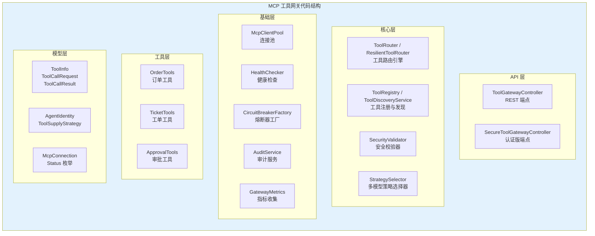

---

## 2. 数据模型层深度解析

### 2.1 ToolInfo——工具元数据

```java
package com.example.mcp.gateway.model;

/**
 * 工具元数据——描述一个 MCP 工具的能力。
 * 直接映射 MCP Server tools/list 返回的结构。
 *
 * @param serverName   来源 MCP Server 名称，如 "filesystem"
 * @param name         工具名称，如 "read_file"
 * @param description  工具描述（LLM 判断何时调用的唯一依据）
 * @param inputSchema  参数 JSON Schema——MCP SDK 的 ToolInputSchema 原样透传
 */
public record ToolInfo(
        String serverName,
        String name,
        String description,
        Object inputSchema
) {
    public String globalId() {
        return serverName + "." + name;
    }
}
```

**设计意图**：用一个不可变 Record 封装 MCP 工具的完整元数据，`globalId()` 方法解决了多 Server 工具名冲突问题。

**关键决策——为什么用 Record 而不是 Class**：

| 对比维度 | 传统 Class | Java 21 Record |
|---------|-----------|----------------|
| 代码行数 | 30+ 行（getter/setter/equals/hashCode） | 6 行 |
| 不可变性 | 需手动保证（final 字段 + 无 setter） | 天然不可变 |
| 线程安全 | 需考虑可变字段 | 天然线程安全 |
| 模式匹配 | 需要 instanceof + 强转 | 原生支持 deconstruction |

`globalId()` 的设计逻辑：

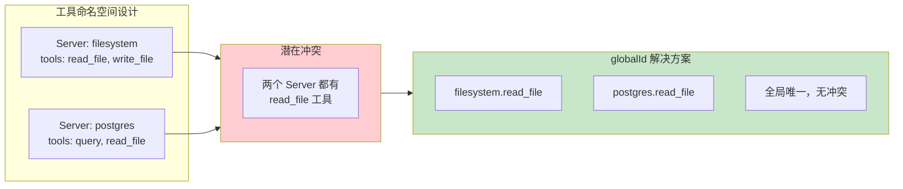

### 2.2 ToolCallResult——统一结果包装

```java
package com.example.mcp.gateway.model;

/**
 * 工具调用结果 DTO——统一成功/失败包装，避免用异常传递工具失败。
 */
public record ToolCallResult(
        String toolName,
        boolean success,
        Object content,
        String errorMessage,
        long durationMs
) {
    public static ToolCallResult success(String toolName, Object content, long durationMs) {
        return new ToolCallResult(toolName, true, content, null, durationMs);
    }

    public static ToolCallResult failure(String toolName, String error, long durationMs) {
        return new ToolCallResult(toolName, false, null, error, durationMs);
    }
}
```

**设计意图**：用统一的结果格式包裹所有工具调用，无论成功还是失败，调用方都收到 `ToolCallResult` 而非异常。

**为什么不用异常传递失败**：

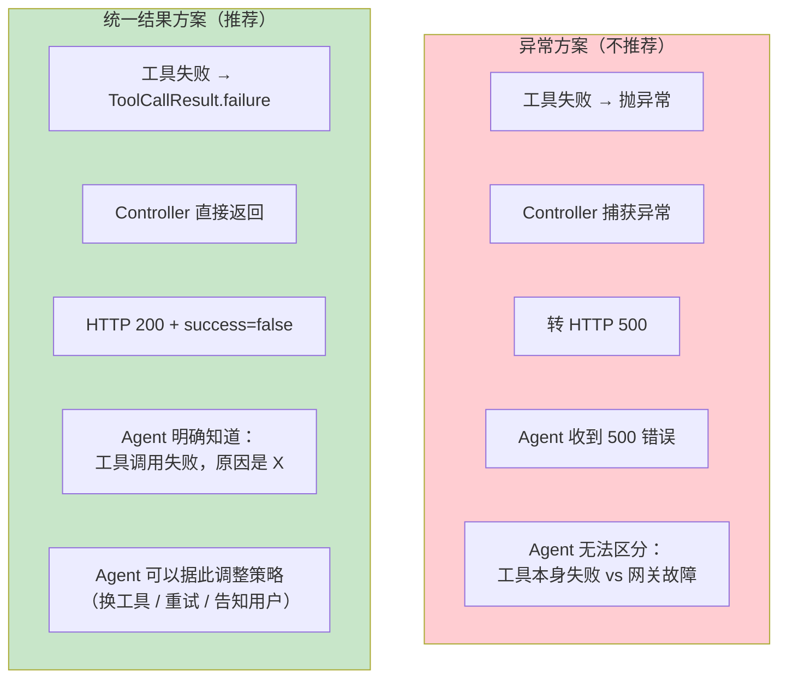

`durationMs` 字段的设计意图：让每次调用都自带耗时信息，无需额外的计时中间件。在审计日志、监控告警中直接可用。

---

## 3. 连接管理核心代码

### 3.1 McpConnection——连接状态机

```java
package com.example.mcp.gateway.pool;

import com.example.mcp.gateway.model.ToolInfo;
import io.modelcontextprotocol.client.McpSyncClient;   // ⚠ MCP SDK 类型（附录 05-01）

import java.time.Instant;
import java.util.List;
import java.util.concurrent.CopyOnWriteArrayList;

/**
 * MCP Client 连接描述符。一个连接对应一个 MCP Server。
 */
public class McpConnection {

    public enum Status {
        CONNECTING,    // 正在握手
        CONNECTED,     // 已连接，可用
        DEGRADED,      // 降级（健康检查失败但未断开）
        DISCONNECTED   // 已断开
    }

    private final String serverName;
    private final McpSyncClient client;   // ⚠ MCP SDK 类型（附录 05-01）
    private volatile Status status;
    private final Instant connectedAt;
    private Instant lastHealthCheck;
    private int consecutiveFailures;

    // 该 Server 暴露的工具列表（由 ToolDiscoveryService 维护）
    private final List<ToolInfo> tools = new CopyOnWriteArrayList<>();

    public McpConnection(String serverName, McpSyncClient client) {
        this.serverName = serverName;
        this.client = client;
        this.status = Status.CONNECTING;
        this.connectedAt = Instant.now();
    }

    /** 标记健康检查结果 */
    public void recordHealthCheck(boolean healthy) {
        this.lastHealthCheck = Instant.now();
        if (healthy) {
            this.consecutiveFailures = 0;
            this.status = Status.CONNECTED;
        } else {
            this.consecutiveFailures++;
            this.status = this.consecutiveFailures >= 3
                    ? Status.DISCONNECTED
                    : Status.DEGRADED;
        }
    }

    /** 连接是否可用 */
    public boolean isAvailable() {
        return status == Status.CONNECTED || status == Status.DEGRADED;
    }

    // getter（完整，不省略）
    public String getServerName() { return serverName; }
    public McpSyncClient getClient() { return client; }
    public Status getStatus() { return status; }
    public Instant getConnectedAt() { return connectedAt; }
    public Instant getLastHealthCheck() { return lastHealthCheck; }
    public int getConsecutiveFailures() { return consecutiveFailures; }
    public List<ToolInfo> getTools() { return tools; }
}
```

**状态机解析**：

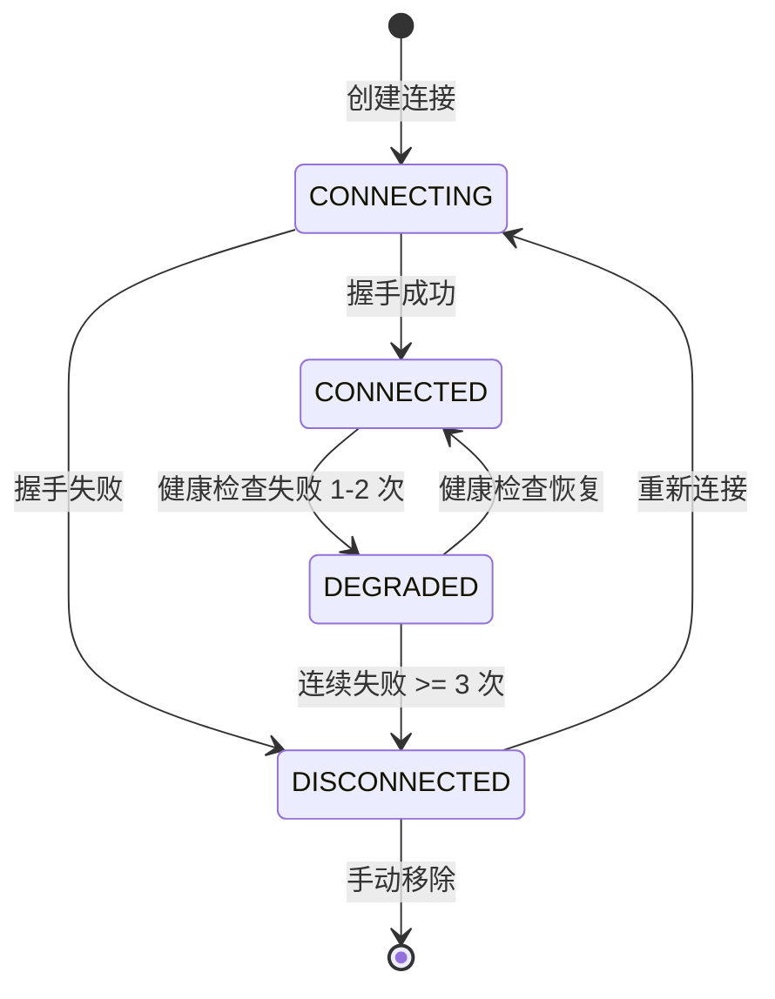

**为什么用 volatile 而不是 synchronized**：

`status` 字段用 `volatile` 修饰而非 `synchronized` 块保护。原因如下：

- `Status` 是引用类型（枚举），`volatile` 保证了引用的可见性和原子性
- `recordHealthCheck` 由健康检查定时任务单线程调用，不存在并发写入
- `isAvailable()` 被多线程读取，`volatile` 保证了读操作的内存可见性
- 避免了 `synchronized` 的锁开销和可能的死锁风险

**consecutiveFailures 的渐进式策略**：

```java
// 不是一次失败就断开，而是给 Server 3 次恢复机会
this.status = this.consecutiveFailures >= 3
        ? Status.DISCONNECTED
        : Status.DEGRADED;
```

这避免了网络瞬时抖动导致的误判。单次超时不等于 Server 故障——可能是 GC 停顿、网络丢包、或 Server 正在执行慢查询。3 次连续失败（约 90 秒）才断开，平衡了灵敏度和稳定性。

### 3.2 McpClientPool——连接池的并发设计

```java
package com.example.mcp.gateway.pool;

import io.modelcontextprotocol.client.McpSyncClient;   // ⚠ MCP SDK 真实类型（附录 05-01）
import org.springframework.stereotype.Component;

import java.util.List;
import java.util.Map;
import java.util.concurrent.ConcurrentHashMap;

/**
 * MCP Client 连接池。
 * 管理所有 MCP Server 的连接，提供按名称获取、动态注册、移除断开的连接。
 */
@Component
public class McpClientPool {

    // serverName → McpConnection
    private final Map<String, McpConnection> connections = new ConcurrentHashMap<>();

    public void register(String serverName, McpSyncClient client) {
        connections.put(serverName, new McpConnection(serverName, client));
    }

    public McpConnection get(String serverName) {
        McpConnection conn = connections.get(serverName);
        if (conn == null) {
            throw new IllegalArgumentException(
                    "Unknown MCP server: " + serverName +
                    ". Available: " + connections.keySet());
        }
        if (!conn.isAvailable()) {
            throw new IllegalStateException(
                    "MCP server '" + serverName + "' is " + conn.getStatus());
        }
        return conn;
    }

    public Map<String, McpConnection> getAll() {
        return Map.copyOf(connections);
    }

    public List<McpConnection> getAvailable() {
        return connections.values().stream()
                .filter(McpConnection::isAvailable)
                .toList();
    }

    public void remove(String serverName) {
        McpConnection conn = connections.remove(serverName);
        if (conn != null) {
            try {
                conn.getClient().close();
            } catch (Exception ignored) {
                // 关闭时的异常可以忽略
            }
        }
    }
}
```

**为什么用 ConcurrentHashMap 而不是 HashMap + synchronized**：

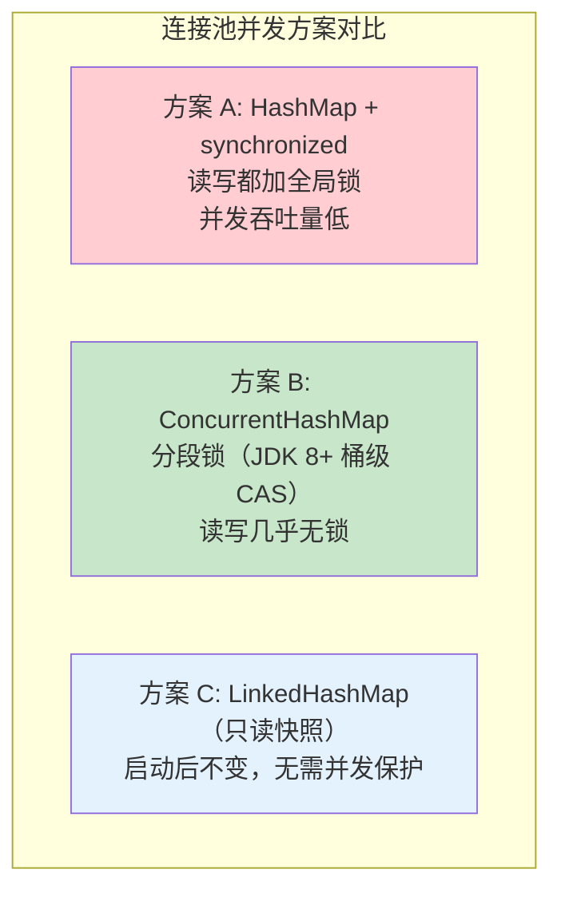

连接池的场景是"多读少写"——注册和移除只在启动和故障时发生，但 `get()` 每次工具调用都会执行。`ConcurrentHashMap` 的无锁读 + CAS 写非常适合这个场景。

**异常设计的分层**：

```java
// 区分两种错误：配置问题 vs 运行时故障
if (conn == null) {
    throw new IllegalArgumentException(
            "Unknown MCP server: " + serverName);   // 配置错误：Server 不存在
}
if (!conn.isAvailable()) {
    throw new IllegalStateException(
            "MCP server '" + serverName + "' is " + conn.getStatus());
    // 运行时故障：Server 不可用
}
```

`IllegalArgumentException` 表示"你请求了一个不存在的 Server"——这是调用方的配置错误，需要修改代码或配置。`IllegalStateException` 表示"Server 存在但当前不可用"——这是运行时状态，可能自动恢复。

---

## 4. 路由引擎核心代码

### 4.1 ResilientToolRouter——容错调用链

```java
package com.example.mcp.gateway.router;

import com.example.mcp.gateway.model.ToolCallRequest;
import com.example.mcp.gateway.model.ToolCallResult;
import com.example.mcp.gateway.model.ToolInfo;
import com.example.mcp.gateway.pool.McpClientPool;
import com.example.mcp.gateway.pool.McpConnection;
import com.example.mcp.gateway.registry.ToolDiscoveryService;
import com.example.mcp.gateway.resilience.CircuitBreakerFactory;
import io.github.resilience4j.circuitbreaker.CallNotPermittedException;
import io.github.resilience4j.decorators.Decorators;
import io.github.resilience4j.retry.Retry;
import io.github.resilience4j.retry.RetryConfig;
import io.modelcontextprotocol.spec.McpSchema.CallToolRequest;
import org.springframework.stereotype.Component;

import java.time.Duration;
import java.time.Instant;
import java.util.List;
import java.util.Map;
import java.util.function.Supplier;

/**
 * 增强版工具路由引擎——集成熔断 + 重试 + 降级。
 */
@Component
public class ResilientToolRouter {

    private final ToolDiscoveryService discovery;
    private final McpClientPool pool;
    private final CircuitBreakerFactory cbFactory;

    public ResilientToolRouter(ToolDiscoveryService discovery,
                               McpClientPool pool,
                               CircuitBreakerFactory cbFactory) {
        this.discovery = discovery;
        this.pool = pool;
        this.cbFactory = cbFactory;
    }

    public ToolCallResult call(ToolCallRequest request) {
        long start = System.currentTimeMillis();

        // 1. 查找工具
        ToolInfo tool = discovery.find(request.toolName());
        if (tool == null) {
            return ToolCallResult.failure(
                    request.toolName(),
                    "Tool not found: " + request.toolName(),
                    System.currentTimeMillis() - start);
        }

        // 2. 获取连接
        McpConnection conn = pool.get(tool.serverName());
        if (conn == null || !conn.isAvailable()) {
            return ToolCallResult.failure(
                    tool.globalId(),
                    "MCP Server not available: " + tool.serverName(),
                    System.currentTimeMillis() - start);
        }

        // 3. 构建容错调用链：重试 → 熔断 → 降级
        var circuitBreaker = cbFactory.getOrCreate(tool.serverName());
        var retry = buildRetry(tool.serverName());

        Supplier<Object> callSupplier = () -> conn.getClient().callTool(
                new CallToolRequest(tool.name(), safeArguments(request)));

        var decorated = Decorators.ofSupplier(callSupplier)
                .withCircuitBreaker(circuitBreaker)
                .withRetry(retry)
                .withFallback(
                        List.of(CallNotPermittedException.class, Exception.class),
                        e -> degradedResult(tool, e))
                .decorate();

        try {
            Object result = decorated.get();
            return ToolCallResult.success(
                    tool.globalId(),
                    result,
                    System.currentTimeMillis() - start);
        } catch (Exception e) {
            return ToolCallResult.failure(
                    tool.globalId(),
                    "Tool execution failed after resilience: " + e.getMessage(),
                    System.currentTimeMillis() - start);
        }
    }

    /** 构建重试策略——只对瞬时故障重试，不对业务错误重试 */
    private Retry buildRetry(String serverName) {
        return Retry.of("mcp-retry-" + serverName,
                RetryConfig.custom()
                        .maxAttempts(3)
                        .waitDuration(Duration.ofMillis(500))
                        .retryOnException(e ->
                                !(e instanceof IllegalArgumentException))
                        .build());
    }

    /** 降级结果——熔断打开或连续失败时的兜底响应 */
    private Object degradedResult(ToolInfo tool, Throwable e) {
        return Map.of(
                "degraded", true,
                "tool", tool.globalId(),
                "message", "Service temporarily unavailable. Circuit breaker is open.",
                "fallbackAt", Instant.now().toString());
    }

    private Map<String, Object> safeArguments(ToolCallRequest request) {
        return request.arguments() != null ? Map.copyOf(request.arguments()) : Map.of();
    }
}
```

**Decorators 链的执行顺序**：

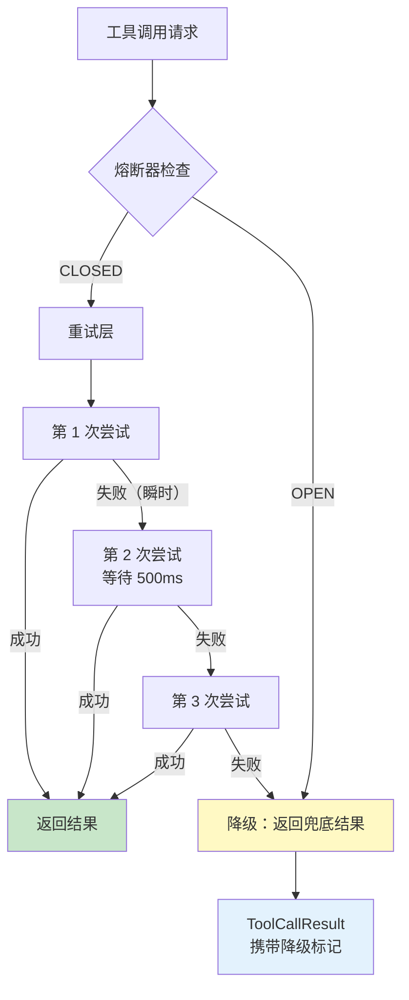

**重试策略的幂等性考量**：

```java
private Retry buildRetry(String serverName) {
    return Retry.of("mcp-retry-" + serverName,
            RetryConfig.custom()
                    .maxAttempts(3)
                    .waitDuration(Duration.ofMillis(500))
                    .retryOnException(e ->
                            !(e instanceof IllegalArgumentException))
                    .build());
}
```

`retryOnException` 的过滤条件是关键设计：

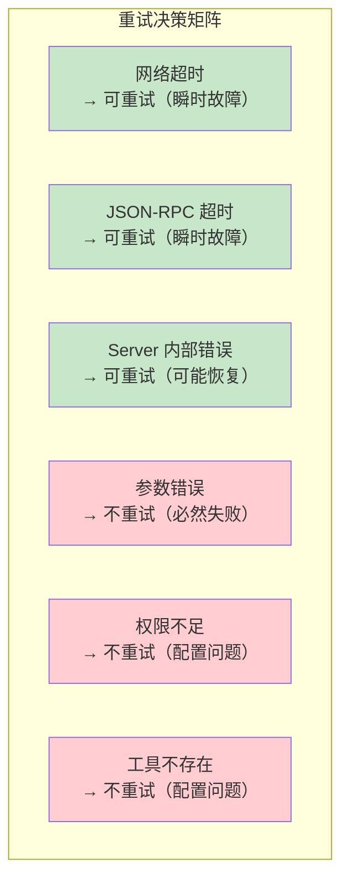

重试只对"可能恢复的瞬时故障"有意义。参数错误、权限不足这类确定性失败，重试 100 次结果也一样——白白浪费资源和延迟。

### 4.2 降级结果设计

```java
private Object degradedResult(ToolInfo tool, Throwable e) {
    return Map.of(
            "degraded", true,
            "tool", tool.globalId(),
            "message", "Service temporarily unavailable. Circuit breaker is open.",
            "fallbackAt", Instant.now().toString());
}
```

**为什么降级结果用 Map 而非 null**：

- `null` 无法区分"工具返回了 null"和"工具被降级了"
- `Map` 携带了降级原因和时间戳，让调用方（尤其是 LLM）能理解当前状态
- LLM 看到 `degraded: true` 后可以告知用户"该服务暂时不可用"，而非将空结果当作真实数据

---

## 5. 安全核心代码

### 5.1 AgentIdentity——权限模型

```java
package com.example.mcp.gateway.auth;

import java.util.Set;

/**
 * Agent 身份信息。
 */
public record AgentIdentity(
        String agentId,        // Agent 唯一标识
        String agentName,      // Agent 名称
        String tier,           // 权限等级：STANDARD / PREMIUM / ADMIN
        Set<String> allowedTools  // 允许调用的工具集合（白名单）
) {
    /**
     * 检查是否有权调用指定工具。
     */
    public boolean canCall(String toolGlobalId) {
        if ("ADMIN".equals(tier)) return true;
        return allowedTools.contains(toolGlobalId)
                || allowedTools.contains("*");
    }
}
```

**权限层级设计**：

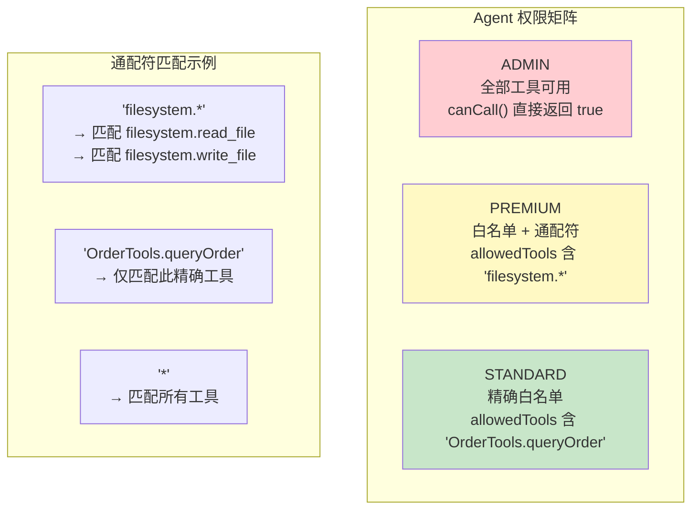

注意当前实现是简化版——通配符 `*` 只做 `Set.contains()` 精确匹配，不支持 `filesystem.*` 这种前缀模式匹配。生产环境需要加入前缀匹配逻辑：

```java
// 生产级权限匹配（支持前缀通配符）
public boolean canCall(String toolGlobalId) {
    if ("ADMIN".equals(tier)) return true;
    // 精确匹配
    if (allowedTools.contains(toolGlobalId)) return true;
    // 前缀通配符匹配：filesystem.* 匹配 filesystem.read_file
    String serverPrefix = toolGlobalId.substring(0,
            toolGlobalId.indexOf('.') + 1) + "*";
    return allowedTools.contains(serverPrefix);
}
```

### 5.2 SecurityValidator——注入检测

```java
private static final Pattern SQL_INJECTION = Pattern.compile(
        "(?i)(union\\s+select|drop\\s+table|insert\\s+into|" +
        "delete\\s+from|--|;\\s*drop|or\\s+1\\s*=\\s*1)"
);

private void checkInjection(ToolCallRequest request, ToolInfo tool) {
    for (var entry : request.arguments().entrySet()) {
        if (entry.getValue() instanceof String strValue) {
            if (tool.serverName().equals("postgres")) {
                if (SQL_INJECTION.matcher(strValue).find()) {
                    throw new SecurityException("SQL injection detected");
                }
            }
        }
    }
}
```

**检测策略的分层设计**：

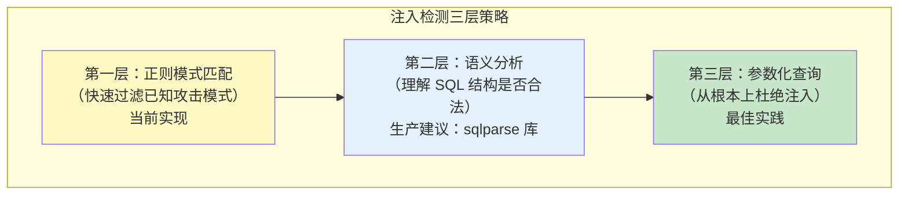

正则匹配只是第一道防线——它的局限在于：规则是有限的、可被绕过的（如编码变换、注释分割）。真正的防御应该让 MCP Server 的 postgres 工具强制使用参数化查询（Prepared Statement），从根源上杜绝 SQL 注入。

**Pattern 预编译的性能考量**：

`Pattern.compile()` 是昂贵操作。将编译好的 `Pattern` 作为 `static final` 常量，在类加载时编译一次，后续所有调用共享同一个编译结果。如果每次校验都 `Pattern.compile()`，在高并发下会成为性能瓶颈。

---

## 6. 审计核心代码

### 6.1 异步审计的虚拟线程优势

```java
@Async
public void record(String agentId, String toolName, Map<String, Object> inputParams) {
    AuditLog entry = new AuditLog();
    entry.setAgentId(agentId);
    entry.setToolName(toolName);
    entry.setInputParams(toJson(inputParams));
    entry.setCalledAt(Instant.now());
    repository.save(entry);  // JPA 写入数据库（完整版见 [02-迭代一 §6.3]）
}
```

**Java 21 虚拟线程如何改变 @Async**：

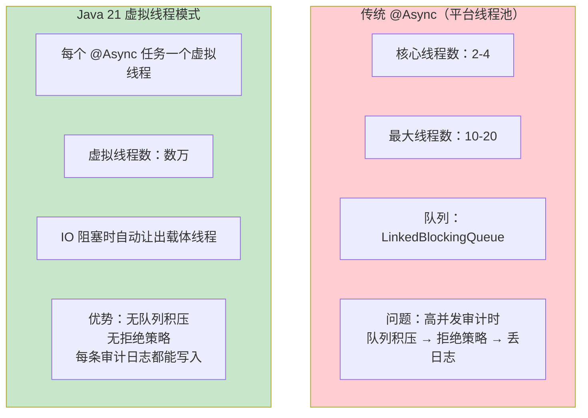

在 `application.yml` 中开启虚拟线程后，Spring Boot 4.1 的 `@Async` 自动使用虚拟线程执行器（`SimpleAsyncTaskExecutor` with virtual threads）。这意味着即使每秒数千次工具调用产生数千条审计日志，也不会因为线程池满而丢弃日志。

### 6.2 审计日志的容错

```java
try {
    AuditLog entry = new AuditLog();
    entry.setAgentId(agentId);
    entry.setToolName(toolName);
    repository.save(entry);
} catch (Exception e) {
    // 审计日志写入失败不能影响主业务
    log.error("Failed to write audit log for tool '{}': {}",
            toolName, e.getMessage());
}
```

**为什么审计失败不影响主业务**：

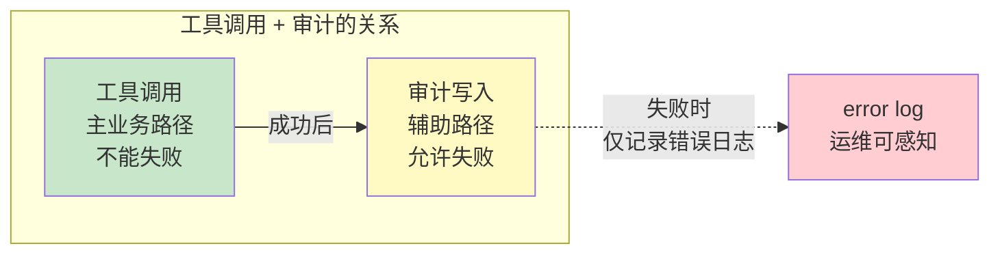

如果审计写入失败导致工具调用也失败，那审计系统就从一个"监控工具"变成了一个"故障源"。正确的做法是审计失败时记录 error 级别日志（运维可以通过日志告警感知），然后继续运行。

对于要求"审计不可丢失"的场景（如金融合规），可以引入消息队列做缓冲层：审计日志先写入 Kafka/RabbitMQ，消费者负责写入数据库，队列自身提供重试和死信队列机制。

---

## 7. 可观测核心代码

### 7.1 GatewayMetrics——指标设计

```java
public void recordToolCall(String serverName, String toolName,
                            boolean success, Duration duration) {
    Counter.builder("mcp.tool.calls")
            .tag("server", serverName)
            .tag("tool", toolName)
            .tag("result", success ? "success" : "failure")
            .register(registry)
            .increment();

    toolCallTimer.record(duration);
}
```

**Tag 的基数控制**：

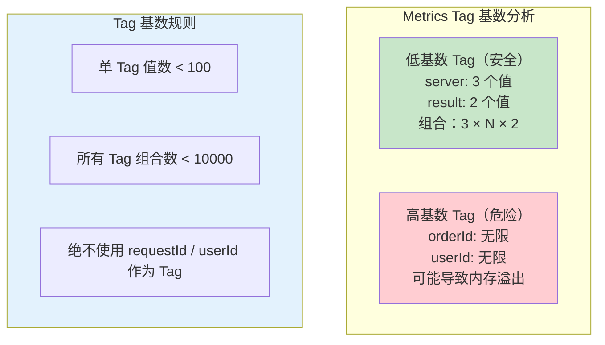

`server` 和 `tool` 是低基数 Tag（Server 数有限、工具数有限），适合做 Counter 的维度标签。`result` 只有 success/failure 两个值，也是安全的。但如果把 `orderId` 作为 Tag，每个订单都会创建一个新的 Time Series，最终导致 Prometheus 内存溢出——这是 Micrometer 使用中的常见陷阱。

### 7.2 Observation 的 Span 层级

```java
return Observation.createNotStarted("mcp.tool.call", observationRegistry)
        .lowCardinalityKeyValue("tool", request.toolName())
        .observe(() -> doCall(request));
```

`observe()` 方法内部做了三件事：

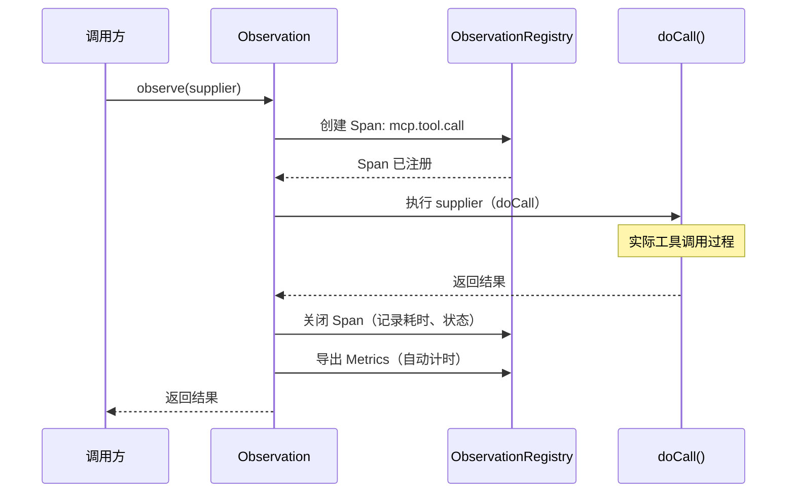

`lowCardinalityKeyValue` 的命名暗示了一个重要原则：Span 的 tag 必须是低基数的。`tool` 标签记录的是工具名（如 `filesystem.read_file`），基数有限。如果误用 `highCardinalityKeyValue` 来记录高基数值（如 traceId），某些可观测后端可能会拒绝或产生过多 Time Series。

---

## 8. MCP Server 工具定义核心

### 8.1 @Tool 注解的工作原理

```java
@Tool(description = "根据订单号查询订单详情，包括金额、状态和物流信息")
public OrderDetail queryOrder(
        @ToolParam(description = "订单号，格式 ORD-XXXXXX") String orderId
) {
    return orderService.queryDetail(orderId);
}
```

**@Tool 到 MCP 的自动映射**（依赖显式 `ToolCallbackProvider` Bean，见 [03-迭代二 §3.5](03-自定义MCP服务端.md)）：

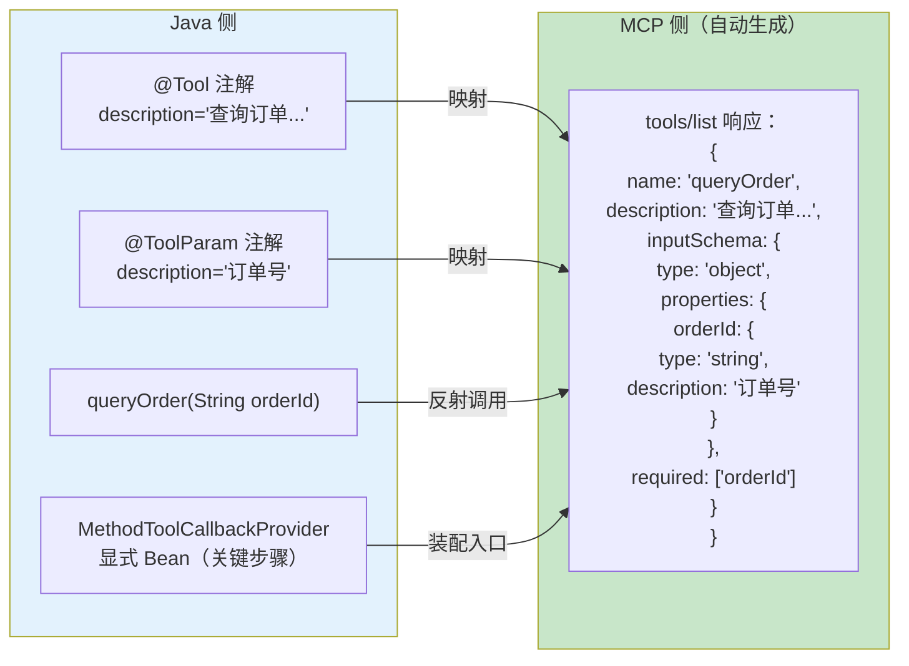

Spring AI 在应用启动时扫描所有 `ToolCallbackProvider` Bean 中的 `@Tool` 注解方法，通过反射提取方法签名和注解元数据，自动生成对应的 MCP 工具 JSON Schema。**缺 `ToolCallbackProvider` Bean 时工具不生效**（附录 05-01 §3 审计教训）。

### 8.2 description 的质量至关重要

```java
// 好的 description——LLM 能准确判断何时使用此工具
@Tool(description = "根据订单号查询订单详情，包括金额、状态和物流信息。订单号格式：ORD-XXXXXX")
public OrderDetail queryOrder(@ToolParam(description = "订单号，格式 ORD-XXXXXX") String orderId) {
    return orderService.queryDetail(orderId);
}

// 差的 description——LLM 无法判断适用场景
@Tool(description = "查订单")
public OrderDetail queryOrder(@ToolParam(description = "订单号") String orderId) {
    return orderService.queryDetail(orderId);
}
```

MCP 工具的 `description` 会被 LLM 作为判断"何时调用此工具"的关键依据。描述越精确、越包含参数格式和返回内容，LLM 的工具选择准确率越高。这是 MCP 工具设计中容易被忽视但影响巨大的细节。

---

## 9. 配置代码核心

### 9.1 虚拟线程配置

```yaml
spring:
  threads:
    virtual:
      enabled: true
```

**这行配置的底层变化**：

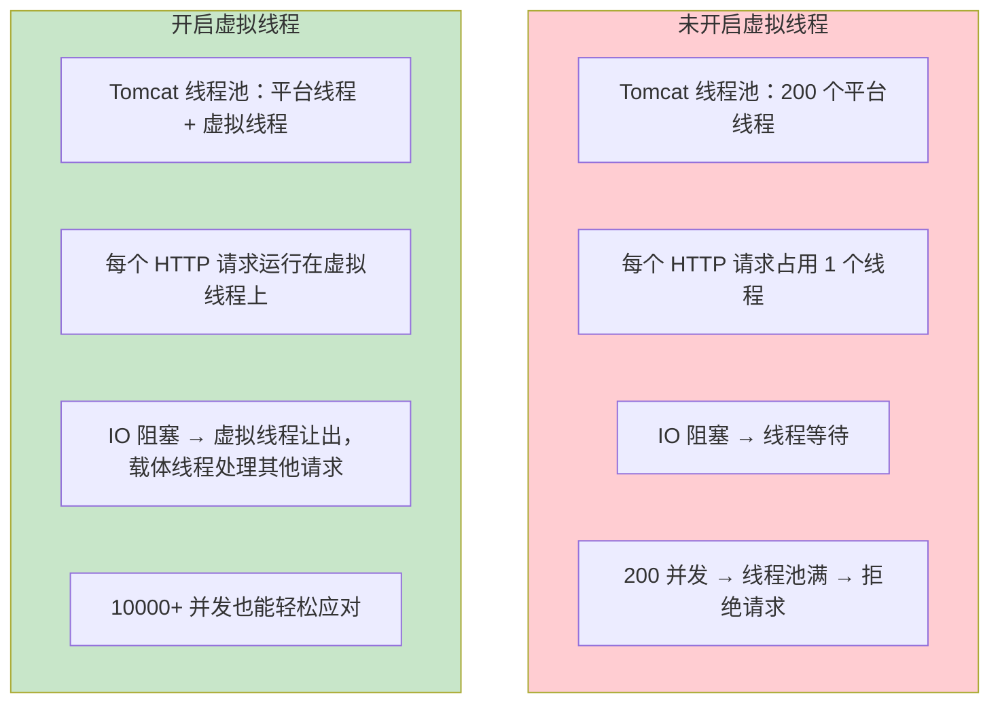

对于 MCP 工具网关这个 IO 密集型应用，虚拟线程带来的提升是数量级的。每次 MCP 工具调用涉及网络 IO（JSON-RPC 到子进程或远程 Server），在传统模式下线程会阻塞等待，而在虚拟线程模式下，载体线程可以继续处理其他请求。

### 9.2 MCP 客户端配置的层次

```yaml
spring:
  ai:
    mcp:
      client:
        stdio:
          servers-configuration: classpath:mcp-servers.json
```

配置层次解析：

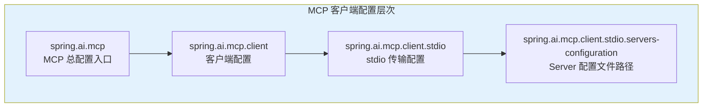

如果需要同时连接远程 Streamable HTTP Server 与本地 stdio Server，并列配置：

```yaml
spring:
  ai:
    mcp:
      client:
        stdio:
          servers-configuration: classpath:mcp-servers.json
        streamable-http-connections:      # ⚠ 现行传输（附录 05-01 §4）
          remote-tools:
            url: https://tools.internal/mcp
```

> ⚠ 修正（审计 2026-08-14）：旧稿的 `sse.connections` 结构对应已废弃的 HTTP+SSE 传输；现行标准是 `streamable-http-connections`（附录 05-01 §4 基准）。

---

## 10. 量化验收表（代码质量）

| 维度 | 检查项 | 达标标准 |
|------|--------|---------|
| **并发安全** | 共享 Map / 状态字段 / 读多写少列表 | `ConcurrentHashMap` / `volatile` / `CopyOnWriteArrayList` |
| **异常处理** | 工具失败传播方式 | 用 `ToolCallResult` 而非异常；审计失败不阻塞主业务 |
| **API 真实性** | MCP 坐标与类型 | `McpSyncClient` + `CallToolRequest` + `ToolCallbackProvider` 均符合附录 05-01 |
| **可观测性** | Tag 基数 / Span | 低基数 Tag；每次调用有 Observation Span |
| **安全防御** | 调用前校验 | 权限白名单 + 注入检测 + 高危阈值 |

## 11. 代码质量自检清单

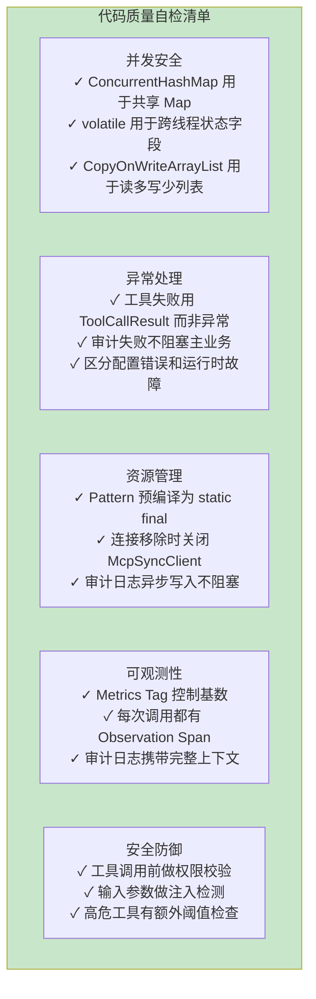

---

## 12. ADR 演进决策

### ADR 03-08：所有共享可变状态收敛到并发容器，避免显式锁

- **决策**：工具缓存/连接池用 `ConcurrentHashMap`，连接状态用 `volatile`，工具列表用 `CopyOnWriteArrayList`；不引入 `synchronized`/`ReentrantLock`
- **取舍理由**：读多写少场景下无锁读收益最大；`volatile` 单字段状态 + 单线程写入方（健康检查定时任务）不会产生竞态，避免锁开销与死锁风险

### ADR 03-09：API 真实性是硬约束——存疑写法一律指向附录 05

- **决策**：本项目所有 MCP 代码以附录 05-01 为准（`McpSyncClient`、`CallToolRequest`、`MethodToolCallbackProvider`）；可观测代码以附录 05-02 为准（`Observation`、`Tracer`）
- **取舍理由**：2026-08 审计发现大量虚构/错误 API（`org.springframework.ai.mcp.McpClient`、`@ToolMethod`、单参 `before/after`、`defaultTools(provider)` 混写）——本项目的价值前提是"照抄可编译"。注意：`BaseAdvisor.before/after`（双参带 AdvisorChain）在 2.0.0 是真实存在的（javap 实证，2026-08-16），禁止的是**错误签名**

---

## 13. 扩展方向

本项目的代码设计为后续扩展预留了清晰的接口：

| 扩展方向 | 实现路径 | 涉及接口 |
|---------|---------|---------|
| **动态注册 MCP Server** | 在运行时添加新 Server 连接到 Pool | `McpClientPool.register()` |
| **自定义供应策略** | 实现 `ToolSupplyStrategy` 接口 | `ToolSupplyStrategy` |
| **插件化安全规则** | 实现 `SecurityRule` 接口，注册到 Validator | `SecurityValidator` |
| **多级缓存** | 在 Router 前加 Caffeine 缓存层 | `ResilientToolRouter` |
| **工具版本管理** | ToolMetadata 增加 version 字段 | `ToolInfo` |
| **GraphQL 端点** | 新增 GraphQL Controller 复用 Router | `ResilientToolRouter` |
| **HITL 审批** | 用 `ToolCallingManager` 装饰器拦工具执行前 | `ToolCallingManager`（附录 05-02 §1.3） |

---

## 14. 总结

本篇对 MCP 工具网关项目的全部核心代码做了深度解析：

1. **数据模型层**：Record 的不可变性和线程安全性使其成为 DTO 的最佳选择。`globalId()` 解决了多 Server 工具名冲突，`ToolCallResult` 的统一结果包装让失败处理更加优雅。

2. **连接管理**：`McpConnection` 实现了四级状态机（CONNECTING → CONNECTED → DEGRADED → DISCONNECTED），渐进式故障检测避免了误判。`ConcurrentHashMap` 的无锁读完美匹配"多读少写"场景。

3. **容错调用链**：Resilience4j 的 `Decorators` 链式组合了熔断、重试、降级三种策略。重试只对瞬时故障生效（参数错误不重试），降级返回结构化 Map 而非 null。

4. **安全模型**：三级 Agent 权限（ADMIN/PREMIUM/STANDARD）+ 工具白名单 + 注入检测 + 高危操作阈值。`Pattern` 预编译为 `static final` 避免重复编译开销。

5. **审计与可观测**：`@Async` + 虚拟线程让审计写入不阻塞主业务。Metrics Tag 严格控制基数防止 Time Series 爆炸。Observation 自动创建 Span 和计时。

6. **MCP 工具定义**：`@Tool` 注解通过显式 `ToolCallbackProvider` Bean 装配后自动生成 MCP JSON Schema。`description` 质量直接影响 LLM 的工具选择准确率。

整个项目的代码设计遵循"简洁而不简陋"的原则——用最少的代码实现完整的生产级功能，每个设计决策都有明确的性能或安全考量。Java 21 的 Record、虚拟线程、模式匹配三个特性在项目中发挥了关键作用，显著降低了代码复杂度。Spring Boot 4.1 + Spring AI 2.0 的自动配置让 MCP Client/Server 的接入几乎零配置，开发者可以专注于业务逻辑而非协议细节。

**下一篇**：[05-MCPStreamableHTTP与OAuth21深化](05-MCPStreamableHTTP与OAuth21深化.md)——传输升级 Streamable HTTP + OAuth 2.1 三重身份授权。
