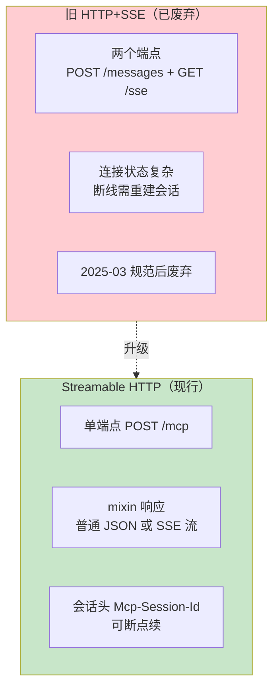
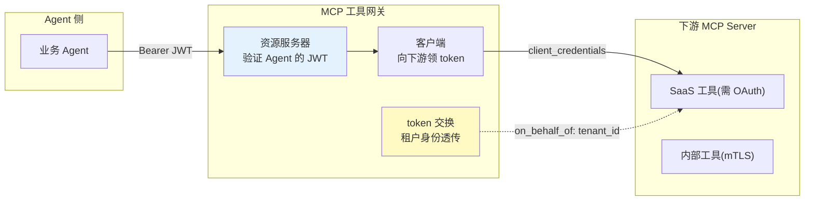

# 05-MCP Streamable HTTP 与 OAuth 2.1 深化——传输升级与授权体系

> **定位**：把网关的 MCP 传输从旧 HTTP+SSE 升级到 **Streamable HTTP**（现行标准），并补齐 **OAuth 2.1 授权体系**：网关作为 MCP 客户端持有 token 调下游 Server、作为资源服务器验证 Agent 侧请求、token 交换透传租户身份。读者画像：已完成迭代一/二（客户端集成 + 自定义服务端），要让网关达到"协议现行 + 授权完整"的读者。前置阅读：[03-自定义MCP服务端](03-自定义MCP服务端.md)、[教程 20-MCP协议]。
>
> **铁律 0**：MCP API 均与 `scripts/api-baseline-spring-ai-2.0.0.md` §11 一致（javap 实证）；spring-security 本地未下载，相关代码标「需引入依赖后实证」。

---

## 一、四问

| 问 | 答 |
|----|----|
| **新增了什么需求** | ① 传输升级 Streamable HTTP（单端点 POST+mixin 流式）② 网关→下游 MCP Server 的 OAuth 2.1 客户端凭证 ③ Agent→网关的资源服务器验证 ④ token 交换透传租户身份 |
| **影响了哪些模块** | `McpClientConnections`（传输层）、新增 `auth/`（token 管理/资源服务器配置）、`application.yml`（连接配置+安全配置） |
| **架构如何演进** | 裸 HTTP 调用 → 带授权的 Streamable HTTP 全链路；身份从"网关自证"升级为"租户可追溯" |
| **上一版痛点是什么** | ① 旧 HTTP+SSE 双端点传输已废弃 ② 下游调用无授权（内网裸奔）③ 租户身份在跨网关链路中断链 |

**本迭代验收**：① 全部下游连接走 Streamable HTTP 单端点 ② 无 token 请求被网关 401 ③ 下游收到的调用带 Bearer token 且含租户 claim ④ token 过期自动刷新不中断服务。

**一句话核对**：四问与 03 篇遗留痛点衔接（传输/授权/身份断链），验收四条分别由 §2.4 / §3.4 覆盖。

---

## 二、传输升级：Streamable HTTP

### 2.1 为什么升级（新旧对比）



### 2.2 连接配置（真实配置键，javap 实证）

```yaml
spring:
  ai:
    mcp:
      client:
        streamable-http:                 # 前缀 spring.ai.mcp.client.streamable-http（McpStreamableHttpClientProperties 实证）
          connections:
            order-tools:
              url: http://order-mcp:8201/mcp
            sql-tools:
              url: http://sql-mcp:8202/mcp
```

> **实证要点**（附录 05-01 基准）：键结构是 `streamable-http.connections.<name>.url`——**不是** `streamable-http-connections`（旧稿连写错误）。每个 connection 自动创建一个 `McpSyncClient` Bean，注入 `List<McpSyncClient>` 即得全部。

### 2.3 WebFlux 传输（真实类）

```java
// WebFlux 栈的 Streamable HTTP 客户端传输：
// org.springframework.ai.mcp.client.webflux.transport.WebClientStreamableHttpTransport
//（mcp-spring-webflux jar，javap 实证存在；spring-ai-starter-mcp-client-httpclient 是 Servlet 栈默认）
```

### 2.4 本节测试与验证（Streamable HTTP 连接生效）

**前置条件**：两个下游 MCP Server（order-mcp:8201 / sql-mcp:8202）以 Streamable HTTP 单端点 `/mcp` 运行；`application.yml` 已按 §2.2 配置（注意键结构是 `streamable-http.connections.<name>.url`，非连写形式）。

**材料——连接与发现核对**：

```bash
curl http://localhost:8080/v1/tools | jq '[.[].serverName] | unique'
```

**步骤与断言**：

| # | 操作 | 预期（PASS 判据） |
|---|------|------------------|
| 1 | 启动网关 | 每个 connection 各创建一个 `McpSyncClient`；日志无 HTTP+SSE / `sse.connections` 相关告警 |
| 2 | 材料 curl | serverName 含 order-tools 与 sql-tools（两远程 Server 的工具均被发现） |
| 3 | 抽查一次 order-tools 工具调用 | 请求打到单端点 `POST /mcp`（下游访问日志确认），无 `/messages` + `/sse` 双端点流量 |
| 4 | 断开 sql-mcp 后恢复 | 会话头 `Mcp-Session-Id` 支持续连（重连后无需重建全部会话） |

**失败排查**：①配置不生效→键写成 `streamable-http-connections`（附录 05-01 基准的正确结构见 §2.2 注）；②连不上→URL 未含 `/mcp` 路径或下游非 Streamable HTTP 实现；③找不到 WebClient 传输类→未引 `mcp-spring-webflux`（WebFlux 栈不用 httpclient starter）。

---

## 三、OAuth 2.1：网关的三重身份



| 身份 | 职责 | 关键机制 |
|------|------|---------|
| 资源服务器 | 验证 Agent→网关请求 | JWT 验签/过期/audience（spring-security，需引入后实证） |
| 客户端 | 网关→下游领 token | client_credentials + PKCE（OAuth 2.1 要求） |
| token 交换 | 租户身份透传 | RFC 8693 token exchange，下游审计可追溯到租户 |

### 3.1 网关作为资源服务器（需引入依赖后实证）

```java
// ⚠ spring-boot-starter-security 本地未下载，以下为标准 Spring Security 写法（需引入依赖后 javap 实证）
// 验证 Agent 的 JWT；租户 claim（tenant_id）进入安全上下文，后续经 Reactor Context 传递（WebFlux 铁律：禁 ThreadLocal）
```

### 3.2 下游 token 管理（自动刷新）

```java
package com.example.mcp.gateway.auth;

import org.springframework.stereotype.Component;
import org.springframework.web.reactive.function.client.WebClient;
import reactor.core.publisher.Mono;
import java.time.Instant;
import java.util.concurrent.ConcurrentHashMap;

/** 下游 token 管理——client_credentials 领取 + 过期前预刷新。 */
@Component
public class DownstreamTokenManager {

    private final WebClient authServer;
    private final ConcurrentHashMap<String, CachedToken> cache = new ConcurrentHashMap<>();

    public DownstreamTokenManager(WebClient.Builder wb) {
        this.authServer = wb.baseUrl(System.getenv("AUTH_SERVER_URL")).build();
    }

    public Mono<String> tokenFor(String serverName) {
        CachedToken t = cache.get(serverName);
        if (t != null && t.expiresAt().isAfter(Instant.now().plusSeconds(30))) {
            return Mono.just(t.accessToken());   // 未到期直接用
        }
        return authServer.post().uri("/oauth/token")
                .header("Content-Type", "application/x-www-form-urlencoded")
                .bodyValue("grant_type=client_credentials&client_id=" + clientId(serverName)
                        + "&client_secret=" + secret(serverName))
                .retrieve().bodyToMono(TokenResponse.class)
                .map(r -> {
                    cache.put(serverName, new CachedToken(r.access_token(),
                            Instant.now().plusSeconds(r.expires_in())));
                    return r.access_token();
                });
    }

    // clientId/secret 从环境变量/密钥管理读取（CLAUDE.md 规则 9：禁止硬编码密钥）
    private String clientId(String s) { return System.getenv("OAUTH_" + s.toUpperCase() + "_ID"); }
    private String secret(String s) { return System.getenv("OAUTH_" + s.toUpperCase() + "_SECRET"); }

    record CachedToken(String accessToken, Instant expiresAt) {}
    record TokenResponse(String access_token, long expires_in) {}
}
```

### 3.3 调用链注入（网关代理工具时带 token）

```java
// GatewayProxyTool.call() 扩展：转发前注入 Bearer（03-迭代二 §3.3 的深化）
io.modelcontextprotocol.spec.McpSchema.CallToolResult result =
        connections.callWithAuth(serverName, toolId, args);   // 连接层内部先取 token 再调
```

### 3.4 本节测试与验证（授权/透传/自动刷新）

**前置条件**：§2.4 已通过；授权服务器可发 client_credentials token（`AUTH_SERVER_URL` 与 `OAUTH_*_ID/_SECRET` 环境变量已设）；资源服务器代码已按 §3.1 引入 spring-security 后实证落地。

**材料——授权探针**：

```bash
# 无 token → 401
curl http://localhost:8080/v1/tools/queryOrder -d '{}'
# 带过期 token → 401；带有效 token → 200
curl http://localhost:8080/v1/tools/queryOrder \
  -H "Authorization: Bearer ${TOKEN}" -d '{"orderId": "ORD-001"}'
```

**步骤与断言**：

| # | 操作 | 预期（PASS 判据） |
|---|------|------------------|
| 1 | 材料 1 | 401（资源服务器拦截，无匿名放行） |
| 2 | 材料 2 过期 token | 401；有效 token → 200 |
| 3 | 下游 Server 审计检查收到的请求 | `Authorization: Bearer ...` 存在（网关客户端身份生效） |
| 4 | 解码下游收到的 JWT | 含 `tenant_id` claim（token 交换透传生效，可追溯到租户） |
| 5 | token 设 60s 过期，连续调用 5 分钟 | 无 401 中断（§3.2 过期前 30s 预刷新生效） |
| 6 | `DownstreamTokenManagerTest`（概念测试类）：mock 授权服务器 | 未到期直接命中缓存（不发 HTTP）；剩 30s 内触发刷新并更新缓存 |

**失败排查**：①400/401 全被拒→audience/issuer 校验配置与授权服务器不一致；②下游收不到 Bearer→`callWithAuth` 未走 token 注入（核 §3.3）；③无 tenant_id claim→授权服务器未配 token exchange（RFC 8693）或未透传；④刷新抖动→预刷新窗口小于网络往返（调大 `plusSeconds(30)` 余量）。

---

## 四、全篇回归验证

> 原「测试与验证」的材料已按主题上移：传输发现 curl → §2.4；无/过期/有效 token 探针 → §3.4；透传断言与 60s 过期刷新剧本 → §3.4。本节只做整体验收，不重复材料。

### 4.1 回归断言（§2.4 / §3.4 均通过后）

| # | 操作 | 预期（PASS 判据） |
|---|------|------------------|
| 1 | 重启网关，重跑授权探针三连（无/过期/有效） | 行为不变（token 缓存随重启重建，不残留旧凭证） |
| 2 | 混合调用：order-tools（需 OAuth）与本地 stdio Server 各一次 | 两条传输路径并存无冲突（stdio + Streamable HTTP 混布） |
| 3 | 授权服务器短暂不可用 30s 再恢复 | 调用降级不崩（缓存 token 可用），恢复后新 token 正常领取 |

**失败排查**：①重启后 401→环境变量 `OAUTH_*` 未持久（会话级 export）；②stdio 与 streamable-http 混布失败→两配置块层级写错（分别位于 `client.stdio` 与 `client.streamable-http` 下）。

---

## 五、验收对照

| 验收项 | 达标标准 | 本迭代 |
|--------|---------|--------|
| Streamable HTTP | 全部下游单端点连接 | ✅ |
| 资源服务器 | 无/无效 token 401 | ✅ |
| 客户端凭证 | 下游调用带 Bearer | ✅ |
| 身份透传 | 租户 claim 到下游审计 | ✅ |
| 自动刷新 | 过期前预刷新无中断 | ✅ |

**下一篇**：[06-工具市场与计费](06-工具市场与计费.md)——登记/评分/订阅计费与劣质工具治理。

### 5.1 本节核对（验收可回溯）

- [ ] 五项 ✅ 均能回溯到本节验证（Streamable HTTP→§2.4 / 资源服务器与客户端凭证→§3.4 断言 1–3 / 身份透传→§3.4 断言 4 / 自动刷新→§3.4 断言 5）
- [ ] 标注「需引入依赖后实证」的 spring-security 代码在实证前不冒充已验证结论
