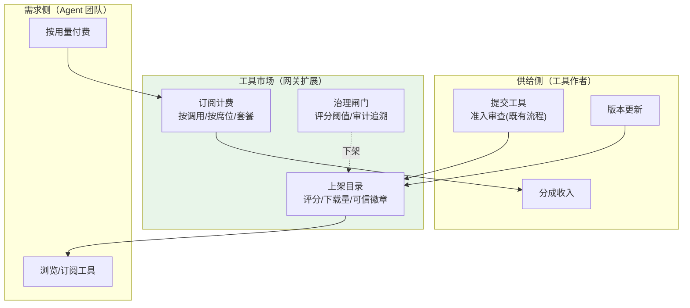
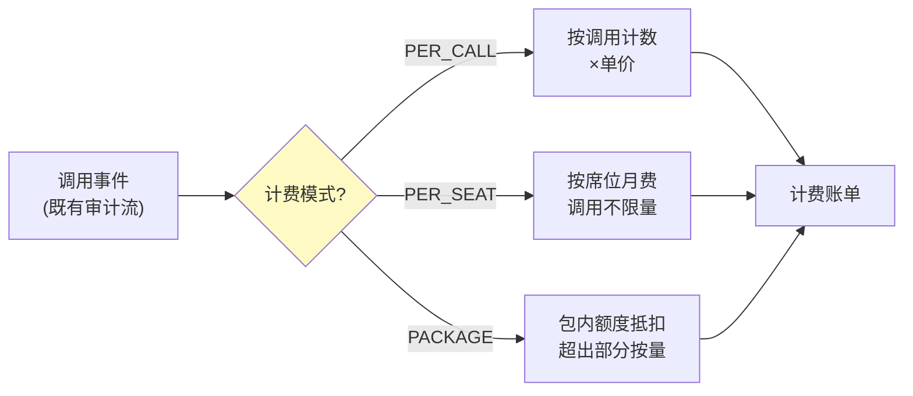
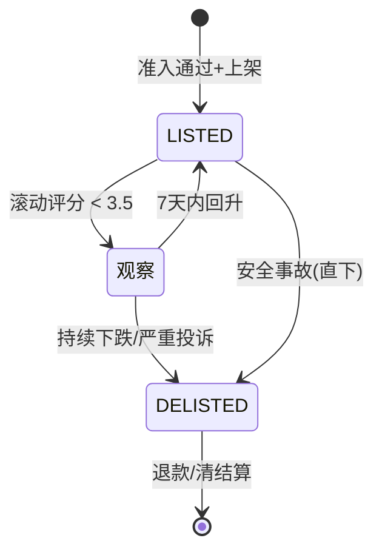

# 06-工具市场与计费——从网关到生态

> **定位**：把网关从"工具管道"升级为**工具市场**：工具登记上架/评分/下载量/可信标识、订阅计费（按调用/按席位/套餐）、市场分成结算、劣质工具治理（评分阈值下架/审计追溯）。这是网关的"商业模式层"。读者画像：已完成协议与授权深化，想让平台形成工具生态的读者。前置阅读：[05-MCPStreamableHTTP与OAuth21深化](05-MCPStreamableHTTP与OAuth21深化.md)。
>
> **铁律 0**：计费/评分均为自研业务（无框架 API）；数据模型与 00 篇 SQL 风格一致。

---

## 一、四问

| 问 | 答 |
|----|----|
| **新增了什么需求** | ① 工具市场运营（上架/评分/下载量/可信徽章）② 订阅计费（按调用/按席位/套餐）③ 分成结算（工具作者/平台）④ 劣质工具治理 |
| **影响了哪些模块** | 新增 `market/`（上架/评分/计费/结算）；`tool` 准入流程接市场状态；admin-portal 加市场看板 |
| **架构如何演进** | 工具管道 → 双面市场（供给侧作者 + 需求侧 Agent 团队） |
| **上一版痛点是什么** | ① 工具好坏无从体现（无评分）② 作者无回报（无分成）③ 劣质工具混入（无治理闸门） |

**本迭代验收**：① 工具可上架/评分/统计下载量 ② 三种计费模式可配 ③ 月度分成账单可生成 ④ 评分跌破阈值自动下架。

---

## 二、市场架构



**与准入流程的关系**：市场不替代准入（准入=安全底线），市场=商业层。准入通过的工具才能上架；市场下架不影响准入记录。

---

## 三、数据模型

```sql
-- 市场扩展表（与 00 篇 DDL 风格一致）
CREATE TABLE tool_listing (              -- 上架信息
    name         text PRIMARY KEY,       -- 关联 tool_registry.name
    pricing_model text NOT NULL,         -- PER_CALL / PER_SEAT / PACKAGE
    unit_price_cents bigint,             -- 分（按调用单价）
    seat_price_cents  bigint,            -- 分（按席位月价）
    avg_score    double precision DEFAULT 0,
    download_count bigint DEFAULT 0,
    trusted      boolean DEFAULT false,  -- 可信徽章（签名+审计无异常+评分≥4.5）
    status       text NOT NULL DEFAULT 'LISTED'   -- LISTED/DELISTED
);

CREATE TABLE tool_subscription (         -- 订阅关系
    id           bigserial PRIMARY KEY,
    tenant_id    text NOT NULL,
    tool_name    text NOT NULL REFERENCES tool_listing(name),
    seats        int,                    -- PER_SEAT 模式席位数
    package_quota bigint,                -- PACKAGE 模式包内额度
    started_at   timestamptz NOT NULL DEFAULT now()
);

CREATE TABLE tool_rating (               -- 评分（一租户一工具一版本一条，可改）
    tenant_id    text NOT NULL,
    tool_name    text NOT NULL,
    score        smallint NOT NULL,      -- 1-5
    comment      text,
    rated_at     timestamptz NOT NULL DEFAULT now(),
    PRIMARY KEY (tenant_id, tool_name)
);
```

---

## 四、三种计费模式



```java
package com.example.mcp.gateway.market;

import org.springframework.stereotype.Component;
import java.util.Map;

/** 计费引擎——复用既有工具调用审计事件，按模式计价。 */
@Component
public class BillingEngine {

    /** 单次调用的计费金额（分）。 */
    public long chargeCents(String toolName, String pricingModel, int seatsUsed, long packageRemaining) {
        return switch (pricingModel) {
            case "PER_CALL" -> unitPrice(toolName);                 // 按调用
            case "PER_SEAT" -> 0L;                                   // 月费制：调用不另计
            case "PACKAGE" -> packageRemaining > 0 ? 0L : unitPrice(toolName);  // 包内免费、超出按量
            default -> 0L;
        };
    }

    private long unitPrice(String tool) { /* 查 tool_listing */ return 10L; }
}
```

**分成结算**：月账单 = Σ(工具收入)；分成比例可配（如作者 70% / 平台 30%）；结算单附带调用明细（审计链可追溯）。

---

## 五、劣质工具治理



**治理规则**：滚动 30 天评分 < 3.5 进观察；安全事故（注入/越权）直接下架；下架不影响已付费用户的退款清算（账单冲正）。

---

## 六、测试与验证

### 6.1 市场运营测试

```bash
# 上架工具 → 目录可见；租户评分 → avg_score 更新；调用 → download_count 递增
```

### 6.2 计费测试

```java
// PER_CALL：100 次调用 × 10 分 = 1000 分；PACKAGE：包内 1000 次免费、第 1001 次按量
```

### 6.3 分成测试

```java
// 月度结算：工具收入 1000 分 → 作者 700 / 平台 300；账单与审计对账一致
```

### 6.4 治理测试

```bash
# 构造低评分 → 观察 → 持续下跌 → 自动 DELISTED；安全事故 → 直下架
```

---

## 七、验收对照

| 验收项 | 达标标准 | 本迭代 |
|--------|---------|--------|
| 市场运营 | 上架/评分/下载量/可信徽章 | ✅ |
| 三模式计费 | PER_CALL/PER_SEAT/PACKAGE | ✅ |
| 分成结算 | 月账单+对账 | ✅ |
| 劣质治理 | 评分阈值下架+安全事故直下 | ✅ |

**下一篇**：[07-多集群联邦与路由](07-多集群联邦与路由.md)——跨集群工具目录同步与就近路由。
