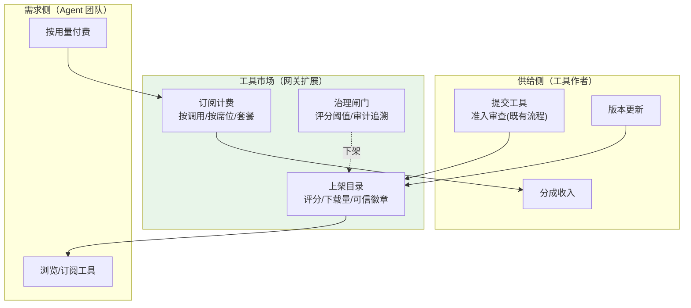
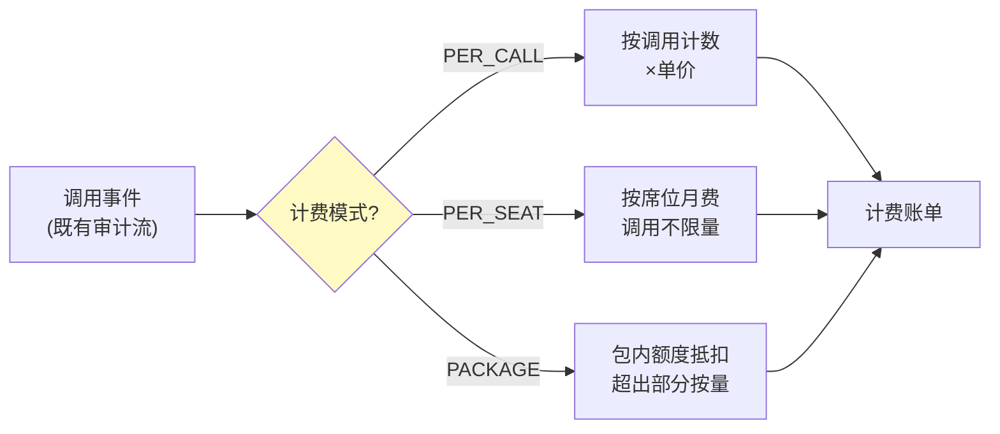
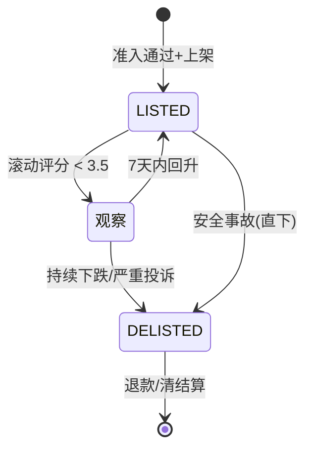

# 06-工具市场与计费——从网关到生态

> **定位**：把网关从"工具管道"升级为**工具市场**：工具登记上架/评分/下载量/可信标识、订阅计费（按调用/按席位/套餐）、市场分成结算、劣质工具治理（评分阈值下架/审计追溯）。这是网关的"商业模式层"。读者画像：已完成协议与授权深化，想让平台形成工具生态的读者。前置阅读：[05-MCPStreamableHTTP与OAuth21深化](05-MCPStreamableHTTP与OAuth21深化.md)。
>
> **铁律 0**：计费/评分均为自研业务（无框架 API）；数据模型与 00 篇 SQL 风格一致。

---

## 一、四问

| 问 | 答 |
|----|----|
| **新增了什么需求** | ① 工具市场运营（上架/评分/下载量/可信徽章）② 订阅计费（按调用/按席位/套餐）③ 分成结算（工具作者/平台）④ 劣质工具治理 |
| **影响了哪些模块** | 新增 `market/`（上架/评分/计费/结算）；`tool` 准入流程接市场状态；admin-portal 加市场看板 |
| **架构如何演进** | 工具管道 → 双面市场（供给侧作者 + 需求侧 Agent 团队） |
| **上一版痛点是什么** | ① 工具好坏无从体现（无评分）② 作者无回报（无分成）③ 劣质工具混入（无治理闸门） |

**本迭代验收**：① 工具可上架，评分 1-5、下载量实时累计 ② PER_CALL/PER_SEAT/PACKAGE 三种计费模式可配，单价精确到分 ③ 月度分成账单可生成，与审计对账误差为 0 ④ 滚动 30 天评分均值 < 3.5 自动进观察/下架，安全事故直接下架。

**一句话核对**：四问三痛点（无评分/无分成/无治理）与验收四条一一对应，分别由 §2.2 / §4.2 / §4.3 / §5.2 覆盖。

---

## 二、市场架构



**与准入流程的关系**：市场不替代准入（准入=安全底线），市场=商业层。准入通过的工具才能上架；市场下架不影响准入记录。

### 2.1 本节核对（市场架构自洽）

- [ ] 双面市场三要素（上架目录/订阅计费/治理闸门）与 §三 数据模型三张表一一对应
- [ ] "市场不替代准入"边界与 03 篇准入/白名单体系无职责重叠
- [ ] 治理闸门与上架目录的"下架"边在图中存在（治理可反作用于目录）

---

## 三、数据模型

```sql
-- 市场扩展表（与 00 篇 DDL 风格一致）
CREATE TABLE tool_listing (              -- 上架信息
    name         text PRIMARY KEY,       -- 关联 tool_registry.name
    pricing_model text NOT NULL,         -- PER_CALL / PER_SEAT / PACKAGE
    unit_price_cents bigint,             -- 分（按调用单价）
    seat_price_cents  bigint,            -- 分（按席位月价）
    avg_score    double precision DEFAULT 0,
    download_count bigint DEFAULT 0,
    trusted      boolean DEFAULT false,  -- 可信徽章（签名+审计无异常+评分≥4.5）
    status       text NOT NULL DEFAULT 'LISTED'   -- LISTED/DELISTED
);

CREATE TABLE tool_subscription (         -- 订阅关系
    id           bigserial PRIMARY KEY,
    tenant_id    text NOT NULL,
    tool_name    text NOT NULL REFERENCES tool_listing(name),
    seats        int,                    -- PER_SEAT 模式席位数
    package_quota bigint,                -- PACKAGE 模式包内额度
    started_at   timestamptz NOT NULL DEFAULT now()
);

CREATE TABLE tool_rating (               -- 评分（一租户一工具一版本一条，可改）
    tenant_id    text NOT NULL,
    tool_name    text NOT NULL,
    score        smallint NOT NULL,      -- 1-5
    comment      text,
    rated_at     timestamptz NOT NULL DEFAULT now(),
    PRIMARY KEY (tenant_id, tool_name)
);
```

### 3.1 本节测试与验证（市场表 DDL 与运营字段）

**前置条件**：PostgreSQL 可连；三张表按上文 DDL 建好。

**材料——建表与运营核对 SQL**：

```sql
INSERT INTO tool_listing (name, pricing_model, unit_price_cents)
VALUES ('filesystem.read_file', 'PER_CALL', 10);
INSERT INTO tool_rating (tenant_id, tool_name, score) VALUES ('t1', 'filesystem.read_file', 5);
UPDATE tool_listing SET avg_score = (
  SELECT avg(score) FROM tool_rating WHERE tool_name = 'filesystem.read_file')
WHERE name = 'filesystem.read_file';
SELECT name, avg_score, download_count, status FROM tool_listing;
```

**步骤与断言**：

| # | 操作 | 预期（PASS 判据） |
|---|------|------------------|
| 1 | 执行 DDL | 三表创建成功；`tool_subscription.tool_name` 外键指向 `tool_listing.name` |
| 2 | 材料 INSERT 同租户同工具再评一次 | 主键 `(tenant_id, tool_name)` 冲突 → 改用 UPDATE（一租户一工具一条，符合"可改"语义） |
| 3 | 材料 UPDATE/SELECT | `avg_score=5.0` 正确聚合 |
| 4 | `tool_listing.status` 插入默认值 | `LISTED`；`trusted` 默认 false |

**失败排查**：①外键失败→先建 `tool_listing`；②评分重复插入报错→属预期（主键设计如此），评分入口应走 upsert；③`bigserial` 报错→PG 版本过旧或用了非 PG 库。

---

## 四、三种计费模式



```java
package com.example.mcp.gateway.market;

import org.springframework.jdbc.core.JdbcTemplate;
import org.springframework.stereotype.Component;
import java.util.List;
import java.util.Map;

/** 计费引擎——复用既有工具调用审计事件，按模式计价。 */
@Component
public class BillingEngine {

    private final JdbcTemplate jdbc;

    public BillingEngine(JdbcTemplate jdbc) {
        this.jdbc = jdbc;
    }

    /** 单次调用的计费金额（分）。 */
    public long chargeCents(String toolName, String pricingModel, int seatsUsed, long packageRemaining) {
        return switch (pricingModel) {
            case "PER_CALL" -> unitPrice(toolName);                 // 按调用
            case "PER_SEAT" -> 0L;                                   // 月费制：调用不另计
            case "PACKAGE" -> packageRemaining > 0 ? 0L : unitPrice(toolName);  // 包内免费、超出按量
            default -> 0L;
        };
    }

    /** 按调用单价（分）——查上架目录真实价格；未上架/已下架视为 0（不产生费用）。 */
    private long unitPrice(String tool) {
        List<Long> prices = jdbc.query(
                "SELECT unit_price_cents FROM tool_listing WHERE name = ? AND status = 'LISTED'",
                (rs, rowNum) -> rs.getLong(1), tool);
        return prices.isEmpty() ? 0L : prices.get(0);
    }
}
```

**分成结算**：月账单 = Σ(工具收入)；分成比例可配（如作者 70% / 平台 30%）；结算单附带调用明细（审计链可追溯）。

### 4.1 本节测试与验证（三模式计费与分成）

**前置条件**：§3.1 表已建；`BillingEngine` 已实现（unitPrice 真实查表而非示例 10L）。

**执行方式**：`mvn test -Dtest=BillingEngineTest` 驱动断言 1–4；对账断言（5）需先跑一次真实调用流（`curl -X POST http://localhost:8081/tools/call`）再对审计表 SQL 对账。

**步骤与断言**：

| # | 操作 | 预期（PASS 判据） |
|---|------|------------------|
| 1 | `BillingEngineTest`：PER_CALL 调 100 次（单价 10 分） | 总计费 1000 分 |
| 2 | PER_SEAT：任意次数调用 | 单次 `chargeCents` 恒为 0（月费另计） |
| 3 | PACKAGE：包内剩余 >0 调 1000 次 | 全部 0；第 1001 次（剩余 0）按单价计费 |
| 4 | 未知模式 | 返回 0 不抛异常（default 分支兜底） |
| 5 | 月度结算：工具收入 1000 分、分成 70/30 | 作者 700 / 平台 300；结算单调用明细数 = 审计表当月该工具调用数（对账一致） |

**失败排查**：①PACKAGE 边界错（第 1001 次仍免费）→`packageRemaining > 0` 判断与扣减时机不一致；②对账不平→计费事件与审计事件非同源（应复用同一审计流，如图"调用事件(既有审计流)"）；③分成比例算错→先算总额再拆分，禁止分别累加。

---

## 五、劣质工具治理



**治理规则**：滚动 30 天评分 < 3.5 进观察；安全事故（注入/越权）直接下架；下架不影响已付费用户的退款清算（账单冲正）。

### 5.1 本节测试与验证（治理状态机）

**前置条件**：§3.1 表已建且有工具在架。

**材料——低评分剧本**：

```sql
-- 多租户给同一工具打低分，压低滚动均值
INSERT INTO tool_rating (tenant_id, tool_name, score) VALUES ('t1','filesystem.read_file',2)
  ON CONFLICT (tenant_id, tool_name) DO UPDATE SET score = 2, rated_at = now();
```

**步骤与断言**：

| # | 操作 | 预期（PASS 判据） |
|---|------|------------------|
| 1 | 材料低分使滚动 30 天均值 < 3.5 | status 置为观察态（不立即 DELISTED） |
| 2 | 7 天内回升 ≥ 3.5 | 回到 LISTED（自动恢复路径） |
| 3 | 持续下跌超观察窗 | DELISTED（自动下架） |
| 4 | 注入安全事故（复用 03 篇 §5.5 材料 4 命中记录） | 直接 DELISTED（跳过观察） |
| 5 | DELISTED 后查 tool_subscription | 仍在（下架不删订阅）；触发退款/账单冲正流程 |

**失败排查**：①一跌就下架→未实现观察态（核对 stateDiagram 五条迁移）；②安全事故未直下→治理只订阅评分事件、漏订阅安全事件；③下架后订阅被级联删除→外键无 ON DELETE、治理层误用 DELETE（应只改 status）。

---

## 六、全篇回归验证

> 原「测试与验证」的材料已按主题上移：市场表运营字段 → §3.1；PER_CALL/PACKAGE 边界与分成对账 → §4.1；低评分/安全事故治理剧本 → §5.1。本节只做整体验收，不重复材料。

### 6.1 回归断言（§3.1 / §4.1 / §5.1 均通过后）

| # | 操作 | 预期（PASS 判据） |
|---|------|------------------|
| 1 | 上架 → 评分 → 调用 → 结算全流程走一遍 | 目录可见、avg_score 更新、download_count 递增、账单可生成（四条验收闭环） |
| 2 | 下架工具后再调用 | 调用被拒（市场状态接入准入链）；已付费用户退款清算记录存在 |
| 3 | 月账单与审计总账对账 | Σ计费 = 账单总额，误差为 0 |

**失败排查**：①下架后仍可调→调用链未检查 `tool_listing.status`（市场状态与执行链脱节）；②对账误差→审计事件异步延迟（结算窗口结束后再对账）。

---

## 七、验收对照

| 验收项 | 达标标准 | 本迭代 |
|--------|---------|--------|
| 市场运营 | 上架/评分(1-5)/下载量/可信徽章(评分≥4.5) | ✅ |
| 三模式计费 | PER_CALL/PER_SEAT/PACKAGE，单价精确到分 | ✅ |
| 分成结算 | 月账单 + 审计对账误差 0 | ✅ |
| 劣质治理 | 30 天均值 < 3.5 观察→下架；安全事故直下 | ✅ |

**下一篇**：[07-多集群联邦与路由](07-多集群联邦与路由.md)——跨集群工具目录同步与就近路由。

### 7.1 本节核对（验收可回溯）

- [ ] 四项 ✅ 均能回溯到本节验证（市场运营→§3.1 / 三模式计费→§4.1 断言 1–3 / 分成结算→§4.1 断言 5 / 劣质治理→§5.1）
