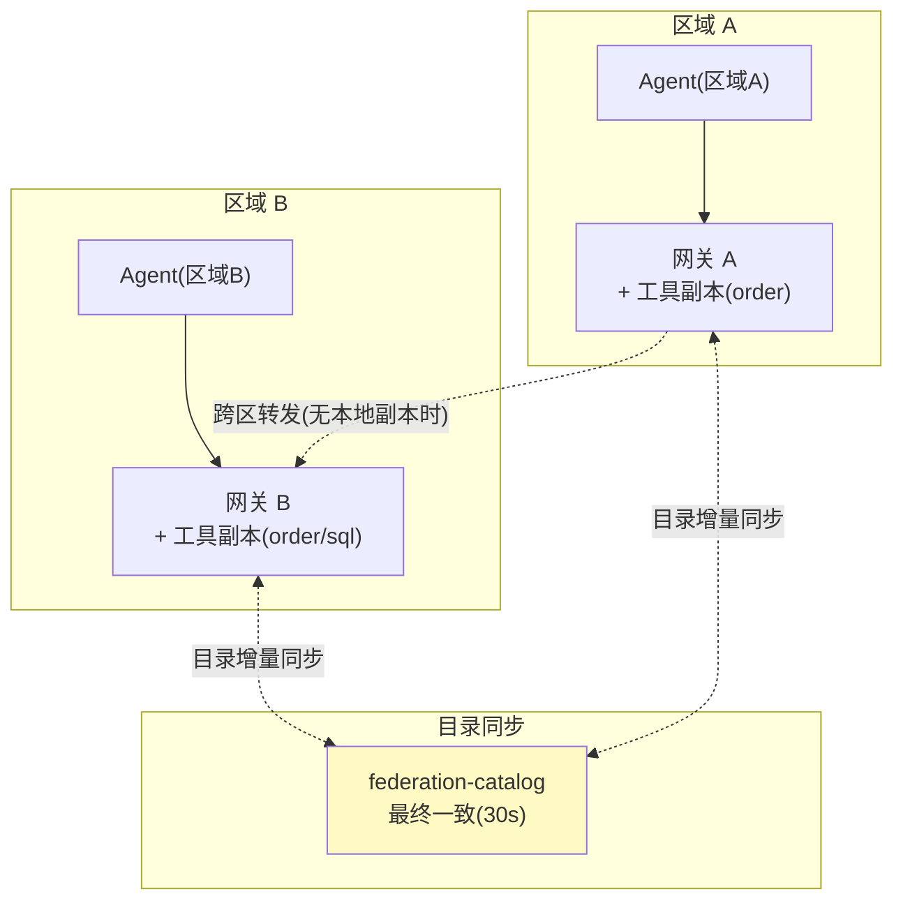
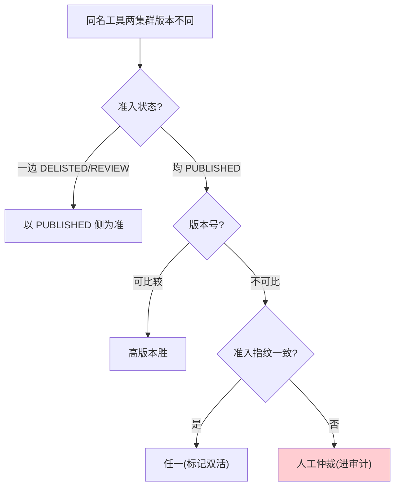
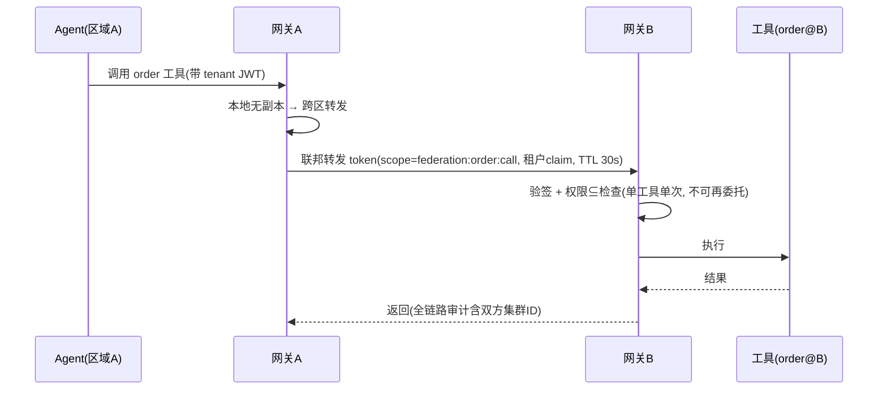

# 07-多集群联邦与路由——跨集群目录同步 + 就近接入

> **定位**：把单一网关扩展为**多集群联邦**：跨集群工具目录同步（最终一致）、就近路由（区域工具副本/延迟感知）、联邦鉴权（跨集群 token 委托不放大权限）、全局目录一致性（冲突消解）。读者画像：工具规模/地域规模超出单集群，需要联邦化的读者。前置阅读：[06-工具市场与计费](06-工具市场与计费.md)。
>
> **铁律 0**：联邦机制为自研业务；MCP 调用签名与基准 §11 一致。

---

## 一、四问

| 问 | 答 |
|----|----|
| **新增了什么需求** | ① 多集群网关联邦（目录同步）② 就近路由（延迟感知）③ 联邦鉴权（token 委托）④ 目录冲突消解 |
| **影响了哪些模块** | 新增 `federation/`（目录同步/路由决策）；`GatewayProxyTool` 支持跨集群转发 |
| **架构如何演进** | 单网关 → 联邦网关集群（每区域一套，目录互通、调用就近） |
| **上一版痛点是什么** | ① 单集群容量/地域上限 ② 跨地域调用延迟高 ③ 跨集群无信任传递机制 |

**本迭代验收**：① A 集群登记的工具 B 集群 ≤30s 可见 ② 同名工具多副本时路由到延迟最低者 ③ 跨集群调用权限不放大 ④ 目录冲突按规则消解。

**一句话核对**：三痛点（单集群上限/跨域延迟/无信任传递）与验收四条对应，分别由 §3.3 / §4.1 / §5.1 / §3.3 覆盖。

---

## 二、联邦架构



**联邦原则**：目录互通（全局可见）、执行就近（本地优先）、鉴权不放大（跨集群 token 权限 ⊆ 原始权限）。

### 2.1 本节核对（联邦架构自洽）

- [ ] 三条联邦原则分别由 §三（互通）/§四（就近）/§五（不放大）落地，无遗漏
- [ ] 图中"跨区转发(无本地副本时)"边与 §四 路由代码的本地优先分支一致
- [ ] 同步中介 federation-catalog 的 30s 与 §3.1 `@Scheduled(fixedDelay = 30_000)` 一致

---

## 三、目录同步

### 3.1 同步模型（最终一致 + 版本向量）

```java
package com.example.mcp.gateway.federation;

import org.springframework.jdbc.core.JdbcTemplate;
import org.springframework.scheduling.annotation.Scheduled;
import org.springframework.stereotype.Component;
import java.util.List;

/** 目录同步——增量拉取兄弟集群的目录变更，本地合并。 */
@Component
public class CatalogSyncService {

    private final JdbcTemplate jdbc;
    private final List<String> peers;   // 兄弟网关地址（配置注入）

    public CatalogSyncService(JdbcTemplate jdbc, List<String> peers) {
        this.jdbc = jdbc;
        this.peers = peers;
    }

    @Scheduled(fixedDelay = 30_000)     // 30s 最终一致
    public void sync() {
        for (String peer : peers) {
            // ① 拉取 peer 的目录增量（version > 本地已知该 peer 的水位）
            // ② 冲突消解（见 §3.2）
            // ③ 合入本地联邦目录表 federation_tool_catalog
        }
    }
}
```

### 3.2 冲突消解规则



### 3.3 本节测试与验证（同步时序与冲突消解）

**前置条件**：两套网关（A/B）可互访；`federation_tool_catalog` 表已建；`peers` 配置互指。

**材料——同步剧本**：

```bash
# A 集群登记新工具（或直接 INSERT 目录表）
# B 集群观察同步结果
watch -n 5 'curl -s http://gateway-b:8080/v1/tools | jq ".[].name" | grep newTool'
```

**步骤与断言**：

| # | 操作 | 预期（PASS 判据） |
|---|------|------------------|
| 1 | A 登记新工具后观察 B | ≤30s 内 B 的 discover 可见（验收①） |
| 2 | A 下架该工具 | ≤30s 内 B 同步移除 |
| 3 | 冲突场景 1：同名工具 A 侧 PUBLISHED、B 侧 DELISTED | 以 PUBLISHED 侧为准 |
| 4 | 冲突场景 2：两侧均 PUBLISHED 且版本可比 | 高版本胜 |
| 5 | 冲突场景 3：版本不可比 + 指纹不同 | 进人工仲裁，且审计表留痕 |
| 6 | 断开 A↔B 网络 5 分钟再恢复 | 增量水位续传，目录收敛一致（最终一致可自愈） |

**失败排查**：①30s 不可见→`@Scheduled` 未启用（启动类 `@EnableScheduling`）或 peers 地址配错；②冲突双写→消解规则顺序错误（先查准入状态再比版本）；③恢复后目录重复→增量水位未持久化（每次全量合并未去重）。

---

## 四、就近路由

```java
package com.example.mcp.gateway.federation;

import org.springframework.stereotype.Component;
import java.util.List;

/** 就近路由——本地副本优先，跨区仅在没有本地副本或本地不可用时。 */
@Component
public class ProximityRouter {

    public Route decide(String toolName, List<Replica> replicas) {
        // ① 本集群副本健康 → 直接路由
        Replica local = replicas.stream()
                .filter(Replica::local)
                .filter(Replica::healthy)
                .findFirst().orElse(null);
        if (local != null) return new Route(local, false);

        // ② 无本地副本 → 选延迟最低的远端副本（滑动窗口 P50）
        return replicas.stream()
                .filter(Replica::healthy)
                .min(java.util.Comparator.comparingDouble(Replica::p50LatencyMs))
                .map(r -> new Route(r, true))
                .orElseThrow(() -> new IllegalStateException("无可用副本: " + toolName));
    }

    public record Replica(String cluster, String endpoint, boolean local,
                          boolean healthy, double p50LatencyMs) {}
    public record Route(Replica replica, boolean crossCluster) {}
}
```

**延迟探测**：复用既有健康检查（心跳 + 采样调用），P50 滑动窗口 5 分钟。

### 4.1 本节测试与验证（就近路由决策）

**前置条件**：同名工具在 A/B 均有副本；延迟探测已有采样数据。

**步骤与断言**：

| # | 操作 | 预期（PASS 判据） |
|---|------|------------------|
| 1 | 本地副本健康时调 100 次 | `crossCluster=false` 占 100%（本地优先） |
| 2 | 摘除本地副本（复用 02 篇故障注入） | 自动切换远端（`crossCluster=true`），无 5xx |
| 3 | 两个远端副本延迟不同（人为加 50ms） | 路由到 P50 更低者（延迟感知） |
| 4 | 本地副本恢复 | 回切本地（自动回切） |
| 5 | 全部副本不健康 | 抛 `IllegalStateException`（无可用副本语义明确） |
| 6 | `ProximityRouterTest`：本地 unhealthy + 远端 healthy | 选远端——`filter(Replica::local)` 先于 `healthy` 的顺序不误选病副本 |

**失败排查**：①跨区比例异常→`Replica.local` 标记错误；②选了高延迟副本→P50 窗口未更新（核 5 分钟滑动窗口）；③恢复不回切→决策无重算或缓存了旧 Route。

---

## 五、联邦鉴权（委托不放大）



**关键纪律**：联邦 token 是**短 TTL（30s）+ 单工具 + 单次调用**的最小授权——区域 B 不能用它做任何其他事，也不能再委托（防权限链式放大）。

### 5.1 本节测试与验证（委托不放大）

**前置条件**：跨区转发链路可用（§4.1 场景 2 已触发过转发）；区域 B 可观测审计日志。

**步骤与断言**：

| # | 操作 | 预期（PASS 判据） |
|---|------|------------------|
| 1 | 正常跨区调用（本地无副本） | 成功；双方集群审计均落记录（含双方集群 ID） |
| 2 | 用同一联邦 token 尝试调第二个工具 | 拒绝（单工具约束） |
| 3 | 用该 token 再委托第三个集群 | 拒绝（不可再委托） |
| 4 | 30s 后重放该 token | 拒绝（TTL 过期） |
| 5 | 联邦 token 的 scope 与原始租户权限比对 | scope ⊆ 原始权限（不放大） |
| 6 | 时序图六步逐条核对 | 验签→权限⊆检查→执行→审计的顺序与实现一致 |

**失败排查**：①token 可调第二个工具→scope 未绑定单工具（应在委托时写死 `federation:<tool>:call`）；②可再委托→B 侧未禁止二次签发；③重放成功→TTL 校验缺失或时钟偏差过大（校验留 ±5s 时钟余量）。

---

## 六、全篇回归验证

> 原「测试与验证」的材料已按主题上移：30s 同步可见 → §3.3；本地优先/切远端/回切 → §4.1；token 单工具与 TTL 拒绝 → §5.1；指纹冲突仲裁 → §3.3 断言 5。本节只做整体验收，不重复材料。

### 6.1 回归断言（§3.3 / §4.1 / §5.1 均通过后）

| # | 操作 | 预期（PASS 判据） |
|---|------|------------------|
| 1 | 跨区端到端：A 登记 → B 可见 → A 侧 Agent 就近调 B 副本 → 双方审计齐全 | 全链路 ≤35s（含同步窗口），无手工干预 |
| 2 | 双向同步回归：B 也登记一个工具 | A 同样 30s 可见（同步对称） |
| 3 | 断网 5 分钟恢复后再走场景 1 | 目录收敛且调用正常（最终一致自愈） |

**失败排查**：①端到端超时→同步与转发串行时延叠加，核对各环节日志时间戳定位慢点；②断网恢复后目录不一致→水位回退或重复合并（回查 §3.3 排查 ③）。

---

## 七、验收对照

| 验收项 | 达标标准 | 本迭代 |
|--------|---------|--------|
| 目录同步 | ≤30s 最终一致 | ✅ |
| 就近路由 | 本地优先/延迟感知 | ✅ |
| 联邦鉴权 | 委托不放大/TTL | ✅ |
| 冲突消解 | 规则化+人工兜底 | ✅ |

**下一篇**：[08-ADR架构决策记录](08-ADR架构决策记录.md)——全项目决策资产。

### 7.1 本节核对（验收可回溯）

- [ ] 四项 ✅ 均能回溯到本节验证（目录同步→§3.3 断言 1 / 就近路由→§4.1 / 联邦鉴权→§5.1 / 冲突消解→§3.3 断言 3–5）
