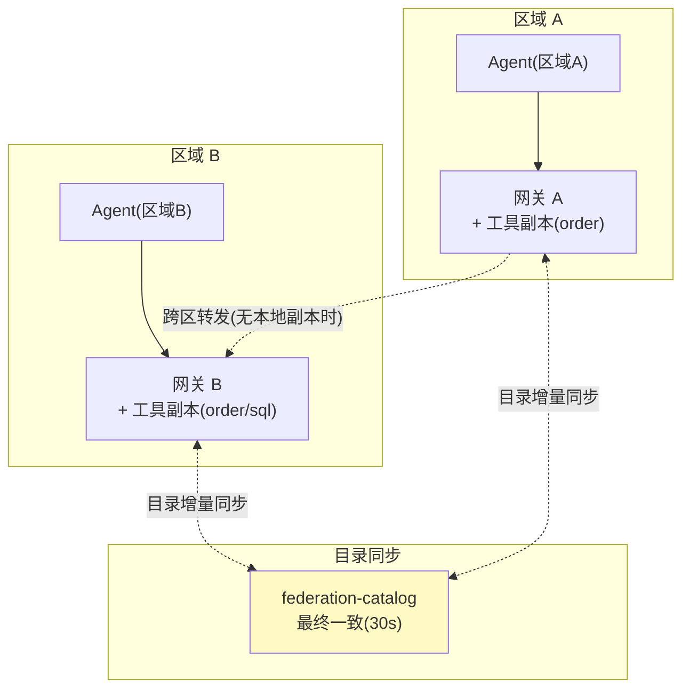
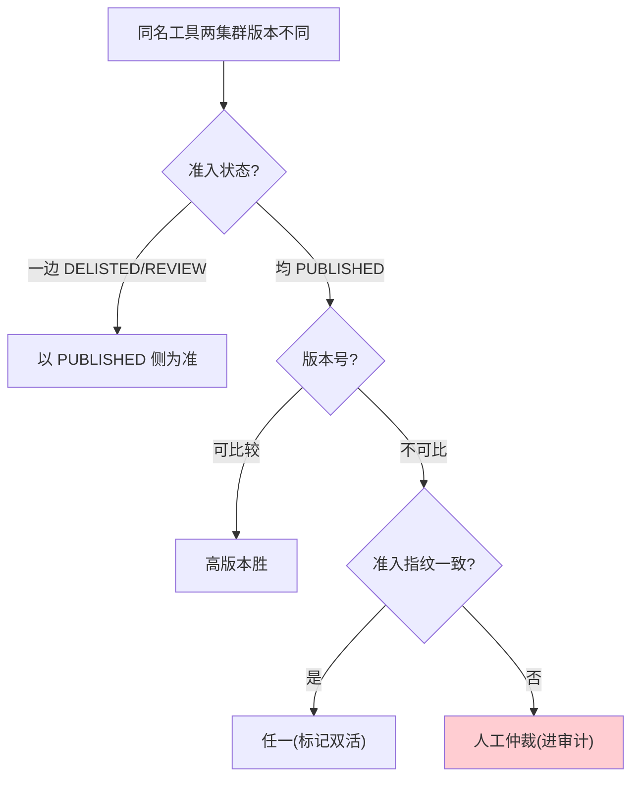
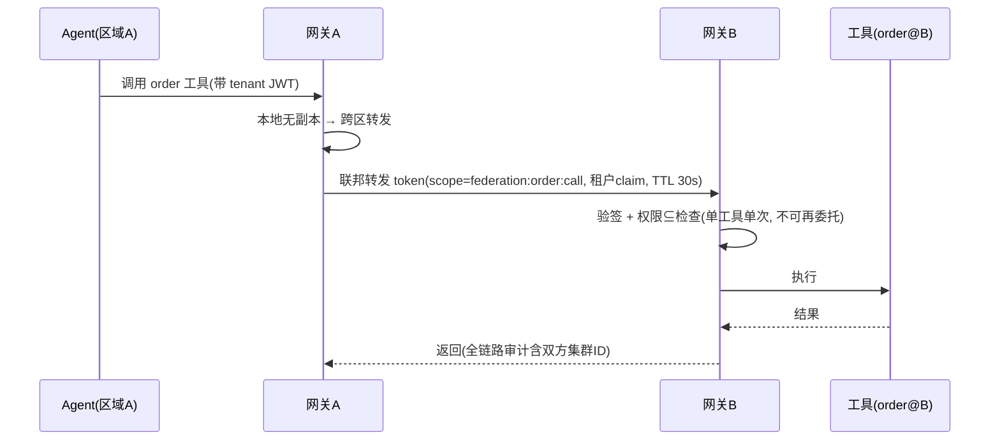

# 07-迭代五：多集群联邦与路由——跨集群目录同步 + 就近接入

> **定位**：把单一网关扩展为**多集群联邦**：跨集群工具目录同步（最终一致）、就近路由（区域工具副本/延迟感知）、联邦鉴权（跨集群 token 委托不放大权限）、全局目录一致性（冲突消解）。读者画像：工具规模/地域规模超出单集群，需要联邦化的读者。前置阅读：[06-迭代四-工具市场与计费](06-迭代四-工具市场与计费.md)。
>
> **铁律 0**：联邦机制为自研业务；MCP 调用签名与基准 §11 一致。

---

## 一、四问

| 问 | 答 |
|----|----|
| **新增了什么需求** | ① 多集群网关联邦（目录同步）② 就近路由（延迟感知）③ 联邦鉴权（token 委托）④ 目录冲突消解 |
| **影响了哪些模块** | 新增 `federation/`（目录同步/路由决策）；`GatewayProxyTool` 支持跨集群转发 |
| **架构如何演进** | 单网关 → 联邦网关集群（每区域一套，目录互通、调用就近） |
| **上一版痛点是什么** | ① 单集群容量/地域上限 ② 跨地域调用延迟高 ③ 跨集群无信任传递机制 |

**本迭代验收**：① A 集群登记的工具 B 集群 ≤30s 可见 ② 同名工具多副本时路由到延迟最低者 ③ 跨集群调用权限不放大 ④ 目录冲突按规则消解。

---

## 二、联邦架构



**联邦原则**：目录互通（全局可见）、执行就近（本地优先）、鉴权不放大（跨集群 token 权限 ⊆ 原始权限）。

---

## 三、目录同步

### 3.1 同步模型（最终一致 + 版本向量）

```java
package com.example.mcp.gateway.federation;

import org.springframework.jdbc.core.JdbcTemplate;
import org.springframework.scheduling.annotation.Scheduled;
import org.springframework.stereotype.Component;
import java.util.List;

/** 目录同步——增量拉取兄弟集群的目录变更，本地合并。 */
@Component
public class CatalogSyncService {

    private final JdbcTemplate jdbc;
    private final List<String> peers;   // 兄弟网关地址（配置注入）

    public CatalogSyncService(JdbcTemplate jdbc, List<String> peers) {
        this.jdbc = jdbc;
        this.peers = peers;
    }

    @Scheduled(fixedDelay = 30_000)     // 30s 最终一致
    public void sync() {
        for (String peer : peers) {
            // ① 拉取 peer 的目录增量（version > 本地已知该 peer 的水位）
            // ② 冲突消解（见 §3.2）
            // ③ 合入本地联邦目录表 federation_tool_catalog
        }
    }
}
```

### 3.2 冲突消解规则



---

## 四、就近路由

```java
package com.example.mcp.gateway.federation;

import org.springframework.stereotype.Component;
import java.util.List;

/** 就近路由——本地副本优先，跨区仅在没有本地副本或本地不可用时。 */
@Component
public class ProximityRouter {

    public Route decide(String toolName, List<Replica> replicas) {
        // ① 本集群副本健康 → 直接路由
        Replica local = replicas.stream()
                .filter(Replica::local)
                .filter(Replica::healthy)
                .findFirst().orElse(null);
        if (local != null) return new Route(local, false);

        // ② 无本地副本 → 选延迟最低的远端副本（滑动窗口 P50）
        return replicas.stream()
                .filter(Replica::healthy)
                .min(java.util.Comparator.comparingDouble(Replica::p50LatencyMs))
                .map(r -> new Route(r, true))
                .orElseThrow(() -> new IllegalStateException("无可用副本: " + toolName));
    }

    public record Replica(String cluster, String endpoint, boolean local,
                          boolean healthy, double p50LatencyMs) {}
    public record Route(Replica replica, boolean crossCluster) {}
}
```

**延迟探测**：复用既有健康检查（心跳 + 采样调用），P50 滑动窗口 5 分钟。

---

## 五、联邦鉴权（委托不放大）



**关键纪律**：联邦 token 是**短 TTL（30s）+ 单工具 + 单次调用**的最小授权——区域 B 不能用它做任何其他事，也不能再委托（防权限链式放大）。

---

## 六、测试与验证

### 6.1 同步测试

```bash
# A 集群登记新工具 → 30s 内 B 集群 discover 可见；A 下架 → B 同步移除
```

### 6.2 路由测试

```java
# 本地副本健康 → 100% 本地路由；本地摘除 → 自动切远端；恢复 → 回切
```

### 6.3 鉴权测试

```java
# 联邦 token 尝试调第二个工具 → 拒绝；30s 后重放 → 拒绝（TTL）
```

### 6.4 冲突测试

```java
# 两集群同版本不同指纹 → 进人工仲裁 + 审计
```

---

## 七、验收对照

| 验收项 | 达标标准 | 本迭代 |
|--------|---------|--------|
| 目录同步 | ≤30s 最终一致 | ✅ |
| 就近路由 | 本地优先/延迟感知 | ✅ |
| 联邦鉴权 | 委托不放大/TTL | ✅ |
| 冲突消解 | 规则化+人工兜底 | ✅ |

**下一篇**：[08-ADR架构决策记录](08-ADR架构决策记录.md)——全项目决策资产。
