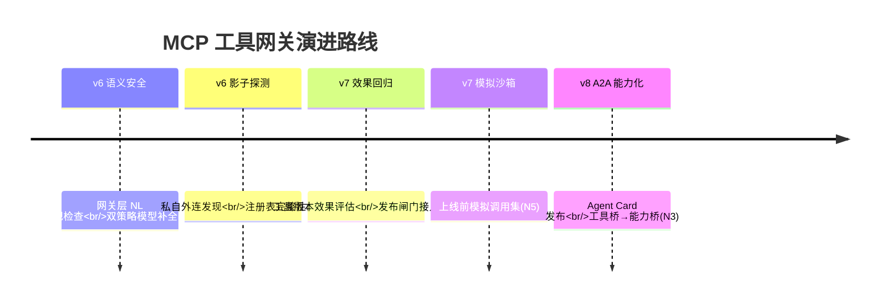

# 09-工业前沿与演进方向：MCP 工具网关的 2026 校准

> **定位**：用 2026 年真实工业实践校准网关方向——对照 Google/AWS/Nebius 的企业 Agent 生产共识，找网关的缺口与演进优先级，项目收官。读者画像：读完 00-08 想知道"接下来该往哪走"的读者。前置阅读：[08-ADR架构决策记录](08-ADR架构决策记录.md)、[前沿 04-MCP生态全景]。
>
> **来源**：本文引用均为真实外部资料（链接见文内）。

---

## 一、2026 共识速览（与网关相关的五条）

1. **MCP 与 A2A 互补**：MCP 是"Agent↔工具/数据"的标准桥，A2A 是"Agent↔Agent"互操作桥——两者组合构成完整生态（[Google 五指南之 Tools and Interoperability](https://cloud.google.com/blog/products/ai-machine-learning/a-devs-guide-to-production-ready-ai-agents)）。
2. **所有交互过 Agent Gateway**：统一网关拦截策略违规与 Prompt 注入；**双策略模型**（传统 IAM + 语义检查）是安全基线（[Google 20 问框架](https://itbrief.com.au/story/google-sets-out-20-question-framework-for-ai-agents)）。
3. **影子 AI 治理**：中央 Agent/工具注册表（owner/数据/允许工具）防失控蔓延（同上 20 问）。
4. **"Agent 失败是系统失败"**：系统改进（检索/编排/评估/工具治理）跑赢模型升级（[Nebius Agents Blueprint](https://nebius.com/blog/posts/introducing-the-nebius-agents-blueprint)）。
5. **评估驱动 + 金标护城河**：企业自持评估标准是核心竞争力（[AWS 企业生产级指南](https://cloud.it168.com/a2026/0708/6939/000006939041.shtml)）。

---

## 二、网关现状对照（N1-N6）

| # | 前沿能力 | 网关现状 | 缺口 |
|---|---------|---------|------|
| N1 | 双策略安全（IAM+NL 语义检查） | ✅ IAM/RBAC/准入/签名（迭代二/三） | 🔶 NL 语义检查（网关对调用意图做语义级合规判断）规划中 |
| N2 | 中央注册表（含影子治理） | ✅ tool-registry 全生命周期 | 🔶 未覆盖"未登记私自外连"的探测（影子工具发现） |
| N3 | A2A 互操作 | ❌ 仅 MCP 工具桥 | 🔷 Agent Card 发布/跨 Agent 委托（未来把"工具"泛化为"能力"） |
| N4 | 评估驱动 | 🔶 有准入无效果回归 | 🔷 工具效果回归（新版本工具对 Agent 任务完成率的影响评估） |
| N5 | 模拟先行 | ❌ | 🔷 上线前模拟调用集（沙箱跑金标任务生成回归基线） |
| N6 | 行为异常检测 | ✅ 行为分析（迭代三动态行为） | 🔶 可加调用模式异常的在线学习 |

---

## 三、演进路线（v6-v8）



**优先级依据**：安全类（N1/N2）> 质量类（N4/N5）> 生态类（N3）——先堵命门再扩边界。

---

## 四、三份来源的关键摘录与映射

### 4.1 Google 五指南（[链接](https://cloud.google.com/blog/products/ai-machine-learning/a-devs-guide-to-production-ready-ai-agents)）

- "MCP 连接活数据，但数据需要业务上下文/元数据/逻辑"——映射：网关的工具元数据（准入记录/评分/审计）正是这层逻辑的载体。
- "沙箱隔离：跑脚本/浏览网的 Agent 不应跑在公司网络上"——映射：网关的沙箱执行要求（工具分级）。
- "带认证与权限的工具集成"——映射：迭代三的 OAuth 2.1 三重身份。

### 4.2 Google 20 问（[链接](https://itbrief.com.au/story/google-sets-out-20-question-framework-for-ai-agents)）

- "先单专用后网络"——映射：网关先做深工具治理，再联邦（迭代五顺序正确）。
- "委托授权保留审计链"——映射：联邦 token 的全链路审计（双方集群 ID 落审计）。

### 4.3 Nebius Blueprint（[链接](https://nebius.com/blog/posts/introducing-the-nebius-agents-blueprint)）

- "合规审计案例：120 任务基准，改 harness +20% 精度、-72% 成本"——映射：网关（harness 一部分）的价值量化口径：工具治理前后 Agent 任务完成率与成本对比。

---

## 五、测试与验证

```bash
# 演进方向可行性自查：
# N1：网关插入 NL 检查点的延迟预算（<50ms 增量）压测
# N4：选 3 个高频工具建效果回归基线（Agent 任务完成率）
```

---

## 六、项目收官

| 阶段 | 篇目 | 交付 |
|------|------|------|
| 基础（00-04） | 需求/架构/Demo/客户端集成/服务端+核心讲解 | 双面网关 + 准入签名 + 连接池 |
| 进阶（05-07） | Streamable HTTP+OAuth / 市场+计费 / 联邦+路由 | 协议现行 + 商业层 + 多集群 |
| 资产（08-09） | ADR / 前沿校准 | 11 条决策 DNA + v6-v8 路线 |

项目 03 到此收官：一个**协议现行、授权完整、可运营、可联邦**的 MCP 工具网关。独立项目，无后续依赖。
