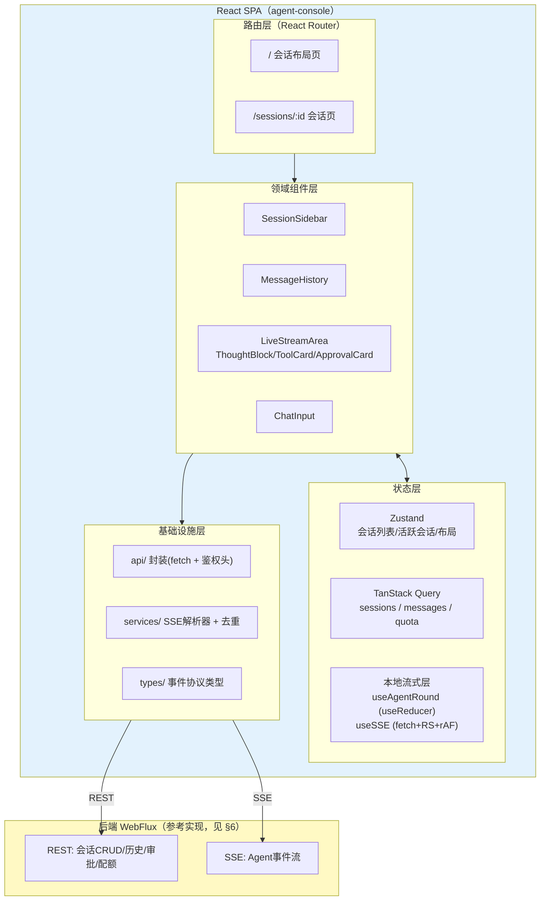
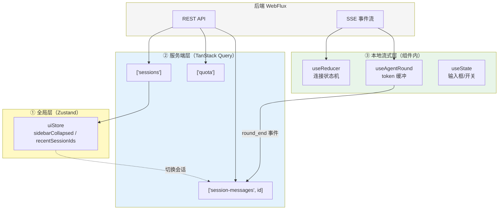
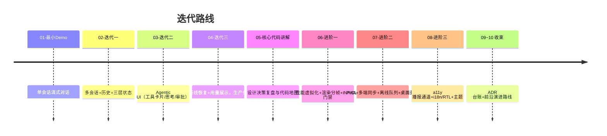

# 项目 04：React Agent 控制台 — 00-需求分析与架构设计

> **定位**：本文是项目 04 的起点——需求分析、技术选型、整体架构设计与迭代路线规划，并给出**完整可手写的工程骨架**（依赖清单 + 前后端事件契约）。项目 04 是一个**完整独立**的项目，不依赖也不引用项目 00-03 的任何内容。
>
> **前置阅读**：[教程 24-React入门与现代前端工程]、[教程 25-React状态管理]、[教程 26-React与SSE流式UI]、[教程 27-Agentic-UI设计]
> **后端对接**：本项目自带一个**完整可手写的参考后端**（WebFlux + Spring AI 2.0 Agent 服务），它是对前端依赖契约的落地实现——事件协议见 §3.2，完整依赖清单见 §6。前端与后端各为一套独立工程，通过 REST + SSE 通信（[教程 19-SSE流式通信]、[教程 28-流式工具调用与事件协议]）。

## ★ 阅读顺序总览（序号 = 你的实际阅读顺序）

> 本子文件夹 11 个文件，**文件名编号 00-10 即阅读顺序**。按"全貌 → 起步 → 四轮核心迭代 → 复盘 → 三条进阶线 → 收束收官"组织：

| 阶段 | 文件 | 读者定位 |
|------|------|---------|
| ① 全貌 | 00-需求分析与架构设计 | **先读**：目标、选型、三层状态、事件契约、工程骨架（依赖清单照抄即可） |
| ② 起步 | 01-最小Demo搭建 | **动手**：30 分钟跑通第一条流式对话链路 |
| ③ 核心迭代 | 02-迭代一 / 03-迭代二 / 04-迭代三 | **严格顺序**：多会话三层状态 → Agentic UI（工具卡/审批）→ 断线恢复与用量，每迭代先跑验收再进下一步 |
| ④ 复盘 | 05-核心代码讲解 | **回顾**：六个设计决策的备选与取舍、五处易错点、前后端模式对应 |
| ⑤ 进阶迭代 | 06-前端性能与虚拟化 / 07-多端协同与离线 / 08-可访问性与国际化 | **严格顺序**：万级消息虚拟化与性能门禁 → PWA/多端同步/离线队列/桌面封装 → a11y/i18n/主题 |
| ⑥ 收束 | 09-ADR架构决策记录 | **按需**：19 条决策台账（上下文/备选/取舍/可回滚），读完 08 后通读一遍 |
| ⑦ 收官 | 10-工业前沿与演进方向 | **扩展**：生成式 UI/多模态/长任务异步/RUM 四方向的引入判据与 v5+ 路线 |

> 核心篇（01-04）覆盖 00 §1.2 的五条目标；进阶篇（06-08）解决核心篇划为非目标的离线/多端/a11y/i18n（见 §1.3 修正说明）；09-10 收束决策与方向。

### ★.1 本节核对（阅读顺序总览）

| # | 核对项 | 判据 |
|---|--------|------|
| 1 | 11 个文件编号连续无跳号 | 00-10 共 11 篇，文件名序号与表中阶段一致 |
| 2 | 核心迭代严格顺序成立 | 02→03→04 前后依赖（事件协议→Agentic UI→断线恢复）不颠倒 |

---

---

## 1. 业务场景

### 1.1 背景

某企业已上线一个内部知识助手（后端为 WebFlux + Spring AI 2.0），但目前的交互界面是后端同学临时写的极简页面：一个输入框、一个只读输出区、没有会话管理、工具调用一概不可见。用户的核心抱怨：

| 抱怨 | 背后的产品缺陷 |
|------|---------------|
| "它卡住的时候我不知道它在干嘛" | 工具执行/思考过程不可见（[教程 18 §1 30 秒白屏]） |
| "我关了页面历史就没了" | 无会话列表、无历史加载 |
| "它查了什么资料我看不到，不敢信" | 工具调用透明度缺失 |
| "网络一抖，回答就断在半截" | 无断线重连与断点恢复 |
| "我同时处理三个问题，来回丢上下文" | 无多会话并发管理 |

### 1.2 项目目标

构建一个**企业级 Agent 控制台前端**（React 19 + Vite + TypeScript 单页应用），并配套一个**完整可手写的参考后端**（WebFlux + Spring AI 2.0），实现：

1. **流式对话体验**——token 级打字机输出、可中断、可重试
2. **过程透明**——思考块、工具调用卡片（含并行组）、执行时长与结果预览
3. **多会话管理**——会话列表、切换、重命名、删除；切换时流的清理与恢复
4. **断线韧性**——Last-Event-ID 断点恢复、指数退避重连、重放去重
5. **可观测的用量**——每轮 Token 用量展示、finishReason 显式呈现（截断不当完成）

### 1.3 非目标（明确不做）

- 不做权限体系/登录（由企业统一门户注入 token，本项目透传）
- 不做移动端原生 App（响应式 Web 即可）
- 离线模式（PWA/Service Worker）**不进核心迭代**（01-04 不涉及）——但作为进阶能力在 [07-多端协同与离线] 正面解决（2026-08 进阶篇转正；核心篇时期它是"另一个独立项目的体量"，进阶篇以受控范围引入）
- 后端只做"把契约跑通"的参考实现，不做多租户/灰度/审计等企业级后端能力（那些是项目 05-08 的主题）

### 1.4 本节核对（业务场景）

| # | 核对项 | 判据 |
|---|--------|------|
| 1 | 五条抱怨与 §1.2 五条目标一一对应 | 卡住↔过程透明、历史丢↔多会话、不敢信↔工具透明、断流↔断线韧性、丢上下文↔多会话并发 |
| 2 | 非目标边界清楚 | 权限/原生 App/离线（核心篇）/企业级后端四项明确不做，且离线在 07 篇转正有说明 |

---

## 2. 技术选型

| 层 | 选型 | 理由 | 备选与放弃原因 |
|----|------|------|---------------|
| 框架 | React 19 | 本体系教程线；生态最全 | Vue 3——同样可行，但与教程 24-27 不衔接 |
| 构建 | Vite | 毫秒级 HMR、零配置（[教程 15 §4.1]） | Webpack——启动慢、配置重 |
| 语言 | TypeScript strict | 前后端契约的类型保障（[教程 15 §4.2]） | JS——放弃编译期契约校验 |
| 客户端全局状态 | Zustand | selector 订阅防连坐渲染（[教程 16 §3.2]） | Redux Toolkit——样板代码多；Context——高频值不适用 |
| 服务端状态 | TanStack Query v5 | 缓存/失效/重验证开箱即用（[教程 16 §4]） | 手写 loading/error——重复造轮子 |
| 路由 | React Router v7 | 会话页路由、深链接 | TanStack Router——更严格但团队学习成本高 |
| 样式 | CSS Modules + 设计 tokens | 零运行时、无 CSS-in-JS 的 SSR 问题 | Tailwind——可行，但项目体量下 CSS Modules 更朴素可控 |
| 流式消费 | fetch + ReadableStream 自研封装 | POST + 鉴权头 + 取消（[教程 17 §1.1]） | EventSource——不支持 POST/自定义头，弃 |
| 后端框架 | Spring Boot 4.1 + WebFlux | 响应式 SSE 原生支持（[教程 10 §4]） | Spring MVC——不支持响应式背压 |
| 后端 AI | Spring AI 2.0（ChatClient） | 本体系技术栈主线（[附录 05-SpringAI2-API基准]） | 1.0 旧 API——已过审计淘汰 |

**不引入的东西（克制清单）**：UI 组件库（MUI/AntD）——本项目组件全部手写以服务学习目标；状态机库（XState）——useReducer 已够（[教程 16 §2.2]）；React 19 的 useOptimistic 暂不用于 v1（发送消息的乐观上屏在迭代二再引入）。

### 2.1 本节核对（技术选型）

| # | 核对项 | 判据 |
|---|--------|------|
| 1 | 每层选型都有"备选与放弃原因" | 十行选型表第三列无空缺 |
| 2 | 选型与 §6.3 package.json / §6.1 pom.xml 一致 | React 19 / Vite / Zustand / TanStack Query / WebFlux / Spring AI 2.0 逐一对得上 |
| 3 | 克制清单未被后续章节打破 | 后续迭代代码中不出现 MUI/XState import |

---

## 3. 架构设计

### 3.1 整体架构



分层与依赖规则（呼应后端的分层思想，[教程 23-Advisor链与拦截器 §分层]）：
- **单向依赖**：路由 → 组件 → 状态/基础设施；组件不直接 fetch（一律走 `services/api.ts` 层）
- **types/ 是契约的单一来源**——事件类型定义与后端协议一一对应，改协议先改这里
- **领域组件不感知连接细节**——`LiveStreamArea` 只消费 reducer 状态，不认识 fetch

### 3.2 后端依赖契约（前端的外部接口约定）

| 端点 | 方法 | 说明 |
|------|------|------|
| `/api/sessions` | GET/POST/DELETE | 会话 CRUD（REST） |
| `/api/sessions/{id}/messages` | GET | 历史消息分页 |
| `/api/chat` | POST→SSE | 对话流；请求体含 sessionId/message/resumeFromEventId；事件流为 §6.5 定义的 AgentEvent 协议 |
| `/api/chat/resume/{roundId}` | POST→SSE | 审批/中断后的恢复流 |
| `/api/approvals/{id}` | POST | 审批响应（approved + comment） |
| `/api/quota/me` | GET | 当前用户 Token 配额 |

> 契约的完整事件定义（TS + Java 双面）、脱敏约定（args 脱敏、resultPreview 截断）见 §6.5 与 [教程 18 §2.2]。若后端尚未实现某事件，前端按"未知 type 安全跳过"降级（[教程 18 §6 协议版本化]）。

### 3.3 三层状态模型落地

直接采用 [教程 16 §5] 的三层模型：

- **全局层（Zustand）**：`sessions[]`、`activeSessionId`、`sidebarCollapsed`
- **服务端层（TanStack Query）**：会话列表（`['sessions']`）、历史消息（`['session-messages', id]`）、配额（`['quota']`）
- **本地流式层（useReducer + ref）**：连接状态机、thought/toolCalls/answerText、pendingApproval；rAF 批量缓冲（[教程 17 §4]）



### 3.4 本节测试与验证（架构设计）

> **前置**：本篇为设计篇，验证方式 = 对照 01-04 迭代落地后的真实工程做"架构守卫"检查。

| # | 操作 | 预期（PASS 判据） |
|---|------|------------------|
| 1 | 在 02 篇完成后的工程里全局搜索组件中的 `fetch(` | 只出现在 `services/` 层（api.ts/sse.ts），领域组件零直接 fetch（单向依赖规则） |
| 2 | 对照 §3.2 端点表与 02-04 篇实际实现 | 六个端点（sessions CRUD / messages / chat / chat/resume / approvals / quota）逐个有对应 Controller 方法 |
| 3 | 对照 §3.3 三层与 02 篇代码 | Zustand 只含布局/最近会话；Query 恰管 sessions/messages/quota 三类 key；流式态全在组件内 reducer |

**失败排查**：组件里出现 fetch → 依赖规则破口，挪进 services 层；端点表与实现不一致 → 契约先行被绕过，先改 §6.5/§3.2 再改代码。

---

## 4. 迭代路线规划



| 版本 | 用户价值 | 核心技术点 | 验收标准 |
|------|---------|-----------|---------|
| 01 最小 Demo | 能对话、能看到打字机 | fetch+RS 消费 SSE、parseSSE、基本组件 | 单会话流式输出无乱码；取消生效 |
| 02 迭代一 | 会话不丢、多问题并行 | Zustand+Query 三层状态、会话切换清理纪律 | 切换会话无串流；历史秒开；旧流正确 abort |
| 03 迭代二 | 看得见 Agent 在干嘛 | AgentEvent 完整协议、ToolCard/ThoughtBlock/ApprovalCard、并行组 | tool_call→卡片实时出现；审批挂起→REST→恢复新流 |
| 04 迭代三 | 弱网可用、用量透明 | Last-Event-ID 恢复+去重、指数退避、usage/finishReason 展示 | 拔网线 30 秒恢复不丢内容；重连≤5 次退避正确；截断显式提示 |
| 06 进阶一 | 万级会话流畅、性能不退化 | 虚拟化窗口、startTransition 分帧、会话缓存回收、INP/CLS 门禁 | 10k 消息 60fps；长任务≤2 次/轮；CI 预算红灯 |
| 07 进阶二 | 高铁可用、多端接续、桌面分发 | Service Worker 三分流、游标追赶、IndexedDB outbox、Tauri | 离线壳可用；双端≤3s 同步；离线消息零重复 |
| 08 进阶三 | 所有人都能用 | Announcer 双通道、roving tabindex、i18n/逻辑属性、语义 tokens | 全键盘走查通过；读屏不逐字播报；RTL 不破版 |

每个迭代的"上一版痛点 → 新需求 → 架构影响 → 验收"以四问表形式在各自篇目中展开（[教程 15 §演进式原则] 的项目版落地）。

### 4.1 本节核对（迭代路线规划）

| # | 核对项 | 判据 |
|---|--------|------|
| 1 | 七个版本行都有可度量验收标准 | 打字机/无串流/卡片实时/拔网线 30s/10k 60fps/离线壳/全键盘等，均为可操作判据 |
| 2 | 时间线版本号与实际文件编号一致 | 01/02/03/04/06/07/08 与目录文件一一对应 |

---

## 5. 风险与决策记录（ADR 精简版）

> 本表是项目启动时的风险预判；各迭代落地后形成正式 ADR 04-01 ~ 04-18，**全量台账（含上下文/备选/取舍/可回滚四维）见 [09-ADR架构决策记录]**。

| # | 决策 | 上下文 | 备选 | 理由 |
|---|------|--------|------|------|
| ADR-1 | fetch+RS 而非 EventSource | 对话需 POST+鉴权头 | EventSource | 能力硬伤（[教程 17 §1.1]） |
| ADR-2 | 流式状态不进全局 store | token 高频更新 | 全局 Zustand | 防全站连坐渲染（[教程 16 §1 原则]） |
| ADR-3 | 事件协议 types/ 单一来源 | 前后端契约漂移风险 | 各组件自定义类型 | 编译期约束；协议变更先改契约 |
| ADR-4 | 审批恢复走新流 | SSE 挂几小时等审批不现实 | 长连接等待 | 连接成本与代理超时（[教程 18 §5]） |
| ADR-5 | 不引 UI 组件库 | 学习型项目 | MUI/AntD | 手写组件是学习目标本身 |
| ADR-6 | 后端交付"参考实现"而非空契约 | 前端无法脱离真实 SSE 联调 | 只给接口文档 | 完整可手写后端是学习目标的一部分（教程 19 的落地） |

### 5.1 本节核对（风险与决策记录）

| # | 核对项 | 判据 |
|---|--------|------|
| 1 | 六条决策均含上下文/备选/理由三维 | 表格无空单元格 |
| 2 | 预判与 09 篇台账对得上 | ADR-1~6 在 ADR 04-01~04-18 中有正式落点（如 ADR-2→04-03、ADR-3→04-01） |

---

## 6. 工程骨架：依赖清单与事件契约（照抄即可）

项目 04 = 前端 `agent-console` + 参考后端 `agent-console-backend` 两套独立工程。下面是**一行不省略**的工程地基，后续迭代所有代码都建立在这之上。

### 6.1 参考后端 `pom.xml`

```xml
<?xml version="1.0" encoding="UTF-8"?>
<project xmlns="http://maven.apache.org/POM/4.0.0"
         xmlns:xsi="http://www.w3.org/2001/XMLSchema-instance"
         xsi:schemaLocation="http://maven.apache.org/POM/4.0.0 https://maven.apache.org/xsd/maven-4.0.0.xsd">
    <modelVersion>4.0.0</modelVersion>
    <parent>
        <groupId>org.springframework.boot</groupId>
        <artifactId>spring-boot-starter-parent</artifactId>
        <version>4.1.0</version>
        <relativePath/>
    </parent>
    <groupId>com.agent</groupId>
    <artifactId>agent-console-backend</artifactId>
    <version>0.1.0</version>
    <name>agent-console-backend</name>

    <properties>
        <java.version>21</java.version>
    </properties>

    <dependencyManagement>
        <dependencies>
            <dependency>
                <groupId>org.springframework.ai</groupId>
                <artifactId>spring-ai-bom</artifactId>
                <version>2.0.0</version>
                <type>pom</type>
                <scope>import</scope>
            </dependency>
        </dependencies>
    </dependencyManagement>

    <dependencies>
        <dependency>
            <groupId>org.springframework.boot</groupId>
            <artifactId>spring-boot-starter-webflux</artifactId>
        </dependency>
        <dependency>
            <groupId>org.springframework.ai</groupId>
            <artifactId>spring-ai-starter-model-openai</artifactId>
        </dependency>
        <dependency>
            <groupId>org.projectlombok</groupId>
            <artifactId>lombok</artifactId>
            <optional>true</optional>
        </dependency>
        <dependency>
            <groupId>org.springframework.boot</groupId>
            <artifactId>spring-boot-starter-test</artifactId>
            <scope>test</scope>
        </dependency>
    </dependencies>
</project>
```

### 6.2 参考后端 `application.yml`

```yaml
spring:
  application:
    name: agent-console-backend
  ai:
    openai:
      base-url: https://api.deepseek.com          # DeepSeek 兼容 OpenAI 协议
      api-key: ${DEEPSEEK_API_KEY}                # 环境变量，不落明文
      chat:
        model: deepseek-chat          # Spring AI 2.0.0：无 options 中缀，参数直挂
        temperature: 0.7
server:
  port: 8080
```

### 6.3 前端 `package.json`

```json
{
  "name": "agent-console",
  "private": true,
  "version": "0.1.0",
  "type": "module",
  "scripts": {
    "dev": "vite",
    "build": "tsc -b && vite build",
    "preview": "vite preview"
  },
  "dependencies": {
    "react": "^19.1.0",
    "react-dom": "^19.1.0",
    "react-router-dom": "^7.6.0",
    "zustand": "^5.0.0",
    "@tanstack/react-query": "^5.66.0"
  },
  "devDependencies": {
    "@types/react": "^19.1.0",
    "@types/react-dom": "^19.1.0",
    "@vitejs/plugin-react": "^4.4.0",
    "typescript": "~5.7.0",
    "vite": "^6.0.0"
  }
}
```

### 6.4 前端 `vite.config.ts` + `tsconfig.json`

```ts
// vite.config.ts —— 开发期把 /api 代理到本地 WebFlux 服务，避免 CORS
import { defineConfig } from 'vite';
import react from '@vitejs/plugin-react';

export default defineConfig({
  plugins: [react()],
  server: {
    proxy: {
      '/api': { target: 'http://localhost:8080', changeOrigin: true },
    },
  },
});
```

```json
{
  "compilerOptions": {
    "target": "ES2022",
    "useDefineForClassFields": true,
    "lib": ["ES2022", "DOM", "DOM.Iterable"],
    "module": "ESNext",
    "skipLibCheck": true,
    "moduleResolution": "bundler",
    "allowImportingTsExtensions": true,
    "resolveJsonModule": true,
    "isolatedModules": true,
    "moduleDetection": "force",
    "noEmit": true,
    "jsx": "react-jsx",
    "strict": true,
    "noUnusedLocals": true,
    "noUnusedParameters": true,
    "noFallthroughCasesInSwitch": true,
    "noUncheckedSideEffectImports": true
  },
  "include": ["src"]
}
```

### 6.5 事件契约（前后端共同的单一来源）

这是本项目最重要的文件。**改协议先改这里**：后端加一个 sealed 分支、前端加一个联合分支，编译器强制两端穷尽处理。

**前端 `src/types/events.ts`（完整协议）**：

```ts
// types/events.ts —— 前后端事件契约的 TypeScript 侧（单一来源）
// 与后端 AgentEvent sealed interface 一一映射；id 单调递增，供断点恢复去重。

export interface BaseEvent {
  id: number;      // 会话级单调递增，断线重连去重依据（教程 17 §3.2）
  ts: number;      // 毫秒时间戳
}

export type AgentEvent =
  // —— Agent 生命周期 ——
  | (BaseEvent & { type: 'round_start'; roundId: string })

  // —— 思考过程（默认折叠渲染）——
  | (BaseEvent & { type: 'thought_start'; thoughtId: string })
  | (BaseEvent & { type: 'thought_delta'; thoughtId: string; content: string })
  | (BaseEvent & { type: 'thought_end'; thoughtId: string })

  // —— 工具调用 ——
  | (BaseEvent & {
      type: 'tool_start';
      toolCallId: string;
      name: string;
      args: Record<string, unknown>;        // 后端已脱敏（DLP，见附录 08-Agent安全深度/02-数据泄露防护）
      parallelGroup?: number;               // 同组并行工具，前端排成一行
    })
  | (BaseEvent & { type: 'tool_progress'; toolCallId: string; message: string })
  | (BaseEvent & {
      type: 'tool_end';
      toolCallId: string;
      status: 'success' | 'error';
      resultPreview?: string;               // 截断的结果摘要，不是完整数据
      durationMs: number;
    })

  // —— HITL 审批 ——
  | (BaseEvent & {
      type: 'approval_request';
      approvalId: string;
      toolCallId: string;
      action: string;
      reason: string;
      riskLevel: 'medium' | 'high';
    })
  | (BaseEvent & { type: 'approval_resolved'; approvalId: string; approved: boolean })

  // —— 输出与终结 ——
  | (BaseEvent & { type: 'token'; content: string })
  | (BaseEvent & {
      type: 'round_end';
      roundId: string;
      usage: { promptTokens: number; completionTokens: number };
      finishReason: 'stop' | 'tool_loop_budget' | 'cancelled' | 'awaiting_approval' | 'error';
    })
  | (BaseEvent & { type: 'error'; code: string; message: string; recoverable: boolean });

export interface TokenUsage { promptTokens: number; completionTokens: number; }

export interface Thought {
  id: string;
  content: string;
}

export interface ToolCallInfo {
  id: string;
  name: string;
  args: Record<string, unknown>;
  status: 'running' | 'success' | 'error';
  parallelGroup?: number;
  progress: string | null;
  resultPreview: string | null;
  durationMs: number;
}

export interface ApprovalRequest {
  approvalId: string;
  toolCallId: string;
  action: string;
  reason: string;
  riskLevel: 'medium' | 'high';
}
```

**参考后端 `com.agent.console.event.AgentEvent`（sealed interface）**：

```java
package com.agent.console.event;

import java.util.Map;

/**
 * 后端事件模型（与前端 AgentEvent 一一映射）。
 * sealed 闭合联合：新增事件类型时编译器强制穷尽所有 switch——与 TS 可辨识联合同构。
 * id 单调递增，供断点恢复去重。
 */
public sealed interface AgentEvent permits
        RoundStart, ThoughtStart, ThoughtDelta, ThoughtEnd,
        ToolStart, ToolProgress, ToolEnd,
        ApprovalRequest, ApprovalResolved,
        Token, RoundEnd, ErrorEvent {

    long id();

    long ts();
}

record RoundStart(long id, long ts, String roundId) implements AgentEvent {}

record ThoughtStart(long id, long ts, String thoughtId) implements AgentEvent {}

record ThoughtDelta(long id, long ts, String thoughtId, String content) implements AgentEvent {}

record ThoughtEnd(long id, long ts, String thoughtId) implements AgentEvent {}

record ToolStart(long id, long ts, String toolCallId, String name,
                 Map<String, Object> args, Integer parallelGroup) implements AgentEvent {}

record ToolProgress(long id, long ts, String toolCallId, String message) implements AgentEvent {}

record ToolEnd(long id, long ts, String toolCallId, String status,
               String resultPreview, long durationMs) implements AgentEvent {}

record ApprovalRequest(long id, long ts, String approvalId, String toolCallId,
                       String action, String reason, String riskLevel) implements AgentEvent {}

record ApprovalResolved(long id, long ts, String approvalId, boolean approved) implements AgentEvent {}

record Token(long id, long ts, String content) implements AgentEvent {}

record RoundEnd(long id, long ts, String roundId,
                TokenUsage usage, String finishReason) implements AgentEvent {}

record ErrorEvent(long id, long ts, String code, String message, boolean recoverable) implements AgentEvent {}

record TokenUsage(int promptTokens, int completionTokens) {}
```

> **协议设计要点**（[教程 18 §2.2] 决策表的落地）：
> ① 事件用 `type` 可辨识联合 / sealed 闭合联合——两端 switch 穷尽检查
> ② `id` 单调递增进每条事件——断线重连去重与恢复
> ③ 思考与输出分开（thought/token）——UI 折叠策略不同（思考默认收起、输出默认展开）
> ④ `resultPreview` 截断而非全量——防前端渲染内存失控
> ⑤ `parallelGroup` 标注并行组——并行结构对用户可见
> ⑥ `finishReason` 显式枚举——"预算耗尽被截断"必须让用户知道

### 6.6 本节测试与验证（工程骨架与事件契约）

> **前置**：两套工程目录已建（01 §3）；本节 6 个文件照抄落盘；`DEEPSEEK_API_KEY` 已准备（不落明文）。

**材料**：后端 `mvn -q compile`；前端 `npm install`；TS/Java 两份契约文本。

| # | 操作 | 预期（PASS 判据） |
|---|------|------------------|
| 1 | 后端放好 §6.1/§6.2 后 `mvn compile` | BUILD SUCCESS，BOM 2.0.0 与 Boot 4.1.0 依赖可解析 |
| 2 | 前端按 §6.3/§6.4 安装并 `npx tsc -b --noEmit`（或 `npm run build`） | 依赖安装无 error，strict 模式编译零报错 |
| 3 | 检查 `application.yml` | api-key 为 `${DEEPSEEK_API_KEY}` 占位，无明文密钥 |
| 4 | 对照 TS `AgentEvent` 联合与 Java `sealed interface` permits 列表 | 12 种事件逐一对齐（round_start/thought×3/tool×3/approval×2/token/round_end/error）；`id` 字段两翼都有 |
| 5 | Java 侧对 `AgentEvent` 写一个穷尽 switch（或对照 03 篇 ChatService） | sealed 强制穷尽，漏一个分支编译报错（编译器兜底验证） |
| 6 | 前端删掉联合中任一 case 再编译（反向验证） | tsc 报错或穷尽性缺口可被发现 |

**失败排查**：BOM 解析失败 → 本地仓库无 spring-ai 2.0.0，先确认 settings.xml 仓库地址；sealed 编译错 → permits 名单与 record 定义不一致；TS/Java 契约对不上 → 字段名大小写（toolCallId）或 parallelGroup 可空性抄错。

---

## 7. 下一步

→ [01-最小Demo搭建.md](01-最小Demo搭建.md) — 30 分钟跑通第一条流式对话链路：后端启动 + 前端打字机。

### 7.1 本节核对（下一步）

| # | 核对项 | 判据 |
|---|--------|------|
| 1 | §6.6 骨架验证全部 PASS | 六条通过后才进入 01 篇动手 |
| 2 | 指向明确 | 下一动作唯一（跑通 01 篇最小链路），无分叉 |

---

## 8. 总结

| 层 | 本文交付 |
|----|---------|
| 需求 | 5 条用户抱怨 → 5 条项目目标，明确非目标边界 |
| 选型 | React 19 + Vite + TS + Zustand + Query + Router；后端 WebFlux + Spring AI 2.0 |
| 架构 | 三层状态模型（全局/服务端/本地流式）+ 前端单向依赖规则 |
| 契约 | AgentEvent 事件协议双面定义（TS 联合类型 + Java sealed interface），改协议先改本文件 |
| 工程 | 两套工程完整依赖清单（pom.xml / package.json / application.yml / vite.config.ts / tsconfig.json） |

### 8.1 本节核对（总结）

| # | 核对项 | 判据 |
|---|--------|------|
| 1 | 五行交付物均能在本文指认落点 | 需求→§1、选型→§2、架构→§3、契约→§6.5、工程→§6.1-6.4 |
| 2 | "演示规则显式标注"约定在 03 篇被遵守 | 触发规则处有演示标注 |

代码使用约定：框架 API 全部真实（Spring AI 2.0 的 `ChatClient`/`@Tool`/`ChatMemory` 按 [附录 05-SpringAI2-API基准] 签名书写，可照抄编译）；事件协议后端 sealed 接口与前端联合类型一一对应；凡涉及业务演示的确定性触发逻辑（如"消息含'订单'就调工具"）均显式标注为演示规则，生产由 `ToolCallingManager` 装饰器替换（[教程 19 §3.2]）。

## 9. 全篇回归验证

> 本篇是设计篇，无独立运行物；回归 = 骨架可编译 + 架构规则可被 01-04 篇守护。

| # | 操作 | 预期（PASS 判据） |
|---|------|------------------|
| 1 | 重跑 §6.6 的编译两条（mvn compile / tsc -b） | 两套工程均零错误 |
| 2 | 完成 02 篇后回查 §3.4 架构守卫三条 | 单向依赖 / 端点对齐 / 三层归属全部 PASS |
| 3 | 对照 §4 迭代表逐版本核对各篇验收结论 | 每篇的验收/回归节结论覆盖表中对应行的验收标准 |

**失败排查**：编译失败回查 §6.6 排查项；架构守卫失败 → 回查 §3.1 分层规则与 02 篇代码落点。
