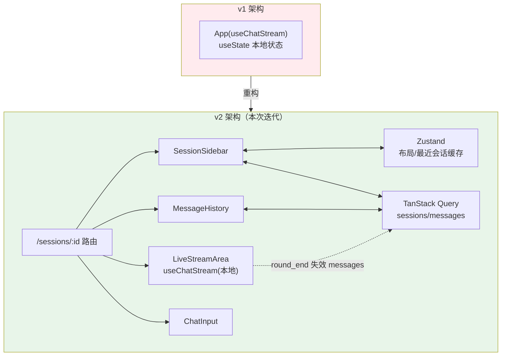

# 项目 04：React Agent 控制台 — 02-迭代一：多会话与三层状态

> **定位**：v1 的"刷新失忆 + 单会话枷锁 + useState 拥挤"痛点驱动本次迭代：引入会话模型、Zustand + TanStack Query + 本地流式层的三层状态架构。完成后用户拥有完整的多会话对话体验。本文给出**完整可手写代码**（一行不省略）。
>
> 「遇到阻塞？→ [教程 16-React状态管理 §5 三层状态模型]、[教程 16 §3 Zustand]、[教程 16 §4 TanStack Query]」

---

## 1. 四问

| 问 | 答 |
|----|----|
| **新增了什么需求** | 创建/切换/重命名/删除会话；进入会话秒开历史；切换会话时旧流正确终止；侧边栏布局状态；后端会话 CRUD + 历史分页 |
| **影响了哪些模块** | 后端：新增 `SessionStore`（内存会话库）+ `SessionController`（REST CRUD/历史），`ChatController` 接会话 ID 与记忆；前端：`useChatStream` 升级 reducer + 依赖 sessionId，新增 Zustand/Query 层与路由化会话页 |
| **架构如何演进** | 从"一个组件树"变成"三层状态 + 路由化会话"：全局层（Zustand）/ 服务端层（Query）/ 本地流式层（reducer） |
| **上一版痛点是什么** | ① 刷新即失忆 ② 单会话枷锁（sessionId 写死） ③ useState 拥挤 ④ 消息列表裸奔无分页 |

## 2. 目标与量化验收

| # | 目标 | 验收 |
|---|------|------|
| 1 | 会话可持久 | 创建会话→对话→刷新页面→历史完整恢复（后端内存存储 + Query 拉取） |
| 2 | 切换无串流 | 会话 A 流式中切到 B，B 界面无 A 内容；回切 A 时流已终止且 UI 明确 |
| 3 | 上下文隔离 | 两个会话交替对话，各自上下文独立（后端 sessionId 路由生效） |
| 4 | 删除正确 | 删除当前会话跳转会话列表；无悬挂请求报错 |
| 5 | 资源不泄漏 | 切换会话 10 次往返，无内存增长（连接/rAF/定时器全部清理） |
| 6 | 缓存生效 | 30 秒内重复切换会话，不重复请求历史（staleTime 缓存生效） |

---

## 3. 架构演进



---

## 4. 完整代码（照抄即可）

### 4.1 参考后端：`AgentConfig` 更新（挂记忆）

```java
package com.agent.console.config;

import org.springframework.ai.chat.client.ChatClient;
import org.springframework.ai.chat.client.advisor.MessageChatMemoryAdvisor;
import org.springframework.ai.chat.memory.ChatMemory;
import org.springframework.ai.chat.memory.InMemoryChatMemoryRepository;
import org.springframework.ai.chat.memory.MessageWindowChatMemory;
import org.springframework.context.annotation.Bean;
import org.springframework.context.annotation.Configuration;

@Configuration
public class AgentConfig {

    @Bean
    public ChatMemory chatMemory() {
        // 官方 2.0.0 本地实证仅 InMemory 仓库（附录 05-00 §2.2）；v2 用内存，生产可自研 ChatMemoryRepository 持久化
        return MessageWindowChatMemory.builder()
                .chatMemoryRepository(new InMemoryChatMemoryRepository())
                .maxMessages(20)
                .build();
    }

    @Bean
    public ChatClient chatClient(ChatClient.Builder builder, ChatMemory memory) {
        return builder
                .defaultSystem("你是企业内部知识助手，用中文简洁、准确地回答用户问题。")
                .defaultAdvisors(MessageChatMemoryAdvisor.builder(memory).build())
                .build();
    }
}
```

### 4.2 参考后端：`SessionStore`（内存会话库）

```java
package com.agent.console.session;

import org.springframework.stereotype.Repository;

import java.util.ArrayList;
import java.util.List;
import java.util.Map;
import java.util.Optional;
import java.util.concurrent.ConcurrentHashMap;
import java.util.concurrent.atomic.AtomicLong;

@Repository
public class SessionStore {

    private final Map<String, Session> sessions = new ConcurrentHashMap<>();
    private final Map<String, List<MessageRecord>> history = new ConcurrentHashMap<>();
    private final AtomicLong seq = new AtomicLong(0);

    /** 生成下一个会话 ID（s-1, s-2, ...）。 */
    public String nextId() {
        return "s-" + seq.incrementAndGet();
    }

    public Session create(String id, String title) {
        Session session = new Session(id, title == null || title.isBlank() ? "新会话" : title,
                System.currentTimeMillis());
        sessions.put(id, session);
        history.put(id, new ArrayList<>());
        return session;
    }

    public List<Session> list() {
        return new ArrayList<>(sessions.values());
    }

    public Optional<Session> find(String id) {
        return Optional.ofNullable(sessions.get(id));
    }

    public boolean delete(String id) {
        sessions.remove(id);
        history.remove(id);
        return true;
    }

    public void appendMessage(String sessionId, String role, String content) {
        history.computeIfAbsent(sessionId, k -> new ArrayList<>())
                .add(new MessageRecord(System.currentTimeMillis(), role, content));
    }

    /** 按时间倒序返回早于 before 的最近 limit 条（before 为 null 表示从最新取起）。 */
    public List<MessageRecord> messages(String sessionId, String before, int limit) {
        long beforeTime = before == null ? Long.MAX_VALUE : Long.parseLong(before);
        return history.getOrDefault(sessionId, List.of()).stream()
                .filter(m -> m.time() < beforeTime)
                .sorted((a, b) -> Long.compare(b.time(), a.time()))
                .limit(limit)
                .toList();
    }

    public record Session(String id, String title, long createdAt) {}

    public record MessageRecord(long time, String role, String content) {}
}
```

### 4.3 参考后端：`SessionController`（REST CRUD + 历史分页）

```java
package com.agent.console.web;

import com.agent.console.session.SessionStore;
import org.springframework.web.bind.annotation.*;

import java.util.List;
import java.util.Map;

@RestController
@RequestMapping("/api/sessions")
public class SessionController {

    private final SessionStore sessionStore;

    public SessionController(SessionStore sessionStore) {
        this.sessionStore = sessionStore;
    }

    @GetMapping
    public List<SessionStore.Session> list() {
        return sessionStore.list();
    }

    @PostMapping
    public SessionStore.Session create(@RequestBody(required = false) Map<String, String> body) {
        String title = body == null ? null : body.get("title");
        return sessionStore.create(sessionStore.nextId(), title);
    }

    @DeleteMapping("/{id}")
    public void delete(@PathVariable String id) {
        sessionStore.delete(id);
    }

    @GetMapping("/{id}/messages")
    public MessagesResponse messages(@PathVariable String id,
                                     @RequestParam(required = false) String before,
                                     @RequestParam(defaultValue = "20") int limit) {
        List<SessionStore.MessageRecord> items = sessionStore.messages(id, before, limit);
        String nextCursor = items.isEmpty() ? null : String.valueOf(items.get(items.size() - 1).time());
        return new MessagesResponse(items, nextCursor);
    }

    public record MessagesResponse(List<SessionStore.MessageRecord> items, String nextCursor) {}
}
```

### 4.4 参考后端：`ChatController` 更新（接会话 + 记忆 + 历史落库）

```java
package com.agent.console.web;

import com.agent.console.event.AgentEvent;
import com.agent.console.event.ErrorEvent;
import com.agent.console.event.RoundEnd;
import com.agent.console.event.Token;
import com.agent.console.event.TokenUsage;
import com.agent.console.session.SessionStore;
import org.springframework.ai.chat.client.ChatClient;
import org.springframework.ai.chat.memory.ChatMemory;
import org.springframework.http.MediaType;
import org.springframework.http.codec.ServerSentEvent;
import org.springframework.web.bind.annotation.*;
import reactor.core.publisher.Flux;
import reactor.core.publisher.Mono;

import java.util.UUID;
import java.util.concurrent.atomic.AtomicLong;
import java.util.concurrent.atomic.AtomicReference;

@RestController
@RequestMapping("/api")
public class ChatController {

    private final ChatClient chatClient;
    private final SessionStore sessionStore;

    public ChatController(ChatClient chatClient, SessionStore sessionStore) {
        this.chatClient = chatClient;
        this.sessionStore = sessionStore;
    }

    @PostMapping(value = "/chat", produces = MediaType.TEXT_EVENT_STREAM_VALUE)
    public Flux<ServerSentEvent<AgentEvent>> chat(@RequestBody ChatRequest request) {
        // 会话不存在则静默创建（v2 约定：任意 sessionId 可用）
        if (sessionStore.find(request.sessionId()).isEmpty()) {
            sessionStore.create(request.sessionId(), null);
        }
        sessionStore.appendMessage(request.sessionId(), "user", request.message());

        AtomicLong seq = new AtomicLong(0);
        String roundId = "r-" + UUID.randomUUID().toString().substring(0, 8);
        AtomicReference<StringBuilder> answer = new AtomicReference<>(new StringBuilder());

        return chatClient.prompt()
                .user(request.message())
                .advisors(a -> a.param(ChatMemory.CONVERSATION_ID, request.sessionId()))
                .stream()
                .content()
                .filter(text -> text != null && !text.isEmpty())
                .map(text -> {
                    answer.get().append(text);
                    return wrap(new Token(seq.incrementAndGet(), System.currentTimeMillis(), text));
                })
                .concatWith(Mono.defer(() -> {
                    // 流结束后把完整回答落库 → 前端 invalidate 后能拉到最终消息
                    sessionStore.appendMessage(request.sessionId(), "assistant", answer.get().toString());
                    return Mono.just(wrap(new RoundEnd(
                            seq.incrementAndGet(), System.currentTimeMillis(), roundId,
                            new TokenUsage(0, 0), "stop")));
                }))
                .onErrorResume(e -> Mono.just(wrap(new ErrorEvent(
                        seq.incrementAndGet(), System.currentTimeMillis(),
                        "AGENT_ERROR", e.getMessage(), true))));
    }

    private ServerSentEvent<AgentEvent> wrap(AgentEvent event) {
        return ServerSentEvent.<AgentEvent>builder()
                .id(String.valueOf(event.id()))
                .data(event)
                .build();
    }

    public record ChatRequest(String sessionId, String message) {}
}
```

### 4.5 前端：`types/models.ts`（新增，会话与消息的 DTO）

```ts
// types/models.ts —— REST DTO（与 SessionStore/SessionController 对应）
export interface Session {
  id: string;
  title: string;
  createdAt: number;
}

export interface SessionMessage {
  time: number;
  role: 'user' | 'assistant';
  content: string;
}

export interface MessagesPage {
  items: SessionMessage[];
  nextCursor: string | null;
}
```

### 4.6 前端：`services/api.ts`（REST 封装，统一鉴权头）

```ts
// services/api.ts —— 所有 REST 走这里；组件不直接 fetch（依赖规则，00 §3.1）
import type { MessagesPage, Session } from '../types/models';

const API_BASE = '/api';

async function request<T>(path: string, init?: RequestInit): Promise<T> {
  const response = await fetch(`${API_BASE}${path}`, {
    headers: { 'Content-Type': 'application/json' },
    ...init,
  });
  if (!response.ok) throw new Error(`HTTP ${response.status}`);
  if (response.status === 204) return undefined as T;
  return response.json() as Promise<T>;
}

export const api = {
  listSessions: () => request<Session[]>('/sessions'),

  createSession: (title?: string) =>
    request<Session>('/sessions', { method: 'POST', body: JSON.stringify({ title }) }),

  deleteSession: (id: string) =>
    request<void>(`/sessions/${id}`, { method: 'DELETE' }),

  listMessages: (sessionId: string, params: { before?: string; limit?: number }) => {
    const qs = new URLSearchParams();
    if (params.before) qs.set('before', params.before);
    if (params.limit) qs.set('limit', String(params.limit));
    const suffix = qs.size ? `?${qs.toString()}` : '';
    return request<MessagesPage>(`/sessions/${sessionId}/messages${suffix}`);
  },
};
```

### 4.7 前端：`store/uiStore.ts`（Zustand 全局层）

```ts
// store/uiStore.ts —— 只放"客户端拥有的"状态；会话数据本体在服务端（Query 管）
import { create } from 'zustand';

interface UIStore {
  sidebarCollapsed: boolean;
  recentSessionIds: string[];        // 最近访问，用于侧边栏排序（客户端视角，非服务端真相）
  toggleSidebar: () => void;
  touchRecent: (id: string) => void;
}

export const useUIStore = create<UIStore>((set, get) => ({
  sidebarCollapsed: false,
  recentSessionIds: [],
  toggleSidebar: () => set(s => ({ sidebarCollapsed: !s.sidebarCollapsed })),
  touchRecent: id => set({ recentSessionIds: [id, ...get().recentSessionIds.filter(x => x !== id)].slice(0, 20) }),
}));
```

> **分类纪律自查**（[教程 16 §1]）：`activeSessionId` 在哪？——它由 URL 路由参数承载（`/sessions/:id`），不进 store。URL 是天然的全局状态存储，还能免费获得深链接与浏览器前进后退。

### 4.8 前端：`hooks/useSessions.ts`（Query 服务端层）

```ts
// hooks/useSessions.ts —— 会话列表/历史/变更，全部交给 TanStack Query
import { useInfiniteQuery, useMutation, useQuery, useQueryClient } from '@tanstack/react-query';
import { api } from '../services/api';

export function useSessions() {
  return useQuery({
    queryKey: ['sessions'],
    queryFn: api.listSessions,
    staleTime: 30_000,
  });
}

export function useSessionMessages(sessionId: string) {
  return useInfiniteQuery({
    queryKey: ['session-messages', sessionId],
    queryFn: ({ pageParam }) => api.listMessages(sessionId, { before: pageParam }),
    initialPageParam: undefined as string | undefined,
    getNextPageParam: last => last.nextCursor ?? undefined,   // 向上翻页加载更早历史
  });
}

export function useCreateSession() {
  const qc = useQueryClient();
  return useMutation({
    mutationFn: api.createSession,
    onSuccess: session => {
      qc.invalidateQueries({ queryKey: ['sessions'] });
      return session;
    },
  });
}

export function useDeleteSession() {
  const qc = useQueryClient();
  return useMutation({
    mutationFn: api.deleteSession,
    onSuccess: (_d, sessionId) => {
      qc.invalidateQueries({ queryKey: ['sessions'] });
      qc.removeQueries({ queryKey: ['session-messages', sessionId] });   // 缓存里的历史一并清掉
    },
  });
}
```

### 4.9 前端：`hooks/useChatStream.ts` 升级（reducer + 依赖 sessionId）

```ts
// hooks/useChatStream.ts —— v2：useReducer 状态机 + 会话切换清理纪律
import { useCallback, useEffect, useReducer, useRef } from 'react';
import { useQueryClient } from '@tanstack/react-query';
import { streamChat } from '../services/sse';
import type { AgentEvent } from '../types/events';

type Phase = 'idle' | 'streaming' | 'done' | 'error';

interface StreamState {
  phase: Phase;
  text: string;
  error: string | null;
}

type StreamAction =
  | { type: 'RESET' }
  | { type: 'TOKEN'; content: string }
  | { type: 'DONE' }
  | { type: 'FAIL'; message: string };

const initialState: StreamState = { phase: 'idle', text: '', error: null };

function reducer(state: StreamState, action: StreamAction): StreamState {
  switch (action.type) {
    case 'RESET': return initialState;
    case 'TOKEN': return { ...state, phase: 'streaming', text: state.text + action.content };
    case 'DONE': return { ...state, phase: 'done' };
    case 'FAIL': return { ...state, phase: 'error', error: action.message };
  }
}

export function useChatStream(sessionId: string) {
  const [state, dispatch] = useReducer(reducer, initialState);
  const queryClient = useQueryClient();
  const abortRef = useRef<AbortController | null>(null);
  const pendingRef = useRef<string[]>([]);
  const rafRef = useRef<number | null>(null);

  const flush = useCallback(() => {
    if (rafRef.current !== null) { cancelAnimationFrame(rafRef.current); rafRef.current = null; }
    const chunk = pendingRef.current.join('');
    pendingRef.current = [];
    if (chunk) dispatch({ type: 'TOKEN', content: chunk });
  }, [dispatch]);

  const handleEvent = useCallback((e: AgentEvent) => {
    switch (e.type) {
      case 'token':
        pendingRef.current.push(e.content);
        if (rafRef.current === null) rafRef.current = requestAnimationFrame(flush);
        break;
      case 'round_end':
        flush();
        dispatch({ type: 'DONE' });
        // 服务端是真相源：流结束后让历史缓存失效，自动重拉最终消息列表（00 §3.3 数据流 3）
        queryClient.invalidateQueries({ queryKey: ['session-messages', sessionId] });
        queryClient.invalidateQueries({ queryKey: ['quota'] });
        break;
      case 'error':
        flush();
        dispatch({ type: 'FAIL', message: e.message });
        break;
    }
  }, [sessionId, flush, queryClient]);

  const send = useCallback(async (message: string) => {
    abortRef.current?.abort();
    const controller = new AbortController();
    abortRef.current = controller;
    dispatch({ type: 'RESET' });

    try {
      await streamChat(
        { sessionId, message },
        {
          onEvent: handleEvent,
          onDone: () => flush(),
          onError: err => {
            if (err.name === 'AbortError') return;   // 主动取消不是错误
            flush(); dispatch({ type: 'FAIL', message: err.message });
          },
        },
        controller.signal,
      );
    } finally {
      if (abortRef.current === controller) abortRef.current = null;
    }
  }, [sessionId, handleEvent, flush]);

  // 会话切换时：终止旧流 + 复位状态（本迭代最容易出 bug 的点）
  useEffect(() => {
    abortRef.current?.abort();
    dispatch({ type: 'RESET' });
  }, [sessionId]);

  // 卸载清理纪律：abort + 取消 rAF 双清
  useEffect(() => () => { abortRef.current?.abort(); flush(); }, [flush]);

  return { ...state, send, cancel: () => abortRef.current?.abort() };
}
```

> **验收铁律**：在会话 A 流式输出中切换到会话 B——A 的 token 绝不允许出现在 B 的界面上。失败模式几乎都是"闭包捕获了旧 sessionId 的回调仍在写入新状态"，解法就是上述"依赖驱动重建（send 依赖 sessionId）+ 切换时 abort + RESET"三件套。「遇到阻塞？→ [教程 15 §3.2 useEffect 依赖与清理]、[教程 17 §5.1 会话切换纪律]」

### 4.10 前端：组件接线（完整）

```tsx
// components/SessionSidebar.tsx —— 会话列表 + 新建 + 删除
import { useNavigate } from 'react-router-dom';
import { useCreateSession, useDeleteSession, useSessions } from '../hooks/useSessions';
import { useUIStore } from '../store/uiStore';

function SessionSidebar() {
  const navigate = useNavigate();
  const { data: sessions = [] } = useSessions();
  const createSession = useCreateSession();
  const deleteSession = useDeleteSession();
  const { sidebarCollapsed, toggleSidebar, touchRecent } = useUIStore();

  const handleCreate = () => {
    createSession.mutate(undefined, {
      onSuccess: session => {
        touchRecent(session.id);
        navigate(`/sessions/${session.id}`);
      },
    });
  };

  return (
    <aside className={`session-sidebar ${sidebarCollapsed ? 'collapsed' : ''}`}>
      <button className="toggle" onClick={toggleSidebar}>{sidebarCollapsed ? '»' : '«'}</button>
      <button className="new-session" onClick={handleCreate}>+ 新会话</button>
      <ul>
        {sessions.map(s => (
          <li key={s.id}>
            <button onClick={() => { touchRecent(s.id); navigate(`/sessions/${s.id}`); }}>
              {s.title}
            </button>
            <button className="delete" onClick={() => deleteSession.mutate(s.id)}>×</button>
          </li>
        ))}
      </ul>
    </aside>
  );
}
export default SessionSidebar;
```

```tsx
// components/HistoryList.tsx —— 历史消息 + 向上翻页
import type { SessionMessage } from '../types/models';

interface HistoryListProps {
  pages: { items: SessionMessage[] }[] | undefined;
  hasNextPage: boolean;
  onLoadEarlier: () => void;
}

function HistoryList({ pages, hasNextPage, onLoadEarlier }: HistoryListProps) {
  const messages = pages?.flatMap(p => p.items) ?? [];   // 每页都是时间倒序，flatMap 后整体倒序
  return (
    <div className="history-list">
      <button className="load-earlier" onClick={onLoadEarlier} disabled={!hasNextPage}>加载更早</button>
      {[...messages].reverse().map(m => (
        <div key={m.time} className={`msg msg-${m.role}`}>{m.content}</div>
      ))}
    </div>
  );
}
export default HistoryList;
```

```tsx
// components/LiveStreamArea.tsx —— 本轮流式输出区（历史结束后出现）
import LiveOutput from './LiveOutput';

interface LiveStreamAreaProps {
  text: string;
  status: 'idle' | 'streaming' | 'done' | 'error';
  error: string | null;
}

function LiveStreamArea({ text, status, error }: LiveStreamAreaProps) {
  return (
    <div className="live-stream-area">
      <LiveOutput text={text} status={status} />
      {error && <div className="error-text">{error}</div>}
    </div>
  );
}
export default LiveStreamArea;
```

```tsx
// components/ChatThread.tsx —— 历史（Query）与本轮流（本地）的缝合点
import { useSessionMessages } from '../hooks/useSessions';
import { useChatStream } from '../hooks/useChatStream';
import ChatInput from './ChatInput';
import HistoryList from './HistoryList';
import LiveStreamArea from './LiveStreamArea';

function ChatThread({ sessionId }: { sessionId: string }) {
  const { data: history, fetchNextPage, hasNextPage } = useSessionMessages(sessionId);
  const stream = useChatStream(sessionId);                    // 进行中的轮次（本地高频）

  return (
    <div className="thread">
      <HistoryList pages={history?.pages} hasNextPage={hasNextPage} onLoadEarlier={() => fetchNextPage()} />
      {stream.phase !== 'idle' && (
        <LiveStreamArea text={stream.text} status={stream.phase} error={stream.error} />
      )}
      <ChatInput onSend={stream.send} streaming={stream.phase === 'streaming'} onCancel={stream.cancel} />
    </div>
  );
}
export default ChatThread;
```

```tsx
// App.tsx —— 路由化会话页 + QueryProvider
import { useEffect } from 'react';
import { Navigate, Route, Routes, useParams } from 'react-router-dom';
import { BrowserRouter } from 'react-router-dom';
import { QueryClient, QueryClientProvider } from '@tanstack/react-query';
import ChatThread from './components/ChatThread';
import SessionSidebar from './components/SessionSidebar';
import { useUIStore } from './store/uiStore';

const queryClient = new QueryClient({ defaultOptions: { queries: { staleTime: 30_000 } } });

function SessionLayout() {
  const { id } = useParams();
  const sessionId = id!;
  const touchRecent = useUIStore(s => s.touchRecent);

  useEffect(() => { if (sessionId) touchRecent(sessionId); }, [sessionId, touchRecent]);

  return (
    <div className="app-layout">
      <SessionSidebar />
      <main className="chat-main">
        {/* key={sessionId} 强制切换会话时 remount，双重保障清理纪律 */}
        <ChatThread key={sessionId} sessionId={sessionId} />
      </main>
    </div>
  );
}

function App() {
  return (
    <QueryClientProvider client={queryClient}>
      <BrowserRouter>
        <Routes>
          <Route path="/" element={<Navigate to="/sessions/s-1" replace />} />
          <Route path="/sessions/:id" element={<SessionLayout />} />
          <Route path="*" element={<Navigate to="/" replace />} />
        </Routes>
      </BrowserRouter>
    </QueryClientProvider>
  );
}
export default App;
```

> **为什么失效而不是本地拼接**：服务端是真相源——后端可能在流结束后做记忆写入、消息规整、配额扣减（[教程 04-记忆与会话管理]）。本地流只是渲染过程；`round_end` 后 `invalidateQueries` 重拉保证刷新/多页签一致性。代价（一次额外请求）换来一致性，值得。

### 4.11 `main.tsx` 不变

`main.tsx` 保持 v1 写法（StrictMode + createRoot 渲染 App），无需改动。

---

## 5. ADR 演进决策

### ADR 04-03：流式状态不进全局 store，用 useReducer 本地承载
- **决策**：token/工具中间态全部在 `useChatStream` 内的 reducer；Zustand 只放布局与最近会话
- **取舍理由**：token 每秒 20-80 个，进全局 store 会连坐全站渲染（[教程 16 §1 原则]）。reducer 是"连接状态机"的天然载体（[教程 16 §2.2]），且与后端状态图同构

### ADR 04-04：activeSessionId 放 URL 而非 Zustand
- **决策**：`/sessions/:id` 路由参数承载当前会话；`key={sessionId}` 强制 remount
- **取舍理由**：URL 免费提供深链接、浏览器前进后退、刷新保持当前会话（[教程 16 §3.3]）；放 store 则刷新丢状态

### ADR 04-05：流结束后 invalidate 而非本地拼接
- **决策**：`round_end` 事件触发 `invalidateQueries(['session-messages', id])`
- **取舍理由**：服务端是真相源，本地拼接在多页签场景必然不一致（[教程 16 §5 数据流 3]）

## 6. 验收与手动测试清单

| # | 场景 | 期望 |
|---|------|------|
| 1 | 创建会话→对话→刷新页面 | 历史完整恢复（后端持久化 + Query 拉取） |
| 2 | 会话 A 流式中切换到 B | B 界面无 A 的内容；回切 A 时流已终止且 UI 状态明确 |
| 3 | 两个会话交替对话 | 各自上下文独立（后端 sessionId 路由生效） |
| 4 | 删除当前会话 | 跳转到会话列表；无悬挂请求报错 |
| 5 | 切换会话 10 次往返 | 无内存增长（连接/定时器全部清理） |
| 6 | 30 秒内重复切换会话 | 不重复请求历史（staleTime 缓存生效） |

## 7. 当前痛点（驱动迭代二）

多会话骨架已稳，但用户最大的抱怨依然存在：**"它查了什么资料我看不到，不敢信"**——v2 的 LiveStreamArea 只渲染 `token` 事件，后端明明要发 `tool_start/tool_end/thought_*` 事件，前端全部静默丢弃（parseSSE 解析后 reducer 没有对应 case）。下一迭代把 AgentEvent 完整协议接到 UI 上。→ [03-工具调用可视化.md](03-工具调用可视化.md)

---

## 8. 总结

| 层 | 交付物 | 关键点 |
|----|--------|--------|
| 后端 | SessionStore + SessionController + ChatController 更新 | 会话 CRUD/历史分页；记忆挂载；历史落库 |
| 全局层 | `store/uiStore.ts`（Zustand） | 布局 + 最近会话；selector 订阅防连坐 |
| 服务端层 | `hooks/useSessions.ts` + `services/api.ts` | Query 缓存/失效/无限分页；组件不直接 fetch |
| 本地流式层 | `useChatStream`（reducer + sessionId） | 会话切换清理三件套；round_end 失效历史 |
| 组件 | SessionSidebar / HistoryList / LiveStreamArea / ChatThread / App | 历史与流式物理分离，done 后交接 |
