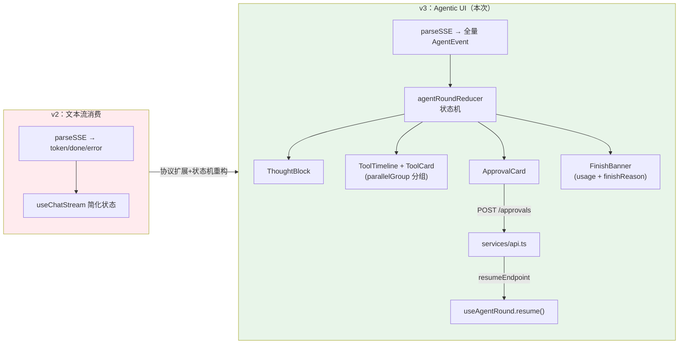

# 项目 04：React Agent 控制台 — 03-迭代二：工具调用可视化与 Agentic UI

> **定位**：把 v2 静默丢弃的 thought/tool 事件接到 UI 上——思考块、工具卡片（含并行组）、审批卡与挂起恢复。完成后 Agent 的执行过程对用户完全透明。本文给出**完整可手写代码**（一行不省略）。
>
> 「遇到阻塞？→ [教程 44-Agentic-UI设计 §2 事件协议]、[教程 44 §3 核心组件]、[教程 44 §5 HITL 挂起恢复]、[教程 45-流式工具调用与事件协议]；API 真实性以 [附录 12-SpringAI2-API基准] 为准」

---

## 1. 四问

| 问 | 答 |
|----|----|
| **新增了什么需求** | 完整 AgentEvent 协议接入；并行工具分组渲染；审批流（挂起 → REST 响应 → 新流恢复）；finishReason 显式呈现（截断不当完成） |
| **影响了哪些模块** | 后端：新增 `ChatService`（事件编排）、`OrderTools`（`@Tool`）、`PendingApprovalStore` + `ApprovalController`（HITL）、`ChatController` 增加 `/chat/resume/{roundId}`；前端：`events.ts` 契约扩展为全量协议、`useChatStream` 重构为 `useAgentRound`（reducer 状态机）、新增审批服务层 |
| **架构如何演进** | `useChatStream`（token 单状态）→ `useAgentRound`（完整轮次状态机）；后端从"直连 ChatClient"演进为"事件编排服务"（RoundStart→Thought→Tool→Token→RoundEnd） |
| **上一版痛点是什么** | ① 工具执行期间界面"假死"（只有输入后长静默）② 查了什么资料不可见→不敢信 ③ 思考过程黑盒 ④ 危险操作直接执行无干预点 ⑤ useState 已无法承载轮次状态 |

## 2. 目标与量化验收

| # | 目标 | 验收 |
|---|------|------|
| 1 | 工具透明 | 触发工具调用，卡片实时出现 running→success，显示参数与耗时 |
| 2 | 并行结构可见 | 同 parallelGroup 的工具卡片排成一行 |
| 3 | 思考可见 | ThoughtBlock 默认折叠，展开可读推理过程 |
| 4 | 审批流 | 卡片出现→点允许→UI 转 running→恢复流继续输出；拒绝→不恢复 |
| 5 | 截断显式 | 预算截断的回答 FinishBanner 显示警告，非静默结束 |
| 6 | 参数安全 | 工具参数显示后端脱敏后的 args（前端不自行脱敏——安全责任在后端，[附录 08-Agent安全深度/02-数据泄露防护]） |

---

## 3. 架构演进



---

## 4. 参考后端：完整代码

### 4.1 `OrderTools.java`（`@Tool` 注解，真实 API）

```java
package com.agent.console.tool;

import org.springframework.ai.tool.annotation.Tool;
import org.springframework.ai.tool.annotation.ToolParam;
import org.springframework.stereotype.Component;

@Component
public class OrderTools {

    // 低风险工具：直接执行
    @Tool(name = "query_order", description = "按订单号查询订单金额与状态")
    public OrderInfo queryOrder(@ToolParam(description = "订单号，如 ORD-001") String orderId) {
        return new OrderInfo(orderId, switch (orderId) {
            case "ORD-001" -> "已发货，金额 199.0 元";
            case "ORD-002" -> "待支付，金额 599.0 元";
            default -> "未找到该订单";
        });
    }

    // 高风险工具：需要人工审批（HITL）
    @Tool(name = "refund_order", description = "对订单发起退款（高风险操作，需要人工审批）")
    public String refundOrder(@ToolParam(description = "订单号") String orderId) {
        return "已发起退款：" + orderId;
    }

    public record OrderInfo(String orderId, String summary) {}
}
```

### 4.2 `PendingApprovalStore.java`（挂起轮次的内存仓库）

```java
package com.agent.console.hitl;

import org.springframework.stereotype.Repository;

import java.util.Map;
import java.util.concurrent.ConcurrentHashMap;

@Repository
public class PendingApprovalStore {

    private final Map<String, PendingApproval> store = new ConcurrentHashMap<>();

    public void save(PendingApproval approval) {
        store.put(approval.roundId(), approval);
    }

    public PendingApproval require(String roundId) {
        PendingApproval approval = store.get(roundId);
        if (approval == null) {
            throw new IllegalStateException("未知挂起轮次: " + roundId);
        }
        return approval;
    }

    public PendingApproval findByApprovalId(String approvalId) {
        return store.values().stream()
                .filter(p -> p.approvalId().equals(approvalId))
                .findFirst()
                .orElseThrow(() -> new IllegalStateException("未知审批: " + approvalId));
    }

    public void resolve(String roundId) {
        store.remove(roundId);
    }

    public record PendingApproval(String approvalId, String sessionId, String roundId,
                                  String toolName, Map<String, Object> args) {}
}
```

### 4.3 `ChatService.java`（事件编排：真实 LLM token 流 + 真实工具执行 + 演示触发规则）

```java
package com.agent.console.service;

import com.agent.console.event.AgentEvent;
import com.agent.console.event.ApprovalRequest;
import com.agent.console.event.ApprovalResolved;
import com.agent.console.event.ErrorEvent;
import com.agent.console.event.RoundEnd;
import com.agent.console.event.RoundStart;
import com.agent.console.event.ThoughtDelta;
import com.agent.console.event.ThoughtEnd;
import com.agent.console.event.ThoughtStart;
import com.agent.console.event.Token;
import com.agent.console.event.TokenUsage;
import com.agent.console.event.ToolEnd;
import com.agent.console.event.ToolProgress;
import com.agent.console.event.ToolStart;
import com.agent.console.hitl.PendingApprovalStore;
import com.agent.console.session.SessionStore;
import com.agent.console.tool.OrderTools;
import org.springframework.ai.chat.client.ChatClient;
import org.springframework.ai.chat.memory.ChatMemory;
import org.springframework.stereotype.Service;
import reactor.core.publisher.Flux;
import reactor.core.scheduler.Schedulers;

import java.util.Map;
import java.util.UUID;
import java.util.concurrent.atomic.AtomicLong;

/**
 * 参考后端的事件编排服务：把「真实 LLM token 流 + 真实工具执行」组织成前端消费的 AgentEvent 流。
 * 注意：thought 与工具触发点是【演示规则】（消息含"订单"/"退款"）——
 * 生产环境由 ToolCallingManager 装饰器从真实工具意图中拦截生成（[教程 45 §3.2]）。
 */
@Service
public class ChatService {

    private final ChatClient chatClient;
    private final SessionStore sessionStore;
    private final PendingApprovalStore approvalStore;
    private final OrderTools orderTools;
    private final AtomicLong eventSeq = new AtomicLong(0);

    public ChatService(ChatClient chatClient, SessionStore sessionStore,
                       PendingApprovalStore approvalStore, OrderTools orderTools) {
        this.chatClient = chatClient;
        this.sessionStore = sessionStore;
        this.approvalStore = approvalStore;
        this.orderTools = orderTools;
    }

    /** 发起一轮对话（SSE 事件流）。 */
    public Flux<AgentEvent> streamRound(String sessionId, String message, Long resumeFromEventId) {
        if (sessionStore.find(sessionId).isEmpty()) {
            sessionStore.create(sessionId, null);
        }
        sessionStore.appendMessage(sessionId, "user", message);

        if (resumeFromEventId != null) {
            // 断点重放由迭代三实现（04 §4.2 的 SessionBuffer）
            return Flux.empty();
        }

        String roundId = "r-" + UUID.randomUUID().toString().substring(0, 8);
        return Flux.concat(
                Flux.just(new RoundStart(nextId(), now(), roundId)),
                thoughtFlow(roundId),
                tailFlow(sessionId, roundId, message)
        ).onErrorResume(e -> Flux.just(new ErrorEvent(
                nextId(), now(), "AGENT_ERROR", e.getMessage(), true)));
    }

    /** 审批通过后从挂起点恢复：继续生成（新流，教程 44 §5）。 */
    public Flux<AgentEvent> resumeRound(String sessionId, String roundId) {
        PendingApprovalStore.PendingApproval pa = approvalStore.require(roundId);
        approvalStore.resolve(roundId);
        return Flux.concat(
                Flux.just(new ApprovalResolved(nextId(), now(), pa.approvalId(), true)),
                tokenFlow(sessionId, "继续回答关于订单 " + pa.args().get("orderId") + " 的问题"),
                Flux.just(new RoundEnd(nextId(), now(), roundId, new TokenUsage(0, 0), "stop"))
        ).onErrorResume(e -> Flux.just(new ErrorEvent(
                nextId(), now(), "AGENT_ERROR", e.getMessage(), true)));
    }

    // —— 事件编排子流程 ——

    private Flux<AgentEvent> thoughtFlow(String roundId) {
        String thoughtId = "t-" + roundId;
        return Flux.concat(
                Flux.just(new ThoughtStart(nextId(), now(), thoughtId)),
                Flux.just(new ThoughtDelta(nextId(), now(), thoughtId, "我先判断是否需要调用工具，然后组织回答。")),
                Flux.just(new ThoughtEnd(nextId(), now(), thoughtId))
        );
    }

    /** 尾部流：工具（可选）→ token → round_end。审批命中时以 awaiting_approval 收尾。 */
    private Flux<AgentEvent> tailFlow(String sessionId, String roundId, String message) {
        // 演示规则：真实场景由 ToolCallingManager 拦截生成 ToolStart（教程 45 §3.2）
        if (message.contains("退款")) {
            return approvalFlow(sessionId, roundId);
        }
        Flux<AgentEvent> tool = Flux.empty();
        if (message.contains("订单")) {
            tool = toolFlow(sessionId, roundId, "query_order", Map.of("orderId", "ORD-001"));
        }
        return Flux.concat(
                tool,
                tokenFlow(sessionId, message),
                Flux.just(new RoundEnd(nextId(), now(), roundId, new TokenUsage(0, 0), "stop"))
        );
    }

    /** 低风险工具：ToolStart → ToolProgress → 真实执行 → ToolEnd。 */
    private Flux<AgentEvent> toolFlow(String sessionId, String roundId, String name, Map<String, Object> args) {
        long start = System.nanoTime();
        String toolCallId = "tc-" + nextId();
        return Flux.concat(
                Flux.just(new ToolStart(nextId(), now(), toolCallId, name, args, 0)),
                Flux.just(new ToolProgress(nextId(), now(), toolCallId, "正在执行 " + name + " …")),
                Flux.fromCallable(() -> new ToolEnd(nextId(), now(), toolCallId, "success",
                                executeTool(name, args),
                                (System.nanoTime() - start) / 1_000_000))
                        .subscribeOn(Schedulers.boundedElastic())   // 阻塞工具隔离到弹性线程池（教程 45 §4）
        );
    }

    private String executeTool(String name, Map<String, Object> args) {
        return switch (name) {
            case "query_order" -> orderTools.queryOrder((String) args.get("orderId")).summary();
            case "refund_order" -> orderTools.refundOrder((String) args.get("orderId"));
            default -> "ok";
        };
    }

    /** 高风险工具：挂起审批（流终止于挂起点，REST 审批，恢复开新流）。 */
    private Flux<AgentEvent> approvalFlow(String sessionId, String roundId) {
        String toolCallId = "tc-" + nextId();
        String approvalId = "ap-" + nextId();
        approvalStore.save(new PendingApproval(approvalId, sessionId, roundId,
                "refund_order", Map.of("orderId", "ORD-002")));
        return Flux.concat(
                Flux.just(new ToolStart(nextId(), now(), toolCallId, "refund_order",
                        Map.of("orderId", "ORD-002"), 0)),
                Flux.just(new ApprovalRequest(nextId(), now(), approvalId, toolCallId,
                        "refund_order", "涉及资金操作，需人工确认", "high")),
                Flux.just(new RoundEnd(nextId(), now(), roundId, new TokenUsage(0, 0), "awaiting_approval"))
        );
    }

    /** 真实 LLM token 流。 */
    private Flux<AgentEvent> tokenFlow(String sessionId, String message) {
        return chatClient.prompt()
                .user(message)
                .advisors(a -> a.param(ChatMemory.CONVERSATION_ID, sessionId))
                .stream()
                .content()
                .filter(t -> t != null && !t.isEmpty())
                .map(t -> new Token(nextId(), now(), t));
    }

    private long nextId() { return eventSeq.incrementAndGet(); }

    private long now() { return System.currentTimeMillis(); }
}
```

### 4.4 `ApprovalController.java`（审批 REST）

```java
package com.agent.console.web;

import com.agent.console.hitl.PendingApprovalStore;
import org.springframework.http.ResponseEntity;
import org.springframework.web.bind.annotation.*;

import java.util.Map;

@RestController
@RequestMapping("/api/approvals")
public class ApprovalController {

    private final PendingApprovalStore approvalStore;

    public ApprovalController(PendingApprovalStore approvalStore) {
        this.approvalStore = approvalStore;
    }

    @PostMapping("/{approvalId}")
    public ResponseEntity<Map<String, String>> respond(@PathVariable String approvalId,
                                                       @RequestBody ApprovalResponse body) {
        PendingApprovalStore.PendingApproval pa = approvalStore.findByApprovalId(approvalId);
        if (!body.approved()) {
            approvalStore.resolve(pa.roundId());
            return ResponseEntity.ok(Map.of("status", "rejected"));
        }
        // 202 Accepted + resumeEndpoint：前端据此开新流恢复（教程 44 §5）
        return ResponseEntity.accepted()
                .body(Map.of("status", "approved", "resumeEndpoint", "/api/chat/resume/" + pa.roundId()));
    }

    public record ApprovalResponse(boolean approved, String comment) {}
}
```

### 4.5 `ChatController.java` 更新（接 ChatService + 恢复端点）

```java
package com.agent.console.web;

import com.agent.console.event.AgentEvent;
import com.agent.console.service.ChatService;
import org.springframework.http.MediaType;
import org.springframework.http.codec.ServerSentEvent;
import org.springframework.web.bind.annotation.*;
import reactor.core.publisher.Flux;

@RestController
@RequestMapping("/api")
public class ChatController {

    private final ChatService chatService;

    public ChatController(ChatService chatService) {
        this.chatService = chatService;
    }

    @PostMapping(value = "/chat", produces = MediaType.TEXT_EVENT_STREAM_VALUE)
    public Flux<ServerSentEvent<AgentEvent>> chat(@RequestBody ChatRequest request) {
        return chatService.streamRound(request.sessionId(), request.message(), request.resumeFromEventId())
                .map(this::wrap);
    }

    @PostMapping(value = "/chat/resume/{roundId}", produces = MediaType.TEXT_EVENT_STREAM_VALUE)
    public Flux<ServerSentEvent<AgentEvent>> resume(@PathVariable String roundId,
                                                    @RequestBody ResumeRequest request) {
        return chatService.resumeRound(request.sessionId(), roundId).map(this::wrap);
    }

    private ServerSentEvent<AgentEvent> wrap(AgentEvent event) {
        return ServerSentEvent.<AgentEvent>builder()
                .id(String.valueOf(event.id()))
                .data(event)
                .build();
    }

    public record ChatRequest(String sessionId, String message, Long resumeFromEventId) {}

    public record ResumeRequest(String sessionId) {}
}
```

---

## 5. 前端：完整代码

### 5.1 `types/events.ts`（全量协议——同 00 §6.5，此处再贴便于照抄）

```ts
// types/events.ts —— 前后端事件契约（完整协议，同 00 §6.5）
export interface BaseEvent { id: number; ts: number; }

export type AgentEvent =
  | (BaseEvent & { type: 'round_start'; roundId: string })
  | (BaseEvent & { type: 'thought_start'; thoughtId: string })
  | (BaseEvent & { type: 'thought_delta'; thoughtId: string; content: string })
  | (BaseEvent & { type: 'thought_end'; thoughtId: string })
  | (BaseEvent & { type: 'tool_start'; toolCallId: string; name: string; args: Record<string, unknown>; parallelGroup?: number })
  | (BaseEvent & { type: 'tool_progress'; toolCallId: string; message: string })
  | (BaseEvent & { type: 'tool_end'; toolCallId: string; status: 'success' | 'error'; resultPreview?: string; durationMs: number })
  | (BaseEvent & { type: 'approval_request'; approvalId: string; toolCallId: string; action: string; reason: string; riskLevel: 'medium' | 'high' })
  | (BaseEvent & { type: 'approval_resolved'; approvalId: string; approved: boolean })
  | (BaseEvent & { type: 'token'; content: string })
  | (BaseEvent & { type: 'round_end'; roundId: string; usage: { promptTokens: number; completionTokens: number }; finishReason: 'stop' | 'tool_loop_budget' | 'cancelled' | 'awaiting_approval' | 'error' })
  | (BaseEvent & { type: 'error'; code: string; message: string; recoverable: boolean });

export interface TokenUsage { promptTokens: number; completionTokens: number; }

export interface Thought { id: string; content: string; }

export interface ToolCallInfo {
  id: string;
  name: string;
  args: Record<string, unknown>;
  status: 'running' | 'success' | 'error';
  parallelGroup?: number;
  progress: string | null;
  resultPreview: string | null;
  durationMs: number;
}

export interface ApprovalRequest {
  approvalId: string;
  toolCallId: string;
  action: string;
  reason: string;
  riskLevel: 'medium' | 'high';
}
```

> **契约纪律**：本文件是协议唯一来源。后端新增事件类型时，这里加一个联合分支 + reducer 加一个 case（漏写编译报错——穷尽检查的价值，[教程 41 §4.2]）。未知 type 的防御保留在 parseSSE 层（协议版本化降级，[教程 44 §6]）。

### 5.2 `services/sse.ts` 升级（通用 URL + 断点字段，向前兼容 v1/v2 调用）

```ts
// services/sse.ts —— fetch + ReadableStream 消费 SSE（升级：支持自定义 url / resumeFromEventId）
import type { AgentEvent } from '../types/events';

export interface ChatStreamRequest {
  url?: string;                 // 默认 /api/chat；恢复流传 /api/chat/resume/{roundId}
  sessionId: string;
  message?: string;
  resumeFromEventId?: number;   // 断线恢复：迭代三使用
  protocolVersion?: number;     // 协议版本协商：迭代三使用
}

export interface StreamHandlers {
  onEvent: (event: AgentEvent) => void;
  onDone: () => void;
  onError: (error: Error) => void;
}

interface ParsedEvents { parsed: AgentEvent[]; remainder: string; }

export async function streamChat(
  request: ChatStreamRequest,
  handlers: StreamHandlers,
  signal: AbortSignal,
): Promise<void> {
  const { url = '/api/chat', ...body } = request;
  const response = await fetch(url, {
    method: 'POST',
    headers: {
      'Content-Type': 'application/json',
      'Accept': 'text/event-stream',
    },
    body: JSON.stringify(body),
    signal,
  });

  if (!response.ok || !response.body) {
    throw new Error(`HTTP ${response.status}`);
  }

  const reader = response.body.getReader();
  const decoder = new TextDecoder('utf-8');
  let buffer = '';

  while (true) {
    const { done, value } = await reader.read();
    if (done) break;

    buffer += decoder.decode(value, { stream: true });
    const events = parseSSE(buffer);
    buffer = events.remainder;

    for (const event of events.parsed) {
      handlers.onEvent(event);
    }
  }
  handlers.onDone();
}

export function parseSSE(buffer: string): ParsedEvents {
  const parsed: AgentEvent[] = [];
  const frames = buffer.split('\n\n');
  const remainder = frames.pop() ?? '';

  for (const frame of frames) {
    let data = '';
    for (const line of frame.split('\n')) {
      if (line.startsWith(':')) continue;
      if (line.startsWith('data:')) data += line.slice(5).trim();
    }
    if (data) {
      try {
        parsed.push(JSON.parse(data) as AgentEvent);
      } catch {
        // 心跳/非 JSON 忽略——流不能因一帧坏数据整体崩溃
      }
    }
  }
  return { parsed, remainder };
}
```

### 5.3 `reducer/agentRoundReducer.ts`（轮次状态机，完整）

```ts
// reducer/agentRoundReducer.ts —— 与后端状态图同构（教程 44 §2.3）
import type { AgentEvent, ApprovalRequest, Thought, TokenUsage, ToolCallInfo } from '../types/events';

export interface AgentRoundState {
  status: 'idle' | 'running' | 'awaiting_approval' | 'done' | 'error' | 'cancelled';
  thoughts: Thought[];
  toolCalls: ToolCallInfo[];
  pendingApproval: ApprovalRequest | null;
  answerText: string;
  usage: TokenUsage | null;
  finishReason: string | null;
  error: string | null;
  notice: string | null;
}

export const initialRoundState: AgentRoundState = {
  status: 'idle',
  thoughts: [],
  toolCalls: [],
  pendingApproval: null,
  answerText: '',
  usage: null,
  finishReason: null,
  error: null,
  notice: null,
};

function updateThought(list: Thought[], id: string, fn: (t: Thought) => Thought): Thought[] {
  return list.map(t => t.id === id ? fn(t) : t);
}

function updateTool(list: ToolCallInfo[], id: string, fn: (t: ToolCallInfo) => ToolCallInfo): ToolCallInfo[] {
  return list.map(t => t.id === id ? fn(t) : t);
}

export type RoundAction =
  | { type: 'RESET' }
  | { type: 'UI_NOTICE'; message: string }
  | { type: 'TOKEN_BATCH'; content: string }        // rAF 批量缓冲后的 token 块（教程 43 §4.2）
  | AgentEvent;

export function agentRoundReducer(state: AgentRoundState, e: RoundAction): AgentRoundState {
  switch (e.type) {
    case 'RESET': return initialRoundState;
    case 'UI_NOTICE': return { ...state, notice: e.message };
    case 'TOKEN_BATCH': return { ...state, answerText: state.answerText + e.content };

    case 'round_start': return { ...state, status: 'running' };

    case 'thought_start':
      return { ...state, thoughts: [...state.thoughts, { id: e.thoughtId, content: '' }] };
    case 'thought_delta':
      return { ...state, thoughts: updateThought(state.thoughts, e.thoughtId, t => ({ ...t, content: t.content + e.content })) };
    case 'thought_end':
      return state;

    case 'tool_start':
      return { ...state, toolCalls: [...state.toolCalls, {
        id: e.toolCallId, name: e.name, args: e.args, status: 'running',
        parallelGroup: e.parallelGroup, progress: null, resultPreview: null, durationMs: 0,
      }] };
    case 'tool_progress':
      return { ...state, toolCalls: updateTool(state.toolCalls, e.toolCallId, t => ({ ...t, progress: e.message })) };
    case 'tool_end':
      return { ...state, toolCalls: updateTool(state.toolCalls, e.toolCallId, t => ({
        ...t, status: e.status, resultPreview: e.resultPreview ?? null, durationMs: e.durationMs,
      })) };

    case 'approval_request':
      return { ...state, status: 'awaiting_approval', pendingApproval: e };
    case 'approval_resolved':
      return { ...state, status: 'running', pendingApproval: null };

    case 'token':
      return { ...state, answerText: state.answerText + e.content };   // 兜底；实际走 TOKEN_BATCH

    case 'round_end':
      return { ...state, status: 'done', usage: e.usage, finishReason: e.finishReason };

    case 'error':
      return { ...state, status: e.recoverable ? 'running' : 'error', error: e.message };
  }
}
```

### 5.4 `services/api.ts`（完整合并版：REST 全部方法）

```ts
// services/api.ts —— 所有 REST 走这里；组件不直接 fetch（依赖规则，00 §3.1）
import type { MessagesPage, Session } from '../types/models';

const API_BASE = '/api';

async function request<T>(path: string, init?: RequestInit): Promise<T> {
  const response = await fetch(`${API_BASE}${path}`, {
    headers: { 'Content-Type': 'application/json' },
    ...init,
  });
  if (!response.ok) throw new Error(`HTTP ${response.status}`);
  if (response.status === 204) return undefined as T;
  return response.json() as Promise<T>;
}

export const api = {
  listSessions: () => request<Session[]>('/sessions'),

  createSession: (title?: string) =>
    request<Session>('/sessions', { method: 'POST', body: JSON.stringify({ title }) }),

  deleteSession: (id: string) =>
    request<void>(`/sessions/${id}`, { method: 'DELETE' }),

  listMessages: (sessionId: string, params: { before?: string; limit?: number }) => {
    const qs = new URLSearchParams();
    if (params.before) qs.set('before', params.before);
    if (params.limit) qs.set('limit', String(params.limit));
    const suffix = qs.size ? `?${qs.toString()}` : '';
    return request<MessagesPage>(`/sessions/${sessionId}/messages${suffix}`);
  },

  // —— v3 新增：审批 ——
  respondApproval: (approvalId: string, body: { approved: boolean; comment?: string }) =>
    request<{ status: string; resumeEndpoint?: string }>(`/approvals/${approvalId}`, {
      method: 'POST',
      body: JSON.stringify(body),
    }),
};
```

### 5.5 `hooks/useAgentRound.ts`（reducer 状态机 + 事件接线 + HITL 恢复）

```ts
// hooks/useAgentRound.ts —— v3：完整轮次状态机
import { useCallback, useEffect, useReducer, useRef } from 'react';
import { useQueryClient } from '@tanstack/react-query';
import { agentRoundReducer, initialRoundState } from '../reducer/agentRoundReducer';
import { api } from '../services/api';
import { streamChat } from '../services/sse';
import type { AgentEvent } from '../types/events';

export function useAgentRound(sessionId: string) {
  const [state, dispatch] = useReducer(agentRoundReducer, initialRoundState);
  const queryClient = useQueryClient();
  const abortRef = useRef<AbortController | null>(null);
  const pendingTokensRef = useRef<string[]>([]);
  const rafRef = useRef<number | null>(null);
  const stateRef = useRef(state);
  stateRef.current = state;

  // —— rAF 批量缓冲（token 专用，教程 43 §4.2）——
  const flush = useCallback(() => {
    if (rafRef.current !== null) { cancelAnimationFrame(rafRef.current); rafRef.current = null; }
    const chunk = pendingTokensRef.current.join('');
    pendingTokensRef.current = [];
    if (chunk) dispatch({ type: 'TOKEN_BATCH', content: chunk });
  }, [dispatch]);

  const handleToken = useCallback((content: string) => {
    pendingTokensRef.current.push(content);
    if (rafRef.current === null) rafRef.current = requestAnimationFrame(flush);
  }, [flush]);

  // —— 事件接线：低频事件直接进 reducer，token 走缓冲，round_end 失效历史 ——
  const wireEvents = useCallback((e: AgentEvent) => {
    switch (e.type) {
      case 'tool_start':
      case 'tool_progress':
      case 'tool_end':
      case 'thought_start':
      case 'thought_delta':
      case 'thought_end':
      case 'approval_request':
      case 'approval_resolved':
        dispatch(e);
        break;

      case 'token':
        handleToken(e.content);
        break;

      case 'round_end':
        flush();
        dispatch(e);
        queryClient.invalidateQueries({ queryKey: ['session-messages', sessionId] });
        queryClient.invalidateQueries({ queryKey: ['quota'] });
        break;

      case 'error':
        if (!e.recoverable) { flush(); dispatch(e); }
        break;
    }
  }, [sessionId, handleToken, flush, queryClient]);

  const send = useCallback(async (message: string) => {
    abortRef.current?.abort();
    const controller = new AbortController();
    abortRef.current = controller;
    dispatch({ type: 'RESET' });

    try {
      await streamChat(
        { sessionId, message },
        {
          onEvent: wireEvents,
          onDone: () => flush(),
          onError: err => {
            if (err.name === 'AbortError') return;
            flush();
            dispatch({ type: 'error', id: -1, ts: 0, code: 'NETWORK', message: err.message, recoverable: false });
          },
        },
        controller.signal,
      );
    } finally {
      if (abortRef.current === controller) abortRef.current = null;
    }
  }, [sessionId, wireEvents, flush]);

  // —— HITL：审批响应 + 恢复（本迭代新增的核心链路）——
  const respondApproval = useCallback(async (approved: boolean, comment: string) => {
    const approval = stateRef.current.pendingApproval;
    if (!approval) return;

    const res = await api.respondApproval(approval.approvalId, { approved, comment });
    dispatch({ type: 'approval_resolved', id: -1, ts: 0, approvalId: approval.approvalId, approved });

    if (approved && res.resumeEndpoint) {
      // 开新流从 Checkpoint 恢复：后端从挂起点继续生成（教程 44 §5）
      const controller = new AbortController();
      abortRef.current = controller;
      await streamChat(
        { url: res.resumeEndpoint, sessionId },
        { onEvent: wireEvents, onDone: () => flush(), onError: () => {} },
        controller.signal,
      );
    }
  }, [sessionId, wireEvents, flush]);

  // 跨刷新恢复：页面加载时查回挂起中的轮次，重渲染审批卡
  // 注：参考后端 v3 未实现 GET /rounds/active，此处预留——后端就绪后取消注释
  // const { data: activeRound } = useQuery({
  //   queryKey: ['active-round', sessionId],
  //   queryFn: () => api.getActiveRound(sessionId),
  // });
  // useEffect(() => {
  //   if (activeRound?.status === 'awaiting_approval' && stateRef.current.status !== 'awaiting_approval') {
  //     dispatch({ type: 'approval_request', ...activeRound.pendingApproval });
  //   }
  // }, [activeRound]);

  // 会话切换清理纪律同 v2（abort + RESET）
  useEffect(() => {
    abortRef.current?.abort();
    dispatch({ type: 'RESET' });
  }, [sessionId]);

  useEffect(() => () => { abortRef.current?.abort(); flush(); }, [flush]);

  return { ...state, send, cancel: () => abortRef.current?.abort(), respondApproval };
}
```

### 5.6 过程区组件（完整）

```tsx
// components/ThoughtBlock.tsx —— 默认折叠的思考块（教程 44 §3.1）
import { useState } from 'react';
import type { Thought } from '../types/events';

function ThoughtBlock({ thought }: { thought: Thought }) {
  const [open, setOpen] = useState(false);   // 默认收起：思考是辅助信息，不是主角
  return (
    <div className="thought-block">
      <button className="thought-toggle" onClick={() => setOpen(!open)}>
        💭 思考过程 {open ? '▾' : '▸'}
      </button>
      {open && <pre className="thought-content">{thought.content}</pre>}
    </div>
  );
}
export default ThoughtBlock;
```

```tsx
// components/ToolCard.tsx —— 过程透明的核心（教程 44 §3.2）
import type { ToolCallInfo } from '../types/events';

function ToolCard({ tool }: { tool: ToolCallInfo }) {
  return (
    <div className={`tool-card tool-${tool.status}`}>
      <header>
        <span className="tool-name">{tool.name}</span>
        <span className="tool-status">
          {tool.status === 'running' ? '⏳' : tool.status === 'success' ? '✓' : '✗'}
        </span>
        {tool.durationMs > 0 && <span className="duration">{tool.durationMs}ms</span>}
      </header>
      <details>
        <summary>参数</summary>
        <pre className="json-view">{JSON.stringify(tool.args, null, 2)}</pre>
      </details>
      {tool.progress && <div className="tool-progress">{tool.progress}</div>}
      {tool.resultPreview && (
        <details>
          <summary>结果</summary>
          <pre className="json-view">{tool.resultPreview}</pre>
        </details>
      )}
    </div>
  );
}
export default ToolCard;
```

```tsx
// components/ToolTimeline.tsx —— 并行组自动排成一行（parallelGroup 分组）
import { useMemo } from 'react';
import type { ToolCallInfo } from '../types/events';
import ToolCard from './ToolCard';

function ToolTimeline({ toolCalls }: { toolCalls: ToolCallInfo[] }) {
  const groups = useMemo(() => {
    const byGroup = new Map<number, ToolCallInfo[]>();
    for (const t of toolCalls) {
      const g = t.parallelGroup ?? 0;
      if (!byGroup.has(g)) byGroup.set(g, []);
      byGroup.get(g)!.push(t);
    }
    return [...byGroup.values()];
  }, [toolCalls]);

  return (
    <div className="tool-timeline">
      {groups.map((group, i) => (
        <div key={i} className="parallel-group">
          {group.map(t => <ToolCard key={t.id} tool={t} />)}
        </div>
      ))}
    </div>
  );
}
export default ToolTimeline;
```

```tsx
// components/ApprovalCard.tsx —— HITL 前端形态（教程 44 §3.3）
import { useState } from 'react';
import type { ApprovalRequest } from '../types/events';

interface ApprovalCardProps {
  approval: ApprovalRequest;
  onRespond: (approved: boolean, comment: string) => void;
}

function ApprovalCard({ approval, onRespond }: ApprovalCardProps) {
  const [comment, setComment] = useState('');
  return (
    <div className={`approval-card risk-${approval.riskLevel}`}>
      <h3>⚠️ 需要您的确认</h3>
      <p>Agent 请求执行：<strong>{approval.action}</strong></p>
      <p className="reason">{approval.reason}</p>
      <div className="approval-actions">
        <button className="btn-danger" onClick={() => onRespond(true, comment)}>允许执行</button>
        <button className="btn-safe" onClick={() => onRespond(false, comment)}>拒绝</button>
      </div>
      <textarea placeholder="备注（会写入审计日志）" value={comment} onChange={e => setComment(e.target.value)} />
    </div>
  );
}
export default ApprovalCard;
```

```tsx
// components/FinishBanner.tsx —— 终局横幅：usage + finishReason 显式（截断不当完成）
import type { TokenUsage } from '../types/events';

function FinishBanner({ usage, finishReason }: { usage: TokenUsage; finishReason: string }) {
  if (finishReason === 'awaiting_approval') return <div className="finish-banner">⏸ 等待人工审批</div>;
  const truncated = finishReason === 'tool_loop_budget';
  return (
    <div className={`finish-banner ${truncated ? 'warn' : ''}`}>
      <span>{usage.promptTokens + usage.completionTokens} tokens</span>
      {truncated && <span className="warn-text">⚠ 回答因轮次预算限制被截断</span>}
    </div>
  );
}
export default FinishBanner;
```

```tsx
// components/LiveStreamArea.tsx —— 升级为完整轮次渲染区
import React from 'react';
import type { AgentRoundState } from '../reducer/agentRoundReducer';
import ApprovalCard from './ApprovalCard';
import FinishBanner from './FinishBanner';
import ThoughtBlock from './ThoughtBlock';
import ToolTimeline from './ToolTimeline';

interface LiveStreamAreaProps {
  round: AgentRoundState;
  onRespond: (approved: boolean, comment: string) => void;
}

const LiveStreamArea = React.memo(function LiveStreamArea({ round, onRespond }: LiveStreamAreaProps) {
  const hasRunningTool = round.toolCalls.some(t => t.status === 'running');

  return (
    <div className="agent-round">
      {/* 1. 思考块（默认折叠） */}
      {round.thoughts.map(t => <ThoughtBlock key={t.id} thought={t} />)}

      {/* 2. 工具时间线（parallelGroup 自动分行） */}
      <ToolTimeline toolCalls={round.toolCalls} />

      {/* 3. 审批卡（挂起时） */}
      {round.pendingApproval && <ApprovalCard approval={round.pendingApproval} onRespond={onRespond} />}

      {/* 4. 回答正文（流式） */}
      {round.answerText && <div className="answer">{round.answerText}</div>}

      {/* 5. 终局横幅：usage + finishReason 显式 */}
      {round.status === 'done' && round.usage && round.finishReason && (
        <FinishBanner usage={round.usage} finishReason={round.finishReason} />
      )}

      {/* 6. 3 秒规则兜底：有思考无输出且无运行中工具 → 显示"正在思考" */}
      {round.status === 'running' && round.thoughts.length > 0 && round.answerText === ''
          && !hasRunningTool && (
        <div className="thinking-indicator">正在思考…</div>
      )}

      {round.notice && <div className="ui-notice">{round.notice}</div>}
      {round.status === 'error' && <div className="error-text">{round.error}</div>}
    </div>
  );
});
export default LiveStreamArea;
```

### 5.7 `ChatThread.tsx` 接线（换用 useAgentRound）

```tsx
// components/ChatThread.tsx —— 升级：useAgentRound 承载轮次
import { useSessionMessages } from '../hooks/useSessions';
import { useAgentRound } from '../hooks/useAgentRound';
import ChatInput from './ChatInput';
import HistoryList from './HistoryList';
import LiveStreamArea from './LiveStreamArea';

function ChatThread({ sessionId }: { sessionId: string }) {
  const { data: history, fetchNextPage, hasNextPage } = useSessionMessages(sessionId);
  const round = useAgentRound(sessionId);

  return (
    <div className="thread">
      <HistoryList pages={history?.pages} hasNextPage={hasNextPage} onLoadEarlier={() => fetchNextPage()} />
      {round.status !== 'idle' && (
        <LiveStreamArea round={round} onRespond={round.respondApproval} />
      )}
      <ChatInput onSend={round.send} streaming={round.status === 'running'} onCancel={round.cancel} />
    </div>
  );
}
export default ChatThread;
```

> `App.tsx` / `main.tsx` 与 v2 相同，无需改动。

---

## 6. ADR 演进决策

### ADR 04-06：轮次状态用 useReducer 状态机，token 与工具事件走不同通道
- **决策**：token 经 ref + rAF 批量缓冲后 `TOKEN_BATCH` 进 reducer；工具/思考/审批事件直接 `dispatch(e)`
- **取舍理由**：**频率差异决定通道**——token 每秒 20-80 个必须背压（[教程 43 §4]）；工具事件每轮几个，缓冲反而引入"卡片延迟出现"的怪异感（违反 3 秒规则）。背压施加在高频源上，不能一刀切

### ADR 04-07：审批恢复走新流（流终止于挂起点）
- **决策**：`approval_request` 后紧跟 `round_end(finishReason="awaiting_approval")` 关闭 SSE；审批走 REST；通过后开 `/chat/resume/{roundId}` 新流
- **取舍理由**：SSE 挂几小时等审批不现实（连接成本、代理超时）（[教程 44 §5]）。前端用 `resumeEndpoint` 响应字段开新流，无需自己拼 URL

### ADR 04-08：前端不做脱敏
- **决策**：工具参数展示直接用后端发来的 args
- **取舍理由**：安全责任必须在后端单一化（[附录 08-Agent安全深度/02-数据泄露防护]）。前端过滤是纵深防御的补充，绝不能成为依赖——浏览器里的代码可被绕过，直接看网络包即可

## 7. 验收与手动测试清单

| # | 场景 | 期望 |
|---|------|------|
| 1 | 发送"查一下 ORD-001 订单" | 工具卡片实时出现 running→success，显示参数与耗时 |
| 2 | 并行工具（同 parallelGroup） | 卡片同行排列；真实反映并行结构 |
| 3 | 长任务工具（tool_progress） | 进度文案更新，无整页重渲染（memo 生效） |
| 4 | 发送"退款"触发审批 | 审批卡出现→点允许→UI 转 running→恢复流继续输出 |
| 5 | 审批点拒绝 | 卡片消失，不恢复，无新流 |
| 6 | 预算截断的回答 | FinishBanner 显示截断警告，非静默结束 |
| 7 | 工具参数含敏感字段 | 显示的是后端脱敏后的 args（前端不自行脱敏） |

## 8. 当前痛点（驱动迭代三）

过程透明已达成，但**弱网体验**仍是一块短板：地铁里断线 30 秒，流就死在半截，只能整轮重发（后端 Token 白烧）；usage 只在轮末展示，用户对成本无感知。→ [04-迭代三-多会话管理与断线恢复.md](04-迭代三-多会话管理与断线恢复.md)

---

## 9. 总结

| 模块 | 交付物 | 关键点 |
|------|--------|--------|
| 后端 | ChatService + OrderTools + PendingApprovalStore + ApprovalController + 恢复端点 | 事件编排；真实 `@Tool` 执行；HITL 挂起→REST→新流恢复 |
| 契约 | `types/events.ts` 全量协议 | 可辨识联合；`parallelGroup`；显式 `finishReason` |
| 状态 | `agentRoundReducer` + `useAgentRound` | 频率差异决定通道（token 缓冲 / 事件直进）；`stateRef` 供异步回调读最新状态 |
| 组件 | ThoughtBlock / ToolCard / ToolTimeline / ApprovalCard / FinishBanner / LiveStreamArea | 默认折叠思考、并行组、拒绝为安全默认、截断显式 |
