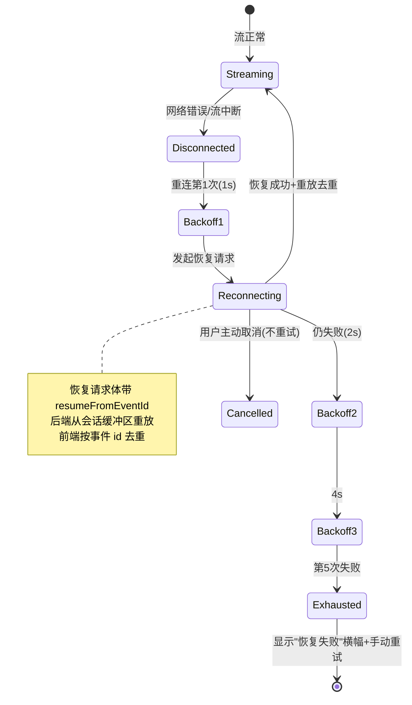
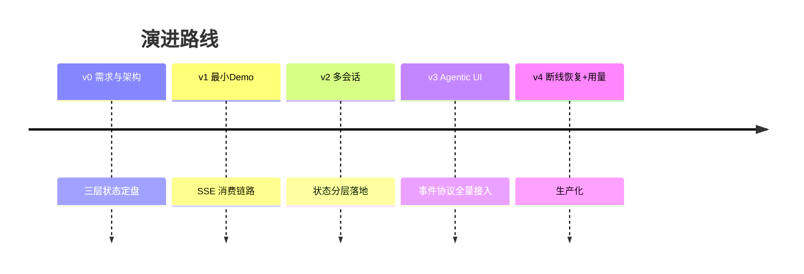

# 项目 04：React Agent 控制台 — 04-断线恢复与用量面板

> **定位**：v3 的弱网短板驱动本次迭代：Last-Event-ID 断点恢复、指数退避重连、重放去重、Token 用量面板与生产化收尾。完成后达到生产可部署状态。本文给出**完整可手写代码**（一行不省略）。
>
> 「遇到阻塞？→ [教程 03-React前端与AgenticUI/02-React与SSE流式UI §3 断线重连与 Last-Event-ID]、[教程 01-WebFlux与响应式编程/06-线程模型与调度器 §4.2 queryKey 与配额刷新]、[教程 04-企业级架构主干/07-成本治理与Token计量 §2]」

---

## 1. 四问

| 问 | 答 |
|----|----|
| **新增了什么需求** | Last-Event-ID 断点恢复 + 重放去重；指数退避重连状态机（上限/次数/抖动）；断线分类（可重试/不可重试/用户取消）；用量面板（轮次用量 + 配额水位）；生产化（错误边界、协议版本协商） |
| **影响了哪些模块** | 后端：新增 `SessionBuffer`（事件缓冲区）、`QuotaController`，`ChatService` 接入缓冲区写入与重放；前端：连接管理从 `useAgentRound` 内联逻辑抽离为独立 `ConnectionManager`，新增 `QuotaPanel`/`ErrorBoundary` |
| **架构如何演进** | 连接管理独立成可单测的 class；事件去重闸门放到事件入口（reducer 保持纯函数）；用量走 Query 服务端状态 |
| **上一版痛点是什么** | ① 断线即整轮报废（Token 白烧）② 无重连策略（一次失败就终）③ 意外断线与主动取消混淆 ④ 成本无感知 |

### 1.1 本节核对（四问）

| # | 核对项 | 判据 |
|---|--------|------|
| 1 | 四个 v3 痛点与本迭代交付一一对应 | ①↔SessionBuffer+重放、②↔ConnectionManager、③↔AbortError 分流、④↔QuotaPanel |
| 2 | 能说清架构演进两要点 | 连接管理独立成 class；去重闸门移到事件入口 |

## 2. 目标与量化验收

| # | 目标 | 验收 |
|---|------|------|
| 1 | 断点恢复 | 流式输出中拔网线 30 秒再恢复，1-2s 内自动重连，内容从断点继续，零重复 |
| 2 | 重连有界 | 连续 5 次重连失败显示恢复失败横幅；手动重试可用 |
| 3 | 取消即时 | 用户点取消立即停止，不触发重连 |
| 4 | 4xx 不重试 | 后端返回 401，不重试，提示重新登录 |
| 5 | 用量可见 | 轮次结束后配额即时刷新；水位 >90% 变红 |
| 6 | 崩溃兜底 | 组件抛异常被错误边界捕获，页面可恢复 |
| 7 | 部署可用 | 构建产物部署到 Nginx，SSE 正常、路由刷新不 404 |

### 2.1 本节核对（目标与量化验收）

| # | 核对项 | 判据 |
|---|--------|------|
| 1 | 七条验收可度量 | 1-2s 重连、5 次上限、>90% 变红等均有数值判据 |
| 2 | 取消与断线分类明确 | 验收 3/4/5 分别覆盖不可重试、用户取消、4xx 三类 |

---

## 3. 断线恢复架构



### 3.1 本节核对（断线恢复架构）

| # | 核对项 | 判据 |
|---|--------|------|
| 1 | 能对照状态图说清退避序列 | 1s→2s→4s→…上限 30s，第 5 次失败进 Exhausted |
| 2 | 能说清恢复请求三要素 | 请求体带 resumeFromEventId、后端从缓冲区重放、前端按 id 去重 |
| 3 | 能指出 Cancelled 与 Disconnected 的分叉 | 用户取消直接终止，不进退避循环 |

---

## 4. 参考后端：完整代码（增量）

### 4.1 `SessionBuffer.java`（事件缓冲区，断点恢复的原料）

```java
package com.agent.console.session;

import com.agent.console.event.AgentEvent;
import org.springframework.stereotype.Repository;

import java.util.ArrayList;
import java.util.List;
import java.util.Map;
import java.util.concurrent.ConcurrentHashMap;

/**
 * 每会话的事件缓冲区：断线恢复时按 resumeFromEventId 重放其后的事件（教程 03-React前端与AgenticUI/00-React入门与现代前端工程 §4）。
 * 生产用 Redis Stream / PostgreSQL 持久化 + 多实例广播；v3 用内存演示。
 */
@Repository
public class SessionBuffer {

    private final Map<String, List<AgentEvent>> buffer = new ConcurrentHashMap<>();

    public void append(String sessionId, AgentEvent event) {
        buffer.computeIfAbsent(sessionId, k -> new ArrayList<>()).add(event);
    }

    /** 重放 id 大于 fromEventId 的事件（fromEventId 为 0 表示全量）。 */
    public List<AgentEvent> replay(String sessionId, long fromEventId) {
        return buffer.getOrDefault(sessionId, List.of()).stream()
                .filter(e -> e.id() > fromEventId)
                .toList();
    }
}
```

### 4.2 `ChatService.java`（v4 完整类：接入缓冲区写入 + 重放）

在 v3 `ChatService`（03 §4.3）基础上做三处修改：① 注入 `SessionBuffer`；② `streamRound` 顶部改为断点重放分支；③ `resumeRound` 同样写缓冲区。以下为**完整可手写类**（v3 的 thought/tool/approval 子流程全部并入，一行不省略）：

```java
package com.agent.console.service;

import com.agent.console.event.AgentEvent;
import com.agent.console.event.ApprovalRequest;
import com.agent.console.event.ApprovalResolved;
import com.agent.console.event.ErrorEvent;
import com.agent.console.event.RoundEnd;
import com.agent.console.event.RoundStart;
import com.agent.console.event.ThoughtDelta;
import com.agent.console.event.ThoughtEnd;
import com.agent.console.event.ThoughtStart;
import com.agent.console.event.Token;
import com.agent.console.event.TokenUsage;
import com.agent.console.event.ToolEnd;
import com.agent.console.event.ToolProgress;
import com.agent.console.event.ToolStart;
import com.agent.console.hitl.PendingApprovalStore;
import com.agent.console.session.SessionBuffer;
import com.agent.console.session.SessionStore;
import com.agent.console.tool.OrderTools;
import org.springframework.ai.chat.client.ChatClient;
import org.springframework.ai.chat.memory.ChatMemory;
import org.springframework.beans.factory.annotation.Autowired;
import org.springframework.stereotype.Service;
import reactor.core.publisher.Flux;
import reactor.core.scheduler.Schedulers;

import java.util.Map;
import java.util.UUID;
import java.util.concurrent.atomic.AtomicLong;

/**
 * 参考后端的事件编排服务（v4：接入 SessionBuffer 断点恢复）。
 * 断线恢复 = 服务端按 resumeFromEventId 重放缓冲区事件 + 前端按事件 id 去重（04 §5.3）。
 * 注意：thought 与工具触发点是【演示规则】（消息含"订单"/"退款"）——
 * 生产环境由 ToolCallingManager 装饰器从真实工具意图中拦截生成（[教程 02-SpringAI核心机制/06-SSE流式通信 §3.2]）。
 */
@Service
public class ChatService {

    @Autowired
    private ChatClient chatClient;

    @Autowired
    private SessionStore sessionStore;

    @Autowired
    private PendingApprovalStore approvalStore;

    @Autowired
    private OrderTools orderTools;

    @Autowired
    private SessionBuffer sessionBuffer;

    private final AtomicLong eventSeq = new AtomicLong(0);

    /** 发起一轮对话（SSE 事件流）；resumeFromEventId 非空时改为从缓冲区重放。 */
    public Flux<AgentEvent> streamRound(String sessionId, String message, Long resumeFromEventId) {
        if (sessionStore.find(sessionId).isEmpty()) {
            sessionStore.create(sessionId, null);
        }
        if (resumeFromEventId != null && resumeFromEventId > 0) {
            // 断点恢复：重放缓冲区中 id > resumeFromEventId 的事件（前端按 id 去重）
            return Flux.fromIterable(sessionBuffer.replay(sessionId, resumeFromEventId));
        }
        sessionStore.appendMessage(sessionId, "user", message);

        String roundId = "r-" + UUID.randomUUID().toString().substring(0, 8);
        Flux<AgentEvent> stream = Flux.concat(
                Flux.just(new RoundStart(nextId(), now(), roundId)),
                thoughtFlow(roundId),
                tailFlow(sessionId, roundId, message)
        ).onErrorResume(e -> Flux.just(new ErrorEvent(
                nextId(), now(), "AGENT_ERROR", e.getMessage(), true)));

        // 每个事件都写入缓冲区 → 断线后可从断点重放（doOnNext 追加）
        return stream.doOnNext(e -> sessionBuffer.append(sessionId, e));
    }

    /** 审批通过后从挂起点恢复：继续生成（新流，同样写缓冲区）。 */
    public Flux<AgentEvent> resumeRound(String sessionId, String roundId) {
        PendingApprovalStore.PendingApproval pa = approvalStore.require(roundId);
        approvalStore.resolve(roundId);
        return Flux.concat(
                Flux.just(new ApprovalResolved(nextId(), now(), pa.approvalId(), true)),
                tokenFlow(sessionId, "继续回答关于订单 " + pa.args().get("orderId") + " 的问题"),
                Flux.just(new RoundEnd(nextId(), now(), roundId, new TokenUsage(0, 0), "stop"))
        ).onErrorResume(e -> Flux.just(new ErrorEvent(
                nextId(), now(), "AGENT_ERROR", e.getMessage(), true)))
         .doOnNext(e -> sessionBuffer.append(sessionId, e));
    }

    // —— 事件编排子流程（与 v3 相同）——

    private Flux<AgentEvent> thoughtFlow(String roundId) {
        String thoughtId = "t-" + roundId;
        return Flux.concat(
                Flux.just(new ThoughtStart(nextId(), now(), thoughtId)),
                Flux.just(new ThoughtDelta(nextId(), now(), thoughtId, "我先判断是否需要调用工具，然后组织回答。")),
                Flux.just(new ThoughtEnd(nextId(), now(), thoughtId))
        );
    }

    /** 尾部流：工具（可选）→ token → round_end。审批命中时以 awaiting_approval 收尾。 */
    private Flux<AgentEvent> tailFlow(String sessionId, String roundId, String message) {
        // 演示规则：真实场景由 ToolCallingManager 拦截生成 ToolStart（教程 02-SpringAI核心机制/06-SSE流式通信 §3.2）
        if (message.contains("退款")) {
            return approvalFlow(sessionId, roundId);
        }
        Flux<AgentEvent> tool = Flux.empty();
        if (message.contains("订单")) {
            tool = toolFlow(sessionId, roundId, "query_order", Map.of("orderId", "ORD-001"));
        }
        return Flux.concat(
                tool,
                tokenFlow(sessionId, message),
                Flux.just(new RoundEnd(nextId(), now(), roundId, new TokenUsage(0, 0), "stop"))
        );
    }

    /** 低风险工具：ToolStart → ToolProgress → 真实执行 → ToolEnd。 */
    private Flux<AgentEvent> toolFlow(String sessionId, String roundId, String name, Map<String, Object> args) {
        long start = System.nanoTime();
        String toolCallId = "tc-" + nextId();
        return Flux.concat(
                Flux.just(new ToolStart(nextId(), now(), toolCallId, name, args, 0)),
                Flux.just(new ToolProgress(nextId(), now(), toolCallId, "正在执行 " + name + " …")),
                Flux.fromCallable(() -> new ToolEnd(nextId(), now(), toolCallId, "success",
                                executeTool(name, args),
                                (System.nanoTime() - start) / 1_000_000))
                        .subscribeOn(Schedulers.boundedElastic())   // 阻塞工具隔离到弹性线程池（教程 02-SpringAI核心机制/06-SSE流式通信 §4）
        );
    }

    private String executeTool(String name, Map<String, Object> args) {
        return switch (name) {
            case "query_order" -> orderTools.queryOrder((String) args.get("orderId")).summary();
            case "refund_order" -> orderTools.refundOrder((String) args.get("orderId"));
            default -> "ok";
        };
    }

    /** 高风险工具：挂起审批（流终止于挂起点，REST 审批，恢复开新流）。 */
    private Flux<AgentEvent> approvalFlow(String sessionId, String roundId) {
        String toolCallId = "tc-" + nextId();
        String approvalId = "ap-" + nextId();
        approvalStore.save(new PendingApprovalStore.PendingApproval(approvalId, sessionId, roundId,
                "refund_order", Map.of("orderId", "ORD-002")));
        return Flux.concat(
                Flux.just(new ToolStart(nextId(), now(), toolCallId, "refund_order",
                        Map.of("orderId", "ORD-002"), 0)),
                Flux.just(new ApprovalRequest(nextId(), now(), approvalId, toolCallId,
                        "refund_order", "涉及资金操作，需人工确认", "high")),
                Flux.just(new RoundEnd(nextId(), now(), roundId, new TokenUsage(0, 0), "awaiting_approval"))
        );
    }

    /** 真实 LLM token 流。 */
    private Flux<AgentEvent> tokenFlow(String sessionId, String message) {
        return chatClient.prompt()
                .user(message)
                .advisors(a -> a.param(ChatMemory.CONVERSATION_ID, sessionId))
                .stream()
                .content()
                .filter(t -> t != null && !t.isEmpty())
                .map(t -> new Token(nextId(), now(), t));
    }

    private long nextId() { return eventSeq.incrementAndGet(); }

    private long now() { return System.currentTimeMillis(); }
}
```

> **取消时缓冲区封存**：v3 未实现 `doOnCancel` 封存（部分结果保留）。生产实现见 [教程 02-SpringAI核心机制/06-SSE流式通信 §5]——取消三件事：①标记轮次 cancelled ②缓冲区封存 ③取消工具执行。缓冲区必须保留（审计与恢复的依据）。

### 4.3 `QuotaController.java`（用量面板后端）

```java
package com.agent.console.controller;

import org.springframework.web.bind.annotation.GetMapping;
import org.springframework.web.bind.annotation.RequestMapping;
import org.springframework.web.bind.annotation.RestController;

@RestController
@RequestMapping("/api/quota")
public class QuotaController {

    /** 演示用静态配额；生产从 gen_ai.client.token.usage 语义约定聚合（教程 03-React前端与AgenticUI/03-Agentic-UI设计 §2）。 */
    @GetMapping("/me")
    public Quota me() {
        return new Quota(1_200_000, 1_000_000);   // limit / used
    }

    public record Quota(long limit, long used) {}
}
```

### 4.4 本节测试与验证（参考后端 v4 增量）

> **前置**：v3 后端可运行（03 §4.6 已 PASS）；SessionBuffer 落盘、ChatService 三处修改合入、QuotaController 落盘。

| # | 操作 | 预期（PASS 判据） |
|---|------|------------------|
| 1 | `mvn clean compile` | BUILD SUCCESS |
| 2 | `curl -N -X POST localhost:8081/api/chat -H 'Content-Type: application/json' -d '{"sessionId":"s-r","message":"你好"}'` | 正常事件流；记下末尾事件 id（如 round_end id=7） |
| 3 | `curl -N -X POST localhost:8081/api/chat -H 'Content-Type: application/json' -d '{"sessionId":"s-r","message":"重放","resumeFromEventId":3}'` | 只返回 id>3 的事件（重放生效，不产生新轮次、不重复落 user 消息） |
| 4 | `curl localhost:8081/api/quota/me` | 返回 `{"limit":1200000,"used":1000000}` |

**失败排查**：重放返回空 → doOnNext 没写缓冲区或 sessionId 与原轮次不一致；重放触发新一轮对话 → resumeFromEventId 判断分支位置放到了 appendMessage 之后；quota 404 → Controller 的 @RequestMapping 路径抄错（/api/quota + /me）。

---

## 5. 前端：完整代码（增量）

### 5.1 `services/sse.ts`（完整版：HttpError + resumeFromEventId + protocolVersion）

```ts
// services/sse.ts —— fetch + ReadableStream 消费 SSE（完整版，含断点恢复字段）
import type { AgentEvent } from '../types/events';

// 带状态码的错误：供 ConnectionManager 分类 4xx（不可重试）/ 5xx（可重试）
export class HttpError extends Error {
  constructor(public status: number, message?: string) {
    super(message ?? `HTTP ${status}`);
    this.name = 'HttpError';
  }
}

export interface ChatStreamRequest {
  url?: string;                 // 默认 /api/chat；恢复流传 /api/chat/resume/{roundId}
  sessionId: string;
  message?: string;
  resumeFromEventId?: number;   // 断线恢复：重连时带上前一次的最后事件 id
  protocolVersion?: number;     // 协议版本协商（教程 01-WebFlux与响应式编程/08-跨服务流与RedisStreams背压 §6）
}

export interface StreamHandlers {
  onEvent: (event: AgentEvent) => void;
  onDone: () => void;
  onError: (error: Error) => void;
}

interface ParsedEvents { parsed: AgentEvent[]; remainder: string; }

export async function streamChat(
  request: ChatStreamRequest,
  handlers: StreamHandlers,
  signal: AbortSignal,
): Promise<void> {
  const { url = '/api/chat', ...body } = request;
  const response = await fetch(url, {
    method: 'POST',
    headers: {
      'Content-Type': 'application/json',
      'Accept': 'text/event-stream',
    },
    body: JSON.stringify(body),
    signal,
  });

  if (!response.ok || !response.body) {
    throw new HttpError(response.status);   // 4xx/5xx 分类交给 ConnectionManager
  }

  const reader = response.body.getReader();
  const decoder = new TextDecoder('utf-8');
  let buffer = '';

  while (true) {
    const { done, value } = await reader.read();
    if (done) break;

    buffer += decoder.decode(value, { stream: true });
    const events = parseSSE(buffer);
    buffer = events.remainder;

    for (const event of events.parsed) {
      handlers.onEvent(event);
    }
  }
  handlers.onDone();
}

export function parseSSE(buffer: string): ParsedEvents {
  const parsed: AgentEvent[] = [];
  const frames = buffer.split('\n\n');
  const remainder = frames.pop() ?? '';

  for (const frame of frames) {
    let data = '';
    for (const line of frame.split('\n')) {
      if (line.startsWith(':')) continue;
      if (line.startsWith('data:')) data += line.slice(5).trim();
    }
    if (data) {
      try {
        parsed.push(JSON.parse(data) as AgentEvent);
      } catch {
        // 心跳/非 JSON 忽略——流不能因一帧坏数据整体崩溃
      }
    }
  }
  return { parsed, remainder };
}
```

### 5.2 `services/connection.ts`（重连状态机独立成模块，可单测）

```ts
// services/connection.ts —— 从 useAgentRound 抽离，可独立单测（教程 01-WebFlux与响应式编程/07-WebFlux测试与性能调优 §3）
import { streamChat, HttpError, type ChatStreamRequest, type StreamHandlers } from './sse';

export class ConnectionManager {
  static readonly MAX_RETRIES = 5;
  static readonly BASE_DELAY = 1000;
  static readonly MAX_DELAY = 30_000;

  private retryCount = 0;
  private lastEventId = 0;
  private currentController: AbortController | null = null;

  /** 只读访问器：外部不得访问私有字段。 */
  get currentLastEventId(): number { return this.lastEventId; }

  recordEvent(id: number): void {
    if (id > this.lastEventId) this.lastEventId = id;
  }

  /** 断线三分类（教程 01-WebFlux与响应式编程/07-WebFlux测试与性能调优 §2）：AbortError→不重试；4xx→抛给上层；网络/5xx→指数退避。 */
  async execute(
    start: (resumeFrom: number, signal: AbortSignal) => Promise<void>,
    onRecovered: () => void,
    onExhausted: () => void,
  ): Promise<void> {
    while (this.retryCount <= ConnectionManager.MAX_RETRIES) {
      const controller = new AbortController();
      this.currentController = controller;

      try {
        await start(this.lastEventId, controller.signal);
        if (this.retryCount > 0) onRecovered();       // 经历过重连才提示
        this.retryCount = 0;
        return;                                       // 正常完成
      } catch (err) {
        if (err instanceof DOMException && err.name === 'AbortError') return;   // 主动取消：不重试
        if (err instanceof HttpError && err.status < 500) throw err;            // 4xx：重试无意义

        this.retryCount++;
        if (this.retryCount > ConnectionManager.MAX_RETRIES) { onExhausted(); return; }

        const delay = Math.min(
          ConnectionManager.BASE_DELAY * 2 ** (this.retryCount - 1),
          ConnectionManager.MAX_DELAY,
        ) + Math.random() * 500;                      // 抖动：防重连风暴同步
        await this.sleep(delay, controller.signal);
      }
    }
  }

  cancel(): void {
    this.currentController?.abort();
  }

  private sleep(ms: number, signal: AbortSignal): Promise<void> {
    return new Promise((resolve, reject) => {
      const timer = setTimeout(resolve, ms);
      signal.addEventListener('abort', () => {
        clearTimeout(timer);
        reject(new DOMException('aborted', 'AbortError'));
      });
    });
  }
}
```

### 5.3 `hooks/useAgentRound.ts`（v4 完整文件：ConnectionManager + 去重闸门 + v3 能力全保留）

在 v3 基础上改造 `send`/`cancel`/清理，并将 v3 的 reducer 状态块整段并入（避免"同 v3"省略）。以下为**完整可手写文件**：

```ts
// hooks/useAgentRound.ts —— v4 完整可手写版本
import { useCallback, useEffect, useReducer, useRef } from 'react';
import { useQueryClient } from '@tanstack/react-query';
import { api } from '../services/api';
import { streamChat } from '../services/sse';
import type { AgentEvent, ApprovalRequest, Thought, TokenUsage, ToolCallInfo } from '../types/events';
import { ConnectionManager, HttpError } from '../services/connection';

// —— 轮次状态机（v3 定义，v4 沿用；reducer 保持纯函数，去重闸门在事件入口）——
export interface AgentRoundState {
  status: 'idle' | 'running' | 'awaiting_approval' | 'done' | 'error' | 'cancelled';
  thoughts: Thought[];
  toolCalls: ToolCallInfo[];
  pendingApproval: ApprovalRequest | null;
  answerText: string;
  usage: TokenUsage | null;
  finishReason: string | null;
  error: string | null;
  notice: string | null;
}

export const initialRoundState: AgentRoundState = {
  status: 'idle',
  thoughts: [],
  toolCalls: [],
  pendingApproval: null,
  answerText: '',
  usage: null,
  finishReason: null,
  error: null,
  notice: null,
};

function updateThought(list: Thought[], id: string, fn: (t: Thought) => Thought): Thought[] {
  return list.map(t => t.id === id ? fn(t) : t);
}

function updateTool(list: ToolCallInfo[], id: string, fn: (t: ToolCallInfo) => ToolCallInfo): ToolCallInfo[] {
  return list.map(t => t.id === id ? fn(t) : t);
}

export type RoundAction =
  | { type: 'RESET' }
  | { type: 'UI_NOTICE'; message: string }
  | { type: 'TOKEN_BATCH'; content: string }        // rAF 批量缓冲后的 token 块（教程 01-WebFlux与响应式编程/07-WebFlux测试与性能调优 §4.2）
  | AgentEvent;

export function agentRoundReducer(state: AgentRoundState, e: RoundAction): AgentRoundState {
  switch (e.type) {
    case 'RESET': return initialRoundState;
    case 'UI_NOTICE': return { ...state, notice: e.message };
    case 'TOKEN_BATCH': return { ...state, answerText: state.answerText + e.content };

    case 'round_start': return { ...state, status: 'running' };

    case 'thought_start':
      return { ...state, thoughts: [...state.thoughts, { id: e.thoughtId, content: '' }] };
    case 'thought_delta':
      return { ...state, thoughts: updateThought(state.thoughts, e.thoughtId, t => ({ ...t, content: t.content + e.content })) };
    case 'thought_end':
      return state;

    case 'tool_start':
      return { ...state, toolCalls: [...state.toolCalls, {
        id: e.toolCallId, name: e.name, args: e.args, status: 'running',
        parallelGroup: e.parallelGroup, progress: null, resultPreview: null, durationMs: 0,
      }] };
    case 'tool_progress':
      return { ...state, toolCalls: updateTool(state.toolCalls, e.toolCallId, t => ({ ...t, progress: e.message })) };
    case 'tool_end':
      return { ...state, toolCalls: updateTool(state.toolCalls, e.toolCallId, t => ({
        ...t, status: e.status, resultPreview: e.resultPreview ?? null, durationMs: e.durationMs,
      })) };

    case 'approval_request':
      return { ...state, status: 'awaiting_approval', pendingApproval: e };
    case 'approval_resolved':
      return { ...state, status: 'running', pendingApproval: null };

    case 'token':
      return { ...state, answerText: state.answerText + e.content };   // 兜底；实际走 TOKEN_BATCH

    case 'round_end':
      return { ...state, status: 'done', usage: e.usage, finishReason: e.finishReason };

    case 'error':
      return { ...state, status: e.recoverable ? 'running' : 'error', error: e.message };
  }
}

// —— v4 Hook：ConnectionManager 接管重连与去重；rAF 缓冲与 wireEvents 同 v3 ——
export function useAgentRound(sessionId: string) {
  const [state, dispatch] = useReducer(agentRoundReducer, initialRoundState);
  const queryClient = useQueryClient();
  const managerRef = useRef<ConnectionManager | null>(null);
  const pendingTokensRef = useRef<string[]>([]);
  const rafRef = useRef<number | null>(null);
  const stateRef = useRef(state);
  stateRef.current = state;

  // —— rAF 批量缓冲（token 专用，教程 01-WebFlux与响应式编程/07-WebFlux测试与性能调优 §4.2）——
  const flush = useCallback(() => {
    if (rafRef.current !== null) { cancelAnimationFrame(rafRef.current); rafRef.current = null; }
    const chunk = pendingTokensRef.current.join('');
    pendingTokensRef.current = [];
    if (chunk) dispatch({ type: 'TOKEN_BATCH', content: chunk });
  }, [dispatch]);

  const handleToken = useCallback((content: string) => {
    pendingTokensRef.current.push(content);
    if (rafRef.current === null) rafRef.current = requestAnimationFrame(flush);
  }, [flush]);

  // —— 事件接线：低频事件直接进 reducer，token 走缓冲，round_end 失效历史 ——
  const wireEvents = useCallback((e: AgentEvent) => {
    switch (e.type) {
      case 'tool_start':
      case 'tool_progress':
      case 'tool_end':
      case 'thought_start':
      case 'thought_delta':
      case 'thought_end':
      case 'approval_request':
      case 'approval_resolved':
        dispatch(e);
        break;

      case 'token':
        handleToken(e.content);
        break;

      case 'round_end':
        flush();
        dispatch(e);
        queryClient.invalidateQueries({ queryKey: ['session-messages', sessionId] });
        queryClient.invalidateQueries({ queryKey: ['quota'] });
        break;

      case 'error':
        if (!e.recoverable) { flush(); dispatch(e); }
        break;
    }
  }, [sessionId, handleToken, flush, queryClient]);

  // —— v4：send 走 ConnectionManager（指数退避重连 + 断点恢复 + 去重闸门）——
  const send = useCallback(async (message: string) => {
    managerRef.current?.cancel();
    const manager = new ConnectionManager();
    managerRef.current = manager;
    dispatch({ type: 'RESET' });

    try {
      await manager.execute(
        async (resumeFrom, signal) => {
          await streamChat(
            {
              sessionId,
              message,
              resumeFromEventId: resumeFrom > 0 ? resumeFrom : undefined,   // 断点恢复
              protocolVersion: 2,                                           // 协议版本协商（教程 01-WebFlux与响应式编程/08-跨服务流与RedisStreams背压 §6）
            },
            {
              onEvent: (e) => {
                // —— 去重闸门：所有事件先过这里（教程 01-WebFlux与响应式编程/07-WebFlux测试与性能调优 §3.2）——
                if (e.id <= manager.currentLastEventId) return;   // 重放的旧事件，丢弃（用 getter 访问）
                manager.recordEvent(e.id);
                wireEvents(e);
              },
              onDone: () => flush(),      // 正常结束：把残留 token 缓冲 flush 掉
              onError: () => {},          // 错误由异常抛出，ConnectionManager 接管重试
            },
            signal,
          );
        },
        () => dispatch({ type: 'UI_NOTICE', message: '已从断点恢复' }),
        () => dispatch({ type: 'UI_NOTICE', message: '多次重连失败，可手动重试' }),
      );
    } catch (err) {
      if (err instanceof HttpError && err.status === 426) {
        dispatch({ type: 'UI_NOTICE', message: '协议版本不匹配，请刷新页面' });
      } else if (!(err instanceof DOMException && err.name === 'AbortError')) {
        flush();
        dispatch({ type: 'error', id: -1, ts: 0, code: 'FATAL', message: (err as Error).message, recoverable: false });
      }
    }
  }, [sessionId, wireEvents, flush]);

  // cancel / 会话切换 / 卸载清理改用 managerRef
  const cancel = useCallback(() => { managerRef.current?.cancel(); }, []);

  // —— HITL：审批响应 + 恢复（v3 能力保留；恢复流同样走 ConnectionManager 去重）——
  const respondApproval = useCallback(async (approved: boolean, comment: string) => {
    const approval = stateRef.current.pendingApproval;
    if (!approval) return;

    const res = await api.respondApproval(approval.approvalId, { approved, comment });
    dispatch({ type: 'approval_resolved', id: -1, ts: 0, approvalId: approval.approvalId, approved });

    if (approved && res.resumeEndpoint) {
      managerRef.current?.cancel();
      const manager = new ConnectionManager();
      managerRef.current = manager;
      await manager.execute(
        async (resumeFrom, signal) => {
          await streamChat(
            { url: res.resumeEndpoint, sessionId },
            {
              onEvent: (e) => {
                if (e.id <= manager.currentLastEventId) return;
                manager.recordEvent(e.id);
                wireEvents(e);
              },
              onDone: () => flush(),
              onError: () => {},
            },
            signal,
          );
        },
        () => dispatch({ type: 'UI_NOTICE', message: '已从断点恢复' }),
        () => dispatch({ type: 'UI_NOTICE', message: '恢复失败，可手动重试' }),
      );
    }
  }, [sessionId, wireEvents, flush]);

  useEffect(() => {
    managerRef.current?.cancel();
    dispatch({ type: 'RESET' });
  }, [sessionId]);

  useEffect(() => () => { managerRef.current?.cancel(); flush(); }, [flush]);

  return { ...state, send, cancel, respondApproval };
}
```

> **验收关键**：拔网线 → 服务端继续把事件写进会话缓冲区（[教程 03-React前端与AgenticUI/00-React入门与现代前端工程 §4]）→ 恢复网络 → 重连成功 → 重放事件流过去重闸门 → UI 从断点继续，**已显示内容零重复**。去重闸门放在 `onEvent` 最外层而非 reducer——reducer 依赖外部可变状态（lastEventId 在 ref/实例里）会破坏纯函数性（[教程 01-WebFlux与响应式编程/06-线程模型与调度器 §6 反模式表]）。

### 5.4 `services/api.ts`（v4 完整合并版：会话/审批/配额全量方法）

```ts
// services/api.ts —— 所有 REST 走这里；组件不直接 fetch（依赖规则，00 §3.1）
import type { MessagesPage, Session } from '../types/models';

const API_BASE = '/api';

async function request<T>(path: string, init?: RequestInit): Promise<T> {
  const response = await fetch(`${API_BASE}${path}`, {
    headers: { 'Content-Type': 'application/json' },
    ...init,
  });
  if (!response.ok) throw new Error(`HTTP ${response.status}`);
  if (response.status === 204) return undefined as T;
  return response.json() as Promise<T>;
}

export const api = {
  // —— 会话 CRUD / 历史分页（v2，02 §4.6）——
  listSessions: () => request<Session[]>('/sessions'),

  createSession: (title?: string) =>
    request<Session>('/sessions', { method: 'POST', body: JSON.stringify({ title }) }),

  deleteSession: (id: string) =>
    request<void>(`/sessions/${id}`, { method: 'DELETE' }),

  listMessages: (sessionId: string, params: { before?: string; limit?: number }) => {
    const qs = new URLSearchParams();
    if (params.before) qs.set('before', params.before);
    if (params.limit) qs.set('limit', String(params.limit));
    const suffix = qs.size ? `?${qs.toString()}` : '';
    return request<MessagesPage>(`/sessions/${sessionId}/messages${suffix}`);
  },

  // —— 审批（v3，03 §5.4）——
  respondApproval: (approvalId: string, body: { approved: boolean; comment?: string }) =>
    request<{ status: string; resumeEndpoint?: string }>(`/approvals/${approvalId}`, {
      method: 'POST',
      body: JSON.stringify(body),
    }),

  // —— 配额（v4 追加）——
  getQuota: () => request<{ limit: number; used: number }>('/quota/me'),
};
```

### 5.5 `components/QuotaPanel.tsx`（用量面板，Query 直管）

```tsx
// components/QuotaPanel.tsx —— 服务端状态，TanStack Query 直管
import { useQuery } from '@tanstack/react-query';
import { api } from '../services/api';

function ProgressBar({ pct, level }: { pct: number; level: 'ok' | 'warn' | 'danger' }) {
  return (
    <div className={`progress-bar ${level}`}>
      <div className="progress-fill" style={{ width: `${Math.min(pct * 100, 100)}%` }} />
    </div>
  );
}

function QuotaPanel() {
  const { data: quota } = useQuery({
    queryKey: ['quota'],
    queryFn: () => api.getQuota(),
    refetchInterval: 60_000,   // 低频轮询；轮次结束后 invalidate 即时刷新（教程 01-WebFlux与响应式编程/06-线程模型与调度器 §4）
  });
  if (!quota) return null;
  const pct = quota.used / quota.limit;
  return (
    <div className="quota-panel">
      <ProgressBar pct={pct} level={pct > 0.9 ? 'danger' : pct > 0.7 ? 'warn' : 'ok'} />
      <span>本月 {quota.used.toLocaleString()} / {quota.limit.toLocaleString()} tokens</span>
    </div>
  );
}
export default QuotaPanel;
```

> 配额数据完全来自后端计量（`gen_ai.client.token.usage` 语义约定，[教程 03-React前端与AgenticUI/03-Agentic-UI设计 §2]）——前端只做展示，不做任何本地累计（本地计数会与服务端漂移，违反"服务端是真相源"）。

### 5.6 `components/ErrorBoundary.tsx`（错误边界）

```tsx
// components/ErrorBoundary.tsx —— 子树渲染崩溃不白屏
import { Component, type ReactNode } from 'react';

interface ErrorBoundaryProps { children: ReactNode; }
interface ErrorBoundaryState { hasError: boolean; }

class ErrorBoundary extends Component<ErrorBoundaryProps, ErrorBoundaryState> {
  state: ErrorBoundaryState = { hasError: false };

  static getDerivedStateFromError(): ErrorBoundaryState {
    return { hasError: true };
  }

  componentDidCatch(error: Error) {
    console.error('[ErrorBoundary]', error);   // 生产接入前端错误上报
  }

  render() {
    if (this.state.hasError) {
      return (
        <div className="error-boundary">
          <p>界面出现异常</p>
          <button onClick={() => this.setState({ hasError: false })}>重新加载</button>
        </div>
      );
    }
    return this.props.children;
  }
}
export default ErrorBoundary;
```

### 5.7 `App.tsx` 更新（挂 ErrorBoundary + QuotaPanel）

```tsx
// App.tsx —— v4 完整可手写版本（v2 路由结构整段展开 + v4 的 ErrorBoundary/QuotaPanel）
import { useEffect } from 'react';
import { Navigate, Route, Routes, useParams } from 'react-router-dom';
import { BrowserRouter } from 'react-router-dom';
import { QueryClient, QueryClientProvider } from '@tanstack/react-query';
import ChatThread from './components/ChatThread';
import SessionSidebar from './components/SessionSidebar';
import ErrorBoundary from './components/ErrorBoundary';
import QuotaPanel from './components/QuotaPanel';
import { useUIStore } from './store/uiStore';

const queryClient = new QueryClient({ defaultOptions: { queries: { staleTime: 30_000 } } });

function SessionLayout() {
  const { id } = useParams();
  const sessionId = id!;
  const touchRecent = useUIStore(s => s.touchRecent);

  useEffect(() => { if (sessionId) touchRecent(sessionId); }, [sessionId, touchRecent]);

  return (
    <div className="app-layout">
      <SessionSidebar />
      <main className="chat-main">
        <QuotaPanel />
        {/* key={sessionId} 强制切换会话时 remount，双重保障清理纪律 */}
        <ChatThread key={sessionId} sessionId={sessionId} />
      </main>
    </div>
  );
}

function App() {
  return (
    <ErrorBoundary>
      <QueryClientProvider client={queryClient}>
        <BrowserRouter>
          <Routes>
            <Route path="/" element={<Navigate to="/sessions/s-1" replace />} />
            <Route path="/sessions/:id" element={<SessionLayout />} />
            <Route path="*" element={<Navigate to="/" replace />} />
          </Routes>
        </BrowserRouter>
      </QueryClientProvider>
    </ErrorBoundary>
  );
}
export default App;
```

### 5.8 生产化收尾

| 项 | 实现 |
|----|------|
| 错误边界 | 根组件 `ErrorBoundary`——子树渲染崩溃不白屏，显示"重新加载"而非堆栈 |
| 协议版本 | 请求带 `protocolVersion: 2`；响应 426 时提示刷新前端（[教程 01-WebFlux与响应式编程/08-跨服务流与RedisStreams背压 §6]） |
| 环境变量 | `VITE_API_BASE_URL` 区分 dev/staging/prod（构建期注入，见 `vite.config.ts`） |
| 构建产物 | `npm run build` → `dist/` 静态文件，由 Nginx/CDN 托管 |
| SSE 代理 | Nginx 必须 `proxy_buffering off` + 长超时（[教程 01-WebFlux与响应式编程/00-WebFlux从零入门 §10.1]） |
| 路由刷新 | Nginx `try_files $uri /index.html` 回退（history 路由 404 解决） |
| 埋点 | 页面级 performance 指标（首字延迟 = 首个 token 事件 ts - send ts）上报 |

**首字延迟（TTFT）**是 Agent 前端最核心的体验指标——前端埋点数据可与后端 OTel Span 对齐，形成全链路延迟分析（[教程 04-企业级架构主干/02-全链路可观测性 §gen_ai 语义约定] 的前端延伸）。

```nginx
# nginx.conf 关键片段
location /api/ {
    proxy_pass http://127.0.0.1:8081;
    proxy_set_header Connection '';
    proxy_http_version 1.1;
    proxy_buffering off;        # SSE 必须关缓冲（教程 01-WebFlux与响应式编程/00-WebFlux从零入门 §10.1）
    proxy_read_timeout 300s;
}
location / {
    root /var/www/agent-console/dist;
    try_files $uri /index.html; # history 路由回退
}
```

### 5.9 本节测试与验证（前端 v4 增量与生产化）

> **前置**：§4.4 后端验证已 PASS；本节文件落盘；浏览器 DevTools 可用（Network throttling / offline 模拟）。

**材料**：DevTools Network 的 Offline/Slow 3G；可选 `vitest` 对 ConnectionManager 直接 new 出实例单测（class 可脱离 React 测试）。

| # | 操作 | 预期（PASS 判据） |
|---|------|------------------|
| 1 | `npx tsc --noEmit` | 零类型错误（HttpError / ConnectionManager / QuotaPanel / ErrorBoundary / App v4） |
| 2 | （可选单测）new ConnectionManager 后让 start 连续抛网络错误 5 次 | 退避间隔约 1s/2s/4s/8s/16s（含抖动 ≤+500ms），第 5 次后 onExhausted 恰好调用一次 |
| 3 | （可选单测）start 抛 `HttpError(401)` | 立即向上抛出，不进入退避循环 |
| 4 | 流式中 DevTools 切 Offline，30 秒后恢复在线 | 1-2s 内自动重连，出现"已从断点恢复"提示，内容从断点继续，已显示文本零重复 |
| 5 | 流式中点"停止" | 立即定格，不出现重连提示（AbortError 分流） |
| 6 | 持续 Offline 超过 5 次重连 | 出现"多次重连失败，可手动重试"提示 |
| 7 | 轮次结束后看右上角 QuotaPanel | 进度条立即刷新（invalidate ['quota']）；页面显示 1,000,000 / 1,200,000 tokens |
| 8 | 临时把某个子组件 render 改为 throw（或用 DevTools 制造） | ErrorBoundary 显示"界面出现异常"+"重新加载"，整页不白屏；验证后还原 |
| 9 | `npm run build` 并把 dist/ 部署到 Nginx（按 §5.8 片段） | 直接访问 /sessions/s-5 刷新不 404；对话流式逐帧（proxy_buffering off 生效） |

**失败排查**：恢复后内容重复 → 去重闸门条件写反或 recordEvent 未在 wireEvents 前调用；退避无上限 → Math.min(MAX_DELAY) 漏写；426 分支不提示 → send 的 catch 只判了 AbortError；Nginx 下流"憋到结束一次性吐出" → proxy_buffering 未关；刷新 404 → try_files 回退没配。

---

## 6. ADR 演进决策

### ADR 04-09：连接管理独立成 class（ConnectionManager），而非 Hook 内联
- **决策**：重连状态机抽离为 `services/connection.ts` 的 class，可独立单测
- **取舍理由**：重连状态机有**跨渲染的生命周期**（retryCount、lastEventId 在多次重试间保持），且需要独立单测（模拟 5 连败、验证退避间隔）。class + 纯异步逻辑最容易测试。React 并不排斥 class——排斥的是"用 class 管理渲染"。领域逻辑该用什么就用什么（[教程 01-WebFlux与响应式编程/05-WebFlux进阶实战 §3.4]）

### ADR 04-10：去重闸门放事件入口而非 reducer
- **决策**：`onEvent` 最外层先判断 `e.id <= currentLastEventId` 丢弃，再 `wireEvents`
- **取舍理由**：reducer 判重会让 reducer 依赖外部可变状态（lastEventId 在实例里）——reducer 必须是纯函数（[教程 01-WebFlux与响应式编程/06-线程模型与调度器 §6]）。闸门放事件入口，reducer 保持纯净，重连状态与渲染状态解耦

### ADR 04-11：用量走 Query 服务端状态，前端不本地累计
- **决策**：配额数据来自 `GET /api/quota/me`，`refetchInterval` 60s + 轮次结束 invalidate
- **取舍理由**：本地累计会与服务端计量漂移，违反"服务端是真相源"（[教程 03-React前端与AgenticUI/03-Agentic-UI设计 §2]）

### 6.1 本节核对（ADR 演进决策）

| # | 核对项 | 判据 |
|---|--------|------|
| 1 | 三条 ADR 落点可指认 | 04-09→services/connection.ts、04-10→onEvent 闸门、04-11→QuotaPanel 的 Query |
| 2 | 能复述 04-09 的"React 不排斥 class"论据 | class 管理的是跨渲染生命周期的领域逻辑，不是渲染 |

## 7. 全篇回归验证

> 章节级验证已前移（§4.4 后端 / §5.9 前端）。以下为整体验收，依赖两节已 PASS。

| # | 场景 | 期望 |
|---|------|------|
| 1 | 流式输出中拔网线 30 秒再恢复 | 1-2s 内自动重连，内容从断点继续，零重复 |
| 2 | 后端滚动发布（连接被掐） | 同上（SSE 断开走同一恢复路径） |
| 3 | 连续 5 次重连失败 | 显示恢复失败横幅；手动重试可用 |
| 4 | 用户点取消 | 立即停止，不触发重连 |
| 5 | 后端返回 401 | 不重试，提示重新登录（走 4xx 分支） |
| 6 | 用量面板 | 轮次结束后即时刷新；水位 >90% 变红 |
| 7 | 组件抛异常 | 错误边界兜底，页面可恢复 |
| 8 | 构建产物部署到 Nginx | SSE 正常（代理已关缓冲）、路由刷新不 404（history 回退配置） |

**验收对照**：

| 验收项 | 标准 | 状态 |
|--------|------|------|
| 断点恢复 | 拔网线 30s 后 1-2s 自动重连，内容从断点继续零重复（§2 验收 1） | 待实测打钩 |
| 重连有界 | 连续 5 次失败显示恢复失败横幅，手动重试可用（§2 验收 2） | 待实测打钩 |
| 取消即时 | 点取消立即停止、不触发重连（§2 验收 3） | 待实测打钩 |
| 4xx 不重试 | 401 不重试、提示重新登录（§2 验收 4） | 待实测打钩 |
| 用量可见 | 轮末配额即时刷新，水位 >90% 变红（§2 验收 5） | 待实测打钩 |
| 崩溃兜底 | 组件异常被错误边界捕获、页面可恢复（§2 验收 6） | 待实测打钩 |
| 部署可用 | 构建产物部署 Nginx 后 SSE 逐帧、刷新不 404（§2 验收 7） | 待实测打钩 |
| 后端重放 | §4.4 四条 curl（正常流/重放/配额）全部 PASS | 待实测打钩 |

## 8. 项目总结



四轮核心迭代完整走过：**SSE 消费 → 状态架构 → 事件协议 → 韧性与生产化**——与教程 01-WebFlux与响应式编程/05-WebFlux进阶实战→18 的知识递进一一对应，无超前依赖、无回头返工。v4 遗留的扩展方向——生成式 UI（受限 DSL 注册表，[教程 01-WebFlux与响应式编程/08-跨服务流与RedisStreams背压 §4]，见 [10-工业前沿与演进方向 §3]）与多页签/多端实时同步（游标追赶替代广播，见 [07-多端协同与离线 §4]）——由进阶篇（06-10）正面解决。

→ [05-核心代码讲解.md](05-核心代码讲解.md) — 全项目关键代码的集中解析。

### 8.1 本节核对（项目总结）

| # | 核对项 | 判据 |
|---|--------|------|
| 1 | 时间线五阶段与 01-04 篇实际内容一致 | v0 架构/v1 SSE/v2 分层/v3 协议/v4 韧性逐篇对得上 |
| 2 | 遗留方向归属明确 | 生成式 UI→10 篇、多端同步→07 篇，无悬空 |

---

## 9. 总结

| 模块 | 交付物 | 关键点 |
|------|--------|--------|
| 后端 | SessionBuffer + ChatService 更新 + QuotaController | 事件缓冲/重放；`doOnNext` 写缓冲区；配额 REST |
| 连接管理 | `services/connection.ts` ConnectionManager | 指数退避（1s→2s→4s→8s，上限 30s，5 次）+ 抖动；断线三分类 |
| 去重 | useAgentRound 事件入口闸门 | `e.id <= currentLastEventId` 全弃；reducer 保持纯函数 |
| 用量 | QuotaPanel + Query | `['quota']` queryKey；轮次结束 invalidate；水位三级 |
| 生产化 | ErrorBoundary + nginx 配置 + 协议版本 | 崩溃兜底；SSE 关缓冲；426 提示刷新 |

### 9.1 本节核对（总结）

| # | 核对项 | 判据 |
|---|--------|------|
| 1 | 五行交付物均能对应本篇真实文件 | SessionBuffer/connection.ts/闸门/QuotaPanel/nginx 片段逐一指认 |
| 2 | §7 回归八条全部 PASS | 核心篇到此收口，才进入 05 复盘篇 |
