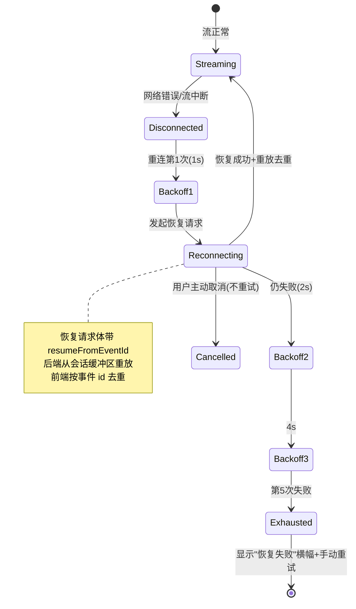
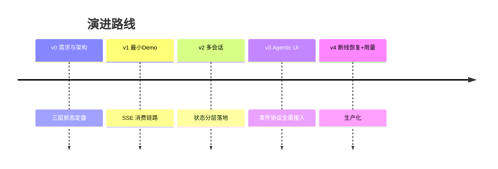

# 项目 04：React Agent 控制台 — 04-迭代三：断线恢复与用量面板

> **定位**：v3 的弱网短板驱动本次迭代：Last-Event-ID 断点恢复、指数退避重连、重放去重、Token 用量面板与生产化收尾。完成后达到生产可部署状态。本文给出**完整可手写代码**（一行不省略）。
>
> 「遇到阻塞？→ [教程 17-React与SSE流式UI §3 断线重连与 Last-Event-ID]、[教程 42 §4.2 queryKey 与配额刷新]、[教程 27-成本治理与Token计量 §指标体系]」

---

## 1. 四问

| 问 | 答 |
|----|----|
| **新增了什么需求** | Last-Event-ID 断点恢复 + 重放去重；指数退避重连状态机（上限/次数/抖动）；断线分类（可重试/不可重试/用户取消）；用量面板（轮次用量 + 配额水位）；生产化（错误边界、协议版本协商） |
| **影响了哪些模块** | 后端：新增 `SessionBuffer`（事件缓冲区）、`QuotaController`，`ChatService` 接入缓冲区写入与重放；前端：连接管理从 `useAgentRound` 内联逻辑抽离为独立 `ConnectionManager`，新增 `QuotaPanel`/`ErrorBoundary` |
| **架构如何演进** | 连接管理独立成可单测的 class；事件去重闸门放到事件入口（reducer 保持纯函数）；用量走 Query 服务端状态 |
| **上一版痛点是什么** | ① 断线即整轮报废（Token 白烧）② 无重连策略（一次失败就终）③ 意外断线与主动取消混淆 ④ 成本无感知 |

## 2. 目标与量化验收

| # | 目标 | 验收 |
|---|------|------|
| 1 | 断点恢复 | 流式输出中拔网线 30 秒再恢复，1-2s 内自动重连，内容从断点继续，零重复 |
| 2 | 重连有界 | 连续 5 次重连失败显示恢复失败横幅；手动重试可用 |
| 3 | 取消即时 | 用户点取消立即停止，不触发重连 |
| 4 | 4xx 不重试 | 后端返回 401，不重试，提示重新登录 |
| 5 | 用量可见 | 轮次结束后配额即时刷新；水位 >90% 变红 |
| 6 | 崩溃兜底 | 组件抛异常被错误边界捕获，页面可恢复 |
| 7 | 部署可用 | 构建产物部署到 Nginx，SSE 正常、路由刷新不 404 |

---

## 3. 断线恢复架构



---

## 4. 参考后端：完整代码（增量）

### 4.1 `SessionBuffer.java`（事件缓冲区，断点恢复的原料）

```java
package com.agent.console.session;

import com.agent.console.event.AgentEvent;
import org.springframework.stereotype.Repository;

import java.util.ArrayList;
import java.util.List;
import java.util.Map;
import java.util.concurrent.ConcurrentHashMap;

/**
 * 每会话的事件缓冲区：断线恢复时按 resumeFromEventId 重放其后的事件（教程 18 §4）。
 * 生产用 Redis Stream / PostgreSQL 持久化 + 多实例广播；v3 用内存演示。
 */
@Repository
public class SessionBuffer {

    private final Map<String, List<AgentEvent>> buffer = new ConcurrentHashMap<>();

    public void append(String sessionId, AgentEvent event) {
        buffer.computeIfAbsent(sessionId, k -> new ArrayList<>()).add(event);
    }

    /** 重放 id 大于 fromEventId 的事件（fromEventId 为 0 表示全量）。 */
    public List<AgentEvent> replay(String sessionId, long fromEventId) {
        return buffer.getOrDefault(sessionId, List.of()).stream()
                .filter(e -> e.id() > fromEventId)
                .toList();
    }
}
```

### 4.2 `ChatService.java` 更新（接入缓冲区：写入 + 重放）

在 v3 的 `ChatService` 基础上做三处修改（其余方法不变）：

```java
// 1) 注入 SessionBuffer（记得把 sessionBuffer 加入构造器参数并赋值）
import com.agent.console.session.SessionBuffer;

private final SessionBuffer sessionBuffer;

// 2) streamRound 顶部改为：断点恢复直接重放缓冲区
public Flux<AgentEvent> streamRound(String sessionId, String message, Long resumeFromEventId) {
    if (sessionStore.find(sessionId).isEmpty()) {
        sessionStore.create(sessionId, null);
    }
    if (resumeFromEventId != null && resumeFromEventId > 0) {
        // 断点恢复：重放缓冲区中 id > resumeFromEventId 的事件（前端按 id 去重）
        return Flux.fromIterable(sessionBuffer.replay(sessionId, resumeFromEventId));
    }
    sessionStore.appendMessage(sessionId, "user", message);

    String roundId = "r-" + UUID.randomUUID().toString().substring(0, 8);
    Flux<AgentEvent> stream = Flux.concat(
            Flux.just(new RoundStart(nextId(), now(), roundId)),
            thoughtFlow(roundId),
            tailFlow(sessionId, roundId, message)
    ).onErrorResume(e -> Flux.just(new ErrorEvent(
            nextId(), now(), "AGENT_ERROR", e.getMessage(), true)));

    // 每个事件都写入缓冲区 → 断线后可从断点重放（doOnNext 追加）
    return stream.doOnNext(e -> sessionBuffer.append(sessionId, e));
}

// 3) resumeRound 同样写缓冲区
public Flux<AgentEvent> resumeRound(String sessionId, String roundId) {
    PendingApprovalStore.PendingApproval pa = approvalStore.require(roundId);
    approvalStore.resolve(roundId);
    return Flux.concat(
            Flux.just(new ApprovalResolved(nextId(), now(), pa.approvalId(), true)),
            tokenFlow(sessionId, "继续回答关于订单 " + pa.args().get("orderId") + " 的问题"),
            Flux.just(new RoundEnd(nextId(), now(), roundId, new TokenUsage(0, 0), "stop"))
    ).onErrorResume(e -> Flux.just(new ErrorEvent(
            nextId(), now(), "AGENT_ERROR", e.getMessage(), true)))
     .doOnNext(e -> sessionBuffer.append(sessionId, e));
}
```

> **取消时缓冲区封存**：v3 未实现 `doOnCancel` 封存（部分结果保留）。生产实现见 [教程 45 §5]——取消三件事：①标记轮次 cancelled ②缓冲区封存 ③取消工具执行。缓冲区必须保留（审计与恢复的依据）。

### 4.3 `QuotaController.java`（用量面板后端）

```java
package com.agent.console.web;

import org.springframework.web.bind.annotation.GetMapping;
import org.springframework.web.bind.annotation.RequestMapping;
import org.springframework.web.bind.annotation.RestController;

@RestController
@RequestMapping("/api/quota")
public class QuotaController {

    /** 演示用静态配额；生产从 gen_ai.client.token.usage 语义约定聚合（教程 21 §指标体系）。 */
    @GetMapping("/me")
    public Quota me() {
        return new Quota(1_200_000, 1_000_000);   // limit / used
    }

    public record Quota(long limit, long used) {}
}
```

---

## 5. 前端：完整代码（增量）

### 5.1 `services/sse.ts`（完整版：HttpError + resumeFromEventId + protocolVersion）

```ts
// services/sse.ts —— fetch + ReadableStream 消费 SSE（完整版，含断点恢复字段）
import type { AgentEvent } from '../types/events';

// 带状态码的错误：供 ConnectionManager 分类 4xx（不可重试）/ 5xx（可重试）
export class HttpError extends Error {
  constructor(public status: number, message?: string) {
    super(message ?? `HTTP ${status}`);
    this.name = 'HttpError';
  }
}

export interface ChatStreamRequest {
  url?: string;                 // 默认 /api/chat；恢复流传 /api/chat/resume/{roundId}
  sessionId: string;
  message?: string;
  resumeFromEventId?: number;   // 断线恢复：重连时带上前一次的最后事件 id
  protocolVersion?: number;     // 协议版本协商（教程 44 §6）
}

export interface StreamHandlers {
  onEvent: (event: AgentEvent) => void;
  onDone: () => void;
  onError: (error: Error) => void;
}

interface ParsedEvents { parsed: AgentEvent[]; remainder: string; }

export async function streamChat(
  request: ChatStreamRequest,
  handlers: StreamHandlers,
  signal: AbortSignal,
): Promise<void> {
  const { url = '/api/chat', ...body } = request;
  const response = await fetch(url, {
    method: 'POST',
    headers: {
      'Content-Type': 'application/json',
      'Accept': 'text/event-stream',
    },
    body: JSON.stringify(body),
    signal,
  });

  if (!response.ok || !response.body) {
    throw new HttpError(response.status);   // 4xx/5xx 分类交给 ConnectionManager
  }

  const reader = response.body.getReader();
  const decoder = new TextDecoder('utf-8');
  let buffer = '';

  while (true) {
    const { done, value } = await reader.read();
    if (done) break;

    buffer += decoder.decode(value, { stream: true });
    const events = parseSSE(buffer);
    buffer = events.remainder;

    for (const event of events.parsed) {
      handlers.onEvent(event);
    }
  }
  handlers.onDone();
}

export function parseSSE(buffer: string): ParsedEvents {
  const parsed: AgentEvent[] = [];
  const frames = buffer.split('\n\n');
  const remainder = frames.pop() ?? '';

  for (const frame of frames) {
    let data = '';
    for (const line of frame.split('\n')) {
      if (line.startsWith(':')) continue;
      if (line.startsWith('data:')) data += line.slice(5).trim();
    }
    if (data) {
      try {
        parsed.push(JSON.parse(data) as AgentEvent);
      } catch {
        // 心跳/非 JSON 忽略——流不能因一帧坏数据整体崩溃
      }
    }
  }
  return { parsed, remainder };
}
```

### 5.2 `services/connection.ts`（重连状态机独立成模块，可单测）

```ts
// services/connection.ts —— 从 useAgentRound 抽离，可独立单测（教程 43 §3）
import { streamChat, HttpError, type ChatStreamRequest, type StreamHandlers } from './sse';

export class ConnectionManager {
  static readonly MAX_RETRIES = 5;
  static readonly BASE_DELAY = 1000;
  static readonly MAX_DELAY = 30_000;

  private retryCount = 0;
  private lastEventId = 0;
  private currentController: AbortController | null = null;

  /** 只读访问器：外部不得访问私有字段。 */
  get currentLastEventId(): number { return this.lastEventId; }

  recordEvent(id: number): void {
    if (id > this.lastEventId) this.lastEventId = id;
  }

  /** 断线三分类（教程 43 §2）：AbortError→不重试；4xx→抛给上层；网络/5xx→指数退避。 */
  async execute(
    start: (resumeFrom: number, signal: AbortSignal) => Promise<void>,
    onRecovered: () => void,
    onExhausted: () => void,
  ): Promise<void> {
    while (this.retryCount <= ConnectionManager.MAX_RETRIES) {
      const controller = new AbortController();
      this.currentController = controller;

      try {
        await start(this.lastEventId, controller.signal);
        if (this.retryCount > 0) onRecovered();       // 经历过重连才提示
        this.retryCount = 0;
        return;                                       // 正常完成
      } catch (err) {
        if (err instanceof DOMException && err.name === 'AbortError') return;   // 主动取消：不重试
        if (err instanceof HttpError && err.status < 500) throw err;            // 4xx：重试无意义

        this.retryCount++;
        if (this.retryCount > ConnectionManager.MAX_RETRIES) { onExhausted(); return; }

        const delay = Math.min(
          ConnectionManager.BASE_DELAY * 2 ** (this.retryCount - 1),
          ConnectionManager.MAX_DELAY,
        ) + Math.random() * 500;                      // 抖动：防重连风暴同步
        await this.sleep(delay, controller.signal);
      }
    }
  }

  cancel(): void {
    this.currentController?.abort();
  }

  private sleep(ms: number, signal: AbortSignal): Promise<void> {
    return new Promise((resolve, reject) => {
      const timer = setTimeout(resolve, ms);
      signal.addEventListener('abort', () => {
        clearTimeout(timer);
        reject(new DOMException('aborted', 'AbortError'));
      });
    });
  }
}
```

### 5.3 `hooks/useAgentRound.ts` 更新（接入 ConnectionManager + 去重闸门）

在 v3 基础上改造 `send`/`cancel`/清理：

```ts
// hooks/useAgentRound.ts —— 关键变更点（相对 v3）
import { ConnectionManager, HttpError } from '../services/connection';

// 状态与 reducer 同 v3；新增 managerRef
const managerRef = useRef<ConnectionManager | null>(null);

const send = useCallback(async (message: string) => {
  managerRef.current?.cancel();
  const manager = new ConnectionManager();
  managerRef.current = manager;
  dispatch({ type: 'RESET' });

  try {
    await manager.execute(
      async (resumeFrom, signal) => {
        await streamChat(
          {
            sessionId,
            message,
            resumeFromEventId: resumeFrom > 0 ? resumeFrom : undefined,   // 断点恢复
            protocolVersion: 2,                                           // 协议版本协商（教程 44 §6）
          },
          {
            onEvent: (e) => {
              // —— 去重闸门：所有事件先过这里（教程 43 §3.2）——
              if (e.id <= manager.currentLastEventId) return;   // 重放的旧事件，丢弃（用 getter 访问）
              manager.recordEvent(e.id);
              wireEvents(e);
            },
            onError: () => {},          // 错误由异常抛出，ConnectionManager 接管重试
          },
          signal,
        );
      },
      () => dispatch({ type: 'UI_NOTICE', message: '已从断点恢复' }),
      () => dispatch({ type: 'UI_NOTICE', message: '多次重连失败，可手动重试' }),
    );
  } catch (err) {
    if (err instanceof HttpError && err.status === 426) {
      dispatch({ type: 'UI_NOTICE', message: '协议版本不匹配，请刷新页面' });
    } else if (!(err instanceof DOMException && err.name === 'AbortError')) {
      flush();
      dispatch({ type: 'error', id: -1, ts: 0, code: 'FATAL', message: (err as Error).message, recoverable: false });
    }
  }
}, [sessionId, wireEvents, flush]);

// cancel / 会话切换 / 卸载清理改用 managerRef
const cancel = useCallback(() => { managerRef.current?.cancel(); }, []);

useEffect(() => {
  managerRef.current?.cancel();
  dispatch({ type: 'RESET' });
}, [sessionId]);

useEffect(() => () => { managerRef.current?.cancel(); flush(); }, [flush]);
```

> **验收关键**：拔网线 → 服务端继续把事件写进会话缓冲区（[教程 18 §事件缓冲]）→ 恢复网络 → 重连成功 → 重放事件流过去重闸门 → UI 从断点继续，**已显示内容零重复**。去重闸门放在 `onEvent` 最外层而非 reducer——reducer 依赖外部可变状态（lastEventId 在 ref/实例里）会破坏纯函数性（[教程 42 §6 反模式表]）。

### 5.4 `services/api.ts` 追加配额方法

```ts
// services/api.ts —— 追加配额（在 v3 基础上）
getQuota: () => request<{ limit: number; used: number }>('/quota/me'),
```

### 5.5 `components/QuotaPanel.tsx`（用量面板，Query 直管）

```tsx
// components/QuotaPanel.tsx —— 服务端状态，TanStack Query 直管
import { useQuery } from '@tanstack/react-query';
import { api } from '../services/api';

function ProgressBar({ pct, level }: { pct: number; level: 'ok' | 'warn' | 'danger' }) {
  return (
    <div className={`progress-bar ${level}`}>
      <div className="progress-fill" style={{ width: `${Math.min(pct * 100, 100)}%` }} />
    </div>
  );
}

function QuotaPanel() {
  const { data: quota } = useQuery({
    queryKey: ['quota'],
    queryFn: () => api.getQuota(),
    refetchInterval: 60_000,   // 低频轮询；轮次结束后 invalidate 即时刷新（教程 42 §3.4）
  });
  if (!quota) return null;
  const pct = quota.used / quota.limit;
  return (
    <div className="quota-panel">
      <ProgressBar pct={pct} level={pct > 0.9 ? 'danger' : pct > 0.7 ? 'warn' : 'ok'} />
      <span>本月 {quota.used.toLocaleString()} / {quota.limit.toLocaleString()} tokens</span>
    </div>
  );
}
export default QuotaPanel;
```

> 配额数据完全来自后端计量（`gen_ai.client.token.usage` 语义约定，[教程 21 §指标体系]）——前端只做展示，不做任何本地累计（本地计数会与服务端漂移，违反"服务端是真相源"）。

### 5.6 `components/ErrorBoundary.tsx`（错误边界）

```tsx
// components/ErrorBoundary.tsx —— 子树渲染崩溃不白屏
import { Component, type ReactNode } from 'react';

interface ErrorBoundaryProps { children: ReactNode; }
interface ErrorBoundaryState { hasError: boolean; }

class ErrorBoundary extends Component<ErrorBoundaryProps, ErrorBoundaryState> {
  state: ErrorBoundaryState = { hasError: false };

  static getDerivedStateFromError(): ErrorBoundaryState {
    return { hasError: true };
  }

  componentDidCatch(error: Error) {
    console.error('[ErrorBoundary]', error);   // 生产接入前端错误上报
  }

  render() {
    if (this.state.hasError) {
      return (
        <div className="error-boundary">
          <p>界面出现异常</p>
          <button onClick={() => this.setState({ hasError: false })}>重新加载</button>
        </div>
      );
    }
    return this.props.children;
  }
}
export default ErrorBoundary;
```

### 5.7 `App.tsx` 更新（挂 ErrorBoundary + QuotaPanel）

```tsx
// App.tsx —— 在 v3 基础上用 ErrorBoundary 包裹，侧边栏顶部挂 QuotaPanel
import ErrorBoundary from './components/ErrorBoundary';
import QuotaPanel from './components/QuotaPanel';

function SessionLayout() {
  // ...同 v2/v3...
  return (
    <div className="app-layout">
      <SessionSidebar />
      <main className="chat-main">
        <QuotaPanel />
        <ChatThread key={sessionId} sessionId={sessionId} />
      </main>
    </div>
  );
}

function App() {
  return (
    <ErrorBoundary>
      <QueryClientProvider client={queryClient}>
        <BrowserRouter>
          {/* ...同 v2... */}
        </BrowserRouter>
      </QueryClientProvider>
    </ErrorBoundary>
  );
}
export default App;
```

### 5.8 生产化收尾

| 项 | 实现 |
|----|------|
| 错误边界 | 根组件 `ErrorBoundary`——子树渲染崩溃不白屏，显示"重新加载"而非堆栈 |
| 协议版本 | 请求带 `protocolVersion: 2`；响应 426 时提示刷新前端（[教程 44 §6]） |
| 环境变量 | `VITE_API_BASE_URL` 区分 dev/staging/prod（构建期注入，见 `vite.config.ts`） |
| 构建产物 | `npm run build` → `dist/` 静态文件，由 Nginx/CDN 托管 |
| SSE 代理 | Nginx 必须 `proxy_buffering off` + 长超时（[教程 09 §9.1]） |
| 路由刷新 | Nginx `try_files $uri /index.html` 回退（history 路由 404 解决） |
| 埋点 | 页面级 performance 指标（首字延迟 = 首个 token 事件 ts - send ts）上报 |

**首字延迟（TTFT）**是 Agent 前端最核心的体验指标——前端埋点数据可与后端 OTel Span 对齐，形成全链路延迟分析（[教程 22-全链路可观测性 §gen_ai 语义约定] 的前端延伸）。

```nginx
# nginx.conf 关键片段
location /api/ {
    proxy_pass http://127.0.0.1:8080;
    proxy_set_header Connection '';
    proxy_http_version 1.1;
    proxy_buffering off;        # SSE 必须关缓冲（教程 09 §9.1）
    proxy_read_timeout 300s;
}
location / {
    root /var/www/agent-console/dist;
    try_files $uri /index.html; # history 路由回退
}
```

---

## 6. ADR 演进决策

### ADR 04-09：连接管理独立成 class（ConnectionManager），而非 Hook 内联
- **决策**：重连状态机抽离为 `services/connection.ts` 的 class，可独立单测
- **取舍理由**：重连状态机有**跨渲染的生命周期**（retryCount、lastEventId 在多次重试间保持），且需要独立单测（模拟 5 连败、验证退避间隔）。class + 纯异步逻辑最容易测试。React 并不排斥 class——排斥的是"用 class 管理渲染"。领域逻辑该用什么就用什么（[教程 41 §3.4]）

### ADR 04-10：去重闸门放事件入口而非 reducer
- **决策**：`onEvent` 最外层先判断 `e.id <= currentLastEventId` 丢弃，再 `wireEvents`
- **取舍理由**：reducer 判重会让 reducer 依赖外部可变状态（lastEventId 在实例里）——reducer 必须是纯函数（[教程 42 §6]）。闸门放事件入口，reducer 保持纯净，重连状态与渲染状态解耦

### ADR 04-11：用量走 Query 服务端状态，前端不本地累计
- **决策**：配额数据来自 `GET /api/quota/me`，`refetchInterval` 60s + 轮次结束 invalidate
- **取舍理由**：本地累计会与服务端计量漂移，违反"服务端是真相源"（[教程 21 §指标体系]）

## 7. 验收与手动测试清单

| # | 场景 | 期望 |
|---|------|------|
| 1 | 流式输出中拔网线 30 秒再恢复 | 1-2s 内自动重连，内容从断点继续，零重复 |
| 2 | 后端滚动发布（连接被掐） | 同上（SSE 断开走同一恢复路径） |
| 3 | 连续 5 次重连失败 | 显示恢复失败横幅；手动重试可用 |
| 4 | 用户点取消 | 立即停止，不触发重连 |
| 5 | 后端返回 401 | 不重试，提示重新登录（走 4xx 分支） |
| 6 | 用量面板 | 轮次结束后即时刷新；水位 >90% 变红 |
| 7 | 组件抛异常 | 错误边界兜底，页面可恢复 |
| 8 | 构建产物部署到 Nginx | SSE 正常（代理已关缓冲）、路由刷新不 404（history 回退配置） |

## 8. 项目总结



四轮迭代完整走过：**SSE 消费 → 状态架构 → 事件协议 → 韧性与生产化**——与教程 41→44 的知识递进一一对应，无超前依赖、无回头返工。v4 遗留的扩展方向：生成式 UI（受限 DSL 注册表，[教程 44 §4]）与多页签实时同步依赖后端广播（[教程 18]），可作为个人扩展练习。

→ [05-核心代码讲解.md](05-核心代码讲解.md) — 全项目关键代码的集中解析。

---

## 9. 总结

| 模块 | 交付物 | 关键点 |
|------|--------|--------|
| 后端 | SessionBuffer + ChatService 更新 + QuotaController | 事件缓冲/重放；`doOnNext` 写缓冲区；配额 REST |
| 连接管理 | `services/connection.ts` ConnectionManager | 指数退避（1s→2s→4s→8s，上限 30s，5 次）+ 抖动；断线三分类 |
| 去重 | useAgentRound 事件入口闸门 | `e.id <= currentLastEventId` 全弃；reducer 保持纯函数 |
| 用量 | QuotaPanel + Query | `['quota']` queryKey；轮次结束 invalidate；水位三级 |
| 生产化 | ErrorBoundary + nginx 配置 + 协议版本 | 崩溃兜底；SSE 关缓冲；426 提示刷新 |
