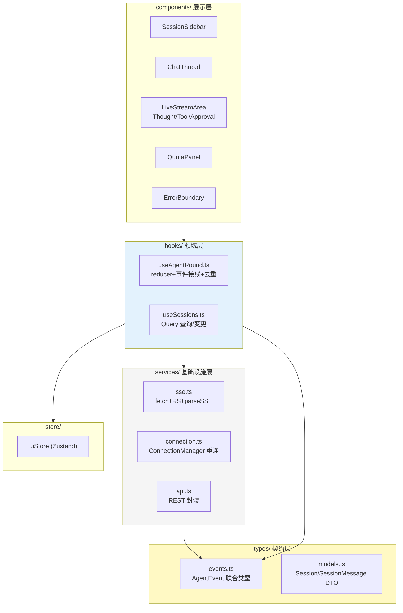

# 项目 04：React Agent 控制台 — 05-核心代码讲解

> **定位**：全项目关键代码的集中解析——不是重复贴代码，而是回答"为什么这样设计、换一种写法会怎样"。适合在完成各迭代手写代码后回头对照复盘。
>
> **前置阅读**：已完成 01-04 各迭代的代码手写。

---

## 1. 全项目代码地图



**完整文件清单**（照抄位置）：

| 文件 | 完整代码位置 |
|------|------------|
| `pom.xml` / `application.yml` | 00 §6.1 / §6.2 |
| `package.json` / `vite.config.ts` / `tsconfig.json` | 00 §6.3 / §6.4 |
| `event/AgentEvent.java`（sealed 契约） | 00 §6.5 |
| `AgentConsoleApplication` / `AgentConfig` | 01 §4.1-4.2（02 §4.1 升级挂记忆） |
| `web/ChatController` | 01 §4.3 → 03 §4.5（接 ChatService + 恢复） |
| `session/SessionStore` + `web/SessionController` | 02 §4.2-4.3 |
| `tool/OrderTools` + `hitl/PendingApprovalStore` | 03 §4.1-4.2 |
| `service/ChatService`（事件编排） | 03 §4.3（04 §4.2 加缓冲重放） |
| `web/ApprovalController` / `web/QuotaController` | 03 §4.4 / 04 §4.3 |
| `session/SessionBuffer` | 04 §4.1 |
| `types/events.ts` | 00 §6.5（03 §5.1 全量） |
| `services/sse.ts` / `services/api.ts` | 01 §4.5 → 03 §5.2 → 04 §5.1 / 02 §4.6 |
| `services/connection.ts` | 04 §5.2 |
| `reducer/agentRoundReducer.ts` + `hooks/useAgentRound.ts` | 03 §5.3 / §5.5（04 §5.3 接重连） |
| `components/` 全套 | 01 §4.7、02 §4.10、03 §5.6、04 §5.5-5.7 |

---

## 2. 六个关键设计决策复盘

### 2.1 为什么 token 走 ref 缓冲而 tool 事件直接 dispatch

对比两条路径（`useAgentRound.wireEvents`）：

```ts
case 'token':  handleToken(e.content);  // → pendingRef + rAF，每帧最多一次渲染
case 'tool_start': dispatch(e);         // → 立即渲染
```

**决策依据是频率差异**（[教程 17 §4]）：token 每秒 20-80 个，不缓冲会打满主线程；工具事件每轮几个，缓冲反而引入"卡片延迟出现"的怪异感（违反 3 秒规则）。**背压要施加在高频源上，不能一刀切**——这与后端 Reactor 只对快生产者加 buffer/onBackpressure 是同一判断标准（[附录 06-WebFlux与响应式编程/01-背压与流量控制]）。

### 2.2 为什么 activeSessionId 放 URL 而不是 Zustand

三个免费收益：深链接（`/sessions/abc` 直接打开）、浏览器前进后退、刷新保持当前会话。状态能放进 URL 的就不要进 store——URL 是最古老的全局状态管理器。反例：如果放 store，刷新后回退到列表页（丢失状态），用户会认为这是 bug。

### 2.3 为什么流结束后 invalidate 而非本地拼接

```ts
case 'round_end':
  flush();
  dispatch(e);
  queryClient.invalidateQueries({ queryKey: ['session-messages', sessionId] });
```

备选方案是乐观地把本地流文本直接写进 Query 缓存（`setQueryData`）。放弃的原因：**服务端才是真相源**——后端可能在流结束后做记忆写入、消息规整（合并工具轮次）、配额扣减（[教程 04 §3 Memory Advisor]）。本地拼接在多页签场景必然不一致。invalidate 的代价（一次额外请求）换来一致性，值得。这与后端"语义缓存失效优于本地更新"是同一原则（[附录 10-语义缓存与性能/00-语义缓存实现 §失效策略]）。

### 2.4 为什么 ConnectionManager 是 class 而非 Hook

重连状态机有**跨渲染的生命周期**（retryCount、lastEventId 在多次重试间保持），且需要独立单测（模拟 5 连败、验证退避间隔）。class + 纯异步逻辑最容易测试（不依赖 React 渲染环境）。React 并不排斥 class——排斥的是"用 class 管理渲染"。**领域逻辑该用什么就用什么，Hook 只是把逻辑"接进"渲染的桥**（[教程 15 §3.4]）。注意 class 只持有状态与方法，外部通过 `get currentLastEventId()` 只读访问器取数——私有字段不裸奔。

### 2.5 为什么去重闸门在 onEvent 最外层

```ts
onEvent: (e) => {
  if (e.id <= manager.currentLastEventId) return;  // 闸门（用 getter 访问私有字段）
  manager.recordEvent(e.id);
  wireEvents(e);                            // 只有新事件进入状态机
}
```

备选位置：reducer 里判重。放弃原因：reducer 判重会让 reducer 依赖外部可变状态（lastEventId 在 ConnectionManager 实例里）——reducer 必须是纯函数（[教程 16 §6 反模式表]）。闸门放事件入口，reducer 保持纯净，重连状态与渲染状态解耦。

### 2.6 为什么前端不做脱敏

工具参数展示直接用后端发来的 args——哪怕看起来"前端再过滤一道更安全"。原因：**安全责任必须在后端单一化**（[附录 09-Agent安全深度/02-数据泄露防护]）。前端过滤是纵深防御的补充，绝不能成为依赖——前端代码在浏览器里，攻击者可绕过任何前端逻辑直接看网络包。如果后端漏发敏感参数，正确的响应是修后端（+ 加检测告警），而不是给前端打补丁。

---

## 3. 最容易写错的五处（自检清单）

| # | 位置 | 错误写法 | 后果 | 正确写法 |
|---|------|---------|------|---------|
| 1 | parseSSE | 忽略 remainder 直接解析 buffer | 断在 JSON 中间的事件解析失败，丢 token | `frames.pop()` 留到下个 chunk（[教程 17 §1.3]） |
| 2 | useAgentRound 依赖 | send 的 useCallback 不含 sessionId | 切会话后消息发进旧会话 | `[sessionId, wireEvents, flush]` |
| 3 | 卸载清理 | 只 cancel 不 flush | rAF 回调在卸载后 dispatch → 内存泄漏警告 | 两项都清（`managerRef.cancel(); flush();`） |
| 4 | AbortError | 当成故障显示错误横幅 | 用户点停止就"报错" | 按类型分流静默（`DOMException && name==='AbortError'`） |
| 5 | 重放去重 | 用 `<` 而非 `<=` | 恢复瞬间最后一条事件重复一次 | `e.id <= currentLastEventId` 全弃 |

---

## 4. 性能剖析（对照验收数据）

典型数据（M1 Mac、1000 token 回答、3 次工具调用）：

| 指标 | v1 直觉写法 | v4 最终架构 | 改进手段 |
|------|------------|------------|---------|
| 渲染次数/轮 | ~1000（每 token 一次） | ~60（每帧一次） | rAF 批量缓冲 |
| 重渲染范围/帧 | 全组件树 | LiveStreamArea 子树 | 状态隔离 + memo |
| 会话切换内存 | 连接泄漏累积 | 恒定 | abort + RESET 纪律 |
| 断线恢复重复内容 | 整轮重复 | 0 | id 去重闸门 |

React DevTools Profiler 的使用建议：录制一轮完整对话，检查每次 commit 的"渲染组件高亮"——如果 SessionSidebar 在 token 帧里被点亮，说明状态隔离被破坏（通常是有人把轮次状态提升到了全局）。

---

## 5. 与后端架构的对应关系（架构师视角收束）

本项目的前端架构决策，几乎每一个都是后端对应模式的镜像：

| 前端 | 后端 | 共同原则 |
|------|------|---------|
| 三层状态（全局/服务端/本地流式） | 三层记忆（短期/长期/RAG，[教程 39 §2]） | 按生命周期与频率分层 |
| rAF 批量缓冲 | Reactor buffer/背压 | 对高频源施加背压 |
| 事件协议 AgentEvent（TS 联合类型） | AgentEvent sealed interface（[教程 19 §2]） | 契约先行，两端独立演进 |
| invalidate 重拉 | 服务端真相源 + 缓存失效 | 不本地拼接权威数据 |
| ConnectionManager 退避 | Resilience4j retry + 指数退避（[教程 24]） | 重试必须有上限+抖动 |
| 去重闸门（id） | 事件 id 单调 + 缓冲区重放（[教程 24 §4]） | 至少一次投递 + 消费端幂等 |
| 协议版本协商 | API 版本管理（[教程 23]） | 前后端独立部署的兼容前提 |

**架构师的跨端能力不是"会写两套代码"，而是识别出两端共享的模式并设计出对称的契约**——这正是本项目最想传递的训练。

---

## 6. 总结

| 决策 | 一句话 |
|------|--------|
| token/工具分通道 | 频率差异决定背压施加位置（[教程 17 §4]） |
| 流结束 invalidate | 服务端是真相源，本地拼接必不一致 |
| ConnectionManager 用 class | 跨渲染生命周期 + 可独立单测；Hook 只是接线桥 |
| 去重闸门在事件入口 | reducer 必须纯函数，不依赖外部可变状态 |
| 前端不做脱敏 | 安全责任后端单一化，前端过滤只是纵深防御 |
| 三层状态 | 全局（Zustand）/ 服务端（Query）/ 本地流式（reducer）各归其位 |

项目 04 到此完成。全部代码由你手写——这份文档没有替你写任何一行，它只负责让你在写每一行之前知道"为什么"。回头检验学习效果的标准：**不看文档，能独立说出 §2 六个决策的备选方案和取舍理由**。
