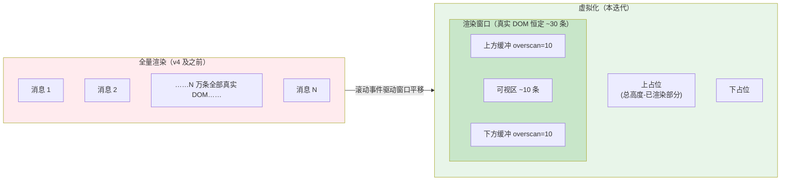
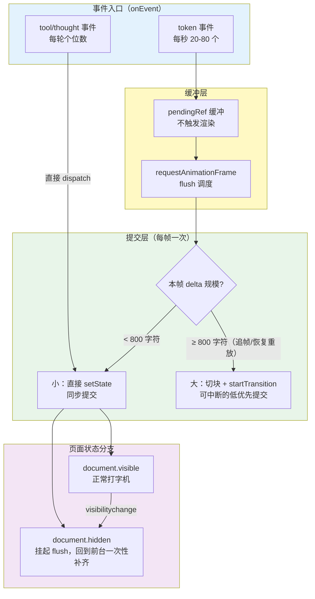
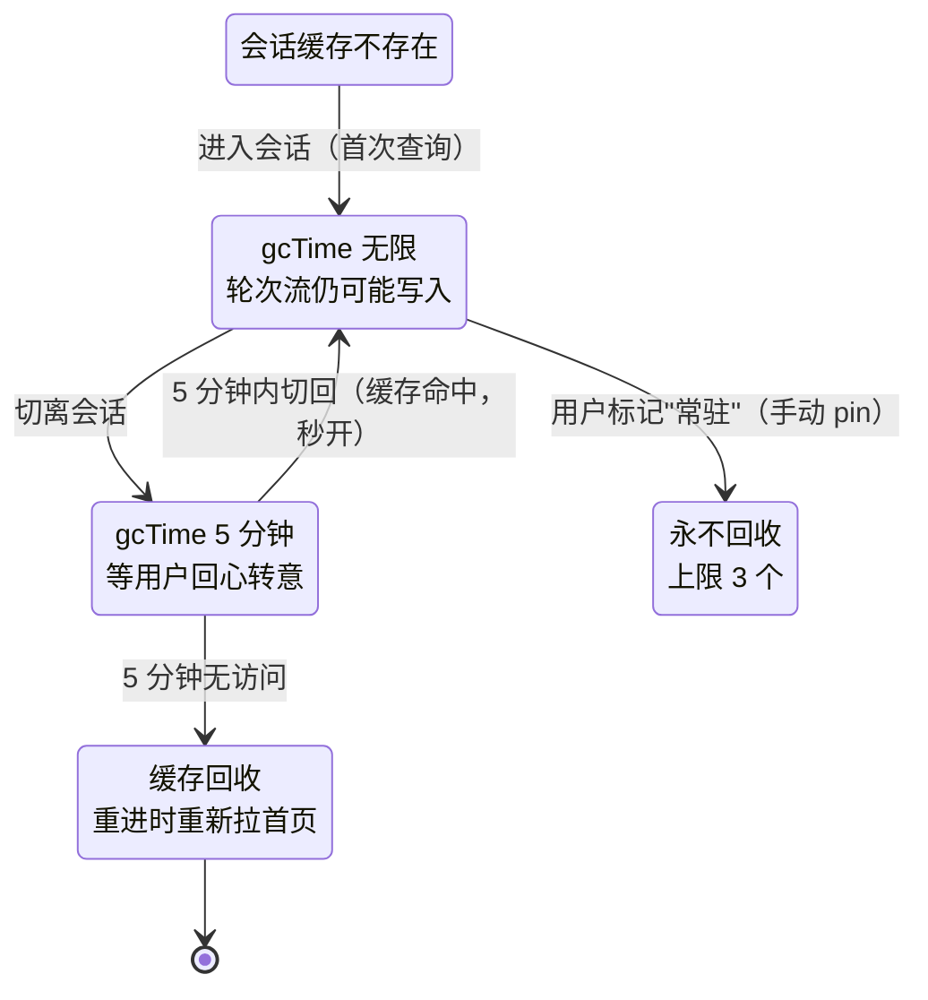
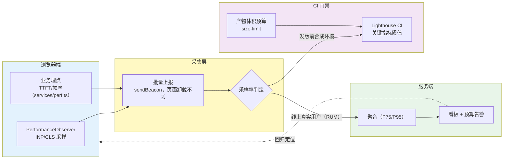

# 项目 04：React Agent 控制台 — 06-进阶迭代一：前端性能与虚拟化

> **定位**：核心篇（01-05）完成后的第一条进阶线：把控制台从"能用"推到"千锤百炼"——长会话列表虚拟化（万级消息窗口）、流式渲染深度优化（分帧渲染/减少重渲染）、内存控制（不可见会话卸载）、性能预算与度量（INP/CLS 门禁）。本文是**进阶迭代篇**，延续四问-架构-代码-验收的演进节奏；代码为概念 TSX 片段（不生成源码文件），后端接口沿用 00 §3.2 契约。
>
> **前置阅读**：已完成 01-05 各迭代；[教程 03-React前端与AgenticUI/02-React与SSE流式UI §4 渲染性能]、[教程 01-WebFlux与响应式编程/06-线程模型与调度器 §3.2 Zustand selector 订阅]
> 「遇到阻塞？→ [教程 01-WebFlux与响应式编程/05-WebFlux进阶实战 §6 React 渲染模型]、[教程 01-WebFlux与响应式编程/07-WebFlux测试与性能调优 §4.1 每 token 一次 setState 的问题]」

---

## 1. 四问

| 问 | 答 |
|----|----|
| **新增了什么需求** | 万级消息会话流畅滚动（虚拟化）；60fps 流式输出在低端机上也成立（分帧渲染）；20+ 会话常驻不爆内存（不可见会话卸载）；性能回归有门禁（INP/CLS 预算进 CI） |
| **影响了哪些模块** | 前端：`HistoryList` 改为虚拟化容器、`LiveOutput` 拆分帧渲染、`useSessions` 增加缓存回收策略、新增 `services/perf.ts` 埋点层；后端：零改动（性能是前端工程问题，契约不动） |
| **架构如何演进** | 渲染从"全量 DOM"演进为"窗口化 DOM + 分帧提交"；性能从"体感优化"演进为"预算驱动 + 度量闭环"（与后端 SLO 门禁同一思想） |
| **上一版痛点是什么** | ① 05 §4 的 rAF 只管"本轮流式"，历史会话到几千条消息时滚动掉帧 ② 打字机输出到 3000+ token 后每帧提交的 DOM diff 越来越贵 ③ 长期开着的页签内存缓慢上涨（Query 缓存永不回收）④ 性能靠"感觉还行"，没有回归防线 |

### 1.1 本节核对（四问）

| # | 核对项 | 判据 |
|---|--------|------|
| 1 | 四个痛点与四组交付一一对应 | ①↔虚拟化、②↔分帧渲染、③↔gcTime 治理、④↔INP/CLS 门禁 |
| 2 | 后端零改动的理由成立 | 性能是前端工程问题，00 §3.2 契约不动 |

## 2. 目标与量化验收

| # | 目标 | 验收 |
|---|------|------|
| 1 | 万级消息流畅 | 10,000 条消息的会话，快速滚动 60fps（DevTools Performance 无长任务 >50ms） |
| 2 | 长答案不卡 | 单轮 5000 token 输出，主线程长任务 ≤ 2 次/轮，INP < 200ms |
| 3 | 布局稳定 | 流式输出与图片加载过程 CLS < 0.1（光标跳动/图片撑开不计入位移灾难） |
| 4 | 内存有界 | 开 30 分钟、切换 20 个会话后，堆内存稳定（三次快照无持续增长） |
| 5 | 门禁生效 | 性能预算表进入 CI：打包产物超预算或 Lighthouse 关键指标低于阈值即红灯 |

### 2.1 本节核对（目标与量化验收）

| # | 核对项 | 判据 |
|---|--------|------|
| 1 | 五条验收全部带数字阈值 | 60fps / ≤2 次长任务 / INP<200ms / CLS<0.1 / 三快照稳定 / 200KB |
| 2 | 验收口径与 §8 验收对照表逐行一致 | 无口径漂移 |

---

## 3. 长会话列表虚拟化：万级消息窗口

### 3.1 问题画像

`HistoryList`（02 §4.10）把全部历史消息渲染成真实 DOM。一条消息约 10-30 个节点（气泡、头像、工具卡片），10,000 条消息就是 **20-30 万个 DOM 节点**——浏览器渲染树直接过载：滚动时 layout/paint 成本线性上涨，切会话时 mount/unmount 一次要几秒。

虚拟化的本质：**只渲染视口内（含上下缓冲）的消息，视口外用两个空白占位撑起滚动条**。DOM 数量从 O(n) 降到 O(窗口)。



### 3.2 概念实现（自研窗口化核心）

不引库先自研（学习目标），生产可换 TanStack Virtual（见 ADR 04-12 的回滚路径）：

```tsx
// components/VirtualizedHistory.tsx —— 概念代码：窗口化滚动容器
import { useLayoutEffect, useRef, useState } from 'react';
import type { SessionMessage } from '../types/models';

interface VirtualizedHistoryProps {
  messages: SessionMessage[];       // 已加载的历史（倒序存储）
  estimatedItemHeight: number;      // 估算行高，滚动后逐步校准
  renderMessage: (msg: SessionMessage) => React.ReactNode;
}

function VirtualizedHistory({ messages, estimatedItemHeight, renderMessage }: VirtualizedHistoryProps) {
  const containerRef = useRef<HTMLDivElement>(null);
  const [scrollTop, setScrollTop] = useState(0);
  const [viewportHeight, setViewportHeight] = useState(600);
  const heightCache = useRef<number[]>([]);      // 实测行高缓存，消除估算误差

  useLayoutEffect(() => {
    const el = containerRef.current!;
    const onScroll = () => setScrollTop(el.scrollTop);
    const ro = new ResizeObserver(() => setViewportHeight(el.clientHeight));
    el.addEventListener('scroll', onScroll, { passive: true });
    ro.observe(el);
    return () => { el.removeEventListener('scroll', onScroll); ro.disconnect(); };
  }, []);

  // 二分查找 scrollTop 对应的起始索引（heightCache 前缀和单调递增）
  const overscan = 10;
  const startIndex = Math.max(0, findIndexForOffset(heightCache.current, scrollTop) - overscan);
  const endIndex = Math.min(messages.length, findIndexForOffset(heightCache.current, scrollTop + viewportHeight) + overscan);
  const visible = messages.slice(startIndex, endIndex);

  const topPad = sumHeights(heightCache.current, 0, startIndex);
  const bottomPad = estimatedItemHeight * (messages.length - endIndex);

  return (
    <div ref={containerRef} className="virtual-history" style={{ overflowY: 'auto' }}>
      <div style={{ height: topPad }} aria-hidden="true" />
      {visible.map((m, i) => (
        <div key={m.time} ref={el => measureInto(heightCache.current, startIndex + i, el)}>
          {renderMessage(m)}
        </div>
      ))}
      <div style={{ height: bottomPad }} aria-hidden="true" />
    </div>
  );
}
export default VirtualizedHistory;
```

三个工程要点（概念代码中的留白正对应它们）：

| 要点 | 说明 |
|------|------|
| **变高行** | 消息高度差异巨大（一句话 vs 带工具卡片的长回答）。`heightCache` 前缀和 + 实测回填校准，避免滚动条抖动。这正是自研成本所在，也是 TanStack Virtual 帮你做掉的事 |
| **滚动锚定** | "加载更早"插入新页后，浏览器默认把视口钉在顶部——体验崩塌。用 `overflow-anchor` CSS（现代浏览器原生支持）或手动记录锚点消息的 offset 差值回滚 scrollTop |
| **键盘/无障碍** | 窗口外的消息在 DOM 里不存在，屏幕阅读器与 Ctrl+F 会失效——虚拟化必须配 `aria-setsize/aria-posinset` 语义与页面内搜索降级方案（详见 08 §2 的 a11y 配套） |

### 3.3 与分页加载的配合

虚拟化解决"已加载消息的渲染成本"，分页（02 §4.8 `useInfiniteQuery` 向上翻页）解决"不必一次全量加载"。两者叠加：视口滚到窗口顶部且 `hasNextPage` 时自动 `fetchNextPage`——用户感知是"无限平滑上滚"，网络与 DOM 双双有界。锚点对齐 [教程 04-企业级架构主干/04-多页面流式响应与会话管理 §分页] 的服务端游标思想。

### 3.4 本节测试与验证（虚拟化窗口）

> **前置**：VirtualizedHistory 概念代码已按本节落进工程；测试会话已灌入 10,000 条消息（造数据端点见 §8 第 1 条）。

| # | 操作 | 预期（PASS 判据） |
|---|------|------------------|
| 1 | DevTools Elements 检查消息容器子节点数 | 恒定 ~30 条真实消息 DOM + 上下两个占位 div，与滚动位置无关 |
| 2 | 快速滚动 10 秒（Performance 录制） | FPS 轨道稳定 60；Long Task（>50ms）为 0 |
| 3 | 从中部滚动到顶部（hasNextPage=true） | 自动触发 fetchNextPage，视口不被"钉"在顶部（滚动锚定生效） |
| 4 | 滚动来回多次观察滚动条 | 无明显抖动跳变（heightCache 行高校准生效） |
| 5 | 键盘 Tab/屏幕阅读器（如已做 08 篇配套） | 窗口外消息语义仍可感知（aria-setsize/aria-posinset） |

**失败排查**：DOM 数不降 → 渲染窗口计算没生效（检查 findIndexForOffset 前缀和）；滚动条抖 → 实测行高未回填 heightCache；加载更早后跳顶 → overflow-anchor/手动锚点未做；Ctrl+F 搜不到 → 属已知虚拟化代价，需 08 §2 的搜索降级方案。

---

## 4. 流式渲染优化：分帧、降范围、防抖动

### 4.1 渲染管线全景

05 §4 已交付 rAF 批量缓冲（每帧最多一次提交）。本迭代把它升级为一条完整的**分帧渲染管线**，并补齐低端机分支：



关键新增是**追帧与恢复重放的切块提交**：断线恢复（04 §5）重放几十条事件、或后端突然 flush 一大段（网络拥塞后的突发），单帧 delta 可能上千字符——一次性 setState 会让 React 同步 diff 整个大文本块。用 React 19 的 `startTransition`（[教程 01-WebFlux与响应式编程/06-线程模型与调度器 §2]）把大块文本提交降为可中断的低优先级更新，输入框、取消按钮保持即时响应（INP 的直接保障）。

### 4.2 长文本分段渲染：只让"最后一段"动

5000 token 的回答，每来一个 token 都 diff 整个 `<LiveOutput>` 是浪费。把输出按段落切块，**只有最后一块是动态的，历史块全部 memo 冻结**：

```tsx
// components/LiveOutput.tsx —— 概念代码：段落分块 + memo 冻结
import { memo } from 'react';

const FrozenParagraph = memo(function FrozenParagraph({ text }: { text: string }) {
  return <p className="answer-para">{text}</p>;
});   // props 是原始字符串，引用稳定 → token 到来时这些块零重渲染

function LiveOutput({ text }: { text: string }) {
  const paragraphs = text.split('\n\n');        // 段落边界切块（渲染语义与 a11y 也受益，08 §2）
  const frozen = paragraphs.slice(0, -1);       // 已完成的段落
  const active = paragraphs.at(-1) ?? '';       // 打字机只作用于最后一段

  return (
    <div className="live-output">
      {frozen.map((p, i) => <FrozenParagraph key={i} text={p} />)}
      <p className="answer-para active">
        {active}
        <span className="caret" aria-hidden="true" />
      </p>
    </div>
  );
}
export default LiveOutput;
```

同样的纪律用在工具卡片：`ToolCard` 用 `memo` 包裹，props 里 `ToolCallInfo` 是不可变对象，reducer 更新时**替换整个对象而非原地修改**（03 §5.3 的 reducer 本来就这么写）——memo 才能命中。这是"数据不可变性换取渲染可跳过"的标准换算（[教程 01-WebFlux与响应式编程/06-线程模型与调度器 §1 原则]）。

### 4.3 CLS 防抖动清单

流式界面的布局稳定性有三个经典敌人：① 打字机换行把输入区顶下去（输入框 sticky 定位解决）② 图片/附件异步加载撑开气泡（固定宽高占位 `aspect-ratio`）③ 工具卡片"完成后"追加结果预览（卡片高度预留 `min-height` 或用 grid 稳定槽位）。每一条都对应 Lighthouse CLS 扣分项。

### 4.4 本节测试与验证（分帧渲染与 CLS）

> **前置**：分帧管线、FrozenParagraph 分段、startTransition 分流已落进工程；一段会输出 5000+ token 的 prompt。

| # | 操作 | 预期（PASS 判据） |
|---|------|------------------|
| 1 | 发送"详细阐述……"类长 prompt，Performance 录制全程 | >50ms 长任务 ≤ 2 次/轮 |
| 2 | 输出进行中连续点击"停止"按钮 | 按钮即时响应（大 delta 走 startTransition，INP 不爆） |
| 3 | React Profiler 看 token 帧渲染范围 | 只有最后一段（active 段落）重渲染；FrozenParagraph 零重渲染 |
| 4 | 触发一次断线恢复（04 §5.9 第 4 条复跑） | 重放大块内容期间输入框仍可交互（≥800 字符切块提交生效） |
| 5 | 把页签切走再切回（document.hidden→visible） | 回前台一次性补齐内容，无丢失、无重复 |
| 6 | Lighthouse 或 PerformanceObserver('layout-shift') | 流式全程 CLS < 0.1；输入区无被顶开位移 |

**失败排查**：长任务超标 → 大 delta 未走 startTransition 或阈值 800 未生效；停止按钮卡 → Transition 分流条件写反；段落仍在重渲染 → FrozenParagraph 的 props 引用不稳定（text 必须是原始字符串）；CLS 高 → 对照 §4.3 三条清单逐项检查（sticky/aspect-ratio/min-height）。

---

## 5. 内存控制：让常开的控制台不变成"内存怪兽"

### 5.1 会话缓存的生命周期

用户实际行为：控制台一开一整天，切换过几十个会话。TanStack Query 默认把所有 `['session-messages', id]` 缓存留在内存——会话数据只进不出。治理策略：



落地是 Query 的两个旋钮 + 一条自定义规则：

```ts
// hooks/useSessions.ts —— 概念代码：按活跃度区分缓存策略
export function useSessionMessages(sessionId: string) {
  const pinned = useUIStore(s => s.pinnedSessionIds.includes(sessionId));
  return useInfiniteQuery({
    queryKey: ['session-messages', sessionId],
    queryFn: ({ pageParam }) => api.listMessages(sessionId, { before: pageParam }),
    initialPageParam: undefined as string | undefined,
    getNextPageParam: last => last.nextCursor ?? undefined,
    gcTime: pinned ? Infinity : 5 * 60_000,   // 常驻/普通会话两档（教程 01-WebFlux与响应式编程/06-线程模型与调度器 §4）
    staleTime: 30_000,
  });
}

// 侧边栏排序之外，uiStore 增记 pinnedSessionIds（用户显式动作，不自动猜测）
```

### 5.2 内存控制三板斧（虚拟化之外）

| 手段 | 位置 | 说明 |
|------|------|------|
| **分页 + 卸载** | 历史消息 | `useInfiniteQuery` 只保最近 2-3 页 + 虚拟化窗口；"加载更早"按需拉，超长会话内存 O(页) 而非 O(全量) |
| **resultPreview 截断** | 事件契约（00 §6.5） | 后端已经做了——前端不要"贴心地"再拉全量结果放大卡片（全量查看走独立 REST + 弹窗，用完即弃） |
| **图片/附件懒加载** | 渲染层 | `loading="lazy"` + `decoding="async"`；离开视口的消息由虚拟化自然卸载 DOM，解码缓存由浏览器回收 |

**度量先于优化**：开 DevTools Memory → 分层快照（切换会话 10 次 → 快照 A；再切 10 次 → 快照 B；再 10 次 → 快照 C）。A→B→B' 稳定说明无泄漏，只是"常驻缓存"；A→B→C 单调上涨才是泄漏（通常是 03 §5.3 的事件监听器或 04 §5.2 的 AbortController 没清）——先定位再动手，与后端"先指标后优化"同一纪律（[教程 08-架构师进阶/04-Agent性能优化]）。

### 5.3 本节测试与验证（内存控制）

> **前置**：gcTime 分档与 pinnedSessionIds 已落进 uiStore/useSessions；控制台已加载多会话数据。

| # | 操作 | 预期（PASS 判据） |
|---|------|------------------|
| 1 | 切换 10 个会话 → Memory 快照 A；再 10 次 → B；再 10 次 → C | A→B→C 堆大小稳定（无单调上涨） |
| 2 | 切离某会话后等 6 分钟再切回 | Network 出现重新拉取（gcTime 5 分钟回收生效），页面正常 |
| 3 | 5 分钟内切回 | 无历史请求（缓存命中秒开） |
| 4 | 给会话打"常驻"标记后重复 2 | 不重新拉取（gcTime=Infinity 生效），且常驻数 ≤3 |

**失败排查**：快照单调上涨 → 用 Memory 面板 Retainers 定位：事件监听器（VirtualizedHistory 的 scroll/ResizeObserver 清理）或 AbortController；常驻不生效 → pinned 判断没进 queryKey 相关配置（gcTime 条件写错）。

---

## 6. 性能预算与度量：INP/CLS 门禁

### 6.1 指标体系：通用指标 + 业务指标两层

| 层 | 指标 | 目标 | 采集方式 |
|----|------|------|---------|
| 通用 | **INP**（Interaction to Next Paint） | < 200ms | `PerformanceObserver('event')`；重点看"发送消息""点停止""切会话"三类交互 |
| 通用 | **CLS**（Cumulative Layout Shift） | < 0.1 | `PerformanceObserver('layout-shift')`；流式输出期间的位移大头 |
| 业务 | **TTFT**（首字延迟） | P75 < 1.5s | 发送时刻到首个 token 事件 ts 的差值（04 §5.8 已埋点） |
| 业务 | **打字机帧率** | > 45fps | 流式期间 rAF 间隔采样的 P10（低端机防线） |
| 资源 | 首屏 JS | < 200KB gzip | 构建产物统计（`vite build --report` 或 rollup-plugin-visualizer） |

> INP 已取代 FVP/FID 成为 Core Web Vitals 的响应性指标——它衡量的正是"点发送后界面多快给出反馈"，与 Agent 控制台的体验内核重合。后端 TTFT 与前端 INP 分属两端（[教程 04-企业级架构主干/02-全链路可观测性 §gen_ai 语义约定]），但用户只感受一个数字：从按下回车到看见第一个字。

### 6.2 度量闭环



两条防线分工明确：**线上 RUM**（真实用户监控）回答"用户实际体验如何"（P75 分位数才作数，均值会骗人）；**CI 合成环境**（Lighthouse + size-limit）回答"这次提交有没有把指标弄坏"。`services/perf.ts` 是唯一出口，埋点与业务代码解耦——与后端"Observation 统一出口"同一分层直觉（[教程 02-SpringAI核心机制/03-结构化输出 §1]）。

### 6.3 本节测试与验证（指标采集与门禁）

> **前置**：`services/perf.ts` 埋点层落盘（TTFT/帧率）；CI 已配置 size-limit 与 Lighthouse CI（或先本地等价命令验证）。

| # | 操作 | 预期（PASS 判据） |
|---|------|------------------|
| 1 | Console 里临时 `new PerformanceObserver(...)` 打印 layout-shift，跑一轮流式 | observer 有采样输出，且 §4.4 第 6 条 CLS < 0.1 |
| 2 | 发送消息并在 Console 记录 send 时刻与首个 token ts | TTFT 数值被 perf.ts 捕获（P75 口径多轮采样） |
| 3 | `npm run build` 后统计产物 | 首屏 JS < 200KB gzip（size-limit 通过，无红灯） |
| 4 | 本地跑 Lighthouse（或 `npx @lhci/cli autorun`） | INP/CLS 相关指标不低于阈值，CI 门禁绿灯 |
| 5 | 人为把一个 300KB 的依赖 import 进首屏再跑 3 | size-limit 红灯（门禁真的会拦）；验证后还原 |

**失败排查**：TTFT 无数据 → 首个 token 的 ts 未回传埋点层；size-limit 不拦截 → 配置的 path/gzip 口径与实际产物不符；Lighthouse 波动大 → 用 CI 固定环境跑，不用本地手跑数字作准。

---

## 7. ADR 演进决策

### ADR 04-12：长列表用虚拟化窗口，而非分页切片全渲染
- **决策**：`HistoryList` 升级为 `VirtualizedHistory`（自研窗口化 + 行高缓存），分页加载负责网络层、虚拟化负责渲染层
- **备选**：① 继续分页 + 全渲染（v4 现状）——10k 消息即崩；② CSS `content-visibility: auto`——浏览器自动跳过屏外渲染，一行 CSS 零改造，但滚动条高度估算漂移、且不减少 React 树的 mount 成本；③ TanStack Virtual——成熟方案
- **取舍理由**：自研是为了吃透行高校准/滚动锚定这两个虚拟化的真难点（学习目标）；生产切换 TanStack Virtual 只需替换容器实现（接口已隔离在 `renderMessage` 回调）
- **可回滚**：`content-visibility: auto` 作为一行降级开关保留在 CSS 中，出问题时先切它再查窗口计算

### ADR 04-13：大 delta 提交走 startTransition，普通 delta 保持同步
- **决策**：rAF flush 时按单帧 delta 规模分流：<800 字符同步提交（打字机即时性优先），≥800 字符（恢复重放/追帧）切块后 `startTransition` 提交（交互响应性优先）
- **备选**：全部同步（长重放时点"停止"无响应，INP 爆表）；全部 Transition（打字机出现可感知延迟）
- **取舍理由**：两档分流让"用户在等的"与"用户在看的"各得其所；阈值 800 字符来自低端机实测（一次同步 diff 超过该规模时长任务概率陡增），写死为常量便于调参
- **可回滚**：把阈值调到 `Infinity` 即退回全同步路径，无结构性改动

### 7.1 本节核对（ADR 演进决策）

| # | 核对项 | 判据 |
|---|--------|------|
| 1 | 两条 ADR 均含备选与可回滚开关 | 04-12→content-visibility 降级、04-13→阈值调 Infinity |
| 2 | 能说清自研虚拟化的学习目标定位 | 吃透行高校准与滚动锚定，生产可换 TanStack Virtual |

---

## 8. 全篇回归验证

> 章节级验证已前移（§3.4 虚拟化 / §4.4 分帧与 CLS / §5.3 内存 / §6.3 指标门禁）。以下为造数据方法与整体验收对照，依赖各节已 PASS。

**造数据（章节验证的前置材料）**：

1. 参考后端给测试会话灌入 10,000 条消息：一个 for 循环调 `sessionStore.appendMessage` 的测试端点，或直接脚本注入内存库；演示工程加一个 `@PostMapping("/api/dev/seed")` 即可，标注"仅演示工程可用"。

**验收对照**（对照 00 §4 验收标准与本文 §2 目标；步骤方法见 §3.4 / §4.4 / §5.3 / §6.3 各节）：

| 验收项 | 00/本文目标 | 实测口径 | 状态 |
|--------|------------|---------|------|
| 万级消息滚动 | 10k 消息 60fps | DevTools Performance FPS 轨道 | 待实测打钩 |
| 长任务 | 流式全程 ≤2 次 >50ms | Long Task 计数 | 待实测打钩 |
| INP | < 200ms（P75） | RUM 聚合/本地 PerformanceObserver | 待实测打钩 |
| CLS | < 0.1 | Lighthouse / layout-shift | 待实测打钩 |
| 内存 | 三快照稳定 | Memory 面板 | 待实测打钩 |
| 产物 | 首屏 JS < 200KB gzip | size-limit CI | 待实测打钩 |

---

## 9. 当前痛点（驱动下一篇）

性能与内存已进入工程化轨道，但产品经理随即提来三个新诉求：① 高管在高铁上要用（离线时至少能看历史、能排队发消息）② 同一账号在办公电脑和笔记本上同时开着，一边发消息另一边要实时看到（多端同步）③ 安全部门要求装成桌面应用统一分发（桌面封装）。这些是核心篇明确划为非目标的能力——进阶篇现在正面解决它们。→ [07-多端协同与离线.md](07-多端协同与离线.md)

### 9.1 本节核对（当前痛点）

| # | 核对项 | 判据 |
|---|--------|------|
| 1 | 三个新诉求与 00 §1.3 非目标呼应 | 离线/多端/桌面均曾划为非目标，本篇后转正 |
| 2 | 痛点归属明确 | 全部指向 07 篇主题，无一悬空 |

---

## 10. 总结

| 模块 | 交付物 | 关键点 |
|------|--------|--------|
| 虚拟化 | `VirtualizedHistory`（概念代码） | O(n) DOM → O(窗口)；行高缓存校准；滚动锚定；与分页叠加 |
| 流式渲染 | 分帧管线 + 段落分块 memo | 大 delta 走 startTransition；FrozenParagraph 冻结历史段；CLS 防抖清单 |
| 内存 | 会话缓存生命周期 | gcTime 分档（常驻/普通）；三层快照法先度量后治理 |
| 度量 | 指标两层 + 闭环 | 通用（INP/CLS）+ 业务（TTFT/帧率）；RUM 与 CI 门禁双防线 |

性能工程的元原则只有一句：**先度量、再优化、后门禁**——没有数字的优化是玄学，没有门禁的优化会随下一次提交悄悄退化。

### 10.1 本节核对（总结）

| # | 核对项 | 判据 |
|---|--------|------|
| 1 | 四行交付物对应四个章节验证 | §3.4/§4.4/§5.3/§6.3 分别覆盖 |
| 2 | §8 验收对照表六行全部打钩 | 全部"实测"而非"待实测"后才进入 07 篇 |
