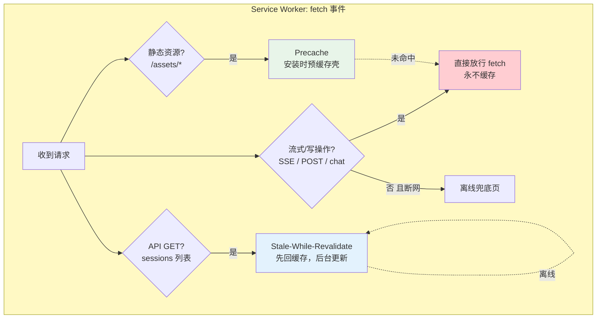
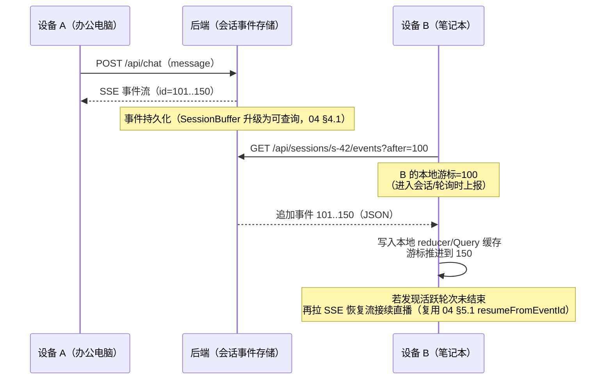
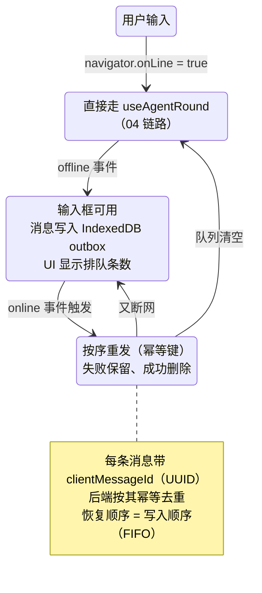
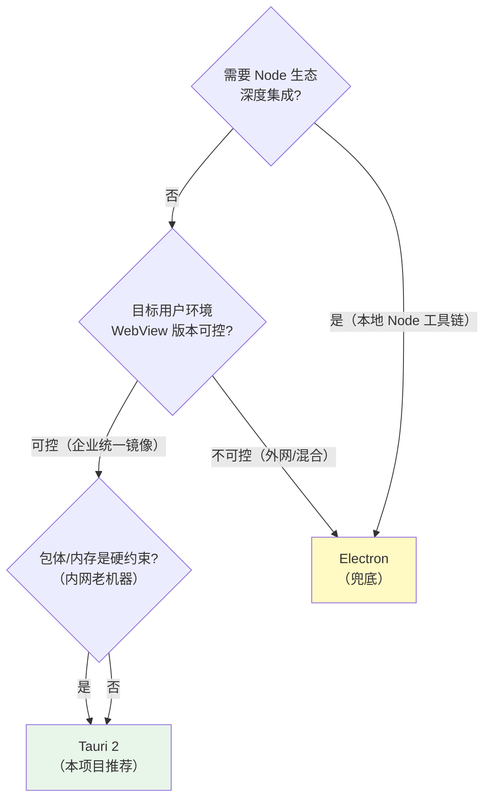

# 项目 04：React Agent 控制台 — 07-进阶迭代二：多端协同与离线

> **定位**：进阶篇第二条线：让控制台突破"单页签在线"的边界——PWA（Service Worker 缓存策略与离线可用）、多端会话同步（BroadcastChannel + 服务端游标）、离线消息队列（断网排队→恢复重发）、桌面端封装（Tauri/Electron 选型）。核心篇 00 §1.3 曾把离线划为非目标，本篇作为进阶里程碑正式解决它。代码为概念 TSX/TS 片段；后端同步端点为**概念契约**（参考后端可照此实现）。
>
> **前置阅读**：已完成 06；[教程 26-React与SSE流式UI §3 断线重连]、[教程 57-多页面流式响应与会话管理 §5 会话广播]
> 「遇到阻塞？→ [教程 19-SSE流式通信 §代理与缓存]、[教程 24 §服务端游标]」

---

## 1. 四问

| 问 | 答 |
|----|----|
| **新增了什么需求** | 高铁/飞机场景离线可用（壳缓存 + 历史只读）；多设备同一账号会话接续、双端同开实时同步；断网期间输入的消息排队、恢复后自动重发（幂等）；桌面应用统一分发（Tauri/Electron） |
| **影响了哪些模块** | 前端：新增 `sw.ts`（Service Worker）、`services/sync.ts`（BroadcastChannel + 游标轮询）、`services/outbox.ts`（IndexedDB 离线队列）、`hooks/useOnlineStatus.ts`；后端（概念）：会话事件追加端点 `GET /api/sessions/{id}/events?after=N`、消息幂等键 `clientMessageId` |
| **架构如何演进** | "连接管理"（04 的 ConnectionManager 管一条流）之上叠加"状态同步"（多端游标对齐）与"离线缓冲"（outbox 模式）两层；后端从"推流"扩展为"推流 + 追赶（catch-up）"双通道 |
| **上一版痛点是什么** | ① 断网 30 秒内能恢复（04），断网 30 分钟只能干瞪眼 ② 两个页签/两台设备各自为政，一边发消息另一边要手动刷新 ③ 弱网时用户输入丢失，重发靠记忆 ④ IT 部门要求"装得像软件"，浏览器书签不满足分发与白名单管理 |

### 1.1 本节核对（四问）

| # | 核对项 | 判据 |
|---|--------|------|
| 1 | 四个痛点与四组交付一一对应 | ①↔PWA 壳、②↔同步两机制、③↔outbox、④↔Tauri |
| 2 | 概念契约有显式标注 | 后端同步端点/幂等键标注为"概念契约" |

## 2. 目标与量化验收

| # | 目标 | 验收 |
|---|------|------|
| 1 | 离线壳可用 | 断网刷新页面，应用壳与会话列表（缓存副本）可见，明确显示"离线模式"横幅 |
| 2 | 双端同步 | 设备 A 发消息，设备 B（同账号同会话）≤ 3 秒出现，无需手动刷新 |
| 3 | 双页签同步 | 同浏览器两个页签，一边新建/删除会话，另一边侧边栏 ≤ 1 秒更新 |
| 4 | 离线排队 | 断网输入 5 条消息→恢复网络→按序自动重发，后端零重复（幂等键） |
| 5 | SSE 不被缓存 | Service Worker 上线后流式输出功能与 04 断线恢复完全不受影响（回归验收） |
| 6 | 桌面可用 | Tauri 打包产物在 macOS/Windows 启动，SSE/离线/同步行为与 Web 一致 |

### 2.1 本节核对（目标与量化验收）

| # | 核对项 | 判据 |
|---|--------|------|
| 1 | 六条验收都有时间/数量阈值 | ≤3s、≤1s、零重复、5 条按序 |
| 2 | 验收 5 明确"SW 不破坏既有能力" | SSE 回归纳入验收（ADR 04-14 验证条款） |

---

## 3. PWA：Service Worker 缓存策略与离线可用

### 3.1 缓存策略：按资源类型分流，SSE 永不进缓存

Service Worker 拦截全局 fetch——**一旦无脑缓存，SSE 与 POST 全部被破坏**（代理缓存是 SSE 的头号杀手，[教程 10 §10.1 Nginx proxy_buffering off] 的浏览器版翻版）。策略必须按资源类型分流：



三类边界一句话：**静态壳 precache（版本化文件名，构建产物指纹天然可缓存）、只读列表 stale-while-revalidate（离线还能看昨天的会话列表，代价是可能短暂过期）、一切流式与写操作直通网络（SSE 的 `text/event-stream` 请求被 SW 缓存 = 灾难）**。

```js
// sw.ts —— 概念代码：分流策略核心（构建产物注册，scope=/）
self.addEventListener('fetch', (event) => {
  const { request } = event;
  const url = new URL(request.url);

  // 1) 流式与写操作：永远放行，绝不缓存（含 SSE：request.destination 无标记，按 Accept 判定）
  if (request.method !== 'GET' || url.pathname.startsWith('/api/chat')) return;
  if (request.headers.get('Accept')?.includes('text/event-stream')) return;

  // 2) 静态壳：precache 优先（安装时已写入 CACHE 前缀）
  if (url.pathname.startsWith('/assets/')) {
    event.respondWith(
      caches.match(request).then(hit => hit ?? fetch(request))
    );
    return;
  }

  // 3) 只读列表 API：SWR——离线时给缓存副本，在线时回缓存同时后台更新
  if (url.pathname.startsWith('/api/sessions') && request.method === 'GET') {
    event.respondWith(
      fetch(request)
        .then(res => { caches.open('api-v1').then(c => c.put(request, res.clone())); return res; })
        .catch(() => caches.match(request).then(hit => hit ?? Response.json({ offline: true }, { status: 503 })))
    );
  }
});
```

### 3.2 离线模式的诚实设计

离线可用 ≠ 假装在线。三件事必须做到：① 全局 `useOnlineStatus`（`navigator.onLine` + `online/offline` 事件）驱动"离线模式"横幅；② 离线时输入框不禁用而是转投离线队列（§5）；③ 缓存数据打上"可能过期"标记（SWR 的 `offline: true` 响应让 Query 层把 `dataUpdatedAt` 判为陈旧）。**宁可诚实地旧，不要自信地错**——这与后端"降级要显式"的原则同构（[教程 63-容错与弹性设计 §降级]）。

### 3.3 本节测试与验证（PWA 与离线壳）

> **前置**：sw.ts 已注册（构建产物生效，Application 面板可见 Service Worker "activated"）；useOnlineStatus 已接入。

| # | 操作 | 预期（PASS 判据） |
|---|------|------------------|
| 1 | DevTools Application → 勾 Offline → 刷新页面 | 应用壳与上次缓存的会话列表可见；显示"离线模式"横幅 |
| 2 | 离线时在输入框发消息 | 输入框不禁用，消息进离线队列，UI 显示"已排队 N 条" |
| 3 | Network 查看 SW 对 `/api/chat`（POST）与 SSE 请求的拦截 | 均直接放行、不进 Cache Storage（三分流判定生效） |
| 4 | Application → Cache Storage | 只有 `/assets/*` 指纹文件与 `api-v1` 里的只读 GET，无任何流式响应 |
| 5 | 取消 Offline 后刷新 | SWR 后台更新，会话列表恢复新鲜 |
| 6 | SSE 回归（关键）：SW 激活后完整复跑 04 §7 回归清单 | 断线 30 秒恢复、去重、取消全部仍 PASS（ADR 04-14 验证条款） |

**失败排查**：离线白屏 → precache 未含 index.html 或 SW 未激活（看 Application→Service Worker 状态）；流式"假死" → SSE/POST 进了缓存，检查 fetch 分流的前两个 return；离线列表 503 且无兜底 → SWR 的 catch 分支没回 caches.match。

---

## 4. 多端会话同步：BroadcastChannel + 服务端游标

### 4.1 两个尺度，两套机制

| 尺度 | 机制 | 理由 |
|------|------|------|
| 同浏览器多页签 | **BroadcastChannel** | 同源页签间毫秒级通知，零后端成本；发"会话列表变了"信号，接收方自行 invalidate |
| 跨设备（多端） | **服务端游标追赶** | 设备间无任何直连通道，唯一真相源是后端；每会话记 `lastEventId`，落后了就补拉 |

跨设备同步的完整时序（设备 B 落后追赶）：



设计要点：

1. **游标与断线恢复共用一套事件 id**——04 的 `resumeFromEventId` 是"一条流内的恢复"，本篇的游标是"任意端任意时刻的追赶"，两者底层都是"按单调 id 补差"，后端只需一个查询端点（概念契约 `GET /api/sessions/{id}/events?after=N`，返回与 SSE 相同的 AgentEvent JSON）。
2. **追赶与直播的衔接**：B 补完历史发现轮次还在进行（最后一个事件不是 `round_end`），切换到 04 的恢复流接口接续直播——"追赶 → 接续"两段式，避免追赶期间直播事件乱序。
3. **触发时机用"进入 + 低频轮询 + 广播信号"三合一**：进入会话必追、`refetchInterval` 30 秒兜底、页签间 BroadcastChannel 收到信号立刻追。**不做长连接推送**（那需要后端广播基建，[教程 24 §5]——参考后端刻意不引入，属项目 14 的微服务主题）。

### 4.2 BroadcastChannel：同源页签的"神经反射弧"

```ts
// services/sync.ts —— 概念代码：页签间信号总线
const channel = new BroadcastChannel('agent-console-sync');

export function notifyTabs(kind: 'sessions-changed' | 'message-appended', sessionId?: string) {
  channel.postMessage({ kind, sessionId, from: Math.random().toString(36).slice(2) });
}

export function onTabSignal(handler: (kind: string, sessionId?: string) => void) {
  channel.onmessage = (e) => handler(e.data.kind, e.data.sessionId);
  return () => { channel.onmessage = null; };
}

// 使用方（如 useSessions 内）：收到 'sessions-changed' → queryClient.invalidateQueries(['sessions'])
// 注意：只传"变了"的信号，不传数据本体——数据永远从服务端拉（服务端是真相源，02 §4.10）
```

BroadcastChannel 的纪律与 Zustand 一致：**传信号不传状态**。若把消息内容直接 postMessage 过去，等于引入了第二个"真相源"，多页签数据分叉只是时间问题。

### 4.3 本节测试与验证（多端与页签同步）

> **前置**：sync.ts 落盘并接入 useSessions；后端已实现（或 mock）`GET /api/sessions/{id}/events?after=N` 概念契约。

| # | 操作 | 预期（PASS 判据） |
|---|------|------------------|
| 1 | 同浏览器开两个页签，A 新建会话 | B 侧边栏 ≤1 秒出现（BroadcastChannel 信号→invalidate） |
| 2 | A 删除会话 | B ≤1 秒消失 |
| 3 | 两个浏览器 profile（或两台机器）同账号：A 发消息，B 停在同一会话 | B ≤3 秒看到新消息（轮询/游标追赶） |
| 4 | B 在 A 轮次进行中进入会话 | B 先补历史事件，再接续进行中的流（追赶→接续两段式，无乱序无重复） |
| 5 | Console 检查 BroadcastChannel 消息体 | 只有 kind/sessionId 信号，无消息内容本体 |

**失败排查**：页签不同步 → channel 名不一致或 onmessage 被覆盖；B 看到重复事件 → 游标推进漏记（补差后未把 lastEventId 更新到最大 id）；追赶乱序 → 未先补完历史就开直播流。

---

## 5. 离线消息队列：断网排队 → 恢复重发

### 5.1 Outbox 模式（前端版）

后端事件驱动架构里的 Outbox 模式（先写库再投递）在前端的镜像：**用户输入先落 IndexedDB，联网后按序投递，投递成功才从队列删除**。它与 04 的 ConnectionManager 是上下两层：ConnectionManager 管"一条流的重试"，outbox 管"消息级"的排队与持久（关掉浏览器也不丢）。



```ts
// services/outbox.ts —— 概念代码：IndexedDB 离线队列（最小封装，生产可换 idb 库）
const DB = 'agent-console';
const STORE = 'outbox';

function openDb(): Promise<IDBDatabase> {
  return new Promise((resolve, reject) => {
    const req = indexedDB.open(DB, 1);
    req.onupgradeneeded = () => req.result.createObjectStore(STORE, { keyPath: 'clientMessageId' });
    req.onsuccess = () => resolve(req.result);
    req.onerror = () => reject(req.error);
  });
}

export async function enqueue(sessionId: string, message: string): Promise<void> {
  const db = await openDb();
  await tx(db, 'readwrite', store =>
    store.put({ clientMessageId: crypto.randomUUID(), sessionId, message, queuedAt: Date.now() }));
}

export async function drain(send: (sessionId: string, message: string, idempotencyKey: string) => Promise<void>): Promise<number> {
  const db = await openDb();
  const all = await tx(db, 'readonly', store => store.getAll()) as OutboxItem[];
  let sent = 0;
  for (const item of all) {                       // FIFO：IndexedDB getAll 按主键序，配合 queuedAt 排序更稳
    await send(item.sessionId, item.message, item.clientMessageId);  // 抛错则停止 drain，保留剩余
    await tx(db, 'readwrite', store => store.delete(item.clientMessageId));
    sent++;
  }
  return sent;
}
```

### 5.2 幂等：重发不重复的契约

重发的消息可能在服务端已处理（发送成功但响应丢失）。**幂等责任在后端**：`ChatRequest` 增加 `clientMessageId`，后端按 `(sessionId, clientMessageId)` 去重——重复请求返回同一轮次的事件流或"已处理"响应，不再触发第二次 LLM 调用（Token 白烧是成本事故，[教程 60-成本治理与Token计量 §2]）。前端只保证：**不猜结果、失败保留、成功才删**。这与 04 的"事件 id 去重"构成完整的双向幂等（服务端对客户端消息幂等，客户端对服务端事件幂等）。

### 5.3 本节测试与验证（离线队列与幂等）

> **前置**：outbox.ts 落盘并接入输入路径；后端 ChatRequest 支持 clientMessageId（概念实现）。

| # | 操作 | 预期（PASS 判据） |
|---|------|------------------|
| 1 | Offline 状态下发送 5 条消息 | UI 显示"已排队 5 条"；DevTools Application→IndexedDB→outbox 有 5 条记录（各带 UUID） |
| 2 | 关闭浏览器重开（仍 Offline） | 队列仍在（IndexedDB 持久，5 条不丢） |
| 3 | 恢复在线 | 按写入顺序自动重发，队列逐步清空至 0 |
| 4 | 构造"发送成功但响应丢失"（后端测试端点模拟超时后重试同一 clientMessageId） | 后端实际消息数=5 而非 10（幂等键生效，无重复 LLM 调用） |
| 5 | drain 中途断网 | 已发成功的删除、剩余保留，恢复后继续 |

**失败排查**：队列丢失 → openDb 未在 upgradeneeded 建对 store 或 keyPath 写错；重发顺序乱 → getAll 后未按 queuedAt 排序；重复处理 → 后端幂等去重未按 (sessionId, clientMessageId) 联合判定。

---

## 6. 桌面端封装：Tauri vs Electron 选型

| 维度 | Tauri 2 | Electron |
|------|---------|----------|
| 渲染内核 | 系统 WebView（macOS WKWebView / Windows WebView2 / Linux WebKitGTK） | 捆绑 Chromium（每应用一份） |
| 安装包/内存 | ~10MB / 低（无独立 Chromium） | ~150MB+ / 高 |
| 主进程语言 | Rust（前端零感知，配置为主） | Node.js（生态复用，团队上手快） |
| 行为一致性 | 依赖用户系统 WebView 版本，碎片风险 | 三平台同一 Chromium，**所见即所得** |
| 企业分发 | 支持代码签名/自动更新（updater 插件） | 成熟（Squirrel/electron-builder） |
| 安全模型 | 默认最小权限（CSP + capability 白名单） | 需手动收紧（contextIsolation 等） |



本项目结论：**Tauri 2**。理由：控制台是纯前端 SPA + REST/SSE（无本地 Node 依赖）；企业内网机器统一镜像、WebView 版本可控；IT 部门对安装包体积敏感。**兜底条件写进决策**：若安全扫描或 WebView 兼容性暴雷（Windows 7 残留 LTSC 无 WebView2），切 Electron——前端代码零改动（Tauri 只是壳，SPA 原样跑在 WebView 里），这就是"壳与内容分离"的直接收益。

### 6.1 本节测试与验证（桌面封装）

> **前置**：`tauri build`（或 `tauri dev`）产物可运行；有 macOS/Windows 目标机。

| # | 操作 | 预期（PASS 判据） |
|---|------|------------------|
| 1 | 启动打包产物 | 冷启动 < 2s，安装包 ~10MB 量级 |
| 2 | 桌面端跑一轮完整对话 | SSE 逐帧输出（WebView 不缓冲） |
| 3 | 桌面端复跑离线壳与双端同步验证（§3.3/§4.3） | 行为与 Web 版一致 |
| 4 | 断网（拔网卡/关 Wi-Fi）再恢复 | 离线横幅与 outbox 行为同 Web |

**失败排查**：桌面端流"憋到结束才吐" → WebView/系统代理缓冲，检查 Tauri WebView 配置与代理设置；冷启动慢 → 首屏 JS 超预算（回查 06 §6.3 门禁）。

---

## 7. ADR 演进决策

### ADR 04-14：Service Worker 只缓存静态壳与只读列表，SSE/写操作直通
- **决策**：precache（`/assets/*`）+ SWR（`GET /api/sessions`）+ 直通（其余一切），三分流在 fetch 事件入口判定
- **备选**：① Workbox 全家桶默认策略——黑盒程度高，出问题难排查；② 不上 SW（纯 Web）——离线壳与弱网首屏没有解
- **取舍理由**：SW 的破坏力与它的能力一样大（一次错误缓存能让 SSE 假死），策略必须显式枚举而非默认；自写 ~40 行 fetch 分流胜过引入黑盒
- **可回滚**：SW 是纯增量能力——注销 `navigator.serviceWorker.getRegistrations()` 并清缓存即回到无 SW 行为，主链路零影响

### ADR 04-15：离线消息用 IndexedDB outbox + 后端幂等键，而非"恢复后让用户手点重发"
- **决策**：断网输入进 IndexedDB FIFO 队列；恢复后自动 drain；每条消息带 `clientMessageId`，后端按其幂等
- **备选**：① 提示"离线，请稍后重试"（把系统问题推给用户）；② 排在内存里（关页签即丢）；③ 恢复后逐条弹确认（10 条消息弹 10 次）
- **取舍理由**：自动重发的前提是幂等，幂等键让"至少一次投递 + 服务端恰好一次处理"成立——与 04 的事件 id 去重构成双向幂等闭环；IndexedDB 换来"关浏览器不丢"这一档可靠性
- **可回滚**：队列读取失败时降级为"显示排队数 + 手动重发"按钮，drain 逻辑独立在 `services/outbox.ts` 不侵入主链路

### ADR 04-16：桌面封装选 Tauri 2，Electron 为兜底
- **决策**：Tauri 2 承载现有 SPA（零前端改动）；触发兜底条件（WebView 不可控/安全扫描不过）时切 Electron
- **备选**：Electron 一步到位；原生开发（Swift/WinUI）——成本完全不成比例
- **取舍理由**：本项目无 Node 本地依赖、企业环境 WebView 可控、体积敏感——三个判定全部指向 Tauri；且壳与内容分离保证切换成本≈重打包
- **可回滚**：见决策本身——兜底路径是决策的一部分，不是事后补救

### 7.1 本节核对（ADR 演进决策）

| # | 核对项 | 判据 |
|---|--------|------|
| 1 | 三条 ADR 均含备选与可回滚路径 | 04-14→注销 SW、04-15→手动重发降级、04-16→Electron 兜底 |
| 2 | ADR 04-14 的验证条款落实 | §3.3 第 6 条（SSE 回归）是该 ADR 的强制配套 |

---

## 8. 全篇回归验证

> 章节级验证已前移（§3.3 PWA/§4.3 同步/§5.3 离线队列/§6.1 桌面）。以下为整体验收对照，依赖各节已 PASS。特别强调：**SW 上线必须带着 04 §7 断线恢复的回归测试**（§3.3 第 6 条）。

**验收对照**：

| 验收项 | 本文 §2 目标 | 关联既有验收 | 状态 |
|--------|------------|-------------|------|
| 离线壳可用 | 断网刷新可见 | —（00 §1.3 非目标→进阶篇转正） | 待实测打钩 |
| SSE 不受 SW 影响 | 04 §7 全表通过 | 04 §7（回归） | 待实测打钩 |
| 双端同步 ≤3s | 游标追赶生效 | 教程 24 §5（广播，本项目用轮询+追赶替代） | 待实测打钩 |
| 离线队列幂等 | 后端零重复 | 04 §5.3（事件去重的对偶） | 待实测打钩 |
| 桌面一致 | Tauri 行为=Web | — | 待实测打钩 |

---

## 9. 当前痛点（驱动下一篇）

应用已能离线、能多端、能装成桌面软件——但内部试点扩到 300 人时来了两批新用户：① 视障员工投诉屏幕阅读器在流式输出时"完全哑火甚至狂叫"（aria-live 用法错误）② 海外分部要求英文/阿拉伯文界面（RTL 布局把现有 CSS 打回原形）。可用性的最后一公里：可访问性与国际化。→ [08-可访问性与国际化.md](08-可访问性与国际化.md)

### 9.1 本节核对（当前痛点）

| # | 核对项 | 判据 |
|---|--------|------|
| 1 | 两个新痛点均可在现版复现 | 开 VoiceOver/NVDA 听流式输出；切 RTL 模拟布局崩坏 |
| 2 | 痛点归属明确 | 全部指向 08 篇主题 |

---

## 10. 总结

| 模块 | 交付物 | 关键点 |
|------|--------|--------|
| PWA | sw.ts 三分流策略 | precache/SWR/直通；SSE 永不缓存；离线诚实降级 |
| 多端同步 | BroadcastChannel（页签）+ 游标追赶（设备） | 传信号不传状态；追赶→接续两段式；复用事件 id 体系 |
| 离线队列 | IndexedDB outbox + clientMessageId 幂等 | 与事件 id 去重构成双向幂等；关浏览器不丢 |
| 桌面 | Tauri 2 + Electron 兜底 | 壳与内容分离；三个判定条件可复核；切换成本≈重打包 |

多端与离线的共同心法：**后端永远是真相源，前端的一切缓存、队列、同步都只是"让等待更体面"的手段**——这与 02 §4.10 的 invalidate 纪律、04 的去重闸门一脉相承。

### 10.1 本节核对（总结）

| # | 核对项 | 判据 |
|---|--------|------|
| 1 | 四行交付物对应四个章节验证 | §3.3/§4.3/§5.3/§6.1 分别覆盖 |
| 2 | §8 验收对照五行全部打钩 | 全部实测通过后才进入 08 篇 |
