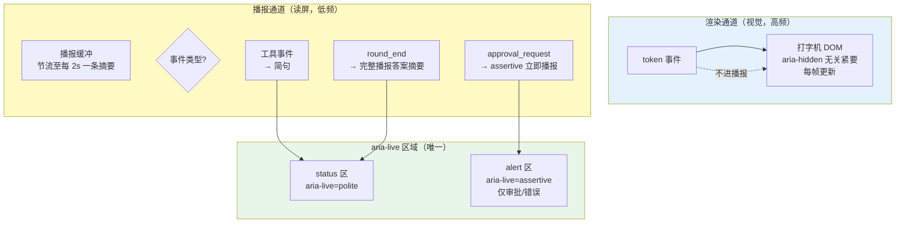
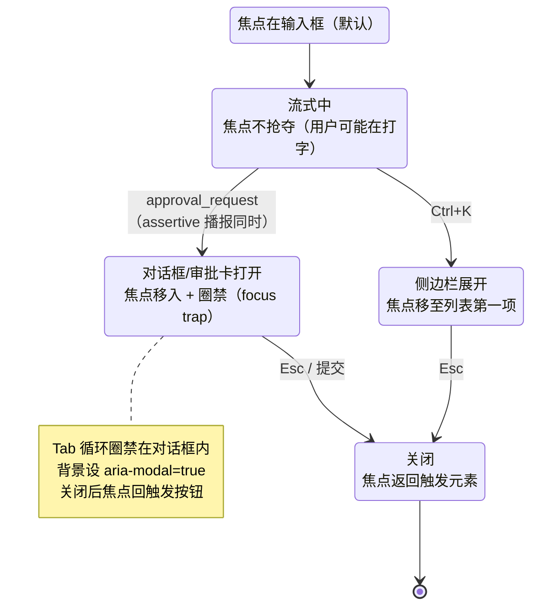
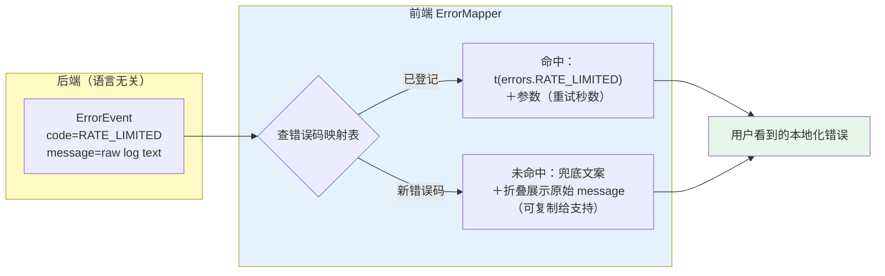

# 项目 04：React Agent 控制台 — 08-进阶迭代三：可访问性与国际化

> **定位**：进阶篇第三条线：把控制台从"多数人能用"做成"所有人都能用"——a11y（键盘导航/屏幕阅读器/焦点管理，重点是流式输出的 aria-live 陷阱）、i18n（文案外置/RTL 布局/多语言后端错误映射）、主题与暗色模式。a11y 不是合规加分项，而是 Agent 前端的产品刚需（视障用户恰恰是语音/文本 Agent 的高频用户）。代码为概念 TSX/CSS 片段；后端零改动（错误码契约已在 00 §6.5 的 `ErrorEvent.code` 预留）。
>
> **前置阅读**：已完成 07；[教程 18-Agentic-UI设计 §3 核心组件设计]
> 「遇到阻塞？→ [教程 15 §3 组件与事件]、[附录 14-Agent交互设计/00-Agent用户体验设计 §流式体验]」

---

## 1. 四问

| 问 | 答 |
|----|----|
| **新增了什么需求** | 全键盘操作（无鼠标完成所有任务）；屏幕阅读器正确播报流式输出（不哑火、不狂叫）；焦点管理（对话框/审批卡出现与关闭时焦点去向明确）；文案全部可切换（中/英/阿）；RTL 布局；暗色模式与系统跟随；后端错误按用户语言本地化 |
| **影响了哪些模块** | 前端：全部交互组件补 aria 属性与键盘事件；`LiveStreamArea` 重构播报策略；新增 `i18n/` 文案层与 `ErrorMapper`；CSS 全面改用设计 tokens 与逻辑属性；后端：零改动（`ErrorEvent.code + params` 契约本来就分离了机器码与人读文案） |
| **架构如何演进** | 文案从"散落组件里的字符串"集中为**带 key 的资源层**；颜色从"散落的色值"集中为**语义 tokens**；播报从"渲染什么读什么"演进为**显式播报通道**（渲染与播报分离） |
| **上一版痛点是什么** | ① 屏幕阅读器面对每秒几十次 DOM 变更要么沉默要么复读机（aria-live 误用）② 只能用鼠标点（审批卡、会话切换无键盘路径）③ 硬编码中文与物理方向 CSS（`margin-left`）使 i18n/RTL 无从谈起 ④ 暗色模式靠 `filter: invert` 的民间偏方，对比度不达标 |

## 2. 目标与量化验收

| # | 目标 | 验收 |
|---|------|------|
| 1 | 全键盘 | 不碰鼠标完成：切会话、发消息、停止、展开工具卡、审批（含拒绝+备注）、切语言、切主题 |
| 2 | 读屏可用 | VoiceOver/NVDA 走查主流程：发送→工具执行→审批→完成，播报完整不重复；token 期间不逐字播报 |
| 3 | 对比度 | 明/暗两套主题下正文对比度 ≥ 4.5:1（WCAG 2.2 AA），交互控件 ≥ 3:1 |
| 4 | i18n 全覆盖 | 界面零硬编码文案（CI 脚本扫描中文/英文裸字符串）；切语言即切（无刷新） |
| 5 | RTL | 阿拉伯文下布局镜像正确（侧边栏、气泡、时间戳、进度条方向），无横向滚动破版 |
| 6 | 错误本地化 | 后端错误（`AGENT_ERROR` 等）按当前语言显示本地化文案，且未知 code 有英文兜底 |

---

## 3. 可访问性：a11y 三大战役

### 3.1 第一战：流式输出的 aria-live 陷阱（本项目最深的坑）

**陷阱本体**：`aria-live` 区域内的 DOM 变化会被屏幕阅读器播报。直觉写法是把打字机输出区设为 `aria-live="polite"`——结果每帧 flush 一次（60 次/秒），读屏软件要么排队复读全部增量（"狂叫"），要么因更新过频放弃播报（"哑火"）。**渲染频率与播报频率必须解耦**：



落地的三个铁律：

1. **打字机区不是 live 区**——视觉用户看的是流动文本，读屏用户听的是**里程碑摘要**："正在回答（已生成 200 字）"、"调用工具：查订单，用时 1.2 秒，成功"、"回答完成，共 3 段"。信息量对等，频率差三个数量级。
2. **一个 polite + 一个 assertive，全应用仅此两个 live 节点**——多个 live 区会互相踩踏播报队列；assertive 只留给审批与致命错误（打断当前播报是重侵害，不能滥用）。
3. **播报内容是"文本摘要"而非 DOM 引用**——摘要由 reducer 状态派生（工具卡片数、字数、完成态），与渲染组件解耦，方便单测。

```tsx
// components/Announcer.tsx —— 概念代码：双通道播报区（应用根部唯一）
import { useEffect, useRef } from 'react';

function Announcer({ status, urgent }: { status: string; urgent: string | null }) {
  // aria-atomic: 每次整体替换播报，避免增量拼接；role=status/alert 自带隐式 live
  return (
    <>
      <div role="status" aria-live="polite" aria-atomic="true" className="sr-only">{status}</div>
      <div role="alert" aria-atomic="true" className="sr-only">{urgent}</div>
    </>
  );
}
export default Announcer;
```

### 3.2 第二战：键盘导航（roving tabindex）

会话列表、工具卡片组、审批卡都是"列表中选一个"的交互，用 **roving tabindex**（游走焦点）：容器 `role="listbox"`，只有焦点所在项 `tabIndex=0`，其余 `-1`；方向键移动焦点（同时把 `activeDescendant` 概念落实为 `aria-activedescendant` 或真焦点移动二选一，本项目选真焦点移动——虚拟化列表（06 §3）里 DOM 不存在，activedescendant 反而难做）。

| 快捷键 | 动作 | 说明 |
|--------|------|------|
| `Ctrl/Cmd+K` | 聚焦会话搜索 | 全局命令入口 |
| `↑/↓` | 在会话列表/工具组内移动 | roving tabindex |
| `Enter` | 选中/发送 | — |
| `Esc` | 关闭对话框/退出编辑 | 焦点返回触发器 |
| `Ctrl/Cmd+.` | 停止生成 | 高频操作给快捷键（对应"停止"按钮） |

### 3.3 第三战：焦点管理（出现、消失、返回）



两条最容易漏的规则：① **新内容出现不抢焦点**（流式输出、工具卡片弹出时焦点留在输入框——抢焦点会让正在打字的用户"丢字"）；② **对话框关闭必回焦**（回到打开它的按钮，否则焦点掉回 body，读屏用户瞬间"迷路"）。审批卡是两者的混合体：**视觉上不抢焦（浮层），播报上 assertive，键盘上 `Ctrl+.` 之外的 Tab 顺序自然到达**——HITL 的可达性直接决定审批是否真的"human"（[教程 28-Human-in-the-Loop与审批流 §前端形态]）。

---

## 4. 国际化：文案、方向、错误三件套

### 4.1 文案外置与切换

```ts
// i18n/index.ts —— 概念代码：轻量 i18n（不引库的底线实现；生产可换 i18next）
import zh from './zh.json';
import en from './en.json';
import ar from './ar.json';

const bundles = { zh, en, ar } as const;
export type Locale = keyof typeof bundles;

let current: Locale = (navigator.language.slice(0, 2) as Locale) in bundles
  ? navigator.language.slice(0, 2) as Locale : 'zh';

export function t(key: string, params?: Record<string, string | number>): string {
  let text: string = bundles[current][key] ?? bundles.en[key] ?? key;   // 兜底链：当前→英文→key 本身
  for (const [k, v] of Object.entries(params ?? {}))
    text = text.replaceAll(`{${k}}`, String(v));                        // {n} 占位替换（复数用 Intl.PluralRules）
  return text;
}

export function setLocale(locale: Locale) {   // 切换：改状态 → 全树重渲染（key 变更驱动，无刷新）
  current = locale;
  document.documentElement.lang = locale;                     // 读屏发音引擎跟随（漏设则读屏用错 TTS）
  document.documentElement.dir = locale === 'ar' ? 'rtl' : 'ltr';
  emitLocaleChanged();
}
```

配套纪律：**日期/数字/复数一律 `Intl`**（`Intl.DateTimeFormat`/`Intl.NumberFormat`/`Intl.PluralRules`），禁止手写"3 条消息"这类拼接；**CI 扫描裸字符串**（正则扫 JSX 文本节点中的 CJK/拉丁句子），把"硬编码文案"变成红灯而不是 code review 的自觉。

### 4.2 RTL：物理属性全面换逻辑属性

RTL 的正确做法不是给阿拉伯文写一套镜像 CSS，而是**从一开始就不用物理方向**：

| 物理写法（RTL 下必错） | 逻辑写法（自动镜像） |
|----------------------|---------------------|
| `margin-left: 8px` | `margin-inline-start: 8px` |
| `padding-right: 16px` | `padding-inline-end: 16px` |
| `text-align: left` | `text-align: start` |
| `left: 0`（侧边栏定位） | `inset-inline-start: 0` |
| `border-right: 1px` | `border-inline-end: 1px` |

两个例外要显式处理：① **打字机光标动画方向**（视觉细节，`dir` 属性感知）；② **时间轴/进度条**（时间流逝在所有文化里都用 LTR 表示，进度条 `direction: ltr` 固定）。代码块同理——`<pre>` 强制 `dir="ltr"`，否则含代码的回答在阿语界面里反人类。

### 4.3 多语言后端错误映射

后端 `ErrorEvent` 的契约（00 §6.5）是 `code + message + recoverable`——**`message` 是给日志看的英文机器文案，`code` 才是给用户看的**。前端按 code 映射本地化文案，未知 code 走兜底：



**为什么不在后端直接返回多语言文案**：后端不知道用户语言（Accept-Language 不可靠且穿透缓存）、错误文案会随语言增加而膨胀后端发布频率、且 message 里可能带技术细节不宜直出。错误码是机器契约、本地化是表现层——分层与"前端不做脱敏"（ADR 04-08）同理：**责任单一化，边界即契约**。

---

## 5. 主题与暗色模式

### 5.1 语义 tokens：颜色从不裸奔

CSS 变量承载**语义**（`--color-bg`、`--color-text-primary`），组件只消费语义名。主题切换 = 换一套变量赋值，组件零改动：

```css
/* theme.css —— 概念代码：语义 tokens 双主题 */
:root {                                  /* 亮色（默认） */
  --color-bg: #ffffff;
  --color-text-primary: #1a1a1a;         /* 对比度 16:1 */
  --color-accent: #1a56db;
}
[data-theme="dark"] {
  --color-bg: #0f1115;
  --color-text-primary: #e8e8e8;         /* 对比度 14:1，双双超过 AA 4.5:1 */
  --color-accent: #6f9bff;
}
@media (prefers-color-scheme: dark) {    /* 未显式选择时跟随系统 */
  :root:not([data-theme]) { /* 同 dark 一组变量 */ }
}
```

```tsx
// ThemeToggle 概念代码：三态切换（light / dark / system）
setTheme(mode: 'light' | 'dark' | 'system') {
  const resolved = mode === 'system'
    ? matchMedia('(prefers-color-scheme: dark)').matches ? 'dark' : 'light'
    : mode;
  document.documentElement.dataset.theme = resolved;   // data-theme 驱动变量组
  localStorage.setItem('theme-choice', mode);          // 显式选择优先于系统跟随
}
```

两个必须处理的边角：① **FOUC 防闪**——`<head>` 内联三行脚本在首帧渲染前设好 `data-theme`（否则暗色用户每次刷新被白屏闪一下，是 CLS 之外的"体验炸弹"）；② **流式光标与代码高亮**的暗色适配（光标动画颜色、`<pre>` 语法高亮主题随 tokens 走）。

### 5.2 对比度是验收指标不是审美

工具卡片状态色（running/success/error）在数据可视化场景容易翻车：暗色下一味求"高级灰"会让 success 绿几乎不可见。用对比度检查器（浏览器 DevTools 内置）对**明暗两套 × 全部语义色**逐项过 ≥3:1（控件）/ ≥4.5:1（正文）——写进 06 §6 的性能预算表同款门禁（a11y 分数进 Lighthouse CI，目标 ≥ 95）。

---

## 6. ADR 演进决策

### ADR 04-17：流式播报走独立 Announcer 双通道，打字机区不设 aria-live
- **决策**：全应用唯一 `role=status`（polite）+ 唯一 `role=alert`（assertive）；播报内容由 reducer 状态派生摘要（里程碑级），与渲染 DOM 解耦
- **备选**：① 打字机区直接 `aria-live="polite"`（复读机/哑火双坑）；② 每 token `aria-live="off"` 结束后手动聚焦（打断用户）；③ 引读屏专用"完整回答"开关（把问题推给用户）
- **取舍理由**：渲染 60Hz 与播报 0.5Hz 的频率差是三个数量级，物理上就不该同一条通道；摘要策略让视障用户获得的信息结构（里程碑）反而比逐字流更清晰
- **可回滚**：Announcer 是纯增量组件，移除即回到无播报状态，主链路零影响

### ADR 04-18：i18n 自研轻量层 + 后端只发错误码
- **决策**：`t(key, params)` + 三语言包 + `Intl` 全家；后端 `ErrorEvent.code` 为唯一机器契约，前端映射本地化；未知 code 英文兜底＋原始 message 折叠可复制
- **备选**：① i18next 全家桶（框架、生态、体积都强，但本项目文案规模 <300 key，自研 40 行够用且零依赖）；② 后端按 Accept-Language 返回多语言 message（语言不可靠、缓存穿透、发布耦合）
- **取舍理由**：文案外置的核心价值是"key 化 + 兜底链 + CI 扫描"，这三点 40 行就能立住；错误码分层让前后端各自演进（呼应 ADR 04-01 契约先行）
- **可回滚**：`t()` 是唯一文案出口，未来迁 i18next 只改这一层；后端契约不动

---

## 7. 测试与验证

**测试方法**：

1. **键盘走查**：拔掉鼠标（或把手从鼠标拿开），按 §3.2 快捷键表完整走一遍主流程（含审批拒绝+备注）——任何一步卡住即记 bug。
2. **读屏走查**：macOS 开 VoiceOver（`Cmd+F5`），从进入会话到完成一轮带工具+审批的对话，逐条记录播报内容；检查 token 期间无逐字播报、审批触发 assertive 即时播报。
3. **axe 扫描**：axe DevTools 对主界面跑自动扫描，violations 目标 0（自动扫不出的靠 1/2 的人工走查补）。
4. **Lighthouse a11y**：≥95 分，进 CI。
5. **伪语言测试**：切到"en-XA"式超长伪语言（把文案替换为加长 40% 的假串），检查布局不破——提前暴露德语式长词的破版。
6. **RTL 走查**：切阿拉伯文：侧边栏镜像、气泡镜像、`<pre>` 保持 LTR、进度条 LTR、无横向滚动条。
7. **裸文案扫描**：CI 正则扫描 JSX 中文/英文裸字符串，0 发现。
8. **对比度**：DevTools 对明暗两套全部语义 tokens 逐项检查（§5.2 阈值）。

**验收对照**：

| 验收项 | 本文 §2 目标 | 关联既有验收 | 状态 |
|--------|------------|-------------|------|
| 全键盘 | §3.2 快捷键表全流程 | — | 待实测打钩 |
| 读屏 | 播报完整且不逐字 | 00 §1.1"过程透明"的读屏版 | 待实测打钩 |
| 对比度 | AA 达标（明/暗） | 06 §6 门禁同入口（Lighthouse CI） | 待实测打钩 |
| i18n | 零硬编码（CI=0） | ADR 04-01（key 即契约） | 待实测打钩 |
| RTL | 镜像正确不破版 | — | 待实测打钩 |
| 错误本地化 | 未知 code 有兜底 | 00 §6.5 ErrorEvent 契约 | 待实测打钩 |

---

## 8. 当前痛点（收束进阶篇）

a11y 与 i18n 落地后，控制台在"工程完备性"上已经闭环：性能、多端离线、无障碍、国际化——但回望 00 §1.1 的用户抱怨清单，行业在 2026 年又往前走了两步：生成式 UI（Agent 直接生成界面组件）、分钟级长任务的异步交互范式。这些前沿方向是否纳入本项目、以什么姿势纳入，需要一份"决策台账 + 前沿地图"来收束。→ [09-ADR架构决策记录.md](09-ADR架构决策记录.md)

---

## 9. 总结

| 模块 | 交付物 | 关键点 |
|------|--------|--------|
| a11y | Announcer 双通道 + roving tabindex + 焦点状态机 | 渲染与播报解耦；live 节点全应用仅两个；不抢焦/关闭回焦 |
| i18n | t() 轻量层 + Intl 全家 + 逻辑属性 CSS | key 化 + 兜底链 + CI 扫描；RTL 是"从不写物理属性"的自然结果 |
| 错误本地化 | ErrorMapper | 后端只发 code；机器契约与表现层分离 |
| 主题 | 语义 tokens 双主题 | data-theme + prefers-color-scheme；FOUC 内联脚本；对比度进门禁 |

a11y 与 i18n 的共同本质是**把"默认用户"的假设拆掉**：看不见的、听不见的、说中文的、从右往左读的——每拆掉一个假设，架构就多一层显式契约。这正是它们看似"外围"、实则最锻炼架构思维的的原因。
