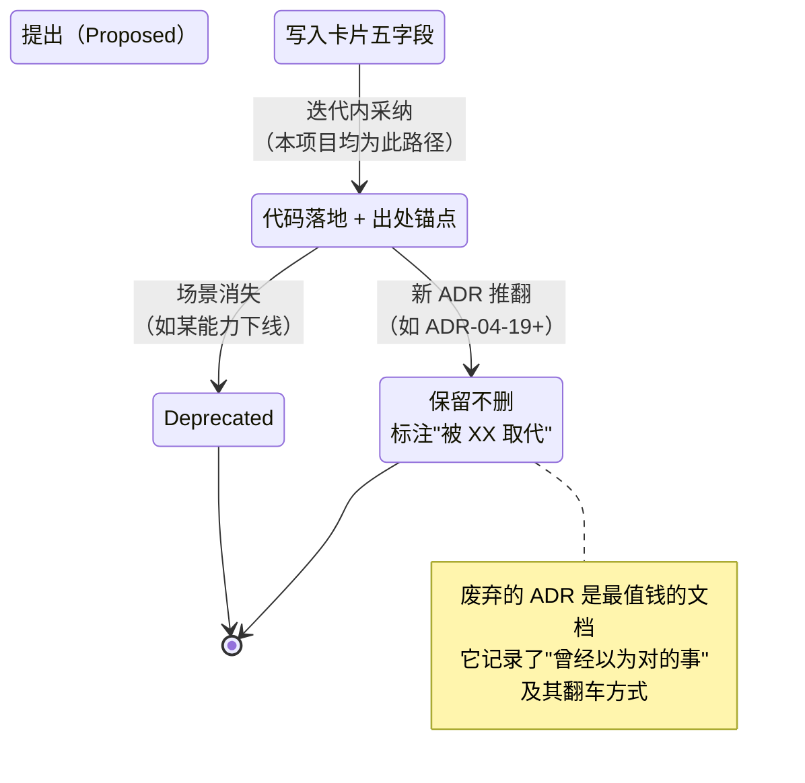
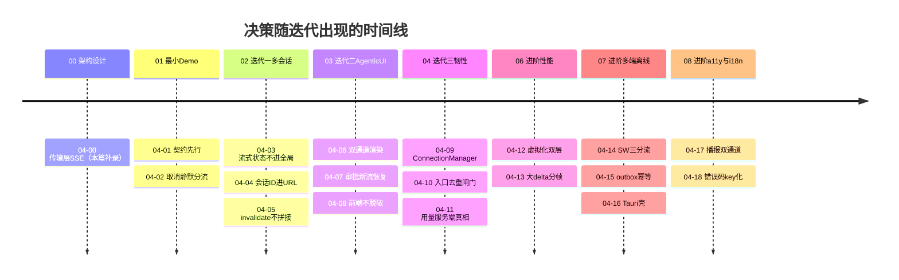
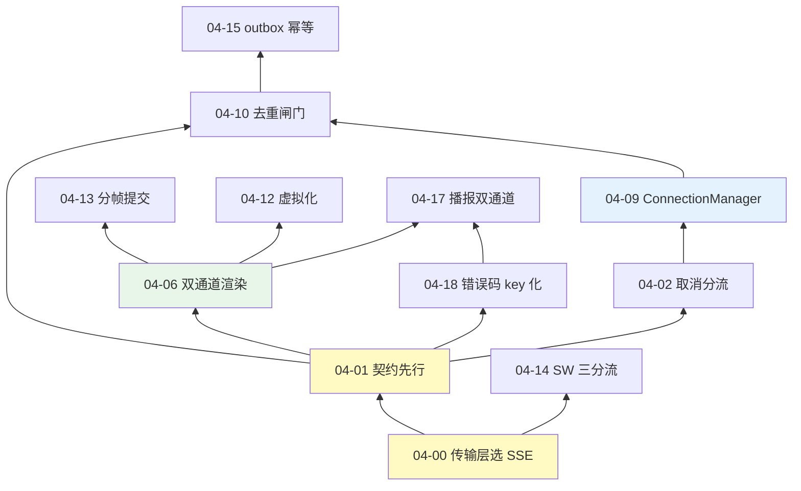

# 项目 04：React Agent 控制台 — 09-ADR 架构决策记录（全量台账）

> **定位**：项目 04 全部架构决策的集中台账——把散落在 00-08 各篇的 19 条 ADR（04-00 ~ 04-18）按统一格式（上下文/决策/备选/取舍/可回滚）汇总，并补录奠基决策（传输层 SSE vs WebSocket 的回溯补录）。用途：① 新成员 15 分钟读懂"这个前端为什么长这样"；② 每条决策都有回滚路径——**架构师改主意的成本，是架构能力的直接度量**。格式与方法论锚定 [附录 07-架构决策方法论/00-ADR架构决策记录]。
>
> **前置阅读**：建议读完 01-08 再看本篇（决策卡片大量引用迭代上下文）；急于了解全貌也可先读 §3 台账总表再按需回查。
> 「遇到阻塞？→ [附录 07-架构决策方法论/00-ADR架构决策记录 §格式]、[教程 88-Agent架构反模式与避坑指南]」

---

## 1. 四问

| 问 | 答 |
|----|----|
| **新增了什么需求** | 决策可追溯（每个"为什么"有出处）、可复核（备选与判定条件显式化）、可回滚（改主意的路径与成本预先评估）；新成员可快速建立决策全景 |
| **影响了哪些模块** | 不改代码——影响的是**认知结构**：把线性迭代叙事重构为"决策域"视图；后续任何大改动先在本台账增补 ADR（含推翻旧 ADR 的 supersede 记录） |
| **架构如何演进** | 从"决策散落在各篇 ADR 小节"演进为"单一台账 + 各篇详述"双层结构；补录 ADR 04-00 补齐传输层这一最底层决策的空白 |
| **上一版痛点是什么** | ① 决策散落 8 篇文档，找"SSE 为什么不是 WebSocket"要翻 00 §2 选型表 + 01 §4.3 + 教程 17 三处 ② 各篇 ADR 小节格式不一（有的只有决策+理由，没有备选与回滚）③ 前沿方向（10 篇）要引入新决策时，没有"已决策边界"可对照 |

### 1.1 本节核对（四问）

| # | 核对项 | 判据 |
|---|--------|------|
| 1 | 三个痛点均被本篇解决 | 台账汇总/五字段统一/已决策边界（§3 总表） |
| 2 | "不改代码只改认知结构"成立 | 本篇无任何代码交付，全部为文档结构 |

## 2. ADR 格式与生命周期

本台账的每张卡片五个字段：**上下文**（什么压力迫使决策）、**决策**（选了什么）、**备选**（放弃了什么——没有备选的决策不叫决策叫冲动）、**取舍**（为什么）、**可回滚**（推翻它要动哪里、代价多大）。状态机：

**本项目 19 条 ADR 全部处于 Accepted 状态**——这不代表它们都永远正确，而是"尚未遇到足够大的压力去推翻"。§7 的回滚演练就是预先演习"什么压力会推翻哪条决策"。

### 2.1 本节核对（格式与生命周期）

| # | 核对项 | 判据 |
|---|--------|------|
| 1 | 能说出五字段及各自作用 | 上下文/决策/备选/取舍/可回滚 |
| 2 | 能说出状态机四态 | Proposed → Accepted → Superseded/Deprecated |

## 3. 台账总表（19 条）

| # | 决策一句话 | 出处 | 回滚成本 |
|---|-----------|------|---------|
| 04-00 | 传输层选 SSE 而非 WebSocket（回溯补录） | 本篇 §4 卡 1 | 中（传输抽象在一层函数内） |
| 04-01 | v1 起后端即吐 AgentEvent JSON，契约先行 | 01 §6 | 高（协议重写） |
| 04-02 | 取消走 AbortController，AbortError 静默分流 | 01 §6 | 低 |
| 04-03 | 流式状态不进全局 store（reducer 本地承载） | 02 §5 | 中（状态迁移） |
| 04-04 | activeSessionId 放 URL 而非 Zustand | 02 §5 | 低 |
| 04-05 | 流结束 invalidate 重拉，不本地拼接 | 02 §5 | 低（本地拼接是诱惑） |
| 04-06 | 轮次状态机 useReducer；token 与工具双通道 | 03 §6 | 中 |
| 04-07 | 审批恢复走新流，不挂长连接等审批 | 03 §6 | 低（后端补广播即可，但那是项目 14 主题） |
| 04-08 | 前端不做脱敏（安全责任后端单一化） | 03 §6 | 低（加过滤易，但原则不该破） |
| 04-09 | 连接管理独立成 class（ConnectionManager） | 04 §6 | 低 |
| 04-10 | 去重闸门在事件入口，reducer 保持纯函数 | 04 §6 | 低 |
| 04-11 | 用量走 Query 服务端状态，前端不本地累计 | 04 §6 | 低 |
| 04-12 | 长列表虚拟化窗口（网络分页 + 渲染窗口双层） | 06 §7 | 低（content-visibility 降级开关） |
| 04-13 | 大 delta 提交走 startTransition 分流 | 06 §7 | 极低（阈值调 Infinity） |
| 04-14 | SW 三分流缓存，SSE/写操作永不缓存 | 07 §7 | 低（注销 SW） |
| 04-15 | 离线消息 IndexedDB outbox + 幂等键 | 07 §7 | 低（drain 独立模块） |
| 04-16 | 桌面封装 Tauri 2，Electron 兜底 | 07 §7 | 极低（壳与内容分离） |
| 04-17 | 流式播报独立 Announcer 双通道 | 08 §6 | 低（纯增量组件） |
| 04-18 | i18n 轻量自研 + 后端只发错误码 | 08 §6 | 低（t() 唯一出口） |

### 3.1 本节测试与验证（台账完整性）

> **前置**：01-08 各篇已读毕（或对照原文可查）。

| # | 操作 | 预期（PASS 判据） |
|---|------|------------------|
| 1 | 数总表行数 | 恰好 19 条（04-00 ~ 04-18），无缺号无跳号 |
| 2 | 逐行核对"出处"列指向的篇章 ADR 小节 | 每条在出处篇目真实存在且一句话表述一致 |
| 3 | 逐行核对"回滚成本"与出处篇"可回滚"字段 | 成本评级与回滚路径描述不矛盾（如 04-13 极低↔阈值调 Infinity） |

**失败排查**：条数不足 → 有篇目 ADR 未入账（最易漏 04-00 补录条）；出处对不上 → 编号在演进中被改动，需双向修正。

## 4. 十一张决策卡（按决策域分组）

### 卡 1｜传输层：SSE vs WebSocket —— ADR 04-00（回溯补录）

- **上下文**：对话流的传输层选型发生在 00 §2 选型表，但当时只写了"fetch+RS 而非 EventSource"（客户端 API 层面），传输层本身的对比散落在教程里，未成正式 ADR。对话是"请求一次、服务端长时单向推"的形态。
- **决策**：HTTP SSE（`text/event-stream`）承载事件流；请求本体走 POST（携带 sessionId/message/resumeFromEventId）。
- **备选**：① WebSocket——全双工、二进制帧、低开销；② gRPC 双向流——强类型、HTTP/2 多路复用；③ WebTransport/HTTP/3——最新但基建不成熟。
- **取舍**：本项目数据流**单向下行为主**（上行只有用户消息与审批，低频，REST 足够）；SSE 复用整个 HTTP 基建（网关、鉴权头、Nginx、代理、压缩策略），WebSocket 需要独立的升级链路与心跳/重连语义（且经过企业代理常被掐）；事件本就是 JSON 文本，不需要二进制帧的省带宽优势。**"不需要双向"是决定性判据**——一旦需要服务端读中断信号或客户端心跳帧，就要重新评估（见 §7 演练）。
- **可回滚**：传输被封装在 `services/sse.ts` 的 `streamChat()` 单一函数内（03 §5.2 已支持 url 参数），上层 `ConnectionManager`/reducer 只认 `onEvent/onDone/onError` 回调——换 WebSocket 只改这一层实现，契约（AgentEvent）不变。

### 卡 2｜契约先行：事件协议是单一事实源 —— ADR 04-01（+04-18 的错误码）

- **上下文**：v1 只需要 token，最直觉的做法是后端吐裸文本、前端当字符串渲染。
- **决策**：从 v1 起后端返回 `Flux<ServerSentEvent<AgentEvent>>`（sealed interface，00 §6.5），前端按 `type` 可辨识联合解析；`ErrorEvent` 只含机器 `code`，文案本地化归前端（04-18）。
- **备选**：v1 吐裸文本、迭代二再升级协议；前端各自定义事件类型。
- **取舍**：迭代二接 thought/tool 事件时**前端零改动**（01 §6 原话）；TS 联合类型 + Java sealed 双端穷尽检查，协议漂移在编译期暴露。错误码同构：机器契约与人类文案分离，两端独立演进。
- **可回滚**：协议变更走 `protocolVersion` 协商（04 §5.3 的 426 分支已是回滚的一半）——旧前端拒绝新事件类型的降级路径在 [教程 18 §6]。

### 卡 3｜三层状态分工：Zustand / TanStack Query / 本地 reducer —— ADR 04-03 + 04-04 + 04-05

- **上下文**：多会话上线后状态爆发：会话列表、历史、流式中间态、布局偏好——全塞 useState 必然失控（02 §1 四问之"useState 拥挤"）。
- **决策**：按**所有权与频率**分三层——客户端全局状态（Zustand：布局/最近会话）、服务端状态（Query：sessions/messages/quota）、轮次本地状态（useReducer：连接状态机/token/工具卡）；`activeSessionId` 特批进 URL（04-04）；流结束 invalidate 而非本地拼接（04-05）。
- **备选**：全进 Zustand（连坐渲染）；全进 Query（流式高频写缓存抖动）；本地 setQueryData 乐观拼接（多页签不一致）。
- **取舍**：三层各按其性——Zustand 管"客户端拥有"、Query 管"服务端拥有（缓存/失效/重试白送）"、reducer 管"高频瞬态"；URL 是最古老的全局状态（深链接/前进后退免费）。**判别式一句话：这份数据重启浏览器后还该存在吗？归谁拥有？变了多频繁？**
- **可回滚**：层间靠 queryKey 与 selector 解耦，任何一层可独立替换（如 Query → SWR）而不动组件树。

### 卡 4｜流式渲染：双通道 + 分帧 —— ADR 04-06 + 04-13

- **上下文**：token 每秒 20-80 个、工具事件每轮个位数，但最初都走同一个 dispatch 通道。
- **决策**：token 走 ref 缓冲 + rAF 批量 flush；工具/思考事件直接 dispatch；大 delta（≥800 字符）再分流进 startTransition（04-13）；历史段落 memo 冻结（06 §4.2）。
- **备选**：统一缓冲（工具卡延迟出现的怪异感）；统一直发（主线程打满）；全 Transition（打字机迟滞）。
- **取舍**：**背压只施加在高频源上**——与后端 Reactor 对快生产者加 buffer 的判断标准同构（[教程 12-背压与流量控制]）。
- **可回滚**：阈值是常量；通道选择集中在 `wireEvents` 一个函数内。

### 卡 5｜断线韧性：恢复、重连、去重三件套 —— ADR 04-02 + 04-09 + 04-10

- **上下文**：地铁 30 秒断线 = 整轮报废（Token 白烧）；意外断线与用户取消混淆；重放与原流重复。
- **决策**：事件 id 单调递增 + 服务端缓冲区重放（04 §4.1）；重连状态机独立成 `ConnectionManager` class（04-09：跨渲染生命周期 + 可单测）；`e.id <= currentLastEventId` 闸门在事件入口而非 reducer（04-10：reducer 必须纯函数）；AbortError 静默分流（04-02）。
- **备选**：EventSource 原生重连（不支持 POST）；重试逻辑写在 Hook 里（不可单测）；reducer 判重（引入外部可变状态）。
- **取舍**：至少一次投递 + 消费端幂等——与后端消息队列的语义承诺完全一致（[教程 24 §4]）。
- **可回滚**：MAX_RETRIES/BASE_DELAY 是构造参数；去重闸门是 onEvent 里的一行守卫，删掉即回到"可能重复"（不推荐）。

### 卡 6｜HITL 恢复：新流而非长挂 —— ADR 04-07

- **上下文**：审批可能几分钟到几小时，SSE 连接挂着等不现实（代理超时、连接成本）。
- **决策**：流终止于 `awaiting_approval`；审批 REST 提交后走 `/api/chat/resume/{roundId}` 新流恢复（03 §4.5）。
- **备选**：长连接挂起等审批（超时/成本）；轮询审批状态（延迟与请求量双输）。
- **取舍**：把"等待"从连接层挪到存储层（PendingApprovalStore）——连接是稀缺资源，状态不是。
- **可回滚**：若后端具备广播能力（[教程 24 §5]），可改为审批完成即时推送——但参考后端刻意不做广播（那是项目 14 的微服务主题，项目独立铁律）。

### 卡 7｜安全边界：前端不做脱敏 —— ADR 04-08

- **上下文**：工具参数展示时"前端再过滤一道"看似更安全。
- **决策**：展示后端发来的（已脱敏）args；安全责任后端单一化；前端过滤只是纵深防御补充。
- **备选**：前端黑名单过滤（伪安全：浏览器代码可被绕过，攻击者直接看网络包）。
- **取舍**：安全责任若分散在两端，等于每端都可被单独绕过；后端漏发敏感参数的正确响应是修后端 + 检测告警，不是给前端打补丁（[附录 08-Agent安全深度/02-数据泄露防护]）。
- **可回滚**：不可回滚（原则性决策）——但可在前端加"检测到疑似敏感键则告警上报"的观测补充。

### 卡 8｜成本可见性：服务端计量是唯一真相 —— ADR 04-11

- **上下文**：配额展示需要 token 数；前端本地累计看似省一次请求。
- **决策**：`GET /api/quota/me` + 轮次结束 invalidate；本地零累计。
- **备选**：前端按 token 事件累计（与后端计量漂移——重连去重、恢复重放都会算重）。
- **取舍**：成本数据参与预算控制（>90% 变红），漂移的数据比没有更危险（[教程 60-成本治理与Token计量 §2]）。
- **可回滚**：不可回滚（真相源唯一）；"离线时显示缓存值+可能过期标记"（07 §3.2）是展示层妥协，不改变真相源归属。

### 卡 9｜长列表渲染：虚拟化双层 —— ADR 04-12

- **上下文**：万级消息会话 DOM 过载（06 §3.1）。
- **决策**：网络层分页（useInfiniteQuery）+ 渲染层窗口化（自研 VirtualizedHistory）双层有界；行高缓存校准 + 滚动锚定。
- **备选**：全量渲染（v4 现状）；`content-visibility: auto`（不减少 React mount 成本）；直接上 TanStack Virtual。
- **取舍**：自研吃透行高校准/滚动锚定两个真难点（学习目标）；生产切换 TanStack Virtual 只换容器实现。
- **可回滚**：content-visibility 一行 CSS 降级开关常驻。

### 卡 10｜多端与离线：SW 三分流 + outbox 幂等 + 壳内容分离 —— ADR 04-14 + 04-15 + 04-16

- **上下文**：离线/多端/桌面三个新诉求同时到达（07 §1）。
- **决策**：SW 只缓存静态壳与只读列表（SSE/写操作直通）；离线消息 IndexedDB outbox + `clientMessageId` 幂等（与事件 id 去重构成**双向幂等**）；桌面 Tauri 2 壳与内容分离，Electron 兜底。
- **备选**：Workbox 默认策略（黑盒）；内存排队（关页签即丢）；让用户手动重发（把系统问题推给用户）；Electron 一步到位（体积/内存双输且无 Node 依赖需求）。
- **取舍**：SW 的破坏力与能力对等——缓存策略必须显式枚举；自动重发的成立前提是幂等；壳与内容分离让桌面选型几乎零成本可逆。
- **可回滚**：三条各自独立可拆（注销 SW / 停用 drain / 重打包），互不牵连。

### 卡 11｜无障碍与国际化：播报分离 + key 化 + 逻辑属性 —— ADR 04-17 + 04-18

- **上下文**：读屏在流式输出下哑火或狂叫；硬编码中文与物理方向 CSS。
- **决策**：渲染通道与播报通道解耦（Announcer 双节点）；文案全部 key 化 + 兜底链 + CI 扫描；CSS 全面逻辑属性（RTL 自然成立）；对比度进门禁。
- **备选**：打字机区直接 aria-live（频率差三个数量级，物理上不成立）；后端多语言文案（语言不可靠、缓存穿透）；给阿语写一套镜像 CSS（维护双份必然漂移）。
- **取舍**：a11y/i18n 的本质是拆掉"默认用户"假设——每个假设的拆除都换来一层显式契约（08 §9）。
- **可回滚**：Announcer 纯增量组件；t() 是唯一文案出口（迁 i18next 只改一层）。

### 4.1 本节核对（十一张决策卡）

| # | 核对项 | 判据 |
|---|--------|------|
| 1 | 每张卡五字段齐全 | 上下文/决策/备选/取舍/可回滚逐卡检查（卡 7/8 标"不可回滚"也算显式交代） |
| 2 | 11 张卡覆盖台账 19 条 | 04-00~04-18 每条都出现在某张卡内，无遗漏 |
| 3 | 抽两条卡复述备选与判定 | 如卡 1 的"不需要双向是决定性判据"、卡 3 的三层判别式 |

---

## 5. 决策时间线与依赖图

决策不是孤立的——后面的决策站在前面的肩膀上，也受前面决策的约束：

读图三个要点：① **契约先行（04-01）是最大出度节点**——渲染、错误、播报、幂等全部建立在事件协议之上，这是"协议比代码长寿"的直接体现；② **传输层（04-00）是最大入度被依赖节点**——SW 缓存（04-14）的正发性来自"SSE 是普通 HTTP 请求"这一性质；③ 虚拟化（04-12）与播报（04-17）都依赖双通道渲染（04-06）的频率分层思想——一个思想在不同维度的复用。

### 5.1 本节核对（时间线与依赖图）

| # | 核对项 | 判据 |
|---|--------|------|
| 1 | 时间线八行与 00-08 篇对应 | 每条 ADR 出现的篇目与其出处一致 |
| 2 | 依赖图边可解释 | 任意抽一条边（如 A10→A15）能说出依赖理由 |

## 6. ADR 与教程锚点对照（决策的可追溯性）

| 决策域 | ADR | 主要教程/附录锚点 |
|--------|-----|------------------|
| 传输与消费 | 04-00/02/09/10 | [教程 19-SSE流式通信]、[教程 17 §1/§3] |
| 契约与协议 | 04-01/18 | [教程 18 §2]、[教程 28-流式工具调用与事件协议] |
| 状态架构 | 04-03/04/05/11 | [教程 25-React状态管理 §3-§5]、[教程 27 §2] |
| 渲染性能 | 04-06/12/13 | [教程 17 §4]、[教程 81-Agent性能优化] |
| HITL | 04-07 | [教程 18 §5]、[教程 61-Human-in-the-Loop与审批流] |
| 安全 | 04-08 | [附录 08-Agent安全深度/02-数据泄露防护] |
| 多端离线 | 04-14/15/16 | [教程 24 §4-§5]、[教程 63-容错与弹性设计] |
| a11y/i18n | 04-17/18 | [附录 13-Agent交互设计/00-Agent用户体验设计] |

### 6.1 本节核对（教程锚点对照）

| # | 核对项 | 判据 |
|---|--------|------|
| 1 | 八行锚点覆盖全部 19 条 ADR | 每个 ADR 编号都出现在某行 |
| 2 | 锚点真实存在 | 教程/附录锚点与 docs 实际篇目对得上 |

## 7. 回滚演练：两条最可能被推翻的决策

**演练 1：什么压力会推翻 ADR 04-00（SSE → WebSocket）？** 触发条件：出现真正的双向低延迟需求——如"用户在流式中途打字影响 Agent 行为"（实时意图信号）、或服务端需要客户端心跳帧穿透严格代理。回滚路径：重写 `services/sse.ts` 内部为 WS 实现（回调签名不变）→ `ConnectionManager` 的重试语义对齐 WS 断连码 → 事件 id 与缓冲区重放机制**原样保留**（它们与传输无关）。预估改动：1 个文件重写 + 1 个文件微调，契约零变化——这就是当初"传输收敛在单一函数"的回报。

**演练 2：什么压力会推翻 ADR 04-05（invalidate 重拉 → 本地拼接）？** 触发条件：轮次极高频（秒级连发）且后端历史接口延迟高，invalidate 的额外请求成为体验瓶颈。回滚路径：`round_end` 时改用 `setQueryData` 本地拼接 + 多页签用 07 §4 的 BroadcastChannel 信号互推 invalidate——**注意这会重新引入短暂不一致窗口**，需在 ADR 04-19 中显式记录"用一致性换延迟"的取舍。这是典型的"旧决策被新基建改变前提"：BroadcastChannel 在 02 决策时还不存在。

### 7.1 本节测试与验证（回滚演练）

> **前置**：演练是纸面推演 + 最小代码验证，不要求真推翻决策。

| # | 操作 | 预期（PASS 判据） |
|---|------|------------------|
| 1 | 在工程里确认 `streamChat` 是传输唯一收口 | 全局搜索 `fetch(`：流式相关只出现在 services/sse.ts；上层只依赖 onEvent/onDone/onError 回调（演练 1 回滚路径的前提成立） |
| 2 | 找出 MAX_RETRIES/BASE_DELAY 与 800 阈值的定义位置 | 均为常量/构造参数，改动不牵连结构（卡 4/5 可回滚声明成立） |
| 3 | 纸面推演：为演练 2 写出 ADR 04-19 草稿（五字段） | 能完整写出触发条件、取舍与不一致窗口的显式记录 |

**失败排查**：搜索发现流式 fetch 散落多处 → 传输未收口，演练 1 的"1 个文件重写"前提不成立，先重构收口。

---

## 8. 下一步

决策台账收束了"已做的选择"；最后一篇回答"下一步该看什么"——2026 年 Agent 前端的工业前沿（生成式 UI、长任务异步范式、RUM 前端可观测）与本项目 v5+ 演进路线。→ [10-工业前沿与演进方向.md](10-工业前沿与演进方向.md)

### 8.1 本节核对（下一步）

| # | 核对项 | 判据 |
|---|--------|------|
| 1 | 台账三项验证（§3.1/§4.1/§7.1）PASS | 台账完整、卡片齐全、回滚前提成立后才进 10 篇 |
| 2 | 指向唯一 | 下一动作 = 读 10 篇前沿收官 |

---

## 9. 总结

| 视角 | 交付 |
|------|------|
| 台账 | 19 条 ADR 全量汇总（04-00 补录 + 04-01~04-18），五字段统一格式 |
| 结构 | 11 张决策卡按决策域分组（传输/契约/状态/渲染/韧性/HITL/安全/成本/性能/多端/a11y） |
| 可视化 | 生命周期状态机 + 时间线 + 依赖图——三种视角还原决策全景 |
| 演练 | 两条最可能被推翻的决策 + 预演回滚路径与代价 |

架构师写 ADR 的终极目的不是记录历史，而是**让未来的自己有据可依地改变主意**——每条"可回滚"字段，都是写给未来的一次预演。

### 9.1 本节核对（总结与全篇回归）

| # | 核对项 | 判据 |
|---|--------|------|
| 1 | 四行交付对应本篇四个验证节 | §3.1 台账/§4.1 卡片/§5.1 图/§7.1 演练 |
| 2 | 全篇回归 | §3.1 + §4.1 + §6.1 + §7.1 全部 PASS，台账可作为 10 篇决策边界的对照基线 |
