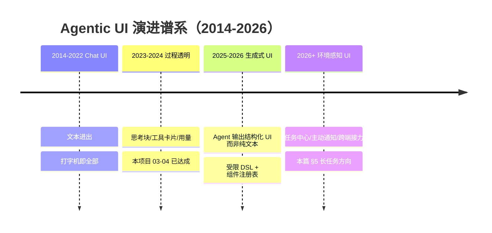
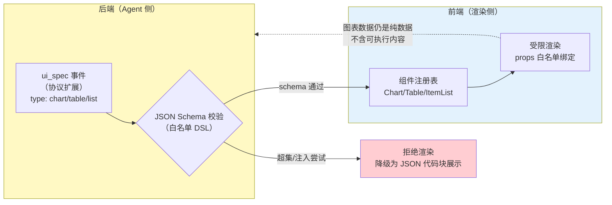
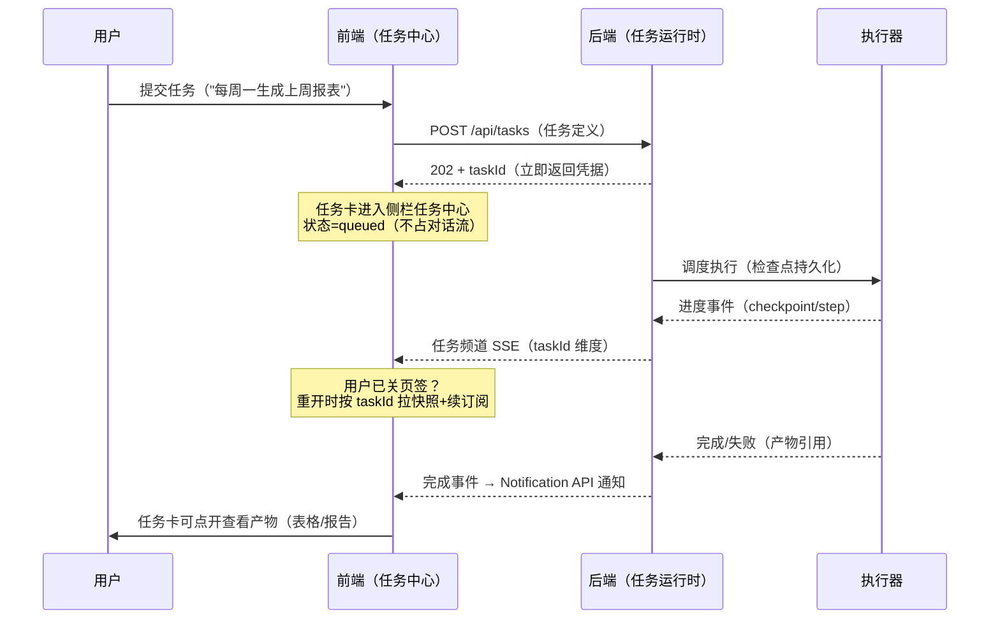

# 项目 04：React Agent 控制台 — 10-工业前沿与演进方向（收官）

> **定位**：项目 04 的收官篇——把 00-09 已建成的控制台放到 2026 年 Agent 前端的工业坐标系里：Agentic UI 的演进谱系（工具进度/审批卡/生成式 UI）、多模态输入、长任务异步 UI 范式、前端可观测性 RUM，并给出 v5+ 演进路线。本文是"地图"不是"教程"：每个方向给判断框架与最小落地路径，深入实现回到对应教程锚点。引用两份真实行业来源：Google Cloud《Five guides to building and scaling production-ready AI agents》（https://cloud.google.com/blog/topics/developers-practitioners/five-guides-to-building-and-scaling-production-ready-ai-agents ）与 PagerDuty 工程博客《Production AI agents: closing the gaps between idea and reality》（https://www.pagerduty.com/eng/production-ai-agents-closing-the-gaps-between-idea-and-reality/ ）。
>
> **前置阅读**：建议读完 00-09（本文站在全部成果之上展望）；至少读过 [教程 26-React与SSE流式UI]、[教程 27-Agentic-UI设计]。
> 「遇到阻塞？→ [教程 18 §4 生成式 UI]、[教程 83-长任务持久化与中断恢复]、[教程 31-全链路可观测性]」

---

## 1. 四问

| 问 | 答 |
|----|----|
| **新增了什么需求** | 对齐行业共识的"生产级 Agent"标准（可观测/HITL/成本/护栏/长任务）；评估四个前沿方向的引入时机：生成式 UI、多模态输入、长任务异步 UI、前端 RUM |
| **影响了哪些模块** | 不立即改代码——产出 v5+ 演进路线与每个方向的引入判据；生成式 UI 与长任务 UI 一旦引入将新增事件类型（协议演进）与任务中心组件（结构演进） |
| **架构如何演进** | 从"对话控制台"演进为"任务工作台"：会话流（已有）+ 任务列表（新增）双主体；前端从"纯消费者"演进为"可观测的一等公民"（RUM 与后端 OTel 对齐） |
| **上一版痛点是什么** | ① 09 的决策台账回答了"已做的选择"，但没有回答"行业在往哪走、我们何时跟" ② 00 §1.1 的五条用户抱怨全部解决后，下一批抱怨来自能力边界：界面是死的（不能按数据生成）、任务一长体验就断（刷新即失忆的异步版） |

### 1.1 本节核对（四问）

| # | 核对项 | 判据 |
|---|--------|------|
| 1 | 本篇定位清楚 | 地图而非教程：给判断框架与引入判据，不立即改代码 |
| 2 | 两个来源真实可溯 | Google Cloud 与 PagerDuty 两文链接在文中给出 |

## 2. 行业基准：两份来源的交集

两份 2025-2026 年的生产级 Agent 工程文献，观点高度收敛（以下为两文交集，逐条给出本项目对应状态）：

| 行业共识 | 出处要点 | 本项目现状（00-09） | 缺口 |
|---------|---------|--------------------|------|
| 可观测性是一等公民 | Google 五指南之"observability"；PagerDuty 强调 production gap 首先是"看不见" | 后端全链路 Span（教程 22 锚点）；前端 TTFT 埋点（04 §5.8）、性能 RUM（06 §6） | 前端错误/体验数据未与后端 traceId 打通（§6） |
| HITL 与审批不可省 | 两文都指出 autonomy 需分级、高风险动作需 human gate | ApprovalCard + 新流恢复（03）+ a11y 审批可达（08） | 多级审批/升级链（项目 06 金融主题，刻意不做） |
| 成本与用量透明 | Google"cost management"；PagerDuty 讲 unit economics | QuotaPanel + 服务端计量（04） | 按轮次成本归因展示（教程 27 已讲，前端可加） |
| 护栏与安全边界 | 两文均列 prompt injection/工具滥用为首要风险 | 后端脱敏单一化（ADR 04-08） | 前端注入面收敛（工具参数展示不可执行，见 §4 红线） |
| 长任务异步化 | PagerDuty 明确"minutes-long tasks need async patterns" | 无（本项目轮次以秒-分钟计） | 本篇 §5 的核心前沿方向 |

**一句话坐标**：本项目已在"生产可用"基线之上，四个前沿方向中生成式 UI 与长任务异步 UI 是下一个版本的候选，多模态与 RUM 打通是补齐项。以下逐一展开。

### 2.1 本节核对（行业基准对照）

| # | 核对项 | 判据 |
|---|--------|------|
| 1 | 五行共识"本项目现状"列均能指认真实出处 | 如 QuotaPanel→04、TTFT 埋点→04 §5.8、RUM→06 §6 |
| 2 | 缺口列与后文方向一一对应 | traceId 打通→§6、长任务→§5、注入面→§4 红线 |

## 3. Agentic UI 演进谱系：本项目站在第三阶段门口

工具进度与审批卡（本项目已有的部分）是第二阶段的成熟形态——[教程 18 §3] 的 ThoughtBlock/ToolCard/ApprovalCard 三件套正是该阶段的标准解。**第三阶段生成式 UI 的分水岭在于：回答不再只是"文本 + 预制卡片"，而是 Agent 按数据语义即时组装界面**（查到 5 个订单就生成一张对比表格 + 一张趋势图，而不是把 JSON 糊进文本里）。Google 五指南中"evaluating agents"与 PagerDuty 的"UX must reflect agent uncertainty"共同指向同一判断：**生成式 UI 的价值不在炫技，而在于把结构化结果从"读文本"降为"看界面"的认知成本压缩**。

### 生成式 UI 的安全管线（为什么必须是受限 DSL）

[教程 18 §4.3 安全红线] 的结论在 2026 年没有变：绝不让 LLM 输出直接变成 DOM。管线必须是：

三条红线（前端侧的落地检查点）：① DSL 是**封闭枚举**（chart/table/list），不是"任意组件名"——注册表外的 type 一律拒绝；② 组件 props 走**白名单绑定**（`data`/`columns`），永不透传 `dangerouslySetInnerHTML` 类通道；③ 拒绝不是静默——降级为可读的 JSON 展示并上报（护栏要有可见性，呼应 PagerDuty 的 guardrail observability）。与 ADR 04-08"安全责任后端单一化"的分工：**后端负责不生成越界 spec，前端负责越界 spec 渲染不出来——两端各守一道，但任何一端被绕过都不致命**。

### 3.1 本节测试与验证（生成式 UI 安全管线，v5 预演）

> **前置**：本篇为演进预案，验证对象是"引入判据与红线检查点"，可在现版工程上先做判据度量与红线纸面推演；DSL 管线落地属 v5。

| # | 操作 | 预期（PASS 判据） |
|---|------|------------------|
| 1 | 度量引入判据：统计最近 100 轮回答中结构化结果（表格/多字段对比）占比 | 得到具体百分比，与 30% 阈值比较（判据数据化） |
| 2 | 纸面推演红线 ①：列出 ui_spec 的 type 白名单 | 封闭枚举（chart/table/list），注册表外 type 的处置 = 拒绝渲染 |
| 3 | 检查现版代码中是否存在 `dangerouslySetInnerHTML` 或任意组件名渲染 | 现版为零（红线 ② 的存量检查） |
| 4 | 推演红线 ③：构造一个注入尝试的 ui_spec（如 type 带 onclick 属性） | 设计的校验层应拒绝并降级为 JSON 代码块 + 上报事件 |

**失败排查**：判据无数据 → 先在 perf.ts 埋"结构化结果占比"再评估；白名单难封闭 → 回查 [教程 18 §4.3 安全红线] 的注册表设计。

## 4. 多模态输入：从"打字"到"贴图说话"

用户行为已经走在前面：截图贴进对话框问"这个报错什么意思"。前端的最小增量（协议层面给 `ChatRequest` 加附件数组，渲染层面给输入区加上传）：

| 关注点 | 方案 | 锚点 |
|--------|------|------|
| 上传交互 | 粘贴/拖拽/选择三入口；预览缩略图；大文件分片 + 进度 + 可取消（复用 AbortController 纪律） | [教程 17 §1.2] |
| 协议 | `ChatRequest` 增加 `attachments[]`（id/mime/size）；事件回推 `attachment_processed` | 00 §6.5 演进位 |
| 后端 | Spring AI 多模态消息构造（UserMessage + Media）与 OCR/视觉模型路由 | [教程 91-多模态Agent开发] |
| 内存 | 附件预览懒加载 + 虚拟化协同（06 §5.2 三板斧已覆盖） | 06 §5.2 |

判断框架：**多模态输入的 ROI 取决于"你的用户问题里有多少是截图/文件形态"**——内部运维/研发场景（报错截图、日志文件）ROI 极高；纯知识问答场景可推迟。不为了"2026 年了该有"而加。

### 4.1 本节核对（多模态输入）

| # | 核对项 | 判据 |
|---|--------|------|
| 1 | 四个关注点各有方案与锚点 | 上传交互/协议/后端/内存，锚点列无空缺 |
| 2 | 判据可度量 | 截图/文件类问题占比有统计口径，不为赶时髦而加 |

## 5. 长任务异步 UI：分钟级任务的正确姿势

PagerDuty 文中最直接的工程判断：**分钟级任务不能占用"请求-流式响应"的心智模型**——浏览器会刷新、页签会关、连接会断。异步范式是"提交-凭据-进度-通知"四段：

与现有架构的衔接点（几乎全部复用，这是演进成本低的证据）：任务频道是**第二个 SSE 流**（`ConnectionManager` 可复用，凭据从 sessionId 换成 taskId）；任务卡的状态机复用 03 §5.3 reducer 的模式；持久化与检查点语义在后端（[教程 83-长任务持久化与中断恢复 §检查点]）；"关页签重开续订"正是 07 §4 游标追赶的又一应用。**新增的本质只有一件事：把"会话"与"任务"拆成两个一等实体**——对话流负责"说"，任务中心负责"做"。

### 5.1 本节核对（长任务异步 UI）

| # | 核对项 | 判据 |
|---|--------|------|
| 1 | 四段范式完整 | 提交-凭据-进度-通知，时序图四段俱全 |
| 2 | 复用声明可指认 | ConnectionManager/reducer/游标追赶分别对应 04/03/07 篇真实交付 |
| 3 | 引入判据明确 | >5 分钟任务且用户需离开页面 |

## 6. 前端可观测性 RUM：让前端进入全链路

06 §6 已建性能两层指标；前沿补齐的是**前后端 traceId 对齐**——用户报"慢"时能一键定位是前端渲染、网络、还是后端 LLM 排队：

| 层 | 采集 | 对齐机制 |
|----|------|---------|
| 请求 | TTFT/错误率/重连次数（04/06 已有埋点） | 发送消息时生成 `X-Trace-Id` 头随 `POST /api/chat` 上行；后端 OTel 采样将其并入 trace（[教程 22 §3 传播]） |
| 体验 | INP/CLS（06 §6 RUM 通道） | 事件按 traceId 关联——Lighthouse 分数差的会话能拉出对应后端 Span 时长 |
| 会话 | 轮次级事件流水（token 速率/工具卡数量/审批耗时） | 与后端 `gen_ai.*` 语义约定指标（[教程 22 §gen_ai 语义约定]）同维度聚合 |

**隐私红线先于指标**：RUM 上报**绝不包含 prompt/回答内容**（只报长度与计时）——这与后端 Observation 的脱敏纪律（`log-prompt` 默认关）对齐，前端是同一纪律的第二执行点。

### 6.1 本节测试与验证（RUM traceId 打通，v5 预演）

> **前置**：06 §6 perf.ts 埋点已就绪；后端 OTel 采样可用（教程 22 锚点）。

| # | 操作 | 预期（PASS 判据） |
|---|------|------------------|
| 1 | 发送消息时在请求头注入 `X-Trace-Id`（uuid）并 DevTools 查看 | 请求头携带该值；后端日志/Span 可见同一 traceId（一次端到端打通验证） |
| 2 | 用该 traceId 在后端追踪系统查询 | 能拉出本次轮次的完整 Span 链（chat→LLM→工具） |
| 3 | 检查 perf.ts 上报 payload | 只含计时/长度/指标，零 prompt/回答内容（隐私红线） |

**失败排查**：后端看不到 traceId → 传播头命名与后端 OTel 提取器配置不一致（回查教程 22 §3）；上报含内容 → 埋点字段越界，回查隐私红线。

## 7. v5+ 演进路线（建议）

| 版本 | 主题 | 引入判据（何时做） | 主要锚点 |
|------|------|-------------------|---------|
| v5 | 生成式 UI | Agent 输出中结构化结果（表格/图表）占比 > 30% | [教程 18 §4] |
| v5 | RUM 打通 | 用户"慢"的投诉无法定位归因 | [教程 22 §3] |
| v6 | 长任务中心 | 出现 >5 分钟的任务且用户需要离开页面 | [教程 83] |
| v6 | 多模态输入 | 截图/文件类问题占比可观 | [教程 91] |
| v7 | 任务协作（共享/指派） | 多人围绕同一任务协作的 组织诉求出现 | [教程 09-多Agent协作]（仅前端协作面） |

每个方向的"引入判据"比方向本身更重要——**前沿不是待办清单，是条件触发的预案**。判据不满足时引入，只会得到复杂度；满足时不引入，才会丢竞争力（呼应 [教程 88-Agent架构反模式与避坑指南 §过度设计]）。

### 7.1 本节核对（v5+ 演进路线）

| # | 核对项 | 判据 |
|---|--------|------|
| 1 | 五行均有引入判据与锚点 | 每行判据可观测/可统计，锚点真实 |
| 2 | 判据口径与各方向章节一致 | §3 的 30%、§4 的占比、§5 的 5 分钟、§6 的"慢投诉"逐一对齐 |

## 8. 收官

项目 04 到此完整收官。回望从 00 到 10 的全程：

- **00** 定义了"企业内部知识助手需要一个配得上它的前端"这个朴素需求，划定了三层状态、契约先行两条主轴；
- **01-04** 用四轮迭代走完"能对话 → 多会话 → 看得见过程 → 断线不断念想"的核心链路，每一步都是上一版真实痛点的答案；
- **05** 复盘六个设计决策，把"这样写"升华为"为什么这样写"；
- **06-08** 三条进阶线把控制台推向千锤百炼：性能与门禁、多端与离线、无障碍与国际化——工程完备性的最后三块拼图；
- **09** 把全部选择装进可追溯、可回滚的决策台账；
- **10**（本文）把控制台放回行业坐标系，交出条件触发的演进预案。

这个项目从头到尾坚持了一条主线：**前端不是后端的展示层，而是 Agent 与人类之间的契约工程**——事件协议、状态分层、播报通道、幂等队列，每一个抽象都是契约。全部代码由你手写完成，文档只负责让你在写每一行之前知道"为什么"。最后用 05 篇末的同一个标准检验学习成果：**不看文档，能对任何一个方向（包括本文的四个前沿）独立说出备选方案、判定条件与回滚路径**——做到这一点，你收获的就不是"一个 React 项目"，而是"一套 Agent 前端的架构判断力"。项目 04 到此结束，不带任何未兑现的承诺。

### 8.1 本节测试与验证（收官自测）

> **前置**：00-09 全部完成且各篇验证节 PASS。

| # | 操作 | 预期（PASS 判据） |
|---|------|------------------|
| 1 | 合上全部文档，复述四个前沿方向各自的备选/判据/回滚 | 生成式 UI（DSL 红线）、多模态（ROI 判据）、长任务（四段范式）、RUM（traceId+隐私）逐一说清 |
| 2 | 合上文档复述 09 台账两条回滚演练 | SSE→WS 与 invalidate→本地拼接，均含触发条件与改动范围 |
| 3 | 抽查一个已落地决策（如 04-10）说出备选与纯函数理由 | 能独立讲出，不翻文档 |

**失败排查**：任一条说不清 → 回对应篇目（§3.1/§5.1/§6.1 或 09 §4/§7）重读，再看本节复测。

---

## 9. 总结

| 方向 | 核心判断 | 引入判据 |
|------|---------|---------|
| 生成式 UI | 受限 DSL + 注册表，安全管线两端各守一道 | 结构化结果占比 > 30% |
| 多模态输入 | ROI 取决于截图/文件类问题占比 | 占比可观 |
| 长任务异步 UI | 会话与任务拆成两个一等实体；连接/状态机/追赶全部复用 | 出现 >5 分钟任务且需离开页面 |
| RUM 打通 | traceId 上行对齐后端 OTel；隐私红线先于指标 | "慢"无法归因时 |

行业来源：Google Cloud《Five guides to building and scaling production-ready AI agents》https://cloud.google.com/blog/topics/developers-practitioners/five-guides-to-building-and-scaling-production-ready-ai-agents ；PagerDuty《Production AI agents: closing the gaps between idea and reality》https://www.pagerduty.com/eng/production-ai-agents-closing-the-gaps-between-idea-and-reality/ 。

### 9.1 本节核对（总结与全篇回归）

| # | 核对项 | 判据 |
|---|--------|------|
| 1 | 四行核心判断与 §3-§6 四章一一对应 | 判断/判据两列无漂移 |
| 2 | 全篇回归 | §2.1 基准对照 + §7.1 路线核对 + §8.1 收官自测全部 PASS，项目 04 收官 |
