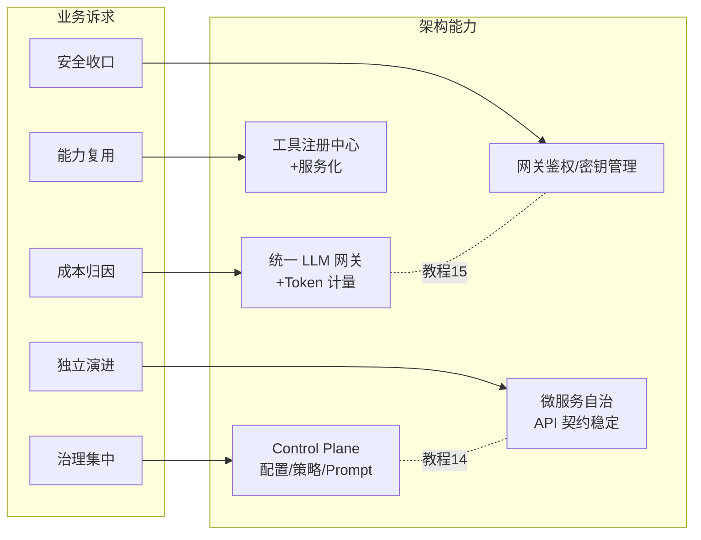
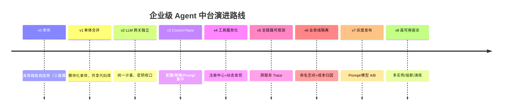
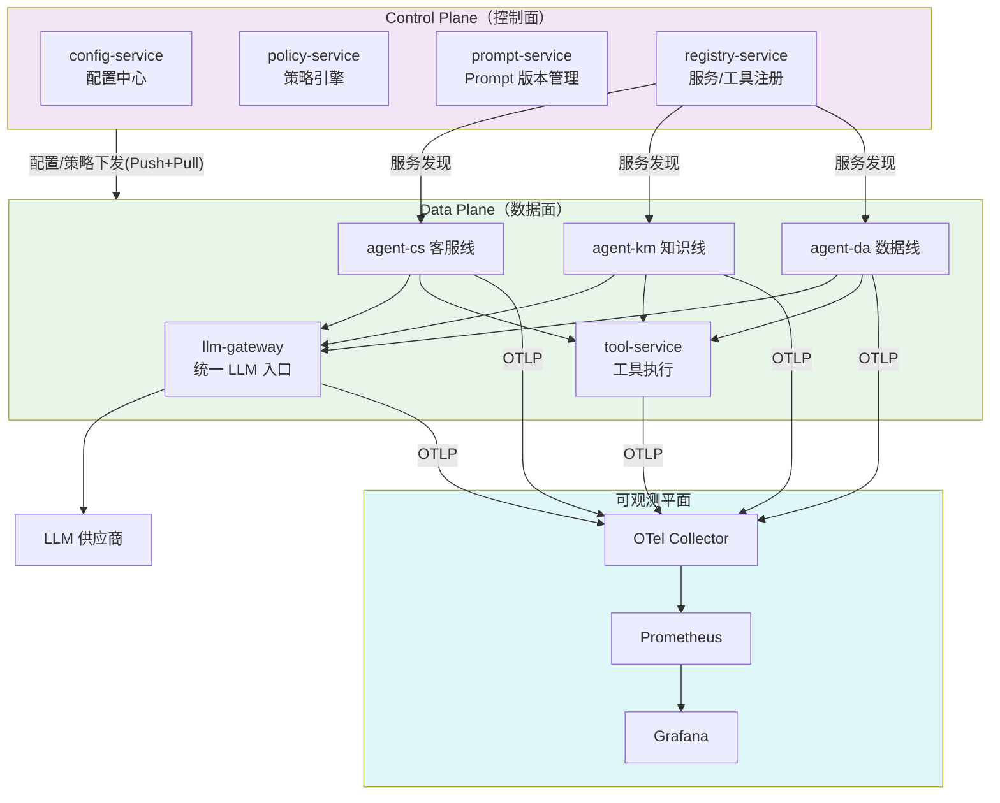

# 项目 05：企业级 Agent 中台 — 00-需求分析与架构设计

> **定位**：本文是项目 05 的起点——一个集团级 Agent 中台从单体演进到管控分离微服务体系的完整架构设计。项目 05 是**完整独立**的项目，不依赖也不引用项目 00-04 的任何内容。**本项目的核心使命：把教程 14（管控分离）与教程 15（微服务拆分）从"知识"变成"演进决策"。**
>
> 「遇到阻塞？→ [教程 20-管控分离架构]、[教程 21-微服务拆分与Agent部署]、[教程 32-模型路由与降级]、[附录 08-架构决策方法论/00-ADR架构决策记录]」

---

## 1. 业务场景

### 1.1 背景

某集团（员工 2 万+，三条核心业务线）各自上了 AI：

| 业务线 | 现状 | 规模 |
|--------|------|------|
| 客服中心 | 独立 Agent 应用，处理咨询/工单 | 5000 会话/天 |
| 知识管理部 | 独立 RAG 问答应用，内部文档 | 2000 问答/天 |
| 数据分析部 | 独立 Text2SQL 应用 | 500 查询/天 |

三个应用由三个团队在六个月内分别搭建——技术栈一致（都是 Spring AI），但架构上是**三座烟囱**：各自对接 LLM API（三份 Key、三套计量）、各自维护工具（重复实现"查订单"）、各自的会话存储、各自的（不完整的）可观测。

### 1.2 集团 CTO 办公室的需求（原始诉求）

1. **成本归因**："三条业务线 AI 花了多少钱说不清，预算无法分配"——需要统一计量、按业务线归因
2. **安全收口**："三个团队三种密钥管理方式，审计无法过"——需要统一网关收口
3. **能力复用**："客服的查订单工具，数据分析部要用得重新实现"——需要工具服务化
4. **治理集中**："Prompt 想统一改，要找三个团队排期"——需要配置/策略集中管理
5. **独立演进**："客服明天要上新功能，不能等中台排期"——业务线保持自治

### 1.3 需求到架构能力的映射

这就是本项目的演进终点：**Control Plane（治理）+ Data Plane（执行）分离的多微服务中台**。

### 1.4 非目标

- 不做多租户 SaaS（业务线内所有用户共享，租户概念止步于业务线——对外 SaaS 是另一个项目的问题域）
- 不做 Agent 业务逻辑（业务线自理，中台只提供能力）
- 不做前端（消费方是业务线的后端/前端，中台提供 API）

---

## 2. 演进路线总设计（本项目的灵魂）

**核心纪律：禁止一上来就给最终版架构。** 每一步拆分都必须由真实的痛点驱动，且每个迭代回答四问：新增了什么需求、影响了哪些模块、架构如何演进、上一版痛点是什么。

**为什么是这个顺序**（顺序本身就是架构决策）：

| 顺序 | 决策理由 | 反面（先做什么会怎样） |
|------|---------|----------------------|
| 先合并单体再拆 | 必须先让三团队在一个代码库里建立模块边界，否则拆分时边界是拍脑袋 | 直接拆微服务——边界错误率极高，拆完再改边界成本翻十倍 |
| 网关先于控制面 | 网关解决的是最疼的"成本+安全"，且是数据面纯技术问题，见效快 | 先建控制面——没有数据面收口，控制面下发的策略无处执行 |
| 工具服务化在网关后 | 工具服务化的前提是网络鉴权模式已在网关定型 | 先做工具注册——鉴权模式一变全返工 |
| 可观测在拆分后 | 跨服务 Trace 只有在服务边界确定后才有意义 | 拆分前建设——拆分时埋点位置全部作废 |
| 灰度/高可用最后 | 它们是"稳定运行"的保障，前提是架构已稳定 | 演进期上灰度——被灰度的对象天天变，无意义 |

## 3. 目标架构（v8 终态预览）

> 注意：这是**路线图**而非起手式。逐迭代的实现细节见各迭代篇。

控制面与数据面的职责划分遵循 [教程 14 §2] 的定义：控制面管"应该怎么做"（配置、策略、版本、注册），数据面管"实际在做"（推理、工具执行、检索）。

## 4. 关键 ADR（演进决策记录，精简版）

> 完整 ADR 格式见 [附录 08-架构决策方法论/00-ADR架构决策记录]。此处预录三个"方向性"决策，迭代中的具体决策在各篇记录。

| # | 决策 | 上下文 | 备选方案 | 选择理由 |
|---|------|--------|---------|---------|
| ADR-001 | 先模块化单体、后拆分 | 三团队三烟囱，合并压力大 | 直接重写为微服务 | 边界先在单体内验证 1-2 个迭代，拆分成本可控；重写丢历史、周期长 |
| ADR-002 | 自建 LLM 网关（第一版），预留替换 | 自建 vs LiteLLM/Kong AI/Higress | 深度计量与归因需求（gen_ai 语义约定）是通用网关弱项；但接口按抽象设计，未来可换（[教程 15 §LLM 网关]） |
| ADR-003 | 控制面采用 Push+Pull 双通道 | 配置下发时效 vs 服务自主性 | 纯 Pull（30s 轮询）时效不够；纯 Push（长连接）复杂度高。策略类 Push、配置类 Pull+版本号 |
| ADR-004 | 业务线通过命名空间隔离，不做硬多租户 | 业务线数量少（3）且可信 | 硬多租户（独立 schema）成本高、跨线分析难；命名空间+配额已满足归因需求 |

## 5. 技术栈与依赖

基线：Spring Boot 4.1 + Spring AI 2.0 + WebFlux + Java 21（全项目统一）。微服务间通信：REST（同步）+ 轻量事件（异步，Redis Stream 起步，量级上来再评估 MQ）。

> 迭代中引入的新依赖（如 resilience4j、Redis、Micrometer Prometheus）在各篇按规范标注「需在 pom.xml 中添加依赖」。

## 6. 迭代与教程知识点对照

| 迭代 | 落地的教程知识 |
|------|---------------|
| 01 单体合并 | [教程 15 §模块化单体]、[附录 07-企业级架构模式/01-Agent沙箱与隔离机制 §进程内隔离] |
| 02 LLM 网关 | [教程 15 §LLM 网关]、[教程 21 §Token 计量]、[教程 27 §模型路由] |
| 03 Control Plane | [教程 14 全篇]、[附录 07-企业级架构模式/00-ControlPlane设计模式] |
| 04 工具服务化 | [教程 03-工具调用 §服务化]、[教程 11-MCP协议]、[前沿 04-MCP生态全景 §工具市场] |
| 05 可观测 | [教程 16 全篇]、[教程 17 全篇] |
| 06 业务线隔离 | [教程 20 §命名空间隔离]、[教程 21 §成本归因] |
| 07 灰度 | [教程 23 全篇] |
| 08 高可用 | [教程 30-容错与弹性设计]、[教程 33-部署与运维 §PDB/反亲和] |

## 7. 下一步

→ [01-最小Demo搭建.md](01-最小Demo搭建.md) — 不是"三座烟囱"的复刻，而是把三业务线能力装进**一个模块化单体**的最小内核。

---

## 8. 代码使用说明（照抄前必读）

本项目的代码遵循「项目文档不生成 .java 文件、代码由用户手写」的规范，因此：

1. **代码全部完整可手写**：所有 Java 类均含**完整 package 与 import**、无 `...` 省略，pom.xml 为完整依赖块、application.yml 为完整配置、关键存储给出 SQL DDL。读者按文档逐类照抄即可编译运行——**不生成 .java 文件，代码由你手写**（这正是学习目标）。
2. **框架 API 全部真实**：Spring AI 2.0.0 的 `ChatClient`/`@Tool`/`@ToolParam`/`CallAdvisor`/`StreamAdvisor`/`ChatMemory`/`ToolCallingManager` 等均按 [附录 05-SpringAI2-API基准] 的真实签名书写；禁止虚构类（无 `@ToolMethod`、无 `BaseAdvisor.before/after`）。工具执行拦截一律用 `ToolCallingManager` 装饰器，可观测用 Micrometer Observation + `gen_ai.*` 语义约定。
3. **依赖标注**：凡引入 pom.xml 未声明的新依赖，均标注「需在 pom.xml 中添加依赖」并给出完整 `<dependency>` 片段；各服务首次登场时给出**完整 pom.xml 基线**，后续迭代只追加增量依赖。
4. **WebFlux 一致性**：所有代码遵循响应式铁律（Reactor Context 传请求上下文、禁 ThreadLocal、EventLoop 上禁 block、Redis 用 ReactiveRedisTemplate）。跨服务通信一律 WebFlux WebClient 或 MCP Streamable HTTP。
5. **演进式阅读**：每个迭代篇都从"上一版痛点"出发，回答"新增需求→影响模块→架构演进→上一版痛点"四问，请按 `00 → 01 → 02 → ...` 顺序阅读，不要跳读最终版。
